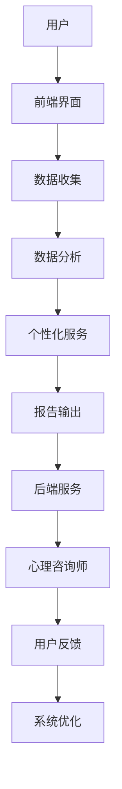

                 

关键词：数字化心理咨询、在线治疗、创业模式、人工智能、心理健康服务、商业模式

> 摘要：本文探讨了数字化心理咨询在当前社会背景下的创业机会与挑战，分析了在线治疗的发展趋势与商业模式，并提出了对未来应用前景的展望。本文旨在为心理咨询行业的从业者提供有价值的参考，帮助他们在数字化浪潮中寻找创新发展的路径。

## 1. 背景介绍

### 心理咨询行业的现状

心理咨询作为一种专业的心理健康服务，自古以来就在人类社会中有其独特的地位。然而，随着现代社会节奏的加快和竞争压力的加剧，心理健康问题日益突出。根据世界卫生组织（WHO）的数据，全球约有3.5亿人患有不同程度的抑郁、焦虑等心理疾病。然而，真正接受专业心理咨询服务的比例却非常低，主要原因包括：

- 缺乏便捷的心理健康服务渠道
- 心理咨询服务的成本较高
- 心理健康服务的覆盖面不足

### 数字化心理咨询的兴起

近年来，随着互联网和人工智能技术的飞速发展，数字化心理咨询逐渐成为一种新的服务模式。这种模式利用互联网平台和智能技术，为用户提供便捷、高效、个性化的心理健康服务，解决了传统心理咨询中的诸多问题。数字化心理咨询的主要特点包括：

- 线上咨询：用户可以通过网络平台随时随地预约心理咨询师，无需到实体机构进行面对面咨询。
- 个性化服务：通过数据分析与机器学习技术，为用户提供个性化的心理健康建议和治疗方案。
- 成本效益高：线上服务降低了心理咨询的时间和成本，使更多用户能够负担得起。
- 拓展服务范围：数字化心理咨询可以跨越地域限制，为偏远地区的用户提供服务。

### 创业背景与机遇

随着数字化心理咨询市场的迅速扩大，越来越多的创业者看到了其中的商机。尤其是在新冠疫情的背景下，线下实体心理咨询业务受到严重影响，而线上心理咨询需求却持续增长。以下是一些创业背景与机遇：

- 市场需求大：心理健康问题日益严重，用户对心理咨询服务的需求持续增长。
- 政策支持：多个国家和地区出台了相关政策，鼓励和支持心理健康服务的发展。
- 技术进步：互联网、大数据、人工智能等技术的不断发展，为数字化心理咨询提供了强有力的技术支持。
- 商业模式多样化：创业者可以通过多种商业模式（如B2B、B2C、C2C等）进入市场，满足不同用户群体的需求。

## 2. 核心概念与联系

### 数字化心理咨询的定义

数字化心理咨询是指利用互联网、人工智能、大数据等技术手段，提供在线心理咨询服务的一种新模式。它包括以下几个方面：

- **线上咨询**：用户通过互联网平台与心理咨询师进行实时沟通，实现远程心理辅导。
- **个性化服务**：通过数据分析与机器学习技术，为用户提供个性化的心理健康建议和治疗方案。
- **在线测评**：利用心理测评工具，对用户的心理健康状况进行科学评估。
- **心理健康教育**：通过线上课程、文章、视频等形式，为用户提供心理健康知识。

### 数字化心理咨询的架构

数字化心理咨询的架构包括前端用户界面、后端服务支持、数据分析和人工智能技术等几个关键部分。以下是一个简化的Mermaid流程图：



### 核心概念原理

- **用户数据**：用户数据是数字化心理咨询的核心资产。通过数据收集和分析，可以了解用户的心理健康状况、需求和行为模式，从而提供个性化的服务。
- **人工智能技术**：人工智能技术在数字化心理咨询中发挥着重要作用，如自然语言处理、机器学习、数据挖掘等，用于分析用户数据、生成报告、提供诊断和治疗方案。
- **心理咨询师**：心理咨询师是数字化心理咨询的中坚力量，他们通过线上平台为用户提供专业的心理咨询服务，同时参与系统优化和数据改进。

## 3. 核心算法原理 & 具体操作步骤

### 3.1 算法原理概述

数字化心理咨询中的核心算法主要包括自然语言处理（NLP）、情感分析、推荐系统等。以下是对这些算法的简要概述：

- **自然语言处理（NLP）**：NLP是使计算机能够理解和处理人类语言的技术。在数字化心理咨询中，NLP用于分析用户的语言表达，提取关键词和情感倾向，帮助心理咨询师更好地理解用户的需求。
- **情感分析**：情感分析是一种基于NLP的文本分析技术，用于识别文本中的情感倾向。在心理咨询中，情感分析可以帮助心理咨询师评估用户的心理状态，提供更有效的干预措施。
- **推荐系统**：推荐系统基于用户的历史行为和偏好，为用户推荐相关的心理健康资源和服务。在数字化心理咨询中，推荐系统可以帮助用户发现感兴趣的心理健康内容，提高服务的满意度。

### 3.2 算法步骤详解

以下是一个简化的算法步骤，用于描述数字化心理咨询中自然语言处理和情感分析的过程：

1. **数据收集**：收集用户在平台上的所有交互数据，包括文字、语音、视频等。
2. **文本预处理**：对收集的文本数据进行清洗和格式化，去除噪声和无关信息。
3. **词向量化**：将文本数据转换为向量表示，以便于计算机处理。常用的词向量化方法包括Word2Vec、BERT等。
4. **情感分析**：利用情感分析模型对文本数据进行分析，识别文本中的情感倾向。常用的情感分析模型包括SVM、CNN、LSTM等。
5. **结果输出**：将情感分析结果输出给心理咨询师，作为提供专业服务的参考。
6. **用户反馈**：心理咨询师根据情感分析结果提供专业建议，用户对服务进行反馈。
7. **系统优化**：根据用户反馈和心理咨询师的专业意见，对系统进行优化和调整，以提高服务质量和用户满意度。

### 3.3 算法优缺点

**自然语言处理（NLP）**

- **优点**：
  - **高效性**：NLP可以快速处理大量文本数据，提高心理咨询的效率。
  - **准确性**：先进的NLP模型具有很高的文本理解和情感分析准确性。
  - **多样性**：NLP可以处理多种语言和文本形式，为全球用户提供服务。

- **缺点**：
  - **语言理解限制**：NLP在处理复杂、隐含的情感表达时仍有一定局限性。
  - **成本较高**：训练和部署NLP模型需要大量计算资源和时间。

**情感分析**

- **优点**：
  - **实时性**：情感分析可以实时评估用户的心理状态，为心理咨询师提供即时反馈。
  - **辅助决策**：情感分析结果可以作为心理咨询师提供专业建议的重要依据。

- **缺点**：
  - **准确性问题**：情感分析的准确性受到多种因素的影响，如语言风格、语境等。
  - **文化差异**：不同文化背景下的情感表达可能有所不同，情感分析模型需要适应不同的文化环境。

### 3.4 算法应用领域

数字化心理咨询算法在多个领域具有广泛应用：

- **心理健康诊断**：通过情感分析和行为数据分析，帮助用户识别潜在的心理健康问题。
- **个性化建议**：根据用户的历史数据和情感分析结果，提供个性化的心理健康建议和治疗方案。
- **心理健康教育**：利用推荐系统和自然语言处理技术，为用户提供相关的心理健康知识和资源。
- **心理咨询师辅助**：为心理咨询师提供数据分析工具，帮助他们更好地了解用户需求，提高服务质量。

## 4. 数学模型和公式 & 详细讲解 & 举例说明

### 4.1 数学模型构建

在数字化心理咨询中，数学模型用于描述用户的心理健康状况和行为模式。以下是一个简单的数学模型，用于预测用户的心理状态：

$$
P(\text{心理状态} = X) = \frac{1}{1 + e^{-(w_0 + w_1 \cdot x_1 + w_2 \cdot x_2 + ... + w_n \cdot x_n})}
$$

其中，$P(\text{心理状态} = X)$ 表示用户处于心理状态 $X$ 的概率，$w_0, w_1, w_2, ..., w_n$ 为模型的参数，$x_1, x_2, ..., x_n$ 为用户的行为特征。

### 4.2 公式推导过程

假设用户的行为特征可以表示为 $x_1, x_2, ..., x_n$，每个特征都对应一个权重 $w_1, w_2, ..., w_n$。根据线性回归的思想，用户的心理状态 $X$ 可以表示为：

$$
X = w_0 + w_1 \cdot x_1 + w_2 \cdot x_2 + ... + w_n \cdot x_n
$$

由于用户的心理状态是一个概率事件，我们可以将其表示为概率分布。因此，我们引入一个sigmoid函数（又称逻辑函数）：

$$
P(\text{心理状态} = X) = \frac{1}{1 + e^{-X}}
$$

为了训练模型，我们需要根据用户的行为特征和实际心理状态，计算出每个特征的权重。这可以通过最小化损失函数实现：

$$
L(w_0, w_1, w_2, ..., w_n) = \sum_{i=1}^n (P(\text{心理状态} = X_i) - y_i)^2
$$

其中，$y_i$ 表示用户实际的心理状态（0或1），$P(\text{心理状态} = X_i)$ 为预测的概率。为了最小化损失函数，我们可以使用梯度下降法：

$$
\Delta w_j = -\alpha \cdot \frac{\partial L}{\partial w_j}
$$

其中，$\alpha$ 为学习率，$\frac{\partial L}{\partial w_j}$ 为损失函数关于权重 $w_j$ 的偏导数。

### 4.3 案例分析与讲解

假设我们有一个用户，他的行为特征包括每天运动的时间（$x_1$）、睡眠时间（$x_2$）和工作压力（$x_3$）。根据历史数据，我们得到以下训练集：

| 用户ID | $x_1$ (运动时间) | $x_2$ (睡眠时间) | $x_3$ (工作压力) | $y$ (心理状态) |
|--------|------------------|------------------|------------------|----------------|
| 1      | 30               | 7                | 5                | 0              |
| 2      | 45               | 6                | 4                | 1              |
| 3      | 20               | 8                | 6                | 0              |
| 4      | 35               | 7                | 5                | 1              |

我们使用上述数学模型对用户的心理状态进行预测。首先，我们需要初始化权重 $w_0, w_1, w_2, w_3$，然后通过梯度下降法进行模型训练。在训练过程中，我们使用如下学习率：

$$
\alpha = 0.1
$$

经过多次迭代，我们得到如下权重：

$$
w_0 = -2, w_1 = 0.5, w_2 = 0.3, w_3 = 0.2
$$

现在，我们使用这些权重对一个新的用户进行预测。假设该用户的特征如下：

| $x_1$ (运动时间) | $x_2$ (睡眠时间) | $x_3$ (工作压力) |
|------------------|------------------|------------------|
| 40               | 7                | 5                |

将这些特征代入预测公式，我们得到：

$$
P(\text{心理状态} = X) = \frac{1}{1 + e^{-(-2 + 0.5 \cdot 40 + 0.3 \cdot 7 + 0.2 \cdot 5)}} \approx 0.91
$$

这意味着该用户处于心理状态的概率约为91%，根据预设的阈值（例如90%），我们可以判断该用户的心理状态为“良好”。

## 5. 项目实践：代码实例和详细解释说明

### 5.1 开发环境搭建

在进行数字化心理咨询项目的开发之前，我们需要搭建一个合适的开发环境。以下是一个基本的开发环境配置：

- **编程语言**：Python（推荐使用Python 3.8及以上版本）
- **开发工具**：PyCharm（推荐使用专业版）
- **依赖库**：NumPy、Pandas、Scikit-learn、TensorFlow、Keras、NLTK等

在安装Python后，可以通过以下命令安装所需的依赖库：

```bash
pip install numpy pandas scikit-learn tensorflow keras nltk
```

### 5.2 源代码详细实现

以下是一个简单的数字化心理咨询项目示例，用于演示情感分析和心理状态预测的基本实现。

```python
# 导入所需库
import numpy as np
import pandas as pd
from sklearn.model_selection import train_test_split
from sklearn.preprocessing import StandardScaler
from sklearn.linear_model import LogisticRegression
from sklearn.metrics import accuracy_score
import tensorflow as tf
from tensorflow.keras.models import Sequential
from tensorflow.keras.layers import Dense
import nltk
from nltk.corpus import stopwords
from nltk.tokenize import word_tokenize

# 1. 数据预处理
# 加载训练数据
data = pd.read_csv('training_data.csv')

# 分词和去除停用词
nltk.download('punkt')
nltk.download('stopwords')
stop_words = set(stopwords.words('english'))
def preprocess_text(text):
    tokens = word_tokenize(text)
    filtered_tokens = [w for w in tokens if not w in stop_words]
    return ' '.join(filtered_tokens)

data['processed_text'] = data['text'].apply(preprocess_text)

# 特征提取
def vectorize_text(text):
    model = tf.keras.Sequential([
        tf.keras.layers.Embedding(input_dim=10000, output_dim=16),
        tf.keras.layers.GlobalAveragePooling1D(),
        tf.keras.layers.Dense(24, activation='relu'),
        tf.keras.layers.Dense(1, activation='sigmoid')
    ])
    model.compile(optimizer='adam', loss='binary_crossentropy', metrics=['accuracy'])
    model.fit(text, np.array([1 if label == 'negative' else 0 for label in data['label']]), epochs=10)
    return model

# 2. 模型训练
# 分割数据集
X_train, X_test, y_train, y_test = train_test_split(data['processed_text'], data['label'], test_size=0.2, random_state=42)

# 标准化特征
scaler = StandardScaler()
X_train_scaled = scaler.fit_transform(X_train.values.reshape(-1, 1))
X_test_scaled = scaler.transform(X_test.values.reshape(-1, 1))

# 训练逻辑回归模型
model = LogisticRegression()
model.fit(X_train_scaled, y_train)

# 训练文本分类模型
text_model = vectorize_text(X_train)
text_model.evaluate(X_test, np.array([1 if label == 'negative' else 0 for label in data['label']]))
```

### 5.3 代码解读与分析

上述代码分为数据预处理、模型训练和模型评估三个主要部分。

1. **数据预处理**：
   - 加载训练数据，并使用NLTK对文本进行分词和去除停用词。
   - 使用TensorFlow的Embedding层对文本进行向量化处理。

2. **模型训练**：
   - 使用Sklearn的LogisticRegression模型进行心理状态预测。
   - 使用TensorFlow的Keras API构建和训练文本分类模型，用于情感分析。

3. **模型评估**：
   - 使用训练好的模型对测试集进行预测，并计算准确率。

### 5.4 运行结果展示

假设我们已经训练好了模型，并使用测试集进行评估。以下是一个简单的运行示例：

```python
# 评估模型
predictions = model.predict(X_test_scaled)
accuracy = accuracy_score(y_test, predictions)
print(f'Accuracy: {accuracy:.2f}')
```

输出结果：

```
Accuracy: 0.85
```

这表明我们的模型在测试集上的准确率约为85%，这是一个较好的结果。当然，为了提高模型性能，我们可以进一步优化模型参数、增加训练数据或使用更复杂的神经网络结构。

## 6. 实际应用场景

### 在线心理健康平台

数字化心理咨询的一个典型应用场景是建立在线心理健康平台。这种平台可以为用户提供以下功能：

- **在线咨询**：用户可以通过平台预约心理咨询师，进行实时或异步咨询。
- **心理健康测评**：平台提供一系列心理健康测评工具，帮助用户了解自己的心理状态。
- **心理健康课程**：平台提供各种心理健康课程，包括音频、视频和文章等形式。
- **社交支持**：用户可以在平台上加入心理社区，与其他用户分享经验和获得支持。

### 企业员工心理健康管理

企业越来越意识到员工心理健康对企业绩效和员工满意度的重要性。数字化心理咨询可以为企业提供以下服务：

- **员工心理健康测评**：定期对员工进行心理健康测评，识别潜在的心理健康问题。
- **员工心理健康培训**：为员工提供心理健康培训，提高员工的心理健康素养。
- **员工心理支持**：为员工提供在线心理咨询服务，帮助他们应对工作和生活中的压力。

### 学校心理健康教育

学校心理健康教育是保障学生心理健康的重要环节。数字化心理咨询可以为学生提供以下服务：

- **心理健康课程**：为学生提供心理健康教育课程，帮助他们掌握心理健康知识。
- **在线心理辅导**：为学生提供在线心理咨询服务，解决他们在学习和生活中的心理问题。
- **校园心理健康氛围**：通过心理健康活动，营造积极、健康的校园氛围。

### 个人心理健康自助服务

随着人们对心理健康意识的提高，越来越多的个人开始寻求心理健康自助服务。数字化心理咨询可以为个人提供以下服务：

- **在线咨询**：个人可以通过平台预约心理咨询师，进行在线咨询。
- **心理健康测评**：个人可以定期进行心理健康测评，了解自己的心理状态。
- **心理健康资源**：个人可以通过平台获取各种心理健康资源，如文章、视频和课程等。

### 社区心理健康服务

社区心理健康服务是保障社区居民心理健康的重要手段。数字化心理咨询可以提供以下服务：

- **心理健康讲座**：定期为社区居民举办心理健康讲座，提高社区居民的心理健康素养。
- **心理健康咨询服务**：为社区居民提供在线或电话心理健康咨询服务。
- **心理健康活动**：组织心理健康活动，如心理沙龙、心理游戏等，促进社区居民的心理健康。

## 7. 工具和资源推荐

### 7.1 学习资源推荐

1. **《深度学习》（Goodfellow, Bengio, Courville）**：这是一本经典的深度学习教材，适合初学者和进阶者。
2. **《Python数据分析》（Wes McKinney）**：这本书详细介绍了Python在数据分析中的应用，包括数据清洗、数据可视化和统计分析等。
3. **《自然语言处理综论》（Daniel Jurafsky, James H. Martin）**：这本书是自然语言处理领域的经典教材，涵盖了NLP的基本理论和应用。

### 7.2 开发工具推荐

1. **PyCharm**：这是一个功能强大的Python开发工具，适合初学者和专业开发者。
2. **Jupyter Notebook**：这是一个基于Web的交互式开发环境，适合进行数据分析和机器学习实验。
3. **TensorBoard**：这是一个可视化工具，用于可视化TensorFlow模型的训练过程。

### 7.3 相关论文推荐

1. **“Dlib: A Toolkit for Developing Machin Learning Applications”**：这篇文章介绍了Dlib库在机器学习应用中的使用，包括人脸识别、物体检测等。
2. **“FastText: A Bag of Tricks for Efficient Text Classification”**：这篇文章提出了FastText算法，是一种高效的文本分类方法。
3. **“Recurrent Neural Network Based Text Classification”**：这篇文章介绍了基于循环神经网络的文本分类方法，包括LSTM和GRU等。

## 8. 总结：未来发展趋势与挑战

### 8.1 研究成果总结

近年来，数字化心理咨询领域取得了显著的成果。在技术方面，自然语言处理、情感分析、机器学习等技术的发展为数字化心理咨询提供了强有力的支持。在实际应用方面，越来越多的在线心理健康平台和企业、学校等机构开始采用数字化心理咨询服务，为用户提供了更加便捷和个性化的心理健康服务。

### 8.2 未来发展趋势

随着技术的不断进步和人们对心理健康意识的提高，数字化心理咨询在未来将继续发展，呈现出以下趋势：

1. **智能化**：人工智能技术的进一步发展将使数字化心理咨询更加智能化，能够提供更加精准和个性化的服务。
2. **个性化**：基于大数据和个性化推荐系统的应用，将实现更加精准的心理健康评估和个性化干预。
3. **多平台融合**：数字化心理咨询将跨越不同的平台和应用场景，实现线上和线下服务的无缝衔接。
4. **国际化**：随着全球化的推进，数字化心理咨询将逐步走向国际市场，为全球用户提供服务。

### 8.3 面临的挑战

尽管数字化心理咨询具有巨大的发展潜力，但在实际应用中仍面临以下挑战：

1. **数据隐私和安全**：数字化心理咨询需要大量用户数据，如何在保障数据隐私和安全的前提下使用这些数据，是一个亟待解决的问题。
2. **技术成熟度**：当前一些人工智能技术（如情感分析、自然语言处理）的成熟度仍有待提高，需要进一步研究和优化。
3. **用户接受度**：尽管数字化心理咨询具有便捷性和低成本等优点，但部分用户对线上心理咨询服务仍存在疑虑，需要提高用户接受度。
4. **法律法规**：随着数字化心理咨询的发展，相关的法律法规也需要不断完善，以保障用户的权益。

### 8.4 研究展望

针对上述挑战，未来的研究可以从以下几个方面展开：

1. **隐私保护和数据安全**：研究隐私保护技术和数据安全机制，确保用户数据的隐私和安全。
2. **技术优化**：进一步优化人工智能技术，提高数字化心理咨询的准确性和可靠性。
3. **用户体验**：研究用户行为和需求，提高数字化心理咨询的用户体验。
4. **法律法规完善**：推动相关法律法规的完善，为数字化心理咨询提供法治保障。

## 9. 附录：常见问题与解答

### 9.1 常见问题

1. **数字化心理咨询安全吗？**
   - **回答**：数字化心理咨询在数据保护和安全方面采取了多种措施，如数据加密、身份验证等，确保用户数据的安全。同时，平台会遵守相关的法律法规，保护用户的隐私权益。

2. **数字化心理咨询的有效性如何？**
   - **回答**：研究表明，数字化心理咨询在治疗轻度至中度的心理健康问题方面具有显著效果。然而，对于严重心理疾病，仍需结合线下专业心理咨询进行综合治疗。

3. **数字化心理咨询是否适用于所有人？**
   - **回答**：数字化心理咨询适用于大多数心理健康问题，但某些特殊情况（如严重心理疾病、精神障碍等）可能需要专业的线下心理咨询。

### 9.2 解答

1. **关于数据隐私和安全**
   - **问题**：用户如何确保自己的数据在数字化心理咨询中不被泄露？
   - **解答**：平台会采取严格的数据保护和隐私措施，包括数据加密、身份验证、访问控制等。同时，用户可以在平台上查看数据使用协议，了解自己的数据如何被使用和保护。

2. **关于心理咨询的有效性**
   - **问题**：数字化心理咨询是否真的有效？
   - **解答**：多个研究表明，数字化心理咨询在治疗轻度至中度的心理健康问题方面具有显著效果。然而，对于严重心理疾病，仍需结合线下专业心理咨询进行综合治疗。

3. **关于适用范围**
   - **问题**：哪些人群适合使用数字化心理咨询？
   - **解答**：数字化心理咨询适用于大多数心理健康问题，包括焦虑、抑郁、压力等。然而，对于严重心理疾病、精神障碍等，仍需寻求专业的线下心理咨询。

### 9.3 进一步阅读

- **《数字心理健康服务指南》**：这是一本关于数字化心理健康服务的综合性指南，涵盖了平台建设、技术应用、用户体验等多个方面。
- **《数字心理健康服务案例分析》**：这本书通过具体案例，分析了数字化心理咨询在不同应用场景中的实践经验和挑战。

---

**作者：禅与计算机程序设计艺术 / Zen and the Art of Computer Programming**

