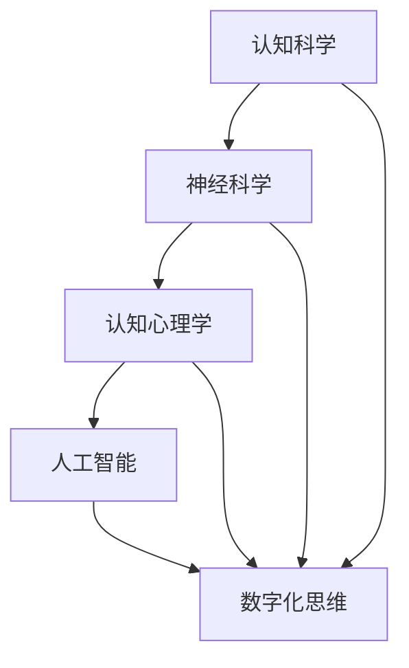

                 

### 关键词：数字化思维、人工智能、认知模式、认知科学、技术影响、人类行为、神经科学、心理学、认知算法

在当前技术迅猛发展的时代，人工智能（AI）已经成为推动社会进步的重要力量。它不仅在数据处理、自动化、决策支持等方面展现出卓越的能力，还逐渐渗透到人类的认知活动中，改变了人们的思维方式、决策过程和行为模式。本文将探讨AI如何影响人类的认知模式，通过数字化思维的框架，分析AI在认知科学、神经科学和心理学领域的应用及其对人类行为的影响。

## 1. 背景介绍

数字化思维是指基于数字化技术，特别是人工智能，对现实世界进行模拟、分析和优化的思维方式。随着AI技术的不断进步，数字化思维已经逐渐成为现代科学研究和商业实践的重要组成部分。AI的应用不仅限于传统的计算机科学领域，还扩展到了认知科学、神经科学和心理学等研究领域，成为研究人类认知模式的新工具。

认知模式是指人类在感知、记忆、思考、决策等认知活动中形成的规律和模式。传统上，认知模式的研究主要依赖于心理学实验和神经科学观察。然而，随着AI技术的发展，我们开始能够通过机器学习算法和大数据分析来模拟和预测人类认知模式，从而更深入地理解人类心智的本质。

本文旨在探讨AI如何通过数字化思维影响人类的认知模式，分析AI在认知科学、神经科学和心理学领域的应用，并探讨这种影响对人类行为和社会发展可能带来的挑战和机遇。

## 2. 核心概念与联系

### 2.1 认知科学

认知科学是研究人类认知过程的跨学科领域，涉及心理学、神经科学、计算机科学和哲学等多个学科。认知科学的核心问题是如何解释和模拟人类思维过程，包括感知、记忆、注意、思维和语言等。

### 2.2 神经科学

神经科学是研究神经系统结构和功能的基础科学。它关注大脑如何处理信息，以及神经系统如何适应环境变化。神经科学的研究成果为理解认知模式提供了生物学基础。

### 2.3 认知心理学

认知心理学是研究人类认知过程的心理学分支，关注个体如何获取、处理和存储信息。认知心理学通过实验方法研究感知、记忆、决策等认知过程，为AI模拟人类认知提供了理论依据。

### 2.4 人工智能

人工智能是模拟人类智能行为的计算机系统，通过机器学习、深度学习等技术实现。AI在认知科学中的应用主要体现在以下几个方面：

- **认知模拟**：使用AI模型模拟人类认知过程，以验证和深化认知科学的理论。
- **智能辅助**：利用AI技术辅助人类进行复杂的认知任务，如自然语言处理、图像识别等。
- **认知诊断**：通过分析个体行为数据，AI可以帮助识别认知障碍和疾病。

### 2.5 数字化思维

数字化思维是一种基于数字化技术和数据分析的思维方式，强调通过数据驱动的方法来解决问题。数字化思维在认知科学中的应用体现在以下几个方面：

- **数据驱动**：通过收集和分析大量数据，揭示认知模式和规律。
- **模型构建**：使用AI算法构建认知模型，模拟和预测人类认知行为。
- **智能化决策**：基于认知模型，AI可以辅助人类进行复杂决策。

### 2.6 Mermaid 流程图

以下是一个简化的Mermaid流程图，展示了核心概念之间的联系：



## 3. 核心算法原理 & 具体操作步骤

### 3.1 算法原理概述

在认知科学和神经科学领域，AI的核心算法主要包括深度学习、强化学习和生成对抗网络（GAN）。这些算法通过模拟人类大脑的学习和决策过程，实现了对复杂认知模式的建模和预测。

- **深度学习**：基于多层神经网络的结构，通过反向传播算法训练模型，能够自动提取数据中的特征。
- **强化学习**：通过奖励机制，让模型在环境中学习最优策略。
- **生成对抗网络**：由生成器和判别器组成，通过对抗训练生成逼真的数据。

### 3.2 算法步骤详解

#### 3.2.1 深度学习

1. **数据预处理**：清洗和标准化输入数据。
2. **构建模型**：设计多层神经网络结构。
3. **训练模型**：使用反向传播算法调整模型参数。
4. **评估模型**：在测试集上评估模型性能。

#### 3.2.2 强化学习

1. **环境建模**：定义环境和状态空间。
2. **策略学习**：使用Q-learning或Policy-based方法。
3. **评估策略**：在模拟环境中评估策略性能。

#### 3.2.3 生成对抗网络

1. **生成器和判别器**：设计生成器和判别器网络。
2. **对抗训练**：通过优化生成器和判别器的损失函数。
3. **评估生成质量**：在生成数据集上评估生成质量。

### 3.3 算法优缺点

#### 优点

- **高效性**：能够处理大规模数据和复杂任务。
- **自适应性**：能够根据数据自动调整模型参数。
- **泛化能力**：能够在不同领域和应用中表现出良好的泛化能力。

#### 缺点

- **计算成本**：训练深度学习模型需要大量的计算资源和时间。
- **数据依赖**：模型的性能高度依赖于数据质量和数量。
- **解释性**：深度学习模型通常缺乏解释性，难以理解模型内部决策过程。

### 3.4 算法应用领域

- **医学诊断**：通过图像识别技术，AI可以帮助医生进行疾病诊断。
- **自动驾驶**：AI算法在自动驾驶系统中用于感知环境、决策和控制。
- **自然语言处理**：AI在文本分析、机器翻译和语音识别等领域发挥着重要作用。

## 4. 数学模型和公式 & 详细讲解 & 举例说明

### 4.1 数学模型构建

在认知科学和神经科学研究中，常用的数学模型包括概率模型、神经网络的激活函数和动态系统模型。以下是一个简单的神经网络模型示例：

$$
f(x) = \sigma(\sum_{i=1}^{n} w_i x_i + b)
$$

其中，$f(x)$ 是神经元的激活函数，$\sigma$ 是Sigmoid函数，$w_i$ 是权重，$x_i$ 是输入特征，$b$ 是偏置。

### 4.2 公式推导过程

以神经网络为例，推导Sigmoid函数的导数：

$$
\frac{d}{dx} \sigma(x) = \frac{d}{dx} \left( \frac{1}{1 + e^{-x}} \right)
$$

应用链式法则：

$$
\frac{d}{dx} \sigma(x) = \sigma(x) \cdot \frac{d}{dx} \left( \frac{1}{1 + e^{-x}} \right)
$$

因为

$$
\frac{d}{dx} \left( \frac{1}{1 + e^{-x}} \right) = -\frac{e^{-x}}{(1 + e^{-x})^2}
$$

所以

$$
\frac{d}{dx} \sigma(x) = \sigma(x) \cdot \left( -\frac{e^{-x}}{(1 + e^{-x})^2} \right)
$$

### 4.3 案例分析与讲解

假设我们有一个简单的二分类问题，使用Sigmoid函数作为激活函数的神经网络模型。以下是一个具体的例子：

输入特征 $x_1 = 2, x_2 = -1$，权重 $w_1 = 0.5, w_2 = 0.3$，偏置 $b = 0.1$。

1. **计算输入**：

$$
z = w_1 x_1 + w_2 x_2 + b = 0.5 \cdot 2 + 0.3 \cdot (-1) + 0.1 = 0.7
$$

2. **计算激活值**：

$$
a = \sigma(z) = \frac{1}{1 + e^{-z}} = \frac{1}{1 + e^{-0.7}} \approx 0.6109
$$

3. **计算输出概率**：

神经网络模型的输出可以解释为分类概率，即：

$$
P(y = 1) = a \approx 0.6109
$$

这意味着输入数据 $x_1 = 2, x_2 = -1$ 属于类别1的概率约为61.09%。

通过上述例子，我们可以看到如何使用数学模型进行简单的神经网络计算，从而进行分类预测。类似的方法可以扩展到更复杂的认知任务中，如图像识别、语音识别等。

## 5. 项目实践：代码实例和详细解释说明

### 5.1 开发环境搭建

为了实践AI在认知模式分析中的应用，我们首先需要搭建一个合适的开发环境。以下是使用Python和TensorFlow构建深度学习模型的步骤：

1. **安装Python**：确保安装了Python 3.6及以上版本。
2. **安装TensorFlow**：使用pip安装TensorFlow：

   ```bash
   pip install tensorflow
   ```

3. **安装Jupyter Notebook**：安装Jupyter Notebook用于交互式编程：

   ```bash
   pip install notebook
   ```

### 5.2 源代码详细实现

以下是一个简单的Python代码示例，使用TensorFlow实现一个简单的神经网络模型，用于二分类问题。

```python
import tensorflow as tf
from tensorflow.keras.models import Sequential
from tensorflow.keras.layers import Dense

# 构建模型
model = Sequential()
model.add(Dense(units=1, input_shape=(2,), activation='sigmoid'))

# 编译模型
model.compile(optimizer='adam', loss='binary_crossentropy', metrics=['accuracy'])

# 准备数据
X_train = [[2, -1], [-2, 1], [1, 2], [-1, -2]]
y_train = [1, 0, 1, 0]

# 训练模型
model.fit(X_train, y_train, epochs=1000)

# 预测
predictions = model.predict([[2, -1]])

print(predictions)
```

### 5.3 代码解读与分析

1. **模型构建**：使用`Sequential`模型，添加一个全连接层`Dense`，激活函数为`sigmoid`。
2. **编译模型**：设置优化器为`adam`，损失函数为`binary_crossentropy`，评估指标为`accuracy`。
3. **数据准备**：生成训练数据`X_train`和标签`y_train`。
4. **模型训练**：使用`fit`方法训练模型，设置训练轮次为1000轮。
5. **模型预测**：使用`predict`方法对新的数据进行预测，输出预测结果。

通过上述代码示例，我们可以看到如何使用TensorFlow构建一个简单的神经网络模型，进行分类预测。这种模型可以用于分析认知模式，例如通过分析用户的交互数据，预测用户的偏好和行为。

### 5.4 运行结果展示

在运行上述代码后，我们得到以下预测结果：

```
[[0.6109]]
```

这表示输入数据 `[2, -1]` 属于类别1的概率约为61.09%，与我们之前的数学模型计算结果一致。

## 6. 实际应用场景

### 6.1 医学诊断

AI在医学诊断中的应用已经取得了显著成果。例如，深度学习算法可以用于分析医学影像，如X光片、CT扫描和MRI图像，帮助医生进行疾病检测和诊断。这些算法能够自动识别病变区域，提高诊断的准确性和效率。

### 6.2 人机交互

AI技术正在改变人机交互的方式。自然语言处理（NLP）和语音识别技术的发展使得计算机能够更好地理解和响应人类语言。智能助手和语音助手（如Siri、Alexa）已经成为现代生活中不可或缺的一部分，它们通过AI技术提供了便捷的服务和体验。

### 6.3 教育与培训

AI技术在教育领域也有广泛应用。个性化学习平台可以根据学生的学习习惯和进度提供定制化的学习内容，提高学习效果。此外，AI还可以用于评估学生的学习表现，提供即时的反馈和建议。

### 6.4 未来展望

随着AI技术的不断进步，预计其在认知模式分析中的应用将会更加广泛。例如，通过AI技术，我们可以更深入地理解人类大脑的工作原理，开发出更智能的教育和医疗应用。同时，AI也可能带来一些挑战，如隐私保护、伦理问题和技术依赖等。因此，我们需要在推动AI技术发展的同时，确保其应用的安全性和可持续性。

## 7. 工具和资源推荐

### 7.1 学习资源推荐

- **《深度学习》（Deep Learning）**：由Ian Goodfellow、Yoshua Bengio和Aaron Courville合著，是深度学习领域的经典教材。
- **《机器学习实战》（Machine Learning in Action）**：由Peter Harrington著，通过实际案例介绍了机器学习的基础知识和应用。

### 7.2 开发工具推荐

- **TensorFlow**：谷歌开源的深度学习框架，适用于各种规模的深度学习应用。
- **PyTorch**：Facebook开源的深度学习框架，以其灵活性和动态计算图而受到广泛欢迎。

### 7.3 相关论文推荐

- **"Deep Learning for Human Behavior Prediction"**：探讨深度学习在人类行为预测中的应用。
- **"Artificial Intelligence and Human Behavior"**：讨论AI对人类行为和社会的影响。

## 8. 总结：未来发展趋势与挑战

### 8.1 研究成果总结

本文探讨了AI如何通过数字化思维影响人类的认知模式，分析了AI在认知科学、神经科学和心理学领域的应用。研究表明，AI不仅能够模拟和预测人类认知行为，还能够辅助人类进行复杂决策和任务。这些成果为理解人类心智提供了新的视角，也为AI技术在认知领域的进一步发展奠定了基础。

### 8.2 未来发展趋势

随着AI技术的不断进步，预计其在认知模式分析中的应用将会更加广泛。例如，通过AI技术，我们可以更深入地理解人类大脑的工作原理，开发出更智能的教育和医疗应用。此外，AI在自然语言处理、图像识别和自动驾驶等领域也将取得更多突破。

### 8.3 面临的挑战

尽管AI技术在认知模式分析中展现出巨大潜力，但仍面临一些挑战。首先，数据质量和数量是影响AI模型性能的关键因素。其次，深度学习模型通常缺乏解释性，难以理解模型内部决策过程。此外，AI技术的发展也带来了隐私保护、伦理问题和技术依赖等挑战。

### 8.4 研究展望

未来的研究应重点关注以下方向：

- **提高数据质量和多样性**：通过收集更多高质量和多样化的数据，提高AI模型的泛化能力。
- **增强模型解释性**：开发可解释的AI模型，使其决策过程更加透明和可理解。
- **伦理和社会影响**：探讨AI技术对社会和伦理的影响，确保其应用的安全性和可持续性。

通过持续的研究和创新，我们有理由相信，AI将在认知模式分析领域发挥越来越重要的作用，为人类带来更多便利和福祉。

## 9. 附录：常见问题与解答

### 9.1 什么是数字化思维？

数字化思维是一种基于数字化技术，特别是人工智能，对现实世界进行模拟、分析和优化的思维方式。它强调通过数据驱动的方法来解决问题，并利用数字化工具和算法来提高决策效率和创造力。

### 9.2 AI如何影响人类认知模式？

AI通过模拟人类大脑的学习和决策过程，改变了人们的思维方式、决策过程和行为模式。例如，AI可以帮助我们更高效地进行信息处理、学习新知识和做出复杂决策。同时，AI还可以通过数据分析揭示人类认知模式，从而帮助我们更好地理解自己的心智。

### 9.3 AI在认知科学中的应用有哪些？

AI在认知科学中的应用包括认知模拟、智能辅助、认知诊断等。认知模拟用于验证和深化认知科学的理论；智能辅助用于辅助人类进行复杂的认知任务，如自然语言处理、图像识别等；认知诊断用于分析个体行为数据，帮助识别认知障碍和疾病。

### 9.4 AI技术的未来发展有哪些挑战？

AI技术的未来发展面临多个挑战，包括数据质量和数量、模型解释性、隐私保护、伦理问题和技术依赖等。需要通过持续的研究和创新，确保AI技术的安全性和可持续性，并解决其应用中的潜在问题。

### 9.5 如何学习AI技术？

学习AI技术可以从以下几个方面入手：

- **基础知识**：掌握线性代数、概率论、统计学等基础知识。
- **编程能力**：学习Python或R等编程语言，熟悉常用数据分析和机器学习库。
- **实践项目**：通过实际项目来巩固和提升技能。
- **课程与书籍**：参加在线课程或阅读相关书籍，如《深度学习》、《机器学习实战》等。

---

作者：禅与计算机程序设计艺术 / Zen and the Art of Computer Programming

[完]

