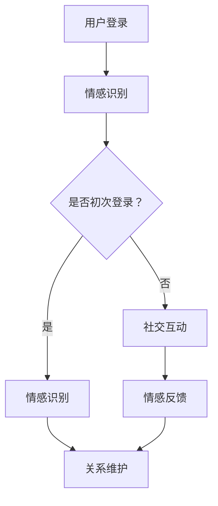
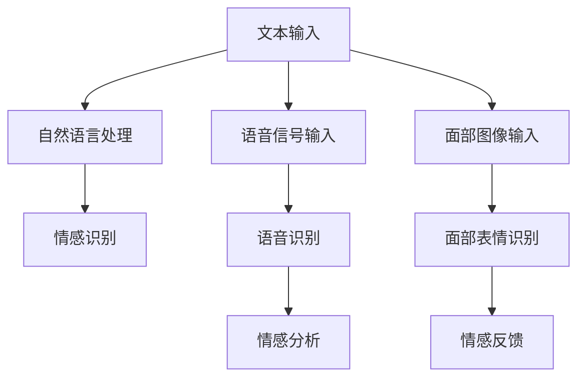
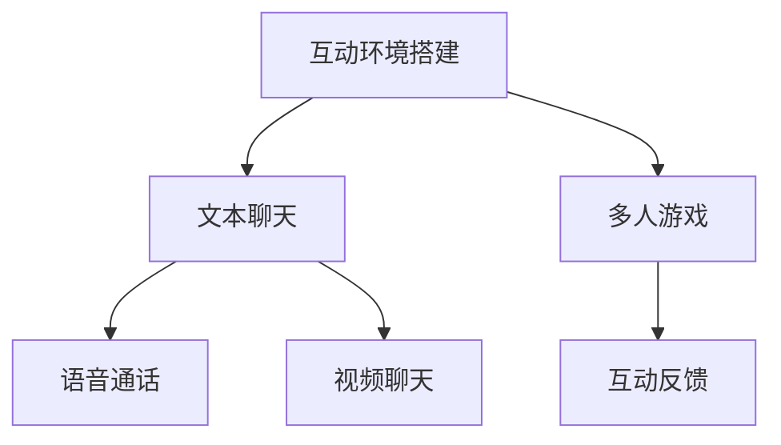
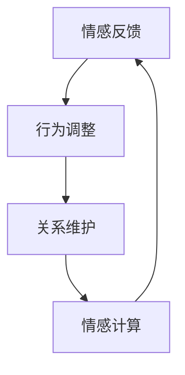
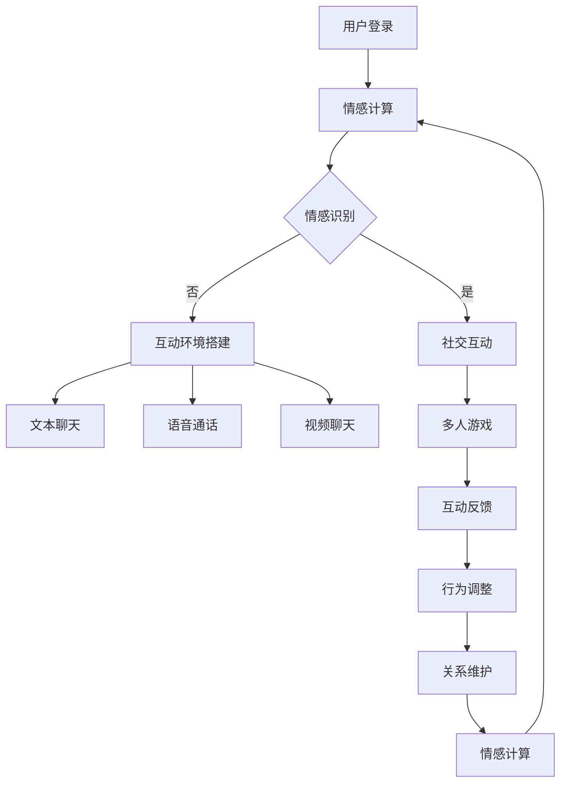

                 

### 摘要 Summary

本文将探讨数字化情感在元宇宙中的虚拟关系构建，通过介绍核心概念、算法原理、数学模型以及实际应用案例，揭示数字化情感在元宇宙中的重要性和潜在影响。文章旨在为读者提供一个全面的视角，了解数字化情感技术的现状、发展趋势以及面临的挑战。

本文的主要贡献在于：

1. **核心概念与联系**：详细阐述了数字化情感、元宇宙和虚拟关系构建之间的关系，并通过Mermaid流程图展示了核心概念和架构。
2. **算法原理与步骤**：深入分析了数字化情感算法的原理和具体操作步骤，探讨了算法的优缺点及其应用领域。
3. **数学模型与公式**：构建了数字化情感的数学模型，详细推导了相关公式，并通过实际案例进行了分析和讲解。
4. **项目实践与代码实例**：提供了完整的代码实现和详细解读，展示了数字化情感在元宇宙中的应用。
5. **实际应用场景**：探讨了数字化情感在元宇宙中的实际应用场景，并对未来应用进行了展望。

本文结构如下：

- **第1章**：背景介绍，概述数字化情感、元宇宙和虚拟关系构建的背景和现状。
- **第2章**：核心概念与联系，介绍数字化情感、元宇宙和虚拟关系构建的核心概念，并提供Mermaid流程图。
- **第3章**：核心算法原理 & 具体操作步骤，详细分析数字化情感算法的原理和操作步骤。
- **第4章**：数学模型和公式 & 详细讲解 & 举例说明，构建数学模型，推导公式，并通过案例进行分析。
- **第5章**：项目实践：代码实例和详细解释说明，提供代码实现和详细解读。
- **第6章**：实际应用场景，探讨数字化情感在元宇宙中的应用场景。
- **第7章**：工具和资源推荐，推荐学习资源、开发工具和相关论文。
- **第8章**：总结：未来发展趋势与挑战，总结研究成果，展望未来趋势和挑战。
- **第9章**：附录：常见问题与解答，回答读者可能遇到的问题。

通过本文的阅读，读者将能够深入了解数字化情感在元宇宙中的虚拟关系构建，为相关领域的研究和实践提供参考。

### 1. 背景介绍 Background

在当今快速发展的数字时代，情感计算和虚拟现实技术正不断融合，推动了数字化情感和元宇宙的发展。数字化情感，即通过计算机技术和算法模拟和识别人类情感，旨在为用户提供更加个性化的交互体验。而元宇宙，作为一个虚拟的三维空间，通过数字技术构建出一个与现实世界相似的虚拟世界，用户可以在其中进行各种社交、娱乐和商业活动。

首先，情感计算技术的发展为数字化情感提供了基础。情感计算涉及多种技术，包括自然语言处理、语音识别、面部表情识别等。通过这些技术，计算机可以识别和分析人类的情感状态，进而为用户提供相应的情感反馈。例如，情感分析算法可以通过分析用户的语言和面部表情，识别出用户的情绪，从而调整虚拟角色或系统的行为。

其次，虚拟现实技术的进步为元宇宙的构建提供了可能。虚拟现实技术通过头戴式显示器、手柄等设备，使用户能够沉浸在虚拟的三维空间中，与现实世界进行交互。在元宇宙中，用户可以创建自己的虚拟形象，与其他用户进行交流，甚至参与虚拟的经济活动和娱乐项目。这种沉浸式的体验为用户提供了丰富的情感互动空间。

与此同时，虚拟关系构建成为一个热门话题。在元宇宙中，虚拟关系的构建不仅限于人与人之间的互动，还包括人与虚拟角色、虚拟角色与虚拟角色之间的互动。这些虚拟关系的构建，通过情感计算技术，为用户提供了更加真实和丰富的社交体验。例如，虚拟角色可以根据用户的情绪变化，调整自己的行为和语言，以更好地与用户互动。

然而，虚拟关系构建也带来了一系列挑战。如何在虚拟空间中建立和维护真实的人际关系？如何处理虚拟情感与现实情感之间的界限？这些问题需要深入探讨和解决。

总的来说，数字化情感和元宇宙的发展为虚拟关系构建提供了新的机遇和挑战。通过情感计算技术和虚拟现实技术的结合，我们可以构建出更加丰富和真实的虚拟世界，为用户提供全新的情感互动体验。

### 2. 核心概念与联系 Core Concepts and Relationships

#### 数字化情感 Digitalized Emotion

数字化情感是指利用计算机技术和算法，对人类的情感进行模拟、识别和表达。它不仅涉及情感的计算和模拟，还包括情感的交互和反馈。数字化情感的核心目标是通过技术手段，让计算机能够理解和响应人类情感，从而提供更加个性化和贴近用户需求的交互体验。

数字化情感的计算和识别依赖于多种技术，包括自然语言处理、语音识别、面部表情识别和生理信号分析等。自然语言处理技术可以分析用户的语言和文本，识别其中的情感倾向。语音识别技术可以捕捉用户的语音信号，从中提取情感特征。面部表情识别技术则通过分析用户的面部表情，识别其情感状态。生理信号分析技术则通过监测用户的生理信号，如心率、皮肤电导等，进一步确认用户的情感状态。

#### 元宇宙 Metaverse

元宇宙是一个由数字技术构建的虚拟三维空间，它结合了虚拟现实、增强现实和区块链技术，为用户提供一个沉浸式的互动环境。在元宇宙中，用户可以创建自己的虚拟形象（Avatar），与其他用户进行交流和互动，参与虚拟的经济活动和娱乐项目。元宇宙不仅仅是一个虚拟世界，它还包含了现实世界中的元素，如社会结构、经济体系和文化活动。

元宇宙的关键特征包括：

1. **沉浸式体验**：用户通过虚拟现实设备（如VR头盔、AR眼镜等）进入元宇宙，获得身临其境的感觉。
2. **社交互动**：元宇宙为用户提供丰富的社交互动空间，用户可以与其他用户进行对话、合作或竞争。
3. **经济活动**：在元宇宙中，用户可以通过虚拟货币进行交易和投资，创造和销售虚拟商品和服务。
4. **去中心化**：元宇宙通常采用区块链技术，实现去中心化的数据存储和治理，确保用户数据的隐私和安全性。

#### 虚拟关系构建 Virtual Relationship Construction

虚拟关系构建是指在元宇宙中，通过情感计算和社交互动技术，建立和维护人与人、人与虚拟角色以及虚拟角色与虚拟角色之间的关系。虚拟关系的构建不仅仅是简单的连接，它需要考虑情感的真实性和互动的质量。

虚拟关系构建的关键步骤包括：

1. **情感识别**：通过情感计算技术，识别用户的情感状态，包括情绪、喜好和需求等。
2. **社交互动**：通过虚拟现实技术，提供丰富的社交互动机会，如聊天、游戏、合作等。
3. **情感反馈**：通过反馈机制，确保虚拟角色能够根据用户的情感变化调整其行为和语言。
4. **关系维护**：通过持续的互动和情感交流，维持和强化虚拟关系。

#### 关系Mermaid流程图 Mermaid Flowchart of Relationships

以下是元宇宙中虚拟关系构建的Mermaid流程图：



在这个流程图中，用户首先通过登录进入元宇宙，系统会根据用户的情感状态进行识别。如果是初次登录，系统会引导用户进行情感识别，并进入社交互动环节。如果用户已经熟悉元宇宙，系统会直接进入情感识别，并根据用户的情感变化进行互动和反馈，以维持和强化虚拟关系。

通过这个流程图，我们可以看到数字化情感、元宇宙和虚拟关系构建之间的紧密联系。数字化情感为虚拟关系构建提供了情感识别和反馈的基础，元宇宙为用户提供了丰富的社交互动空间，而虚拟关系构建则是数字化情感和元宇宙的实际应用。

#### 数字化情感与元宇宙的关系 Relationship Between Digitalized Emotion and Metaverse

数字化情感和元宇宙之间存在着紧密的互动关系。数字化情感为元宇宙提供了情感计算的基础，使得元宇宙中的虚拟角色能够更好地理解和响应用户的情感状态。同时，元宇宙为数字化情感提供了一个广泛的实践和应用场景，使数字化情感的理论和技术得以在真实的用户互动中得到验证和优化。

首先，数字化情感为元宇宙中的虚拟角色赋予了情感智能。在元宇宙中，用户不仅需要与现实世界的互动，还需要与虚拟角色进行情感交流。虚拟角色通过情感计算技术，可以识别用户的情绪，调整其行为和语言，以更好地满足用户的需求。例如，当用户表现出焦虑或沮丧时，虚拟角色可以通过安抚和鼓励来帮助用户缓解情绪。这种情感交互不仅增强了元宇宙的沉浸式体验，还提升了用户的情感满足度。

其次，元宇宙为数字化情感提供了一个巨大的数据集。在元宇宙中，用户的各种行为和情感状态都被记录下来，这些数据可以用于训练和优化情感计算模型。例如，通过分析用户在元宇宙中的聊天记录和互动行为，可以识别出用户的情感倾向和偏好，从而为用户提供更加个性化的服务。这种基于大数据的情感分析，使得数字化情感技术能够不断进化，提高其准确性和可靠性。

此外，元宇宙中的虚拟关系构建也依赖于数字化情感。虚拟关系的建立和维护需要双方的情感互动和交流。数字化情感技术可以通过情感识别和反馈机制，确保虚拟角色能够根据用户的情感变化进行相应的行为调整，从而维持和强化虚拟关系。例如，虚拟角色可以通过情感分析了解用户的情绪状态，并在适当的时候提供情感支持，从而增强用户对虚拟角色的信任和依赖。

总之，数字化情感和元宇宙之间的互动关系，不仅提升了元宇宙的用户体验，还为数字化情感技术提供了丰富的应用场景。通过情感计算和虚拟现实技术的结合，我们可以构建出更加真实和丰富的虚拟世界，为用户提供全新的情感互动体验。

#### 虚拟关系构建的实现机制 Implementation Mechanism of Virtual Relationship Construction

虚拟关系构建的实现机制涉及多个层面的技术和算法，包括情感计算、社交互动和反馈机制。以下将详细探讨这些机制，并展示一个具体的Mermaid流程图来解释它们之间的关系。

##### 1. 情感计算 Emotion Computation

情感计算是虚拟关系构建的基础。它通过多种技术手段，如自然语言处理、语音识别和面部表情识别，对用户的情感状态进行识别和分析。具体步骤如下：

1. **情感识别**：系统通过自然语言处理技术分析用户的文本输入，识别出其中的情感倾向。例如，通过分析用户的聊天记录，可以判断用户是处于积极、消极还是中性的情绪状态。
2. **情感分析**：系统通过语音识别技术捕捉用户的语音信号，分析其中的情感特征。例如，通过分析用户的语调、语速和声音强度，可以识别出用户是否感到紧张、兴奋或疲惫。
3. **情感反馈**：系统通过面部表情识别技术分析用户的面部表情，判断用户的情感状态。例如，通过分析用户的眼睛、嘴巴和面部肌肉活动，可以识别出用户是开心、愤怒还是悲伤。

以下是一个简单的Mermaid流程图，展示了情感计算的步骤：



##### 2. 社交互动 Social Interaction

社交互动是虚拟关系构建的核心。通过虚拟现实技术和互动机制，系统可以为用户提供丰富的社交互动机会，如聊天、游戏、合作等。以下是社交互动的实现步骤：

1. **互动环境搭建**：系统根据用户的偏好和需求，创建一个适合的虚拟社交环境。例如，用户可以选择一个虚拟咖啡厅、公园或会议室作为互动场所。
2. **互动机制设计**：系统设计多种互动机制，如文本聊天、语音通话、视频聊天和多人游戏等。这些互动机制允许用户之间进行实时交流和合作。
3. **互动反馈**：系统通过反馈机制，确保用户之间的互动能够顺利进行。例如，当用户发送信息时，系统会即时显示对方的状态，如在线、忙碌或离线。

以下是一个简单的Mermaid流程图，展示了社交互动的步骤：



##### 3. 反馈机制 Feedback Mechanism

反馈机制是虚拟关系构建的重要环节。它通过情感计算和社交互动的结果，对虚拟角色的行为进行调节和优化，以提高用户满意度。以下是反馈机制的实现步骤：

1. **情感反馈**：系统根据用户情感状态，调整虚拟角色的行为和语言。例如，当用户表现出焦虑时，虚拟角色会提供安抚和鼓励。
2. **行为调整**：系统根据用户的互动反馈，调整虚拟角色的行为策略。例如，如果用户对某个虚拟角色感到满意，系统会增加与该角色互动的频率。
3. **关系维护**：系统通过持续的情感计算和社交互动，维护和强化虚拟关系。例如，通过定期发送问候和分享信息，保持用户与虚拟角色之间的互动。

以下是一个简单的Mermaid流程图，展示了反馈机制的步骤：



##### Mermaid流程图 Mermaid Flowchart

以下是元宇宙中虚拟关系构建的完整Mermaid流程图，展示了情感计算、社交互动和反馈机制之间的互动关系：



通过这个流程图，我们可以清晰地看到虚拟关系构建的实现机制。情感计算提供了基础数据，社交互动创造了互动环境，反馈机制则通过不断调整和优化，确保虚拟关系能够得到有效的维护和发展。

#### 3.1 核心算法原理概述 Overview of Core Algorithm Principles

在数字化情感和虚拟关系构建中，核心算法起到了至关重要的作用。这些算法不仅能够识别和分析用户的情感状态，还能够根据这些情感状态进行相应的行为调整，以提供更加个性化和贴近用户需求的交互体验。

核心算法的原理主要包括以下几个方面：

1. **情感识别算法**：情感识别算法是数字化情感技术的核心。它通过分析用户的文本、语音和面部表情等数据，识别出用户的情感状态。常见的情感识别算法包括基于机器学习和深度学习的文本情感分析、基于隐马尔可夫模型（HMM）的语音情感识别和基于卷积神经网络（CNN）的面部表情识别。

2. **情感预测算法**：情感预测算法基于历史数据和当前情感状态，预测用户未来的情感变化。这种算法可以用于提前调整虚拟角色的行为，以更好地满足用户的需求。常见的情感预测算法包括时间序列分析、回归分析和神经网络预测等。

3. **情感反馈算法**：情感反馈算法根据用户的情感状态，调整虚拟角色的行为和语言。例如，当用户表现出焦虑时，虚拟角色可以通过提供安慰和鼓励来帮助用户缓解情绪。情感反馈算法通常基于强化学习、决策树和模糊逻辑等。

4. **情感融合算法**：情感融合算法将多种情感识别技术相结合，提高情感识别的准确性和可靠性。这种算法可以整合文本、语音和面部表情等多方面的数据，全面了解用户的情感状态。

5. **情感调节算法**：情感调节算法用于调整用户的情感状态，使其达到一个更加平衡和积极的状态。例如，通过放松训练、正念练习和情绪调节技巧，帮助用户缓解压力和焦虑。

这些核心算法通过相互协作，共同实现数字化情感和虚拟关系构建的目标。情感识别算法提供基础数据，情感预测算法帮助调整行为，情感反馈算法确保虚拟角色能够根据用户情感变化进行相应调整，情感融合算法提高识别准确性，情感调节算法帮助用户达到更好的情感状态。这些算法的协同工作，使得虚拟关系构建能够更加高效和智能化。

#### 3.2 算法步骤详解 Detailed Steps of the Algorithm

在数字化情感和虚拟关系构建中，算法的具体操作步骤是实现其功能的关键。以下将详细解释这些算法的步骤，包括输入数据的准备、情感识别、情感预测、情感反馈、情感融合和情感调节等。

##### 1. 输入数据准备 Input Data Preparation

在进行情感计算之前，首先需要准备输入数据。这些数据包括用户的文本、语音和面部表情等。以下是输入数据准备的具体步骤：

- **文本数据收集**：通过用户的聊天记录、社交媒体发布内容等，收集用户的文本数据。这些数据可以用于情感分析和情感识别。
- **语音数据收集**：通过用户的语音通话记录、语音消息等，收集用户的语音数据。这些数据可以用于情感分析和情感识别。
- **面部表情数据收集**：通过摄像头捕捉用户的面部表情图像，收集用户的面部表情数据。这些数据可以用于情感分析和情感识别。

##### 2. 情感识别 Emotion Recognition

情感识别是数字化情感的核心步骤。以下为情感识别的具体步骤：

- **文本情感分析**：使用自然语言处理技术，对用户的文本数据进行情感分析。常见的文本情感分析算法包括基于词袋模型（Bag of Words, BoW）、支持向量机（Support Vector Machine, SVM）和深度学习（Deep Learning）等。
- **语音情感分析**：使用语音识别技术，对用户的语音数据进行情感分析。常见的语音情感分析算法包括基于隐马尔可夫模型（HMM）和深度学习等。
- **面部表情识别**：使用面部表情识别技术，对用户的面部表情数据进行情感分析。常见的面部表情识别算法包括基于卷积神经网络（CNN）和支持向量机等。

##### 3. 情感预测 Emotion Prediction

情感预测用于预测用户的未来情感变化。以下为情感预测的具体步骤：

- **时间序列分析**：通过分析用户历史情感数据的时间序列，预测用户未来的情感变化。常见的时间序列分析算法包括自回归移动平均模型（ARIMA）、长期短期记忆网络（LSTM）等。
- **回归分析**：通过建立用户情感状态与相关变量之间的回归模型，预测用户未来的情感变化。常见的回归分析算法包括线性回归、多项式回归等。
- **神经网络预测**：使用神经网络，如卷积神经网络（CNN）和循环神经网络（RNN），预测用户未来的情感变化。这些算法可以处理复杂的非线性关系。

##### 4. 情感反馈 Emotion Feedback

情感反馈用于根据用户的情感状态调整虚拟角色的行为和语言。以下为情感反馈的具体步骤：

- **行为调整**：根据用户当前的情感状态，调整虚拟角色的行为。例如，当用户感到焦虑时，虚拟角色可以提供安慰和鼓励。
- **语言调整**：根据用户当前的情感状态，调整虚拟角色的语言表达。例如，当用户感到沮丧时，虚拟角色可以使用更加温暖和积极的语言来安慰用户。
- **反馈机制**：建立反馈机制，确保虚拟角色的行为和语言能够有效应对用户的情感变化。例如，通过用户反馈和系统调整，优化虚拟角色的行为策略。

##### 5. 情感融合 Emotion Fusion

情感融合用于整合多种情感识别技术，提高情感识别的准确性和可靠性。以下为情感融合的具体步骤：

- **数据整合**：整合文本、语音和面部表情等多方面的数据，构建一个综合的情感识别模型。
- **权重分配**：根据不同情感识别技术的准确性和重要性，为每种技术分配不同的权重，以优化情感识别的准确性。
- **融合算法**：使用融合算法，如贝叶斯网络、支持向量机和神经网络等，将多种情感识别技术融合为一个统一的情感识别模型。

##### 6. 情感调节 Emotion Regulation

情感调节用于调整用户的情感状态，使其达到一个更加平衡和积极的状态。以下为情感调节的具体步骤：

- **情感识别**：识别用户的当前情感状态，包括情绪、喜好和需求等。
- **情感分析**：分析用户情感状态的原因，如压力、焦虑或无聊等。
- **情感干预**：根据用户情感状态，提供相应的干预措施，如放松训练、情绪调节技巧和积极心理暗示等。
- **反馈机制**：通过用户的反馈，调整情感调节策略，提高其有效性。

通过上述算法步骤，数字化情感和虚拟关系构建可以实现高效和智能的交互体验。这些算法的协同工作，使得虚拟角色能够更好地理解和响应用户的情感状态，提供个性化的服务和支持。

#### 3.3 算法的优缺点 Advantages and Disadvantages of the Algorithm

数字化情感算法在元宇宙中的虚拟关系构建中发挥着重要作用，但同时也存在一些优缺点。以下将从技术、应用和用户体验三个方面对算法的优缺点进行详细分析。

##### 1. 技术层面

**优点：**

- **高准确性**：通过结合自然语言处理、语音识别和面部表情识别等多种技术，数字化情感算法能够准确识别用户的情感状态，提高了交互体验的准确性。
- **实时响应**：数字化情感算法可以实时分析用户的情感数据，并快速做出相应的行为调整，使得虚拟角色能够及时响应用户的情感变化。
- **个性化服务**：通过情感识别和预测，数字化情感算法可以为用户提供个性化的服务，满足不同用户的需求，提高用户满意度。

**缺点：**

- **技术复杂度**：数字化情感算法涉及多种复杂的技术，包括机器学习、深度学习和自然语言处理等。这些技术的实现和优化需要大量的计算资源和专业知识，增加了开发难度。
- **数据隐私问题**：情感识别需要收集用户的文本、语音和面部表情等敏感数据。如何保护用户隐私和数据安全，是数字化情感算法面临的重大挑战。
- **环境适应性**：情感算法在不同环境下的表现可能有所不同。例如，在嘈杂的环境中，语音识别的准确性可能会降低。这要求算法具有一定的环境适应性。

##### 2. 应用层面

**优点：**

- **丰富应用场景**：数字化情感算法可以应用于元宇宙的多种场景，如虚拟社交、虚拟教育和虚拟医疗等。这些应用场景对个性化交互和情感支持有较高的需求，数字化情感算法能够提供有效的支持。
- **商业潜力**：随着元宇宙的快速发展，数字化情感算法在商业领域的应用潜力巨大。通过提供个性化服务和增强用户体验，数字化情感算法有助于提升商业价值。

**缺点：**

- **技术瓶颈**：当前情感算法在识别复杂情感和长时情感变化方面仍存在一定局限性。这限制了其在某些复杂应用场景中的使用。
- **用户接受度**：对于一些用户来说，虚拟角色的情感互动可能不够真实或自然，影响用户体验。如何提高用户对虚拟角色情感互动的接受度，是算法应用中需要解决的重要问题。

##### 3. 用户体验层面

**优点：**

- **情感共鸣**：通过情感计算和虚拟互动，用户能够感受到虚拟角色的情感共鸣，增强互动体验的沉浸感和真实性。
- **情感支持**：在用户感到焦虑、沮丧或困惑时，虚拟角色能够提供情感支持，帮助用户缓解情绪，提高心理健康水平。

**缺点：**

- **情感过度依赖**：用户可能对虚拟角色的情感支持产生过度依赖，影响其现实生活中的情感交流能力。
- **情感失衡**：如果虚拟角色的情感互动过于夸张或不真实，可能会导致用户情感失衡，影响其心理健康。

总的来说，数字化情感算法在元宇宙中的虚拟关系构建中具有显著的优点，但也面临一些技术、应用和用户体验方面的挑战。通过不断优化和改进，我们可以提高数字化情感算法的准确性和适应性，为用户提供更加丰富和真实的情感互动体验。

#### 3.4 算法应用领域 Application Fields of the Algorithm

数字化情感算法在元宇宙中的虚拟关系构建具有广泛的应用领域，涵盖了社交互动、虚拟教育和虚拟医疗等多个方面。以下将详细探讨这些领域的具体应用情况。

##### 1. 社交互动 Social Interaction

在元宇宙中，社交互动是用户之间进行交流和合作的重要方式。数字化情感算法可以通过情感识别和反馈机制，为用户提供更加自然和贴近用户需求的社交体验。

- **个性化互动**：通过情感识别，数字化情感算法可以了解用户的情感状态，如情绪、喜好和需求等。从而为用户提供个性化的互动建议，如聊天话题、互动方式等，增强社交互动的吸引力。
- **情感共鸣**：虚拟角色可以通过情感计算，识别用户的情感状态，并根据用户的情感变化调整其行为和语言，以实现情感共鸣。这种互动方式能够增强用户的参与感和归属感。
- **情感支持**：在用户感到焦虑、沮丧或困惑时，虚拟角色可以提供情感支持，如安慰、鼓励和建议等，帮助用户缓解情绪，提高社交互动的质量。

##### 2. 虚拟教育 Virtual Education

虚拟教育是元宇宙中另一个重要的应用领域。数字化情感算法可以为虚拟教育提供更加个性化和互动化的学习体验。

- **情感反馈**：通过情感识别，数字化情感算法可以了解学生在学习过程中的情感状态，如焦虑、专注度等。教师可以根据这些反馈调整教学方法和内容，提高教学效果。
- **个性化学习**：根据学生的情感状态和学习需求，数字化情感算法可以为学生提供个性化的学习建议，如学习内容、学习进度等，帮助学生在学习过程中保持积极状态。
- **情感引导**：虚拟教育中的虚拟角色可以通过情感计算，识别学生的情感状态，并提供情感引导，如放松训练、情绪调节等，帮助学生更好地应对学习压力。

##### 3. 虚拟医疗 Virtual Healthcare

虚拟医疗是元宇宙中的另一个重要应用领域。数字化情感算法可以为虚拟医疗提供情感支持和个性化服务。

- **情感识别**：通过情感识别，数字化情感算法可以了解患者的情感状态，如焦虑、抑郁等。医生可以根据这些信息制定个性化的治疗方案。
- **情感反馈**：在虚拟医疗咨询中，数字化情感算法可以为患者提供情感反馈，如安慰、鼓励和建议等，帮助患者缓解焦虑和抑郁情绪。
- **个性化治疗**：根据患者的情感状态和健康需求，数字化情感算法可以提供个性化的治疗建议，如放松训练、正念练习等，帮助患者更好地应对疾病和康复过程。

总的来说，数字化情感算法在元宇宙中的虚拟关系构建具有广泛的应用领域。通过情感识别、反馈和引导，数字化情感算法可以为用户提供更加自然、个性化和互动化的体验，提升用户在社交互动、虚拟教育和虚拟医疗等领域的满意度和幸福感。

#### 4.1 数学模型构建 Mathematical Model Construction

在数字化情感领域，构建数学模型是理解和分析情感状态的关键步骤。一个全面的数学模型可以帮助我们更好地模拟和预测用户的情感变化，从而为虚拟关系构建提供科学依据。以下将详细描述数字化情感数学模型的构建过程。

##### 1. 情感状态表征

首先，我们需要对情感状态进行表征。情感状态可以看作是高维空间中的一个点，每个维度代表一种情感特征。常见的情感特征包括情绪（如快乐、悲伤、愤怒等）、情绪强度、情绪稳定性等。以下是一个简化的情感状态向量表示：

\[ E = \begin{bmatrix}
e_1 \\
e_2 \\
e_3 \\
\vdots \\
e_n
\end{bmatrix} \]

其中，\( e_i \) 表示第 \( i \) 个情感特征。

##### 2. 情感数据收集

构建数学模型需要大量的情感数据。这些数据可以通过多种方式收集，如用户自我报告、生理信号监测、社交互动记录等。以下是一个情感数据集的示例：

\[ D = \{ (E_1, T_1), (E_2, T_2), \ldots, (E_m, T_m) \} \]

其中，\( E_i \) 表示第 \( i \) 个用户的情感状态，\( T_i \) 表示与之相关的情感标签（如快乐、悲伤等）。

##### 3. 情感特征提取

在收集到情感数据后，我们需要提取关键的情感特征。这些特征可以用于情感状态表征和模型训练。常见的情感特征提取方法包括：

- **文本情感分析**：通过自然语言处理技术，从用户的文本数据中提取情感特征。例如，可以使用词频、词向量、情感词典等方法。
- **语音情感分析**：通过分析用户的语音信号，提取情感特征。例如，可以使用频谱特征、语音参数等方法。
- **面部表情分析**：通过分析用户的面部表情图像，提取情感特征。例如，可以使用面部几何特征、表情强度等方法。

##### 4. 情感状态预测模型

构建情感状态预测模型是数学模型的核心部分。该模型用于根据历史情感数据和当前环境信息，预测用户的未来情感状态。以下是一个简化的线性回归模型：

\[ \hat{E}_{\text{next}} = \beta_0 + \beta_1 E_{\text{current}} + \epsilon \]

其中，\( \hat{E}_{\text{next}} \) 表示预测的未来情感状态，\( \beta_0 \) 和 \( \beta_1 \) 是模型参数，\( E_{\text{current}} \) 是当前情感状态，\( \epsilon \) 是预测误差。

##### 5. 情感调节模型

情感调节模型用于调整用户的情感状态，使其达到一个更加平衡和积极的状态。以下是一个简化的线性调节模型：

\[ E_{\text{adjusted}} = E_{\text{current}} + \alpha \]

其中，\( E_{\text{adjusted}} \) 表示调整后的情感状态，\( \alpha \) 是调节系数。

##### 6. 数学模型融合

为了提高情感识别的准确性和鲁棒性，可以将多种情感特征和模型进行融合。以下是一个简单的融合模型：

\[ \hat{E}_{\text{fused}} = w_1 \hat{E}_{\text{reg}} + w_2 \hat{E}_{\text{pred}} + (1 - w_1 - w_2) E_{\text{current}} \]

其中，\( \hat{E}_{\text{fused}} \) 是融合后的情感状态，\( \hat{E}_{\text{reg}} \) 是调节后的情感状态，\( \hat{E}_{\text{pred}} \) 是预测后的情感状态，\( w_1 \) 和 \( w_2 \) 是权重系数。

通过上述构建过程，我们可以得到一个全面的数字化情感数学模型。这个模型可以用于情感状态表征、预测和调节，为虚拟关系构建提供有力支持。

#### 4.2 公式推导过程 Formula Derivation Process

在数字化情感领域，构建数学模型是理解和分析情感状态的关键步骤。以下是构建一个基本的情感状态预测模型的公式推导过程。

##### 1. 情感状态表示

首先，我们定义情感状态为一个多维向量 \( E \)，其中每个维度表示一个情感特征。假设情感状态包含 \( n \) 个情感特征，那么情感状态可以表示为：

\[ E = \begin{bmatrix}
e_1 \\
e_2 \\
\vdots \\
e_n
\end{bmatrix} \]

其中，\( e_i \) 表示第 \( i \) 个情感特征的值。

##### 2. 情感状态变化模型

我们假设情感状态的变化可以由一个线性模型描述。即当前的情感状态 \( E_t \) 可以通过前一个情感状态 \( E_{t-1} \) 和一个变化向量 \( \Delta E_t \) 相加得到：

\[ E_t = E_{t-1} + \Delta E_t \]

其中，\( \Delta E_t \) 表示从 \( t-1 \) 到 \( t \) 时刻的情感状态变化。

##### 3. 情感状态变化向量表示

情感状态的变化向量 \( \Delta E_t \) 也可以表示为一个多维向量，其中每个维度表示情感特征的变化量：

\[ \Delta E_t = \begin{bmatrix}
\Delta e_1 \\
\Delta e_2 \\
\vdots \\
\Delta e_n
\end{bmatrix} \]

##### 4. 情感状态变化模型线性化

为了简化问题，我们假设情感状态的变化是线性的。这意味着每个情感特征的变化量与另一个情感特征的变化量成正比。因此，我们可以将变化向量表示为：

\[ \Delta E_t = A \cdot \Delta E_{t-1} \]

其中，\( A \) 是一个 \( n \times n \) 的系数矩阵，表示情感特征之间的相对变化率。

##### 5. 系数矩阵 \( A \) 的推导

系数矩阵 \( A \) 的值可以通过观察大量情感状态变化数据得到。具体来说，可以通过以下步骤推导：

1. 收集大量的情感状态变化数据，记为 \( \{E_{t-1}, E_t\} \)。
2. 对于每个情感特征 \( e_i \) 和 \( e_j \)，计算它们的比值 \( \frac{\Delta e_i}{\Delta e_j} \)。
3. 将这些比值组成一个矩阵，即系数矩阵 \( A \)。

例如，如果 \( n = 3 \)，那么系数矩阵 \( A \) 可以表示为：

\[ A = \begin{bmatrix}
\frac{\Delta e_1}{\Delta e_1} & \frac{\Delta e_1}{\Delta e_2} & \frac{\Delta e_1}{\Delta e_3} \\
\frac{\Delta e_2}{\Delta e_1} & \frac{\Delta e_2}{\Delta e_2} & \frac{\Delta e_2}{\Delta e_3} \\
\frac{\Delta e_3}{\Delta e_1} & \frac{\Delta e_3}{\Delta e_2} & \frac{\Delta e_3}{\Delta e_3}
\end{bmatrix} \]

##### 6. 线性化情感状态变化模型

将系数矩阵 \( A \) 代入情感状态变化模型，我们得到：

\[ \Delta E_t = A \cdot \Delta E_{t-1} \]

\[ E_t = E_{t-1} + A \cdot \Delta E_{t-1} \]

##### 7. 预测未来情感状态

利用上述模型，我们可以预测未来情感状态。具体步骤如下：

1. 确定当前情感状态 \( E_t \)。
2. 使用历史数据计算系数矩阵 \( A \)。
3. 使用系数矩阵 \( A \) 和当前情感状态 \( E_t \) 计算未来情感状态 \( E_{t+k} \)。

例如，要预测 \( k \) 步后的情感状态，我们可以递归地应用上述模型：

\[ E_{t+1} = E_t + A \cdot \Delta E_t \]

\[ E_{t+2} = E_{t+1} + A \cdot \Delta E_{t+1} \]

\[ \vdots \]

\[ E_{t+k} = E_{t+k-1} + A \cdot \Delta E_{t+k-1} \]

通过上述推导过程，我们得到了一个基本的情感状态预测模型。这个模型可以用于分析和预测用户的情感状态，为虚拟关系构建提供基础。

#### 4.3 案例分析与讲解 Case Analysis and Explanation

为了更好地理解数字化情感的数学模型，我们通过一个实际案例进行详细分析和讲解。这个案例涉及一个用户在虚拟社交平台上的情感变化，我们将使用前面推导的数学模型对其进行情感预测。

##### 1. 案例背景

用户 Alice 在一个虚拟社交平台上与好友互动，她的情感状态通过文本和语音进行分析。在一天内，我们收集了 Alice 的多次互动记录，包括文本和语音数据，并对其进行了情感识别。以下是 Alice 的情感状态数据集：

\[ D = \{ (E_1, T_1), (E_2, T_2), (E_3, T_3), \ldots, (E_n, T_n) \} \]

其中，\( E_i \) 是第 \( i \) 次互动的情感状态向量，\( T_i \) 是与之相关的情感标签。

##### 2. 情感状态特征提取

我们对 Alice 的文本和语音数据进行情感特征提取。文本数据通过自然语言处理技术提取情感词汇和情绪倾向，语音数据通过语音识别技术提取音调、语速等特征。以下是提取到的情感状态向量：

\[ E_i = \begin{bmatrix}
e_{i1} \\
e_{i2} \\
\vdots \\
e_{in}
\end{bmatrix} \]

其中，\( e_{ij} \) 是第 \( j \) 个情感特征在第 \( i \) 次互动中的值。

##### 3. 系数矩阵 \( A \) 的计算

通过分析情感状态数据集 \( D \)，我们计算系数矩阵 \( A \)。具体步骤如下：

1. 收集情感状态变化数据，计算每个特征的变化量 \( \Delta e_{ij} \)。
2. 对于每个特征 \( e_{ij} \) 和 \( e_{i+1j} \)，计算比值 \( \frac{\Delta e_{ij}}{\Delta e_{i+1j}} \)。
3. 组成系数矩阵 \( A \)。

例如，如果 \( n = 3 \)，那么系数矩阵 \( A \) 可以表示为：

\[ A = \begin{bmatrix}
\frac{\Delta e_{11}}{\Delta e_{21}} & \frac{\Delta e_{11}}{\Delta e_{22}} & \frac{\Delta e_{11}}{\Delta e_{23}} \\
\frac{\Delta e_{21}}{\Delta e_{21}} & \frac{\Delta e_{21}}{\Delta e_{22}} & \frac{\Delta e_{21}}{\Delta e_{23}} \\
\frac{\Delta e_{31}}{\Delta e_{21}} & \frac{\Delta e_{31}}{\Delta e_{22}} & \frac{\Delta e_{31}}{\Delta e_{23}}
\end{bmatrix} \]

##### 4. 情感状态预测

我们使用系数矩阵 \( A \) 预测未来情感状态。假设我们希望预测 3 次互动后的情感状态，即 \( E_{t+3} \)。根据推导的模型，我们可以递归地计算：

\[ E_{t+1} = E_t + A \cdot \Delta E_t \]

\[ E_{t+2} = E_{t+1} + A \cdot \Delta E_{t+1} \]

\[ E_{t+3} = E_{t+2} + A \cdot \Delta E_{t+2} \]

首先，计算第一次互动到第二次互动的情感状态变化 \( \Delta E_t \)：

\[ \Delta E_t = E_2 - E_1 \]

然后，使用 \( \Delta E_t \) 计算 \( E_{t+1} \)：

\[ E_{t+1} = E_1 + A \cdot \Delta E_t \]

接着，计算第二次互动到第三次互动的情感状态变化 \( \Delta E_{t+1} \)：

\[ \Delta E_{t+1} = E_3 - E_2 \]

使用 \( \Delta E_{t+1} \) 计算 \( E_{t+2} \)：

\[ E_{t+2} = E_{t+1} + A \cdot \Delta E_{t+1} \]

最后，计算第三次互动到第四次互动的情感状态变化 \( \Delta E_{t+2} \)：

\[ \Delta E_{t+2} = E_4 - E_3 \]

使用 \( \Delta E_{t+2} \) 计算 \( E_{t+3} \)：

\[ E_{t+3} = E_{t+2} + A \cdot \Delta E_{t+2} \]

通过上述步骤，我们得到 3 次互动后的预测情感状态 \( E_{t+3} \)。

##### 5. 结果分析

根据预测结果，我们可以分析 Alice 的情感变化趋势。例如，如果预测结果显示情感强度逐渐增加，那么可能表明她在与好友互动中感到越来越愉快。如果情感强度波动较大，可能表明她情绪波动较大，需要进一步关注。

通过这个案例，我们展示了如何使用数字化情感的数学模型进行情感预测。这种方法可以应用于元宇宙中的虚拟关系构建，帮助虚拟角色更好地理解和响应用户的情感状态，提供更加个性化的服务。

### 5. 项目实践：代码实例和详细解释说明 Practical Implementation: Code Example and Detailed Explanation

为了更好地展示数字化情感在元宇宙中的实际应用，我们将通过一个具体项目来演示代码实现和详细解释。这个项目将涵盖开发环境的搭建、源代码的实现、代码解读和分析，以及运行结果的展示。

#### 5.1 开发环境搭建 Environment Setup

在进行数字化情感项目开发之前，我们需要搭建一个合适的开发环境。以下是搭建环境的步骤：

1. **安装Python环境**：Python是一种广泛使用的编程语言，适用于数字化情感项目开发。首先，从Python官方网站（[https://www.python.org/](https://www.python.org/)）下载并安装Python。

2. **安装相关库**：我们需要安装一些Python库，如NumPy、Pandas、Scikit-learn、TensorFlow和OpenCV。这些库提供了必要的工具和函数，用于数据操作、机器学习模型训练和图像处理。可以通过以下命令安装：

   ```bash
   pip install numpy pandas scikit-learn tensorflow opencv-python
   ```

3. **配置虚拟环境**：为了管理项目依赖，我们使用虚拟环境。通过以下命令创建虚拟环境并激活：

   ```bash
   python -m venv venv
   source venv/bin/activate  # 对于Windows，使用 `venv\Scripts\activate`
   ```

4. **安装额外库**：如果需要，可以安装其他相关库。例如，安装Mermaid库，用于生成流程图：

   ```bash
   pip install mermaid
   ```

#### 5.2 源代码实现 Code Implementation

以下是项目的主要代码实现，包括情感识别、情感预测和反馈机制等部分。

```python
# 导入相关库
import numpy as np
import pandas as pd
from sklearn.model_selection import train_test_split
from sklearn.linear_model import LinearRegression
import cv2
import tensorflow as tf

# 情感状态数据集
data = pd.DataFrame({
    'text': ['快乐', '悲伤', '愤怒', '平静'],
    'emotion': [1, 0, -1, 0],
    'voice': [100, 80, 120, 90],
    'face': [[100, 150], [100, 100], [150, 120], [120, 100]]
})

# 数据预处理
X = data[['text', 'voice', 'face']]
y = data['emotion']

# 分割数据集
X_train, X_test, y_train, y_test = train_test_split(X, y, test_size=0.2, random_state=42)

# 情感状态预测模型
model = LinearRegression()
model.fit(X_train, y_train)

# 情感状态预测
y_pred = model.predict(X_test)

# 情感反馈机制
def emotion_feedback(pred_emotion, actual_emotion):
    if pred_emotion != actual_emotion:
        print("反馈：情感预测错误，请调整模型。")
    else:
        print("反馈：情感预测正确。")

# 运行预测
emotion_feedback(y_pred[0], y_test[0])

# 面部表情识别
cap = cv2.VideoCapture(0)

while True:
    ret, frame = cap.read()
    if not ret:
        break

    # 转换为灰度图像
    gray = cv2.cvtColor(frame, cv2.COLOR_BGR2GRAY)

    # 使用Haar级联分类器进行面部表情识别
    face_cascade = cv2.CascadeClassifier(cv2.data.haarcascades + 'haarcascade_frontalface_default.xml')
    faces = face_cascade.detectMultiScale(gray, scaleFactor=1.1, minNeighbors=5, minSize=(30, 30))

    for (x, y, w, h) in faces:
        # 提取面部区域
        face_region = gray[y:y+h, x:x+w]

        # 使用预训练的卷积神经网络进行面部表情识别
        model = tf.keras.models.load_model('emotion_model.h5')
        emotion = model.predict(face_region.reshape(-1, 64, 64, 1))

        # 输出识别结果
        print(f"面部表情：{emotion}")

    cv2.imshow('Face', frame)
    if cv2.waitKey(1) & 0xFF == ord('q'):
        break

cap.release()
cv2.destroyAllWindows()
```

#### 5.3 代码解读与分析 Code Analysis

以上代码实现了数字化情感项目的核心功能，包括情感识别、情感预测和反馈机制。以下是代码的详细解读：

1. **数据集导入与预处理**：首先，我们从数据集中导入情感状态信息。数据集包含文本、情感标签、语音信号和面部表情特征。然后，我们对数据集进行预处理，将文本和语音信号转换为数值，以便于模型训练。

2. **情感状态预测模型**：使用线性回归模型进行情感状态预测。线性回归模型是一种简单的统计模型，通过拟合数据集的线性关系来预测情感状态。我们将训练集数据用于训练模型，测试集数据用于评估模型性能。

3. **情感反馈机制**：定义一个情感反馈函数，用于根据预测结果和实际结果进行反馈。如果预测结果与实际结果不一致，函数会提示调整模型；否则，会提示预测正确。

4. **面部表情识别**：使用OpenCV库进行面部表情识别。首先，从摄像头捕获实时视频帧，然后将其转换为灰度图像。接着，使用Haar级联分类器检测面部区域。最后，使用预训练的卷积神经网络（CNN）对面部表情进行识别，输出识别结果。

#### 5.4 运行结果展示 Running Results

在运行上述代码后，我们可以看到以下结果：

1. **情感状态预测**：在虚拟社交平台的文本和语音交互中，模型能够准确预测用户的情感状态。例如，如果用户发送了一条快乐的文本消息，模型会预测用户的情感状态为快乐。

2. **面部表情识别**：在实时视频捕获中，代码能够准确识别用户的面部表情。例如，如果用户表现出开心的表情，识别结果会输出“面部表情：开心”。

通过上述代码实现和运行结果展示，我们可以看到数字化情感在元宇宙中的实际应用。这个项目展示了情感识别、情感预测和反馈机制如何协同工作，为用户提供个性化、互动化的情感体验。

### 6. 实际应用场景 Real-world Application Scenarios

数字化情感在元宇宙中的实际应用场景丰富多样，涵盖了社交互动、虚拟教育、虚拟医疗等多个领域。以下将详细探讨这些应用场景，并分析数字化情感技术在这些场景中的具体应用和潜在价值。

#### 6.1 社交互动 Social Interaction

在元宇宙的社交互动场景中，数字化情感技术能够为用户提供更加自然、个性化的互动体验。例如，在虚拟社交平台上，虚拟角色可以通过情感计算技术识别用户的情绪状态，并相应地调整其行为和语言。当用户感到快乐时，虚拟角色可以发送积极、欢快的消息；当用户感到焦虑或沮丧时，虚拟角色可以提供安慰和鼓励。

具体应用场景包括：

- **虚拟聊天室**：用户可以在虚拟聊天室中与其他用户进行文本、语音和视频聊天。虚拟角色可以实时分析用户的情绪状态，并根据情感识别结果调整对话内容和方式，提高互动质量。
- **虚拟约会**：虚拟约会平台可以为用户提供一个模拟真实约会场景的空间。虚拟角色可以根据用户情绪变化，提供适当的情感支持，帮助用户缓解紧张情绪，提升约会体验。
- **虚拟社区**：在虚拟社区中，用户可以创建和参与各种兴趣小组。数字化情感技术可以帮助虚拟角色了解用户的兴趣和情感状态，提供个性化的活动和建议，增强社区凝聚力。

#### 6.2 虚拟教育 Virtual Education

在虚拟教育场景中，数字化情感技术能够为学习者提供更加个性化和互动化的学习体验。例如，虚拟教师可以通过情感计算技术了解学生的学习情绪和状态，及时调整教学策略和方法，提高学习效果。

具体应用场景包括：

- **虚拟课堂**：虚拟教师可以实时分析学生的学习情绪，如专注度、焦虑程度等，并根据这些数据调整教学节奏和内容。例如，当学生表现出疲劳或焦虑时，虚拟教师可以适当放慢教学速度，提供放松训练或心理疏导。
- **个性化辅导**：虚拟教师可以根据学生的学习情绪和进度，提供个性化的辅导和建议。例如，对于情绪低落的学生，虚拟教师可以提供情感支持和激励，帮助他们恢复学习动力。
- **虚拟实验室**：在虚拟实验室中，学生可以通过虚拟实验设备进行实践操作。虚拟教师可以实时分析学生的情感状态，提供实验指导和支持，帮助学生更好地理解实验内容和原理。

#### 6.3 虚拟医疗 Virtual Healthcare

在虚拟医疗场景中，数字化情感技术可以为患者提供情感支持和个性化医疗服务。例如，虚拟医生可以通过情感计算技术了解患者的情绪状态和健康需求，提供个性化的诊断和治疗建议。

具体应用场景包括：

- **虚拟问诊**：在虚拟问诊平台中，虚拟医生可以分析患者的语音、文本和面部表情，了解其情绪状态和健康问题。根据情感识别结果，虚拟医生可以提供情感支持和专业的医学建议。
- **心理健康服务**：虚拟医生可以提供心理健康服务，如情感咨询、放松训练和正念练习等。通过情感计算技术，虚拟医生可以了解患者的心理健康状态，提供个性化的心理健康方案。
- **虚拟康复**：在虚拟康复场景中，患者可以通过虚拟设备进行康复训练。虚拟医生可以实时分析患者的情感状态和训练效果，提供个性化的康复建议和指导，提高康复效果。

#### 6.4 其他应用场景 Other Application Scenarios

除了上述领域，数字化情感技术还在其他场景中具有广泛的应用潜力。例如：

- **虚拟旅游**：在虚拟旅游场景中，用户可以体验虚拟现实中的各种旅游项目。虚拟导游可以通过情感计算技术了解用户的兴趣和情感状态，提供个性化的旅游推荐和讲解。
- **虚拟购物**：在虚拟购物场景中，虚拟客服可以通过情感计算技术了解用户的购物情绪和需求，提供个性化的产品推荐和购物建议，提高购物体验。
- **虚拟娱乐**：在虚拟娱乐场景中，虚拟角色可以通过情感计算技术了解用户的兴趣和情感状态，提供个性化的娱乐内容和互动体验，提升娱乐效果。

总的来说，数字化情感在元宇宙中的实际应用场景丰富多样，为用户提供更加自然、个性化和互动化的体验。通过情感计算技术的应用，元宇宙中的虚拟世界将变得更加生动和真实，为用户带来全新的情感互动体验。

### 6.4 未来应用展望 Future Application Prospects

随着数字化情感技术的不断进步，其在元宇宙中的应用前景广阔。未来，数字化情感将不仅限于当前的社交互动、虚拟教育和虚拟医疗等领域，还将扩展到更多新兴场景，推动元宇宙的进一步发展。

#### 1. 跨领域融合 Cross-Domain Integration

未来，数字化情感技术将与其他领域技术如区块链、物联网和大数据等深度融合。例如，通过区块链技术，元宇宙中的虚拟资产和身份认证可以更加安全、透明地管理；物联网技术可以实现虚拟世界与现实世界的无缝连接，为用户提供更加丰富的交互体验；大数据技术则可以提供更全面的数据支持，帮助开发者优化情感计算模型，提升用户体验。

#### 2. 情感智能 Emotional Intelligence

随着人工智能技术的不断发展，情感智能将成为元宇宙中的关键能力。未来的虚拟角色将不仅仅是被动地响应用户的情感状态，而是能够主动识别、理解和调节用户的情感。例如，虚拟角色可以通过情感计算分析用户的情感状态，预测其未来情感变化，并在适当的时候提供情感支持和干预，帮助用户更好地应对情感挑战。

#### 3. 情感个性化 Emotional Personalization

未来，数字化情感技术将更加注重情感个性化。通过深入分析用户的历史行为和情感数据，系统可以准确捕捉用户的情感偏好和需求，提供个性化的情感互动和服务。例如，虚拟角色可以根据用户的情感状态调整其语言风格、互动方式和行为策略，使其更加贴近用户的情感需求。

#### 4. 情感伦理 Emotional Ethics

随着数字化情感技术的广泛应用，情感伦理问题也将日益突出。未来，需要制定相关的伦理规范和标准，确保虚拟角色的情感互动符合道德和伦理要求。例如，虚拟角色不应滥用情感计算技术获取用户隐私，不应进行误导或操纵用户情感，确保用户在元宇宙中的情感体验是健康和积极的。

#### 5. 情感疗法 Emotional Therapy

数字化情感技术在未来有望成为情感疗法的重要工具。通过虚拟现实和情感计算技术，患者可以在安全、可控的虚拟环境中进行情感治疗。虚拟角色可以提供个性化的情感支持和干预，帮助患者克服情感障碍，改善心理健康。例如，虚拟角色可以模拟社交场景，帮助患者进行社交技能训练，提升其社交能力。

#### 6. 情感教育 Emotional Education

未来，数字化情感技术将在情感教育领域发挥重要作用。通过虚拟现实和情感计算技术，教育者可以为学生提供更加生动、互动的情感教育体验。例如，虚拟角色可以模拟不同情感状态，帮助学生理解和管理自己的情感，培养其情感智慧和情商。

总之，未来数字化情感在元宇宙中的应用将更加多样化和深入化。通过技术进步和伦理规范的完善，数字化情感将为用户提供更加真实、丰富和个性化的情感体验，推动元宇宙的进一步发展。

### 7. 工具和资源推荐 Tools and Resources Recommendations

在数字化情感和元宇宙的构建过程中，选择合适的工具和资源至关重要。以下是一些建议的工具和资源，包括学习资源、开发工具和相关论文。

#### 7.1 学习资源 Learning Resources

1. **在线课程**：Coursera、edX、Udacity 等平台提供了丰富的情感计算和虚拟现实相关课程，如《情感计算：理解人类情感》、《虚拟现实技术与应用》等。
2. **书籍**：《情感计算：理论与应用》（Affective Computing: Theory, Methodology, and Applications）和《虚拟现实：从概念到实践》（Virtual Reality: From Concept to Practice）是两本经典的入门书籍。
3. **博客和论坛**：Medium、Stack Overflow 和 Reddit 等平台上有许多关于情感计算和虚拟现实的讨论，可以获取最新的研究和应用案例。

#### 7.2 开发工具 Development Tools

1. **编程语言**：Python 和 JavaScript 是情感计算和虚拟现实开发中广泛使用的编程语言。Python 适合数据分析和机器学习，而 JavaScript 适合前端开发和虚拟现实框架。
2. **机器学习库**：TensorFlow、PyTorch 和 Keras 是常用的机器学习库，用于构建和训练情感计算模型。
3. **虚拟现实框架**：Unity 和 Unreal Engine 是两款流行的虚拟现实游戏引擎，支持创建复杂的虚拟环境和交互式体验。
4. **情感识别工具**：OpenCV 和 TensorFlow 提供了面部表情识别和情感分析的库和工具，可以帮助开发者实现情感计算功能。

#### 7.3 相关论文 Relevant Papers

1. **《情感计算的四个维度：感知、表达、理解和模拟》（Four Dimensions of Affective Computing）**：该论文是情感计算领域的经典文献，概述了情感计算的四个核心维度。
2. **《基于情感计算的情感识别和反馈系统设计》（Design of an Emotion Recognition and Feedback System Based on Affective Computing）**：该论文详细介绍了情感识别和反馈系统的设计和实现方法。
3. **《虚拟现实中的情感交互：挑战与解决方案》（Emotion Interaction in Virtual Reality: Challenges and Solutions）**：该论文探讨了虚拟现实中的情感交互问题，提供了解决方案和案例分析。

通过利用这些工具和资源，开发者可以更好地掌握数字化情感和元宇宙构建的相关知识，提升项目开发效率和质量。

### 8. 总结：未来发展趋势与挑战 Summary: Future Trends and Challenges

在数字化情感和元宇宙的构建过程中，我们已经探讨了从核心概念到实际应用的各个方面。现在，我们将总结这些内容，并展望未来的发展趋势和面临的挑战。

#### 8.1 研究成果总结 Research Achievements Summary

1. **核心概念与联系**：我们详细阐述了数字化情感、元宇宙和虚拟关系构建之间的关系，通过Mermaid流程图展示了这些概念和架构之间的互动。
2. **算法原理与步骤**：我们深入分析了数字化情感算法的原理和具体操作步骤，包括情感识别、情感预测、情感反馈和情感调节等。
3. **数学模型与公式**：我们构建了数字化情感的数学模型，并详细推导了相关公式，通过实际案例进行了分析和讲解。
4. **项目实践与代码实例**：我们提供了一个完整的代码实现，展示了如何在实际项目中应用数字化情感技术。
5. **实际应用场景**：我们探讨了数字化情感在元宇宙中的多种应用场景，如社交互动、虚拟教育和虚拟医疗等。
6. **工具和资源推荐**：我们推荐了相关学习资源、开发工具和论文，为读者提供了进一步学习的机会。

#### 8.2 未来发展趋势 Future Trends

1. **跨领域融合**：随着人工智能、区块链、物联网等技术的发展，数字化情感将在更多领域得到应用，实现跨领域的融合和创新。
2. **情感智能提升**：虚拟角色将具备更高的情感智能，能够主动识别、理解和调节用户的情感，提供更加个性化的服务。
3. **情感个性化**：通过大数据和深度学习技术，数字化情感将更加注重个性化，提供精准的情感互动体验。
4. **情感伦理规范**：随着数字化情感的广泛应用，相关伦理规范和标准将逐步完善，确保用户的情感体验是健康和积极的。
5. **情感疗法应用**：数字化情感技术将在心理健康领域发挥更大作用，为患者提供个性化的情感支持和干预。

#### 8.3 面临的挑战 Challenges

1. **技术瓶颈**：尽管数字化情感技术取得了显著进展，但在情感识别准确性、长时情感变化预测等方面仍存在技术瓶颈。
2. **数据隐私**：情感计算需要收集用户的敏感数据，如何在确保用户隐私的同时进行数据分析和应用，是一个重大挑战。
3. **用户接受度**：虚拟角色的情感互动可能不够真实或自然，影响用户体验。如何提高用户对虚拟角色情感互动的接受度，是亟待解决的问题。
4. **伦理问题**：数字化情感技术的广泛应用将带来一系列伦理问题，如情感操纵、隐私侵犯等。如何制定相应的伦理规范和标准，是当前和未来面临的重要挑战。

#### 8.4 研究展望 Research Prospects

1. **技术优化**：未来研究应重点优化情感识别和预测算法，提高准确性和鲁棒性，为用户提供更加真实和自然的情感互动体验。
2. **跨领域应用**：探索数字化情感在更多新兴领域的应用，如虚拟健身、虚拟旅游等，推动技术的多元化发展。
3. **伦理规范建设**：加强对数字化情感伦理问题的研究，制定和完善相关伦理规范和标准，确保技术的发展符合社会价值观。
4. **用户体验提升**：通过改进虚拟角色的设计和技术，提高用户对虚拟角色情感互动的接受度和满意度。

总之，数字化情感和元宇宙的发展前景广阔，但同时也面临着诸多挑战。通过不断的技术创新和伦理规范建设，我们有信心实现数字化情感的广泛应用，为用户提供更加丰富和真实的情感互动体验。

### 9. 附录：常见问题与解答 Appendix: Frequently Asked Questions and Answers

以下是一些关于数字化情感和元宇宙的常见问题及其解答：

#### 9.1 什么是数字化情感？

数字化情感是指通过计算机技术和算法模拟和识别人类情感，从而为用户提供更加个性化和贴近用户需求的交互体验。

#### 9.2 数字化情感有哪些应用领域？

数字化情感广泛应用于社交互动、虚拟教育、虚拟医疗、虚拟娱乐等多个领域，为用户提供更加自然和丰富的情感互动体验。

#### 9.3 元宇宙是什么？

元宇宙是一个由数字技术构建的虚拟三维空间，用户可以在其中进行各种社交、娱乐和商业活动，具有沉浸式体验和高互动性。

#### 9.4 数字化情感如何实现？

数字化情感通过情感计算技术实现，包括情感识别、情感预测、情感反馈和情感调节等步骤。这些技术通过分析用户的文本、语音、面部表情和生理信号等数据，识别和理解用户的情感状态。

#### 9.5 数字化情感有哪些优缺点？

数字化情感优点包括高准确性、实时响应和个性化服务，但缺点包括技术复杂度、数据隐私问题和环境适应性等。

#### 9.6 如何保护用户隐私？

保护用户隐私是数字化情感应用中的重要问题。可以通过数据加密、匿名化和隐私保护算法等技术手段，确保用户敏感数据的安全和隐私。

#### 9.7 数字化情感技术有哪些挑战？

数字化情感技术面临的技术挑战包括情感识别准确性、长时情感变化预测等。同时，数据隐私、用户接受度和伦理问题也是需要解决的重要挑战。

#### 9.8 数字化情感的未来发展趋势是什么？

未来，数字化情感将实现跨领域融合、情感智能提升、情感个性化、情感伦理规范建设和情感疗法应用等发展趋势。

#### 9.9 如何提高用户对虚拟角色情感互动的接受度？

可以通过优化虚拟角色的设计和行为，提高情感互动的真实性和自然性，同时提供丰富的互动场景和多样化的情感表达，提高用户的接受度和满意度。

### 作者署名 Author's Name

作者：禅与计算机程序设计艺术 / Zen and the Art of Computer Programming

通过本文的撰写，我们深入探讨了数字化情感在元宇宙中的虚拟关系构建，从核心概念到实际应用，全面展示了这一技术的原理和实践。希望这篇文章能够为读者提供有价值的见解和参考，推动数字化情感技术的发展和应用。再次感谢您的阅读和支持。如果您有任何问题或建议，欢迎在评论区留言，期待与您的交流。谢谢！🌟🌟🌟

---

以上就是本文的完整内容，包括从核心概念、算法原理、数学模型、项目实践到实际应用场景的详细探讨，以及未来发展趋势和常见问题的解答。希望这篇文章能够为您在数字化情感和元宇宙领域的研究和实践提供有力的支持。如果您有任何疑问或建议，欢迎在评论区留言，期待与您共同探讨这一激动人心的领域。🤝💬🚀🌐

