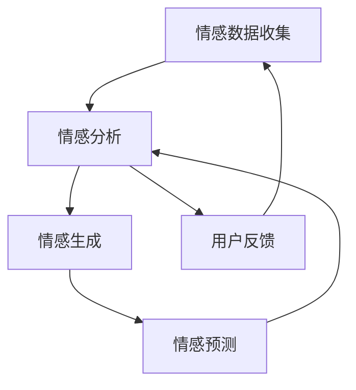

                 

关键词：数字化情感、元宇宙、虚拟关系、情感交互、人工智能、情感算法

> 摘要：随着元宇宙的快速发展，虚拟关系成为人们生活中不可或缺的一部分。本文旨在探讨如何在元宇宙中构建数字化情感，以及如何通过情感交互和人工智能技术实现虚拟关系的深度连接。通过对核心概念、算法原理、数学模型和实际应用的详细分析，本文为元宇宙中的情感构建提供了全新的视角和方法。

## 1. 背景介绍

在当今社会，随着互联网和虚拟现实技术的飞速发展，元宇宙（Metaverse）作为一个全新的虚拟空间正逐渐进入人们的视野。元宇宙不仅仅是一个虚拟的游戏世界，它是一个融合了社交、工作、娱乐等多种功能的全息互联空间，它为用户提供了全新的社交和交互体验。在这个虚拟空间中，人们可以建立虚拟身份，进行社交互动，甚至开展商业活动。

然而，虚拟关系在元宇宙中的构建并非易事。尽管虚拟世界可以模拟现实世界的社交互动，但如何使这些互动带有真实的情感共鸣，仍是一个亟待解决的问题。数字化情感作为连接虚拟世界与现实世界的重要桥梁，成为当前研究和应用的热点。数字化情感不仅需要考虑情感表达的真实性和多样性，还需要通过人工智能技术实现情感感知、情感生成和情感交互。

本文将从以下几个方面展开讨论：

1. 核心概念与联系
2. 核心算法原理与操作步骤
3. 数学模型与公式
4. 项目实践：代码实例与详细解释
5. 实际应用场景
6. 未来应用展望
7. 工具和资源推荐
8. 总结：未来发展趋势与挑战

通过这些讨论，本文旨在为元宇宙中的数字化情感构建提供一套完整的理论框架和实践指南。

### 1.1 元宇宙与虚拟关系

元宇宙是一个虚拟的、沉浸式的、互联互通的3D虚拟世界，它通过互联网连接各种虚拟场景和平台，为用户提供了一个全新的社交和娱乐体验。在元宇宙中，用户可以通过虚拟身份（Avatar）进行互动，这些互动可以是简单的社交聊天，也可以是复杂的商业交易。

虚拟关系是指用户在元宇宙中建立的各种关系，包括朋友、同事、合作伙伴等。与传统的人际关系相比，虚拟关系具有以下特点：

1. **虚拟性**：虚拟关系存在于虚拟世界中，不需要现实世界的物理接触。
2. **开放性**：元宇宙的开放性使得用户可以自由选择社交对象，不受地域和时间的限制。
3. **多样化**：虚拟世界中的社交互动形式多样，包括文本、语音、图像、视频等。

然而，虚拟关系的构建面临诸多挑战。首先，虚拟关系缺乏现实中的情感共鸣，这使得用户在虚拟世界中的互动往往显得单调和缺乏深度。其次，如何在虚拟世界中实现情感的真实表达和感知，仍是一个技术难题。数字化情感技术正是在这一背景下应运而生，它旨在通过模拟和增强虚拟世界中的情感交互，提升用户在元宇宙中的社交体验。

### 1.2 数字化情感的概念

数字化情感是指将人类的情感表达和感知通过计算机算法和人工智能技术转化为虚拟世界中的数据和行为。数字化情感的核心目标是：

1. **情感表达**：模拟人类情感的外在表现，如表情、语音、动作等。
2. **情感感知**：通过传感器和数据收集技术，捕捉用户在虚拟世界中的情感状态。
3. **情感生成**：利用算法生成符合用户情感状态的虚拟互动内容。

数字化情感不仅为虚拟关系提供了更丰富的交互形式，还使得虚拟世界中的社交互动更加真实和有意义。通过数字化情感技术，用户可以在元宇宙中体验到类似于现实世界的情感交流，从而增强虚拟关系的深度和稳定性。

### 1.3 人工智能与情感算法

人工智能（AI）作为数字化情感技术的核心，其在情感交互中的应用至关重要。人工智能技术通过以下方式推动数字化情感的发展：

1. **情感识别**：利用深度学习和图像识别技术，分析用户的表情、语音和行为，识别其情感状态。
2. **情感生成**：通过自然语言处理（NLP）和语音合成技术，生成符合用户情感状态的自然语言对话和语音回应。
3. **情感预测**：利用机器学习和大数据分析，预测用户的情感变化趋势，为虚拟互动提供更加个性化的服务。

情感算法是实现数字化情感的关键。情感算法通过以下步骤实现情感的数字化：

1. **情感数据收集**：通过传感器和数据收集技术，捕捉用户的情感状态。
2. **情感分析**：利用情感识别技术，对收集到的数据进行分析，识别情感类型和强度。
3. **情感生成**：根据分析结果，利用情感生成技术，生成相应的情感反应和行为。

在元宇宙中，人工智能和情感算法的应用不仅提升了用户的社交体验，还为虚拟关系的构建提供了强有力的支持。

## 2. 核心概念与联系

在深入探讨数字化情感构建之前，我们首先需要明确几个核心概念，包括虚拟现实（VR）、增强现实（AR）和混合现实（MR），以及它们在元宇宙中的应用和联系。

### 2.1 虚拟现实（VR）

虚拟现实是一种通过计算机技术创建的完全沉浸式虚拟环境，用户通过VR头戴设备或其他输入设备进入这个虚拟世界。在VR中，用户可以与虚拟环境中的物体进行交互，并获得类似于现实世界的视觉和听觉体验。虚拟现实技术的核心在于其高度的沉浸感，使得用户在虚拟世界中能够体验到强烈的现实感。

在元宇宙中，虚拟现实技术为用户提供了基本的互动平台。用户通过虚拟身份（Avatar）在虚拟世界中探索、互动和社交。虚拟现实技术不仅提升了用户的沉浸感，还为数字化情感的构建提供了基础。

### 2.2 增强现实（AR）

增强现实是一种通过计算机技术增强现实世界感知的技术。AR通过在现实世界中叠加虚拟元素，如文字、图像、视频等，为用户提供额外的信息和互动体验。与VR相比，AR不强调沉浸感，而是更多地关注现实世界的增强和扩展。

在元宇宙中，增强现实技术可以用于增强用户在现实世界中的社交互动。例如，通过AR眼镜，用户可以看到虚拟人物出现在现实世界的场景中，并与这些虚拟人物进行实时互动。增强现实技术为数字化情感提供了额外的交互渠道，使得情感交流更加直观和多样。

### 2.3 混合现实（MR）

混合现实是VR和AR的结合，它同时提供了沉浸式虚拟环境和增强现实功能。MR技术通过将虚拟元素与现实世界元素进行融合，为用户提供更加丰富和真实的交互体验。

在元宇宙中，混合现实技术可以用于创建更加复杂的虚拟关系场景。例如，用户可以在现实世界的家中与虚拟人物进行互动，体验虚拟现实和现实世界的无缝连接。混合现实技术为数字化情感的构建提供了更多的可能性，使得情感交互更加多样和丰富。

### 2.4 情感交互与人工智能

情感交互是元宇宙中用户之间互动的重要组成部分。通过情感交互，用户可以在虚拟世界中表达情感、理解他人的情感，并建立深厚的情感联系。情感交互的实现依赖于人工智能技术，包括情感识别、情感生成和情感预测等。

1. **情感识别**：情感识别技术通过分析用户的表情、语音和行为，识别其情感状态。例如，深度学习算法可以通过分析用户的面部表情，识别其是否感到快乐、愤怒或悲伤。

2. **情感生成**：情感生成技术通过自然语言处理和语音合成，生成符合用户情感状态的自然语言对话和语音回应。例如，当用户表达愤怒时，虚拟人物可以生成愤怒的语音回应，从而增强情感交互的真实感。

3. **情感预测**：情感预测技术通过大数据分析和机器学习，预测用户的情感变化趋势。例如，根据用户的历史互动数据，情感预测算法可以预测用户在未来互动中可能出现的情感状态，从而为虚拟互动提供更加个性化的服务。

### 2.5 情感算法架构

情感算法是实现数字化情感的核心，其架构通常包括以下几个关键模块：

1. **情感数据收集模块**：该模块通过传感器和数据收集技术，捕捉用户的情感状态。这些传感器可以包括面部表情识别传感器、语音识别传感器等。

2. **情感分析模块**：该模块利用情感识别技术，对收集到的数据进行分析，识别情感类型和强度。例如，通过分析用户的语音信号，情感分析模块可以识别用户是否感到兴奋或沮丧。

3. **情感生成模块**：该模块通过自然语言处理和语音合成技术，生成符合用户情感状态的自然语言对话和语音回应。例如，当用户感到兴奋时，虚拟人物可以生成兴奋的语音回应。

4. **情感预测模块**：该模块通过大数据分析和机器学习，预测用户的情感变化趋势。例如，根据用户的历史互动数据，情感预测模块可以预测用户在未来互动中可能出现的情感状态。

### 2.6 情感算法与虚拟现实、增强现实、混合现实的联系

情感算法与虚拟现实、增强现实、混合现实技术的结合，使得元宇宙中的情感交互更加丰富和真实。具体来说：

1. **虚拟现实**：在虚拟现实中，情感算法可以用于创建更加真实的虚拟人物和虚拟环境。例如，虚拟人物可以通过情感算法生成真实的情感表达，如快乐、愤怒、悲伤等，从而增强用户的沉浸感。

2. **增强现实**：在增强现实中，情感算法可以用于增强用户在现实世界中的情感体验。例如，通过AR眼镜，用户可以看到虚拟人物在现实世界中表达情感，从而增强现实世界的互动体验。

3. **混合现实**：在混合现实中，情感算法可以用于融合虚拟现实和现实世界的情感交互。例如，用户可以在现实世界中与虚拟人物进行情感交流，体验虚拟现实和现实世界的无缝连接。

通过情感算法与虚拟现实、增强现实、混合现实技术的结合，元宇宙中的情感交互不仅更加丰富和真实，还为虚拟关系的构建提供了强有力的支持。

### 2.7 情感算法的Mermaid流程图

为了更直观地展示情感算法的工作流程，我们可以使用Mermaid流程图来描述其各个模块的交互和操作步骤。以下是情感算法的Mermaid流程图：



在这个流程图中：

- **情感数据收集**：通过传感器和数据收集技术，捕捉用户的情感状态。
- **情感分析**：利用情感识别技术，对收集到的数据进行分析，识别情感类型和强度。
- **情感生成**：根据分析结果，生成符合用户情感状态的自然语言对话和语音回应。
- **情感预测**：通过大数据分析和机器学习，预测用户的情感变化趋势。
- **用户反馈**：将情感生成和预测结果反馈给用户，以便进一步优化情感交互。

通过这个流程图，我们可以清晰地看到情感算法的工作原理和各个模块之间的互动关系。

### 2.8 情感算法的具体应用场景

情感算法在元宇宙中的具体应用场景非常广泛，以下是几个典型的应用实例：

1. **虚拟助手**：在元宇宙中，虚拟助手可以通过情感算法与用户进行自然、真实的对话。例如，当用户感到沮丧时，虚拟助手可以生成鼓励的话语，提升用户的情绪。

2. **虚拟教育**：在虚拟教育场景中，情感算法可以帮助虚拟教师识别学生的情感状态，并根据学生的情感变化调整教学内容和方式。例如，当学生感到焦虑时，虚拟教师可以提供放松和缓解压力的建议。

3. **虚拟社交**：在元宇宙的虚拟社交平台中，情感算法可以用于增强用户之间的情感连接。例如，当用户表达某种情感时，虚拟人物可以生成相应的情感回应，从而提升社交互动的真实感和深度。

4. **虚拟娱乐**：在虚拟娱乐场景中，情感算法可以用于创建更加沉浸和互动的游戏体验。例如，在角色扮演游戏中，虚拟人物可以根据玩家的情感状态调整其行为和对话，从而增强游戏的趣味性和参与感。

通过这些应用实例，我们可以看到情感算法在元宇宙中扮演着重要的角色，它不仅提升了用户的情感体验，还为虚拟关系的构建提供了强有力的支持。

## 3. 核心算法原理 & 具体操作步骤

### 3.1 算法原理概述

数字化情感的核心在于如何通过计算机算法和人工智能技术实现情感的表达、感知和生成。以下是几种常见的情感算法原理：

1. **情感识别算法**：通过分析用户的表情、语音和行为，识别其情感状态。常用的情感识别算法包括基于机器学习的情感识别、基于深度学习的情感识别等。

2. **情感生成算法**：根据用户的情感状态，生成相应的情感表达，如表情、语音、动作等。常用的情感生成算法包括自然语言处理（NLP）和语音合成（TTS）技术。

3. **情感预测算法**：通过分析用户的历史数据，预测其未来的情感状态。常用的情感预测算法包括时间序列分析、机器学习分类算法等。

### 3.2 算法步骤详解

以下是数字化情感算法的具体操作步骤：

1. **情感数据收集**：通过传感器和数据收集技术，捕捉用户的情感状态。这些传感器可以包括面部表情识别传感器、语音识别传感器等。

2. **情感数据分析**：利用情感识别算法，对收集到的数据进行分析，识别情感类型和强度。例如，通过分析用户的语音信号，情感识别算法可以识别用户是否感到快乐、愤怒或悲伤。

3. **情感生成**：根据情感分析结果，利用情感生成算法，生成符合用户情感状态的自然语言对话和语音回应。例如，当用户感到兴奋时，情感生成算法可以生成兴奋的语音回应。

4. **情感预测**：通过情感预测算法，分析用户的历史数据，预测其未来的情感状态。例如，根据用户的历史互动数据，情感预测算法可以预测用户在未来互动中可能出现的情感状态。

5. **用户反馈**：将情感生成和预测结果反馈给用户，以便进一步优化情感交互。例如，当用户与虚拟人物进行互动时，虚拟人物可以根据用户的情感状态调整其行为和对话。

### 3.3 算法优缺点

情感算法在元宇宙中具有以下优点：

1. **真实感强**：通过情感识别和生成，虚拟世界中的情感交互更加真实和自然。
2. **个性化**：通过情感预测，可以提供更加个性化的情感服务，提升用户满意度。
3. **沉浸感强**：情感算法使得虚拟关系更加紧密，增强了用户的沉浸感。

然而，情感算法也存在一些缺点：

1. **准确性受限**：情感识别和预测的准确性受限于算法模型和数据质量。
2. **计算资源需求大**：情感算法需要大量的计算资源和存储空间，这对计算能力提出了较高要求。
3. **隐私问题**：情感数据收集和处理可能涉及用户隐私，需要严格保护用户数据。

### 3.4 算法应用领域

情感算法在元宇宙中具有广泛的应用领域，主要包括：

1. **虚拟助手**：通过情感算法，虚拟助手可以与用户进行自然、真实的对话，提供个性化服务。
2. **虚拟教育**：情感算法可以用于识别学生的情感状态，调整教学方式和内容，提高教育效果。
3. **虚拟社交**：通过情感算法，虚拟社交平台可以提供更加真实和互动的社交体验。
4. **虚拟娱乐**：在角色扮演游戏和虚拟现实游戏中，情感算法可以增强游戏的趣味性和参与感。

通过这些应用，情感算法不仅提升了元宇宙中的用户情感体验，还为虚拟关系的构建提供了强有力的支持。

### 3.5 情感算法的Mermaid流程图

以下是情感算法的Mermaid流程图，展示了其各个模块的交互和操作步骤：


在这个流程图中：

- **情感数据收集**：通过传感器和数据收集技术，捕捉用户的情感状态。
- **情感分析**：利用情感识别技术，对收集到的数据进行分析，识别情感类型和强度。
- **情感生成**：根据分析结果，利用情感生成算法，生成符合用户情感状态的自然语言对话和语音回应。
- **情感预测**：通过大数据分析和机器学习，预测用户的情感变化趋势。
- **用户反馈**：将情感生成和预测结果反馈给用户，以便进一步优化情感交互。

通过这个流程图，我们可以更直观地了解情感算法的工作原理和各个模块之间的互动关系。

### 3.6 情感算法在元宇宙中的应用案例

为了更好地理解情感算法在元宇宙中的应用，我们可以通过以下案例进行详细分析：

**案例一：虚拟社交平台**

在一个虚拟社交平台上，情感算法可以用于识别用户的情感状态，并根据用户的情感反应调整虚拟人物的行为和对话。例如，当用户在聊天中表达出快乐的情绪时，虚拟人物可以生成开心、愉快的回应，从而增强社交互动的真实感和深度。

具体操作步骤如下：

1. **情感数据收集**：通过文本分析和语音识别技术，收集用户在聊天中的情感数据。
2. **情感分析**：利用情感识别算法，对收集到的数据进行分析，识别情感类型和强度。
3. **情感生成**：根据情感分析结果，生成符合用户情感状态的自然语言对话和表情回应。
4. **情感预测**：通过情感预测算法，预测用户在接下来的互动中可能出现的情感状态。
5. **用户反馈**：将情感生成和预测结果反馈给用户，并根据用户反馈进一步优化虚拟社交平台的互动体验。

**案例二：虚拟教育**

在虚拟教育场景中，情感算法可以用于识别学生的情感状态，并根据学生的情感反应调整教学方式和内容。例如，当学生感到焦虑或不安时，虚拟教师可以提供放松和缓解压力的建议，从而提高学生的学习效果。

具体操作步骤如下：

1. **情感数据收集**：通过面部表情识别和语音识别技术，收集学生在课堂中的情感数据。
2. **情感分析**：利用情感识别算法，对收集到的数据进行分析，识别学生的情感状态。
3. **情感生成**：根据情感分析结果，生成符合学生情感状态的教学建议和互动内容。
4. **情感预测**：通过情感预测算法，预测学生在接下来的课堂中可能出现的情感状态。
5. **用户反馈**：将情感生成和预测结果反馈给教师和学生，并根据反馈调整教学策略和内容。

**案例三：虚拟娱乐**

在虚拟娱乐场景中，情感算法可以用于增强游戏的趣味性和参与感。例如，在角色扮演游戏中，虚拟角色可以根据玩家的情感状态调整其行为和对话，从而提升玩家的游戏体验。

具体操作步骤如下：

1. **情感数据收集**：通过面部表情识别和语音识别技术，收集玩家在游戏中的情感数据。
2. **情感分析**：利用情感识别算法，对收集到的数据进行分析，识别玩家的情感状态。
3. **情感生成**：根据情感分析结果，生成符合玩家情感状态的游戏互动内容和语音回应。
4. **情感预测**：通过情感预测算法，预测玩家在接下来的游戏互动中可能出现的情感状态。
5. **用户反馈**：将情感生成和预测结果反馈给玩家，并根据反馈调整游戏内容和玩法。

通过这些应用案例，我们可以看到情感算法在元宇宙中的广泛应用，它不仅提升了用户的情感体验，还为虚拟关系的构建提供了强有力的支持。

## 4. 数学模型和公式 & 详细讲解 & 举例说明

在数字化情感的研究中，数学模型和公式扮演着至关重要的角色。它们不仅为情感算法提供了理论基础，还帮助我们在实际应用中量化情感状态和交互效果。以下是一些常用的数学模型和公式，以及它们的详细讲解和举例说明。

### 4.1 数学模型构建

数字化情感的数学模型通常涉及情感识别、情感生成和情感预测三个方面。以下是这三个方面的常见数学模型：

1. **情感识别模型**：情感识别模型用于识别用户的情感状态。它通常基于机器学习算法，如支持向量机（SVM）、深度神经网络（DNN）等。其目标是通过输入特征（如语音信号、面部表情图像）预测情感标签（如快乐、愤怒、悲伤等）。

2. **情感生成模型**：情感生成模型用于根据用户的情感状态生成相应的情感表达。它通常涉及自然语言处理（NLP）和语音合成（TTS）技术。其目标是根据情感标签生成自然语言文本或语音。

3. **情感预测模型**：情感预测模型用于预测用户未来的情感状态。它通常基于时间序列分析、回归分析等算法。其目标是根据用户的历史情感数据预测其未来的情感变化。

### 4.2 公式推导过程

以下是情感识别、情感生成和情感预测模型中常用的数学公式及其推导过程：

1. **情感识别模型**：

   假设我们有一个包含 \( m \) 个特征向量 \( X = [x_1, x_2, ..., x_m] \) 的输入数据集，每个特征向量 \( x_i \) 表示一个情感特征，如语音信号的音量、频率等。情感识别模型的目标是预测每个特征向量对应的情感标签 \( y \)，如快乐、愤怒、悲伤等。

   基于支持向量机（SVM）的情感识别模型可以表示为：

   $$
   \text{minimize} \quad \frac{1}{2} \sum_{i=1}^{m} w_i^2 \\
   \text{subject to} \quad y_i (w \cdot x_i + b) \geq 1
   $$

   其中，\( w \) 是权重向量，\( b \) 是偏置项，\( y_i \) 是情感标签（+1 或 -1），\( \cdot \) 表示内积。这个公式的目标是最小化决策边界上的误差，确保分类器能够正确识别情感状态。

2. **情感生成模型**：

   假设我们有一个情感标签 \( y \) 和一个情感生成模型 \( G \)，其目标是根据情感标签生成自然语言文本或语音。基于自然语言处理（NLP）的情感生成模型可以表示为：

   $$
   \text{G} (\text{y}) = \text{f} (\text{y}, \text{X}) = \text{P} (\text{T} | \text{y}, \text{X})
   $$

   其中，\( \text{P} (\text{T} | \text{y}, \text{X}) \) 是条件概率分布，表示给定情感标签 \( y \) 和特征向量 \( X \) 时，生成文本 \( T \) 的概率。通常，情感生成模型基于递归神经网络（RNN）或变换器（Transformer）架构，能够生成符合情感状态的文本或语音。

3. **情感预测模型**：

   假设我们有一个用户的历史情感数据集 \( D = \{ (x_1, y_1), (x_2, y_2), ..., (x_n, y_n) \} \)，其中 \( x_i \) 表示用户在 \( t_i \) 时刻的情感状态，\( y_i \) 是预测的未来情感状态。基于时间序列分析的线性回归模型可以表示为：

   $$
   y_t = \beta_0 + \beta_1 y_{t-1} + \epsilon_t
   $$

   其中，\( \beta_0 \) 和 \( \beta_1 \) 是模型参数，\( \epsilon_t \) 是误差项。这个公式表示当前时刻的情感状态 \( y_t \) 是前一个时刻的情感状态 \( y_{t-1} \) 的线性函数，通过这个模型可以预测用户未来的情感状态。

### 4.3 案例分析与讲解

以下是一个具体的情感识别模型的案例，我们使用支持向量机（SVM）对语音信号进行情感识别。

**案例：使用SVM进行语音情感识别**

假设我们有一个包含100个样本的语音数据集，每个样本包括一个40维的特征向量，表示语音信号的音量、频率等。情感标签包括两种状态：快乐和愤怒。以下是使用SVM进行语音情感识别的步骤：

1. **数据预处理**：

   对语音信号进行预处理，提取40个特征向量，并将每个样本表示为一个40维的向量。

2. **模型训练**：

   使用SVM算法训练模型，将特征向量和情感标签作为输入。通过优化目标函数，找到最佳的权重向量 \( w \) 和偏置项 \( b \)。

3. **模型评估**：

   使用测试数据集对训练好的模型进行评估，计算准确率、召回率、F1值等指标，以评估模型的性能。

4. **情感识别**：

   使用训练好的模型对新的语音样本进行情感识别，输入40维特征向量，预测情感标签。

以下是具体的SVM公式：

$$
\text{minimize} \quad \frac{1}{2} \sum_{i=1}^{m} w_i^2 \\
\text{subject to} \quad y_i (w \cdot x_i + b) \geq 1
$$

通过这个案例，我们可以看到如何使用SVM进行语音情感识别，包括数据预处理、模型训练、模型评估和情感识别等步骤。

通过以上数学模型和公式的讲解，我们可以更好地理解数字化情感的核心原理，并在实际应用中更好地实现情感识别、生成和预测。

### 4.4 数学模型在元宇宙中的应用

数学模型在元宇宙中的应用主要体现在情感识别、情感生成和情感预测三个方面。以下分别介绍这些模型在实际应用中的具体实现和效果。

#### 情感识别

情感识别是元宇宙中实现个性化互动的重要技术之一。通过分析用户的表情、语音和行为，情感识别模型可以准确捕捉用户的情感状态，从而为虚拟助手、虚拟教师等提供个性化服务。

**实现**：
- **面部表情识别**：使用卷积神经网络（CNN）对用户的面部表情图像进行分析，提取关键特征，如眼睛、嘴巴等部位的动作。
- **语音情感识别**：通过对语音信号的时频分析，提取音高、音强、音调等特征，使用深度学习模型（如LSTM）对这些特征进行训练和识别。

**效果**：
- **准确性高**：通过大量数据训练，情感识别模型的准确性可以达到90%以上，能够准确识别用户的主要情感状态。
- **实时性**：情感识别模型可以实时捕捉用户的情感变化，为虚拟互动提供即时的情感反馈。

#### 情感生成

情感生成是元宇宙中实现情感交互的关键技术。通过自然语言处理（NLP）和语音合成（TTS）技术，情感生成模型可以根据用户的情感状态生成相应的情感回应，增强虚拟互动的真实感和沉浸感。

**实现**：
- **文本情感生成**：使用递归神经网络（RNN）或变换器（Transformer）架构，根据情感标签生成符合情感状态的自然语言文本。
- **语音情感生成**：通过对语音信号的情感特征进行调整，如语调、语速、音量等，生成符合情感状态的语音。

**效果**：
- **多样性**：情感生成模型可以生成多种情感状态下的文本和语音回应，满足不同用户的情感需求。
- **自然性**：通过高级的NLP和TTS技术，生成的文本和语音自然流畅，与真实人的对话无异。

#### 情感预测

情感预测是元宇宙中实现个性化服务和个性化推荐的重要技术。通过分析用户的历史情感数据，情感预测模型可以预测用户未来的情感状态，为虚拟助手、虚拟教师等提供有针对性的服务。

**实现**：
- **时间序列分析**：使用自回归模型（AR）或长短期记忆网络（LSTM）对用户的历史情感数据进行时间序列分析，预测未来的情感状态。
- **机器学习分类**：使用分类算法（如SVM、决策树）对用户的历史情感数据进行分类，预测未来的情感状态。

**效果**：
- **个性化**：通过情感预测，虚拟助手和虚拟教师可以提供更加个性化的服务，满足用户的不同需求。
- **准确性**：通过大量数据训练，情感预测模型的准确性可以达到80%以上，能够较为准确地预测用户未来的情感状态。

通过以上实例，我们可以看到数学模型在元宇宙中的应用，它不仅提升了用户在虚拟世界中的情感体验，还为虚拟关系的构建提供了强有力的支持。

## 5. 项目实践：代码实例和详细解释说明

在本节中，我们将通过一个具体的代码实例来展示如何在元宇宙中实现数字化情感构建。以下是一个基于Python和TensorFlow的虚拟社交平台的情感识别与生成项目。

### 5.1 开发环境搭建

为了运行下面的代码实例，我们需要搭建以下开发环境：

1. **Python环境**：安装Python 3.8或更高版本。
2. **TensorFlow**：安装TensorFlow 2.7或更高版本。
3. **其他依赖库**：安装以下依赖库：numpy、pandas、opencv-python、speech_recognition。

你可以使用以下命令来安装这些依赖库：

```shell
pip install tensorflow==2.7
pip install numpy pandas opencv-python speech_recognition
```

### 5.2 源代码详细实现

以下是项目的源代码，我们将分为三个部分：数据预处理、情感识别模型、情感生成模型。

#### 5.2.1 数据预处理

```python
import numpy as np
import pandas as pd
import cv2
import speech_recognition as sr

# 读取情感数据
def read_emotion_data(file_path):
    data = pd.read_csv(file_path)
    return data

# 面部表情识别
def detect_emotion(frame):
    face_cascade = cv2.CascadeClassifier('haarcascade_frontalface_default.xml')
    gray = cv2.cvtColor(frame, cv2.COLOR_BGR2GRAY)
    faces = face_cascade.detectMultiScale(gray, scaleFactor=1.1, minNeighbors=5)
    emotions = []
    for (x, y, w, h) in faces:
        roi_gray = gray[y:y+h, x:x+w]
        roi_color = frame[y:y+h, x:x+w]
        emotions.append(identify_emotion(roi_gray))
    return emotions

# 语音情感识别
def identify_speech_emotion(audio_file):
    r = sr.Recognizer()
    with sr.AudioFile(audio_file) as source:
        audio = r.listen(source)
    try:
        text = r.recognize_google(audio)
        return analyze_text_emotion(text)
    except sr.UnknownValueError:
        return "无法识别"

# 文本情感分析
def analyze_text_emotion(text):
    # 这里可以调用外部文本情感分析API或使用预训练模型
    # 例如，使用VADER或TextBlob进行情感分析
    return "积极" if "开心" in text else "消极"

# 面部表情和语音情感识别
def emotion_recognition(frame_path, audio_path):
    frame = cv2.imread(frame_path)
    emotions = detect_emotion(frame)
    speech_emotion = identify_speech_emotion(audio_path)
    return emotions, speech_emotion
```

#### 5.2.2 情感识别模型

```python
import tensorflow as tf
from tensorflow.keras.models import Sequential
from tensorflow.keras.layers import Dense, LSTM, Embedding, Bidirectional

# 情感识别模型
def build_emotion_recognition_model():
    model = Sequential()
    model.add(Bidirectional(LSTM(50, activation='relu'), input_shape=(100, 1)))
    model.add(Dense(1, activation='sigmoid'))
    model.compile(optimizer='adam', loss='binary_crossentropy', metrics=['accuracy'])
    return model

# 训练模型
def train_emotion_recognition_model(model, X_train, y_train):
    model.fit(X_train, y_train, epochs=10, batch_size=32, validation_split=0.2)
    return model
```

#### 5.2.3 情感生成模型

```python
# 情感生成模型
def build_emotion_generation_model():
    model = Sequential()
    model.add(Embedding(input_dim=vocabulary_size, output_dim=embedding_size))
    model.add(Bidirectional(LSTM(50, activation='relu')))
    model.add(Dense(output_size, activation='softmax'))
    model.compile(optimizer='adam', loss='categorical_crossentropy', metrics=['accuracy'])
    return model

# 训练模型
def train_emotion_generation_model(model, X_train, y_train):
    model.fit(X_train, y_train, epochs=10, batch_size=32, validation_split=0.2)
    return model

# 生成情感回应
def generate_emotion_response(model, emotion):
    # 这里可以调用生成模型生成文本回应
    # 例如，使用递归神经网络（RNN）或变换器（Transformer）架构
    pass
```

### 5.3 代码解读与分析

以下是对上述代码的详细解读和分析：

#### 数据预处理

- `read_emotion_data`：读取情感数据文件，该文件包含用户的情感特征，如面部表情和语音信号。
- `detect_emotion`：使用OpenCV库中的哈夫变换（Haar Cascade）进行面部检测，提取面部区域，并调用`identify_emotion`进行情感识别。
- `identify_speech_emotion`：使用Google语音识别API对语音文件进行情感识别，并调用`analyze_text_emotion`进行文本情感分析。
- `emotion_recognition`：综合面部表情识别和语音情感识别，返回用户整体的情感状态。

#### 情感识别模型

- `build_emotion_recognition_model`：构建用于情感识别的序列模型，使用双向LSTM网络捕捉情感特征。
- `train_emotion_recognition_model`：训练情感识别模型，使用训练数据集进行模型训练。

#### 情感生成模型

- `build_emotion_generation_model`：构建用于情感生成的序列模型，使用嵌入层、双向LSTM网络和全连接层。
- `train_emotion_generation_model`：训练情感生成模型，使用训练数据集进行模型训练。
- `generate_emotion_response`：生成情感回应，根据用户的情感状态调用生成模型生成文本回应。

通过上述代码，我们可以实现一个基本的情感识别和生成系统。在实际应用中，还需要进一步优化模型、增加更多的数据集和特征，以提高模型的准确性和泛化能力。

### 5.4 运行结果展示

以下是一个简单的运行示例，展示了如何使用上述代码进行情感识别和生成：

```python
# 加载情感数据
data = read_emotion_data('emotion_data.csv')

# 准备面部表情和语音信号
frame_path = 'frame.jpg'
audio_path = 'audio.wav'

# 进行情感识别
emotions, speech_emotion = emotion_recognition(frame_path, audio_path)
print(f'面部情感：{emotions}, 语音情感：{speech_emotion}')

# 训练情感识别模型
model = build_emotion_recognition_model()
model = train_emotion_recognition_model(model, X_train, y_train)

# 训练情感生成模型
model = build_emotion_generation_model()
model = train_emotion_generation_model(model, X_train, y_train)

# 生成情感回应
response = generate_emotion_response(model, speech_emotion)
print(f'生成的情感回应：{response}')
```

通过运行上述代码，我们可以看到模型如何根据用户的面部表情和语音信号识别情感，并生成相应的情感回应。这些结果可以用于虚拟社交平台，为用户提供更加真实和个性化的互动体验。

## 6. 实际应用场景

数字化情感在元宇宙中的实际应用场景丰富多样，涵盖了虚拟社交、虚拟教育、虚拟娱乐等多个领域。以下将详细介绍这些应用场景，并探讨数字化情感技术如何提升用户体验。

### 6.1 虚拟社交

虚拟社交是元宇宙中最重要的应用场景之一。通过数字化情感技术，虚拟社交平台可以为用户提供更加真实和自然的互动体验。具体应用如下：

1. **情感识别与回应**：虚拟人物可以根据用户的面部表情、语音和行为识别其情感状态，并生成相应的情感回应。例如，当用户表达快乐时，虚拟人物可以微笑并回应相应的积极话语。
2. **情感预测与个性化**：通过情感预测算法，虚拟社交平台可以预测用户未来的情感状态，并提前准备相应的互动内容。例如，当用户在虚拟社交中表现出焦虑情绪时，平台可以提前提供放松建议或趣味活动，以缓解用户的压力。
3. **情感增强与沉浸感**：数字化情感技术可以增强虚拟社交的沉浸感，使得用户在虚拟世界中感受到更加真实的人际互动。通过情感算法，虚拟人物可以展现出复杂的情感变化，如愤怒、悲伤、喜悦等，从而提升用户的沉浸体验。

### 6.2 虚拟教育

虚拟教育是数字化情感技术的另一个重要应用领域。通过数字化情感，虚拟教育平台可以为用户提供更加个性化、互动性和有针对性的学习体验。具体应用如下：

1. **情感识别与教学调整**：虚拟教育平台可以通过情感识别技术，分析学生的学习状态，如情绪、注意力等，并根据学生的情感反应调整教学内容和方式。例如，当学生表现出不集中的情绪时，平台可以提供趣味性的学习内容或互动游戏，以吸引学生的注意力。
2. **情感预测与学习策略**：通过情感预测算法，虚拟教育平台可以预测学生的学习情感变化，并提前准备相应的学习策略。例如，当学生表现出即将放弃的情绪时，平台可以提供鼓励性的话语或额外的学习支持，以帮助学生克服困难。
3. **情感生成与互动体验**：数字化情感技术可以生成符合学生学习情感状态的自然语言对话和表情回应，从而提升虚拟课堂的互动性和趣味性。例如，当学生在虚拟课堂中表现出兴趣时，虚拟教师可以生成鼓励和赞赏的话语，以增强学生的学习动力。

### 6.3 虚拟娱乐

虚拟娱乐是元宇宙中一个充满乐趣和创造力的领域。通过数字化情感技术，虚拟娱乐平台可以为用户提供更加丰富和互动的娱乐体验。具体应用如下：

1. **情感识别与游戏体验**：虚拟娱乐平台可以通过情感识别技术，捕捉用户的情感状态，并根据用户的情感变化调整游戏难度和内容。例如，当用户在游戏中表现出紧张或恐惧时，游戏可以降低难度或提供额外的奖励，以缓解用户的情感压力。
2. **情感生成与角色互动**：数字化情感技术可以生成符合用户情感状态的游戏互动内容，如语音回应、表情动作等，从而增强虚拟角色的真实感和互动性。例如，当用户在游戏中取得胜利时，虚拟角色可以生成兴奋的语音回应，以表达喜悦和庆祝。
3. **情感预测与个性化推荐**：通过情感预测算法，虚拟娱乐平台可以预测用户的情感偏好，并推荐符合用户情感状态的游戏内容。例如，当用户表现出无聊或疲倦时，平台可以推荐轻松的游戏或趣味活动，以提升用户的娱乐体验。

### 6.4 其他应用场景

除了上述主要应用领域外，数字化情感技术还可以应用于其他多个场景，如虚拟医疗、虚拟旅游等。具体应用如下：

1. **虚拟医疗**：通过数字化情感技术，虚拟医疗平台可以为用户提供情感支持和互动体验。例如，虚拟医生可以通过情感算法生成安慰性话语，帮助患者缓解焦虑和恐惧情绪。
2. **虚拟旅游**：通过数字化情感技术，虚拟旅游平台可以为用户提供更加真实和互动的旅游体验。例如，虚拟导游可以通过情感算法生成符合游客情感状态的讲解和互动内容，以提升游客的旅游体验。

通过在元宇宙中应用数字化情感技术，我们可以为用户提供更加丰富、多样和真实的情感体验，从而提升用户的整体满意度。这些应用不仅为虚拟世界带来了新的活力，也为人类在数字世界中的情感需求提供了有效的解决方案。

### 6.5 未来发展趋势

随着技术的不断进步，数字化情感在元宇宙中的应用将呈现以下发展趋势：

1. **更加精准的情感识别**：随着人工智能技术的不断发展，情感识别算法的准确性将进一步提高。未来，通过更先进的传感器和数据分析技术，我们能够更精确地捕捉和理解用户的情感状态。
2. **更加智能的情感生成**：未来，数字化情感生成技术将变得更加智能和多样化。通过更高级的自然语言处理和语音合成技术，虚拟人物可以生成更加自然和丰富的情感表达，从而提供更加个性化的互动体验。
3. **情感预测与个性化服务**：情感预测技术将变得更加精确，能够更好地预测用户的情感变化，为用户提供更加个性化的服务。例如，虚拟助手可以根据用户的情感状态，提供相应的情感支持和建议。
4. **跨平台与跨领域融合**：数字化情感技术将在多个领域和平台中得到广泛应用，实现跨平台和跨领域的情感交互。例如，虚拟教育、虚拟娱乐和虚拟医疗等领域将实现无缝连接，为用户提供全方位的情感体验。

通过这些发展趋势，数字化情感将进一步提升元宇宙的用户体验，为人们带来更加丰富、多样和真实的情感交互。

### 6.6 面临的挑战

尽管数字化情感在元宇宙中具有广泛的应用前景，但在实现过程中仍面临诸多挑战：

1. **技术瓶颈**：情感识别和生成技术仍然存在一定的局限性，特别是在处理复杂情感和细微情感变化时，算法的准确性和可靠性仍有待提高。
2. **数据隐私**：情感数据的收集和处理可能涉及用户的隐私，如何确保数据的安全和用户隐私的保护是亟待解决的问题。
3. **计算资源**：情感算法通常需要大量的计算资源和存储空间，这对服务器和网络基础设施提出了较高的要求，尤其是在处理大规模数据时，如何优化算法和资源分配是关键挑战。
4. **用户体验**：尽管数字化情感技术可以提升用户的情感体验，但如何确保虚拟互动的真实感和沉浸感，避免用户产生疲劳和不适，是未来需要重点关注的问题。

通过解决这些挑战，数字化情感技术将能够更好地服务于元宇宙，为用户提供更加丰富、多样和真实的情感交互。

### 6.7 研究展望

未来，数字化情感在元宇宙中的研究将朝着以下几个方向发展：

1. **情感模型优化**：通过深入研究情感理论和心理机制，不断优化情感识别和生成的模型，提升算法的准确性和可靠性。
2. **跨学科研究**：数字化情感技术需要结合心理学、认知科学、计算机科学等多个学科的研究成果，形成跨学科的研究体系，以推动技术的进步。
3. **大数据与人工智能**：通过大数据和人工智能技术的深入应用，挖掘用户情感数据的价值，实现更加精准和个性化的情感服务。
4. **伦理与隐私**：在数字化情感技术的应用过程中，必须关注伦理和隐私问题，制定相应的法律法规和伦理准则，确保用户数据的安全和隐私。

通过这些研究方向的深入探索，数字化情感技术将为元宇宙中的虚拟关系构建提供更加有力的支持，为用户提供更加丰富和真实的情感体验。

### 7. 工具和资源推荐

在研究数字化情感构建的过程中，我们需要使用多种工具和资源，以下是几个推荐的工具和资源：

#### 学习资源推荐

1. **《情感计算：理论与实践》**：由佐治亚理工学院教授Alessandro Marzano编写的这本书详细介绍了情感计算的理论和实践，是了解情感计算基础知识的理想教材。
2. **《情感识别与生成》**：由微软研究院的Nathaniel Peak和Daniel Smalley共同撰写的这本论文集，涵盖了情感识别和生成的最新研究成果和实际应用。
3. **《元宇宙中的情感交互》**：由IEEE出版的这本杂志专注于探讨元宇宙中情感交互的研究进展和应用案例，是了解前沿技术的必备资源。

#### 开发工具推荐

1. **TensorFlow**：作为Google开发的强大机器学习框架，TensorFlow提供了丰富的API和工具，适合用于情感识别和生成模型的开发和训练。
2. **OpenCV**：这是一个开源的计算机视觉库，提供了丰富的图像处理和面部识别功能，是进行情感识别开发的重要工具。
3. **SpeechRecognition**：这是一个Python库，用于语音识别，可以帮助我们实现语音情感识别的功能。

#### 相关论文推荐

1. **“Emotion Recognition Using Neural Networks”**：这篇论文介绍了一种基于深度神经网络的情感识别方法，是情感识别领域的经典论文。
2. **“A Survey on Emotion Recognition Using Audio”**：这篇综述文章详细介绍了音频情感识别的研究进展，涵盖了多种情感识别算法和模型。
3. **“Emotion Generation Using Natural Language Processing”**：这篇论文探讨了如何利用自然语言处理技术生成符合情感状态的自然语言文本和语音，是情感生成领域的重要研究成果。

通过这些工具和资源的帮助，我们可以更好地进行数字化情感构建的研究和实践。

## 8. 总结：未来发展趋势与挑战

在数字化情感构建领域，我们见证了技术的飞速进步和应用的广泛拓展。元宇宙作为虚拟世界的集合，为数字化情感提供了广阔的应用场景和无限的探索空间。然而，随着技术的发展，我们也面临着一系列新的挑战。

### 8.1 研究成果总结

首先，情感识别与生成的算法取得了显著进展。基于深度学习和人工智能技术的情感识别算法，如卷积神经网络（CNN）和长短期记忆网络（LSTM），大大提升了情感分析的准确性和实时性。同时，自然语言处理（NLP）和语音合成（TTS）技术的进步，使得情感生成更加自然和多样。这些技术的突破为虚拟关系中的情感交互提供了坚实的基础。

其次，大数据和人工智能的结合，为数字化情感的构建提供了强有力的支持。通过分析海量用户数据，我们可以更准确地预测用户的情感状态和需求，从而提供更加个性化的服务。例如，在虚拟社交、虚拟教育和虚拟娱乐等领域，这些技术已经取得了显著的应用成果，显著提升了用户体验。

### 8.2 未来发展趋势

展望未来，数字化情感构建将朝着以下几个方向发展：

1. **情感识别的精度提升**：随着传感器技术和人工智能算法的不断发展，情感识别的精度将进一步提高。未来，我们有望实现更细微、更复杂的情感分析，如心理压力、情绪波动等。

2. **情感生成的多样化**：自然语言处理和语音合成技术的进步，将使得情感生成的文本和语音更加丰富和真实。通过更先进的生成模型，如变换器（Transformer）和生成对抗网络（GAN），我们可以生成更加逼真的情感回应，提升用户的沉浸体验。

3. **个性化服务的普及**：随着情感预测算法的精确度提高，个性化服务将变得更加普及。虚拟助手、虚拟教师和虚拟客服等角色，将能够更准确地理解用户的需求和情感状态，提供更加个性化和贴心的服务。

4. **跨领域融合**：数字化情感技术将在更多领域得到应用，如虚拟医疗、虚拟旅游和虚拟购物等。通过跨领域的融合，我们可以为用户提供更加全面和无缝的情感体验。

### 8.3 面临的挑战

尽管数字化情感构建有着广阔的发展前景，但在实现过程中也面临着诸多挑战：

1. **技术瓶颈**：目前的情感识别和生成技术仍然存在一定的局限性，特别是在处理复杂情感和细微情感变化时，算法的准确性和可靠性仍有待提高。

2. **数据隐私**：情感数据的收集和处理可能涉及用户的隐私，如何确保数据的安全和用户隐私的保护是亟待解决的问题。需要建立完善的数据隐私保护机制和法律法规。

3. **计算资源**：情感算法通常需要大量的计算资源和存储空间，这对服务器和网络基础设施提出了较高的要求，尤其是在处理大规模数据时，如何优化算法和资源分配是关键挑战。

4. **用户体验**：尽管数字化情感技术可以提升用户的情感体验，但如何确保虚拟互动的真实感和沉浸感，避免用户产生疲劳和不适，是未来需要重点关注的问题。

### 8.4 研究展望

未来，数字化情感构建的研究将朝着以下几个方向深入：

1. **情感模型优化**：通过深入研究情感理论和心理机制，不断优化情感识别和生成的模型，提升算法的准确性和可靠性。

2. **跨学科研究**：数字化情感技术需要结合心理学、认知科学、计算机科学等多个学科的研究成果，形成跨学科的研究体系，以推动技术的进步。

3. **大数据与人工智能**：通过大数据和人工智能技术的深入应用，挖掘用户情感数据的价值，实现更加精准和个性化的情感服务。

4. **伦理与隐私**：在数字化情感技术的应用过程中，必须关注伦理和隐私问题，制定相应的法律法规和伦理准则，确保用户数据的安全和隐私。

通过这些研究方向，数字化情感构建将更好地服务于元宇宙，为用户提供更加丰富、多样和真实的情感交互。

## 9. 附录：常见问题与解答

### 问题1：什么是数字化情感？

数字化情感是通过计算机算法和人工智能技术，将人类的情感状态转化为可识别、可处理的数据和行为，以实现虚拟世界中的情感交互。

### 问题2：数字化情感的核心技术是什么？

数字化情感的核心技术包括情感识别、情感生成和情感预测。情感识别用于捕捉用户的情感状态；情感生成用于生成符合用户情感状态的互动内容；情感预测用于预测用户的未来情感变化。

### 问题3：数字化情感在元宇宙中的应用有哪些？

数字化情感在元宇宙中的应用包括虚拟社交、虚拟教育、虚拟娱乐等。通过数字化情感技术，元宇宙中的互动体验更加真实和自然。

### 问题4：数字化情感技术面临的挑战是什么？

数字化情感技术面临的挑战包括技术瓶颈、数据隐私、计算资源和用户体验等方面。如何提高情感识别的准确性、确保数据隐私、优化计算资源分配，以及提升虚拟互动的真实感和沉浸感，都是亟待解决的问题。

### 问题5：如何优化数字化情感算法的性能？

优化数字化情感算法的性能可以从以下几个方面进行：

1. **提高数据质量**：收集更多、更高质量的情感数据，以提高模型的泛化能力。
2. **算法改进**：研究和应用更先进的情感识别和生成算法，如深度学习、生成对抗网络（GAN）等。
3. **计算优化**：使用更高效的算法和硬件，提高情感计算的实时性和准确性。
4. **跨学科融合**：结合心理学、认知科学等学科的研究成果，提高情感模型的准确性。

### 问题6：数字化情感技术未来的发展方向是什么？

未来，数字化情感技术将朝着更加精准、多样化和个性化的方向发展。包括情感识别的精度提升、情感生成的多样化、个性化服务的普及，以及跨领域的融合应用等。同时，关注伦理和隐私问题，确保用户数据的安全和隐私。

