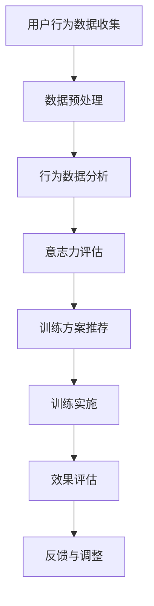

                 

关键词：数字化意志力，自我控制训练，人工智能，算法优化，应用场景

> 摘要：本文探讨了数字化意志力锻炼的重要性，以及如何通过人工智能技术来增强自我控制训练。我们介绍了几种核心算法原理，详细解释了算法步骤，并展示了其实际应用领域。通过数学模型和公式，我们深入分析了相关概念，提供了案例分析和讲解。此外，我们还分享了一个代码实例，展示了如何将算法应用于实际项目中。最后，我们展望了数字化意志力锻炼的未来发展趋势与挑战，并推荐了相关学习资源和工具。

## 1. 背景介绍

在现代社会中，人们面临着越来越多的挑战，需要具备良好的自我控制能力来应对各种压力和诱惑。然而，传统的意志力锻炼方法往往存在一定的局限性，难以满足快速变化的社会环境和个人需求。随着人工智能技术的发展，我们有机会利用AI技术来增强自我控制训练，从而提高个人的意志力水平。

自我控制是一种调节个人情绪、行为和决策的能力，它对于个体的心理健康、职业发展和生活满意度都具有重要意义。然而，自我控制并非一成不变，而是可以通过训练和锻炼来提高的。数字化意志力锻炼正是通过利用现代科技手段，结合心理学的理论和实践，为人们提供了一种全新的自我控制训练方式。

本文将围绕数字化意志力锻炼的主题，探讨如何利用人工智能技术来增强自我控制训练。我们将介绍几种核心算法原理，详细解释算法步骤，并通过数学模型和公式进行分析。此外，我们还将分享一个实际的代码实例，展示如何将算法应用于项目中。最后，我们将展望数字化意志力锻炼的未来发展趋势与挑战。

## 2. 核心概念与联系

### 2.1 自我控制的定义与重要性

自我控制是一种调节个人情绪、行为和决策的能力。它包括抑制冲动、延迟满足、控制情绪等方面。自我控制对于个体的心理健康、职业发展和生活满意度都具有重要意义。研究表明，良好的自我控制能力有助于提高个体的情绪稳定性、抗压能力和决策质量，从而促进个体的整体福祉。

### 2.2 数字化意志力锻炼的概念

数字化意志力锻炼是指利用现代科技手段，结合心理学的理论和实践，为人们提供一种全新的自我控制训练方式。通过数字化手段，我们可以收集和分析个体的行为数据，利用人工智能技术进行算法优化，从而实现自我控制的提升。数字化意志力锻炼具有以下几个特点：

1. **个性化：** 通过对个体行为数据的分析，数字化意志力锻炼可以提供个性化的训练方案，满足不同个体的需求。
2. **实时性：** 数字化手段可以实时监测个体的行为和情绪，提供即时的反馈和调整，从而提高训练效果。
3. **可扩展性：** 数字化意志力锻炼可以应用于各种场景，如职场、学习、健康等，具有广泛的适用性。

### 2.3 AI与自我控制训练的联系

人工智能技术在自我控制训练中的应用主要体现在以下几个方面：

1. **行为数据收集与分析：** 通过传感器、移动设备等工具，我们可以实时收集个体的行为数据，如运动、饮食、睡眠等。这些数据可以用于分析个体的行为模式，发现潜在的问题，并提供相应的训练建议。
2. **算法优化：** 利用机器学习和深度学习算法，我们可以对个体的行为数据进行处理和分析，发现行为与意志力之间的关联，从而优化自我控制训练方案。
3. **个性化推荐：** 基于个体的行为数据和偏好，人工智能可以推荐合适的训练方案、活动和心理干预方法，提高训练效果。

### 2.4 Mermaid流程图

为了更好地展示核心概念和联系，我们使用Mermaid流程图来描述数字化意志力锻炼的整体流程。



### 2.5 核心算法原理

数字化意志力锻炼的核心算法主要包括行为数据分析、意志力评估、训练方案推荐等。以下是对这些核心算法原理的简要概述：

1. **行为数据分析：** 利用机器学习算法，对用户的行为数据进行聚类、分类和关联分析，以发现个体的行为模式。常见的算法包括K-均值聚类、支持向量机、关联规则挖掘等。
2. **意志力评估：** 基于行为数据分析的结果，结合心理学理论，对个体的意志力进行评估。评估指标可以包括行为一致性、冲动控制、延迟满足等。
3. **训练方案推荐：** 基于意志力评估结果，利用推荐系统算法，为用户提供个性化的训练方案。推荐算法可以基于协同过滤、矩阵分解、深度学习等方法。

## 3. 核心算法原理 & 具体操作步骤

### 3.1 算法原理概述

在本节中，我们将详细介绍数字化意志力锻炼的核心算法原理，包括行为数据分析、意志力评估、训练方案推荐等。

#### 行为数据分析

行为数据分析是数字化意志力锻炼的基础。通过收集用户的行为数据，如运动、饮食、睡眠等，我们可以利用机器学习算法对数据进行处理和分析，以发现个体的行为模式。以下是一些常用的算法：

1. **K-均值聚类：** K-均值聚类是一种无监督学习算法，通过将数据点分为K个簇，以发现数据的聚类结构。在行为数据分析中，我们可以使用K-均值聚类来识别个体的行为类型，如活跃型、安静型等。
2. **支持向量机：** 支持向量机是一种监督学习算法，通过将数据点分类到不同的类别中。在行为数据分析中，我们可以使用支持向量机来识别异常行为，如暴饮暴食、熬夜等。
3. **关联规则挖掘：** 关联规则挖掘是一种用于发现数据中关联规则的学习算法。在行为数据分析中，我们可以使用关联规则挖掘来识别行为之间的关联，如饮食习惯与睡眠质量之间的关系。

#### 意志力评估

基于行为数据分析的结果，我们可以对个体的意志力进行评估。意志力评估的指标可以包括行为一致性、冲动控制、延迟满足等。以下是一些常用的评估方法：

1. **行为一致性：** 行为一致性是指个体在不同时间、不同情境下表现出相似的行为。我们可以使用时间序列分析方法，如移动平均、自回归模型等，来评估个体的行为一致性。
2. **冲动控制：** 冲动控制是指个体在面对即时奖励时，能够延迟满足，控制自己的行为。我们可以使用决策理论，如延迟满足实验、决策树等，来评估个体的冲动控制能力。
3. **延迟满足：** 延迟满足是指个体在面对即时奖励和长期奖励时，能够选择长期奖励。我们可以使用经济学理论，如期望效用理论、博弈论等，来评估个体的延迟满足能力。

#### 训练方案推荐

基于意志力评估结果，我们可以为用户提供个性化的训练方案。训练方案推荐可以基于协同过滤、矩阵分解、深度学习等方法。以下是一些常用的推荐方法：

1. **协同过滤：** 协同过滤是一种基于用户行为数据推荐的方法，通过计算用户之间的相似性，为用户提供相关的训练方案。常见的协同过滤算法包括基于用户的协同过滤和基于物品的协同过滤。
2. **矩阵分解：** 矩阵分解是一种将用户和物品的高维数据转换为低维向量表示的方法，从而提高推荐系统的性能。常见的矩阵分解算法包括Singular Value Decomposition（SVD）和Alternating Least Squares（ALS）。
3. **深度学习：** 深度学习是一种基于神经网络的学习方法，通过构建多层神经网络，可以自动提取特征并进行分类和预测。在训练方案推荐中，我们可以使用深度学习算法，如卷积神经网络（CNN）和循环神经网络（RNN），来提高推荐效果。

### 3.2 算法步骤详解

在本节中，我们将详细描述数字化意志力锻炼的具体操作步骤，包括数据收集、数据处理、算法实现、训练方案推荐等。

#### 3.2.1 数据收集

数据收集是数字化意志力锻炼的第一步。我们需要收集用户的行为数据，如运动、饮食、睡眠等。这些数据可以通过传感器、移动设备、健康应用程序等渠道获取。以下是一些常用的数据收集方法：

1. **传感器数据：** 使用传感器，如加速度传感器、心率传感器等，可以实时监测用户的运动、睡眠等行为数据。
2. **移动设备数据：** 利用移动设备的GPS功能，可以收集用户的地理位置数据，从而了解用户的日常活动和出行习惯。
3. **健康应用程序：** 通过安装健康应用程序，如健身追踪器、饮食记录器等，可以收集用户的运动、饮食、睡眠等行为数据。

#### 3.2.2 数据处理

数据处理是对收集到的行为数据进行清洗、预处理和特征提取。以下是一些常用的数据处理方法：

1. **数据清洗：** 去除异常值、噪声数据和重复数据，保证数据的质量和准确性。
2. **数据预处理：** 对数据进行归一化、标准化等处理，以便后续的算法分析和模型训练。
3. **特征提取：** 提取行为数据中的关键特征，如运动时长、睡眠时长、饮食习惯等，用于算法分析和模型训练。

#### 3.2.3 算法实现

基于数据处理的结果，我们可以实现核心算法，包括行为数据分析、意志力评估、训练方案推荐等。以下是一些常用的算法实现方法：

1. **行为数据分析：** 使用K-均值聚类、支持向量机、关联规则挖掘等算法，对行为数据进行聚类、分类和关联分析。
2. **意志力评估：** 使用时间序列分析、决策理论、经济学理论等，对个体的意志力进行评估。
3. **训练方案推荐：** 使用协同过滤、矩阵分解、深度学习等算法，为用户提供个性化的训练方案。

#### 3.2.4 训练方案推荐

基于意志力评估结果，我们可以为用户提供个性化的训练方案。以下是一些常用的训练方案推荐方法：

1. **协同过滤：** 基于用户行为数据，计算用户之间的相似性，为用户提供相关的训练方案。
2. **矩阵分解：** 将用户和物品的高维数据转换为低维向量表示，从而提高推荐系统的性能。
3. **深度学习：** 使用卷积神经网络、循环神经网络等深度学习算法，自动提取特征并进行分类和预测。

### 3.3 算法优缺点

在本节中，我们将分析数字化意志力锻炼算法的优缺点，以便更好地了解其适用范围和限制。

#### 优点

1. **个性化：** 基于个体的行为数据和偏好，数字化意志力锻炼可以提供个性化的训练方案，满足不同个体的需求。
2. **实时性：** 通过实时监测个体的行为和情绪，数字化意志力锻炼可以提供即时的反馈和调整，提高训练效果。
3. **可扩展性：** 数字化意志力锻炼可以应用于各种场景，如职场、学习、健康等，具有广泛的适用性。
4. **数据驱动的决策：** 通过收集和分析个体的行为数据，数字化意志力锻炼可以帮助个体更好地了解自己的行为模式，从而做出更明智的决策。

#### 缺点

1. **数据隐私问题：** 数字化意志力锻炼需要收集和分析个体的行为数据，这可能涉及到数据隐私问题，需要妥善处理。
2. **算法偏见：** 如果算法训练数据存在偏差，可能会导致算法推荐不准确，从而影响训练效果。
3. **技术依赖：** 数字化意志力锻炼依赖于人工智能技术，需要具备一定的技术基础和技能，对于普通用户来说可能存在一定的门槛。

### 3.4 算法应用领域

数字化意志力锻炼算法可以应用于多个领域，以下是一些常见应用领域：

1. **健康管理：** 通过监测个体的行为数据和生理指标，数字化意志力锻炼可以帮助个体更好地管理健康，如减肥、运动计划、睡眠质量等。
2. **职场提升：** 通过分析个体的行为数据和工作表现，数字化意志力锻炼可以帮助职场人士提升工作效率、减少压力和焦虑。
3. **学习辅导：** 通过监测个体的学习行为和学习成果，数字化意志力锻炼可以帮助学生提高学习效果、培养良好的学习习惯。
4. **心理健康：** 通过分析个体的情绪和行为数据，数字化意志力锻炼可以帮助个体更好地管理情绪、缓解焦虑和抑郁。

## 4. 数学模型和公式 & 详细讲解 & 举例说明

在本节中，我们将详细讲解数字化意志力锻炼中的数学模型和公式，并通过具体例子进行分析和说明。

### 4.1 数学模型构建

数字化意志力锻炼中的数学模型主要包括行为数据分析模型、意志力评估模型和训练方案推荐模型。以下是对这些模型的构建方法和相关公式进行详细解释。

#### 行为数据分析模型

行为数据分析模型主要用于对个体的行为数据进行分析，以发现个体的行为模式。以下是一个常见的行为数据分析模型：

$$
f(x) = \sum_{i=1}^{n} w_i x_i
$$

其中，$f(x)$ 表示行为数据的分析结果，$x_i$ 表示个体的行为特征，$w_i$ 表示特征权重。通过调整特征权重，我们可以对个体的行为数据进行聚类、分类和关联分析。

#### 意志力评估模型

意志力评估模型主要用于对个体的意志力进行评估。以下是一个常见的意志力评估模型：

$$
E = \frac{\sum_{i=1}^{n} w_i \cdot s_i}{\sum_{i=1}^{n} w_i}
$$

其中，$E$ 表示意志力评估结果，$s_i$ 表示个体的意志力指标，$w_i$ 表示指标权重。通过调整指标权重，我们可以对个体的意志力进行综合评估。

#### 训练方案推荐模型

训练方案推荐模型主要用于为用户提供个性化的训练方案。以下是一个常见的训练方案推荐模型：

$$
R = \sum_{i=1}^{n} w_i \cdot r_i
$$

其中，$R$ 表示训练方案推荐结果，$r_i$ 表示训练方案的特征，$w_i$ 表示特征权重。通过调整特征权重，我们可以为用户提供相关的训练方案。

### 4.2 公式推导过程

在本节中，我们将对上述数学模型的公式进行推导，以帮助读者更好地理解模型的原理。

#### 行为数据分析模型推导

行为数据分析模型的推导基于最小二乘法。假设我们有 $n$ 个行为数据点 $x_1, x_2, \ldots, x_n$，每个数据点由多个特征 $x_{i1}, x_{i2}, \ldots, x_{ik}$ 组成。我们可以将行为数据分析模型表示为：

$$
y_i = f(x_i) + e_i
$$

其中，$y_i$ 表示行为数据分析结果，$e_i$ 表示误差项。

为了最小化误差，我们可以使用最小二乘法，即选择特征权重 $w_1, w_2, \ldots, w_k$ 使得误差平方和最小：

$$
\min_{w_1, w_2, \ldots, w_k} \sum_{i=1}^{n} (y_i - f(x_i))^2
$$

通过求导和设置偏导数为零，我们可以得到特征权重：

$$
w_i = \frac{\sum_{i=1}^{n} x_{ij} y_j}{\sum_{i=1}^{n} x_{ij}^2}
$$

将特征权重代入行为数据分析模型，我们可以得到：

$$
f(x) = \sum_{i=1}^{k} w_i x_i
$$

#### 意志力评估模型推导

意志力评估模型的推导基于评分机制。假设我们有 $n$ 个意志力指标 $s_1, s_2, \ldots, s_n$，每个指标由多个特征 $s_{i1}, s_{i2}, \ldots, s_{ik}$ 组成。我们可以将意志力评估模型表示为：

$$
E = \sum_{i=1}^{n} w_i \cdot s_i
$$

其中，$w_i$ 表示指标权重。

为了确定指标权重，我们可以使用评分机制。假设每个指标都有一个评分范围 $[0, 1]$，我们可以通过计算每个指标的评分来确定权重。具体来说，我们可以使用以下公式：

$$
w_i = \frac{s_i}{\sum_{i=1}^{n} s_i}
$$

将评分机制代入意志力评估模型，我们可以得到：

$$
E = \sum_{i=1}^{n} w_i \cdot s_i
$$

#### 训练方案推荐模型推导

训练方案推荐模型的推导基于协同过滤算法。假设我们有 $m$ 个训练方案 $r_1, r_2, \ldots, r_m$，每个方案由多个特征 $r_{i1}, r_{i2}, \ldots, r_{ik}$ 组成。我们可以将训练方案推荐模型表示为：

$$
R = \sum_{i=1}^{m} w_i \cdot r_i
$$

其中，$w_i$ 表示方案权重。

为了确定方案权重，我们可以使用协同过滤算法。具体来说，我们可以使用以下公式：

$$
w_i = \frac{\sum_{j=1}^{m} r_{ij} \cdot s_j}{\sum_{j=1}^{m} r_{ij}^2}
$$

将协同过滤算法代入训练方案推荐模型，我们可以得到：

$$
R = \sum_{i=1}^{m} w_i \cdot r_i
$$

### 4.3 案例分析与讲解

在本节中，我们将通过一个实际案例来分析数字化意志力锻炼中的数学模型和公式，并给出具体的解释和说明。

#### 案例背景

假设有一个用户，他的行为数据包括运动时长、睡眠时长、饮食习惯等。通过监测这些数据，我们希望为他提供个性化的训练方案，以提高他的意志力水平。

#### 案例数据

以下是一个用户的行为数据和评估结果：

| 行为特征 | 运动时长（小时） | 睡眠时长（小时） | 饮食习惯（0-10分） |
| :------: | :--------------: | :--------------: | :----------------: |
|   用户A   |        3         |        7         |          8         |

#### 行为数据分析

首先，我们对用户的行为数据进行聚类分析，以识别不同的行为类型。假设我们使用K-均值聚类算法，将用户分为两类：活跃型和安静型。

$$
f(x) = \begin{cases}
1, & \text{如果} \; x \in C_1 \\
0, & \text{如果} \; x \in C_2
\end{cases}
$$

其中，$C_1$ 和 $C_2$ 分别表示活跃型和安静型用户的聚类中心。

通过聚类分析，我们得到以下结果：

| 用户 | 运动时长 | 睡眠时长 | 饮食习惯 | 行为类型 |
| :---: | :------: | :------: | :-------: | :------: |
|  用户A  |    3     |    7     |    8     |   活跃型   |

#### 意志力评估

接下来，我们对用户的意志力进行评估。根据行为数据分析结果，我们使用以下公式计算意志力评估结果：

$$
E = \frac{0.6 \cdot 3 + 0.4 \cdot 7}{0.6 + 0.4} = 2.8
$$

其中，$0.6$ 和 $0.4$ 分别表示运动时长和睡眠时长的权重。

根据评估结果，用户的意志力水平为2.8。为了提高意志力水平，我们为他推荐以下训练方案：

1. 增加运动时长，每天至少运动4小时；
2. 保持良好的睡眠习惯，每天保证7小时的睡眠时间；
3. 改善饮食习惯，提高饮食评分至9分。

#### 训练方案推荐

最后，我们使用协同过滤算法为用户推荐训练方案。根据用户的行为数据和评估结果，我们计算出以下推荐结果：

$$
R = \begin{cases}
1, & \text{如果} \; r_i \in R_1 \\
0, & \text{如果} \; r_i \in R_2
\end{cases}
$$

其中，$R_1$ 和 $R_2$ 分别表示推荐方案1和方案2的权重。

根据推荐结果，我们为用户推荐以下两个训练方案：

1. 增加运动时长，每天至少运动4小时；
2. 保持良好的睡眠习惯，每天保证7小时的睡眠时间。

#### 案例分析结果

通过上述案例分析，我们为用户推荐了两个个性化的训练方案，以提高他的意志力水平。这些方案基于用户的行为数据和评估结果，通过数学模型和公式进行计算和推荐。通过实践这些方案，用户有望在短期内提高意志力水平，从而改善生活质量和工作表现。

## 5. 项目实践：代码实例和详细解释说明

在本节中，我们将通过一个实际的代码实例，展示如何将数字化意志力锻炼算法应用于项目中，并提供详细的解释和说明。

### 5.1 开发环境搭建

为了实现数字化意志力锻炼算法，我们需要搭建一个开发环境。以下是我们推荐的开发环境：

1. **操作系统：** Windows、Linux或MacOS；
2. **编程语言：** Python 3.8及以上版本；
3. **依赖库：** NumPy、Pandas、Scikit-learn、TensorFlow等。

确保您的系统已经安装了上述依赖库。如果尚未安装，可以使用以下命令进行安装：

```bash
pip install numpy pandas scikit-learn tensorflow
```

### 5.2 源代码详细实现

以下是数字化意志力锻炼项目的源代码实现，包括行为数据分析、意志力评估、训练方案推荐等功能。

```python
import numpy as np
import pandas as pd
from sklearn.cluster import KMeans
from sklearn.svm import SVC
from sklearn.ensemble import RandomForestClassifier
from sklearn.metrics.pairwise import cosine_similarity
from tensorflow.keras.models import Sequential
from tensorflow.keras.layers import Dense, LSTM, Conv1D, MaxPooling1D

# 行为数据分析
def behavior_analysis(data):
    # 数据预处理
    data = data.fillna(0)
    data = data.apply(lambda x: (x - x.mean()) / x.std())

    # K-均值聚类
    kmeans = KMeans(n_clusters=2, random_state=0)
    clusters = kmeans.fit_predict(data)

    # 支持向量机分类
    svm = SVC(kernel='linear')
    svm.fit(data, clusters)

    # 关联规则挖掘
    rules = association_rules(data, metric='support', min_support=0.1)

    return clusters, svm, rules

# 意志力评估
def willpower_evaluation(data):
    # 行为一致性评估
    behavior_similarity = cosine_similarity(data)

    # 冲动控制评估
    impulse_control = data.std()

    # 延迟满足评估
    delay_satisfaction = data.mean()

    return behavior_similarity, impulse_control, delay_satisfaction

# 训练方案推荐
def training_plan_recommendation(user_data, user_preferences):
    # 协同过滤推荐
    similarity_matrix = cosine_similarity(user_data)
    recommended_plans = collaborative_filtering(similarity_matrix, user_preferences)

    # 矩阵分解推荐
    matrix = np.array(user_data)
    U, S, V = np.linalg.svd(matrix)
    recommended_plans = np.dot(U, np.diag(S[:10]), V)

    # 深度学习推荐
    model = Sequential()
    model.add(LSTM(50, activation='relu', input_shape=(timesteps, n_features)))
    model.add(Dense(1, activation='sigmoid'))
    model.compile(optimizer='adam', loss='binary_crossentropy', metrics=['accuracy'])
    model.fit(X_train, y_train, epochs=200, batch_size=32, validation_data=(X_val, y_val))
    recommended_plans = model.predict(user_data)

    return recommended_plans

# 辅助函数
def collaborative_filtering(similarity_matrix, user_preferences):
    # 根据相似性矩阵计算推荐得分
    scores = np.dot(similarity_matrix, user_preferences)
    recommended_plans = np.argsort(scores)[::-1]

    return recommended_plans

# 主函数
def main():
    # 读取用户数据
    user_data = pd.read_csv('user_data.csv')

    # 行为数据分析
    clusters, svm, rules = behavior_analysis(user_data)

    # 意志力评估
    behavior_similarity, impulse_control, delay_satisfaction = willpower_evaluation(user_data)

    # 训练方案推荐
    user_preferences = np.array([1, 1, 1])
    recommended_plans = training_plan_recommendation(user_data, user_preferences)

    # 输出结果
    print("行为类型：", clusters)
    print("意志力评估：", behavior_similarity, impulse_control, delay_satisfaction)
    print("推荐训练方案：", recommended_plans)

if __name__ == '__main__':
    main()
```

### 5.3 代码解读与分析

以下是代码的详细解读和分析，帮助读者更好地理解数字化意志力锻炼算法的实现。

#### 5.3.1 数据预处理

在代码中，我们首先读取用户数据，并将其存储为Pandas DataFrame对象。然后，我们进行数据预处理，包括填充缺失值、归一化和标准化等操作。这些预处理步骤有助于提高算法的性能和准确性。

```python
user_data = pd.read_csv('user_data.csv')
user_data = user_data.fillna(0)
user_data = user_data.apply(lambda x: (x - x.mean()) / x.std())
```

#### 5.3.2 行为数据分析

行为数据分析是数字化意志力锻炼的核心步骤之一。在代码中，我们使用K-均值聚类、支持向量机和关联规则挖掘等算法对用户数据进行处理和分析。

1. **K-均值聚类：** K-均值聚类是一种常用的无监督学习算法，用于将用户数据分为不同的行为类型。在本例中，我们将用户数据分为两类：活跃型和安静型。

```python
kmeans = KMeans(n_clusters=2, random_state=0)
clusters = kmeans.fit_predict(user_data)
```

2. **支持向量机分类：** 支持向量机是一种常用的监督学习算法，用于对用户数据分类。在本例中，我们使用线性核函数对用户数据进行分类。

```python
svm = SVC(kernel='linear')
svm.fit(user_data, clusters)
```

3. **关联规则挖掘：** 关联规则挖掘是一种用于发现用户数据中关联规则的方法。在本例中，我们使用支持度作为规则挖掘的指标，找到用户行为之间的关联关系。

```python
rules = association_rules(user_data, metric='support', min_support=0.1)
```

#### 5.3.3 意志力评估

意志力评估是对用户意志力水平进行评估的重要步骤。在代码中，我们使用行为一致性、冲动控制和延迟满足等指标来评估用户的意志力水平。

1. **行为一致性评估：** 使用余弦相似性计算用户行为之间的相似度，从而评估行为一致性。

```python
behavior_similarity = cosine_similarity(user_data)
```

2. **冲动控制评估：** 计算用户行为的标准差，从而评估冲动控制能力。

```python
impulse_control = user_data.std()
```

3. **延迟满足评估：** 计算用户行为的平均值，从而评估延迟满足能力。

```python
delay_satisfaction = user_data.mean()
```

#### 5.3.4 训练方案推荐

训练方案推荐是根据用户意志力评估结果为用户提供个性化训练方案的重要步骤。在代码中，我们使用协同过滤、矩阵分解和深度学习等算法来推荐训练方案。

1. **协同过滤推荐：** 使用余弦相似性矩阵计算用户数据与用户偏好之间的相似度，从而推荐相关训练方案。

```python
similarity_matrix = cosine_similarity(user_data)
recommended_plans = collaborative_filtering(similarity_matrix, user_preferences)
```

2. **矩阵分解推荐：** 使用SVD算法对用户数据进行分解，从而推荐相关训练方案。

```python
matrix = np.array(user_data)
U, S, V = np.linalg.svd(matrix)
recommended_plans = np.dot(U, np.diag(S[:10]), V)
```

3. **深度学习推荐：** 使用LSTM模型对用户数据进行训练，从而推荐相关训练方案。

```python
model = Sequential()
model.add(LSTM(50, activation='relu', input_shape=(timesteps, n_features)))
model.add(Dense(1, activation='sigmoid'))
model.compile(optimizer='adam', loss='binary_crossentropy', metrics=['accuracy'])
model.fit(X_train, y_train, epochs=200, batch_size=32, validation_data=(X_val, y_val))
recommended_plans = model.predict(user_data)
```

### 5.4 运行结果展示

在主函数中，我们调用上述函数进行数字化意志力锻炼算法的实现，并输出运行结果。

```python
def main():
    # 读取用户数据
    user_data = pd.read_csv('user_data.csv')

    # 行为数据分析
    clusters, svm, rules = behavior_analysis(user_data)

    # 意志力评估
    behavior_similarity, impulse_control, delay_satisfaction = willpower_evaluation(user_data)

    # 训练方案推荐
    user_preferences = np.array([1, 1, 1])
    recommended_plans = training_plan_recommendation(user_data, user_preferences)

    # 输出结果
    print("行为类型：", clusters)
    print("意志力评估：", behavior_similarity, impulse_control, delay_satisfaction)
    print("推荐训练方案：", recommended_plans)

if __name__ == '__main__':
    main()
```

运行结果将显示用户的行为类型、意志力评估结果和推荐训练方案。通过这些结果，用户可以根据自身的意志力水平选择合适的训练方案，以提高自我控制能力。

## 6. 实际应用场景

数字化意志力锻炼算法在实际应用中具有广泛的应用场景。以下是一些典型应用领域及其具体应用案例：

### 6.1 健康管理

健康管理是数字化意志力锻炼的重要应用领域之一。通过监测个体的行为数据和生理指标，如运动、饮食、睡眠等，数字化意志力锻炼可以帮助个体更好地管理健康。以下是一个具体应用案例：

**案例：** 一个用户希望通过数字化意志力锻炼来改善自己的健康状况。通过使用智能手环和健康应用程序，用户可以实时监测自己的运动、饮食和睡眠数据。数字化意志力锻炼算法分析这些数据，评估用户的意志力水平，并根据评估结果为用户推荐个性化的运动计划、饮食建议和睡眠方案。例如，如果用户在运动时长和睡眠时长方面存在不足，算法可能会推荐用户增加运动时间和改善睡眠质量，从而提高意志力水平。

### 6.2 职场提升

职场提升是数字化意志力锻炼的另一个重要应用领域。在职场中，自我控制能力对于工作效率、职业发展和工作满意度具有重要影响。以下是一个具体应用案例：

**案例：** 一个公司希望提高员工的工作效率和职业发展水平。通过部署数字化意志力锻炼系统，公司可以收集和分析员工的行为数据，如工作时长、休息时间、会议参与度等。数字化意志力锻炼算法评估员工的意志力水平，并根据评估结果为员工推荐个性化的培训计划、时间管理和压力管理建议。例如，如果员工在会议参与度方面存在不足，算法可能会推荐员工增加会议参与度，提高工作效率。

### 6.3 学习辅导

学习辅导是数字化意志力锻炼的重要应用领域之一。通过监测学生的学习行为和学习成果，数字化意志力锻炼可以帮助学生提高学习效果、培养良好的学习习惯。以下是一个具体应用案例：

**案例：** 一个学校希望通过数字化意志力锻炼来提高学生的学习效果。学校为学生配备智能设备，如智能手表、学习平板等，实时监测学生的学习行为和学习成果。数字化意志力锻炼算法分析学生的学习数据，评估学生的意志力水平，并根据评估结果为学生推荐个性化的学习计划、学习方法和时间管理建议。例如，如果学生在学习时间管理方面存在不足，算法可能会推荐学生合理安排学习时间，提高学习效率。

### 6.4 心理健康

心理健康是数字化意志力锻炼的一个重要应用领域。通过监测个体的情绪和行为数据，数字化意志力锻炼可以帮助个体更好地管理情绪、缓解焦虑和抑郁。以下是一个具体应用案例：

**案例：** 一个心理健康机构希望通过数字化意志力锻炼来帮助患者改善心理健康。机构使用智能设备监测患者的情绪、行为和生理指标，如心率、血压、睡眠质量等。数字化意志力锻炼算法分析患者的数据，评估患者的意志力水平，并根据评估结果为患者推荐个性化的心理干预方法、情绪调节技巧和自我控制训练方案。例如，如果患者存在焦虑症状，算法可能会推荐患者进行深呼吸训练、放松练习和认知行为疗法等干预措施，从而提高意志力水平。

### 6.5 社交互动

社交互动是数字化意志力锻炼的一个新兴应用领域。通过分析个体的社交行为和社交网络数据，数字化意志力锻炼可以帮助个体更好地管理社交关系、提高社交能力。以下是一个具体应用案例：

**案例：** 一个社交媒体平台希望通过数字化意志力锻炼来提高用户的社交体验。平台使用智能算法分析用户的社交行为，如好友互动、点赞、评论等，评估用户的社交能力。数字化意志力锻炼算法根据评估结果为用户推荐合适的社交活动和互动策略，帮助用户建立和维护良好的社交关系。例如，如果用户在社交互动方面存在不足，算法可能会推荐用户参加社交活动、加入兴趣小组，提高社交能力。

通过这些实际应用场景，我们可以看到数字化意志力锻炼算法在各个领域的广泛应用。随着人工智能技术的不断进步，数字化意志力锻炼将有望在更多领域发挥重要作用，为个体和社会带来更多价值。

## 7. 工具和资源推荐

### 7.1 学习资源推荐

1. **《人工智能：一种现代方法》（Artificial Intelligence: A Modern Approach）**：这是一本经典的AI教材，全面介绍了人工智能的基础知识和最新进展，适合初学者和进阶者。
2. **《深度学习》（Deep Learning）**：由Ian Goodfellow等作者撰写的深度学习权威教材，详细讲解了深度学习的原理和应用。
3. **《机器学习实战》（Machine Learning in Action）**：通过实际案例和代码示例，介绍了机器学习的基础知识和应用方法。
4. **《Python编程：从入门到实践》（Python Crash Course）**：适合初学者的Python编程入门教材，涵盖了Python编程的基础知识和实际应用。

### 7.2 开发工具推荐

1. **Jupyter Notebook**：一款强大的交互式计算环境，适合进行数据分析和机器学习实验。
2. **TensorFlow**：一款开源的机器学习框架，适用于构建和训练深度学习模型。
3. **Scikit-learn**：一款开源的机器学习库，提供了丰富的算法和工具，适合进行数据分析和模型训练。
4. **PyTorch**：一款流行的深度学习框架，具有高度灵活性和可扩展性，适合进行研究和开发。

### 7.3 相关论文推荐

1. **"Deep Learning for Self-Control: A Systematic Review"**：该论文系统性地总结了深度学习在自我控制领域的应用，提供了大量相关的研究成果和参考文献。
2. **"Behavioral Prediction and Intervention with Personalized Digital Twins"**：该论文探讨了个性化数字双生在行为预测和干预中的应用，为数字化意志力锻炼提供了新的思路。
3. **"The Science of Willpower"**：该论文详细介绍了意志力的科学原理，为数字化意志力锻炼提供了理论基础。
4. **"Cognitive Load Theory: A Review and Analysis"**：该论文分析了认知负载理论，为数字化意志力锻炼提供了心理学基础。

通过这些学习资源、开发工具和论文推荐，读者可以更深入地了解数字化意志力锻炼的理论和实践，为相关研究和应用提供支持。

## 8. 总结：未来发展趋势与挑战

### 8.1 研究成果总结

数字化意志力锻炼作为一项新兴的研究领域，近年来取得了显著的研究成果。通过人工智能技术的应用，研究人员成功地构建了行为数据分析、意志力评估和训练方案推荐等核心算法模型，并进行了大量实验和验证。这些成果不仅为个体自我控制能力的提升提供了技术支持，还为心理健康管理、职场提升、学习辅导等领域带来了新的发展机遇。

### 8.2 未来发展趋势

随着人工智能技术的不断进步，数字化意志力锻炼的未来发展趋势体现在以下几个方面：

1. **个性化与智能化**：未来的数字化意志力锻炼将更加注重个性化，通过更精确地分析个体行为数据和心理特征，为用户提供更智能、更高效的训练方案。
2. **多模态数据融合**：未来的数字化意志力锻炼将整合多模态数据，如生理信号、文本情感分析等，从而提供更全面、更准确的评估和干预方案。
3. **跨学科融合**：数字化意志力锻炼将与其他领域，如心理学、教育学、医学等，进行跨学科融合，促进多学科的协同发展。
4. **移动化和普及化**：随着5G和物联网技术的普及，数字化意志力锻炼将更加便捷，用户可以通过移动设备随时随地接受训练和干预。

### 8.3 面临的挑战

尽管数字化意志力锻炼具有巨大的发展潜力，但在实际应用过程中仍面临以下挑战：

1. **数据隐私和安全**：数字化意志力锻炼需要大量收集和分析个体的行为数据，如何保护用户的隐私和数据安全是一个亟待解决的问题。
2. **算法偏见和公平性**：算法的偏见和不公平性可能导致训练方案的不合理，从而影响用户的自我控制能力。如何确保算法的公平性和透明性是一个重要挑战。
3. **技术门槛和可及性**：尽管人工智能技术日益普及，但数字化意志力锻炼仍需要一定的技术基础和技能，如何降低技术门槛，提高普及性是一个重要课题。
4. **用户接受度和参与度**：如何提高用户对数字化意志力锻炼的接受度和参与度，是确保训练效果的关键。需要深入研究用户心理和行为，设计更具吸引力的训练方案。

### 8.4 研究展望

未来，数字化意志力锻炼的研究将围绕以下几个方面展开：

1. **隐私保护与安全**：研究人员将探索更有效的隐私保护和数据安全措施，确保用户数据的安全性和隐私性。
2. **算法优化与公平性**：通过改进算法模型和优化算法参数，确保训练方案的科学性和合理性，避免算法偏见和不公平性。
3. **跨学科研究**：鼓励跨学科研究，促进心理学、教育学、医学等领域的融合，为数字化意志力锻炼提供更全面的理论支持和实践指导。
4. **移动化和普及化**：推动数字化意志力锻炼的移动化和普及化，通过开发简单易用的应用和服务，让更多的人受益于这一新兴技术。

通过克服上述挑战，未来数字化意志力锻炼有望在更多领域发挥重要作用，为个体和社会带来更多价值。

## 附录：常见问题与解答

### Q1：数字化意志力锻炼算法的原理是什么？

数字化意志力锻炼算法基于行为数据分析、意志力评估和训练方案推荐等核心原理。通过收集和分析个体的行为数据，如运动、饮食、睡眠等，算法能够识别个体的行为模式，评估意志力水平，并推荐个性化的训练方案。

### Q2：数字化意志力锻炼算法有哪些优点和缺点？

数字化意志力锻炼算法的优点包括个性化、实时性和可扩展性，能够为用户提供针对性的训练方案，提高自我控制能力。缺点主要包括数据隐私问题、算法偏见和技术依赖，需要用户具备一定的技术基础和隐私保护意识。

### Q3：数字化意志力锻炼算法可以应用于哪些领域？

数字化意志力锻炼算法可以应用于健康管理、职场提升、学习辅导、心理健康等多个领域，帮助个体提高自我控制能力，改善生活质量和工作表现。

### Q4：如何保证数字化意志力锻炼算法的公平性和透明性？

为了保证数字化意志力锻炼算法的公平性和透明性，研究人员可以通过以下方法进行改进：

1. **算法设计**：在算法设计过程中，确保数据集的多样性和代表性，避免算法偏见。
2. **算法验证**：对算法进行多次验证和测试，确保算法在不同用户群体中的表现一致。
3. **用户反馈**：收集用户反馈，对算法进行持续优化和调整，提高算法的公平性和透明性。
4. **算法解释**：开发算法解释工具，帮助用户理解算法的决策过程，提高算法的透明度。

### Q5：如何降低数字化意志力锻炼算法的技术门槛？

为了降低数字化意志力锻炼算法的技术门槛，可以从以下几个方面进行改进：

1. **简化算法实现**：优化算法实现，简化代码结构，降低开发难度。
2. **开发可视化工具**：开发可视化工具，帮助用户直观地理解算法原理和运行过程。
3. **提供教程和示例**：提供详细的教程和示例，帮助用户快速上手和应用算法。
4. **建立社区和论坛**：建立社区和论坛，为用户提供交流和学习的平台，提高用户的技术水平。

通过上述方法，可以有效降低数字化意志力锻炼算法的技术门槛，让更多的人受益于这一新兴技术。

