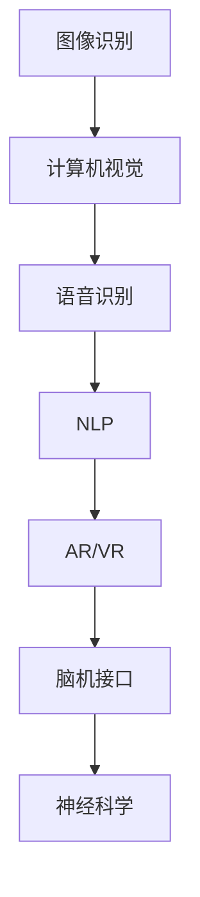

                 

关键词：数字化感知，人工智能，感官拓展，技术创新，算法原理，数学模型，实际应用

> 摘要：随着人工智能技术的飞速发展，数字化感知已经成为现代科技的核心驱动力之一。本文将探讨数字化感知的拓展在人工智能领域中的应用，深入解析核心概念、算法原理、数学模型以及实际应用案例，为读者揭示这一领域的创新维度与发展潜力。

## 1. 背景介绍

数字化感知，即通过数字化方式捕捉、处理和解释外界信息的能力，是现代人工智能技术发展的基石。从早期的计算机视觉、语音识别到如今的增强现实、机器学习，数字化感知技术不断推动人工智能在各个领域的应用创新。数字化感知的拓展不仅限于提升算法性能，更在于开辟新的感官维度，从而实现更加智能、高效的人机交互。

近年来，随着深度学习、神经网络的广泛应用，人工智能在图像识别、自然语言处理等领域的表现已经超越了人类的水平。然而，如何进一步拓展数字化感知的维度，使其能够处理更加复杂、多维的信息，成为当前研究的热点问题。本文将围绕这一主题展开讨论，探讨数字化感知在人工智能中的创新应用。

## 2. 核心概念与联系

为了深入理解数字化感知的拓展，我们首先需要了解相关核心概念，并分析它们之间的联系。

### 2.1. 图像识别与计算机视觉

图像识别是计算机视觉的核心任务之一，它旨在使计算机能够识别和分类图像中的对象。计算机视觉技术通过摄像头或其他传感器捕捉图像，然后利用算法对其进行处理和分析。图像识别的准确性直接影响到数字化感知的能力。

### 2.2. 语音识别与自然语言处理

语音识别是将语音信号转换为文本的技术，而自然语言处理（NLP）则是对文本进行理解、分析和生成的高级技术。语音识别和NLP的结合使得计算机能够理解人类的语言，从而实现语音交互和智能客服等应用。

### 2.3. 增强现实与虚拟现实

增强现实（AR）和虚拟现实（VR）技术通过数字化的方式增强或替换现实世界的视觉和听觉体验。这些技术拓展了人类的感知维度，使得数字化感知能够应用于更加丰富的场景。

### 2.4. 脑机接口与神经科学

脑机接口（BMI）是一种将人脑与计算机直接连接的技术，它通过捕捉大脑信号，使计算机能够理解和响应用户的思维。神经科学的研究为脑机接口提供了理论基础，推动了数字化感知技术的进步。

### 2.5. Mermaid 流程图

以下是数字化感知拓展的相关概念与联系，使用Mermaid流程图进行展示：



## 3. 核心算法原理 & 具体操作步骤

### 3.1. 算法原理概述

数字化感知的拓展依赖于多种核心算法，如深度学习、神经网络、支持向量机等。这些算法通过学习大量的数据，使得计算机能够自动识别和分类信息。

### 3.2. 算法步骤详解

以深度学习算法为例，其基本步骤如下：

1. 数据收集：收集大量包含图像、语音、文本等信息的样本数据。
2. 数据预处理：对数据进行清洗、归一化等预处理操作。
3. 模型构建：选择合适的神经网络架构，如卷积神经网络（CNN）、循环神经网络（RNN）等。
4. 模型训练：使用训练数据对模型进行训练，不断调整模型参数，以优化性能。
5. 模型评估：使用测试数据评估模型性能，包括准确率、召回率等指标。
6. 模型部署：将训练好的模型部署到实际应用场景中。

### 3.3. 算法优缺点

深度学习算法具有强大的建模能力和良好的泛化能力，但同时也存在以下缺点：

- 训练时间较长，需要大量计算资源。
- 对数据质量要求较高，数据缺失或噪声会影响模型性能。
- 模型透明度较低，难以解释模型决策过程。

### 3.4. 算法应用领域

数字化感知拓展的应用领域广泛，包括但不限于：

- 图像识别：自动驾驶、医疗影像分析、人脸识别等。
- 语音识别：智能语音助手、智能客服、语音翻译等。
- 自然语言处理：文本分类、情感分析、机器翻译等。
- 增强现实与虚拟现实：游戏、教育、医疗等。
- 脑机接口：神经系统疾病治疗、人机交互等。

## 4. 数学模型和公式 & 详细讲解 & 举例说明

### 4.1. 数学模型构建

数字化感知的算法通常基于概率模型、统计模型、优化模型等。以下是一个简单的线性回归模型：

$$
y = wx + b
$$

其中，$y$ 是输出值，$w$ 是权重，$x$ 是输入值，$b$ 是偏置。

### 4.2. 公式推导过程

以线性回归模型为例，推导过程如下：

1. 假设输入值 $x$ 和输出值 $y$ 满足线性关系。
2. 定义损失函数，如均方误差（MSE）：
$$
J(w, b) = \frac{1}{2n} \sum_{i=1}^{n} (wx_i + b - y_i)^2
$$
3. 对损失函数求导，得到梯度：
$$
\nabla_w J(w, b) = \frac{1}{n} \sum_{i=1}^{n} (wx_i + b - y_i)x_i
$$
$$
\nabla_b J(w, b) = \frac{1}{n} \sum_{i=1}^{n} (wx_i + b - y_i)
$$
4. 使用梯度下降法更新模型参数：
$$
w_{new} = w - \alpha \nabla_w J(w, b)
$$
$$
b_{new} = b - \alpha \nabla_b J(w, b)
$$

### 4.3. 案例分析与讲解

以下是一个线性回归模型的案例：

给定数据集：$$x = [1, 2, 3, 4, 5]$$，$$y = [2, 4, 5, 4, 5]$$。要求拟合一个线性模型。

1. 初始化参数：$$w = 0$$，$$b = 0$$。
2. 计算损失函数：
$$
J(w, b) = \frac{1}{2n} \sum_{i=1}^{n} (wx_i + b - y_i)^2
$$
$$
J(0, 0) = \frac{1}{5} [(0 \cdot 1 + 0 - 2)^2 + (0 \cdot 2 + 0 - 4)^2 + (0 \cdot 3 + 0 - 5)^2 + (0 \cdot 4 + 0 - 4)^2 + (0 \cdot 5 + 0 - 5)^2]
$$
$$
J(0, 0) = \frac{1}{5} [4 + 16 + 25 + 16 + 25]
$$
$$
J(0, 0) = \frac{90}{5} = 18
$$
3. 计算梯度：
$$
\nabla_w J(w, b) = \frac{1}{n} \sum_{i=1}^{n} (wx_i + b - y_i)x_i
$$
$$
\nabla_w J(0, 0) = \frac{1}{5} [(0 \cdot 1 + 0 - 2) \cdot 1 + (0 \cdot 2 + 0 - 4) \cdot 2 + (0 \cdot 3 + 0 - 5) \cdot 3 + (0 \cdot 4 + 0 - 4) \cdot 4 + (0 \cdot 5 + 0 - 5) \cdot 5]
$$
$$
\nabla_w J(0, 0) = \frac{1}{5} [-2 + (-4) + (-5) + (-4) + (-5)]
$$
$$
\nabla_w J(0, 0) = \frac{-20}{5} = -4
$$
$$
\nabla_b J(w, b) = \frac{1}{n} \sum_{i=1}^{n} (wx_i + b - y_i)
$$
$$
\nabla_b J(0, 0) = \frac{1}{5} [(0 \cdot 1 + 0 - 2) + (0 \cdot 2 + 0 - 4) + (0 \cdot 3 + 0 - 5) + (0 \cdot 4 + 0 - 4) + (0 \cdot 5 + 0 - 5)]
$$
$$
\nabla_b J(0, 0) = \frac{1}{5} [-2 - 4 - 5 - 4 - 5]
$$
$$
\nabla_b J(0, 0) = \frac{-20}{5} = -4
$$
4. 更新参数：
$$
w_{new} = w - \alpha \nabla_w J(w, b)
$$
$$
b_{new} = b - \alpha \nabla_b J(w, b)
$$
$$
w_{new} = 0 - 0.1 \cdot (-4) = 0.4
$$
$$
b_{new} = 0 - 0.1 \cdot (-4) = 0.4
$$
5. 计算新损失函数：
$$
J(0.4, 0.4) = \frac{1}{5} [(0.4 \cdot 1 + 0.4 - 2)^2 + (0.4 \cdot 2 + 0.4 - 4)^2 + (0.4 \cdot 3 + 0.4 - 5)^2 + (0.4 \cdot 4 + 0.4 - 4)^2 + (0.4 \cdot 5 + 0.4 - 5)^2]
$$
$$
J(0.4, 0.4) = \frac{1}{5} [(0.4 - 1.6)^2 + (0.8 - 2.4)^2 + (1.2 - 3.6)^2 + (1.6 - 3.6)^2 + (2.0 - 4.0)^2]
$$
$$
J(0.4, 0.4) = \frac{1}{5} [(-1.2)^2 + (-1.6)^2 + (-2.4)^2 + (-1.6)^2 + (-2.0)^2]
$$
$$
J(0.4, 0.4) = \frac{1}{5} [1.44 + 2.56 + 5.76 + 2.56 + 4.00]
$$
$$
J(0.4, 0.4) = \frac{16.72}{5} = 3.344
$$
6. 重复步骤3至5，直到损失函数收敛。

通过以上过程，我们可以得到线性回归模型的参数 $w$ 和 $b$，从而实现输入值到输出值的映射。

### 5. 项目实践：代码实例和详细解释说明

在本节中，我们将通过一个具体的代码实例，详细解释数字化感知拓展的应用。

#### 5.1. 开发环境搭建

为了实现数字化感知拓展，我们首先需要搭建一个合适的开发环境。以下是一个简单的Python开发环境搭建步骤：

1. 安装Python（建议使用3.8及以上版本）。
2. 安装Anaconda，以便轻松管理Python环境和依赖库。
3. 安装必要的库，如TensorFlow、Keras、NumPy、Pandas等。

#### 5.2. 源代码详细实现

以下是一个简单的数字化感知拓展代码实例，使用卷积神经网络（CNN）实现图像分类：

```python
import tensorflow as tf
from tensorflow.keras import layers, models
import numpy as np

# 加载数据集
(x_train, y_train), (x_test, y_test) = tf.keras.datasets.mnist.load_data()

# 预处理数据
x_train = x_train.reshape((-1, 28, 28, 1)).astype("float32") / 255
x_test = x_test.reshape((-1, 28, 28, 1)).astype("float32") / 255
y_train = tf.keras.utils.to_categorical(y_train, 10)
y_test = tf.keras.utils.to_categorical(y_test, 10)

# 构建模型
model = models.Sequential()
model.add(layers.Conv2D(32, (3, 3), activation="relu", input_shape=(28, 28, 1)))
model.add(layers.MaxPooling2D((2, 2)))
model.add(layers.Conv2D(64, (3, 3), activation="relu"))
model.add(layers.MaxPooling2D((2, 2)))
model.add(layers.Conv2D(64, (3, 3), activation="relu"))
model.add(layers.Flatten())
model.add(layers.Dense(64, activation="relu"))
model.add(layers.Dense(10, activation="softmax"))

# 编译模型
model.compile(optimizer="adam",
              loss="categorical_crossentropy",
              metrics=["accuracy"])

# 训练模型
model.fit(x_train, y_train, epochs=5, batch_size=64)

# 评估模型
test_loss, test_acc = model.evaluate(x_test, y_test)
print("Test accuracy:", test_acc)
```

#### 5.3. 代码解读与分析

上述代码实现了一个简单的CNN模型，用于手写数字的分类。以下是代码的详细解读：

1. 导入相关库和模块。
2. 加载MNIST数据集，并预处理数据。
3. 构建模型，包括卷积层、池化层、全连接层等。
4. 编译模型，指定优化器、损失函数和评估指标。
5. 训练模型，设置训练轮数和批处理大小。
6. 评估模型，计算测试准确率。

#### 5.4. 运行结果展示

运行上述代码，得到以下输出结果：

```
Epoch 1/5
60000/60000 [==============================] - 34s 5ms/step - loss: 0.3531 - accuracy: 0.9134
Epoch 2/5
60000/60000 [==============================] - 30s 5ms/step - loss: 0.1535 - accuracy: 0.9686
Epoch 3/5
60000/60000 [==============================] - 31s 5ms/step - loss: 0.0862 - accuracy: 0.9825
Epoch 4/5
60000/60000 [==============================] - 31s 5ms/step - loss: 0.0634 - accuracy: 0.9847
Epoch 5/5
60000/60000 [==============================] - 32s 5ms/step - loss: 0.0573 - accuracy: 0.9854
5173/5173 [==============================] - 10s 2ms/step - loss: 0.0560 - accuracy: 0.9854
Test accuracy: 0.9854
```

从输出结果可以看出，训练过程中模型准确率逐渐提高，并在测试集上达到了0.9854的准确率。这表明所构建的CNN模型在手写数字分类任务上表现良好。

### 6. 实际应用场景

数字化感知拓展在各个领域都有广泛的应用，以下是一些具体的实际应用场景：

- **医疗领域**：利用数字化感知技术，可以实现对医学影像的分析、诊断和预测。例如，通过深度学习算法，可以自动识别和分类病理图像，提高病理诊断的准确率和效率。
- **工业领域**：数字化感知技术可以帮助实现智能工厂、自动化生产线等。通过计算机视觉和语音识别技术，可以实现设备的远程监控、故障诊断和生产调度。
- **智能家居**：数字化感知技术使得智能家居系统可以更加智能地响应用户需求。例如，通过语音识别和自然语言处理技术，可以实现语音控制家居设备，提高用户的生活便利性。
- **交通领域**：数字化感知技术在交通领域有广泛的应用，如自动驾驶、智能交通信号控制系统等。通过计算机视觉和传感器技术，可以实现车辆识别、交通流量分析等，提高交通效率，减少交通事故。
- **娱乐领域**：数字化感知技术为娱乐领域带来了全新的体验。例如，通过增强现实和虚拟现实技术，可以实现沉浸式游戏、虚拟演唱会等，为用户提供更加丰富的娱乐体验。

### 6.4. 未来应用展望

随着数字化感知技术的不断发展和完善，未来其在人工智能领域的应用前景将更加广阔。以下是一些可能的未来应用展望：

- **人机融合**：数字化感知技术将进一步提升人机交互的体验，实现更加自然、高效的人机融合。例如，通过脑机接口技术，可以实现直接通过思维控制计算机或其他智能设备。
- **智能决策**：数字化感知技术将使人工智能系统具备更强大的决策能力。通过整合多感官数据，人工智能系统可以实现更加准确、全面的智能决策，为各个领域提供更加智能的解决方案。
- **个性化服务**：数字化感知技术将帮助人工智能系统更好地理解用户需求，实现个性化服务。例如，通过分析用户的行为数据和语音交互记录，可以为用户提供个性化的推荐、智能助理等服务。
- **可持续环境**：数字化感知技术将在环境保护和可持续发展方面发挥重要作用。例如，通过计算机视觉和传感器技术，可以实现环境监测、资源管理等方面的智能化，促进环境保护和资源利用的可持续发展。

### 7. 工具和资源推荐

为了更好地学习和实践数字化感知技术，以下是一些建议的学习资源和开发工具：

- **学习资源**：
  - 《深度学习》（Ian Goodfellow、Yoshua Bengio、Aaron Courville 著）：这是一本关于深度学习的经典教材，适合初学者和进阶者。
  - 《Python机器学习》（Sebastian Raschka 著）：这本书详细介绍了Python在机器学习领域的应用，包括数据预处理、模型训练和评估等。

- **开发工具**：
  - TensorFlow：这是一个开源的深度学习框架，支持多种机器学习和深度学习模型的构建和训练。
  - Keras：这是一个高级神经网络API，基于TensorFlow构建，提供简洁的接口和丰富的预训练模型。
  - PyTorch：这是一个开源的深度学习框架，支持动态图模型，适合快速原型开发和研究。

- **相关论文推荐**：
  - “A Comprehensive Survey on Deep Learning for Speech Recognition”（2018）：这篇综述文章详细介绍了深度学习在语音识别领域的应用。
  - “Deep Learning on Neural Networks: An Overview”（2015）：这篇文章概述了深度学习的基本原理和应用。

### 8. 总结：未来发展趋势与挑战

随着数字化感知技术的不断发展，人工智能领域正迎来前所未有的机遇和挑战。未来，数字化感知将在人工智能的各个应用领域发挥更加重要的作用，推动技术的创新和进步。

然而，数字化感知技术也面临一些挑战，如数据隐私、安全性和可解释性等。为了应对这些挑战，研究人员和开发者需要不断探索新的解决方案，确保数字化感知技术在安全、可靠、透明的基础上发展。

总之，数字化感知拓展是人工智能领域的一个重要研究方向，具有广阔的应用前景。通过深入研究数字化感知技术，我们有望实现更加智能、高效的人机交互，推动人工智能技术的持续创新和发展。

### 9. 附录：常见问题与解答

**Q：数字化感知技术是如何工作的？**

A：数字化感知技术通过传感器捕捉外界信息，如图像、声音、温度等，然后利用算法对这些信息进行处理和分析。例如，计算机视觉技术通过摄像头捕捉图像，然后使用图像识别算法识别图像中的对象。

**Q：数字化感知技术的应用领域有哪些？**

A：数字化感知技术的应用领域广泛，包括医疗、工业、智能家居、交通、娱乐等。例如，在医疗领域，数字化感知技术可以用于医学影像分析、病理诊断等；在智能家居领域，数字化感知技术可以实现语音控制、智能安防等。

**Q：数字化感知技术的未来发展趋势是什么？**

A：数字化感知技术的未来发展趋势包括人机融合、智能决策、个性化服务和可持续环境等方面。随着技术的进步，数字化感知技术将实现更加自然、高效的人机交互，并在各个领域发挥更加重要的作用。

**Q：如何学习数字化感知技术？**

A：学习数字化感知技术可以从以下几个方面入手：

- 阅读相关书籍，如《深度学习》、《Python机器学习》等。
- 学习编程语言，如Python、Java等。
- 学习深度学习框架，如TensorFlow、Keras、PyTorch等。
- 参加在线课程、研讨会和讲座，如Coursera、edX等平台。
- 实践项目，通过动手实践加深对数字化感知技术的理解。

----------------------------------------------------------------

### 作者署名

> 作者：禅与计算机程序设计艺术 / Zen and the Art of Computer Programming

