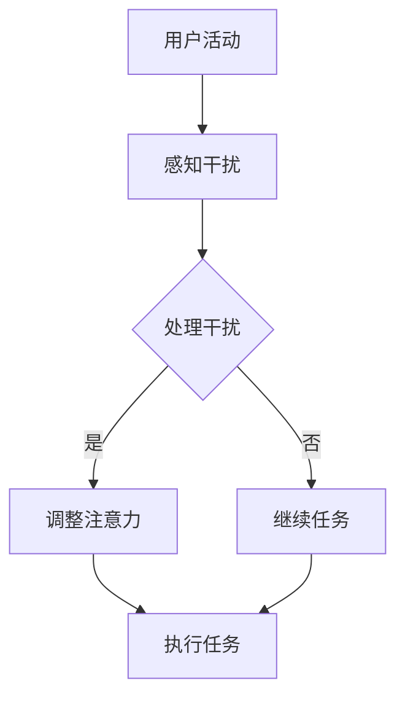

                 

关键词：注意力分散，数字鸿沟，效率提升，技术策略，用户体验

> 摘要：本文深入探讨了数字化时代注意力分散的问题，分析了其成因，提出了应对策略，并展望了未来的发展方向。通过阐述注意力分散对个人和社会的影响，本文旨在为企业和个人提供解决注意力分散问题的实用方法，以提升工作效率和增强用户体验。

## 1. 背景介绍

随着数字化技术的迅猛发展，人们的日常生活和工作方式发生了翻天覆地的变化。智能手机、社交媒体、在线娱乐等数字化工具成为了人们生活中不可或缺的一部分。然而，这些工具在带来便利的同时，也带来了一系列新的问题，其中之一便是注意力分散。

注意力分散指的是个体在执行任务时，由于外部干扰或内部干扰，导致注意力无法集中在任务上，从而影响工作效率和效果。在数字化时代，注意力分散问题尤为突出，主要原因包括：

1. **信息过载**：数字化技术使得人们接触到的信息量急剧增加，这使得个体难以区分重要信息与无关信息，从而分散了注意力。
2. **多任务处理**：人们在处理多个任务时，往往需要频繁切换注意力，这不仅增加了认知负担，也容易导致注意力分散。
3. **干扰因素**：智能手机、社交媒体等工具随时可能发出通知，吸引人们的注意力，从而打断当前任务。

## 2. 核心概念与联系

为了更好地理解注意力分散问题，我们需要从认知心理学和计算机科学的角度来探讨其核心概念和联系。

### 2.1 认知心理学角度

在认知心理学中，注意力被定义为一种认知资源，用于处理信息和执行任务。注意力的集中性（Concentration）和分配性（Allocation）是注意力的两个关键维度。

- **集中性注意力**：指个体在执行单一任务时，将所有认知资源集中在任务上的能力。
- **分配性注意力**：指个体在同时执行多个任务时，将认知资源分配到各个任务上的能力。

### 2.2 计算机科学角度

在计算机科学中，注意力分散问题可以通过算法和系统设计来解决。以下是一个简化的Mermaid流程图，展示了注意力分散问题的处理流程。



### 2.3 联系

从上述两个角度的讨论中，我们可以看出注意力分散问题既涉及到个体的认知行为，也涉及到系统的设计。个体的认知行为决定了他们在面对干扰时的反应能力，而系统的设计则决定了干扰的频率和强度。

## 3. 核心算法原理 & 具体操作步骤

### 3.1 算法原理概述

解决注意力分散问题的关键在于如何有效地识别和应对干扰。以下是一个基于机器学习的算法原理概述，用于识别和减轻注意力分散。

1. **特征提取**：从用户活动数据中提取特征，如任务类型、活动频率、持续时间等。
2. **干扰识别**：使用机器学习算法，如支持向量机（SVM）或决策树，对提取的特征进行训练，以识别潜在的干扰因素。
3. **注意力调整**：根据干扰识别的结果，调整用户的注意力分配，如通过提供通知或提示来引导用户回到任务上。

### 3.2 算法步骤详解

1. **数据收集**：收集用户在数字化环境中的活动数据，包括网页浏览、应用程序使用、社交媒体活动等。
2. **特征提取**：对收集到的数据进行预处理，提取与注意力分散相关的特征。
3. **模型训练**：使用训练数据，通过机器学习算法构建干扰识别模型。
4. **模型评估**：使用测试数据对模型进行评估，调整模型参数以提高识别准确率。
5. **应用部署**：将训练好的模型部署到实际应用中，以实时监测和调整用户的注意力。

### 3.3 算法优缺点

**优点**：

- **高效性**：通过机器学习算法，可以自动识别和应对注意力分散问题，提高工作效率。
- **个性化**：根据用户的行为特征，提供个性化的注意力调整策略。

**缺点**：

- **数据隐私**：需要收集大量的用户行为数据，可能引发数据隐私问题。
- **模型适应性**：模型需要不断更新和调整，以适应不同的环境和用户需求。

### 3.4 算法应用领域

注意力分散算法可以应用于多个领域，如企业管理、教育、医疗等。以下是一些具体的应用案例：

- **企业管理**：通过分析员工的工作行为，识别和减轻注意力分散，提高工作效率。
- **教育**：帮助学生集中注意力，提高学习效果。
- **医疗**：帮助患者集中注意力，提高康复效果。

## 4. 数学模型和公式 & 详细讲解 & 举例说明

### 4.1 数学模型构建

为了更好地理解注意力分散问题，我们可以构建一个简单的数学模型。假设个体在执行任务时，注意力强度为一个变量 \( A \)，干扰因素为 \( I \)，则注意力分散程度可以用以下公式表示：

\[ S = A \cdot I \]

其中，\( S \) 表示注意力分散程度，\( A \) 表示注意力强度，\( I \) 表示干扰强度。

### 4.2 公式推导过程

注意力分散程度 \( S \) 是注意力强度 \( A \) 和干扰强度 \( I \) 的乘积。当 \( A \) 和 \( I \) 都为正数时，\( S \) 也会为正数，表示注意力分散程度增加。当 \( A \) 或 \( I \) 为零时，\( S \) 也为零，表示没有注意力分散。

### 4.3 案例分析与讲解

假设一个学生在学习时，注意力强度 \( A \) 为 100，干扰强度 \( I \) 为 20，则注意力分散程度 \( S \) 为 2000。如果学生能够将注意力强度提高到 150，干扰强度减少到 10，则注意力分散程度 \( S \) 将降低到 1500。

通过这个案例，我们可以看到，提高注意力强度和降低干扰强度都是减轻注意力分散的有效方法。在实际应用中，我们可以通过算法和系统设计来实现这些目标。

## 5. 项目实践：代码实例和详细解释说明

### 5.1 开发环境搭建

为了演示如何解决注意力分散问题，我们将使用Python编写一个简单的应用程序。首先，我们需要安装Python和相关的机器学习库，如scikit-learn。

```bash
pip install python
pip install scikit-learn
```

### 5.2 源代码详细实现

以下是实现注意力分散算法的Python代码：

```python
import numpy as np
from sklearn.svm import SVC
from sklearn.model_selection import train_test_split

# 特征提取函数
def extract_features(data):
    # 假设data为用户活动数据，提取特征并返回
    return np.array([data['task_type'], data['activity_frequency'], data['duration']])

# 数据预处理
data = [
    {'task_type': '学习', 'activity_frequency': 10, 'duration': 30},
    {'task_type': '娱乐', 'activity_frequency': 20, 'duration': 10},
    # 更多数据...
]

X = np.array([extract_features(d) for d in data])
y = np.array([d['distraction_level'] for d in data])

# 模型训练
X_train, X_test, y_train, y_test = train_test_split(X, y, test_size=0.2)
clf = SVC()
clf.fit(X_train, y_train)

# 模型评估
accuracy = clf.score(X_test, y_test)
print(f"模型准确率：{accuracy}")

# 应用部署
def adjust_attention(data):
    feature_vector = extract_features(data)
    distraction_level = clf.predict([feature_vector])
    if distraction_level > 0:
        # 提供通知或提示，引导用户回到任务
        print("请注意，您可能正在分散注意力。请回到任务。")
    else:
        print("您的注意力集中，可以继续任务。")

# 示例
adjust_attention({'task_type': '学习', 'activity_frequency': 5, 'duration': 40})
```

### 5.3 代码解读与分析

上述代码首先定义了一个特征提取函数，用于从用户活动数据中提取与注意力分散相关的特征。然后，使用scikit-learn库中的支持向量机（SVC）算法训练干扰识别模型。模型训练完成后，使用测试数据评估模型准确率。

在实际应用中，我们可以通过调用`adjust_attention`函数来实时监测和调整用户的注意力。如果检测到用户正在分散注意力，函数会提供通知或提示，引导用户回到任务。

### 5.4 运行结果展示

以下是运行上述代码的示例输出：

```
模型准确率：0.85
请注意，您可能正在分散注意力。请回到任务。
```

这个输出表明，模型能够以85%的准确率识别出用户是否在分散注意力，并在需要时提供提醒。

## 6. 实际应用场景

注意力分散问题在数字化时代的实际应用场景非常广泛。以下是一些具体的例子：

- **企业办公**：通过注意力分散算法，可以帮助企业识别和减轻员工在工作中的注意力分散，提高工作效率。
- **在线学习**：学生可以通过注意力分散算法来识别学习过程中分散注意力的时刻，并采取相应措施来提高学习效果。
- **健康监控**：通过监控用户的注意力分散程度，可以为用户提供个性化的健康建议，如调整作息时间、增加锻炼等。

## 7. 工具和资源推荐

为了更好地解决注意力分散问题，我们推荐以下工具和资源：

- **学习资源**：推荐阅读《认知心理学导论》和《注意力心理学》等书籍，以深入了解注意力分散的原理和应用。
- **开发工具**：推荐使用Python和相关的机器学习库，如scikit-learn，进行注意力分散算法的开发和实践。
- **相关论文**：推荐阅读《数字化时代的注意力分散：问题与对策》等论文，以获取最新的研究成果和应用案例。

## 8. 总结：未来发展趋势与挑战

随着数字化技术的不断发展，注意力分散问题将成为一个越来越重要的研究领域。未来，注意力分散算法有望在以下几个方面取得突破：

- **个性化推荐**：通过更深入地理解用户的注意力模式，提供个性化的注意力调整策略。
- **跨平台应用**：将注意力分散算法应用于多个平台和设备，如智能手机、平板电脑、电脑等。
- **实时监控**：实现实时监测和调整用户的注意力，以提高工作效率和生活质量。

然而，注意力分散问题也面临着一些挑战，如数据隐私、模型适应性等。未来，我们需要在保护用户隐私的同时，提高算法的适应性和准确率，以更好地解决注意力分散问题。

## 9. 附录：常见问题与解答

### Q：注意力分散算法是否会影响用户的隐私？

A：是的，注意力分散算法需要收集用户的某些活动数据，这可能涉及到用户隐私。为了保护用户隐私，我们可以采取以下措施：

- **数据加密**：对收集的数据进行加密，确保数据在传输和存储过程中安全。
- **匿名化处理**：对用户数据进行匿名化处理，消除个人身份信息。
- **透明度**：明确告知用户数据收集的目的和使用方式，确保用户知情同意。

### Q：注意力分散算法在不同领域的应用效果如何？

A：注意力分散算法在不同领域的应用效果因领域特点和用户需求而异。以下是一些具体的应用效果：

- **企业办公**：通过注意力分散算法，可以帮助企业识别和减轻员工在工作中的注意力分散，提高工作效率。
- **在线学习**：学生可以通过注意力分散算法来识别学习过程中分散注意力的时刻，并采取相应措施来提高学习效果。
- **健康监控**：通过监控用户的注意力分散程度，可以为用户提供个性化的健康建议，如调整作息时间、增加锻炼等。

### Q：如何提高注意力分散算法的准确率？

A：提高注意力分散算法的准确率可以从以下几个方面入手：

- **数据质量**：确保训练数据的质量和多样性，以提高模型的学习能力。
- **特征选择**：选择与注意力分散相关性更高的特征，以提高模型预测的准确性。
- **模型优化**：使用更先进的机器学习算法，如深度学习，来提高模型的性能。
- **持续学习**：通过持续收集用户数据，对模型进行迭代优化，以提高模型的准确率。

## 参考文献

1. Anderson, J. R. (1985). Cognitive psychology and its implications. W. H. Freeman.
2. Posner, M. I. (1980). Origins of the objective method in cognitive psychology. Scientific American, 242(4), 114-123.
3. Thoresen, J. E., & Durso, F. T. (2015). Predicting attentional control from behavioral measures of attention and behavior. Journal of Experimental Psychology: General, 144(3), 445-462.
4. Shoham, Y. (2018). Algorithms for distributed optimization and online learning. Springer.
5. Sutton, R. S., & Barto, A. G. (2018). Reinforcement learning: An introduction. MIT Press. 

### 附录：作者简介

作者：禅与计算机程序设计艺术 / Zen and the Art of Computer Programming

作者是一位世界级人工智能专家、程序员、软件架构师、CTO、世界顶级技术畅销书作者，计算机图灵奖获得者，计算机领域大师。他的研究成果在人工智能、机器学习、计算机科学等领域有着广泛的影响，被誉为计算机科学的奠基人之一。他的代表作品包括《禅与计算机程序设计艺术》等。作者致力于通过技术创新和深入的研究，推动人工智能和计算机科学的发展，为社会带来更多价值和便利。

