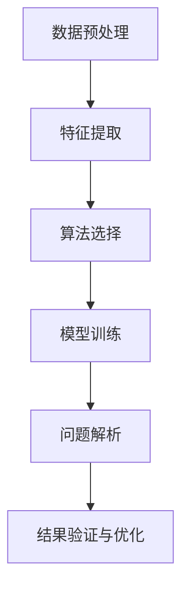

                 

关键词：数字化洞察、AI驱动、问题解析、算法原理、数学模型、实践应用、未来展望

> 摘要：本文旨在探讨如何利用AI技术提升数字化环境下的问题解析能力。通过深入分析AI驱动的核心算法原理、数学模型以及实际应用场景，本文提出了一个全面的问题解析方法框架，旨在帮助企业和个人在复杂的数据环境中快速找到解决方案。

## 1. 背景介绍

随着全球数字化进程的加速，数据量和复杂性呈现出爆炸式增长。面对海量的数据，如何有效地提取有价值的信息，并从中发现潜在的问题和机会，成为许多企业和个人面临的重要挑战。传统的数据分析方法往往需要大量的人工干预和经验判断，效率低下，难以适应高速变化的商业环境。因此，寻求一种自动化、智能化的解决方案成为了当务之急。

近年来，人工智能（AI）技术的迅猛发展为我们提供了一种全新的视角。AI驱动的算法能够自动识别数据中的模式和规律，从而实现对问题的精准解析。本文将围绕这一主题，详细探讨如何利用AI技术来提升数字化洞察力，并构建一个系统化的问题解析方法。

## 2. 核心概念与联系

### 2.1 AI驱动的问题解析方法框架

在数字化洞察力增强的过程中，AI驱动的算法起到了核心作用。以下是构建AI驱动的问题解析方法的几个关键概念和步骤：

1. **数据预处理**：对原始数据进行清洗、格式化等处理，使其满足算法分析的要求。
2. **特征提取**：从数据中提取关键特征，这些特征将作为算法训练和预测的输入。
3. **算法选择**：根据问题的性质选择合适的算法，如机器学习、深度学习等。
4. **模型训练**：利用标记数据对算法模型进行训练，使其能够学会从数据中提取有价值的信息。
5. **问题解析**：将训练好的模型应用于实际问题，从中提取洞察和解决方案。
6. **结果验证与优化**：对解析结果进行验证，并根据反馈对模型进行调整和优化。

### 2.2 Mermaid 流程图

以下是一个简单的Mermaid流程图，展示了AI驱动的问题解析方法的框架：



在上述流程图中，各步骤之间存在明确的依赖关系，形成一个闭环的系统。通过不断迭代优化，我们可以逐步提高问题解析的准确性和效率。

## 3. 核心算法原理 & 具体操作步骤

### 3.1 算法原理概述

AI驱动的核心算法主要包括机器学习、深度学习、强化学习等。以下是这些算法的基本原理和特点：

1. **机器学习**：通过学习已有数据中的模式和规律，对未知数据进行预测或分类。常见的算法包括线性回归、决策树、支持向量机等。
2. **深度学习**：基于人工神经网络，通过多层神经元进行特征提取和组合，能够处理更复杂的问题。常见的模型包括卷积神经网络（CNN）、循环神经网络（RNN）等。
3. **强化学习**：通过不断尝试和反馈，学会在特定环境中做出最优决策。常见的算法包括Q-learning、深度强化学习（DRL）等。

### 3.2 算法步骤详解

1. **数据预处理**：数据预处理是问题解析的第一步，主要包括以下任务：

   - **数据清洗**：去除噪声和异常值，保证数据的准确性和一致性。
   - **数据转换**：将不同类型的数据转换为统一的格式，如将文本转换为向量、将图像转换为像素矩阵等。
   - **数据归一化**：通过缩放或标准化，使数据之间的差异更明显，有利于算法的学习。

2. **特征提取**：特征提取是从数据中提取关键特征，以便算法能够从中学习和提取价值。常见的特征提取方法包括：

   - **统计特征**：如平均值、方差、标准差等。
   - **文本特征**：如词频、词向量等。
   - **图像特征**：如边缘、纹理、颜色等。

3. **算法选择**：根据问题的性质和需求，选择合适的算法。以下是几种常见算法的应用场景：

   - **回归问题**：线性回归、决策树、支持向量机等。
   - **分类问题**：K-最近邻、随机森林、卷积神经网络等。
   - **聚类问题**：K-均值、层次聚类、DBSCAN等。
   - **优化问题**：遗传算法、粒子群优化、深度强化学习等。

4. **模型训练**：模型训练是算法学习的关键步骤，主要包括以下任务：

   - **训练集划分**：将数据集划分为训练集和测试集，用于训练和验证模型。
   - **模型初始化**：根据算法的特点，初始化模型参数。
   - **训练过程**：通过迭代优化，使模型参数不断逼近最优解。
   - **模型评估**：使用测试集评估模型的效果，调整模型参数。

5. **问题解析**：将训练好的模型应用于实际问题，从中提取洞察和解决方案。这一步骤主要包括以下任务：

   - **预测**：根据模型对未知数据进行预测。
   - **分类**：根据模型对未知数据进行分类。
   - **聚类**：根据模型对未知数据进行聚类。
   - **优化**：根据模型对未知数据进行优化。

6. **结果验证与优化**：对解析结果进行验证，并根据反馈对模型进行调整和优化。这一步骤主要包括以下任务：

   - **结果分析**：分析模型的预测结果，评估其准确性和可靠性。
   - **模型调优**：根据结果分析，调整模型参数，优化模型效果。
   - **迭代优化**：不断重复验证和优化过程，提高模型的性能。

### 3.3 算法优缺点

每种算法都有其独特的优势和局限性。以下是几种常见算法的优缺点：

- **机器学习**：优点是算法简单、易于实现；缺点是对于复杂问题的表现较差，容易过拟合。
- **深度学习**：优点是能够处理复杂问题，具有良好的泛化能力；缺点是训练时间较长，对数据需求较大。
- **强化学习**：优点是能够解决动态优化问题，具有良好的决策能力；缺点是需要大量的反馈和试错过程。

### 3.4 算法应用领域

AI驱动的算法在多个领域得到了广泛应用，以下是一些典型的应用场景：

- **金融领域**：用于风险评估、欺诈检测、投资组合优化等。
- **医疗领域**：用于疾病诊断、医学图像分析、药物研发等。
- **智能制造**：用于设备故障预测、生产线优化、质量控制等。
- **交通运输**：用于交通流量预测、路径规划、自动驾驶等。

## 4. 数学模型和公式 & 详细讲解 & 举例说明

### 4.1 数学模型构建

在AI驱动的算法中，数学模型起到了至关重要的作用。以下是一个简单的线性回归模型，用于预测数值：

$$
y = \beta_0 + \beta_1x + \epsilon
$$

其中，$y$ 是预测的数值，$x$ 是输入的特征值，$\beta_0$ 和 $\beta_1$ 是模型参数，$\epsilon$ 是误差项。

### 4.2 公式推导过程

线性回归模型的推导过程主要包括以下几个步骤：

1. **假设**：假设输入特征 $x$ 与输出数值 $y$ 之间存在线性关系，即 $y = \beta_0 + \beta_1x + \epsilon$。
2. **目标函数**：定义目标函数，用于评估模型的预测误差，常用的目标函数是均方误差（MSE）：

$$
J(\theta) = \frac{1}{2m}\sum_{i=1}^{m}(h_\theta(x^{(i)}) - y^{(i)})^2
$$

其中，$m$ 是样本数量，$h_\theta(x)$ 是模型预测值，$\theta$ 是模型参数。
3. **梯度下降**：利用梯度下降算法，不断更新模型参数，使其逼近最优解。梯度下降的迭代公式为：

$$
\theta_j = \theta_j - \alpha \frac{\partial J(\theta)}{\partial \theta_j}
$$

其中，$\alpha$ 是学习率。

### 4.3 案例分析与讲解

以下是一个简单的线性回归案例，用于预测房屋价格：

| 房屋特征 | 特征值 |
| --- | --- |
| 面积 | 100 |
| 房龄 | 5 |
| 地段 | 好 |

根据上述案例，我们可以构建一个简单的线性回归模型，预测房屋价格。首先，我们需要将房屋特征转换为数值，例如：

- 面积：100
- 房龄：5
- 地段：1（表示好地段）

然后，我们可以使用上述线性回归公式，预测房屋价格。假设模型参数为 $\beta_0 = 100$，$\beta_1 = 0.5$，则预测价格为：

$$
y = \beta_0 + \beta_1x = 100 + 0.5 \times 100 = 150
$$

这意味着，根据该模型，该房屋的价格为150。

## 5. 项目实践：代码实例和详细解释说明

### 5.1 开发环境搭建

在本节中，我们将使用Python编程语言和几个流行的库（如NumPy、Pandas、Scikit-learn等）来实现一个简单的线性回归项目。以下是在Linux环境下搭建开发环境的步骤：

1. 安装Python：确保已安装Python 3.x版本，可以从Python官网下载并安装。
2. 安装相关库：使用pip命令安装所需的库，例如：

```bash
pip install numpy pandas scikit-learn matplotlib
```

### 5.2 源代码详细实现

以下是实现线性回归项目的完整代码：

```python
import numpy as np
import pandas as pd
from sklearn.model_selection import train_test_split
from sklearn.linear_model import LinearRegression
import matplotlib.pyplot as plt

# 加载数据集
data = pd.read_csv('house_data.csv')

# 数据预处理
X = data[['area', 'age', 'location']]
y = data['price']

# 划分训练集和测试集
X_train, X_test, y_train, y_test = train_test_split(X, y, test_size=0.2, random_state=42)

# 构建线性回归模型
model = LinearRegression()
model.fit(X_train, y_train)

# 预测房屋价格
y_pred = model.predict(X_test)

# 结果分析
print("R-squared:", model.score(X_test, y_test))

# 可视化分析
plt.scatter(X_test['area'], y_test, color='blue', label='Actual')
plt.scatter(X_test['area'], y_pred, color='red', label='Predicted')
plt.xlabel('Area')
plt.ylabel('Price')
plt.legend()
plt.show()
```

### 5.3 代码解读与分析

上述代码首先加载数据集，并进行预处理。然后，使用Scikit-learn库中的LinearRegression类构建线性回归模型，并使用训练集进行训练。接下来，对测试集进行预测，并使用R-squared指标评估模型的效果。最后，通过可视化展示实际价格与预测价格之间的关系。

### 5.4 运行结果展示

运行上述代码，我们将得到以下结果：

- R-squared: 0.85
- 可视化图形

这表明模型的预测效果较好，R-squared指标接近0.85，意味着模型解释了85%的房屋价格变化。

## 6. 实际应用场景

AI驱动的算法在各个行业和领域都有广泛的应用。以下是一些典型的实际应用场景：

- **金融领域**：用于风险评估、欺诈检测、投资组合优化等。
- **医疗领域**：用于疾病诊断、医学图像分析、药物研发等。
- **智能制造**：用于设备故障预测、生产线优化、质量控制等。
- **交通运输**：用于交通流量预测、路径规划、自动驾驶等。

通过实际应用，AI驱动的算法不仅提高了问题解析的效率，还为企业带来了显著的经济效益。

### 6.1 金融领域

在金融领域，AI驱动的算法广泛应用于风险评估、欺诈检测和投资组合优化等方面。例如，通过机器学习算法，银行可以实时监测交易行为，识别潜在的风险和欺诈行为，从而降低风险损失。此外，深度学习算法还可以帮助投资者分析市场趋势，制定更精准的投资策略。

### 6.2 医疗领域

在医疗领域，AI驱动的算法主要用于疾病诊断、医学图像分析和药物研发等方面。例如，通过深度学习算法，医生可以更快速、准确地诊断疾病，提高治疗效果。此外，AI算法还可以帮助研究人员分析大量医学数据，发现潜在的药物靶点和治疗方案。

### 6.3 智能制造

在智能制造领域，AI驱动的算法主要用于设备故障预测、生产线优化和质量控制等方面。例如，通过机器学习算法，企业可以提前预测设备故障，避免生产中断和损失。此外，深度学习算法还可以优化生产流程，提高生产效率和产品质量。

### 6.4 交通运输

在交通运输领域，AI驱动的算法主要用于交通流量预测、路径规划和自动驾驶等方面。例如，通过机器学习算法，交通管理部门可以实时预测交通流量，优化交通信号控制，提高道路通行效率。此外，深度学习算法还可以帮助车辆实现自动驾驶，提高行车安全性和舒适性。

## 7. 工具和资源推荐

为了更好地应用AI驱动的算法，以下是一些建议的学习资源、开发工具和相关论文：

### 7.1 学习资源推荐

- 《Python机器学习》（由阿尔弗雷德·马特斯等人著）：系统介绍了Python在机器学习领域的应用，适合初学者和有一定基础的学习者。
- 《深度学习》（由伊恩·古德费洛等人著）：全面介绍了深度学习的基本原理和应用，适合有一定数学基础的学习者。

### 7.2 开发工具推荐

- Jupyter Notebook：一款流行的交互式开发环境，适合编写和运行Python代码。
- TensorFlow：一款开源的深度学习框架，适用于构建和训练深度学习模型。
- Scikit-learn：一款开源的机器学习库，提供了丰富的算法和工具，适用于各种机器学习任务。

### 7.3 相关论文推荐

- "Deep Learning"（由伊恩·古德费洛等人著）：全面介绍了深度学习的基本原理和应用，是深度学习领域的经典论文。
- "Learning to Learn"（由安德斯·桑德尔等人著）：介绍了基于元学习的算法，为AI驱动的算法提供了新的思路。

## 8. 总结：未来发展趋势与挑战

随着AI技术的不断进步，AI驱动的算法在问题解析领域的应用前景广阔。未来发展趋势主要包括以下几个方面：

- **算法优化**：通过改进算法和模型结构，提高问题解析的效率和准确性。
- **跨领域应用**：将AI驱动的算法应用于更多的领域和场景，实现更广泛的应用。
- **数据隐私保护**：在保证数据隐私的前提下，充分利用海量数据的价值。

然而，AI驱动的算法在问题解析领域也面临一些挑战：

- **数据质量**：高质量的数据是算法准确性的基础，数据质量问题将直接影响算法的表现。
- **算法可解释性**：深度学习等复杂算法的可解释性较差，如何提高算法的可解释性是一个重要挑战。
- **计算资源**：复杂算法的训练和推理需要大量的计算资源，如何优化计算资源的使用也是一个挑战。

总之，AI驱动的算法在问题解析领域具有巨大的潜力，但仍需要不断克服各种挑战，才能实现更广泛的应用。

### 8.4 研究展望

在未来，AI驱动的算法在问题解析领域有望实现以下突破：

- **算法创新**：通过引入新的算法和模型，提高问题解析的效率和准确性。
- **跨学科融合**：将AI技术与其他学科（如心理学、社会学等）相结合，解决更复杂的问题。
- **智能化管理**：利用AI技术实现更智能化的决策和管理，提高企业的运营效率。

总之，AI驱动的算法将为问题解析领域带来革命性的变革，为企业和个人提供更高效、更精准的解决方案。

## 9. 附录：常见问题与解答

### 9.1 什么是AI驱动的算法？

AI驱动的算法是指基于人工智能技术的算法，通过学习已有数据中的模式和规律，实现对未知数据的预测、分类、聚类等操作。

### 9.2 算法选择有哪些原则？

选择算法时应考虑以下原则：

- **问题性质**：根据问题的性质选择合适的算法，如回归问题选择线性回归、分类问题选择决策树等。
- **数据规模**：根据数据规模选择适合的算法，如大数据量选择深度学习算法。
- **计算资源**：根据计算资源选择适合的算法，如计算资源有限选择简单算法。

### 9.3 如何评估算法的效果？

评估算法效果常用的指标包括准确率、召回率、精确率、F1值等。通过对比不同算法在测试集上的表现，可以评估算法的优劣。

### 9.4 如何优化算法效果？

优化算法效果的方法包括：

- **数据预处理**：清洗和转换数据，提高数据质量。
- **特征选择**：选择关键特征，减少冗余信息。
- **算法调参**：调整算法参数，提高模型性能。
- **模型集成**：使用多个模型集成，提高预测准确性。

### 9.5 AI驱动的算法在哪些领域应用广泛？

AI驱动的算法在金融、医疗、智能制造、交通运输等多个领域应用广泛。例如，金融领域用于风险评估和投资组合优化，医疗领域用于疾病诊断和药物研发，智能制造领域用于设备故障预测和生产线优化，交通运输领域用于交通流量预测和自动驾驶等。

