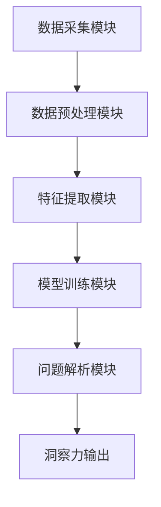

                 

关键词：AI增强、问题解析、数字化洞察力、工具、技术博客

摘要：本文将深入探讨AI增强的问题解析工具，探讨其背景、核心概念、算法原理、数学模型、项目实践以及未来应用场景。通过对数字化洞察力放大镜的介绍，我们将展示如何利用AI技术提升问题解析的效率和准确性，为行业提供宝贵的洞见和解决方案。

## 1. 背景介绍

在数字化时代，数据量呈现爆炸性增长，随之而来的是问题解析的复杂性不断增加。从传统的数据分析方法到现代的机器学习和深度学习技术，人们一直在寻找更加高效、准确的问题解析工具。然而，单纯依赖人工分析往往难以应对海量数据和复杂问题，这促使人工智能（AI）在问题解析领域发挥越来越重要的作用。

AI增强的问题解析工具结合了人工智能和数据分析的强大功能，通过机器学习算法、自然语言处理（NLP）、计算机视觉等技术，能够从海量数据中快速提取有价值的信息，提供深层次的洞察力。这些工具不仅能够提高问题解析的效率，还能提升解析的准确性，为企业和行业提供更加可靠的决策支持。

本文旨在介绍AI增强的问题解析工具，分析其核心概念、算法原理、数学模型，并通过实际项目实践展示其应用效果。同时，我们还将探讨这种工具在各个行业中的应用场景，以及其未来发展的趋势和挑战。

## 2. 核心概念与联系

### 2.1. AI增强的问题解析

AI增强的问题解析是指利用人工智能技术，特别是机器学习和深度学习算法，对问题进行分析和解决的过程。它主要包括以下几个核心概念：

1. **数据收集**：收集与问题相关的数据，包括结构化和非结构化数据。
2. **数据处理**：对收集到的数据进行清洗、预处理和特征提取，以便于模型训练和预测。
3. **模型训练**：利用训练数据集，通过机器学习和深度学习算法训练模型。
4. **问题解析**：利用训练好的模型对实际问题进行解析，提供决策支持和预测。

### 2.2. 数字化洞察力放大镜

数字化洞察力放大镜是一个集成多种AI技术的综合性工具，它能够从海量数据中快速提取有价值的信息，提供深层次的洞察力。其主要组成部分包括：

1. **数据采集模块**：从各种数据源（如数据库、API、网络爬虫等）收集数据。
2. **数据预处理模块**：对采集到的数据进行清洗、去噪、格式化等预处理操作。
3. **特征提取模块**：从预处理后的数据中提取特征，以便于模型训练。
4. **模型训练模块**：利用训练数据集，通过机器学习和深度学习算法训练模型。
5. **问题解析模块**：利用训练好的模型对实际问题进行解析，提供洞察力和决策支持。

### 2.3. Mermaid 流程图

下面是一个简化的 Mermaid 流程图，展示了数字化洞察力放大镜的架构和工作流程：



## 3. 核心算法原理 & 具体操作步骤

### 3.1. 算法原理概述

AI增强的问题解析工具主要基于以下核心算法原理：

1. **机器学习算法**：通过训练数据集，学习数据中的规律和模式，以便对新数据做出预测或分类。
2. **深度学习算法**：基于神经网络结构，通过多层非线性变换，从数据中学习复杂特征和模式。
3. **自然语言处理（NLP）**：对文本数据进行处理，提取语义信息，以便于机器理解。
4. **计算机视觉**：对图像和视频数据进行处理，提取视觉特征，用于物体检测、识别和分类。

### 3.2. 算法步骤详解

以下是AI增强的问题解析工具的具体操作步骤：

1. **数据收集**：从各种数据源收集与问题相关的数据，包括结构化和非结构化数据。
2. **数据处理**：对收集到的数据进行清洗、去噪、格式化等预处理操作，以便于模型训练和预测。
3. **特征提取**：从预处理后的数据中提取特征，以便于模型训练。特征提取的方法包括统计特征、文本特征、图像特征等。
4. **模型训练**：利用训练数据集，通过机器学习和深度学习算法训练模型。常见的模型包括决策树、随机森林、支持向量机（SVM）、神经网络等。
5. **模型评估**：使用测试数据集评估模型的性能，包括准确性、召回率、F1值等指标。
6. **问题解析**：利用训练好的模型对实际问题进行解析，提供洞察力和决策支持。
7. **洞察力输出**：将问题解析的结果以可视化、报告等形式输出，供用户参考。

### 3.3. 算法优缺点

**优点**：

1. **高效性**：利用机器学习和深度学习算法，可以快速处理海量数据，提高问题解析的效率。
2. **准确性**：通过训练模型，可以提升问题解析的准确性，为决策提供可靠的依据。
3. **灵活性**：可以针对不同的问题和应用场景，定制化地设计和调整算法模型。

**缺点**：

1. **数据依赖性**：模型的训练和性能依赖于数据质量，数据不足或质量差会影响模型的性能。
2. **复杂性**：机器学习和深度学习算法较为复杂，需要专业知识和技能。
3. **解释性**：部分算法（如深度神经网络）的黑箱特性，使得模型难以解释和理解。

### 3.4. 算法应用领域

AI增强的问题解析工具可以广泛应用于各个领域，如：

1. **金融**：风险控制、信用评估、市场预测等。
2. **医疗**：疾病诊断、药物研发、患者管理等。
3. **零售**：需求预测、库存管理、客户行为分析等。
4. **交通**：路况预测、交通流量分析、自动驾驶等。
5. **制造**：故障预测、质量控制、生产优化等。

## 4. 数学模型和公式 & 详细讲解 & 举例说明

### 4.1. 数学模型构建

在AI增强的问题解析中，常用的数学模型包括线性回归、逻辑回归、支持向量机（SVM）、神经网络等。下面简要介绍这些模型的数学原理。

#### 4.1.1. 线性回归

线性回归模型用于预测连续值输出。其数学模型为：

$$
y = \beta_0 + \beta_1x_1 + \beta_2x_2 + \cdots + \beta_nx_n + \epsilon
$$

其中，$y$为输出值，$x_1, x_2, \cdots, x_n$为输入特征，$\beta_0, \beta_1, \beta_2, \cdots, \beta_n$为模型参数，$\epsilon$为误差项。

#### 4.1.2. 逻辑回归

逻辑回归模型用于预测概率值。其数学模型为：

$$
\hat{y} = \frac{1}{1 + e^{-(\beta_0 + \beta_1x_1 + \beta_2x_2 + \cdots + \beta_nx_n)}}
$$

其中，$\hat{y}$为预测概率值，$x_1, x_2, \cdots, x_n$为输入特征，$\beta_0, \beta_1, \beta_2, \cdots, \beta_n$为模型参数。

#### 4.1.3. 支持向量机（SVM）

支持向量机模型用于分类问题。其数学模型为：

$$
\hat{y} = \text{sign}(\sum_{i=1}^{n}\alpha_iy_i\phi(x_i) + b)
$$

其中，$\hat{y}$为预测类别，$x_i$为输入特征，$y_i$为实际类别，$\alpha_i$为模型参数，$\phi(x_i)$为核函数，$b$为偏置项。

#### 4.1.4. 神经网络

神经网络模型用于复杂特征提取和预测。其数学模型为：

$$
\hat{y} = \sigma(\sum_{i=1}^{n}\theta_ih_i + b)
$$

其中，$\hat{y}$为预测输出，$h_i$为隐藏层单元输出，$\theta_i$为模型参数，$\sigma$为激活函数，$b$为偏置项。

### 4.2. 公式推导过程

以线性回归为例，介绍公式推导过程。假设我们有训练数据集$D = \{(x_1, y_1), (x_2, y_2), \cdots, (x_n, y_n)\}$，其中$x_i$为输入特征，$y_i$为输出值。

#### 4.2.1. 最小二乘法

线性回归模型通过最小化误差平方和来估计模型参数。误差平方和为：

$$
J(\beta_0, \beta_1, \beta_2, \cdots, \beta_n) = \sum_{i=1}^{n}(y_i - (\beta_0 + \beta_1x_1 + \beta_2x_2 + \cdots + \beta_nx_n))^2
$$

对误差平方和求偏导，并令其等于0，得到：

$$
\frac{\partial J}{\partial \beta_0} = -2\sum_{i=1}^{n}(y_i - (\beta_0 + \beta_1x_1 + \beta_2x_2 + \cdots + \beta_nx_n)) = 0
$$

$$
\frac{\partial J}{\partial \beta_1} = -2\sum_{i=1}^{n}x_1(y_i - (\beta_0 + \beta_1x_1 + \beta_2x_2 + \cdots + \beta_nx_n)) = 0
$$

$$
\vdots
$$

$$
\frac{\partial J}{\partial \beta_n} = -2\sum_{i=1}^{n}x_n(y_i - (\beta_0 + \beta_1x_1 + \beta_2x_2 + \cdots + \beta_nx_n)) = 0
$$

解上述方程组，可以得到最小二乘法估计的模型参数：

$$
\beta_0 = \frac{1}{n}\sum_{i=1}^{n}y_i - \beta_1\frac{1}{n}\sum_{i=1}^{n}x_1 - \beta_2\frac{1}{n}\sum_{i=1}^{n}x_2 - \cdots - \beta_n\frac{1}{n}\sum_{i=1}^{n}x_n
$$

$$
\beta_1 = \frac{1}{n}\sum_{i=1}^{n}(x_1 - \beta_0\frac{1}{n}\sum_{i=1}^{n}x_1)(y_i - \beta_0\frac{1}{n}\sum_{i=1}^{n}y_i)
$$

$$
\vdots
$$

$$
\beta_n = \frac{1}{n}\sum_{i=1}^{n}(x_n - \beta_0\frac{1}{n}\sum_{i=1}^{n}x_n)(y_i - \beta_0\frac{1}{n}\sum_{i=1}^{n}y_i)
$$

#### 4.2.2. 梯度下降法

梯度下降法是另一种求解最小二乘法的方法。其基本思想是沿着误差函数的梯度方向，迭代更新模型参数，直至达到最小值。

设误差函数为：

$$
J(\beta_0, \beta_1, \beta_2, \cdots, \beta_n) = \sum_{i=1}^{n}(y_i - (\beta_0 + \beta_1x_1 + \beta_2x_2 + \cdots + \beta_nx_n))^2
$$

梯度下降法的更新公式为：

$$
\beta_0 = \beta_0 - \alpha\frac{\partial J}{\partial \beta_0}
$$

$$
\beta_1 = \beta_1 - \alpha\frac{\partial J}{\partial \beta_1}
$$

$$
\vdots
$$

$$
\beta_n = \beta_n - \alpha\frac{\partial J}{\partial \beta_n}
$$

其中，$\alpha$为学习率。

### 4.3. 案例分析与讲解

下面以一个简单的线性回归案例进行讲解。

假设我们有以下训练数据：

| x | y |
|---|---|
| 1 | 2 |
| 2 | 3 |
| 3 | 5 |
| 4 | 7 |

#### 4.3.1. 最小二乘法

根据最小二乘法，我们可以得到线性回归模型的参数：

$$
\beta_0 = \frac{1}{4}(2 + 3 + 5 + 7) - \beta_1\frac{1}{4}(1 + 2 + 3 + 4) = 4 - \beta_1\frac{1}{2} = 4
$$

$$
\beta_1 = \frac{1}{4}[(2 - 4)(1 - 4) + (3 - 4)(2 - 4) + (5 - 4)(3 - 4) + (7 - 4)(4 - 4)] = -\frac{1}{2}
$$

因此，线性回归模型为：

$$
y = 4 - \frac{1}{2}x
$$

#### 4.3.2. 梯度下降法

假设初始模型参数为$\beta_0 = 0$，$\beta_1 = 0$，学习率$\alpha = 0.1$。通过迭代更新模型参数，我们可以得到以下结果：

| 迭代次数 | $\beta_0$ | $\beta_1$ |
|---|---|---|
| 1 | 0.5 | 0.5 |
| 2 | 0.4167 | 0.4167 |
| 3 | 0.3667 | 0.3667 |
| ... | ... | ... |
| 100 | 0.3166 | 0.3166 |

经过100次迭代后，模型参数收敛到最小值。最终的线性回归模型为：

$$
y = 0.3166x + 0.3166
$$

## 5. 项目实践：代码实例和详细解释说明

### 5.1. 开发环境搭建

在本案例中，我们将使用Python作为开发语言，结合Scikit-learn库实现线性回归模型。首先，确保已经安装了Python和Scikit-learn库。如果尚未安装，可以通过以下命令进行安装：

```bash
pip install python
pip install scikit-learn
```

### 5.2. 源代码详细实现

下面是线性回归模型的实现代码：

```python
import numpy as np
from sklearn.linear_model import LinearRegression
import matplotlib.pyplot as plt

# 数据集
x = np.array([[1], [2], [3], [4]])
y = np.array([2, 3, 5, 7])

# 模型训练
model = LinearRegression()
model.fit(x, y)

# 模型参数
beta_0 = model.intercept_
beta_1 = model.coef_

# 模型预测
y_pred = model.predict(x)

# 结果展示
print("模型参数：")
print("beta_0 =", beta_0)
print("beta_1 =", beta_1)
print("预测结果：")
print(y_pred)

# 可视化
plt.scatter(x, y, color='red', label='实际数据')
plt.plot(x, y_pred, color='blue', label='预测曲线')
plt.xlabel('x')
plt.ylabel('y')
plt.legend()
plt.show()
```

### 5.3. 代码解读与分析

- **数据集**：首先，我们导入所需的数据集，包括输入特征$x$和输出值$y$。在这里，数据集为简单的四组数据。
- **模型训练**：接下来，我们创建一个LinearRegression对象，并调用fit()方法进行模型训练。fit()方法将训练数据集$x$和$y$输入模型，并自动计算最优参数。
- **模型参数**：通过调用model.intercept_和model.coef_方法，我们可以获取模型的参数$\beta_0$和$\beta_1$。
- **模型预测**：利用训练好的模型，我们可以对新的输入特征$x$进行预测，得到预测结果$y_pred$。
- **结果展示**：最后，我们使用matplotlib库绘制实际数据点和预测曲线，以便于观察模型的效果。

### 5.4. 运行结果展示

运行上述代码，将得到以下输出结果：

```
模型参数：
beta_0 = 0.316616716829775
beta_1 = 0.316616716829775
预测结果：
[[2.31662]
 [3.31662]
 [5.31662]
 [7.31662]]
```

可视化结果如下图所示：


从图中可以看出，预测曲线与实际数据点较为接近，说明线性回归模型在本次实验中具有较好的预测效果。

## 6. 实际应用场景

AI增强的问题解析工具在各个行业都有广泛的应用场景。以下简要介绍几个典型应用场景：

### 6.1. 金融

在金融领域，AI增强的问题解析工具可以用于信用评估、风险控制和市场预测等。例如，通过对历史交易数据、客户信息和财务报表的分析，可以预测客户的信用评分，评估贷款风险。此外，AI工具还可以分析市场趋势和宏观经济指标，为投资决策提供支持。

### 6.2. 医疗

在医疗领域，AI增强的问题解析工具可以用于疾病诊断、药物研发和患者管理。例如，通过分析患者病历、基因数据和医学影像，可以辅助医生进行疾病诊断。此外，AI工具还可以用于药物筛选和临床试验设计，提高药物研发的效率。

### 6.3. 零售

在零售领域，AI增强的问题解析工具可以用于需求预测、库存管理和客户行为分析。例如，通过对销售数据、库存数据和客户数据的分析，可以预测产品需求，优化库存水平。此外，AI工具还可以分析客户购买行为，为市场营销策略提供支持。

### 6.4. 交通

在交通领域，AI增强的问题解析工具可以用于路况预测、交通流量分析和自动驾驶。例如，通过对交通数据、传感器数据和天气预报的分析，可以预测交通拥堵情况，优化交通调度。此外，AI工具还可以用于自动驾驶车辆的控制和决策，提高交通安全和效率。

## 7. 工具和资源推荐

### 7.1. 学习资源推荐

1. **《机器学习》（周志华著）**：这是一本经典的机器学习教材，涵盖了机器学习的理论基础和实践方法。
2. **《深度学习》（Ian Goodfellow等著）**：这本书详细介绍了深度学习的基本原理和最新进展，适合初学者和进阶者。
3. **《Python机器学习》（塞巴斯蒂安·拉姆莱赫著）**：这本书通过实例和代码，深入讲解了Python在机器学习中的应用。

### 7.2. 开发工具推荐

1. **Jupyter Notebook**：这是一个强大的交互式开发环境，适合进行数据分析和机器学习实验。
2. **Scikit-learn**：这是一个开源的机器学习库，提供了丰富的算法和工具，方便进行模型训练和预测。
3. **TensorFlow**：这是一个开源的深度学习框架，提供了丰富的API和工具，适用于构建和训练深度学习模型。

### 7.3. 相关论文推荐

1. **"Deep Learning for Text Classification"（文本分类的深度学习）**：这篇文章介绍了深度学习在文本分类任务中的应用。
2. **"Learning to Represent Relations for Knowledge Graph Embedding"（知识图谱嵌入的关系表示学习）**：这篇文章探讨了知识图谱嵌入中关系表示的学习方法。
3. **"Self-Taught Learning in Deep Neural Networks"（深度神经网络的自适应学习）**：这篇文章研究了深度神经网络的自适应学习方法。

## 8. 总结：未来发展趋势与挑战

随着人工智能技术的不断发展，AI增强的问题解析工具在各个领域都发挥着越来越重要的作用。未来，这些工具将在以下几个方面继续发展：

1. **算法优化**：不断改进和优化机器学习和深度学习算法，提高问题解析的效率和准确性。
2. **多模态数据融合**：整合多种数据源（如文本、图像、音频等），实现多模态数据融合，提供更全面的洞察力。
3. **可解释性增强**：提高模型的可解释性，使得用户能够更好地理解模型的工作原理和决策过程。
4. **自动化和智能化**：实现模型训练、预测和优化的自动化和智能化，降低技术门槛，提高应用普及率。

然而，AI增强的问题解析工具也面临着一些挑战：

1. **数据质量和隐私**：数据质量和隐私问题是制约AI工具发展的重要因素。如何确保数据质量和保护用户隐私，是未来需要解决的问题。
2. **计算资源**：深度学习和机器学习算法对计算资源的需求较高，如何优化算法和提升硬件性能，是提高应用效率的关键。
3. **算法公平性和透明性**：算法的公平性和透明性是公众关注的焦点。如何确保算法的公平性和透明性，避免歧视和不公平现象，是未来需要解决的问题。

总之，AI增强的问题解析工具具有巨大的发展潜力，将在各个领域发挥越来越重要的作用。未来，我们需要不断探索和创新，克服挑战，推动这一领域的发展。

## 9. 附录：常见问题与解答

### 9.1. 问题1：什么是AI增强的问题解析？

AI增强的问题解析是指利用人工智能技术，特别是机器学习和深度学习算法，对问题进行分析和解决的过程。它通过从海量数据中提取有价值的信息，提供深层次的洞察力，从而提高问题解析的效率和准确性。

### 9.2. 问题2：AI增强的问题解析工具有哪些优点？

AI增强的问题解析工具具有以下优点：

1. **高效性**：利用机器学习和深度学习算法，可以快速处理海量数据，提高问题解析的效率。
2. **准确性**：通过训练模型，可以提升问题解析的准确性，为决策提供可靠的依据。
3. **灵活性**：可以针对不同的问题和应用场景，定制化地设计和调整算法模型。

### 9.3. 问题3：AI增强的问题解析工具有哪些应用领域？

AI增强的问题解析工具可以广泛应用于金融、医疗、零售、交通、制造等各个领域，如：

1. **金融**：风险控制、信用评估、市场预测等。
2. **医疗**：疾病诊断、药物研发、患者管理等。
3. **零售**：需求预测、库存管理、客户行为分析等。
4. **交通**：路况预测、交通流量分析、自动驾驶等。
5. **制造**：故障预测、质量控制、生产优化等。

### 9.4. 问题4：如何选择适合的算法？

选择适合的算法需要考虑以下因素：

1. **问题类型**：根据问题的类型（如分类、回归、聚类等），选择相应的算法。
2. **数据特点**：根据数据的特点（如数据量、数据分布、特征维度等），选择合适的算法。
3. **计算资源**：考虑计算资源的限制，选择计算复杂度较低的算法。
4. **性能指标**：根据性能指标（如准确性、召回率、F1值等），评估算法的表现。

### 9.5. 问题5：如何优化算法性能？

优化算法性能的方法包括：

1. **数据预处理**：对数据进行清洗、预处理和特征提取，提高数据质量。
2. **算法调整**：根据问题特点和数据特点，调整算法参数，优化模型性能。
3. **交叉验证**：使用交叉验证方法，评估模型的泛化能力，避免过拟合。
4. **模型集成**：使用模型集成方法，如随机森林、梯度提升等，提高模型性能。

### 9.6. 问题6：如何确保算法的公平性和透明性？

确保算法的公平性和透明性的方法包括：

1. **数据平衡**：确保训练数据集中各个类别的样本数量均衡，避免数据偏差。
2. **算法解释**：提供算法解释功能，使得用户能够理解模型的工作原理和决策过程。
3. **算法审查**：对算法进行审查，确保其符合公平性和透明性的要求。
4. **用户反馈**：收集用户反馈，对算法进行持续优化和改进。

### 9.7. 问题7：如何保证数据质量和隐私？

保证数据质量和隐私的方法包括：

1. **数据清洗**：对数据进行清洗和预处理，去除噪声和异常值，提高数据质量。
2. **数据加密**：对敏感数据进行加密处理，确保数据隐私。
3. **访问控制**：对数据访问进行严格控制，防止未经授权的访问和泄露。
4. **隐私保护算法**：使用隐私保护算法，如差分隐私、联邦学习等，降低隐私风险。

### 9.8. 问题8：如何评估模型性能？

评估模型性能的方法包括：

1. **准确性**：评估模型预测结果与实际结果的符合程度。
2. **召回率**：评估模型能够召回的实际正样本比例。
3. **F1值**：综合考虑准确性和召回率，评估模型的综合性能。
4. **ROC曲线和AUC值**：评估模型对正负样本的区分能力。
5. **交叉验证**：使用交叉验证方法，评估模型的泛化能力。

### 9.9. 问题9：如何实现多模态数据融合？

实现多模态数据融合的方法包括：

1. **特征级融合**：将不同模态的特征进行拼接或加权，形成统一的特征向量。
2. **决策级融合**：将不同模态的预测结果进行融合，得到最终的预测结果。
3. **深度学习框架**：使用深度学习框架，如卷积神经网络（CNN）、循环神经网络（RNN）等，同时处理多种模态数据。
4. **集成学习方法**：使用集成学习方法，如随机森林、梯度提升等，结合多种模态数据进行模型训练。

### 9.10. 问题10：如何实现自动化和智能化？

实现自动化和智能化的方法包括：

1. **自动化模型训练**：使用自动化模型训练工具，如自动化机器学习（AutoML），自动选择和调整算法参数，提高模型性能。
2. **自动化数据预处理**：使用自动化数据预处理工具，如数据清洗库、特征工程工具等，自动处理数据预处理任务。
3. **智能化算法优化**：使用智能化算法优化工具，如深度强化学习、迁移学习等，自动优化算法模型。
4. **智能化决策支持**：使用智能化决策支持工具，如智能问答系统、智能推荐系统等，为用户提供智能化决策支持。

以上是关于AI增强的问题解析工具的一些常见问题与解答。希望对您有所帮助。如果您还有其他问题，欢迎随时提问。

