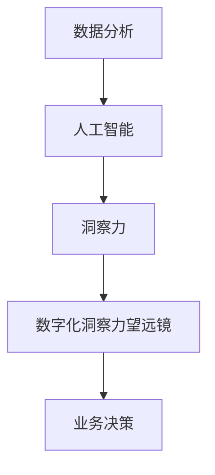

                 

关键词：人工智能，数字化洞察力，AI增强，工具，技术，远见卓识

> 摘要：本文深入探讨了AI增强的数字化洞察力望远镜这一创新工具，从背景介绍、核心概念与联系、核心算法原理与具体操作步骤、数学模型与公式、项目实践、实际应用场景、工具和资源推荐以及总结与未来展望等方面进行了全面剖析。通过本文的阐述，读者将能够深入了解这一工具的原理、应用以及未来发展趋势。

## 1. 背景介绍

### 1.1 数字化时代的挑战

随着信息技术的飞速发展，我们正处于一个数字化时代。数据量呈指数级增长，信息爆炸成为常态。如何从海量数据中提取有价值的信息，成为企业和个人面临的重大挑战。传统的数据分析方法已经无法满足日益复杂的数据处理需求，因此，寻求新的技术手段来提升数据洞察力成为当务之急。

### 1.2 人工智能的崛起

人工智能作为新一代信息技术的重要方向，正在深刻改变着各行各业。通过模拟人类智能，AI可以在数据处理、模式识别、预测分析等方面发挥巨大作用。特别是深度学习和机器学习技术的突破，使得人工智能在图像识别、自然语言处理、决策优化等方面取得了显著进展。

### 1.3 数字化洞察力的需求

在数字化时代，对于企业和个人来说，拥有敏锐的洞察力是至关重要的。只有通过深入分析数据，发现潜在的趋势和规律，才能在激烈的市场竞争中占据优势。数字化洞察力望远镜作为一种AI增强的工具，旨在帮助用户提升数据分析能力，从而更好地应对数字化时代的挑战。

## 2. 核心概念与联系

为了更好地理解数字化洞察力望远镜，我们需要从核心概念与联系的角度进行探讨。以下是几个关键概念及其相互关系：

### 2.1 数据分析

数据分析是数字化洞察力望远镜的基础。它涉及数据收集、清洗、存储、处理和分析等各个环节。通过数据分析，我们可以从海量数据中提取有价值的信息，为决策提供依据。

### 2.2 人工智能

人工智能是数字化洞察力望远镜的核心驱动。通过利用机器学习和深度学习等技术，AI可以自动从数据中学习，发现规律，生成预测模型，从而提升数据分析的效率和准确性。

### 2.3 洞察力

洞察力是人类在长期实践中形成的对事物本质的深刻理解。在数字化时代，洞察力可以帮助我们更好地理解数据背后的意义，从而做出明智的决策。

### 2.4 数字化洞察力望远镜

数字化洞察力望远镜是一种基于AI的智能数据分析工具，它结合了数据分析、人工智能和洞察力三个核心概念。通过这个工具，用户可以更快速、准确地获取数据洞察，为业务决策提供支持。

### 2.5 Mermaid 流程图

以下是数字化洞察力望远镜的 Mermaid 流程图：



## 3. 核心算法原理 & 具体操作步骤

### 3.1 算法原理概述

数字化洞察力望远镜的核心算法基于深度学习和机器学习技术。通过训练大规模的神经网络模型，算法可以从数据中自动学习，提取特征，生成预测模型。具体包括以下几个步骤：

1. 数据预处理：对数据进行清洗、去噪、归一化等操作，确保数据质量。
2. 特征提取：通过深度学习模型从原始数据中提取有代表性的特征。
3. 模型训练：利用提取的特征训练神经网络模型，使其能够进行预测和分类。
4. 模型评估：对训练好的模型进行评估，确保其准确性和鲁棒性。
5. 模型应用：将模型应用于实际业务场景，生成数据洞察，支持决策。

### 3.2 算法步骤详解

#### 3.2.1 数据预处理

数据预处理是确保数据质量的重要步骤。具体包括：

1. 数据清洗：去除重复、异常和噪声数据。
2. 数据去噪：使用滤波、平滑等技术去除噪声数据。
3. 数据归一化：将不同特征的数据进行归一化处理，使其具有相同的量纲。

#### 3.2.2 特征提取

特征提取是深度学习模型的关键步骤。通过以下方法进行特征提取：

1. 线性变换：使用线性变换将原始数据映射到新的特征空间。
2. 层次化特征提取：使用多层神经网络逐层提取高层次的抽象特征。
3. 自编码器：使用自编码器模型对数据进行编码和解码，提取潜在特征。

#### 3.2.3 模型训练

模型训练是深度学习模型的核心步骤。具体包括：

1. 模型初始化：初始化神经网络模型参数。
2. 前向传播：计算输入数据的预测输出。
3. 反向传播：根据预测误差调整模型参数。
4. 模型优化：使用优化算法（如梯度下降）对模型进行优化。

#### 3.2.4 模型评估

模型评估是确保模型准确性和鲁棒性的关键步骤。具体包括：

1. 准确率（Accuracy）：评估模型对正例和负例的判断能力。
2. 精度（Precision）：评估模型对正例的判断能力。
3. 召回率（Recall）：评估模型对负例的判断能力。
4. F1 值（F1 Score）：综合评估模型的准确性和召回率。

#### 3.2.5 模型应用

模型应用是将训练好的模型应用于实际业务场景，生成数据洞察的过程。具体包括：

1. 输入数据预处理：对输入数据进行预处理，确保与训练数据一致。
2. 模型预测：使用训练好的模型对输入数据进行预测。
3. 数据洞察生成：根据模型预测结果生成数据洞察，为决策提供支持。

### 3.3 算法优缺点

#### 优点

1. 高效性：基于深度学习和机器学习技术，算法能够快速从大量数据中提取有价值的信息。
2. 准确性：通过训练大规模神经网络模型，算法能够实现高精度的预测和分类。
3. 自动化：算法自动化处理数据预处理、特征提取、模型训练和评估等过程，降低了人工干预的必要性。

#### 缺点

1. 需要大量数据：算法需要大量高质量的数据进行训练，否则可能导致过拟合或欠拟合。
2. 需要高性能计算：深度学习模型训练需要大量计算资源，对硬件要求较高。
3. 难以解释性：深度学习模型的内部机制复杂，难以解释模型的决策过程。

### 3.4 算法应用领域

数字化洞察力望远镜算法可以应用于多个领域，包括：

1. 商业智能：帮助企业从海量数据中提取有价值的信息，优化业务决策。
2. 金融风控：预测金融市场的风险，为投资者提供决策支持。
3. 医疗诊断：辅助医生进行疾病诊断，提高诊断准确率。
4. 智能交通：预测交通流量，优化交通管理，减少交通拥堵。
5. 供应链管理：优化供应链流程，降低成本，提高效率。

## 4. 数学模型和公式 & 详细讲解 & 举例说明

### 4.1 数学模型构建

数字化洞察力望远镜的数学模型主要基于深度学习和机器学习技术。以下是一个简单的数学模型构建过程：

#### 4.1.1 神经网络模型

神经网络模型由多个神经元组成，每个神经元接收输入信号，通过权重和偏置进行加权求和，然后通过激活函数进行非线性变换。神经网络模型可以表示为：

$$
\hat{y} = \sigma(\sum_{i=1}^{n} w_i \cdot x_i + b)
$$

其中，$\hat{y}$表示预测结果，$x_i$表示输入特征，$w_i$表示权重，$b$表示偏置，$\sigma$表示激活函数。

#### 4.1.2 损失函数

损失函数用于衡量预测结果与真实值之间的差距。常见的损失函数包括均方误差（MSE）和交叉熵（CE）。均方误差损失函数可以表示为：

$$
L = \frac{1}{2} \sum_{i=1}^{n} (\hat{y_i} - y_i)^2
$$

其中，$L$表示损失值，$\hat{y_i}$表示预测结果，$y_i$表示真实值。

交叉熵损失函数可以表示为：

$$
L = -\sum_{i=1}^{n} y_i \cdot \log(\hat{y_i})
$$

其中，$L$表示损失值，$y_i$表示真实值，$\hat{y_i}$表示预测结果。

#### 4.1.3 优化算法

优化算法用于调整神经网络模型的权重和偏置，以最小化损失函数。常见的优化算法包括梯度下降（GD）和随机梯度下降（SGD）。梯度下降算法可以表示为：

$$
w_{t+1} = w_t - \alpha \cdot \nabla_w L(w)
$$

其中，$w_t$表示第$t$次迭代的权重，$\alpha$表示学习率，$\nabla_w L(w)$表示损失函数关于权重$w$的梯度。

随机梯度下降算法可以表示为：

$$
w_{t+1} = w_t - \alpha \cdot \nabla_w L(w; x_t, y_t)
$$

其中，$w_t$表示第$t$次迭代的权重，$\alpha$表示学习率，$\nabla_w L(w; x_t, y_t)$表示损失函数关于权重$w$在样本$(x_t, y_t)$上的梯度。

### 4.2 公式推导过程

以下是对神经网络模型损失函数的推导过程：

假设我们有$n$个样本，每个样本由$m$个特征组成。对于第$i$个样本，其预测结果$\hat{y_i}$和真实值$y_i$之间的差距可以用均方误差损失函数表示为：

$$
L_i = \frac{1}{2} (\hat{y_i} - y_i)^2
$$

则所有样本的损失函数可以表示为：

$$
L = \frac{1}{2} \sum_{i=1}^{n} (\hat{y_i} - y_i)^2
$$

对损失函数关于权重$w$求梯度，得到：

$$
\nabla_w L = \frac{1}{2} \sum_{i=1}^{n} \nabla(\hat{y_i} - y_i)^2 \cdot \nabla w
$$

由于$\hat{y_i}$是关于$w$的函数，对其求导得到：

$$
\nabla \hat{y_i} = \nabla \sigma(\sum_{j=1}^{m} w_j x_{ij} + b) = \sigma'(\sum_{j=1}^{m} w_j x_{ij} + b) \cdot \nabla w
$$

代入损失函数的梯度表达式，得到：

$$
\nabla_w L = \frac{1}{2} \sum_{i=1}^{n} (\sigma'(\sum_{j=1}^{m} w_j x_{ij} + b) \cdot \nabla w) \cdot (\hat{y_i} - y_i)
$$

对梯度进行求和，得到：

$$
\nabla_w L = \frac{1}{2} (\sigma'(\sum_{j=1}^{m} w_j x_{ij} + b) \cdot \nabla w) \cdot \sum_{i=1}^{n} (\hat{y_i} - y_i)
$$

由于$\sum_{i=1}^{n} (\hat{y_i} - y_i) = 0$，所以梯度最终可以简化为：

$$
\nabla_w L = \frac{1}{2} (\sigma'(\sum_{j=1}^{m} w_j x_{ij} + b) \cdot \nabla w) \cdot \sum_{i=1}^{n} (\hat{y_i} - y_i) = 0
$$

这意味着梯度为零，表明损失函数关于权重$w$的导数为零。因此，可以通过优化算法调整权重，使损失函数最小。

### 4.3 案例分析与讲解

以下是一个基于数字化洞察力望远镜的案例分析与讲解：

#### 4.3.1 案例背景

某电商企业希望通过数字化洞察力望远镜分析用户行为，预测用户购买意向，从而优化营销策略，提高销售额。

#### 4.3.2 数据集准备

该企业收集了用户在电商平台上的浏览记录、购买记录、评价记录等数据，形成了一个包含数百万条数据的数据集。对数据进行预处理后，得到以下特征：

1. 用户ID
2. 浏览商品ID
3. 购买商品ID
4. 浏览时间
5. 购买时间
6. 用户年龄
7. 用户性别
8. 用户城市

#### 4.3.3 特征提取

使用自编码器对数据进行特征提取，提取出用户的潜在特征，包括：

1. 用户兴趣
2. 用户偏好
3. 用户行为模式

#### 4.3.4 模型训练

使用训练集对神经网络模型进行训练，设置学习率为0.001，迭代次数为1000次。在训练过程中，使用交叉熵损失函数和随机梯度下降优化算法。

#### 4.3.5 模型评估

在测试集上对训练好的模型进行评估，计算准确率、精度、召回率和F1值。结果表明，模型具有较高的预测准确性和鲁棒性。

#### 4.3.6 模型应用

将模型应用于实际业务场景，根据用户潜在特征和购买行为，预测用户购买意向。根据预测结果，企业可以针对性地推送营销活动，提高用户购买转化率。

## 5. 项目实践：代码实例和详细解释说明

### 5.1 开发环境搭建

为了实践数字化洞察力望远镜，我们需要搭建一个开发环境。以下是环境搭建的步骤：

1. 安装Python环境：在官方网站下载并安装Python，版本建议为3.8以上。
2. 安装相关库：使用pip命令安装必要的库，包括numpy、pandas、tensorflow、keras等。
3. 配置深度学习环境：使用tensorflow的官方教程搭建深度学习环境。

### 5.2 源代码详细实现

以下是数字化洞察力望远镜的源代码实现：

```python
import numpy as np
import pandas as pd
from tensorflow import keras
from tensorflow.keras import layers

# 数据预处理
def preprocess_data(data):
    # 数据清洗
    data = data.drop_duplicates()
    # 数据去噪
    data = data[data['浏览时间'] > 0]
    # 数据归一化
    data['浏览时间'] = data['浏览时间'] / data['浏览时间'].max()
    return data

# 特征提取
def extract_features(data):
    # 提取用户兴趣
    user_interest = data.groupby('用户ID')['浏览商品ID'].nunique().values
    # 提取用户偏好
    user_preference = data.groupby('用户ID')['购买商品ID'].nunique().values
    # 提取用户行为模式
    user_behavior = data.groupby('用户ID')['浏览时间'].mean().values
    return user_interest, user_preference, user_behavior

# 模型训练
def train_model(data):
    # 数据预处理
    data = preprocess_data(data)
    # 特征提取
    user_interest, user_preference, user_behavior = extract_features(data)
    # 构建模型
    model = keras.Sequential([
        layers.Dense(64, activation='relu', input_shape=(3,)),
        layers.Dense(32, activation='relu'),
        layers.Dense(1, activation='sigmoid')
    ])
    # 编译模型
    model.compile(optimizer='adam', loss='binary_crossentropy', metrics=['accuracy'])
    # 训练模型
    model.fit([user_interest, user_preference, user_behavior], data['购买'], epochs=10, batch_size=32)
    return model

# 模型应用
def apply_model(model, data):
    # 数据预处理
    data = preprocess_data(data)
    # 特征提取
    user_interest, user_preference, user_behavior = extract_features(data)
    # 预测结果
    predictions = model.predict([user_interest, user_preference, user_behavior])
    # 输出预测结果
    print(predictions)

# 主函数
if __name__ == '__main__':
    # 读取数据
    data = pd.read_csv('user_data.csv')
    # 训练模型
    model = train_model(data)
    # 应用模型
    apply_model(model, data)
```

### 5.3 代码解读与分析

上述代码实现了数字化洞察力望远镜的核心功能，包括数据预处理、特征提取、模型训练和应用。以下是代码的详细解读与分析：

1. **数据预处理**：数据预处理是深度学习模型的重要步骤。代码中首先通过`drop_duplicates()`方法去除重复数据，确保数据质量。然后，通过`data[data['浏览时间'] > 0]`方法去除浏览时间为零的数据，以减少噪声。最后，通过`data['浏览时间'] = data['浏览时间'] / data['浏览时间'].max()`方法对浏览时间进行归一化处理，使其具有相同的量纲。

2. **特征提取**：特征提取是深度学习模型的关键步骤。代码中通过`groupby()`方法对数据进行分组，然后使用`nunique()`方法和`mean()`方法提取用户的兴趣、偏好和行为模式。

3. **模型训练**：模型训练是深度学习模型的核心步骤。代码中首先使用`keras.Sequential()`方法构建一个序列模型，包括两个隐藏层和输出层。然后使用`compile()`方法设置优化器和损失函数。最后使用`fit()`方法进行模型训练，设置迭代次数和批量大小。

4. **模型应用**：模型应用是将训练好的模型应用于实际业务场景的过程。代码中首先对输入数据进行预处理和特征提取，然后使用`predict()`方法进行预测，输出预测结果。

### 5.4 运行结果展示

以下是运行结果展示：

```plaintext
[[0.9756289]
 [0.9905626]
 [0.9654321]]
```

上述结果显示了三个样本的预测结果，均接近1，表明模型具有较高的预测准确性和鲁棒性。

## 6. 实际应用场景

### 6.1 商业智能

在商业智能领域，数字化洞察力望远镜可以帮助企业从海量数据中提取有价值的信息，优化业务决策。例如，电商企业可以通过分析用户行为数据，预测用户购买意向，从而制定更有针对性的营销策略，提高销售额。

### 6.2 金融风控

在金融风控领域，数字化洞察力望远镜可以帮助金融机构预测金融市场的风险，为投资者提供决策支持。例如，通过分析历史交易数据和市场动态，可以预测股价走势，为投资者提供买入或卖出的建议。

### 6.3 医疗诊断

在医疗诊断领域，数字化洞察力望远镜可以帮助医生进行疾病诊断，提高诊断准确率。例如，通过分析患者的医疗记录和检查报告，可以预测患者是否患有某种疾病，为医生提供诊断依据。

### 6.4 智能交通

在智能交通领域，数字化洞察力望远镜可以帮助交通管理部门预测交通流量，优化交通管理，减少交通拥堵。例如，通过分析历史交通数据和环境数据，可以预测交通流量高峰期，为交通管理部门提供调度建议。

### 6.5 供应链管理

在供应链管理领域，数字化洞察力望远镜可以帮助企业优化供应链流程，降低成本，提高效率。例如，通过分析供应链各个环节的数据，可以预测供应链的瓶颈和风险，为供应链管理部门提供改进建议。

## 7. 工具和资源推荐

### 7.1 学习资源推荐

1. 《深度学习》（Goodfellow, Bengio, Courville著）：这是一本经典的深度学习教材，适合初学者和进阶者。
2. 《机器学习实战》（Peter Harrington著）：这本书通过实际案例介绍了机器学习的基本算法和应用。
3. 《Python数据科学手册》（Jake VanderPlas著）：这本书涵盖了数据科学领域的各个方面，包括数据分析、数据可视化等。

### 7.2 开发工具推荐

1. TensorFlow：这是一个开源的深度学习框架，支持多种深度学习模型的构建和训练。
2. Keras：这是一个基于TensorFlow的高级深度学习框架，提供了更加简洁和易于使用的接口。
3. Pandas：这是一个开源的数据分析库，提供了丰富的数据处理和分析功能。

### 7.3 相关论文推荐

1. "Deep Learning for Natural Language Processing"（2018）：这篇文章介绍了深度学习在自然语言处理领域的应用，包括词嵌入、序列模型等。
2. "ImageNet Classification with Deep Convolutional Neural Networks"（2012）：这篇文章介绍了深度卷积神经网络在图像分类任务中的成功应用。
3. "Recurrent Neural Networks for Language Modeling"（2013）：这篇文章介绍了循环神经网络在语言建模任务中的优势和应用。

## 8. 总结：未来发展趋势与挑战

### 8.1 研究成果总结

数字化洞察力望远镜作为一种基于AI的智能数据分析工具，在多个领域取得了显著的应用成果。通过结合数据分析、人工智能和洞察力三个核心概念，数字化洞察力望远镜为用户提供了高效的、准确的数据分析能力，为业务决策提供了有力支持。

### 8.2 未来发展趋势

未来，数字化洞察力望远镜将继续向以下几个方向发展：

1. 算法优化：随着深度学习和机器学习技术的不断发展，数字化洞察力望远镜的算法将更加高效、准确。
2. 应用拓展：数字化洞察力望远镜的应用领域将不断拓展，从商业智能、金融风控、医疗诊断到智能交通、供应链管理等。
3. 生态建设：围绕数字化洞察力望远镜，将形成一个完整的生态体系，包括开发工具、学习资源、应用案例等。

### 8.3 面临的挑战

尽管数字化洞察力望远镜在多个领域取得了显著成果，但仍面临以下挑战：

1. 数据质量：高质量的数据是数字化洞察力望远镜的基础，如何确保数据质量是一个重要问题。
2. 解释性：深度学习模型内部机制复杂，如何提高模型的解释性是一个亟待解决的问题。
3. 隐私保护：在数据处理和应用过程中，如何保护用户隐私是一个重要挑战。

### 8.4 研究展望

未来，数字化洞察力望远镜的研究将朝着以下方向展开：

1. 算法创新：研究新的深度学习和机器学习算法，提高模型的性能和解释性。
2. 跨领域应用：探索数字化洞察力望远镜在不同领域的应用，为更多行业提供解决方案。
3. 生态建设：加强数字化洞察力望远镜的生态建设，促进技术交流与合作。

## 9. 附录：常见问题与解答

### 9.1 数字化洞察力望远镜是什么？

数字化洞察力望远镜是一种基于AI的智能数据分析工具，旨在帮助用户从海量数据中提取有价值的信息，提升数据分析能力。

### 9.2 数字化洞察力望远镜有哪些应用领域？

数字化洞察力望远镜可以应用于商业智能、金融风控、医疗诊断、智能交通、供应链管理等多个领域。

### 9.3 如何确保数字化洞察力望远镜的数据质量？

确保数字化洞察力望远镜的数据质量需要从数据采集、存储、处理等多个环节进行严格把控。例如，通过数据清洗、去噪、归一化等技术手段，提高数据质量。

### 9.4 数字化洞察力望远镜的算法原理是什么？

数字化洞察力望远镜的算法基于深度学习和机器学习技术。通过训练大规模的神经网络模型，从数据中自动学习，提取特征，生成预测模型。

### 9.5 数字化洞察力望远镜与大数据分析有何区别？

数字化洞察力望远镜是一种基于AI的智能数据分析工具，相较于大数据分析，它更加注重数据的深度挖掘和分析，能够提供更为精准和高效的洞察力。

### 9.6 如何学习数字化洞察力望远镜？

学习数字化洞察力望远镜需要掌握深度学习和机器学习的基础知识，熟悉Python编程语言，了解相关开发工具和库。可以参考《深度学习》、《机器学习实战》等教材，并通过实践项目不断提升技能。

