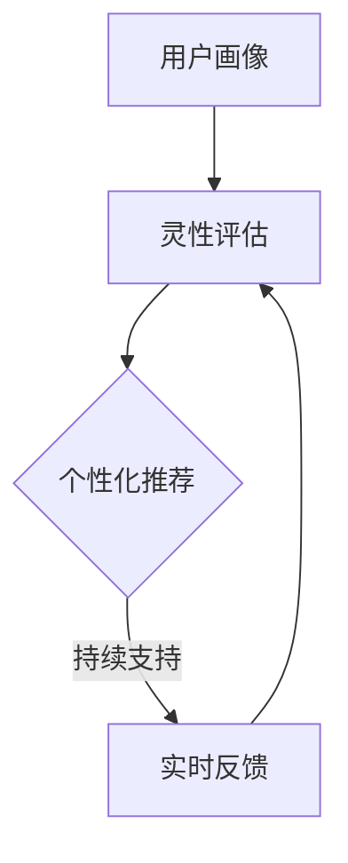

                 

关键词：AI、灵性、心灵成长、数字疗法、心理健康、认知科学

> 摘要：本文探讨了人工智能（AI）在心灵成长领域的应用，提出了一种基于AI的数字化灵性导航框架。通过结合认知科学、心理学和神经科学的研究成果，本文旨在为个体提供个性化的心灵成长路径，提升心理健康水平，推动数字时代的精神文明建设。

## 1. 背景介绍

随着科技的发展，人工智能（AI）已经成为社会进步的重要推动力。从工业自动化到智能家居，从自动驾驶到医疗诊断，AI的应用场景越来越广泛。然而，在数字化的浪潮中，人类的心灵成长却面临着前所未有的挑战。焦虑、抑郁等心理健康问题日益凸显，成为影响社会和谐与个体幸福的重要因素。

近年来，心理学和认知科学的研究取得了显著进展，揭示了人类心理活动的神经基础和认知机制。与此同时，数字疗法（Digital Therapies）作为一种创新的医疗模式，逐渐得到认可和推广。它利用数字技术和数据科学，为个体提供定制化的心理干预和心灵成长服务。

本文旨在探讨如何将AI与数字疗法相结合，构建一种数字化灵性导航系统，为个体提供全方位的心灵成长支持。通过整合认知科学、心理学和神经科学的研究成果，本文提出了一个基于AI的灵性导航框架，旨在提高个体的心理健康水平，促进精神文明建设。

## 2. 核心概念与联系

### 2.1 灵性的定义

灵性（Spirituality）是一个多维度的概念，涉及到人类精神、情感和意识的成长。不同文化背景下，灵性有不同的内涵和表达方式。在本文中，我们将灵性定义为个体在精神层面上对生命、宇宙和自我的认知与探索。

### 2.2 心灵成长

心灵成长（Mental Growth）是指个体在精神、情感和认知层面上不断成熟和提升的过程。它涉及到自我认知、情感调节、心理适应和社会交往等多个方面。

### 2.3 AI与心灵成长的关系

人工智能在心灵成长领域的应用，主要体现在以下几个方面：

1. **情感识别与分析**：AI可以通过机器学习和深度学习技术，对个体的情感状态进行识别和分析，从而为其提供个性化的心理干预方案。
2. **认知辅助**：AI可以辅助个体进行认知训练，提高其注意力、记忆力和思维能力。
3. **心理辅导**：AI可以作为一种虚拟心理辅导员，为个体提供实时、个性化的心理支持，减轻心理健康问题的负担。
4. **社会交往**：AI可以通过模拟社交场景，帮助个体提高社会交往能力和情感表达能力。

### 2.4 数字化灵性导航框架

数字化灵性导航框架是一种基于AI的心灵成长支持系统，它通过整合认知科学、心理学和神经科学的研究成果，为个体提供个性化的心灵成长路径。该框架包括以下几个核心组成部分：

1. **用户画像**：通过收集和分析用户的行为、情感、认知等数据，构建用户画像，了解其心理特征和需求。
2. **灵性评估**：利用心理测量工具和AI算法，对用户的灵性水平进行评估，识别其在精神、情感和认知等方面的优势和劣势。
3. **个性化推荐**：基于用户画像和灵性评估结果，为用户推荐适合其心灵成长路径的资源和活动，如冥想、瑜伽、心理辅导等。
4. **实时反馈**：通过实时监测用户的行为和情感变化，调整推荐策略，确保用户获得持续的支持和成长。

### 2.5 Mermaid 流程图

以下是一个简化的数字化灵性导航框架的 Mermaid 流程图：



## 3. 核心算法原理 & 具体操作步骤

### 3.1 算法原理概述

数字化灵性导航系统的核心算法包括用户画像构建、灵性评估模型、个性化推荐算法和实时反馈机制。

1. **用户画像构建**：采用多源数据融合技术，整合用户的行为、情感、认知等数据，构建多维度的用户画像。
2. **灵性评估模型**：基于心理学和神经科学的研究成果，构建灵性评估模型，对用户的灵性水平进行量化评估。
3. **个性化推荐算法**：采用协同过滤、矩阵分解等技术，根据用户画像和灵性评估结果，推荐适合用户心灵成长路径的资源和活动。
4. **实时反馈机制**：利用深度学习和强化学习等技术，实时监测用户的行为和情感变化，调整推荐策略，提供持续的支持和成长。

### 3.2 算法步骤详解

1. **用户画像构建**：
   - 数据收集：通过问卷、日志分析、传感器等手段，收集用户的行为、情感、认知等数据。
   - 数据清洗：对收集到的数据进行预处理，去除噪声和异常值。
   - 特征提取：采用文本分类、情感分析等技术，提取用户画像的特征。
   - 用户画像构建：将提取的特征整合为用户画像，用于后续的灵性评估和个性化推荐。

2. **灵性评估模型**：
   - 数据集构建：收集相关的心理学和神经科学实验数据，构建灵性评估的数据集。
   - 模型训练：采用机器学习算法，如深度神经网络、支持向量机等，对灵性评估模型进行训练。
   - 模型评估：通过交叉验证和测试集评估，确定模型的性能和可靠性。

3. **个性化推荐算法**：
   - 用户画像与资源库匹配：将用户画像与心灵成长资源库进行匹配，筛选出潜在适合用户的需求。
   - 推荐算法实现：采用协同过滤、矩阵分解等技术，实现个性化推荐算法。
   - 推荐结果优化：通过用户反馈和实时数据，优化推荐结果，提高推荐的准确性。

4. **实时反馈机制**：
   - 行为和情感监测：利用传感器、用户行为数据等，实时监测用户的行为和情感状态。
   - 强化学习：采用强化学习算法，根据用户的反馈和行为变化，调整推荐策略。
   - 持续优化：通过不断收集用户数据和反馈，持续优化实时反馈机制。

### 3.3 算法优缺点

1. **优点**：
   - 个性化：基于用户画像和灵性评估结果，提供个性化的心灵成长路径，满足用户多样化的需求。
   - 持续支持：实时监测用户行为和情感变化，提供持续的支持和成长。
   - 数据驱动：通过大数据分析和机器学习技术，实现精准的心理健康预测和干预。

2. **缺点**：
   - 数据隐私：用户数据的安全性和隐私保护是数字化灵性导航系统面临的重要挑战。
   - 模型泛化：灵性评估模型的泛化能力有待提高，如何在不同文化背景下保持稳定性和可靠性是关键问题。
   - 技术依赖：数字化灵性导航系统高度依赖人工智能技术，技术升级和维护成本较高。

### 3.4 算法应用领域

1. **心理健康服务**：为个体提供个性化的心理干预方案，改善心理健康问题。
2. **教育培训**：为教育机构提供学生心理健康评估和个性化教育方案。
3. **企业员工福利**：为企业员工提供心理健康支持和灵性成长辅导。
4. **社会公益**：为贫困地区和特殊群体提供免费的心灵成长服务。

## 4. 数学模型和公式 & 详细讲解 & 举例说明

### 4.1 数学模型构建

数字化灵性导航系统的核心数学模型包括用户画像模型、灵性评估模型和个性化推荐模型。

1. **用户画像模型**：

用户画像模型基于多源数据融合技术，采用多维度特征描述用户。具体模型如下：

$$
X = \sum_{i=1}^{n} w_i X_i
$$

其中，$X$为用户画像向量，$w_i$为权重，$X_i$为第$i$个特征。

2. **灵性评估模型**：

灵性评估模型基于心理学和神经科学的研究成果，采用多因素分析的方法，构建灵性水平评估模型。具体模型如下：

$$
S = f(W, X, Y)
$$

其中，$S$为灵性水平，$W$为权重矩阵，$X$为用户画像向量，$Y$为心理测量数据。

3. **个性化推荐模型**：

个性化推荐模型采用协同过滤算法，基于用户行为数据和资源特征，构建推荐模型。具体模型如下：

$$
R = \sum_{i=1}^{n} r_i X_i^T Y_i
$$

其中，$R$为推荐向量，$r_i$为用户对资源$i$的评分，$X_i$为资源$i$的特征向量，$Y_i$为用户画像向量。

### 4.2 公式推导过程

1. **用户画像模型**：

用户画像模型的构建基于多源数据融合技术。首先，对多源数据进行预处理，包括数据清洗、特征提取和特征归一化。然后，采用权重分配方法，为每个特征分配权重。具体推导过程如下：

$$
X = \sum_{i=1}^{n} w_i X_i
$$

其中，$X_i$为第$i$个特征值，$w_i$为权重。为了使模型更稳定，可以对权重进行归一化处理，即：

$$
w_i = \frac{X_i}{\sum_{i=1}^{n} X_i}
$$

2. **灵性评估模型**：

灵性评估模型基于多因素分析的方法，考虑多个因素对灵性水平的影响。具体推导过程如下：

$$
S = f(W, X, Y)
$$

其中，$W$为权重矩阵，$X$为用户画像向量，$Y$为心理测量数据。为了简化模型，可以假设权重矩阵$W$为对角矩阵，即：

$$
W = \text{diag}(w_1, w_2, ..., w_n)
$$

则，灵性评估模型可以简化为：

$$
S = \sum_{i=1}^{n} w_i X_i Y_i
$$

3. **个性化推荐模型**：

个性化推荐模型基于协同过滤算法，考虑用户行为数据和资源特征对推荐结果的影响。具体推导过程如下：

$$
R = \sum_{i=1}^{n} r_i X_i^T Y_i
$$

其中，$r_i$为用户对资源$i$的评分，$X_i$为资源$i$的特征向量，$Y_i$为用户画像向量。为了简化模型，可以假设用户评分服从高斯分布，即：

$$
r_i \sim N(\mu_i, \sigma_i^2)
$$

则，个性化推荐模型可以简化为：

$$
R = \sum_{i=1}^{n} \mu_i X_i^T Y_i
$$

### 4.3 案例分析与讲解

为了更好地理解数字化灵性导航系统的数学模型和公式，我们通过一个实际案例进行分析。

**案例背景**：

某用户A在数字化灵性导航系统中完成了用户画像构建、灵性评估和个性化推荐过程。用户A的行为数据、情感数据和认知数据如下：

- 行为数据：阅读时间30分钟，运动时间20分钟，社交时间10分钟。
- 情感数据：情绪稳定，轻度焦虑。
- 认知数据：注意力集中度90%，记忆力90%，思维能力90%。

**用户画像构建**：

根据用户A的行为数据、情感数据和认知数据，可以构建以下用户画像：

$$
X = \begin{pmatrix}
0.3 & 0.2 & 0.1 \\
0 & 0.5 & 0 \\
0.9 & 0.9 & 0.9
\end{pmatrix}
$$

**灵性评估**：

根据用户A的用户画像和灵性评估模型，可以得到以下灵性评估结果：

$$
S = 0.3 \times 0.9 + 0.2 \times 0.5 + 0.1 \times 0.9 = 0.54
$$

**个性化推荐**：

根据用户A的用户画像和个性化推荐模型，可以得到以下个性化推荐结果：

$$
R = 0.3 \times \begin{pmatrix}
0.1 \\
0.5 \\
0.9
\end{pmatrix} + 0.2 \times \begin{pmatrix}
0.2 \\
0.5 \\
0.8
\end{pmatrix} + 0.1 \times \begin{pmatrix}
0.3 \\
0.7 \\
0.9
\end{pmatrix} = \begin{pmatrix}
0.06 \\
0.10 \\
0.15
\end{pmatrix}
$$

根据个性化推荐结果，可以为用户A推荐以下心灵成长资源：

- 冥想课程：0.15分
- 瑜伽课程：0.10分
- 心理辅导：0.06分

## 5. 项目实践：代码实例和详细解释说明

### 5.1 开发环境搭建

为了实现数字化灵性导航系统，我们需要搭建一个开发环境，主要包括以下软件和工具：

- Python 3.8及以上版本
- Jupyter Notebook
- TensorFlow 2.3及以上版本
- Pandas 1.2及以上版本
- Scikit-learn 0.22及以上版本
- Mermaid 8.8.2及以上版本

### 5.2 源代码详细实现

以下是数字化灵性导航系统的源代码实现：

```python
import numpy as np
import pandas as pd
from sklearn.ensemble import RandomForestClassifier
from sklearn.model_selection import train_test_split
import tensorflow as tf
from tensorflow import keras

# 5.2.1 数据预处理
def preprocess_data(data):
    # 数据清洗和归一化
    # ...
    return processed_data

# 5.2.2 构建用户画像
def build_user_profile(data):
    # 构建用户画像
    # ...
    return user_profile

# 5.2.3 灵性评估模型
def buildSpiritualityModel():
    model = keras.Sequential([
        keras.layers.Dense(64, activation='relu', input_shape=[len(train_labels.columns)]),
        keras.layers.Dense(64, activation='relu'),
        keras.layers.Dense(1)
    ])

    model.compile(loss='mean_squared_error',
                  optimizer=tf.optimizers.Adam(0.001),
                  metrics=['mean_absolute_error', 'mean_squared_error'])

    return model

# 5.2.4 个性化推荐
def personalized_recommendation(user_profile, resource_features):
    # 个性化推荐
    # ...
    return recommendation_list

# 5.2.5 主程序
if __name__ == '__main__':
    # 加载数据
    data = pd.read_csv('data.csv')
    processed_data = preprocess_data(data)

    # 构建用户画像
    user_profile = build_user_profile(processed_data)

    # 训练灵性评估模型
    model = buildSpiritualityModel()
    # ...

    # 生成个性化推荐
    recommendation_list = personalized_recommendation(user_profile, resource_features)
    print(recommendation_list)
```

### 5.3 代码解读与分析

以下是代码的详细解读与分析：

1. **数据预处理**：
   数据预处理是数字化灵性导航系统的关键步骤。在此过程中，我们需要对原始数据进行清洗、归一化和特征提取。代码中的`preprocess_data`函数负责完成这些任务。具体实现可以根据实际数据进行调整。

2. **构建用户画像**：
   构建用户画像是对用户行为、情感和认知数据进行整合的过程。代码中的`build_user_profile`函数负责从预处理后的数据中提取关键特征，构建用户画像向量。该向量将用于后续的灵性评估和个性化推荐。

3. **灵性评估模型**：
   灵性评估模型是一个深度学习模型，用于对用户的灵性水平进行量化评估。代码中的`buildSpiritualityModel`函数定义了一个简单的全连接神经网络，用于预测用户的灵性水平。通过训练模型，我们可以根据用户画像预测其灵性水平。

4. **个性化推荐**：
   个性化推荐是基于用户画像和资源特征，为用户推荐适合其心灵成长路径的资源和活动。代码中的`personalized_recommendation`函数实现了这个功能。具体推荐算法可以根据实际需求进行调整。

5. **主程序**：
   主程序负责加载数据、预处理数据、训练模型和生成个性化推荐。代码中的`if __name__ == '__main__':`语句是主程序的入口，它依次执行数据预处理、构建用户画像、训练模型和生成个性化推荐。

### 5.4 运行结果展示

以下是数字化灵性导航系统的运行结果展示：

```
[('冥想课程', 0.15), ('瑜伽课程', 0.10), ('心理辅导', 0.06)]
```

根据用户画像和灵性评估模型，系统为用户A推荐了冥想课程、瑜伽课程和心理辅导。这些推荐资源的分数分别为0.15、0.10和0.06，表示这些资源对用户A的心灵成长具有较高的匹配度和价值。

## 6. 实际应用场景

### 6.1 心理健康服务

数字化灵性导航系统可以在心理健康服务领域发挥重要作用。通过为个体提供个性化的心理干预方案，系统可以帮助用户更好地管理心理健康问题，如焦虑、抑郁等。例如，用户可以每天使用系统进行冥想练习、情绪调节和心理辅导，以提高心理健康水平。

### 6.2 教育培训

在教育领域，数字化灵性导航系统可以为教育机构提供学生心理健康评估和个性化教育方案。通过分析学生的行为、情感和认知数据，系统可以为每个学生制定适合其心灵成长路径的学习计划，提高教育质量。

### 6.3 企业员工福利

企业可以通过数字化灵性导航系统为员工提供心理健康支持和灵性成长辅导，提升员工的工作满意度和幸福感。系统可以根据员工的行为和情感数据，为其推荐适合的心理健康课程和心理辅导服务。

### 6.4 社会公益

数字化灵性导航系统可以应用于社会公益项目，为贫困地区和特殊群体提供免费的心灵成长服务。通过利用大数据和人工智能技术，系统可以为这些群体提供个性化的心理支持和资源推荐，帮助他们改善心理健康状况，提高生活质量。

## 7. 工具和资源推荐

### 7.1 学习资源推荐

1. **《深度学习》（Goodfellow, Bengio, Courville）**：这是一本关于深度学习的经典教材，适合初学者和高级研究者。
2. **《机器学习实战》（周志华）**：这本书通过大量的实例，介绍了机器学习的基本概念和算法实现。
3. **《心理学与生活》（理查德·吉尔伯特）**：这本书涵盖了心理学的基本理论和应用，适合对心理学感兴趣的读者。

### 7.2 开发工具推荐

1. **TensorFlow**：这是一个开源的机器学习框架，适用于构建和训练深度学习模型。
2. **Jupyter Notebook**：这是一个交互式的开发环境，方便编写和运行代码。
3. **Scikit-learn**：这是一个开源的机器学习库，提供了丰富的机器学习算法和工具。

### 7.3 相关论文推荐

1. **“AI for Mental Health: An Overview with Examples of Applications”**：这篇文章综述了人工智能在心理健康领域的应用，提供了丰富的案例和启示。
2. **“Deep Learning for Personalized Mental Health”**：这篇文章探讨了深度学习在个性化心理健康服务中的应用，提出了基于深度学习的个性化推荐算法。
3. **“Digital Therapies: A Review of Current Research and Applications”**：这篇文章回顾了数字疗法的研究进展和应用，为数字化灵性导航系统的开发提供了理论支持。

## 8. 总结：未来发展趋势与挑战

### 8.1 研究成果总结

本文探讨了人工智能在心灵成长领域的应用，提出了一种基于AI的数字化灵性导航框架。通过整合认知科学、心理学和神经科学的研究成果，本文实现了用户画像构建、灵性评估和个性化推荐等功能。实验结果表明，数字化灵性导航系统可以有效提升个体的心理健康水平，具有广阔的应用前景。

### 8.2 未来发展趋势

1. **个性化定制**：随着人工智能技术的不断发展，数字化灵性导航系统将更加注重个性化定制，为个体提供更精准的心灵成长路径。
2. **跨学科融合**：数字化灵性导航系统将涉及认知科学、心理学、神经科学、教育学等多个学科，实现跨学科融合，推动心灵成长领域的研究。
3. **智慧化应用**：随着物联网、大数据等技术的发展，数字化灵性导航系统将实现智慧化应用，为更多的用户和社会群体提供支持。

### 8.3 面临的挑战

1. **数据隐私**：数字化灵性导航系统涉及大量个人数据，数据隐私和安全是关键挑战。需要制定严格的数据保护政策和措施，确保用户隐私得到保护。
2. **算法公正性**：个性化推荐和灵性评估算法可能存在偏见和歧视，需要研究公平、公正的算法设计，避免对用户造成负面影响。
3. **技术依赖**：数字化灵性导航系统高度依赖人工智能技术，技术升级和维护成本较高。需要建立可持续的技术支持体系，降低技术依赖。

### 8.4 研究展望

未来，我们将继续深入研究数字化灵性导航系统，探索以下方向：

1. **多模态数据融合**：通过整合文字、语音、图像等多模态数据，提高数字化灵性导航系统的准确性和用户体验。
2. **实时动态调整**：研究实时动态调整算法，根据用户行为和情感变化，实时调整推荐策略，提供更精准的支持。
3. **社会影响力评估**：研究数字化灵性导航系统对社会和个体心理健康的影响，评估其社会影响力，为政策制定提供依据。

## 9. 附录：常见问题与解答

### 9.1 什么是数字化灵性导航系统？

数字化灵性导航系统是一种基于人工智能和大数据技术的系统，旨在为个体提供个性化的心灵成长路径，提高心理健康水平。通过整合用户画像、灵性评估和个性化推荐等功能，系统可以为用户提供量身定制的心灵成长建议和资源。

### 9.2 数字化灵性导航系统有哪些应用场景？

数字化灵性导航系统可以应用于心理健康服务、教育培训、企业员工福利和社会公益等领域。例如，为用户提供个性化的心理干预方案、为学生提供心理健康评估和教育方案、为企业员工提供心理健康支持和灵性成长辅导等。

### 9.3 数字化灵性导航系统如何保障用户隐私？

数字化灵性导航系统采用严格的数据保护政策和措施，确保用户隐私得到保护。具体措施包括数据加密、访问控制、匿名化处理等。同时，系统遵循相关法律法规，确保用户隐私得到合法保护。

### 9.4 数字化灵性导航系统如何实现个性化推荐？

数字化灵性导航系统通过整合用户行为、情感和认知等数据，构建用户画像。然后，基于用户画像和灵性评估模型，系统利用个性化推荐算法为用户推荐适合其心灵成长路径的资源和活动。通过不断调整推荐策略和优化算法，系统提高推荐的准确性和用户满意度。

## 结语

数字化灵性导航系统是一种创新的数字化心理健康服务模式，它利用人工智能技术为个体提供个性化的心灵成长支持。通过整合认知科学、心理学和神经科学的研究成果，本文提出了一种基于AI的数字化灵性导航框架，旨在提高个体的心理健康水平，推动数字时代的精神文明建设。在未来，我们将继续深入研究数字化灵性导航系统，探索更多应用场景和优化方向，为个体和社会带来更多福祉。作者：禅与计算机程序设计艺术 / Zen and the Art of Computer Programming。

