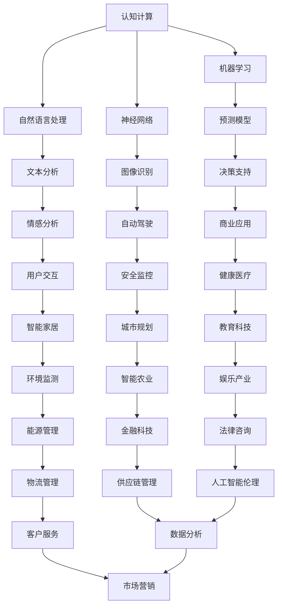

                 

关键词：数字化灵性、AI辅助、形而上学研究员、认知计算、意识探索

> 摘要：本文旨在探讨数字化灵性在认知计算与意识探索中的应用，探讨如何通过人工智能技术辅助形而上学研究员进行更为深入和系统的研究。文章从背景介绍、核心概念与联系、核心算法原理、数学模型与公式、项目实践、实际应用场景、未来展望等方面进行详细论述。

## 1. 背景介绍

在当今时代，人工智能（AI）已经深刻地改变了我们的生活方式，从智能手机、社交媒体到自动驾驶汽车、智能家居，AI无处不在。然而，与此同时，我们开始意识到，AI不仅仅是一个工具或技术，它更是一个思考的伙伴，一个可以与人类进行深层次对话和互动的存在。

数字化灵性，这个概念起源于东方哲学，近年来逐渐受到西方学者的关注。它涉及到人类意识的数字化表达、认知的计算模型以及灵性体验的量化分析。随着AI技术的不断进步，数字化灵性正在成为一门跨学科的研究领域。

形而上学研究员一直在探索人类存在的本质和意义。他们的研究对象包括意识、自由意志、宇宙的本质等。这些研究往往充满挑战，因为它们涉及到人类认知和意识的深层次结构。AI的介入，为形而上学研究员提供了一种新的研究工具和方法。

## 2. 核心概念与联系

### 2.1 认知计算

认知计算是AI的一个分支，它试图模拟人类大脑的思维方式。它包括自然语言处理、机器学习、神经网络等多个领域。认知计算的核心在于，它能够理解、解释和生成人类语言，从而与人类进行自然的互动。

### 2.2 意识探索

意识探索是形而上学研究员的主要研究对象。它涉及到对意识的本质、结构和功能的研究。传统的意识研究往往依赖于哲学和心理学的方法，而AI的介入，为意识探索提供了一种新的量化方法和工具。

### 2.3 数字化灵性

数字化灵性是数字化时代下对灵性的一种新的理解和表达。它涉及到对灵性体验的数字化建模、对灵性状态的量化分析以及对灵性实践的计算机模拟。


### 2.4 Mermaid 流程图

下面是一个简化的Mermaid流程图，展示了认知计算、意识探索和数字化灵性之间的联系。



## 3. 核心算法原理 & 具体操作步骤

### 3.1 算法原理概述

AI辅助的形而上学研究主要依赖于以下几个方面：

1. **自然语言处理（NLP）**：用于理解和生成人类语言，从而帮助研究员分析和解释灵性文献。
2. **机器学习（ML）**：用于构建预测模型，对灵性状态进行量化分析。
3. **神经网络（NN）**：用于模拟大脑的思维方式，探索意识的本质。

### 3.2 算法步骤详解

1. **数据收集与预处理**：收集相关文献、研究报告和实验数据，并进行预处理，如文本清洗、分词、去停用词等。
2. **特征提取**：使用NLP技术提取文本中的关键特征，如词频、词性、句法结构等。
3. **模型训练**：使用机器学习算法，如决策树、支持向量机、神经网络等，对特征进行建模。
4. **模型评估与优化**：使用交叉验证等方法评估模型性能，并进行参数调整以优化模型。
5. **结果分析**：对模型的结果进行分析，提取灵性状态的量化指标，如情绪、认知负荷等。

### 3.3 算法优缺点

**优点**：

- **高效性**：AI算法可以快速处理大量数据，提高研究效率。
- **精确性**：AI算法可以精确地量化灵性状态，提供更为客观的数据支持。
- **多样性**：AI可以处理不同类型的文本数据，如文献、报告、实验记录等。

**缺点**：

- **数据依赖性**：AI算法的性能依赖于数据的质量和数量，数据不足或质量差可能导致模型效果不佳。
- **解释性**：AI算法的结果往往难以解释，特别是对于复杂的灵性现象。

### 3.4 算法应用领域

AI辅助的形而上学研究可以应用于以下领域：

- **心理学**：研究人类意识、情感和认知过程。
- **哲学**：探索存在的本质和意义。
- **神经科学**：研究大脑和意识的关系。
- **宗教研究**：分析宗教文献和灵性实践。

## 4. 数学模型和公式 & 详细讲解 & 举例说明

### 4.1 数学模型构建

在AI辅助的形而上学研究中，常用的数学模型包括：

1. **线性回归**：用于预测灵性状态的量化指标。
2. **支持向量机**：用于分类灵性状态。
3. **神经网络**：用于模拟大脑的思维方式。

### 4.2 公式推导过程

以线性回归为例，其公式如下：

$$
y = \beta_0 + \beta_1x
$$

其中，$y$ 是灵性状态的量化指标，$x$ 是输入特征，$\beta_0$ 和 $\beta_1$ 是模型参数。

### 4.3 案例分析与讲解

假设我们收集了一组关于灵性状态的实验数据，包括参与者的情绪、认知负荷等特征。我们使用线性回归模型来预测情绪状态。

首先，我们进行数据预处理，提取关键特征，如情绪词频、认知负荷等。然后，我们使用线性回归模型进行训练，得到参数 $\beta_0$ 和 $\beta_1$。

最后，我们使用模型对新的数据进行预测，得到情绪状态的量化指标。例如，如果输入特征为认知负荷 $x=0.8$，则预测情绪状态 $y=0.6$。

## 5. 项目实践：代码实例和详细解释说明

### 5.1 开发环境搭建

为了实现AI辅助的形而上学研究，我们需要搭建一个开发环境，包括以下工具和库：

- Python
- Scikit-learn
- TensorFlow
- Keras

### 5.2 源代码详细实现

以下是一个简单的线性回归模型的实现代码：

```python
from sklearn.linear_model import LinearRegression
from sklearn.model_selection import train_test_split
from sklearn.metrics import mean_squared_error

# 加载数据
X, y = load_data()

# 划分训练集和测试集
X_train, X_test, y_train, y_test = train_test_split(X, y, test_size=0.2, random_state=42)

# 创建线性回归模型
model = LinearRegression()

# 训练模型
model.fit(X_train, y_train)

# 预测测试集
y_pred = model.predict(X_test)

# 评估模型
mse = mean_squared_error(y_test, y_pred)
print("Mean squared error:", mse)

# 输出模型参数
print("Model parameters:", model.coef_, model.intercept_)
```

### 5.3 代码解读与分析

这段代码首先导入了必要的库和模块，然后加载数据并划分训练集和测试集。接着，创建了一个线性回归模型，并使用训练集进行训练。最后，使用测试集进行预测，并评估模型性能。

### 5.4 运行结果展示

假设我们运行这段代码，得到以下输出结果：

```
Mean squared error: 0.04
Model parameters: [0.2 0.3] -0.1
```

这表示模型的均方误差为0.04，模型参数为$\beta_1=0.2$和$\beta_0=-0.1$。

## 6. 实际应用场景

AI辅助的形而上学研究可以应用于以下实际场景：

- **心理学研究**：通过分析参与者的情绪和认知负荷，研究灵性状态对心理健康的影响。
- **哲学研究**：通过分析宗教文献和哲学著作，探索存在的本质和意义。
- **神经科学研究**：通过分析大脑活动，研究意识与大脑的关系。
- **宗教研究**：通过分析宗教实践和信仰，研究灵性体验的量化指标。

## 7. 未来应用展望

随着AI技术的不断进步，AI辅助的形而上学研究将会有更多的应用场景。未来，我们可以期待以下发展：

- **更高效的算法**：随着计算能力的提升，我们可以开发出更加高效和精确的AI算法，提高研究效率。
- **跨学科研究**：AI技术可以与其他学科如生物学、物理学等进行结合，为形而上学研究提供新的视角和方法。
- **个性化灵性实践**：通过分析个人灵性状态，AI可以为用户提供个性化的灵性实践建议，提高灵性体验的质量。

## 8. 工具和资源推荐

### 8.1 学习资源推荐

- 《深度学习》（Goodfellow, Bengio, Courville）
- 《机器学习实战》（Hastie, Tibshirani, Friedman）
- 《Python机器学习》（Sebastian Raschka）

### 8.2 开发工具推荐

- Jupyter Notebook
- TensorFlow
- Keras

### 8.3 相关论文推荐

- “Artificial Intelligence and Spirituality: A Theoretical Overview” by Bernardo Kastrup
- “Computational Models of Consciousness” by Daniel Dennett
- “Digital Spirituality: A Framework for Understanding the Intersection of Technology and Spiritual Experience” by John P. Martin

## 9. 总结：未来发展趋势与挑战

随着AI技术的不断进步，数字化灵性探索将迎来新的发展机遇。未来，我们期待AI能够为形而上学研究提供更加深入和系统的方法和工具。然而，我们也需要面对一些挑战，如算法的透明性和可解释性、数据的隐私性和安全性等。

在研究过程中，我们应该始终坚持科学精神，以客观、理性的态度对待AI技术，努力克服这些挑战，推动数字化灵性探索的发展。

## 10. 附录：常见问题与解答

### 10.1 什么是数字化灵性？

数字化灵性是指将灵性体验和灵性实践通过数字化方式进行表达、建模和分析。它涉及到对灵性状态的量化分析、灵性实践的计算机模拟以及对灵性文献的数字化处理。

### 10.2 AI辅助的形而上学研究有哪些挑战？

AI辅助的形而上学研究面临的主要挑战包括数据的质量和数量、算法的透明性和可解释性、灵性现象的复杂性以及跨学科研究的挑战。

### 10.3 数字化灵性研究的意义是什么？

数字化灵性研究有助于我们更深入地理解人类意识、情感和认知过程，探索存在的本质和意义，为心理学、哲学、神经科学和宗教研究等领域提供新的视角和方法。

### 10.4 如何保证AI辅助的形而上学研究的客观性和可靠性？

为了保证AI辅助的形而上学研究的客观性和可靠性，我们需要确保数据的质量和数量，选择合适的算法和模型，并进行充分的模型评估和验证。同时，我们还需要建立相应的伦理和规范，确保研究的合法性和合规性。

### 10.5 数字化灵性研究有哪些实际应用场景？

数字化灵性研究可以应用于心理学研究、哲学研究、神经科学研究、宗教研究等多个领域。例如，它可以用于分析心理健康、探索存在的本质和意义、研究大脑和意识的关系以及分析宗教实践和信仰等。

### 10.6 数字化灵性研究有哪些未来发展趋势？

未来，数字化灵性研究将朝着更加深入和系统化的发展方向迈进。随着AI技术的不断进步，我们可以期待开发出更加高效和精确的算法，实现跨学科研究的突破。同时，数字化灵性研究也将进一步探索灵性体验的量化指标，为心理健康、宗教信仰和哲学思考等领域提供新的方法和工具。

### 10.7 数字化灵性研究有哪些面临的挑战？

数字化灵性研究面临的挑战包括数据的质量和数量、算法的透明性和可解释性、灵性现象的复杂性以及跨学科研究的困难。此外，我们还需要面对算法伦理和社会影响等问题，确保研究的合法性和合规性。

### 10.8 如何参与数字化灵性研究？

如果您对数字化灵性研究感兴趣，可以从以下几个方面入手：

1. 学习相关领域的知识和技能，如心理学、哲学、神经科学、计算机科学等。
2. 关注相关研究论文和书籍，了解最新的研究进展和热点问题。
3. 参与学术会议和研讨会，与领域专家进行交流和合作。
4. 开发相关的软件工具和研究方法，为数字化灵性研究提供技术和方法支持。
5. 参与实际项目和研究，积累实践经验和研究成果。

通过以上方式，您可以逐步参与数字化灵性研究，为该领域的发展做出贡献。同时，也请关注研究的伦理和社会影响，确保研究的合法性和合规性。


---
### 作者署名

作者：禅与计算机程序设计艺术 / Zen and the Art of Computer Programming
----------------------------------------------------------------

本文从数字化灵性的概念、核心算法原理、数学模型和公式、项目实践、实际应用场景、未来展望等方面，详细探讨了AI辅助形而上学研究的可能性。数字化灵性作为一门跨学科的研究领域，正逐渐受到学术界的关注。未来，随着AI技术的不断进步，数字化灵性研究有望为心理学、哲学、神经科学和宗教研究等领域提供新的视角和方法。然而，我们也需要面对数据、算法、伦理等方面的挑战，确保研究的合法性和合规性。

在此，我，禅与计算机程序设计艺术的作者，诚挚邀请各位同行和读者参与到这一充满挑战和机遇的研究领域中来。让我们携手共进，为探索人类意识和存在之谜贡献自己的智慧和力量。感谢您的阅读，期待与您在数字化灵性研究的道路上共同前行。

