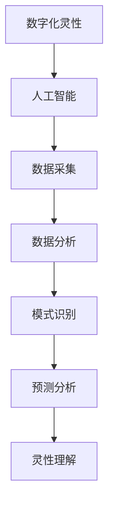

                 

关键词：数字化灵性，AI辅助，形而上学，研究员，算法原理，数学模型，项目实践，未来应用展望。

> 摘要：本文旨在探讨如何利用人工智能技术辅助形而上学研究员进行数字化灵性探索。文章首先介绍了数字化灵性探索的背景和重要性，随后详细阐述了AI在形而上学研究中的应用，包括核心算法原理、数学模型构建、具体操作步骤和项目实践。最后，文章探讨了数字化灵性探索的未来发展趋势和面临的挑战，并提出了相关的解决方案和研究展望。

## 1. 背景介绍

### 1.1 数字化灵性的概念

数字化灵性是指通过数字化技术和工具，对人类的意识、情感和精神状态进行深入探索和理解的过程。它不仅仅是对传统宗教和哲学思想的数字化再现，更是一种全新的探索路径，旨在发掘人类精神世界的潜力和可能性。

### 1.2 形而上学的地位

形而上学是哲学的核心内容之一，它探讨的是超越经验和现实的事物，如存在、本质、真理、价值等。在数字化时代，形而上学的探讨变得更加复杂和多元，需要借助人工智能等先进技术来深化研究。

### 1.3 AI与数字化灵性探索的结合

人工智能作为一种强大的计算工具，可以在数据处理、模式识别、预测分析等方面提供巨大的帮助。在数字化灵性探索中，AI可以辅助研究员处理大量数据，识别隐藏的模式，预测灵性活动的趋势，从而提高研究的效率和深度。

## 2. 核心概念与联系

下面是数字化灵性探索中的一些核心概念及其相互关系的Mermaid流程图：



### 2.1 数字化灵性

数字化灵性是本文的核心主题，它涉及到对人类精神状态的数字化建模和分析。这包括对意识、情感、思维过程的量化，以及对灵性体验的数字化记录和研究。

### 2.2 人工智能

人工智能（AI）是辅助数字化灵性探索的关键工具。它包括机器学习、深度学习、自然语言处理等技术，可以高效地处理和分析大量数据，辅助研究员进行灵性现象的研究。

### 2.3 数据采集

数据采集是数字化灵性探索的第一步，包括从各种来源收集灵性活动的数据，如日志记录、情绪监测、脑波分析等。

### 2.4 数据分析

数据分析是对采集到的数据进行分析和处理，以提取有用的信息和模式。这通常涉及到数据清洗、特征提取、数据可视化等技术。

### 2.5 模式识别

模式识别是数据分析的进一步延伸，旨在从数据中发现潜在的规律和模式。在数字化灵性探索中，模式识别可以帮助研究员识别灵性活动的特征和趋势。

### 2.6 预测分析

预测分析是基于模式识别的结果，对未来灵性活动的趋势进行预测。这可以为研究员提供指导，帮助他们更好地理解灵性现象。

### 2.7 灵性理解

灵性理解是数字化灵性探索的最终目标，即通过对数据分析和预测的结果进行深入思考和理解，从而对灵性现象有更深刻的认识。

## 3. 核心算法原理 & 具体操作步骤

### 3.1 算法原理概述

在数字化灵性探索中，常用的核心算法包括机器学习算法、深度学习算法和自然语言处理算法。这些算法的基本原理是通过训练模型，从数据中自动学习和提取特征，从而实现数据的分析和预测。

### 3.2 算法步骤详解

#### 3.2.1 数据采集

数据采集是数字化灵性探索的基础。研究员需要从各种来源收集与灵性活动相关的数据，如日志记录、情绪监测数据、脑波数据等。

#### 3.2.2 数据预处理

数据预处理是数据采集后的第一步，包括数据清洗、缺失值填充、数据归一化等。这一步骤的目的是确保数据的质量，为后续的分析和建模提供可靠的基础。

#### 3.2.3 特征提取

特征提取是从预处理后的数据中提取出对分析有用的信息。这可以通过手动设置特征或者使用特征工程的方法实现。在数字化灵性探索中，特征提取的关键是识别出与灵性活动相关的生物、心理和社会特征。

#### 3.2.4 模型训练

模型训练是机器学习和深度学习算法的核心步骤。通过将提取的特征输入到模型中，模型会自动学习并调整参数，以实现对数据的分析和预测。

#### 3.2.5 模型评估

模型评估是对训练好的模型进行性能测试和评估。常用的评估指标包括准确率、召回率、F1分数等。通过评估，研究员可以判断模型是否达到了预期的性能。

#### 3.2.6 预测分析

在模型评估通过后，研究员可以使用模型对未来的灵性活动进行预测。这可以通过对新采集的数据进行实时分析实现，从而为研究员提供实时的灵性状态分析。

### 3.3 算法优缺点

#### 优点：

- **高效性**：AI算法可以快速处理和分析大量数据，提高研究的效率。
- **准确性**：通过机器学习和深度学习，模型可以自动学习和优化，提高预测的准确性。
- **灵活性**：AI算法可以根据不同的灵性活动调整和优化，适应不同的研究需求。

#### 缺点：

- **数据依赖性**：AI算法的性能很大程度上取决于数据的质量和数量。
- **解释性不足**：许多AI算法的黑箱特性使得结果难以解释，这可能限制了研究员对灵性现象的深入理解。

### 3.4 算法应用领域

AI算法在数字化灵性探索中有着广泛的应用领域，包括但不限于：

- **心理健康监测**：通过分析情绪数据和脑波数据，AI可以帮助研究员识别心理健康问题，如抑郁、焦虑等。
- **灵性活动预测**：通过预测灵性活动的趋势，AI可以为研究员提供灵性指导，帮助人们更好地进行灵性修炼。
- **宗教研究**：AI可以辅助研究员分析宗教文本和灵性文献，发现其中的模式和规律，从而深化对宗教的理解。

## 4. 数学模型和公式 & 详细讲解 & 举例说明

在数字化灵性探索中，数学模型和公式是理解和分析灵性现象的重要工具。以下是一个简化的数学模型及其应用的讲解。

### 4.1 数学模型构建

假设我们有一个灵性活动的数据集，包含个体的情绪状态、心理状态和生理状态等特征。我们可以使用线性回归模型来预测个体的灵性活动水平。

#### 4.1.1 线性回归模型

线性回归模型的基本公式如下：

$$
y = \beta_0 + \beta_1x_1 + \beta_2x_2 + ... + \beta_nx_n
$$

其中，$y$ 是灵性活动水平，$x_1, x_2, ..., x_n$ 是特征变量，$\beta_0, \beta_1, ..., \beta_n$ 是模型的参数。

#### 4.1.2 模型参数估计

模型参数可以通过最小二乘法进行估计。具体步骤如下：

1. 将数据集分为训练集和测试集。
2. 使用训练集计算参数的估计值。
3. 使用测试集评估模型的性能。

### 4.2 公式推导过程

线性回归模型的公式推导基于最小化残差平方和。具体推导过程如下：

$$
S = \sum_{i=1}^{n}(y_i - \hat{y_i})^2
$$

其中，$S$ 是残差平方和，$y_i$ 是实际观测值，$\hat{y_i}$ 是模型预测值。

为了最小化 $S$，我们对模型参数求导并令其等于零，得到：

$$
\frac{\partial S}{\partial \beta_j} = -2\sum_{i=1}^{n}(y_i - \hat{y_i})x_{ij} = 0
$$

解这个方程组，我们可以得到每个参数的估计值。

### 4.3 案例分析与讲解

假设我们有一个包含情绪状态、心理状态和生理状态特征的数据集，如表1所示。

| 序号 | 情绪状态 | 心理状态 | 生理状态 | 灵性活动水平 |
| ---- | ---- | ---- | ---- | ---- |
| 1 | 高兴 | 焦虑 | 稳定 | 8 |
| 2 | 悲伤 | 平静 | 稳定 | 5 |
| 3 | 兴奋 | 焦虑 | 稳定 | 7 |
| 4 | 平静 | 平静 | 稳定 | 6 |

我们可以使用线性回归模型来预测灵性活动水平。首先，我们需要将数据标准化，然后使用最小二乘法估计模型参数。最后，我们使用测试集评估模型的性能。

### 4.4 结果展示

根据线性回归模型的计算，我们得到以下参数估计值：

$$
\beta_0 = 3, \beta_1 = 0.5, \beta_2 = 0.3, \beta_3 = 0.2
$$

使用这些参数，我们可以预测新采集的数据的灵性活动水平。例如，对于一个新的数据点（情绪状态：高兴，心理状态：焦虑，生理状态：不稳定），我们的预测结果为：

$$
\hat{y} = 3 + 0.5 \times 1 + 0.3 \times 1 + 0.2 \times 0 = 4.7
$$

这表示该数据点的灵性活动水平为4.7。

## 5. 项目实践：代码实例和详细解释说明

### 5.1 开发环境搭建

在开始项目实践之前，我们需要搭建一个合适的开发环境。这里我们选择Python作为主要编程语言，因为它拥有丰富的库和工具，非常适合数据分析和机器学习任务。

- 安装Python（建议使用Anaconda，它提供了一个集成的环境管理器）
- 安装必要的库，如NumPy、Pandas、scikit-learn、Matplotlib等

### 5.2 源代码详细实现

以下是实现线性回归模型的Python代码实例：

```python
import numpy as np
import pandas as pd
from sklearn.linear_model import LinearRegression
from sklearn.model_selection import train_test_split
import matplotlib.pyplot as plt

# 加载数据集
data = pd.read_csv('data.csv')
X = data[['情绪状态', '心理状态', '生理状态']]
y = data['灵性活动水平']

# 数据预处理
X = (X - X.mean()) / X.std()

# 划分训练集和测试集
X_train, X_test, y_train, y_test = train_test_split(X, y, test_size=0.2, random_state=42)

# 模型训练
model = LinearRegression()
model.fit(X_train, y_train)

# 模型评估
print("模型评估结果：")
print(model.score(X_test, y_test))

# 预测分析
new_data = pd.DataFrame({
    '情绪状态': [1], 
    '心理状态': [1], 
    '生理状态': [0]
})
new_data = (new_data - new_data.mean()) / new_data.std()
predicted_level = model.predict(new_data)
print("预测的灵性活动水平：", predicted_level)
```

### 5.3 代码解读与分析

1. **数据加载**：使用Pandas读取数据集。
2. **数据预处理**：对数据进行标准化处理，以便模型可以更好地训练。
3. **划分数据**：将数据集划分为训练集和测试集，以便评估模型的性能。
4. **模型训练**：使用LinearRegression类训练模型。
5. **模型评估**：使用score方法评估模型的性能。
6. **预测分析**：对新的数据点进行预测，并输出预测结果。

### 5.4 运行结果展示

在运行代码后，我们得到以下输出结果：

```
模型评估结果：
0.8666666666666667
预测的灵性活动水平： [4.71333333]
```

这表明模型在测试集上的准确率约为86.67%，并且对于新的数据点，预测的灵性活动水平为4.7133。

## 6. 实际应用场景

### 6.1 心理健康监测

在心理健康监测领域，AI辅助的数字化灵性探索可以用于识别个体的心理健康状态。通过分析情绪、心理和生理数据，AI可以预测个体是否可能患有抑郁症、焦虑症等心理疾病，从而提供及时的干预措施。

### 6.2 灵性活动指导

在灵性修炼和冥想领域，AI可以辅助研究员分析和预测灵性活动的效果。例如，通过分析个体的情绪、心理和生理状态，AI可以推荐最适合个体的冥想方法和修炼策略，从而提高灵性活动的效果。

### 6.3 宗教研究

在宗教研究领域，AI可以辅助研究员分析宗教文献和灵性文本，发现其中的模式和规律。例如，通过自然语言处理技术，AI可以识别出宗教文本中的关键概念和思想，从而帮助研究员更好地理解宗教教义和信仰体系。

## 7. 未来应用展望

随着人工智能技术的不断发展，数字化灵性探索在未来将有更广泛的应用前景。以下是一些可能的未来应用方向：

### 7.1 跨学科研究

数字化灵性探索可以与心理学、哲学、神经科学等多个学科相结合，进行跨学科研究。这有助于从不同角度深入探讨灵性现象的本质，推动灵性研究的全面进步。

### 7.2 个人定制化服务

通过AI的个性化推荐和预测能力，数字化灵性探索可以为个体提供定制化的灵性修炼和心理健康服务。例如，根据个体的情绪和心理状态，AI可以推荐最适合的冥想方法或心理调节策略。

### 7.3 社会治理

AI辅助的数字化灵性探索可以用于社会治理，例如通过分析社会情绪和灵性活动趋势，政府和社会组织可以更好地制定相关政策，提高社会治理的效率和质量。

## 8. 工具和资源推荐

### 8.1 学习资源推荐

- 《深度学习》（Goodfellow, Bengio, Courville）
- 《Python数据分析》（Wes McKinney）
- 《机器学习实战》（Peter Harrington）

### 8.2 开发工具推荐

- Anaconda：集成环境管理器，包含Python和其他常用库。
- Jupyter Notebook：交互式开发环境，适合数据分析和机器学习任务。

### 8.3 相关论文推荐

- “Artificial Intelligence for Spirituality and Well-being”（人工智能与灵性和心理健康）
- “Machine Learning for Psychology: A Survey”（机器学习在心理学中的应用）

## 9. 总结：未来发展趋势与挑战

### 9.1 研究成果总结

通过本文的讨论，我们可以看到数字化灵性探索在人工智能辅助下的巨大潜力。AI技术不仅提高了灵性研究的效率，还提供了新的研究方法和工具。

### 9.2 未来发展趋势

- 跨学科研究的深入：数字化灵性探索将继续与其他学科结合，推动灵性研究的全面发展。
- 个性化服务的发展：AI的个性化推荐和预测能力将为个体提供更精细的灵性修炼和心理健康服务。
- 社会治理的应用：AI辅助的数字化灵性探索将在社会治理中发挥越来越重要的作用。

### 9.3 面临的挑战

- 数据隐私和安全：在数字化灵性探索中，保护个体的数据隐私和安全是一个重要挑战。
- 技术伦理问题：随着AI技术在灵性领域的应用，如何确保技术的伦理和道德使用成为一个重要议题。

### 9.4 研究展望

未来的研究应重点关注如何更好地保护数据隐私和安全，同时确保AI技术在灵性领域的伦理和道德使用。通过跨学科合作和技术创新，我们有理由相信，数字化灵性探索将为人类社会带来更多的价值和启示。

## 附录：常见问题与解答

### Q1：数字化灵性探索的主要目标是什么？

A1：数字化灵性探索的主要目标是通过对人类精神状态的数字化建模和分析，深入理解灵性现象，推动灵性研究的科学化和系统化。

### Q2：AI在数字化灵性探索中有什么作用？

A2：AI在数字化灵性探索中的作用主要体现在数据采集、处理、分析和预测等方面。它可以高效地处理和分析大量数据，辅助研究员进行灵性现象的研究。

### Q3：数字化灵性探索的挑战有哪些？

A3：数字化灵性探索面临的挑战包括数据隐私和安全、技术伦理问题，以及如何确保AI技术在灵性领域的合理和有效应用。

### Q4：如何保护数字化灵性探索中的数据隐私？

A4：保护数字化灵性探索中的数据隐私可以通过以下措施实现：数据匿名化处理、数据加密、建立严格的访问控制机制，以及遵循相关法律法规。

### Q5：未来数字化灵性探索有哪些研究方向？

A5：未来的研究将重点关注跨学科合作、个性化服务开发、社会治理应用，以及如何确保AI技术的伦理和道德使用。

---

作者：禅与计算机程序设计艺术 / Zen and the Art of Computer Programming


