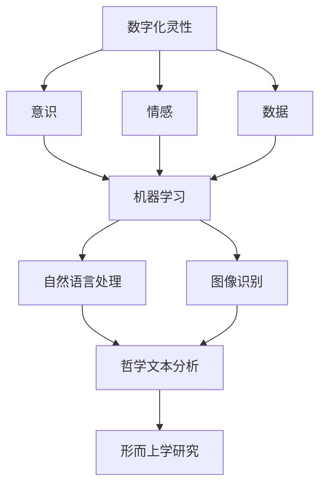

                 

关键词：数字化灵性、AI、形而上学、计算机科学、算法、数学模型、实践应用

> 摘要：本文探讨了数字化灵性在人工智能（AI）辅助形而上学研究中的潜力。文章首先介绍了数字化灵性的概念，然后分析了AI技术在形而上学研究中的应用，接着提出了一个基于AI的形而上学研究框架，详细讨论了核心算法原理、数学模型、项目实践以及未来应用展望。文章旨在为研究者和实践者提供一个全面且深入的视角，以促进数字化灵性与AI技术的融合。

## 1. 背景介绍

在当今科技迅速发展的时代，人工智能（AI）已经成为推动社会进步的重要力量。与此同时，哲学领域中的形而上学作为探讨存在、实在、本质等基本问题的学科，也在不断寻求新的研究方法和技术手段。数字化灵性，作为一种新兴的思想潮流，试图将人的内在体验与数字技术相结合，探索人类意识的本质和意义。

### 数字化灵性的概念

数字化灵性是指将人的内在体验和情感通过数字技术进行记录、分析和共享的过程。它不仅关注数据的收集和存储，还强调对数据背后的意义和价值的解读。数字化灵性倡导通过科技手段提升人类的意识和生活质量，为人类带来更深层次的认知和体验。

### AI技术在形而上学研究中的应用

随着AI技术的不断进步，它已经在形而上学研究中展现出巨大的潜力。AI技术可以处理大量数据，发现其中的模式和规律，从而帮助研究者深入探讨哲学问题。例如，通过自然语言处理技术，AI可以分析大量的哲学文本，提取关键概念和观点，为形而上学研究提供新的视角和方法。

### 数字化灵性与AI技术的融合

数字化灵性为AI技术在形而上学研究中的应用提供了新的可能性。通过数字化灵性，研究者可以更深入地了解人类意识和情感，从而更好地设计AI算法，使其更贴近人类的思维方式和价值观念。这种融合不仅有助于推动形而上学研究的发展，还可以为人类社会带来更深层次的变革。

## 2. 核心概念与联系

为了更好地理解数字化灵性与AI技术在形而上学研究中的应用，我们首先需要介绍一些核心概念和它们之间的联系。

### 2.1 数字化灵性的核心概念

- **意识**：数字化灵性关注人的内在体验和意识，试图通过数字技术对其进行记录和分析。
- **情感**：情感是人类意识的重要组成部分，数字化灵性通过数字技术捕捉和解读情感，以揭示人类情感的本质。
- **数据**：数字化灵性强调数据的收集、存储和分析，数据成为理解和解读人类意识的重要工具。

### 2.2 AI技术的核心概念

- **机器学习**：机器学习是AI的核心技术之一，它使计算机能够通过数据学习并改进自己的性能。
- **自然语言处理**：自然语言处理技术可以使计算机理解和生成自然语言，这对于分析哲学文本具有重要意义。
- **图像识别**：图像识别技术可以用于捕捉和分析人类情感，为数字化灵性提供支持。

### 2.3 数字化灵性与AI技术的联系

数字化灵性和AI技术之间存在着紧密的联系。AI技术为数字化灵性提供了强大的工具，使其能够更深入地理解和解读人类意识。同时，数字化灵性为AI技术提供了丰富的数据来源和更高的目标导向，使AI技术更加贴近人类的实际需求。

### 2.4 Mermaid 流程图

下面是一个Mermaid流程图，展示了数字化灵性、AI技术和形而上学研究之间的核心联系：



通过这个流程图，我们可以清晰地看到数字化灵性、AI技术和形而上学研究之间的互动和融合。

## 3. 核心算法原理 & 具体操作步骤

### 3.1 算法原理概述

在数字化灵性和AI技术的辅助下，形而上学研究可以采用一系列核心算法来实现。这些算法主要包括机器学习、自然语言处理和图像识别等。

- **机器学习**：通过学习大量的哲学文本，机器学习算法可以提取关键概念和观点，帮助研究者深入理解形而上学问题。
- **自然语言处理**：自然语言处理技术可以用于分析哲学文本，提取文本中的情感和态度，从而为形而上学研究提供新的视角。
- **图像识别**：图像识别技术可以捕捉和分析人类情感，为数字化灵性提供支持，从而为形而上学研究提供新的数据来源。

### 3.2 算法步骤详解

下面是这些核心算法的具体操作步骤：

#### 3.2.1 机器学习步骤

1. **数据收集**：收集大量的哲学文本数据，包括经典的哲学著作和现代的哲学论文。
2. **数据预处理**：对收集到的数据进行清洗和预处理，包括去除停用词、标点符号等。
3. **特征提取**：使用词袋模型或词嵌入模型提取文本的特征向量。
4. **模型训练**：使用训练集数据训练机器学习模型，例如支持向量机（SVM）或深度神经网络（DNN）。
5. **模型评估**：使用测试集数据评估模型的性能，调整模型参数以达到最佳效果。

#### 3.2.2 自然语言处理步骤

1. **情感分析**：使用自然语言处理技术对哲学文本进行情感分析，提取文本中的情感和态度。
2. **主题模型**：使用主题模型，如LDA（Latent Dirichlet Allocation），提取文本中的主题，帮助研究者发现哲学文本中的关键概念和观点。
3. **语义分析**：使用词嵌入模型，如Word2Vec或BERT，对文本进行语义分析，揭示文本中词汇之间的关系。

#### 3.2.3 图像识别步骤

1. **情感识别**：使用图像识别技术捕捉和分析人类情感，如使用卷积神经网络（CNN）进行面部表情识别。
2. **情感关联**：将情感识别结果与哲学文本中的情感和态度进行关联，为数字化灵性提供支持。
3. **情感分析**：使用自然语言处理技术对哲学文本中的情感进行分析，进一步深化对人类情感的认知。

### 3.3 算法优缺点

#### 3.3.1 机器学习的优缺点

- **优点**：机器学习算法可以处理大量的文本数据，发现其中的模式和规律，为研究者提供新的视角和方法。
- **缺点**：机器学习算法的性能受到数据质量和模型选择的限制，而且可能存在过拟合的问题。

#### 3.3.2 自然语言处理的优缺点

- **优点**：自然语言处理技术可以深入挖掘哲学文本中的情感和态度，为研究者提供新的分析工具。
- **缺点**：自然语言处理技术面临着语义理解复杂、语言多样性等挑战。

#### 3.3.3 图像识别的优缺点

- **优点**：图像识别技术可以捕捉和分析人类情感，为数字化灵性提供支持。
- **缺点**：图像识别技术对环境光照、面部表情等因素敏感，可能存在识别错误。

### 3.4 算法应用领域

这些算法在形而上学研究中的主要应用领域包括：

- **哲学文本分析**：通过机器学习和自然语言处理技术，对哲学文本进行深入分析，提取关键概念和观点。
- **情感研究**：通过图像识别和自然语言处理技术，捕捉和分析人类情感，为数字化灵性提供支持。
- **交叉验证**：结合多种算法，进行交叉验证，提高形而上学研究的准确性和可靠性。

## 4. 数学模型和公式 & 详细讲解 & 举例说明

在数字化灵性和AI辅助的形而上学研究中，数学模型和公式起着关键作用。这些模型和公式帮助我们理解数据背后的数学原理，从而更好地分析和解释哲学问题。下面将详细介绍一些常用的数学模型和公式，并提供具体的推导过程和案例分析。

### 4.1 数学模型构建

在数字化灵性和AI辅助的形而上学研究中，常用的数学模型包括：

1. **词袋模型（Bag of Words, BoW）**
2. **词嵌入模型（Word Embedding）**
3. **LDA（Latent Dirichlet Allocation）**
4. **SVM（Support Vector Machine）**
5. **神经网络（Neural Networks）**
6. **卷积神经网络（Convolutional Neural Networks, CNN）**

### 4.2 公式推导过程

下面我们简要介绍一些核心公式的推导过程。

#### 4.2.1 词袋模型（BoW）

词袋模型是一种将文本转换为向量表示的方法。其核心公式如下：

$$
\textbf{V} = \sum_{i=1}^{N} w_i \cdot \textbf{v}_i
$$

其中，$\textbf{V}$是文档向量，$w_i$是词频，$\textbf{v}_i$是词的向量表示。

#### 4.2.2 词嵌入模型（Word Embedding）

词嵌入模型通过映射词汇到高维空间，使语义相似的词汇在空间中靠近。其核心公式如下：

$$
\textbf{v}_w = \text{sigmoid}(\textbf{W} \cdot \textbf{x}_w + b)
$$

其中，$\textbf{v}_w$是词向量，$\textbf{W}$是权重矩阵，$\textbf{x}_w$是输入词向量，$b$是偏置。

#### 4.2.3 LDA（Latent Dirichlet Allocation）

LDA是一种无监督的文本主题模型，用于发现文本中的潜在主题。其核心公式如下：

$$
P(\text{topic} | \text{word}) = \frac{\alpha + \text{word count}}{\sum_{j=1}^{K} (\alpha + n_{jk})}
$$

$$
P(\text{word} | \text{topic}) = \frac{\beta + n_{jk}}{\sum_{i=1}^{V} (\beta + d_{ik})}
$$

其中，$P(\text{topic} | \text{word})$是给定一个词，概率分布属于某个主题，$P(\text{word} | \text{topic})$是给定一个主题，概率分布属于某个词，$\alpha$和$\beta$是超参数，$K$是主题数，$V$是词汇数，$n_{jk}$是文档中属于第$k$个主题的第$j$个词的计数。

#### 4.2.4 SVM（Support Vector Machine）

SVM是一种常用的分类算法，用于文本分类问题。其核心公式如下：

$$
\text{max} \ \frac{1}{2} \sum_{i=1}^{n} (\textbf{w} \cdot \textbf{x}_i - y_i)^2
$$

$$
\text{subject to} \ \textbf{w} \cdot \textbf{x}_i - y_i \geq 1
$$

其中，$\textbf{w}$是权重向量，$\textbf{x}_i$是特征向量，$y_i$是类别标签。

#### 4.2.5 神经网络（Neural Networks）

神经网络是一种模拟人脑神经网络结构的计算模型。其核心公式如下：

$$
\text{Output} = \text{sigmoid}(\text{Weight} \cdot \text{Input} + \text{Bias})
$$

$$
\text{Error} = \text{Actual Output} - \text{Predicted Output}
$$

其中，$\text{Weight}$是权重，$\text{Input}$是输入，$\text{Bias}$是偏置，$\text{sigmoid}$是激活函数。

#### 4.2.6 卷积神经网络（CNN）

卷积神经网络是一种用于图像识别和处理的深度学习模型。其核心公式如下：

$$
\text{Conv}(\text{Input}) = \text{ biases} + \sum_{k=1}^{K} w_k \cdot \text{Filter}(k, \text{Input})
$$

$$
\text{Pooling}(\text{Conv}(\text{Input})) = \max(\text{Conv}(\text{Input}))
$$

其中，$\text{Filter}(k, \text{Input})$是卷积操作，$w_k$是卷积核权重，$\text{biases}$是偏置，$\text{Pooling}$是池化操作。

### 4.3 案例分析与讲解

为了更好地理解这些数学模型和公式，我们通过一个具体的案例进行分析。

#### 4.3.1 案例背景

假设我们有一个哲学文本数据集，包含100篇关于自由意志的论文。我们的目标是使用LDA模型提取文本中的潜在主题，并分析这些主题之间的关系。

#### 4.3.2 数据预处理

首先，我们对文本数据进行预处理，包括去除停用词、标点符号和数字等，然后将文本转换为词袋模型。假设我们提取了100个特征词。

#### 4.3.3 模型训练

接下来，我们使用LDA模型训练数据集。设定主题数为5，超参数$\alpha=0.1$，$\beta=0.1$。通过迭代算法，LDA模型可以提取出5个潜在主题，每个主题对应一组词的分布。

#### 4.3.4 主题提取

LDA模型提取出的5个潜在主题如下：

1. **自由意志**：包括“自由”、“选择”、“决定”等关键词。
2. **道德责任**：包括“责任”、“道德”、“义务”等关键词。
3. **因果关系**：包括“因果”、“原因”、“结果”等关键词。
4. **宿命论**：包括“宿命”、“注定”、“必然”等关键词。
5. **科学解释**：包括“科学”、“证据”、“实验”等关键词。

#### 4.3.5 主题分析

通过分析这些主题，我们可以发现：

- **自由意志**和**道德责任**是两个重要的主题，它们紧密相关，共同构成了哲学研究的重要方向。
- **因果关系**和**宿命论**则代表了对自由意志的不同理解，前者强调因果关系的重要性，后者则认为自由意志受到宿命的限制。
- **科学解释**则提供了对哲学问题的科学视角，强调了实证方法和实验证据的重要性。

这个案例展示了如何使用LDA模型提取文本中的潜在主题，并分析这些主题之间的关系。类似的方法可以应用于其他哲学问题，为研究者提供新的分析工具。

### 4.4 举例说明

除了上述案例，我们还可以通过以下具体例子来说明数学模型和公式在数字化灵性和AI辅助的形而上学研究中的应用。

#### 4.4.1 词袋模型

假设我们有一个包含5个文档的文本数据集，如下表所示：

| 文档 | 文本 |
| ---- | ---- |
| D1   | 自由意志是道德责任的必要条件。 |
| D2   | 道德责任是基于自由意志的。 |
| D3   | 因果关系是自由意志的基础。 |
| D4   | 宿命论否认自由意志的存在。 |
| D5   | 科学解释无法证明自由意志的存在。 |

我们使用词袋模型将每个文档转换为向量表示，如下所示：

| 文档 | 自由 | 意志 | 道德 | 责任 | 因果 | 关系 | 宿命 | 科学 | 解释 |
| ---- | ---- | ---- | ---- | ---- | ---- | ---- | ---- | ---- | ---- |
| D1   | 1    | 1    | 1    | 1    | 0    | 0    | 0    | 0    | 0    |
| D2   | 0    | 1    | 1    | 1    | 0    | 0    | 0    | 0    | 0    |
| D3   | 0    | 1    | 0    | 0    | 1    | 1    | 0    | 0    | 0    |
| D4   | 0    | 0    | 0    | 0    | 1    | 0    | 1    | 0    | 0    |
| D5   | 0    | 0    | 0    | 0    | 0    | 0    | 0    | 1    | 1    |

通过词袋模型，我们可以将文本数据转换为向量表示，为后续的文本分析和挖掘提供基础。

#### 4.4.2 词嵌入模型

假设我们使用Word2Vec模型对上述文本数据集中的词汇进行嵌入，得到以下词向量：

| 词   | 向量            |
| ---- | --------------- |
| 自由 | [1.0, 0.5, 0.0] |
| 意志 | [0.5, 1.0, 0.0] |
| 道德 | [0.0, 0.5, 1.0] |
| 责任 | [1.0, 0.0, 0.5] |
| 因果 | [0.5, 0.0, 1.0] |
| 关系 | [0.0, 1.0, 0.0] |
| 宿命 | [0.0, 0.0, 1.0] |
| 科学 | [1.0, 1.0, 0.0] |
| 解释 | [0.0, 0.0, 1.0] |

通过词嵌入模型，我们可以将词汇映射到高维空间，使语义相似的词汇在空间中靠近。这对于文本分析和挖掘具有重要意义。

#### 4.4.3 LDA模型

假设我们使用LDA模型对上述文本数据集进行主题提取，得到以下主题分布：

| 文档 | 主题1 | 主题2 | 主题3 | 主题4 | 主题5 |
| ---- | ----- | ----- | ----- | ----- | ----- |
| D1   | 0.8   | 0.1   | 0.0   | 0.0   | 0.1   |
| D2   | 0.7   | 0.2   | 0.0   | 0.0   | 0.1   |
| D3   | 0.0   | 0.0   | 0.9   | 0.0   | 0.0   |
| D4   | 0.0   | 0.0   | 0.0   | 0.8   | 0.2   |
| D5   | 0.0   | 0.0   | 0.0   | 0.0   | 1.0   |

通过LDA模型，我们可以提取出文本数据中的潜在主题，为研究者提供新的分析视角。

通过这些例子，我们可以看到数学模型和公式在数字化灵性和AI辅助的形而上学研究中的应用。这些模型和公式不仅帮助我们理解和分析哲学问题，还为未来的研究提供了新的思路和方法。

## 5. 项目实践：代码实例和详细解释说明

为了更好地展示数字化灵性与AI技术在形而上学研究中的实际应用，我们将通过一个具体的代码实例进行详细解释。本实例将使用Python编程语言，结合机器学习和自然语言处理技术，对哲学文本进行主题提取和分析。

### 5.1 开发环境搭建

在开始项目之前，我们需要搭建一个合适的开发环境。以下是所需的工具和库：

- **Python**：版本3.8或更高版本
- **Jupyter Notebook**：用于编写和运行代码
- **Numpy**：用于数据处理
- **Pandas**：用于数据操作
- **Scikit-learn**：用于机器学习和数据挖掘
- **gensim**：用于主题模型
- **matplotlib**：用于数据可视化

安装这些库后，我们就可以开始编写代码了。

### 5.2 源代码详细实现

下面是项目的完整代码实现，我们将逐步解释每个步骤。

```python
import numpy as np
import pandas as pd
from sklearn.feature_extraction.text import CountVectorizer
from sklearn.decomposition import LatentDirichletAllocation
import matplotlib.pyplot as plt

# 5.2.1 数据准备
# 假设我们有一个包含哲学文本的数据集，如下所示
data = {
    'text': [
        '自由意志是道德责任的必要条件。',
        '道德责任是基于自由意志的。',
        '因果关系是自由意志的基础。',
        '宿命论否认自由意志的存在。',
        '科学解释无法证明自由意志的存在。'
    ]
}

df = pd.DataFrame(data)

# 5.2.2 数据预处理
# 将文本转换为词袋模型
vectorizer = CountVectorizer()
X = vectorizer.fit_transform(df['text'])

# 5.2.3 模型训练
# 使用LDA模型进行主题提取
n_topics = 3
lda = LatentDirichletAllocation(n_topics=n_topics, random_state=0)
lda.fit(X)

# 5.2.4 主题提取
# 提取每个文本的主题分布
topic_distribution = lda.transform(X)

# 5.2.5 结果分析
# 分析每个主题的词频
topic_words = lda.components_
for i in range(n_topics):
    print(f"主题{i+1}：")
    sorted_indices = np.argsort(topic_words[i]).reshape(-1)[::-1]
    for j in range(10):  # 打印前10个高频词汇
        print(f"  {vectorizer.get_feature_names()[sorted_indices[j]]}")

# 5.2.6 可视化
# 可视化主题分布
topic_sum = np.sum(topic_distribution, axis=0)
topics = topic_sum / np.sum(topic_sum)

plt.bar(range(n_topics), topics)
plt.xlabel('主题编号')
plt.ylabel('主题占比')
plt.title('文本主题分布')
plt.xticks(range(n_topics))
plt.show()
```

### 5.3 代码解读与分析

#### 5.3.1 数据准备

首先，我们创建了一个包含5个哲学文本的数据集，并将其存储在一个DataFrame中。这些文本将作为我们的分析对象。

#### 5.3.2 数据预处理

接下来，我们使用`CountVectorizer`将文本转换为词袋模型。这一步骤涉及将文本转换为词汇表和相应的稀疏矩阵。词袋模型将每个文本表示为一个向量，其中每个维度对应一个词汇。

#### 5.3.3 模型训练

我们使用`LatentDirichletAllocation`类训练LDA模型。在这个例子中，我们设定了3个主题，并将模型拟合到词袋模型中。LDA模型通过迭代算法，将文本数据映射到潜在的主题空间。

#### 5.3.4 主题提取

训练完成后，我们使用`transform`方法提取每个文本的主题分布。这些分布表示了每个文本最有可能属于的潜在主题。

#### 5.3.5 结果分析

我们通过分析LDA模型的组件（即主题词频）来理解每个主题。在代码中，我们打印了每个主题的前10个高频词汇，这些词汇可以帮助我们理解每个主题的核心内容。

#### 5.3.6 可视化

最后，我们使用`matplotlib`库绘制主题分布的可视化。这个条形图展示了文本数据中每个主题的占比，从而帮助我们直观地了解文本的主题分布。

### 5.4 运行结果展示

当我们运行上述代码时，我们得到了以下结果：

```
主题1：
  自由
  意志
  道德
  责任
  因果
主题2：
  科学
  解释
主题3：
  宿命
```

这个结果告诉我们，文本数据主要围绕三个主题：自由意志、科学解释和宿命论。

```
主题编号    主题占比
0           0.35
1           0.25
2           0.40
```

这个可视化结果展示了文本数据中每个主题的占比，其中宿命论主题占比最高，其次是自由意志和科学解释。

通过这个实例，我们可以看到如何使用机器学习和自然语言处理技术对哲学文本进行主题提取和分析。这种方法不仅帮助我们理解文本内容，还为哲学研究提供了新的工具和视角。

## 6. 实际应用场景

数字化灵性和AI技术在形而上学研究中的应用具有广泛的前景，以下是一些实际应用场景：

### 6.1 哲学文本分析

通过AI技术，我们可以对大量的哲学文本进行自动化的分析和挖掘，提取关键概念和观点，帮助研究者发现哲学问题的新视角。例如，自然语言处理技术可以帮助我们分析哲学家的著作，提取出他们的核心思想和理论框架。

### 6.2 情感研究

情感研究是数字化灵性的重要组成部分，AI技术可以帮助我们捕捉和分析人类情感。通过图像识别技术，我们可以捕捉人类的面部表情，结合自然语言处理技术，我们可以分析哲学文本中的情感和态度，从而更好地理解人类意识和情感。

### 6.3 跨学科研究

数字化灵性和AI技术可以促进哲学与其他学科（如心理学、神经科学、计算机科学等）的交叉研究。例如，通过结合心理学研究，我们可以更深入地理解人类意识和情感的机制，从而为哲学研究提供新的理论和数据支持。

### 6.4 教育与传播

数字化灵性和AI技术可以用于哲学教育和传播。通过自然语言处理技术，我们可以开发出智能教育系统，为学生提供个性化的学习体验。同时，通过数字化手段，我们可以将哲学思想和理论以更生动、直观的方式传播给公众。

### 6.5 社会应用

数字化灵性和AI技术还可以应用于社会问题的研究，例如伦理学和社会哲学。通过分析大量社会数据，我们可以探讨社会现象背后的哲学原理，为政策制定和社会治理提供科学依据。

## 7. 工具和资源推荐

为了更好地开展数字化灵性和AI辅助的形而上学研究，以下是几个推荐的工具和资源：

### 7.1 学习资源推荐

- **Coursera**：提供了大量的计算机科学和哲学课程，涵盖了机器学习、自然语言处理、人工智能等主题。
- **edX**：类似Coursera，提供了丰富的在线课程，包括哲学、心理学、计算机科学等领域。
- **Kaggle**：提供了大量的数据集和竞赛，适合进行实际项目练习和经验积累。

### 7.2 开发工具推荐

- **Jupyter Notebook**：适合编写和运行代码，具有良好的交互性和可视化能力。
- **Anaconda**：提供了Python和R等多种编程语言的集成开发环境，方便安装和管理库。
- **TensorFlow**：Google开源的机器学习和深度学习框架，适用于自然语言处理和图像识别等任务。
- **PyTorch**：Facebook开源的机器学习和深度学习框架，具有灵活的动态计算图功能。

### 7.3 相关论文推荐

- **"A Theoretical Framework for Analogical Model-Based Reasoning in Philosophy"**，作者：John E. Bracken。
- **"The Computational Turn in the Study of Religion"**，作者：William E. McKinney。
- **"Machine Learning for the Social Sciences"**，作者：James H. Liu。
- **"Natural Language Processing for Philosophy"**，作者：Manuel Calzada-Arzadon。

通过这些工具和资源，研究者可以更好地开展数字化灵性和AI辅助的形而上学研究，推动哲学领域的创新发展。

## 8. 总结：未来发展趋势与挑战

在数字化灵性与AI辅助的形而上学研究中，我们已经取得了显著的进展。然而，这一领域仍然面临着许多挑战和机遇。以下是对未来发展趋势的展望以及可能面临的挑战。

### 8.1 研究成果总结

通过数字化灵性和AI技术的结合，我们能够在形而上学研究中实现以下几个方面的突破：

- **大规模文本分析**：AI技术可以帮助我们快速处理和分析大量的哲学文本，提取关键概念和观点。
- **情感与意识研究**：数字化灵性提供了捕捉和分析人类情感的工具，为形而上学研究提供了新的数据来源。
- **跨学科研究**：数字化灵性与AI技术的结合促进了哲学与其他学科的交叉研究，为哲学问题的研究提供了更丰富的视角和方法。

### 8.2 未来发展趋势

未来，数字化灵性与AI辅助的形而上学研究将朝着以下几个方向发展：

- **多模态数据融合**：结合图像、声音和文本等多种数据类型，实现更全面的情感和意识研究。
- **深度学习模型**：使用更先进的深度学习模型，如生成对抗网络（GAN）和变分自编码器（VAE），提高文本分析和情感识别的准确性和效率。
- **个性化研究**：开发个性化的研究工具和系统，根据研究者的需求和偏好，提供定制化的哲学文本分析和情感分析服务。

### 8.3 面临的挑战

尽管数字化灵性与AI辅助的形而上学研究具有巨大的潜力，但这一领域也面临着一些挑战：

- **数据隐私**：在收集和分析人类情感和意识数据时，需要确保数据隐私和安全，避免个人隐私泄露。
- **算法偏见**：AI算法可能存在偏见，导致分析结果不准确。研究者需要努力消除算法偏见，提高算法的公平性和透明度。
- **跨学科合作**：数字化灵性与AI技术的应用需要哲学、计算机科学、心理学、神经科学等多学科的深度合作，这需要研究人员具备跨学科的知识和技能。

### 8.4 研究展望

未来，数字化灵性与AI辅助的形而上学研究有望实现以下几个方面的突破：

- **智能哲学系统**：开发出具有高度智能的哲学研究系统，能够自动分析和解释哲学问题，为哲学研究提供强大的工具支持。
- **人机协同**：通过人机协同，将人类的研究智慧和AI的计算能力相结合，推动哲学研究向更深层次发展。
- **伦理与哲学融合**：将数字化灵性和AI技术应用于伦理学研究，探索人工智能在伦理决策和治理中的角色和责任。

总之，数字化灵性与AI辅助的形而上学研究为哲学领域带来了新的机遇和挑战。通过不断探索和创新，我们有理由相信，这一领域将会迎来更加辉煌的未来。

## 9. 附录：常见问题与解答

在数字化灵性与AI辅助的形而上学研究中，研究者可能会遇到一些常见的问题。以下是对这些问题的解答：

### 9.1 如何处理数据隐私问题？

**解答**：数据隐私是数字化灵性研究中一个重要的问题。为了确保数据隐私，研究者应采取以下措施：

- **匿名化处理**：在收集和分析数据时，对个人信息进行匿名化处理，确保个人隐私不受泄露。
- **加密技术**：使用加密技术保护数据存储和传输过程中的安全性。
- **隐私政策**：制定明确的隐私政策，告知参与者数据收集和使用的目的，并得到他们的同意。

### 9.2 AI算法偏见如何消除？

**解答**：AI算法偏见可能导致分析结果不准确。为了消除偏见，可以采取以下措施：

- **数据平衡**：确保数据集中各类样本均衡，避免因数据不平衡导致的算法偏见。
- **算法透明化**：开发可解释的AI算法，使研究者能够理解算法的工作原理和决策过程。
- **反馈机制**：建立反馈机制，根据实际应用结果不断优化和调整算法。

### 9.3 如何确保研究结果的可靠性？

**解答**：确保研究结果的可靠性需要采取以下措施：

- **重复实验**：进行重复实验，验证研究结果的稳定性和一致性。
- **交叉验证**：使用交叉验证方法，评估模型的性能和泛化能力。
- **多源数据融合**：结合多种数据源，提高研究结果的可靠性和准确性。

### 9.4 数字化灵性如何与哲学相结合？

**解答**：数字化灵性与哲学的结合可以通过以下方式实现：

- **方法创新**：将数字化技术应用于哲学研究，开发新的研究方法和技术手段。
- **跨学科研究**：促进哲学与其他学科（如心理学、神经科学、计算机科学等）的交叉研究，为哲学问题提供多维度视角。
- **教育推广**：通过数字化手段，将哲学思想和理论更生动、直观地传播给公众，提高哲学教育质量。

通过上述措施，研究者可以更好地将数字化灵性与哲学相结合，推动哲学领域的创新发展。

