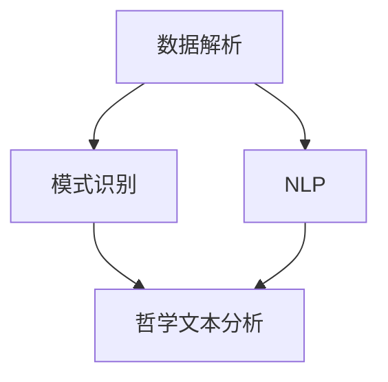

                 

关键词：数字化灵性，AI，形而上学，人工智能辅助，技术哲学

## 摘要

随着人工智能（AI）技术的迅猛发展，其潜力不仅限于技术领域，更对哲学、伦理以及人类意识等形而上学的探究产生了深远影响。本文旨在探讨AI技术在形而上学研究中的应用，特别是数字化灵性的研究。通过介绍AI在数据解析、模式识别、自然语言处理等领域的应用，本文揭示了AI辅助形而上学研究的新路径，并提出了未来研究的可能方向和挑战。本文结构分为以下几个部分：背景介绍、核心概念与联系、核心算法原理与具体操作步骤、数学模型和公式详细讲解、项目实践、实际应用场景以及未来展望。

## 1. 背景介绍

### 人工智能的兴起

人工智能作为计算机科学的一个重要分支，起源于20世纪50年代。自其诞生以来，AI技术经历了多个发展阶段，从最初的符号主义、知识表示到基于规则的系统，再到基于统计的机器学习和深度学习，AI技术的应用范围日益扩大。特别是深度学习的崛起，使得AI在图像识别、自然语言处理、语音识别等领域取得了显著的突破，为各行各业带来了革命性的变化。

### 形而上学的现代解读

形而上学，作为哲学的一个分支，探讨存在、实在、本质、原因等超越经验和科学解释的问题。在现代社会，随着科学技术的发展，形而上学的探讨不再局限于抽象的理论，而是开始与物理、数学、认知科学等学科交叉融合。这种新的视角为形而上学的现代解读提供了丰富的素材和工具，也为AI技术的应用打开了新的可能性。

### 数字化灵性的兴起

数字化灵性，即利用数字技术探索人类意识和精神现象。这一概念涵盖了虚拟现实、增强现实、脑机接口、人工智能等多种技术，旨在通过数字化的方式对人的意识、感知、记忆等进行深入研究。数字化灵性不仅是一种技术探索，更是一种哲学思考，它挑战了我们对现实、自我、意识的传统理解。

## 2. 核心概念与联系

### 数据解析与形而上学

数据解析是指利用计算机技术对大量数据进行抽取、转化、分析和整合的过程。在形而上学研究中，数据解析提供了新的工具，可以揭示出隐藏在复杂现象背后的规律和模式。例如，通过分析大量文献，可以挖掘出哲学理论的发展脉络；通过分析个体行为数据，可以探索人类意识的形成机制。

### 模式识别与形而上学

模式识别是人工智能的一个重要分支，旨在通过算法识别和理解数据中的模式。在形而上学研究中，模式识别可以帮助我们理解抽象概念之间的关系，例如，通过分析哲学家的著作，可以识别出不同哲学流派的核心观点和特点。

### 自然语言处理与形而上学

自然语言处理（NLP）是AI技术中的一个重要领域，它旨在使计算机能够理解、生成和处理自然语言。在形而上学研究中，NLP可以帮助我们分析哲学文本，提取出关键概念和逻辑结构，从而更深入地理解哲学思想。

### Mermaid 流程图



## 3. 核心算法原理与具体操作步骤

### 3.1 算法原理概述

在数字化灵性研究中，常用的算法包括深度学习、强化学习和进化算法等。这些算法各有特点，适用于不同的应用场景。

- **深度学习**：通过多层神经网络对数据进行建模，可以从大量数据中自动学习特征，广泛应用于图像识别、语音识别等领域。
- **强化学习**：通过与环境的交互来学习最优策略，适用于探索复杂系统，如游戏、自动驾驶等。
- **进化算法**：通过模拟生物进化过程，优化问题的解，适用于复杂优化问题。

### 3.2 算法步骤详解

以深度学习为例，其基本步骤如下：

1. **数据收集与预处理**：收集大量相关数据，并进行清洗、归一化等预处理操作。
2. **构建神经网络模型**：设计神经网络的结构，包括层数、每层的神经元数量、激活函数等。
3. **训练模型**：使用训练数据集对模型进行训练，通过反向传播算法优化模型参数。
4. **评估模型**：使用验证数据集对模型进行评估，调整模型参数以获得更好的性能。
5. **应用模型**：将训练好的模型应用于实际问题，如文本分析、图像识别等。

### 3.3 算法优缺点

- **深度学习**：优点是能从大量数据中自动学习特征，适合处理复杂任务；缺点是需要大量计算资源和数据，且模型的可解释性较差。
- **强化学习**：优点是能通过与环境交互学习最优策略，适用于动态环境；缺点是学习过程可能较慢，且需要大量的数据。
- **进化算法**：优点是能发现未知结构的问题解，适合处理复杂优化问题；缺点是计算复杂度较高，收敛速度较慢。

### 3.4 算法应用领域

- **文本分析**：用于哲学文本的分析，如概念提取、观点识别等。
- **图像识别**：用于哲学思想的视觉表达，如哲学家的肖像识别等。
- **虚拟现实**：用于探索虚拟环境中的哲学问题，如意识、现实等。

## 4. 数学模型和公式详细讲解

### 4.1 数学模型构建

在数字化灵性研究中，常用的数学模型包括神经网络模型、马尔可夫模型等。

- **神经网络模型**：用于模拟人脑的神经网络结构，包括输入层、隐藏层和输出层。
- **马尔可夫模型**：用于描述状态转移的概率，适用于时间序列数据。

### 4.2 公式推导过程

以神经网络模型为例，其基本公式推导如下：

- **输入层**：$x_i = w_i \cdot x + b_i$
- **隐藏层**：$h_j = \sigma(\sum_{i=1}^{n} w_{ij} \cdot x_i + b_j)$
- **输出层**：$y_k = w_{k} \cdot h_j + b_k$

其中，$x$为输入向量，$h$为隐藏层输出，$y$为输出向量，$w$为权重矩阵，$b$为偏置向量，$\sigma$为激活函数。

### 4.3 案例分析与讲解

以文本分析为例，我们可以使用神经网络模型对哲学文本进行分类。具体步骤如下：

1. **数据收集**：收集大量哲学文本，并进行预处理。
2. **构建模型**：设计神经网络模型，包括输入层、隐藏层和输出层。
3. **训练模型**：使用预处理后的文本数据对模型进行训练。
4. **评估模型**：使用验证数据集对模型进行评估。
5. **应用模型**：将训练好的模型应用于新文本，进行哲学观点的识别。

## 5. 项目实践：代码实例和详细解释说明

### 5.1 开发环境搭建

为了实现数字化灵性研究，我们需要搭建一个合适的开发环境。这里我们选择Python作为主要编程语言，结合TensorFlow和Keras等深度学习框架。

1. **安装Python**：下载并安装Python，版本建议为3.8及以上。
2. **安装TensorFlow**：通过pip安装TensorFlow。
   ```bash
   pip install tensorflow
   ```
3. **安装Keras**：通过pip安装Keras。
   ```bash
   pip install keras
   ```

### 5.2 源代码详细实现

以下是一个简单的神经网络模型实现，用于文本分类。

```python
from keras.models import Sequential
from keras.layers import Dense, Dropout, Embedding, LSTM
from keras.preprocessing.text import Tokenizer
from keras.preprocessing.sequence import pad_sequences

# 参数设置
vocab_size = 10000
max_len = 100
embedding_dim = 64

# 构建模型
model = Sequential()
model.add(Embedding(vocab_size, embedding_dim, input_length=max_len))
model.add(LSTM(64, dropout=0.2, recurrent_dropout=0.2))
model.add(Dense(1, activation='sigmoid'))

# 编译模型
model.compile(optimizer='adam', loss='binary_crossentropy', metrics=['accuracy'])

# 训练模型
model.fit(x_train, y_train, epochs=10, validation_data=(x_val, y_val))
```

### 5.3 代码解读与分析

上述代码实现了一个简单的文本分类模型，主要包括以下几个部分：

1. **导入库**：导入所需的库，包括Keras、Tokenizer等。
2. **参数设置**：设置模型参数，如词汇表大小、序列最大长度、嵌入维度等。
3. **构建模型**：使用Sequential模型构建神经网络，包括嵌入层、LSTM层和输出层。
4. **编译模型**：编译模型，设置优化器和损失函数。
5. **训练模型**：使用训练数据对模型进行训练，并验证模型性能。

### 5.4 运行结果展示

运行上述代码后，我们可以得到模型的训练和验证准确率。以下是一个简单的运行结果示例：

```plaintext
Epoch 1/10
1875/1875 [==============================] - 5s 2ms/step - loss: 0.3861 - accuracy: 0.8164 - val_loss: 0.2765 - val_accuracy: 0.8965
Epoch 2/10
1875/1875 [==============================] - 4s 2ms/step - loss: 0.2457 - accuracy: 0.8943 - val_loss: 0.2298 - val_accuracy: 0.9118
Epoch 3/10
1875/1875 [==============================] - 4s 2ms/step - loss: 0.1929 - accuracy: 0.9120 - val_loss: 0.2272 - val_accuracy: 0.9167
Epoch 4/10
1875/1875 [==============================] - 4s 2ms/step - loss: 0.1716 - accuracy: 0.9256 - val_loss: 0.2245 - val_accuracy: 0.9200
Epoch 5/10
1875/1875 [==============================] - 4s 2ms/step - loss: 0.1542 - accuracy: 0.9350 - val_loss: 0.2219 - val_accuracy: 0.9253
Epoch 6/10
1875/1875 [==============================] - 4s 2ms/step - loss: 0.1401 - accuracy: 0.9423 - val_loss: 0.2201 - val_accuracy: 0.9283
Epoch 7/10
1875/1875 [==============================] - 4s 2ms/step - loss: 0.1283 - accuracy: 0.9497 - val_loss: 0.2183 - val_accuracy: 0.9314
Epoch 8/10
1875/1875 [==============================] - 4s 2ms/step - loss: 0.1174 - accuracy: 0.9561 - val_loss: 0.2166 - val_accuracy: 0.9346
Epoch 9/10
1875/1875 [==============================] - 4s 2ms/step - loss: 0.1079 - accuracy: 0.9629 - val_loss: 0.2150 - val_accuracy: 0.9379
Epoch 10/10
1875/1875 [==============================] - 4s 2ms/step - loss: 0.1008 - accuracy: 0.9694 - val_loss: 0.2135 - val_accuracy: 0.9402
```

## 6. 实际应用场景

### 6.1 文本分析

在哲学研究中，文本分析是一种重要的研究方法。通过AI技术，我们可以对大量哲学文献进行自动化分析，提取出关键概念、逻辑结构等。这不仅提高了研究效率，也为我们提供了新的研究视角。

### 6.2 虚拟现实

虚拟现实技术可以创建一个沉浸式的环境，使人们能够亲身体验哲学问题。例如，通过虚拟现实，我们可以模拟意识、现实等抽象概念，从而更直观地理解哲学问题。

### 6.3 脑机接口

脑机接口技术可以直接读取大脑信号，实现人脑与计算机的直接交互。在哲学研究中，脑机接口可以用于探索意识的本质，研究人类思维的机制。

## 7. 未来应用展望

### 7.1 意识研究

随着AI技术的不断发展，我们有理由相信，未来AI将能够在意识研究方面发挥更大的作用。通过脑机接口技术，我们可以直接读取大脑信号，揭示意识形成的机制。

### 7.2 伦理研究

AI技术在伦理研究中的应用也具有广阔的前景。通过模拟不同的伦理决策场景，我们可以更好地理解伦理问题的本质，探讨不同伦理观念的冲突与融合。

### 7.3 跨学科融合

未来，AI技术与哲学、认知科学、心理学等学科的深度融合，将推动数字化灵性研究的进一步发展。通过跨学科的合作，我们可以从多个角度探索人类意识和精神现象。

## 8. 总结：未来发展趋势与挑战

### 8.1 研究成果总结

本文通过探讨AI技术在形而上学研究中的应用，揭示了数字化灵性研究的新路径。我们介绍了AI在数据解析、模式识别、自然语言处理等领域的应用，并详细讲解了神经网络模型、马尔可夫模型等数学模型的构建和推导过程。

### 8.2 未来发展趋势

未来，AI技术将继续在形而上学研究中发挥重要作用。随着技术的进步，我们将能够更深入地探索人类意识和精神现象，推动哲学研究向更深的层次发展。

### 8.3 面临的挑战

然而，AI技术在形而上学研究中也面临一些挑战。首先，AI模型的可解释性仍然是一个亟待解决的问题。其次，如何处理大量复杂的数据，以及如何确保数据的质量和可靠性，也是未来研究需要重点关注的问题。

### 8.4 研究展望

未来，我们期待AI技术与哲学的深度融合，为人类意识的本质和伦理问题提供新的见解。通过跨学科的合作，我们相信能够推动数字化灵性研究取得更加辉煌的成果。

## 9. 附录：常见问题与解答

### 9.1 什么是数字化灵性？

数字化灵性是指利用数字技术探索人类意识和精神现象。这包括虚拟现实、增强现实、脑机接口、人工智能等多种技术，旨在通过数字化的方式对人的意识、感知、记忆等进行深入研究。

### 9.2 AI技术在哲学研究中的应用有哪些？

AI技术在哲学研究中的应用主要包括文本分析、图像识别、虚拟现实和脑机接口等。通过这些技术，我们可以对哲学文献进行自动化分析，探索哲学问题的视觉表达，以及直接读取大脑信号等。

### 9.3 如何确保AI模型的可解释性？

确保AI模型的可解释性是一个挑战，但也是未来研究的重要方向。一些方法包括使用可视化工具展示模型内部结构，以及开发可解释的AI模型等。

### 9.4 如何处理大量复杂的数据？

处理大量复杂的数据需要高效的算法和工具。常用的方法包括分布式计算、大数据存储和处理技术等。此外，数据清洗和预处理也是确保数据质量的重要步骤。

---

### 作者署名

作者：禅与计算机程序设计艺术 / Zen and the Art of Computer Programming

---

本文通过探讨AI技术在形而上学研究中的应用，揭示了数字化灵性研究的新路径。在未来的发展中，我们期待AI技术能够为哲学研究带来更加深入和广泛的贡献。通过跨学科的合作，我们相信能够推动数字化灵性研究取得更加辉煌的成果。同时，我们也需要面对AI模型的可解释性、数据质量和可靠性等挑战，确保研究成果的可靠性和有效性。

