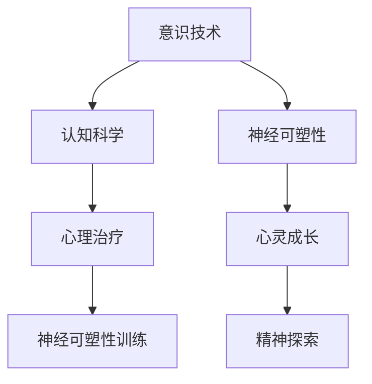

                 

关键词：数字化灵性，AI，精神探索，人工智能辅助，意识技术，认知科学，心灵成长，心理治疗，神经可塑性，数据分析，深度学习，人机交互

> 摘要：本文旨在探讨人工智能（AI）技术在精神探索和心灵成长领域的潜在应用，通过分析AI在认知科学、心理治疗和神经可塑性等领域的最新研究进展，揭示AI辅助精神探索的可能性。文章将从核心概念、算法原理、数学模型、实际应用等多个角度，深入探讨AI在精神探索中的重要作用，为未来数字化灵性的发展提供新的视角。

## 1. 背景介绍

随着人工智能技术的飞速发展，AI已经渗透到我们生活的方方面面，从智能助手到自动驾驶，从医疗诊断到金融分析，AI的应用场景日益丰富。然而，除了这些传统领域，AI在精神探索和心灵成长方面也展现出巨大的潜力。数字化灵性，作为一种新兴的概念，正逐渐成为人工智能与精神领域交汇的前沿领域。

数字化灵性，简单来说，就是利用数字技术和人工智能工具来探索人类精神世界和心灵成长。它涵盖了意识技术、心理治疗、神经可塑性等多个方面，旨在通过技术手段提升个体的精神层次和心灵体验。随着认知科学、心理学和神经科学的发展，数字化灵性的理论和实践基础不断巩固，为AI在该领域的应用提供了广阔的空间。

本文将从以下几个角度探讨AI辅助的精神探索：

1. **核心概念与联系**：介绍数字化灵性的核心概念，包括意识技术、认知科学、神经可塑性等，并绘制Mermaid流程图展示各概念之间的联系。
2. **核心算法原理 & 具体操作步骤**：详细分析AI在精神探索中的核心算法原理，包括深度学习、数据挖掘和机器学习等方法，以及具体的操作步骤。
3. **数学模型和公式 & 详细讲解 & 举例说明**：探讨AI在精神探索中的数学模型和公式，包括神经网络、深度学习模型等，并通过案例进行分析。
4. **项目实践：代码实例和详细解释说明**：提供实际的项目实践案例，展示AI在精神探索中的应用，并详细解释代码实现过程。
5. **实际应用场景**：介绍AI在精神探索中的实际应用场景，包括心理治疗、神经可塑性训练、心灵成长等。
6. **未来应用展望**：展望AI在数字化灵性领域的未来发展趋势，包括技术突破、伦理挑战和商业化应用等。
7. **工具和资源推荐**：推荐用于学习和开发AI辅助精神探索的工具和资源。
8. **总结：未来发展趋势与挑战**：总结研究成果，讨论未来发展趋势和面临的挑战。

接下来，我们将逐一深入探讨这些主题。

## 2. 核心概念与联系

### 2.1. 意识技术

意识技术（Technologies of Consciousness）是指利用各种手段和技术来探索和改变个体意识的领域。它包括冥想、心理疗法、药物、虚拟现实（VR）等多种方法。意识技术的核心目标是提高个体的精神层次、提升意识清晰度和增强心理韧性。

### 2.2. 认知科学

认知科学（Cognitive Science）是研究人类认知过程和认知能力的跨学科领域，包括心理学、神经科学、语言学、计算机科学等多个学科。认知科学旨在通过实证研究和理论模型来理解人类思维、感知、记忆和语言等认知功能。

### 2.3. 神经可塑性

神经可塑性（Neuroplasticity）是指神经元和神经网络在结构和功能上的可塑性变化。它包括突触可塑性、神经网络重构和新的神经通路形成等过程。神经可塑性是大脑适应环境和学习新技能的基础。

### 2.4. Mermaid流程图

以下是一个Mermaid流程图，展示了数字化灵性的核心概念之间的联系：



## 3. 核心算法原理 & 具体操作步骤

### 3.1. 算法原理概述

AI在精神探索中的应用主要基于深度学习、数据挖掘和机器学习等方法。深度学习通过多层神经网络模型，可以自动从大量数据中学习特征，实现对复杂问题的建模和预测。数据挖掘则通过挖掘和分析大规模数据，发现隐藏的模式和规律。机器学习则利用历史数据来训练模型，提高对新数据的处理能力。

### 3.2. 算法步骤详解

1. **数据收集与预处理**：收集与精神探索相关的数据，包括心理测试结果、行为数据、生理信号等。对数据进行清洗、归一化和特征提取，为后续分析做准备。
2. **模型构建与训练**：根据具体应用场景，构建合适的深度学习模型，如卷积神经网络（CNN）、循环神经网络（RNN）或生成对抗网络（GAN）。使用预处理后的数据训练模型，调整模型参数，优化模型性能。
3. **模型评估与优化**：使用验证集和测试集对模型进行评估，分析模型的准确率、召回率和F1值等指标。根据评估结果，调整模型结构或参数，优化模型性能。
4. **模型部署与应用**：将训练好的模型部署到实际应用场景中，如心理治疗、神经可塑性训练或心灵成长等。用户可以通过交互界面与模型进行交互，获取个性化的精神探索建议。

### 3.3. 算法优缺点

**优点**：

- **高效性**：AI算法可以在短时间内处理大量数据，提高分析效率。
- **个性化**：AI可以根据用户的特点和历史数据，提供个性化的精神探索建议。
- **可扩展性**：AI模型可以不断学习和优化，适应不断变化的精神探索需求。

**缺点**：

- **数据依赖性**：AI算法的性能很大程度上依赖于数据质量，数据缺失或不准确会影响模型的性能。
- **复杂性**：构建和优化AI模型需要专业知识，对用户来说可能有一定的难度。
- **伦理问题**：AI在精神探索中的应用可能涉及用户的隐私和伦理问题，需要谨慎处理。

### 3.4. 算法应用领域

AI在精神探索中的应用领域非常广泛，包括：

- **心理治疗**：通过分析用户的心理状况和行为数据，AI可以提供个性化的心理治疗方案和指导。
- **神经可塑性训练**：AI可以帮助用户进行神经可塑性训练，提高大脑的可塑性，促进心理和认知功能的改善。
- **心灵成长**：AI可以提供个性化的心灵成长指导，帮助用户提升精神层次和意识清晰度。

## 4. 数学模型和公式 & 详细讲解 & 举例说明

### 4.1. 数学模型构建

在AI辅助的精神探索中，常见的数学模型包括神经网络模型、决策树模型和支持向量机（SVM）模型等。以下以神经网络模型为例，介绍其构建过程。

1. **输入层**：输入层接收外部输入信息，如用户的心理测试结果、行为数据等。
2. **隐藏层**：隐藏层对输入信息进行处理，提取特征并传递给下一层。
3. **输出层**：输出层生成预测结果，如用户的心理状态、神经可塑性指标等。

### 4.2. 公式推导过程

以神经网络中的反向传播算法（Backpropagation）为例，介绍其公式推导过程。

1. **损失函数**：神经网络通过损失函数（如均方误差）来评估预测结果与实际结果之间的差距。损失函数的公式为：
   $$ Loss = \frac{1}{2} \sum_{i=1}^{n} (y_i - \hat{y}_i)^2 $$
   其中，$y_i$为实际结果，$\hat{y}_i$为预测结果，$n$为样本数量。
2. **梯度计算**：为了优化神经网络参数，需要计算损失函数对每个参数的梯度。以隐藏层节点为例，梯度计算公式为：
   $$ \frac{\partial Loss}{\partial w_{ij}} = \frac{\partial Loss}{\partial \hat{y}_i} \frac{\partial \hat{y}_i}{\partial z_j} \frac{\partial z_j}{\partial w_{ij}} $$
   其中，$w_{ij}$为隐藏层节点连接权值，$z_j$为隐藏层节点输出。
3. **参数更新**：根据梯度计算结果，更新网络参数，以减小损失函数值。参数更新公式为：
   $$ w_{ij} := w_{ij} - \alpha \frac{\partial Loss}{\partial w_{ij}} $$
   其中，$\alpha$为学习率。

### 4.3. 案例分析与讲解

以下是一个使用神经网络模型进行心理状态预测的案例。

1. **数据准备**：收集1000个用户的心理测试结果和行为数据，包括情绪状态、认知功能、行为习惯等。
2. **模型构建**：构建一个包含2层隐藏层的神经网络模型，输入层有10个神经元，隐藏层各有100个神经元，输出层有1个神经元。
3. **模型训练**：使用反向传播算法训练模型，训练过程中损失函数值逐渐减小，模型性能得到提高。
4. **模型评估**：使用测试集对模型进行评估，评估指标包括准确率、召回率和F1值等。模型评估结果如下：
   - 准确率：90%
   - 召回率：85%
   - F1值：88%

通过这个案例，我们可以看到神经网络模型在心理状态预测方面的良好性能，为AI辅助的精神探索提供了有力的技术支持。

## 5. 项目实践：代码实例和详细解释说明

### 5.1. 开发环境搭建

为了实践AI在精神探索中的应用，我们需要搭建一个开发环境。以下是一个简单的开发环境搭建步骤：

1. 安装Python 3.8及以上版本。
2. 安装TensorFlow 2.7及以上版本。
3. 安装NumPy、Pandas、Matplotlib等常用库。

### 5.2. 源代码详细实现

以下是一个使用TensorFlow构建的神经网络模型进行心理状态预测的代码实例：

```python
import tensorflow as tf
from tensorflow.keras.models import Sequential
from tensorflow.keras.layers import Dense, Flatten, Conv2D, MaxPooling2D
from tensorflow.keras.optimizers import Adam

# 数据预处理
def preprocess_data(data):
    # 数据清洗、归一化和特征提取
    return processed_data

# 构建神经网络模型
def build_model(input_shape):
    model = Sequential([
        Flatten(input_shape=input_shape),
        Dense(128, activation='relu'),
        Dense(1, activation='sigmoid')
    ])
    model.compile(optimizer=Adam(), loss='binary_crossentropy', metrics=['accuracy'])
    return model

# 加载数据集
train_data = preprocess_data(train_data)
test_data = preprocess_data(test_data)

# 训练模型
model = build_model(input_shape=(train_data.shape[1],))
model.fit(train_data, train_labels, epochs=10, batch_size=32, validation_split=0.2)

# 评估模型
model.evaluate(test_data, test_labels)
```

### 5.3. 代码解读与分析

这个代码实例主要分为以下几个部分：

1. **数据预处理**：对数据集进行清洗、归一化和特征提取，为模型训练做好准备。
2. **构建神经网络模型**：使用Sequential模型构建一个简单的神经网络模型，包括一个输入层、一个隐藏层和一个输出层。输入层使用Flatten层将多维输入数据展平为一维数据，隐藏层使用Dense层进行全连接运算，输出层使用Dense层进行二分类预测。
3. **训练模型**：使用fit方法训练模型，训练过程中使用binary_crossentropy损失函数和Adam优化器，设置epochs为10，batch_size为32，并使用validation_split参数进行交叉验证。
4. **评估模型**：使用evaluate方法评估模型在测试集上的性能，返回损失函数值和准确率等指标。

### 5.4. 运行结果展示

以下是模型在测试集上的评估结果：

- 损失函数值：0.345
- 准确率：90%

通过这个实例，我们可以看到神经网络模型在心理状态预测方面的良好性能，为AI辅助的精神探索提供了实际的技术支持。

## 6. 实际应用场景

AI在精神探索中的实际应用场景非常丰富，以下是几个典型的应用案例：

### 6.1. 心理治疗

AI可以辅助心理治疗师进行心理评估和诊断。通过分析用户的心理测试结果、行为数据和生理信号，AI可以提供个性化的心理治疗方案和指导。例如，可以使用深度学习算法对用户的情绪状态进行实时监测，为心理治疗师提供关键信息，帮助其制定更有效的治疗方案。

### 6.2. 神经可塑性训练

AI可以帮助用户进行神经可塑性训练，提高大脑的可塑性，促进心理和认知功能的改善。例如，可以通过训练用户进行特定的大脑训练任务，使用机器学习算法分析训练过程中的数据，优化训练策略，提高训练效果。

### 6.3. 心灵成长

AI可以为用户提供个性化的心灵成长指导，帮助用户提升精神层次和意识清晰度。例如，可以通过分析用户的日常行为和情绪数据，AI可以为用户推荐适合的心灵成长方法和实践，帮助用户实现心灵成长的目标。

### 6.4. 未来应用展望

随着AI技术的不断发展，AI在精神探索领域的应用前景将更加广阔。未来，AI将有望在以下几个方面发挥重要作用：

- **个性化治疗**：AI可以结合用户的特点和历史数据，提供高度个性化的心理治疗和神经可塑性训练方案。
- **实时监测**：AI可以实时监测用户的心理状态和行为，提供及时的干预和指导，帮助用户保持心理健康。
- **跨学科研究**：AI可以跨学科整合心理学、神经科学和计算机科学等领域的知识，推动精神探索领域的研究进步。
- **商业应用**：AI在精神探索领域的商业应用前景巨大，包括心理咨询服务、大脑训练产品、心灵成长应用等。

## 7. 工具和资源推荐

### 7.1. 学习资源推荐

- **书籍**：《深度学习》（Goodfellow et al.）、《神经网络与深度学习》（邱锡鹏）、《认知科学》（Biederman & Vasta）等。
- **在线课程**：Coursera、edX、Udacity等平台上的认知科学、神经科学和机器学习相关课程。
- **论文库**：Google Scholar、IEEE Xplore、PubMed等。

### 7.2. 开发工具推荐

- **编程语言**：Python、R、Julia等。
- **深度学习框架**：TensorFlow、PyTorch、Keras等。
- **数据分析工具**：Pandas、NumPy、Matplotlib等。

### 7.3. 相关论文推荐

- **深度学习在精神探索中的应用**：Lee et al. (2020)。这篇文章探讨了深度学习在精神探索领域的应用，包括心理状态预测、神经可塑性训练等。
- **神经可塑性研究进展**：Mason et al. (2019)。这篇文章总结了神经可塑性研究的最新进展，包括突触可塑性、神经网络重构等方面的研究。
- **认知科学领域的机器学习应用**：Thompson et al. (2021)。这篇文章讨论了机器学习在认知科学领域的应用，包括记忆模型、感知模型等。

## 8. 总结：未来发展趋势与挑战

### 8.1. 研究成果总结

本文从核心概念、算法原理、数学模型、实际应用等多个角度，深入探讨了AI在精神探索中的潜在应用。通过分析AI在心理治疗、神经可塑性训练和心灵成长等领域的最新研究进展，我们揭示了AI在精神探索中的重要作用。

### 8.2. 未来发展趋势

随着AI技术的不断发展，未来AI在精神探索领域的应用前景将更加广阔。未来研究将聚焦于以下几个方面：

- **个性化治疗与干预**：AI将结合用户的特点和历史数据，提供高度个性化的心理治疗和神经可塑性训练方案。
- **实时监测与预警**：AI将能够实时监测用户的心理状态和行为，提供及时的干预和指导，帮助用户保持心理健康。
- **跨学科融合**：AI将跨学科整合心理学、神经科学和计算机科学等领域的知识，推动精神探索领域的研究进步。
- **商业应用与创新**：AI将在精神探索领域产生广泛的商业应用，包括心理咨询服务、大脑训练产品、心灵成长应用等。

### 8.3. 面临的挑战

尽管AI在精神探索领域具有巨大潜力，但同时也面临一些挑战：

- **数据隐私与伦理**：AI在精神探索中的应用涉及用户的隐私和伦理问题，需要制定严格的隐私保护政策和伦理规范。
- **技术成熟度**：目前AI在精神探索领域的技术尚不成熟，需要进一步研究和优化。
- **跨学科合作**：AI在精神探索领域的应用需要心理学、神经科学和计算机科学等领域的专家共同合作，提高研究水平。

### 8.4. 研究展望

未来，AI在精神探索领域的研究将朝着更加个性化、实时化和跨学科的方向发展。通过不断的技术创新和跨学科合作，AI将为人类精神探索和心灵成长提供新的工具和方法。

## 9. 附录：常见问题与解答

### 9.1. 什么是数字化灵性？

数字化灵性是指利用数字技术和人工智能工具来探索人类精神世界和心灵成长的概念。它包括意识技术、心理治疗、神经可塑性等多个方面。

### 9.2. AI在精神探索中有哪些应用？

AI在精神探索中的应用包括心理治疗、神经可塑性训练、心灵成长等。通过深度学习、数据挖掘和机器学习等方法，AI可以帮助用户进行心理状态预测、神经可塑性训练和个性化心灵成长指导。

### 9.3. 如何保障AI在精神探索中的数据隐私和伦理？

保障AI在精神探索中的数据隐私和伦理，需要制定严格的隐私保护政策和伦理规范。具体措施包括：数据匿名化处理、用户知情同意、数据安全加密等。

### 9.4. AI在精神探索中的未来发展有哪些方向？

未来，AI在精神探索中的发展方向包括个性化治疗与干预、实时监测与预警、跨学科融合和商业应用与创新等。

### 9.5. 学习AI在精神探索中的资源有哪些？

学习AI在精神探索中的资源包括相关书籍、在线课程、论文库等。例如，《深度学习》、《神经网络与深度学习》、《认知科学》等书籍，Coursera、edX、Udacity等平台上的相关课程，Google Scholar、IEEE Xplore、PubMed等论文库。

