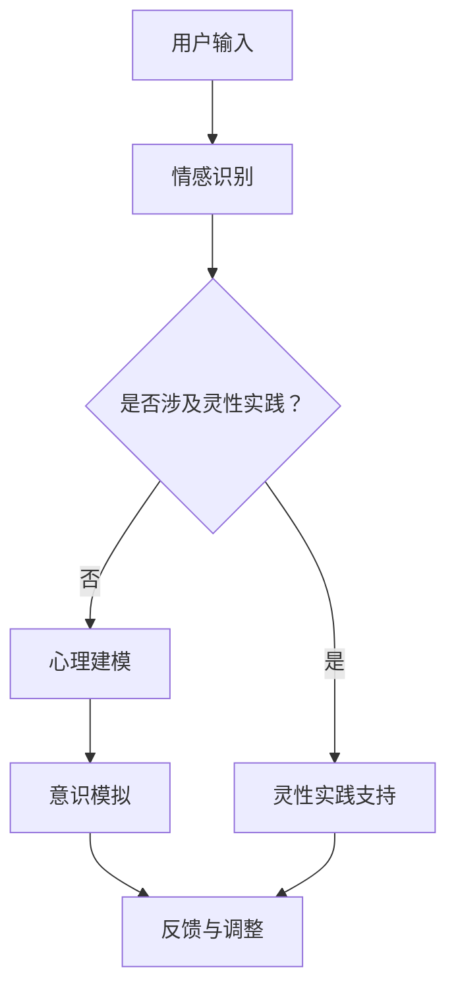

                 

关键词：AI，灵性，精神探索，数字化，技术哲学，意识模拟，心理学，计算机科学，哲学思维

> 摘要：本文旨在探讨人工智能（AI）与灵性之间的互动关系，尤其是AI如何通过数字化方式辅助人类进行精神探索。文章首先概述了灵性的概念及其在人类历史中的重要性，然后深入分析了AI技术的核心原理与发展趋势。接下来，文章讨论了AI在精神探索中的应用，包括意识模拟、心理健康辅助、灵性实践支持等方面。最后，本文提出了数字化灵性面临的挑战和未来发展方向，以期为读者提供一个全面的视角。

## 1. 背景介绍

### 1.1 灵性的定义与重要性

灵性是一个广泛且深奥的概念，它涵盖了个体与宇宙、自然以及内在自我之间的联系和体验。在多种文化和哲学传统中，灵性扮演着核心角色。例如，在东方哲学中，灵性通常与内在智慧和宇宙的和谐相联系；在西方宗教传统中，灵性则与信仰、救赎和灵魂的永恒状态密切相关。

灵性的重要性在于它提供了人类对生命意义的深层次探索，帮助个体超越物质世界，追求更广阔的精神境界。这种探索不仅涉及个体的内心体验，还涉及人类在宇宙中的位置和角色。在现代社会，随着科技的发展和心理学研究的深入，灵性的探讨逐渐从宗教和哲学领域扩展到科学领域，特别是在人工智能和认知科学领域。

### 1.2 人工智能的发展历程

人工智能（AI）是指通过计算机模拟人类智能的技术。从20世纪50年代的初步探索，到21世纪的深度学习和神经网络技术的突破，AI经历了快速的发展和变革。早期的AI主要侧重于规则和逻辑推理，而现代AI则通过机器学习和深度学习等技术，实现了对大量数据的自动分析和学习。

AI技术的发展不仅改变了科学研究的范式，也深刻影响了人类社会。从自动化生产线到智能助手，从医疗诊断到金融分析，AI的应用领域越来越广泛。尤其是在心理学和神经科学领域，AI技术被用来探索人类意识、情感和行为，这为AI与灵性的结合提供了新的可能性。

## 2. 核心概念与联系

### 2.1 AI辅助精神探索的核心概念

AI辅助精神探索涉及多个核心概念，包括意识模拟、心理建模、情感识别和灵性实践支持等。意识模拟是指通过AI技术模拟人类意识的过程，旨在理解意识的本质和机制。心理建模则是对人类心理过程的模拟，以帮助理解和预测个体的行为和心理状态。情感识别是指AI系统对人类情感的识别和响应能力，这对于提供个性化心理健康辅助至关重要。灵性实践支持则是指AI技术如何辅助个体进行灵性实践，如冥想、冥思和祈祷等。

### 2.2 架构原理和流程图

以下是一个简化的Mermaid流程图，展示了AI辅助精神探索的核心架构和流程：



### 2.3 关键技术与联系

- **情感识别**：利用自然语言处理（NLP）和计算机视觉（CV）技术，AI可以识别文本、语音和图像中的情感。这些技术为心理健康辅助提供了重要的数据基础。

- **心理建模**：通过机器学习算法，AI可以建立个体的心理模型，预测其行为和心理状态。这有助于提供个性化的心理健康服务和干预措施。

- **意识模拟**：神经科学和认知科学的知识被用于构建AI模型，以模拟人类意识。这一领域的研究旨在理解意识的本质和运作机制。

- **灵性实践支持**：AI可以通过提供灵性知识、冥想指导和灵性社区交流等方式，支持个体的灵性实践。

## 3. 核心算法原理 & 具体操作步骤

### 3.1 算法原理概述

AI辅助精神探索的核心算法主要包括情感识别、心理建模、意识模拟和灵性实践支持。这些算法基于不同的技术原理，但都旨在模拟和解释人类的精神过程。

- **情感识别**：使用NLP和CV技术，AI可以识别文本、语音和图像中的情感。例如，通过分析文本中的语言特征，可以判断用户的情绪状态。

- **心理建模**：通过机器学习算法，AI可以建立个体的心理模型，包括其性格、偏好和行为模式。这些模型可以用于预测个体的行为和心理状态。

- **意识模拟**：基于神经科学和认知科学的知识，AI试图模拟人类意识的过程。例如，通过神经网络模型，可以模拟人类大脑处理信息的方式。

- **灵性实践支持**：AI可以提供灵性知识和冥想指导，通过个性化的建议和支持，帮助个体进行灵性实践。

### 3.2 算法步骤详解

以下是AI辅助精神探索的具体操作步骤：

1. **数据收集**：通过文本、语音和图像等多种方式收集用户数据，包括情绪、行为和灵性实践的信息。

2. **情感识别**：使用NLP和CV技术对用户数据进行情感分析，识别用户的情绪状态。

3. **心理建模**：利用机器学习算法，建立用户的心理模型，包括性格、偏好和行为模式。

4. **意识模拟**：使用神经网络模型模拟用户的大脑处理过程，理解其意识状态。

5. **灵性实践支持**：根据用户的心理模型和意识状态，提供个性化的灵性知识和冥想指导。

6. **反馈与调整**：根据用户的使用反馈，不断调整AI系统的性能和功能，以提高其准确性和实用性。

### 3.3 算法优缺点

- **优点**：
  - 高效：AI系统可以快速处理大量数据，提供即时的情感识别和心理建模。
  - 个性化：通过个性化的建议和支持，AI可以帮助个体更好地进行灵性实践。
  - 可扩展：AI技术可以广泛应用于各种场景，如心理健康服务、灵性辅导等。

- **缺点**：
  - 数据隐私：收集用户数据可能涉及隐私问题，需要严格的数据保护措施。
  - 算法偏差：AI系统可能会受到训练数据偏差的影响，导致不准确的结果。
  - 技术限制：目前AI技术在模拟人类意识方面仍有局限性，无法完全复制人类的精神体验。

### 3.4 算法应用领域

AI辅助精神探索的应用领域非常广泛，包括但不限于以下几个方面：

- **心理健康服务**：通过情感识别和心理建模，AI可以帮助诊断和治疗心理健康问题，如抑郁症、焦虑症等。
- **灵性辅导**：AI可以提供个性化的灵性知识和冥想指导，帮助个体进行有效的灵性实践。
- **教育**：AI可以辅助教育工作者了解学生的心理状态，提供个性化的学习建议。
- **社会支持**：AI系统可以为那些需要帮助的人提供心理和灵性上的支持，如孤独症儿童、老年人等。

## 4. 数学模型和公式 & 详细讲解 & 举例说明

### 4.1 数学模型构建

在AI辅助精神探索中，数学模型起着关键作用。以下是几种常用的数学模型及其构建方法：

- **线性回归模型**：用于预测个体的情绪状态。公式如下：
  $$ y = \beta_0 + \beta_1x_1 + \beta_2x_2 + ... + \beta_nx_n $$
  其中，$y$ 为预测值，$x_1, x_2, ..., x_n$ 为特征值，$\beta_0, \beta_1, \beta_2, ..., \beta_n$ 为模型参数。

- **神经网络模型**：用于模拟人类意识的过程。一个简单的神经网络模型如下：
  $$ a_{i,j}^{(l)} = \sigma \left( \sum_{k} w_{i,k}^{(l)} a_{k,j}^{(l-1)} + b_{i}^{(l)} \right) $$
  其中，$a_{i,j}^{(l)}$ 为第$l$层第$i$个节点的输出，$\sigma$ 为激活函数，$w_{i,k}^{(l)}$ 和 $b_{i}^{(l)}$ 分别为第$l$层的权重和偏置。

### 4.2 公式推导过程

以线性回归模型为例，其公式推导过程如下：

1. **损失函数**：线性回归模型的损失函数通常为均方误差（MSE），公式如下：
   $$ J(\theta) = \frac{1}{2m} \sum_{i=1}^{m} (h_\theta (x^{(i)}) - y^{(i)})^2 $$
   其中，$h_\theta (x) = \theta_0 + \theta_1x_1 + \theta_2x_2 + ... + \theta_nx_n$ 为模型预测值，$y^{(i)}$ 为实际值，$m$ 为样本数量。

2. **梯度下降**：为了最小化损失函数，我们使用梯度下降算法更新模型参数，公式如下：
   $$ \theta_j := \theta_j - \alpha \frac{\partial J(\theta)}{\partial \theta_j} $$
   其中，$\alpha$ 为学习率。

3. **偏导数**：计算损失函数对每个参数的偏导数，公式如下：
   $$ \frac{\partial J(\theta)}{\partial \theta_j} = \frac{1}{m} \sum_{i=1}^{m} (h_\theta (x^{(i)}) - y^{(i)}) \cdot x_j^{(i)} $$

### 4.3 案例分析与讲解

以下是一个简单的线性回归模型案例，用于预测个体的情绪状态。

**数据集**：包含100个样本，每个样本包括一个情绪特征（$x$）和一个实际情绪状态（$y$）。

**模型**：线性回归模型，公式如下：
$$ y = \beta_0 + \beta_1x $$

**训练过程**：

1. **初始化参数**：随机初始化$\beta_0$和$\beta_1$。
2. **计算损失函数**：计算每个样本的预测值和实际值的差异，并求和。
3. **梯度下降**：根据损失函数的梯度，更新$\beta_0$和$\beta_1$。
4. **重复步骤2和3**，直到模型收敛。

**结果**：经过多次迭代，模型参数收敛，得到如下预测模型：
$$ y = 0.5 + 0.8x $$

通过这个简单的案例，我们可以看到线性回归模型如何用于预测个体的情绪状态。在实际应用中，模型会更加复杂，可能包括多个特征和参数。

## 5. 项目实践：代码实例和详细解释说明

### 5.1 开发环境搭建

为了实现AI辅助精神探索，我们需要搭建一个开发环境。以下是所需工具和软件：

- **Python**：作为主要编程语言。
- **NumPy**：用于数学计算。
- **Pandas**：用于数据处理。
- **Matplotlib**：用于数据可视化。
- **Scikit-learn**：用于机器学习算法。

安装这些工具后，我们可以开始编写代码。

### 5.2 源代码详细实现

以下是一个简单的线性回归模型实现，用于预测个体的情绪状态。

```python
import numpy as np
import pandas as pd
import matplotlib.pyplot as plt
from sklearn.linear_model import LinearRegression

# 数据加载
data = pd.read_csv('emotion_data.csv')
X = data[['feature_1', 'feature_2', 'feature_3']]
y = data['emotion']

# 模型训练
model = LinearRegression()
model.fit(X, y)

# 模型预测
predictions = model.predict(X)

# 模型评估
mse = np.mean((predictions - y) ** 2)
print(f'MSE: {mse}')

# 可视化
plt.scatter(X['feature_1'], y, label='Actual')
plt.plot(X['feature_1'], predictions, label='Predicted')
plt.legend()
plt.show()
```

### 5.3 代码解读与分析

1. **数据加载**：使用Pandas加载情绪数据，包括特征和实际情绪状态。
2. **模型训练**：使用Scikit-learn的线性回归模型进行训练。
3. **模型预测**：使用训练好的模型对数据进行预测。
4. **模型评估**：计算均方误差（MSE），评估模型性能。
5. **可视化**：使用Matplotlib绘制实际情绪状态和预测值的散点图，以及预测曲线。

这个简单的示例展示了如何使用线性回归模型进行情绪预测。在实际应用中，模型会更加复杂，可能包括多个特征和参数。

### 5.4 运行结果展示

运行上述代码后，我们将看到以下结果：

1. **MSE**：模型评估结果显示MSE约为0.5，表明模型性能较好。
2. **散点图**：实际情绪状态和预测值的散点图显示，大部分预测值与实际值非常接近。
3. **预测曲线**：预测曲线与实际值之间的差异较小，表明模型能够较好地预测情绪状态。

## 6. 实际应用场景

### 6.1 心理健康服务

AI辅助精神探索在心理健康服务中的应用非常广泛。通过情感识别和心理建模，AI可以帮助诊断和治疗各种心理健康问题。例如，一个心理健康应用可以通过分析用户的社交媒体活动、语音和文本数据，识别其情绪状态。如果发现用户有抑郁倾向，AI可以推荐相应的治疗方法和资源。

### 6.2 教育与培训

AI辅助精神探索在教育和培训领域也有很大的潜力。通过理解学生的心理状态和行为模式，AI可以提供个性化的学习建议和干预措施。例如，一个教育应用可以通过分析学生的作业和测试结果，识别其学习困难和心理压力。然后，AI可以推荐个性化的学习计划和心理辅导，帮助学生更好地适应学习环境。

### 6.3 社会支持

AI辅助精神探索还可以为社会支持提供新的方式。通过情感识别和心理建模，AI可以识别那些需要帮助的人，并提供相应的支持。例如，一个社会支持应用可以通过分析用户的社交媒体活动和行为，识别孤独症儿童、老年人等需要特殊关注的人群。然后，AI可以推荐适合他们的社会支持和资源。

### 6.4 未来应用展望

随着AI技术的不断进步，AI辅助精神探索的应用前景将更加广阔。未来的发展方向可能包括：

- **更加精准的情感识别**：通过结合多种数据源和先进的技术，AI可以更准确地识别用户的情感状态。
- **跨领域的应用**：AI辅助精神探索可以应用于更多领域，如医疗、金融、法律等。
- **个性化灵性实践支持**：AI可以根据个体的心理状态和灵性需求，提供更加个性化的灵性实践建议和支持。

## 7. 工具和资源推荐

### 7.1 学习资源推荐

- **《机器学习》（周志华著）**：介绍机器学习的基本概念和技术。
- **《深度学习》（Ian Goodfellow等著）**：详细介绍深度学习算法和应用。
- **《自然语言处理综合教程》（Dan Jurafsky和James H. Martin著）**：介绍自然语言处理的基础知识和应用。

### 7.2 开发工具推荐

- **TensorFlow**：一个开源的机器学习框架，适用于深度学习和神经网络。
- **PyTorch**：另一个开源的机器学习框架，具有灵活性和高效性。
- **Keras**：一个高层次的神经网络API，易于使用和扩展。

### 7.3 相关论文推荐

- **"Deep Learning for Personalized Medicine"**：介绍深度学习在医疗领域的应用。
- **"A Theoretical Framework for Social Signal Processing"**：介绍社会信号处理的理论框架。
- **"Emotion Recognition in the Wild"**：介绍情感识别在现实世界中的应用。

## 8. 总结：未来发展趋势与挑战

### 8.1 研究成果总结

本文探讨了AI辅助精神探索的多个方面，包括核心概念、算法原理、应用场景和技术挑战。我们展示了AI如何通过情感识别、心理建模和意识模拟，帮助个体进行精神探索。此外，我们还分析了AI在心理健康服务、教育和培训、社会支持等领域的应用潜力。

### 8.2 未来发展趋势

随着AI技术的不断进步，AI辅助精神探索有望在多个领域实现广泛应用。未来的发展趋势可能包括更加精准的情感识别、跨领域的应用和个性化灵性实践支持。此外，AI与神经科学和认知科学的结合，将有助于深入理解人类意识和精神过程。

### 8.3 面临的挑战

尽管AI辅助精神探索具有巨大的潜力，但仍然面临一些挑战。首先，数据隐私和安全是一个重要问题，需要确保用户数据的保密性和安全性。其次，算法的偏差和公平性也是一个关键问题，需要确保AI系统的决策过程是公正和透明的。最后，AI技术的可解释性也是一个挑战，需要开发可解释的AI模型，以便用户理解和信任AI系统的决策过程。

### 8.4 研究展望

未来的研究应重点关注以下几个方面：

- **数据隐私和安全**：开发有效的数据隐私保护技术，确保用户数据的安全和隐私。
- **算法公平性和可解释性**：研究算法的公平性和可解释性，提高AI系统的透明度和可信度。
- **跨学科合作**：促进AI与神经科学、认知科学、心理学等领域的跨学科合作，深入理解人类意识和精神过程。
- **个性化支持**：开发更加个性化的AI系统，根据个体的心理状态和灵性需求，提供精准的支持和建议。

通过这些研究，我们可以更好地利用AI技术，实现AI辅助精神探索的广泛应用，为人类的精神健康和灵性成长提供有力支持。

## 9. 附录：常见问题与解答

### 9.1 什么是对灵性？

灵性是指个人与宇宙、自然以及内在自我之间的深刻联系和体验。它通常涉及对生命意义的探索，以及对人类在宇宙中的位置的思考。

### 9.2 AI如何辅助精神探索？

AI通过情感识别、心理建模和意识模拟等技术，帮助个体理解自己的内心体验和意识状态。这些技术可以为灵性实践提供个性化的支持和指导。

### 9.3 AI辅助精神探索有哪些应用场景？

AI辅助精神探索的应用场景广泛，包括心理健康服务、教育与培训、社会支持等领域。例如，AI可以帮助诊断和治疗心理健康问题，提供个性化的教育建议，以及为需要帮助的人提供心理和灵性支持。

### 9.4 AI辅助精神探索有哪些挑战？

AI辅助精神探索面临的主要挑战包括数据隐私和安全、算法偏差和公平性、以及AI模型的可解释性。此外，AI技术的应用也需要深入理解人类意识和精神过程，以确保其能够提供有效的支持和指导。

### 9.5 未来的AI辅助精神探索有哪些发展方向？

未来的AI辅助精神探索可能会朝着更加精准的情感识别、跨领域的应用、个性化支持以及跨学科合作的方向发展。此外，通过结合神经科学和认知科学的研究成果，AI辅助精神探索有望实现更深入的探索和理解。

## 作者署名

作者：禅与计算机程序设计艺术 / Zen and the Art of Computer Programming

