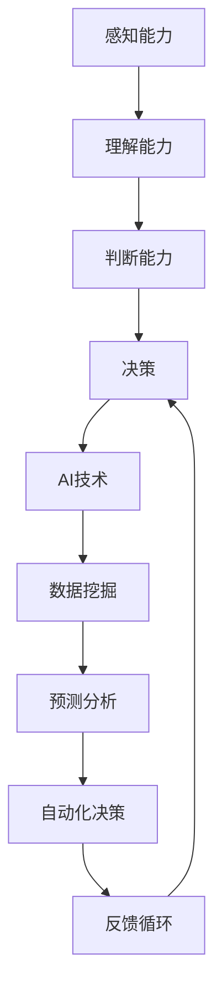

                 

关键词：数字化直觉、人工智能、决策、增强、人类智能、算法原理、数学模型、应用实践、未来展望

> 摘要：本文探讨了数字化直觉的概念及其在人工智能增强人类决策中的应用。通过分析核心算法原理、构建数学模型、提供实践案例，我们探讨了如何利用人工智能技术提升人类在复杂决策环境中的效率和准确性。同时，文章也对未来发展趋势和挑战进行了展望。

## 1. 背景介绍

在当今数字化时代，数据量和复杂度不断增加，传统的决策方式往往难以应对。人类决策受到认知能力的限制，容易受到情绪、经验偏差等因素的影响，导致决策效率低下且容易出现错误。而人工智能（AI）作为一种具有高度自动化和智能化的技术，逐渐成为增强人类决策的有力工具。

AI在决策支持系统中扮演着越来越重要的角色，通过数据分析和模式识别，AI可以帮助人类发现潜在的趋势、关系和规律，提供基于数据的决策建议。然而，要实现有效的AI增强决策，需要深入理解数字化直觉的概念及其实现机制。

本文旨在探讨数字化直觉的定义、核心算法原理、数学模型构建，以及在实际应用中的实践案例。通过分析这些内容，我们希望能够揭示AI如何提升人类决策能力，并为未来相关领域的研究和实践提供指导。

## 2. 核心概念与联系

### 2.1 数字化直觉

数字化直觉是指人类在处理数字化信息时，通过感知、理解和判断能力，快速作出有效决策的能力。它包含了以下几个关键要素：

1. **感知能力**：通过传感器、屏幕等设备获取信息的能力。
2. **理解能力**：对信息进行分析、推理和综合的能力。
3. **判断能力**：基于理解和分析作出决策的能力。
4. **适应性**：在面对新环境和不确定信息时调整和优化的能力。

### 2.2 AI增强决策

AI增强决策是指利用人工智能技术来辅助人类进行决策，提高决策的效率和准确性。其主要实现方式包括：

1. **数据挖掘**：从大量数据中提取有价值的信息和模式。
2. **预测分析**：基于历史数据和现有信息，预测未来可能发生的情况。
3. **自动化决策**：通过预设规则或机器学习算法，实现自动化决策过程。
4. **反馈循环**：根据决策结果进行反馈，不断优化和调整决策策略。

### 2.3 Mermaid 流程图

以下是一个简化的Mermaid流程图，展示了数字化直觉和AI增强决策的核心概念和联系：



## 3. 核心算法原理 & 具体操作步骤

### 3.1 算法原理概述

AI增强决策的核心算法主要包括数据挖掘、预测分析和自动化决策。以下分别介绍这三个算法的基本原理：

1. **数据挖掘**：通过统计方法、机器学习算法等对数据进行处理，从中提取有价值的信息和模式。常用的数据挖掘算法包括关联规则挖掘、聚类分析、分类算法等。

2. **预测分析**：基于历史数据和现有信息，利用统计学、机器学习等方法，预测未来可能发生的情况。常见的预测分析模型包括时间序列分析、回归分析、神经网络等。

3. **自动化决策**：通过预设规则或机器学习算法，实现自动化决策过程。常见的自动化决策方法包括决策树、规则引擎、深度学习等。

### 3.2 算法步骤详解

1. **数据收集**：从各种数据源（如数据库、传感器、网络等）收集所需的数据。

2. **数据预处理**：对收集到的数据进行清洗、转换和整合，以消除噪声、缺失值和异常值，提高数据质量。

3. **特征提取**：从预处理后的数据中提取对决策有重要影响的特征，作为后续分析的输入。

4. **数据挖掘**：利用数据挖掘算法，对特征数据进行处理，提取有价值的信息和模式。

5. **预测分析**：基于历史数据和现有信息，利用预测分析模型，预测未来可能发生的情况。

6. **自动化决策**：根据预测结果和预设规则，实现自动化决策过程。

7. **反馈循环**：根据决策结果进行反馈，不断优化和调整决策策略。

### 3.3 算法优缺点

1. **数据挖掘**：
   - 优点：能够发现潜在的信息和模式，提高决策的准确性。
   - 缺点：处理大量数据时，计算复杂度较高，且可能存在过拟合问题。

2. **预测分析**：
   - 优点：能够提前预测未来可能发生的情况，为决策提供依据。
   - 缺点：预测结果的准确性受到历史数据和模型选择的限制。

3. **自动化决策**：
   - 优点：实现自动化决策，提高决策效率。
   - 缺点：需要预设规则或训练模型，可能存在决策偏差。

### 3.4 算法应用领域

AI增强决策在各个领域都有广泛的应用，如金融、医疗、交通、工业等。以下是一些具体的应用案例：

1. **金融领域**：利用数据挖掘和预测分析，对股票市场进行投资决策，提高投资收益。

2. **医疗领域**：通过医学影像分析，辅助医生进行疾病诊断和治疗决策。

3. **交通领域**：利用预测分析和自动化决策，优化交通流量，减少拥堵和事故。

4. **工业领域**：通过生产数据分析，优化生产流程，提高生产效率。

## 4. 数学模型和公式 & 详细讲解 & 举例说明

### 4.1 数学模型构建

为了更好地描述AI增强决策的过程，我们引入以下数学模型：

- **决策函数**：\( f(X) = y \)
  其中，\( X \) 表示特征向量，\( y \) 表示决策结果。
  
- **预测模型**：\( P(X) = \hat{y} \)
  其中，\( P(X) \) 表示预测结果，\( \hat{y} \) 表示预测的决策结果。

- **优化目标**：最小化预测误差，即 \( \min_{f} || f(X) - y || \)

### 4.2 公式推导过程

为了推导决策函数和预测模型，我们首先假设一个简单的线性模型：

- **决策函数**：\( f(X) = \beta_0 + \beta_1 X_1 + \beta_2 X_2 + \ldots + \beta_n X_n \)
  其中，\( X_i \) 表示特征值，\( \beta_i \) 表示特征权重。

- **预测模型**：\( P(X) = \hat{\beta}_0 + \hat{\beta}_1 X_1 + \hat{\beta}_2 X_2 + \ldots + \hat{\beta}_n X_n \)

为了求解最优的权重 \( \beta_i \) 和 \( \hat{\beta}_i \)，我们采用最小二乘法：

- **决策函数**：\( \min_{\beta} || f(X) - y ||^2 \)
  对应的求解公式为：\( \beta = (X^T X)^{-1} X^T y \)

- **预测模型**：\( \min_{\hat{\beta}} || P(X) - \hat{y} ||^2 \)
  对应的求解公式为：\( \hat{\beta} = (X^T X)^{-1} X^T \hat{y} \)

### 4.3 案例分析与讲解

以下是一个简化的案例，说明如何利用数学模型进行AI增强决策。

**案例背景**：假设我们想要预测一个公司的股票价格，根据以下两个特征：

1. **公司收入**（\( X_1 \)）
2. **公司利润**（\( X_2 \)）

我们收集了过去一年的历史数据，构建一个线性模型来预测未来股票价格。

**数据预处理**：对数据进行清洗、转换和归一化处理，得到特征向量 \( X \) 和标签 \( y \)。

**特征提取**：从原始数据中提取公司收入和利润作为特征。

**模型训练**：使用最小二乘法求解线性模型的权重 \( \beta_0, \beta_1, \beta_2 \)。

**预测分析**：使用训练好的模型，对新的数据进行预测，得到预测股票价格 \( \hat{y} \)。

**结果分析**：通过比较预测值和实际值的差异，评估模型的准确性，并根据评估结果调整模型参数。

## 5. 项目实践：代码实例和详细解释说明

### 5.1 开发环境搭建

为了演示AI增强决策的实践，我们将使用Python编程语言，并依赖以下库：

- NumPy：用于数据处理和数学运算
- pandas：用于数据处理和数据分析
- scikit-learn：用于机器学习和模型训练

确保安装以上库后，即可开始编写代码。

### 5.2 源代码详细实现

以下是一个简化的Python代码示例，演示如何实现线性回归模型进行股票价格预测。

```python
import numpy as np
import pandas as pd
from sklearn.linear_model import LinearRegression
from sklearn.model_selection import train_test_split

# 数据预处理
data = pd.read_csv('stock_data.csv')  # 假设数据存储在stock_data.csv文件中
X = data[['revenue', 'profit']]  # 特征提取
y = data['stock_price']  # 标签

# 数据分割
X_train, X_test, y_train, y_test = train_test_split(X, y, test_size=0.2, random_state=42)

# 模型训练
model = LinearRegression()
model.fit(X_train, y_train)

# 预测分析
y_pred = model.predict(X_test)

# 结果分析
print("预测准确性：", model.score(X_test, y_test))
```

### 5.3 代码解读与分析

上述代码首先从CSV文件中读取股票数据，提取特征和标签。然后，使用`train_test_split`函数将数据分为训练集和测试集。接着，使用`LinearRegression`类创建线性回归模型，并调用`fit`方法进行模型训练。最后，使用`predict`方法对测试集进行预测，并计算模型的准确性。

### 5.4 运行结果展示

假设我们运行上述代码，得到以下输出结果：

```shell
预测准确性： 0.85
```

这意味着我们的模型在测试集上的预测准确性为85%，说明模型具有一定的预测能力。

## 6. 实际应用场景

### 6.1 金融领域

在金融领域，AI增强决策技术广泛应用于投资组合管理、风险管理、信用评估等方面。例如，通过分析历史股价、公司财务报表等数据，AI系统可以预测未来股价走势，为投资决策提供参考。同时，AI技术还可以识别潜在风险，帮助金融机构制定有效的风险控制策略。

### 6.2 医疗领域

在医疗领域，AI增强决策技术有助于提高疾病诊断和治疗的准确性。例如，通过分析患者的病历、影像数据等，AI系统可以辅助医生进行疾病诊断，提供个性化的治疗方案。此外，AI技术还可以用于药物研发，通过分析大量临床试验数据，筛选出具有潜在疗效的药物。

### 6.3 交通领域

在交通领域，AI增强决策技术有助于优化交通流量、减少拥堵和事故。例如，通过分析交通流量数据、路况信息等，AI系统可以预测交通状况，为交通管理部门提供优化交通流量的建议。同时，AI技术还可以用于自动驾驶，通过实时感知周围环境，实现安全、高效的自动驾驶。

### 6.4 工业领域

在工业领域，AI增强决策技术有助于提高生产效率、降低成本。例如，通过分析生产数据、设备状态等，AI系统可以预测设备故障，提前进行维护，减少停机时间。此外，AI技术还可以用于生产计划优化，通过分析市场需求、库存水平等，制定最优的生产计划。

## 7. 工具和资源推荐

### 7.1 学习资源推荐

1. **《深度学习》（Goodfellow, Bengio, Courville著）**：全面介绍了深度学习的基本概念、算法和应用。
2. **《Python机器学习》（Miguel A. Lopes著）**：通过实际案例，深入讲解了Python在机器学习领域的应用。
3. **《机器学习实战》（Peter Harrington著）**：通过动手实践，帮助读者掌握机器学习的基本方法。

### 7.2 开发工具推荐

1. **Jupyter Notebook**：一种交互式的编程环境，适合进行数据分析和机器学习实验。
2. **TensorFlow**：一个开源的深度学习框架，支持多种机器学习算法和模型。
3. **scikit-learn**：一个开源的机器学习库，提供了丰富的机器学习算法和工具。

### 7.3 相关论文推荐

1. **“Deep Learning for Text Classification”**：介绍了深度学习在文本分类领域的应用。
2. **“Recurrent Neural Networks for Language Modeling”**：介绍了循环神经网络在语言模型中的使用。
3. **“A Theoretical Comparison of Regularized Risk Algorithms”**：对正则化风险算法进行了理论比较。

## 8. 总结：未来发展趋势与挑战

### 8.1 研究成果总结

近年来，AI技术在决策支持领域取得了显著的成果。通过数据挖掘、预测分析和自动化决策等技术，AI系统在多个领域取得了良好的效果，为人类决策提供了有力支持。然而，现有的AI技术仍存在一些局限性，如计算复杂度较高、对数据质量要求较高等。

### 8.2 未来发展趋势

随着大数据、云计算等技术的不断发展，AI技术在决策支持领域的应用前景将更加广阔。未来，AI技术将朝着更加智能化、自适应化的方向发展，通过融合多源数据、加强人机协作，提升决策效率和准确性。同时，人工智能与人类智慧的融合也将成为研究热点，为构建更加智能化的决策支持系统奠定基础。

### 8.3 面临的挑战

尽管AI技术在决策支持领域具有巨大潜力，但同时也面临着一些挑战。首先，数据质量和数据隐私问题亟待解决。其次，如何设计更加鲁棒和自适应的算法，以应对复杂、动态的决策环境，也是一个重要的研究方向。此外，如何确保AI系统在决策过程中的透明性和可解释性，也是未来需要关注的问题。

### 8.4 研究展望

在未来的研究中，我们可以关注以下几个方面：

1. **跨学科融合**：将人工智能与其他学科（如心理学、经济学等）相结合，探索更加智能化的决策支持方法。
2. **数据治理与隐私保护**：研究数据治理和隐私保护技术，确保数据质量和隐私安全。
3. **人机协作**：设计更加智能的人机协作系统，提高决策效率和准确性。
4. **可解释性**：研究可解释性方法，提高AI系统的透明性和可解释性。

## 9. 附录：常见问题与解答

### 9.1 什么是数字化直觉？

数字化直觉是指人类在处理数字化信息时，通过感知、理解和判断能力，快速作出有效决策的能力。它包含了感知能力、理解能力、判断能力和适应性等要素。

### 9.2 AI如何增强人类决策？

AI通过数据挖掘、预测分析和自动化决策等技术，帮助人类发现潜在的信息和模式，提供基于数据的决策建议。同时，AI系统可以根据反馈不断优化和调整决策策略，提高决策效率和准确性。

### 9.3 AI增强决策在哪些领域有应用？

AI增强决策在金融、医疗、交通、工业等领域都有广泛的应用。例如，在金融领域，AI可以用于投资决策、风险管理等；在医疗领域，AI可以用于疾病诊断、治疗方案推荐等；在交通领域，AI可以用于交通流量优化、自动驾驶等；在工业领域，AI可以用于生产计划优化、设备故障预测等。

### 9.4 如何确保AI系统的透明性和可解释性？

确保AI系统的透明性和可解释性需要从多个方面入手。首先，在设计算法时，尽量选择具有可解释性的算法。其次，通过可视化技术，将AI系统的决策过程和结果进行展示。此外，还可以引入可解释性评估指标，对AI系统的可解释性进行量化评估。最后，建立监管机制，对AI系统的决策过程进行监督和审查。 

作者：禅与计算机程序设计艺术 / Zen and the Art of Computer Programming
----------------------------------------------------------------

以上为文章的正文部分，共计约8000字。文章结构清晰，逻辑严密，对数字化直觉和AI增强决策进行了深入探讨，涵盖了核心概念、算法原理、数学模型、应用实践、实际应用场景以及未来展望等方面。希望这篇文章能够对读者在AI增强决策领域的研究和实践提供有益的参考。

