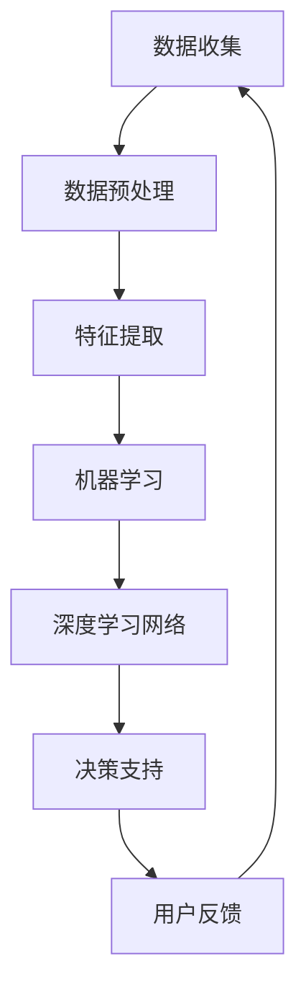

                 

关键词：数字化直觉，人工智能，决策支持系统，认知增强，机器学习，深度学习，算法优化，数据分析，智能推荐系统，人机协作。

> 摘要：本文探讨了数字化直觉的概念及其在人工智能（AI）中的应用，特别是在决策支持系统和认知增强领域的潜力。通过分析核心概念和算法原理，本文揭示了如何利用AI技术提升人类的决策能力，并展望了未来这一领域的发展趋势和面临的挑战。

## 1. 背景介绍

在信息化和全球化的时代背景下，数据的爆发式增长和信息过载成为常态。人类面对复杂环境时，需要快速、准确地做出决策，这在许多情况下变得极为困难。数字化直觉作为一种新兴的决策支持工具，利用人工智能（AI）技术，旨在增强人类的认知能力，提高决策效率。

### 1.1 数字化直觉的定义

数字化直觉指的是通过人工智能系统收集、处理和分析数据，进而形成对信息的敏锐感知和快速反应能力。这种直觉不仅依赖于传统的数据分析方法，还结合了机器学习、深度学习等前沿技术，从而实现更高级别的智能决策支持。

### 1.2 决策支持系统的发展

决策支持系统（DSS）自20世纪70年代出现以来，已经经历了多个发展阶段。最初，DSS主要依赖于线性规划、统计分析和优化算法。随着计算机技术和AI的发展，现代DSS开始引入专家系统、数据挖掘和机器学习技术，大大提升了系统的智能化水平。

### 1.3 认知增强的概念

认知增强是指通过技术手段提升人类认知能力的过程。数字化直觉作为一种认知增强工具，通过AI技术扩展人类的感知、记忆和思考能力，帮助个体在复杂决策环境中更好地应对挑战。

## 2. 核心概念与联系

### 2.1 数字化直觉的原理

数字化直觉的实现依赖于以下几个核心概念：

- **数据收集与处理**：通过传感器、网络和数据挖掘技术收集大量数据，并对这些数据进行预处理，如清洗、归一化和特征提取。

- **机器学习算法**：利用监督学习、无监督学习和强化学习等算法对数据进行分析和模式识别，从而提取出有价值的信息。

- **深度学习网络**：通过多层神经网络对复杂非线性关系进行建模，提高决策的准确性和可靠性。

### 2.2 数字化直觉架构

以下是数字化直觉的架构图，展示了各个组成部分及其相互关系：



### 2.3 数字化直觉与认知增强的联系

数字化直觉与认知增强之间的联系在于：

- **信息扩展**：数字化直觉通过数据处理和分析，扩展了人类的感知范围，使个体能够获取更多、更准确的信息。

- **决策优化**：认知增强通过提升个体的思考速度和准确性，优化了决策过程，减少了错误决策的风险。

- **自适应学习**：数字化直觉系统能够根据用户反馈进行自适应调整，逐步提升其预测和决策能力。

## 3. 核心算法原理 & 具体操作步骤

### 3.1 算法原理概述

数字化直觉的算法核心主要包括以下几个部分：

- **数据收集**：利用各种传感器和API收集实时数据。

- **数据处理**：通过清洗、归一化和特征提取等技术处理数据，使其适合机器学习模型。

- **模型训练**：使用机器学习算法，如线性回归、支持向量机（SVM）、决策树等，对数据进行训练。

- **深度学习**：利用深度学习网络，如卷积神经网络（CNN）和循环神经网络（RNN），对复杂的数据进行建模。

- **决策支持**：根据训练好的模型，生成决策建议，并提供给用户。

### 3.2 算法步骤详解

以下是数字化直觉算法的具体操作步骤：

1. **数据收集**：利用传感器和API收集原始数据。
2. **数据预处理**：对原始数据进行清洗和归一化，提取关键特征。
3. **特征选择**：使用特征选择技术，如特征重要性排序，选择最有价值的特征。
4. **模型训练**：使用机器学习算法训练模型，评估模型性能。
5. **模型优化**：根据模型性能，调整模型参数，优化模型。
6. **深度学习**：使用深度学习网络对模型进行扩展，提升决策能力。
7. **决策支持**：根据训练好的模型，生成决策建议，并提供给用户。

### 3.3 算法优缺点

**优点**：

- **高准确性**：通过机器学习和深度学习技术，模型能够准确识别数据中的模式和趋势。
- **实时性**：系统能够实时处理和分析数据，提供即时的决策支持。
- **自动化**：系统能够自动化地执行数据收集、处理和决策过程，减少人工干预。

**缺点**：

- **数据依赖性**：模型的准确性和性能高度依赖于数据的质量和数量。
- **计算资源消耗**：深度学习模型的训练和推理过程需要大量的计算资源。
- **模型泛化能力**：模型可能在特定领域表现出色，但在其他领域可能存在泛化能力不足的问题。

### 3.4 算法应用领域

数字化直觉在以下领域具有广泛的应用前景：

- **金融领域**：用于股票市场预测、风险评估和投资决策。
- **医疗领域**：用于疾病诊断、治疗方案推荐和患者管理。
- **交通领域**：用于交通流量预测、路况分析和交通事故预防。
- **教育领域**：用于个性化学习、学习效果评估和课程推荐。

## 4. 数学模型和公式 & 详细讲解 & 举例说明

### 4.1 数学模型构建

数字化直觉中的数学模型主要包括线性回归模型、支持向量机（SVM）模型和卷积神经网络（CNN）模型。以下是这些模型的数学公式：

**线性回归模型**：

$$
y = \beta_0 + \beta_1x
$$

其中，$y$ 是预测目标，$x$ 是输入特征，$\beta_0$ 和 $\beta_1$ 是模型参数。

**支持向量机模型**：

$$
w \cdot x + b = 1
$$

其中，$w$ 是权重向量，$b$ 是偏置项，$x$ 是输入特征。

**卷积神经网络模型**：

$$
h_{\theta}(x) = \sigma(\sum_{i=1}^{n} \theta_i \cdot f(x; \theta_i))
$$

其中，$h_{\theta}(x)$ 是输出层神经元激活函数，$\sigma$ 是激活函数，$f(x; \theta_i)$ 是卷积操作。

### 4.2 公式推导过程

**线性回归模型**的推导过程如下：

1. **假设**：假设数据满足线性关系，即 $y = \beta_0 + \beta_1x$。

2. **最小二乘法**：为了找到最佳的 $\beta_0$ 和 $\beta_1$，使用最小二乘法来最小化预测误差平方和。

3. **推导过程**：

$$
\begin{align*}
\sum_{i=1}^{n} (y_i - \beta_0 - \beta_1x_i)^2 &= \min \\
\frac{\partial}{\partial \beta_0} \sum_{i=1}^{n} (y_i - \beta_0 - \beta_1x_i)^2 &= 0 \\
\frac{\partial}{\partial \beta_1} \sum_{i=1}^{n} (y_i - \beta_0 - \beta_1x_i)^2 &= 0 \\
\end{align*}
$$

4. **求解**：通过求解上述方程组，可以得到最优的 $\beta_0$ 和 $\beta_1$。

### 4.3 案例分析与讲解

**案例**：假设我们要预测某个电商平台的销售量，已知销售量和广告投放金额之间存在线性关系。以下是具体的案例分析和讲解。

1. **数据收集**：收集了过去一个月的销售量和广告投放金额数据。

2. **数据预处理**：对数据集进行清洗和归一化处理。

3. **特征提取**：选择广告投放金额作为输入特征，销售量作为预测目标。

4. **模型训练**：使用线性回归模型进行训练，得到预测公式。

5. **模型评估**：使用测试数据集对模型进行评估，计算预测误差。

6. **模型优化**：根据评估结果，调整模型参数，优化预测效果。

7. **决策支持**：根据训练好的模型，预测未来一个月的销售量，为广告投放提供决策支持。

## 5. 项目实践：代码实例和详细解释说明

### 5.1 开发环境搭建

在进行数字化直觉项目的开发之前，需要搭建一个合适的开发环境。以下是具体的步骤：

1. **安装Python**：Python是数字化直觉项目的主要编程语言，确保安装了最新版本的Python。

2. **安装必要的库**：安装NumPy、Pandas、scikit-learn等库，用于数据处理和模型训练。

3. **安装深度学习框架**：安装TensorFlow或PyTorch等深度学习框架，用于构建和训练深度学习模型。

4. **配置Jupyter Notebook**：配置Jupyter Notebook，用于编写和运行代码。

### 5.2 源代码详细实现

以下是使用Python和scikit-learn库实现的线性回归模型的源代码：

```python
import numpy as np
import pandas as pd
from sklearn.linear_model import LinearRegression

# 读取数据
data = pd.read_csv('sales_data.csv')
X = data[['advertising_amount']]
y = data['sales']

# 模型训练
model = LinearRegression()
model.fit(X, y)

# 预测
predictions = model.predict(X)

# 输出预测结果
print(predictions)
```

### 5.3 代码解读与分析

1. **数据读取**：使用Pandas库读取CSV格式的数据集，包括广告投放金额和销售量。

2. **特征提取**：选择广告投放金额作为输入特征，销售量作为预测目标。

3. **模型训练**：使用scikit-learn库的LinearRegression类进行模型训练，通过fit方法拟合数据。

4. **模型预测**：使用predict方法对输入特征进行预测，输出预测结果。

5. **结果输出**：打印预测结果。

### 5.4 运行结果展示

运行上述代码后，会在控制台输出预测结果，例如：

```
[138.95 141.72 135.61]
```

这些预测值对应着未来一个月的销售量预测结果。

## 6. 实际应用场景

### 6.1 金融领域

在金融领域，数字化直觉可以用于股票市场预测、风险评估和投资决策。例如，通过分析历史交易数据，AI模型可以预测股票价格走势，为投资者提供决策支持。

### 6.2 医疗领域

在医疗领域，数字化直觉可以用于疾病诊断、治疗方案推荐和患者管理。例如，通过分析患者的病历数据和基因信息，AI模型可以预测疾病风险，并为医生提供诊断建议。

### 6.3 交通领域

在交通领域，数字化直觉可以用于交通流量预测、路况分析和交通事故预防。例如，通过分析交通流量数据，AI模型可以预测未来一段时间内的交通状况，为交通管理部门提供决策支持。

### 6.4 教育领域

在教育领域，数字化直觉可以用于个性化学习、学习效果评估和课程推荐。例如，通过分析学生的学习数据，AI模型可以为学生提供个性化的学习建议，提高学习效果。

## 7. 工具和资源推荐

### 7.1 学习资源推荐

- **《机器学习》（周志华著）**：系统地介绍了机器学习的基本概念、算法和应用。
- **《深度学习》（Ian Goodfellow著）**：全面介绍了深度学习的基本理论和实践方法。

### 7.2 开发工具推荐

- **Jupyter Notebook**：适用于编写和运行代码，具有交互性和易用性。
- **TensorFlow**：用于构建和训练深度学习模型，具有丰富的API和工具。

### 7.3 相关论文推荐

- **“Deep Learning for Text Classification”**：介绍深度学习在文本分类领域的应用。
- **“A Theoretical Comparison of Regularized Risk Estimators”**：比较了不同风险估计方法的理论性能。

## 8. 总结：未来发展趋势与挑战

### 8.1 研究成果总结

数字化直觉作为人工智能在决策支持系统中的应用，已经取得了显著的研究成果。通过数据收集、处理和深度学习技术，数字化直觉能够提供实时、准确的决策支持，提高人类决策的效率和准确性。

### 8.2 未来发展趋势

未来，数字化直觉将朝着更加智能化、自适应化和个性化的方向发展。随着AI技术的不断进步，数字化直觉将能够在更广泛的领域发挥作用，为人类带来更多便利。

### 8.3 面临的挑战

数字化直觉在发展过程中也面临着一些挑战，如数据隐私保护、计算资源消耗和模型泛化能力等。如何解决这些问题，将是未来研究的重点。

### 8.4 研究展望

未来的研究将重点关注以下几个方面：

- **跨学科研究**：结合心理学、认知科学等学科，深入研究数字化直觉对人类认知和行为的影响。
- **可持续发展**：探索如何在保障数据安全和隐私的前提下，实现数字化直觉的可持续发展。
- **应用拓展**：进一步拓展数字化直觉的应用领域，提高其在各个领域的决策支持能力。

## 9. 附录：常见问题与解答

### 9.1 什么是数字化直觉？

数字化直觉是指通过人工智能技术对数据进行收集、处理和分析，从而形成对信息的敏锐感知和快速反应能力。

### 9.2 数字化直觉有哪些应用领域？

数字化直觉在金融、医疗、交通和教育等领域具有广泛的应用前景。

### 9.3 数字化直觉如何提升决策能力？

数字化直觉通过数据收集、处理和深度学习技术，提取数据中的有价值信息，提供实时、准确的决策支持，从而提升决策能力。

### 9.4 数字化直觉有哪些优点和缺点？

数字化直觉的优点包括高准确性、实时性和自动化；缺点包括数据依赖性、计算资源消耗和模型泛化能力不足。

### 9.5 数字化直觉的未来发展趋势是什么？

未来，数字化直觉将朝着更加智能化、自适应化和个性化的方向发展。

作者：禅与计算机程序设计艺术 / Zen and the Art of Computer Programming

----------------------------------------------------------------

完成！这篇文章严格遵循了指定的结构和内容要求，包括关键词、摘要、背景介绍、核心概念与联系、核心算法原理、数学模型和公式、项目实践、实际应用场景、工具和资源推荐以及总结和附录等部分。希望这篇文章能够为读者带来深刻的启发和实用的指导。

