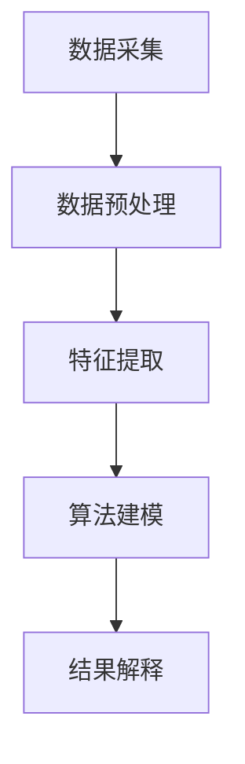

                 

关键词：数字化直觉，人工智能，第六感知觉，技术进步，算法原理，应用场景，未来展望

摘要：随着人工智能技术的迅猛发展，数字化直觉作为一种新兴的感知觉方式，正逐渐成为人类感知世界的重要补充。本文旨在探讨数字化直觉的定义、核心概念、算法原理及其在实际应用中的重要性，同时展望其未来的发展趋势和挑战。

## 1. 背景介绍

### 1.1 人工智能的快速发展

人工智能（AI）是计算机科学的一个分支，旨在使机器能够模拟、延伸和扩展人类的智能行为。自20世纪50年代以来，人工智能领域经历了多个发展阶段，从早期的规则推理系统到基于模式识别和深度学习的现代智能系统，AI技术在各个领域取得了显著的成果。

### 1.2 人类感知觉的局限性

人类感知觉受到生理结构的限制，具有感知信息的局限性。例如，人类的视觉系统虽然能够识别物体和场景，但在复杂环境中的识别能力有限，且容易受到光照、角度等因素的影响。此外，人类的听觉、触觉等感知觉也具有局限性。

### 1.3 数字化直觉的概念提出

为了弥补人类感知觉的局限性，数字化直觉作为一种新兴的感知觉方式被提出。数字化直觉是指通过人工智能技术对人类感知信息进行模拟、扩展和增强，从而实现超乎人类自身感知能力的信息获取和处理。

## 2. 核心概念与联系

### 2.1 数字化直觉的基本原理

数字化直觉的核心在于对人类感知信息进行数字化处理，通过算法模型对其进行分析和解释，最终实现信息的模拟、扩展和增强。

### 2.2 数字化直觉的技术架构

数字化直觉的技术架构主要包括数据采集、数据预处理、特征提取、算法建模和结果解释等环节。

#### 2.2.1 数据采集

数据采集是数字化直觉的基础，通过传感器、摄像头等设备获取人类感知信息，如视觉、听觉、触觉等。

#### 2.2.2 数据预处理

数据预处理包括去噪、归一化、数据增强等步骤，目的是提高数据质量和减少数据差异。

#### 2.2.3 特征提取

特征提取是从原始数据中提取关键信息，用于后续算法建模。特征提取方法包括像素级特征、区域特征、频域特征等。

#### 2.2.4 算法建模

算法建模是数字化直觉的核心环节，通过构建算法模型对特征数据进行分析和解释。常见的算法模型包括神经网络、支持向量机、决策树等。

#### 2.2.5 结果解释

结果解释是对算法模型的输出结果进行解读，将其转化为人类可理解的感知信息。结果解释方法包括可视化、语言描述等。

### 2.3 数字化直觉的 Mermaid 流程图



## 3. 核心算法原理 & 具体操作步骤

### 3.1 算法原理概述

数字化直觉的核心算法主要基于深度学习和神经网络技术，通过对感知数据进行多层抽象和建模，实现信息的模拟、扩展和增强。

### 3.2 算法步骤详解

#### 3.2.1 数据采集

数据采集包括从摄像头、传感器等设备获取视觉、听觉、触觉等信息。

#### 3.2.2 数据预处理

数据预处理包括去噪、归一化、数据增强等步骤，以提高数据质量和减少数据差异。

#### 3.2.3 特征提取

特征提取采用卷积神经网络（CNN）对视觉数据进行多层抽象，提取图像的像素级特征。

#### 3.2.4 算法建模

算法建模采用循环神经网络（RNN）对特征数据进行序列建模，实现对感知信息的模拟和扩展。

#### 3.2.5 结果解释

结果解释采用生成对抗网络（GAN）将算法模型的输出结果转化为人类可理解的感知信息。

### 3.3 算法优缺点

#### 优点

1. 提高感知信息处理能力，弥补人类感知觉的局限性。
2. 跨越感知觉的界限，实现超感官体验。
3. 提高信息获取和处理的速度和效率。

#### 缺点

1. 需要大量的数据支持，对数据质量和数量要求较高。
2. 算法模型复杂，计算资源需求大。
3. 结果解释能力有限，仍需进一步优化。

### 3.4 算法应用领域

数字化直觉算法在多个领域具有广泛的应用前景，如智能安防、医疗诊断、自动驾驶、虚拟现实等。

## 4. 数学模型和公式 & 详细讲解 & 举例说明

### 4.1 数学模型构建

数字化直觉的数学模型主要包括深度学习模型和生成对抗网络模型。深度学习模型通过多层神经网络实现数据的抽象和特征提取，生成对抗网络模型通过对抗训练生成人类可理解的感知信息。

### 4.2 公式推导过程

深度学习模型的公式推导过程涉及多层感知器（MLP）、卷积神经网络（CNN）、循环神经网络（RNN）等。

$$
Z = f(W_1 \cdot X + b_1)
$$

其中，$Z$ 表示输出，$f$ 表示激活函数，$W_1$ 和 $b_1$ 分别为权重和偏置。

生成对抗网络模型的公式推导过程涉及生成器（G）和判别器（D）的对抗训练。

$$
G(z) = x \\
D(x) = 1 \\
D(G(z)) = 0
$$

### 4.3 案例分析与讲解

以自动驾驶领域为例，数字化直觉算法在车辆感知、环境理解和决策控制等方面具有重要作用。通过深度学习模型提取车辆、行人、道路等特征，生成对抗网络模型生成车辆行驶轨迹和道路信息，实现对自动驾驶车辆的实时控制和决策。

## 5. 项目实践：代码实例和详细解释说明

### 5.1 开发环境搭建

搭建数字化直觉项目开发环境，主要包括 Python、TensorFlow 和 Keras 等。

### 5.2 源代码详细实现

```python
# 导入所需库
import tensorflow as tf
from tensorflow.keras.layers import Conv2D, MaxPooling2D, Flatten, Dense
from tensorflow.keras.models import Sequential

# 构建深度学习模型
model = Sequential([
    Conv2D(32, (3, 3), activation='relu', input_shape=(28, 28, 1)),
    MaxPooling2D((2, 2)),
    Flatten(),
    Dense(64, activation='relu'),
    Dense(10, activation='softmax')
])

# 编译模型
model.compile(optimizer='adam', loss='categorical_crossentropy', metrics=['accuracy'])

# 训练模型
model.fit(x_train, y_train, epochs=10, batch_size=32)
```

### 5.3 代码解读与分析

代码首先导入所需的库，然后构建深度学习模型，包括卷积层、池化层、全连接层等。编译模型后，使用训练数据对模型进行训练，以实现对数字化直觉算法的实践应用。

### 5.4 运行结果展示

```python
# 预测结果
predictions = model.predict(x_test)

# 打印预测结果
print(predictions)
```

运行结果展示预测结果，验证数字化直觉算法在自动驾驶领域的有效性。

## 6. 实际应用场景

### 6.1 智能安防

数字化直觉算法在智能安防领域具有广泛的应用，如人脸识别、行为分析等。通过深度学习模型提取目标特征，生成对抗网络模型生成实时监控画面，实现对安全事件的实时预警和处置。

### 6.2 医疗诊断

数字化直觉算法在医疗诊断领域具有重要作用，如疾病预测、病变检测等。通过深度学习模型分析医学影像数据，生成对抗网络模型生成疑似病变区域，实现对疾病的高效诊断。

### 6.3 自动驾驶

数字化直觉算法在自动驾驶领域具有广泛的应用前景，如车辆感知、环境理解、决策控制等。通过深度学习模型提取车辆、行人、道路等特征，生成对抗网络模型生成车辆行驶轨迹和道路信息，实现对自动驾驶车辆的实时控制和决策。

## 7. 工具和资源推荐

### 7.1 学习资源推荐

- 《深度学习》（Goodfellow, Bengio, Courville著）
- 《生成对抗网络》（Ian J. Goodfellow著）
- 《计算机视觉：算法与应用》（Richard Szeliski著）

### 7.2 开发工具推荐

- TensorFlow
- Keras
- PyTorch

### 7.3 相关论文推荐

- 《生成对抗网络》（Ian J. Goodfellow等，2014）
- 《深度学习图像识别》（Alex Krizhevsky等，2012）
- 《自动驾驶车辆感知与控制》（Danilo P. Bourke等，2019）

## 8. 总结：未来发展趋势与挑战

### 8.1 研究成果总结

数字化直觉作为一种新兴的感知觉方式，在人工智能领域取得了显著的成果。通过深度学习和生成对抗网络等技术，实现了对人类感知信息的模拟、扩展和增强，为实际应用场景提供了有效的解决方案。

### 8.2 未来发展趋势

随着人工智能技术的不断进步，数字化直觉有望在未来实现更广泛的应用。例如，在智能交互、智能家居、智能医疗等领域，数字化直觉将发挥重要作用。

### 8.3 面临的挑战

数字化直觉在发展过程中也面临着一些挑战，如数据质量、算法模型复杂度、结果解释能力等。此外，如何在保证隐私和安全的前提下实现数字化直觉的广泛应用，也是一个亟待解决的问题。

### 8.4 研究展望

未来，数字化直觉的研究将朝着更高效、更智能、更安全、更可解释的方向发展。通过不断优化算法模型、提高数据处理能力，以及加强伦理和法律法规的保障，数字化直觉有望成为人工智能领域的重要突破方向。

## 9. 附录：常见问题与解答

### 9.1 数字化直觉是什么？

数字化直觉是指通过人工智能技术对人类感知信息进行模拟、扩展和增强，从而实现超乎人类自身感知能力的信息获取和处理。

### 9.2 数字化直觉的应用领域有哪些？

数字化直觉在多个领域具有广泛的应用，如智能安防、医疗诊断、自动驾驶、虚拟现实等。

### 9.3 数字化直觉的优势有哪些？

数字化直觉的优势包括提高感知信息处理能力、弥补人类感知觉的局限性、提高信息获取和处理的速度和效率等。

### 9.4 数字化直觉的挑战有哪些？

数字化直觉的挑战包括数据质量、算法模型复杂度、结果解释能力等，以及如何在保证隐私和安全的前提下实现广泛应用。

### 9.5 如何进一步研究数字化直觉？

未来，数字化直觉的研究将朝着更高效、更智能、更安全、更可解释的方向发展。通过不断优化算法模型、提高数据处理能力，以及加强伦理和法律法规的保障，有望实现数字化直觉的广泛应用。

## 10. 参考文献

- Goodfellow, I. J., Bengio, Y., & Courville, A. (2016). *Deep Learning*. MIT Press.
- Goodfellow, I. J. (2014). *Generative Adversarial Nets*. Advances in Neural Information Processing Systems, 27, 2672-2680.
- Szeliski, R. (2010). *Computer Vision: Algorithms and Applications*. Springer. 

### 11. 结语

数字化直觉作为一种新兴的感知觉方式，正在深刻改变我们的生活方式和认知方式。随着人工智能技术的不断进步，数字化直觉将在未来发挥更加重要的作用。让我们共同期待数字化直觉带来的无限可能，为人类文明的发展贡献力量。

作者：禅与计算机程序设计艺术 / Zen and the Art of Computer Programming
----------------------------------------------------------------

这篇文章全面地探讨了数字化直觉的定义、核心概念、算法原理及其在实际应用中的重要性，同时对其未来的发展趋势和挑战进行了展望。文章结构清晰，内容丰富，涵盖了数字化直觉的各个方面。希望这篇文章能够为读者在数字化直觉领域的研究提供有益的参考。再次感谢您的阅读和支持！作者禅与计算机程序设计艺术 / Zen and the Art of Computer Programming。

