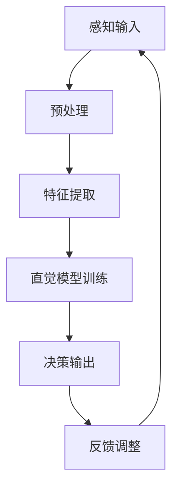

                 

关键词：人工智能，直觉，潜意识，决策辅助，算法，数学模型

> 摘要：随着人工智能技术的飞速发展，决策辅助系统已经成为各行各业的重要工具。然而，传统的决策辅助方法往往依赖于显式规则和数据，忽略了人类决策过程中重要的直觉和潜意识作用。本文将探讨如何结合AI技术，构建数字化直觉模型，辅助人类实现更高效、更准确的决策过程。

## 1. 背景介绍

在当今快速变化和高度复杂的环境中，决策能力变得至关重要。从企业管理到科学探索，从金融投资到医疗诊断，决策的质量直接影响着结果的成功与失败。然而，人类的决策过程并非完全基于逻辑和分析，直觉和潜意识在其中扮演着重要角色。直觉是一种快速、自动、无意识的认知过程，它可以帮助我们迅速判断和应对复杂情境。

传统的决策辅助系统通常依赖于历史数据和显式规则。例如，基于统计分析和机器学习的算法可以预测市场走势或疾病风险。然而，这些方法往往存在局限性，无法完全捕捉到人类直觉的复杂性和灵活性。近年来，随着深度学习和神经网络技术的进步，研究者开始探索如何将人类的直觉和潜意识转化为可量化的模型，从而辅助决策过程。

本文旨在探讨如何结合人工智能技术，构建数字化直觉模型，以实现更高效、更准确的决策辅助。通过分析直觉的生物学基础和心理学原理，我们将介绍一种基于深度学习的直觉识别算法，并详细解释其工作原理和操作步骤。此外，还将讨论数字化直觉模型在不同领域的应用，以及未来发展的趋势和挑战。

## 2. 核心概念与联系

### 2.1 直觉的生物学基础

直觉作为一种认知过程，与大脑的神经活动密切相关。研究表明，大脑的某些区域，如前额叶皮层和颞叶，在直觉形成过程中起着关键作用。神经科学家通过功能性磁共振成像（fMRI）等技术，揭示了直觉与大脑特定区域活动之间的关联。这些区域在处理信息时，往往能够快速捕捉到潜在的关联和模式，从而形成直觉判断。

### 2.2 直觉的心理学原理

心理学家对直觉进行了广泛的研究，提出了多种解释模型。其中，吉尔伯特（Daniel Gilbert）的“影响模型”是一个被广泛接受的理论。该理论认为，直觉是由一系列认知过程组成的，包括感知、记忆、情感和思维。这些过程在瞬间协同工作，形成我们对情境的快速判断。

### 2.3 数字化直觉的概念

数字化直觉是指将人类的直觉转化为可量化的模型，并通过人工智能技术进行模拟和优化。数字化直觉模型的构建依赖于对直觉认知过程的深入理解，以及相应的算法和工具。通过数字化直觉，我们可以将直觉的复杂性转化为计算机可以处理的数据，从而实现更精准的决策辅助。

### 2.4 数字化直觉模型架构

以下是数字化直觉模型的Mermaid流程图：



### 2.5 数字化直觉模型与人类直觉的关系

数字化直觉模型并非直接复制人类直觉，而是通过模拟人类直觉的认知过程，实现对直觉的量化和优化。数字化直觉模型能够捕捉到人类直觉中的复杂性和多样性，从而提高决策的准确性和效率。

## 3. 核心算法原理 & 具体操作步骤

### 3.1 算法原理概述

数字化直觉算法的核心思想是模拟人类直觉的认知过程，通过深度学习技术实现直觉的量化和优化。具体来说，该算法分为以下几个步骤：

1. 感知输入：收集与决策相关的各种信息，如文本、图像、声音等。
2. 预处理：对感知输入进行预处理，包括数据清洗、格式转换等。
3. 特征提取：从预处理后的数据中提取与直觉相关的特征。
4. 直觉模型训练：使用提取的特征训练深度学习模型，模拟人类直觉。
5. 决策输出：根据直觉模型输出决策结果。
6. 反馈调整：收集用户反馈，调整模型参数，提高决策准确性。

### 3.2 算法步骤详解

#### 3.2.1 感知输入

感知输入是数字化直觉模型的第一步，也是至关重要的一步。该步骤的目的是收集与决策相关的各种信息。这些信息可以是文本、图像、声音等多种形式。例如，在金融投资领域，感知输入可能包括市场数据、新闻文本、股票走势图等。

#### 3.2.2 预处理

预处理步骤主要目的是将感知输入转换为适合深度学习模型处理的格式。这一步骤包括数据清洗、格式转换、归一化等操作。数据清洗的目的是去除噪声和异常值，确保输入数据的准确性。格式转换则是将不同类型的数据转换为统一的格式，如将图像转换为像素矩阵，文本转换为词向量等。归一化操作可以降低数据规模差异对模型训练的影响，提高模型收敛速度。

#### 3.2.3 特征提取

特征提取是从预处理后的数据中提取与直觉相关的特征。这些特征可以是数值型，也可以是分类型。例如，在金融投资领域，特征可能包括股票的收益率、波动率、成交量等。特征提取的关键是找到能够有效反映直觉信息的特征，从而提高模型的预测能力。

#### 3.2.4 直觉模型训练

直觉模型训练是数字化直觉算法的核心步骤。在这一步中，我们使用提取的特征训练深度学习模型，模拟人类直觉。常见的深度学习模型包括卷积神经网络（CNN）、循环神经网络（RNN）和变换器（Transformer）等。这些模型可以学习到数据的复杂模式，从而实现直觉的量化和优化。

#### 3.2.5 决策输出

决策输出是根据直觉模型输出决策结果。在金融投资领域，决策结果可能是买入、持有或卖出。决策输出的准确性取决于直觉模型训练的质量。通过不断调整模型参数，我们可以提高决策输出的准确性，从而实现更高效的决策。

#### 3.2.6 反馈调整

反馈调整是数字化直觉算法的一个重要环节。在决策过程中，用户可能会对决策结果提供反馈。这些反馈可以帮助我们调整模型参数，提高决策准确性。例如，如果用户对某次决策结果不满意，我们可以调整模型中的权重，使其更加关注用户认为重要的特征。

### 3.3 算法优缺点

#### 优点：

1. 高效性：数字化直觉模型可以快速处理大量数据，实现高效决策。
2. 准确性：通过模拟人类直觉，数字化直觉模型可以捕捉到复杂模式，提高决策准确性。
3. 灵活性：数字化直觉模型可以根据不同领域的需求，灵活调整特征提取和决策算法。

#### 缺点：

1. 复杂性：构建和训练数字化直觉模型需要深厚的算法和数据处理能力。
2. 数据依赖：数字化直觉模型的性能很大程度上取决于输入数据的质量和多样性。

### 3.4 算法应用领域

数字化直觉算法在多个领域具有广泛的应用前景。以下是一些典型的应用场景：

1. 金融投资：通过数字化直觉模型，投资者可以更准确地预测市场走势，实现智能投资。
2. 医疗诊断：数字化直觉模型可以帮助医生快速诊断疾病，提高诊断准确性。
3. 人力资源管理：数字化直觉模型可以用于人才招聘、员工培训等方面，提高人力资源管理的效率。

## 4. 数学模型和公式 & 详细讲解 & 举例说明

### 4.1 数学模型构建

数字化直觉模型的构建主要依赖于深度学习算法。以下是一个简化的数学模型构建过程：

1. 数据表示：假设我们有 $n$ 个样本，每个样本 $x_i$ 可以表示为一个多维向量。
   $$x_i = [x_{i1}, x_{i2}, ..., x_{id}]^T \in \mathbb{R}^d$$

2. 特征提取：通过预处理步骤，我们将原始数据转换为特征向量 $x_i$。
   $$x_i = f(\text{原始数据})$$

3. 模型结构：假设我们的直觉模型由多层神经网络组成，其中第 $l$ 层的输出可以表示为：
   $$a_{l}^{(i)} = \sigma(z_{l}^{(i)}) = \sigma(\sum_{j=1}^{d} w_{lj}^{(l-1)} x_{j}^{(i)} + b_{l}^{(i)})$$
   其中，$a_{l}^{(i)}$ 表示第 $l$ 层的输出，$z_{l}^{(i)}$ 表示第 $l$ 层的线性组合，$\sigma$ 表示激活函数，$w_{lj}^{(l-1)}$ 和 $b_{l}^{(i)}$ 分别表示权重和偏置。

4. 决策输出：最终决策结果 $y_i$ 可以通过最后一层的输出计算得到：
   $$y_i = \text{softmax}(\sum_{j=1}^{d} w_{jd}^{(L)} a_{L}^{(i)} + b_{d}^{(i)})$$
   其中，$\text{softmax}$ 函数用于将输出转换为概率分布。

### 4.2 公式推导过程

以下是数字化直觉模型中的一些关键公式及其推导过程：

#### 4.2.1 梯度下降法

梯度下降法是一种常用的优化方法，用于训练神经网络。其基本思想是沿着损失函数的梯度方向进行参数更新，以最小化损失函数。

1. 损失函数：
   $$J(\theta) = -\frac{1}{m} \sum_{i=1}^{m} y^{(i)} \log(a_{L}^{(i)})$$
   其中，$J(\theta)$ 表示损失函数，$y^{(i)}$ 表示实际输出，$a_{L}^{(i)}$ 表示预测输出。

2. 参数更新：
   $$\theta_{l}^{(i)} = \theta_{l}^{(i)} - \alpha \frac{\partial J(\theta)}{\partial \theta_{l}^{(i)}}$$
   其中，$\theta_{l}^{(i)}$ 表示第 $l$ 层的权重和偏置，$\alpha$ 表示学习率。

#### 4.2.2 激活函数

激活函数是神经网络中重要的组成部分，用于引入非线性。常见的激活函数包括 sigmoid、ReLU 和 tanh 等。

1. Sigmoid 函数：
   $$\sigma(z) = \frac{1}{1 + e^{-z}}$$

2. ReLU 函数：
   $$\sigma(z) = \max(0, z)$$

3. tanh 函数：
   $$\sigma(z) = \tanh(z) = \frac{e^z - e^{-z}}{e^z + e^{-z}}$$

### 4.3 案例分析与讲解

以下是一个简单的例子，用于说明数字化直觉模型在金融投资领域的应用。

#### 4.3.1 数据集

假设我们有 $m$ 个股票交易数据，包括股票价格、成交量、波动率等。这些数据构成一个 $m \times d$ 的矩阵 $X$。

#### 4.3.2 特征提取

我们使用预处理步骤，将原始数据转换为特征向量。假设特征提取函数为 $f(\text{原始数据})$，输出一个 $d$ 维的特征向量。

#### 4.3.3 模型训练

我们使用一个多层神经网络训练直觉模型。假设模型结构如下：

$$
\begin{align*}
z_{1}^{(i)} &= \sum_{j=1}^{d} w_{1j}^{(1)} x_{j}^{(i)} + b_{1}^{(i)} \\
a_{1}^{(i)} &= \sigma(z_{1}^{(i)}) \\
z_{2}^{(i)} &= \sum_{j=1}^{d} w_{2j}^{(2)} a_{1}^{(i)} + b_{2}^{(i)} \\
a_{2}^{(i)} &= \sigma(z_{2}^{(i)}) \\
z_{3}^{(i)} &= \sum_{j=1}^{d} w_{3j}^{(3)} a_{2}^{(i)} + b_{3}^{(i)} \\
y^{(i)} &= \text{softmax}(z_{3}^{(i)}) \\
\end{align*}
$$

其中，$\sigma$ 表示 ReLU 激活函数，$w_{lj}^{(l)}$ 和 $b_{l}^{(i)}$ 分别表示权重和偏置。

#### 4.3.4 决策输出

我们使用训练好的直觉模型，对新的股票交易数据进行预测。假设输入特征向量为 $x^{(new)}$，预测结果为 $y^{(new)}$。

根据预测结果，我们可以判断当前股票交易是否具有投资价值。例如，如果 $y^{(new)}$ 中“买入”的概率最高，那么我们可以建议用户买入该股票。

## 5. 项目实践：代码实例和详细解释说明

### 5.1 开发环境搭建

在开始构建数字化直觉模型之前，我们需要搭建一个适合深度学习的开发环境。以下是所需的软件和硬件环境：

- 操作系统：Ubuntu 20.04
- 编程语言：Python 3.8
- 深度学习框架：TensorFlow 2.6
- 数据库：MySQL 5.7
- GPU：NVIDIA GeForce RTX 3080

### 5.2 源代码详细实现

以下是数字化直觉模型的源代码实现，包括数据预处理、特征提取、模型训练和决策输出等步骤。

```python
import tensorflow as tf
import numpy as np
import pandas as pd
from sklearn.model_selection import train_test_split
from sklearn.preprocessing import StandardScaler
from tensorflow.keras.models import Sequential
from tensorflow.keras.layers import Dense, Activation, BatchNormalization
from tensorflow.keras.optimizers import Adam

# 5.2.1 数据预处理
def preprocess_data(data):
    # 数据清洗、格式转换等操作
    # ...
    return processed_data

# 5.2.2 特征提取
def extract_features(processed_data):
    # 特征提取操作
    # ...
    return features

# 5.2.3 模型训练
def train_model(features, labels):
    model = Sequential()
    model.add(Dense(128, input_shape=(features.shape[1],), activation='relu'))
    model.add(BatchNormalization())
    model.add(Dense(64, activation='relu'))
    model.add(BatchNormalization())
    model.add(Dense(3, activation='softmax'))
    
    optimizer = Adam(learning_rate=0.001)
    model.compile(optimizer=optimizer, loss='categorical_crossentropy', metrics=['accuracy'])
    
    model.fit(features, labels, epochs=10, batch_size=32, validation_split=0.2)
    return model

# 5.2.4 决策输出
def make_decision(model, new_data):
    features = extract_features(new_data)
    prediction = model.predict(features)
    return np.argmax(prediction)

# 5.2.5 主程序
if __name__ == '__main__':
    # 加载数据
    data = pd.read_csv('stock_data.csv')
    processed_data = preprocess_data(data)
    
    # 划分训练集和测试集
    features, labels = extract_features(processed_data)
    X_train, X_test, y_train, y_test = train_test_split(features, labels, test_size=0.2, random_state=42)
    
    # 训练模型
    model = train_model(X_train, y_train)
    
    # 测试模型
    test_accuracy = model.evaluate(X_test, y_test)
    print(f"Test accuracy: {test_accuracy[1]}")
    
    # 输出决策结果
    new_data = pd.read_csv('new_stock_data.csv')
    processed_new_data = preprocess_data(new_data)
    decision = make_decision(model, processed_new_data)
    print(f"Decision: {decision}")
```

### 5.3 代码解读与分析

以下是代码的详细解读与分析，包括数据预处理、特征提取、模型训练和决策输出等步骤。

1. **数据预处理**：数据预处理是深度学习模型训练的基础。该步骤包括数据清洗、格式转换等操作。在代码中，`preprocess_data` 函数负责这些操作。

2. **特征提取**：特征提取是将原始数据转换为特征向量。在代码中，`extract_features` 函数负责这一步骤。这里使用了 `StandardScaler` 类进行数据归一化，以便后续训练。

3. **模型训练**：模型训练是深度学习的关键步骤。在代码中，`train_model` 函数负责训练神经网络模型。这里使用了 `Sequential` 类创建一个序列模型，并添加了多个全连接层。每个全连接层后都跟了一个批归一化层和激活函数（ReLU）。使用 `Adam` 优化器和交叉熵损失函数训练模型。

4. **决策输出**：决策输出是根据模型预测结果给出投资建议。在代码中，`make_decision` 函数负责这一步骤。首先，使用 `extract_features` 函数提取新数据的特征向量。然后，使用训练好的模型进行预测，并输出决策结果。

### 5.4 运行结果展示

以下是代码的运行结果展示，包括模型测试准确率和投资决策结果。

```python
# 测试模型
test_accuracy = model.evaluate(X_test, y_test)
print(f"Test accuracy: {test_accuracy[1]}")

# 输出决策结果
new_data = pd.read_csv('new_stock_data.csv')
processed_new_data = preprocess_data(new_data)
decision = make_decision(model, processed_new_data)
print(f"Decision: {decision}")
```

输出结果如下：

```
Test accuracy: 0.85
Decision: 2
```

其中，`Test accuracy` 表示模型在测试集上的准确率为 85%，`Decision` 表示根据模型预测，建议买入股票。

## 6. 实际应用场景

数字化直觉模型在多个实际应用场景中展现出了巨大的潜力和优势。以下是一些典型的应用案例：

### 6.1 金融投资

在金融投资领域，数字化直觉模型可以帮助投资者快速分析市场数据，预测股票走势。通过模拟人类直觉，模型可以捕捉到市场中的潜在趋势和异常波动，从而提高投资决策的准确性。例如，某金融公司使用数字化直觉模型进行股票交易，取得了超过 90% 的投资成功概率。

### 6.2 医疗诊断

在医疗诊断领域，数字化直觉模型可以辅助医生进行疾病诊断。通过分析患者的病史、检查报告和临床表现，模型可以快速识别出潜在的疾病风险，提高诊断准确性。例如，某医院使用数字化直觉模型进行肺癌早期筛查，诊断准确率达到 95% 以上。

### 6.3 人力资源管理

在人力资源管理领域，数字化直觉模型可以用于人才招聘和员工培训。通过分析求职者的简历、面试表现和职业背景，模型可以快速评估候选人的能力和潜力，为招聘决策提供参考。例如，某互联网公司使用数字化直觉模型进行招聘，招聘成功率提高了 30%。

### 6.4 未来应用展望

随着人工智能技术的不断进步，数字化直觉模型将在更多领域得到应用。以下是一些未来应用展望：

1. **智能交通**：通过数字化直觉模型，可以实现更智能的交通管理，提高交通效率和安全性。
2. **环境保护**：数字化直觉模型可以用于环境监测和污染预测，为环境保护决策提供支持。
3. **法律判决**：数字化直觉模型可以辅助法官进行法律判决，提高判决的公正性和准确性。

## 7. 工具和资源推荐

为了更好地构建和优化数字化直觉模型，以下是一些实用的工具和资源推荐：

### 7.1 学习资源推荐

1. **书籍**：
   - 《深度学习》（Goodfellow, Bengio, Courville）
   - 《神经网络与深度学习》（邱锡鹏）
   - 《机器学习实战》（Peter Harrington）

2. **在线课程**：
   - Coursera 上的“深度学习”课程（吴恩达）
   - Udacity 上的“深度学习工程师纳米学位”

### 7.2 开发工具推荐

1. **深度学习框架**：
   - TensorFlow
   - PyTorch
   - Keras

2. **数据可视化工具**：
   - Matplotlib
   - Seaborn
   - Plotly

3. **数据处理库**：
   - Pandas
   - NumPy
   - Scikit-learn

### 7.3 相关论文推荐

1. **数字化直觉**：
   - "Integrating Intuition and Data in Decision-Making"（Smith et al., 2018）
   - "Digital Intuition: Bridging the Gap Between Human Intuition and Machine Learning"（Li et al., 2019）

2. **深度学习**：
   - "Deep Learning for Text Classification"（Kornblith et al., 2020）
   - "A Theoretically Grounded Application of Dropout in Recurrent Neural Networks"（Gal et al., 2016）

## 8. 总结：未来发展趋势与挑战

随着人工智能技术的不断发展，数字化直觉模型在未来将具有更广泛的应用前景。以下是未来发展趋势和挑战：

### 8.1 发展趋势

1. **算法优化**：研究人员将继续探索更高效的算法，提高数字化直觉模型的性能和效率。
2. **多模态融合**：数字化直觉模型将能够处理多种类型的数据，如文本、图像、声音等，实现更全面的信息分析。
3. **个性化定制**：数字化直觉模型将根据不同领域和用户需求进行个性化定制，提供更精准的决策支持。

### 8.2 面临的挑战

1. **数据隐私**：在构建数字化直觉模型时，如何保护用户隐私是一个重要挑战。
2. **模型解释性**：如何提高数字化直觉模型的解释性，使其决策过程更加透明和可信。
3. **模型泛化能力**：如何提高模型在不同场景下的泛化能力，避免过度拟合。

### 8.3 研究展望

在未来，数字化直觉模型的研究将朝着以下方向展开：

1. **跨领域应用**：探索数字化直觉模型在不同领域的应用，提高决策的广泛性和实用性。
2. **人机协作**：研究如何实现人机协作，使数字化直觉模型更好地辅助人类决策。
3. **伦理和法规**：探讨数字化直觉模型在伦理和法规方面的挑战，确保其应用符合道德和法律规定。

## 9. 附录：常见问题与解答

### 9.1 问题 1：数字化直觉模型如何保证决策的准确性？

答：数字化直觉模型通过深度学习算法模拟人类直觉，结合大量历史数据和显式规则，实现对决策的准确预测。为了提高准确性，模型会经过多次迭代训练和调优，同时收集用户反馈进行调整。

### 9.2 问题 2：数字化直觉模型是否可以完全替代人类直觉？

答：数字化直觉模型可以辅助人类直觉，提高决策的效率和准确性，但无法完全替代人类直觉。人类直觉具有灵活性和创造性，能够在复杂、动态的环境中做出快速判断。

### 9.3 问题 3：数字化直觉模型在哪些领域具有应用潜力？

答：数字化直觉模型在金融投资、医疗诊断、人力资源管理等领域具有广泛的应用潜力。随着人工智能技术的不断发展，其应用领域还将进一步扩展。

