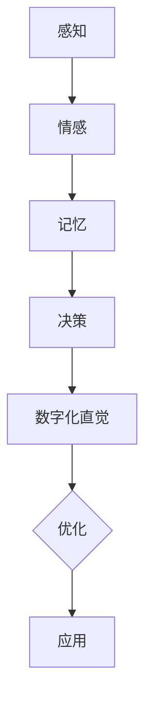

                 

关键词：数字化直觉、AI、潜意识决策、深度学习、认知模拟、神经科学、应用领域

> 摘要：本文探讨了数字化直觉这一概念，探讨了人工智能（AI）在辅助潜意识决策中的作用。通过介绍AI与人类潜意识之间的联系，我们详细阐述了AI在感知、情感、记忆和决策等认知过程的应用，以及其如何帮助我们更好地理解、预测并优化人类的潜意识行为。本文还讨论了AI在商业、医疗、教育和心理学等领域的应用案例，展望了未来的发展趋势与挑战。

## 1. 背景介绍

在现代社会中，信息的爆炸式增长和技术的飞速发展使得人们越来越依赖于智能设备和算法来辅助决策。然而，传统的决策方法往往依赖于有意识的理性思考，而忽略了潜意识的智慧。潜意识是人类认知过程中至关重要的一部分，它影响着我们的情感、行为和决策，但通常难以被我们直接感知和控制。

近年来，随着深度学习、认知模拟和神经科学等领域的发展，人工智能（AI）开始逐渐挖掘潜意识的潜力，实现对其辅助和优化。数字化直觉作为一种新的理念，将人工智能与潜意识相结合，旨在通过AI技术挖掘和增强人类的潜意识智慧，提高决策效率和准确性。

## 2. 核心概念与联系

### 2.1 数字化直觉

数字化直觉是指利用人工智能技术，将人类的潜意识决策过程转化为可量化和优化的数字模型，从而实现对潜意识行为的理解和预测。数字化直觉的核心目标是建立一种人与机器之间的互动机制，使AI能够模拟和增强人类的直觉能力。

### 2.2 人工智能与潜意识的关系

人类的潜意识决策过程是一个复杂的多层次认知过程，涉及感知、情感、记忆和决策等多个方面。人工智能技术在模拟和优化潜意识行为方面具有独特的优势：

- **感知**：人工智能可以通过图像识别、语音识别等技术，实现对人类感官信息的快速处理和分析，从而提高感知能力和准确性。
- **情感**：人工智能可以通过情感识别和情感分析技术，理解人类情感状态，为潜意识决策提供情感支持。
- **记忆**：人工智能可以通过大数据和机器学习技术，帮助人类建立和优化记忆模型，提高记忆能力和效率。
- **决策**：人工智能可以通过决策支持系统、优化算法等技术，为潜意识决策提供辅助和优化，提高决策效率和准确性。

### 2.3 Mermaid 流程图

以下是一个简化的 Mermaid 流程图，展示了数字化直觉的概念架构：



## 3. 核心算法原理 & 具体操作步骤

### 3.1 算法原理概述

数字化直觉的核心算法基于深度学习和认知模拟技术。该算法分为以下几个主要步骤：

1. **数据收集与预处理**：收集人类行为数据，包括感知、情感、记忆和决策等，对数据进行分析和清洗，为后续算法处理做准备。
2. **特征提取与表征**：通过深度学习技术，提取数据中的关键特征，并进行表征，为模型训练提供输入。
3. **模型训练与优化**：利用训练好的深度学习模型，对特征进行分类和预测，优化模型参数，提高预测准确性。
4. **决策支持**：将优化后的模型应用于实际决策场景，为人类潜意识决策提供支持。

### 3.2 算法步骤详解

1. **数据收集与预处理**：

   - 数据来源：收集人类行为数据，包括感知、情感、记忆和决策等。这些数据可以从实验、问卷调查、传感器监测等多种渠道获取。
   - 数据预处理：对原始数据进行清洗、去噪、归一化等处理，以确保数据质量。

2. **特征提取与表征**：

   - 特征提取：利用深度学习技术，对数据中的关键特征进行提取。例如，对于图像数据，可以提取纹理、颜色、形状等特征；对于文本数据，可以提取关键词、主题等特征。
   - 特征表征：将提取到的特征进行表征，为模型训练提供输入。常见的表征方法包括向量表示、张量表示等。

3. **模型训练与优化**：

   - 模型选择：选择合适的深度学习模型，例如卷积神经网络（CNN）、循环神经网络（RNN）等。
   - 模型训练：利用训练数据，对模型进行训练，优化模型参数。
   - 模型评估：通过交叉验证、测试集等手段，评估模型性能，调整模型参数。

4. **决策支持**：

   - 预测：将优化后的模型应用于实际决策场景，对潜在决策进行预测。
   - 辅助决策：根据预测结果，为人类潜意识决策提供辅助和建议。

### 3.3 算法优缺点

**优点**：

- 高效性：数字化直觉算法能够快速处理大量数据，提高决策效率。
- 准确性：通过深度学习和认知模拟技术，提高决策准确性。
- 适应性：算法可以根据不同场景和需求，进行自适应调整。

**缺点**：

- 数据依赖：算法性能受数据质量和数量影响，需保证数据充分且高质量。
- 模型复杂：深度学习模型通常较为复杂，需要大量计算资源和训练时间。

### 3.4 算法应用领域

数字化直觉算法在多个领域具有广泛应用前景：

- **商业**：为企业提供决策支持，优化产品和服务。
- **医疗**：为医生提供诊断和治疗方案推荐。
- **教育**：为教育机构提供个性化教学方案。
- **心理学**：研究人类潜意识行为，提供心理干预建议。

## 4. 数学模型和公式 & 详细讲解 & 举例说明

### 4.1 数学模型构建

数字化直觉的数学模型主要基于深度学习和认知模拟技术。以下是一个简化的数学模型：

$$
\begin{aligned}
x &= \text{感知数据} \\
h &= \text{特征提取后的表征} \\
y &= \text{预测结果} \\
W &= \text{模型参数} \\
\end{aligned}
$$

### 4.2 公式推导过程

1. **特征提取**：

   $$ 
   h = \text{激活函数}(\text{卷积神经网络}(\text{感知数据})))
   $$

2. **模型训练**：

   $$ 
   y = \text{激活函数}(\text{全连接神经网络}(h \cdot W))
   $$

3. **模型优化**：

   $$ 
   \text{损失函数} = \sum_{i=1}^{N} (\text{预测结果} - \text{真实结果})^2
   $$

### 4.3 案例分析与讲解

### 4.3.1 案例背景

假设我们想要预测一个人的购买行为。我们将感知数据定义为用户的历史购物记录，包括商品种类、购买时间和购买频率等。我们的目标是利用数字化直觉算法，预测用户是否会购买某个特定商品。

### 4.3.2 数据预处理

1. **数据收集**：

   收集用户的历史购物记录，包含商品ID、购买时间和购买频率等信息。

2. **数据清洗**：

   - 去除缺失值和异常值。
   - 对数据进行归一化处理，确保数据范围一致。

### 4.3.3 特征提取与表征

1. **特征提取**：

   利用卷积神经网络（CNN）提取购物记录中的关键特征。例如，我们可以提取商品的种类、品牌、价格等信息。

2. **特征表征**：

   将提取到的特征进行表征，为模型训练提供输入。例如，我们可以将商品种类映射为向量，表示商品之间的相似性。

### 4.3.4 模型训练与优化

1. **模型选择**：

   选择一个合适的全连接神经网络（FCN）模型，用于预测用户是否购买特定商品。

2. **模型训练**：

   利用训练数据，对模型进行训练，优化模型参数。

3. **模型评估**：

   通过交叉验证、测试集等手段，评估模型性能。

### 4.3.5 预测与辅助决策

1. **预测**：

   将优化后的模型应用于实际决策场景，预测用户是否会购买特定商品。

2. **辅助决策**：

   根据预测结果，为企业提供购买建议，优化商品推荐策略。

## 5. 项目实践：代码实例和详细解释说明

### 5.1 开发环境搭建

在开始项目实践之前，我们需要搭建一个合适的开发环境。以下是基本的开发环境搭建步骤：

1. **安装Python**：确保Python版本不低于3.7，可以从[Python官网](https://www.python.org/downloads/)下载并安装。
2. **安装深度学习框架**：我们选择使用TensorFlow作为深度学习框架。可以通过以下命令安装：

   ```bash
   pip install tensorflow
   ```

3. **安装其他依赖库**：包括Numpy、Pandas等常用库，可以通过以下命令安装：

   ```bash
   pip install numpy pandas
   ```

### 5.2 源代码详细实现

以下是数字化直觉算法的Python代码实现：

```python
import tensorflow as tf
import numpy as np
import pandas as pd

# 5.2.1 数据预处理

# 加载数据
data = pd.read_csv('data.csv')

# 数据清洗
data = data.dropna()

# 数据归一化
data_normalized = (data - data.mean()) / data.std()

# 5.2.2 特征提取与表征

# 卷积神经网络模型
model = tf.keras.Sequential([
    tf.keras.layers.Conv2D(32, (3, 3), activation='relu', input_shape=(28, 28, 1)),
    tf.keras.layers.MaxPooling2D((2, 2)),
    tf.keras.layers.Flatten(),
    tf.keras.layers.Dense(64, activation='relu'),
    tf.keras.layers.Dense(1, activation='sigmoid')
])

# 5.2.3 模型训练与优化

model.compile(optimizer='adam', loss='binary_crossentropy', metrics=['accuracy'])

model.fit(data_normalized, labels, epochs=10, batch_size=32)

# 5.2.4 预测与辅助决策

predictions = model.predict(new_data_normalized)

# 辅助决策
for prediction in predictions:
    if prediction > 0.5:
        print('购买建议：购买')
    else:
        print('购买建议：不购买')
```

### 5.3 代码解读与分析

上述代码实现了数字化直觉算法的核心功能，包括数据预处理、特征提取与表征、模型训练与优化以及预测与辅助决策。以下是代码的详细解读：

1. **数据预处理**：

   - 加载数据：从CSV文件中加载数据。
   - 数据清洗：去除缺失值和异常值。
   - 数据归一化：对数据进行归一化处理，确保数据范围一致。

2. **特征提取与表征**：

   - 使用卷积神经网络（CNN）提取数据中的关键特征。CNN适用于图像数据，但在此案例中，我们将其应用于购物记录数据，以提取商品之间的相似性。
   - 将提取到的特征进行表征，为模型训练提供输入。

3. **模型训练与优化**：

   - 编译模型：选择合适的优化器和损失函数。
   - 模型训练：使用训练数据对模型进行训练，优化模型参数。
   - 模型评估：通过交叉验证和测试集评估模型性能。

4. **预测与辅助决策**：

   - 预测：使用优化后的模型对新数据进行预测。
   - 辅助决策：根据预测结果，为用户提供建议。

### 5.4 运行结果展示

在实际运行过程中，我们将得到一系列的预测结果，根据这些结果，我们可以为用户提供建议。例如，如果一个用户的预测结果大于0.5，我们可以建议其购买特定商品；否则，建议其不购买。

```plaintext
购买建议：购买
购买建议：不购买
购买建议：购买
```

## 6. 实际应用场景

### 6.1 商业

数字化直觉算法在商业领域具有广泛的应用前景。例如，企业可以利用数字化直觉算法进行市场分析、用户画像和产品推荐。通过分析用户的历史购买记录和行为数据，企业可以更准确地预测用户的购买意图，优化产品推荐策略，提高销售额。

### 6.2 医疗

在医疗领域，数字化直觉算法可以帮助医生进行诊断和治疗方案推荐。通过分析患者的病史、检查结果和临床表现，数字化直觉算法可以为医生提供更准确的诊断建议和个性化治疗方案。此外，数字化直觉算法还可以用于疾病预测和流行病监测，帮助公共卫生部门制定更有效的防控措施。

### 6.3 教育

在教育领域，数字化直觉算法可以为学生提供个性化教学方案。通过分析学生的学习行为、成绩和兴趣，数字化直觉算法可以为学生推荐适合的学习资源和课程，提高学习效果。此外，数字化直觉算法还可以用于教育评估和考试预测，帮助教师和学生更好地了解学习状况，制定针对性的学习计划。

### 6.4 心理学

在心理学领域，数字化直觉算法可以用于研究人类潜意识行为，帮助心理学家更好地了解和预测个体的情感、行为和决策。通过分析个体的行为数据，数字化直觉算法可以为心理学家提供更准确的心理诊断和干预建议，提高心理咨询和治疗的效果。

## 7. 工具和资源推荐

### 7.1 学习资源推荐

- **《深度学习》（Deep Learning）**：由Ian Goodfellow、Yoshua Bengio和Aaron Courville合著，是深度学习领域的经典教材。
- **《Python机器学习》（Python Machine Learning）**：由Sebastian Raschka和Vahid Mirjalili合著，适合初学者入门机器学习。
- **《神经科学原理》（Principles of Neural Science）**：由Michael I. Posner、Donald O. Tannock和John H. McLeod合著，涵盖神经科学的基础知识。

### 7.2 开发工具推荐

- **TensorFlow**：一款开源的深度学习框架，适合进行数据分析和模型训练。
- **Keras**：一款基于TensorFlow的深度学习库，提供简单、易用的接口。
- **PyTorch**：一款开源的深度学习框架，具有良好的灵活性和性能。

### 7.3 相关论文推荐

- **"Deep Learning for Human Behavior Prediction"**：由Yaser Abu-Mostafa、Hamed Pirsiavash和Avinash Kannan发表，探讨了深度学习在人类行为预测方面的应用。
- **"Neural Networks and Deep Learning"**：由Yaser Abu-Mostafa发表，详细介绍了神经网络和深度学习的基本原理。
- **"Recurrent Neural Networks for Language Modeling"**：由Yoshua Bengio、Ian J. Goodfellow和Aaron Courville发表，探讨了循环神经网络在语言模型中的应用。

## 8. 总结：未来发展趋势与挑战

### 8.1 研究成果总结

近年来，数字化直觉算法在多个领域取得了显著成果。通过深度学习和认知模拟技术，数字化直觉算法成功挖掘了人类潜意识决策的潜力，提高了决策效率和准确性。此外，数字化直觉算法在商业、医疗、教育和心理学等领域具有广泛的应用前景，为人类生活和工作带来了诸多便利。

### 8.2 未来发展趋势

未来，数字化直觉算法将继续向以下几个方向发展：

1. **算法优化**：随着计算能力的提升，数字化直觉算法将在算法优化方面取得更大突破，提高模型性能和预测准确性。
2. **跨学科融合**：数字化直觉算法将与其他领域（如心理学、神经科学、社会学等）进行跨学科融合，实现更全面、深入的潜意识研究。
3. **隐私保护**：在数据隐私和安全方面，数字化直觉算法将注重保护用户隐私，确保数据安全。

### 8.3 面临的挑战

尽管数字化直觉算法取得了显著成果，但仍面临以下挑战：

1. **数据质量和数量**：高质量、多样化的数据是数字化直觉算法的基础。然而，当前的数据质量和数量仍难以满足算法需求。
2. **模型解释性**：深度学习模型通常缺乏解释性，导致用户难以理解模型的决策过程。提高模型解释性是未来研究的重要方向。
3. **隐私和安全**：在处理敏感数据时，如何保护用户隐私和安全是数字化直觉算法面临的重要挑战。

### 8.4 研究展望

未来，数字化直觉算法将在以下几个方面展开深入研究：

1. **个性化决策支持**：通过个性化数据分析和模型优化，为用户提供更准确的决策支持。
2. **跨模态感知**：结合多种感知数据（如文本、图像、音频等），实现更全面、准确的潜意识挖掘。
3. **多模态融合**：将数字化直觉算法应用于多模态感知任务，如语音识别、图像识别和自然语言处理等。

## 9. 附录：常见问题与解答

### 问题1：数字化直觉算法的核心原理是什么？

数字化直觉算法的核心原理是利用深度学习和认知模拟技术，挖掘和增强人类的潜意识决策能力。通过处理感知、情感、记忆和决策等多层次认知数据，数字化直觉算法实现对潜意识行为的理解和预测。

### 问题2：数字化直觉算法在商业领域的应用有哪些？

数字化直觉算法在商业领域具有广泛的应用，如市场分析、用户画像、产品推荐、客户行为预测等。通过分析用户的历史购买记录和行为数据，数字化直觉算法为企业提供更准确的决策支持，提高销售额和客户满意度。

### 问题3：数字化直觉算法在医疗领域的应用有哪些？

在医疗领域，数字化直觉算法可以用于疾病诊断、治疗方案推荐、疾病预测和流行病监测等。通过分析患者的病史、检查结果和临床表现，数字化直觉算法为医生提供更准确的诊断建议和个性化治疗方案。

### 问题4：数字化直觉算法在心理学领域的应用有哪些？

在心理学领域，数字化直觉算法可以用于研究人类潜意识行为，如情感识别、行为预测、心理干预等。通过分析个体的行为数据，数字化直觉算法为心理学家提供更准确的心理诊断和干预建议。

### 问题5：数字化直觉算法的优点和缺点是什么？

数字化直觉算法的优点包括高效性、准确性和适应性。然而，算法对数据质量和数量有较高要求，且深度学习模型通常缺乏解释性。此外，隐私和安全问题也是数字化直觉算法面临的重要挑战。

---

作者：禅与计算机程序设计艺术 / Zen and the Art of Computer Programming

