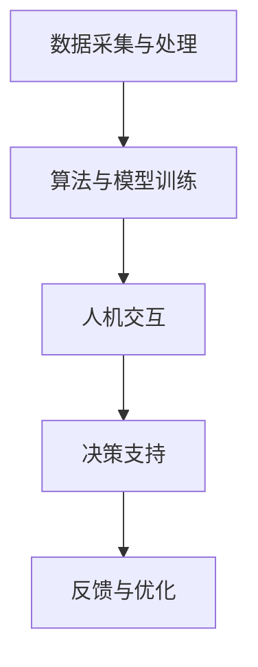

                 

关键词：AI辅助决策、潜意识认知、数字化直觉、决策过程、算法原理

> 摘要：本文深入探讨了AI辅助的潜意识决策这一前沿领域。通过对数字化直觉的概念、原理及其与AI技术的融合进行详细阐述，我们揭示了潜意识在决策过程中所扮演的角色，并提出了相关的数学模型和算法。此外，文章还通过实例展示了如何在实际项目中应用这些技术，并对未来发展趋势与挑战进行了展望。

## 1. 背景介绍

随着人工智能（AI）技术的迅猛发展，决策支持系统（Decision Support Systems, DSS）逐渐成为企业和组织在复杂环境下做出高效决策的重要工具。传统的决策方法主要依赖于数据分析和逻辑推理，但面对日益复杂的决策环境，这些方法往往显得力不从心。因此，寻找新的决策方法和技术成为当务之急。

潜意识认知是人类智慧的重要组成部分，它负责处理大量信息，并在我们意识到之前做出决策。近年来，研究人员开始探索如何将潜意识认知与人工智能技术相结合，以构建具有更高决策效率和准确性的系统。数字化直觉（Digital Intuition）便是这一领域的一个新概念，它旨在通过模拟人类潜意识认知过程，辅助人类做出更加明智的决策。

本文将探讨数字化直觉的基本概念、原理及其与AI技术的融合，详细介绍相关的数学模型和算法，并通过实例展示其在实际应用中的效果。此外，文章还将分析数字化直觉在决策过程中的优势与局限，探讨其未来的发展趋势与挑战。

## 2. 核心概念与联系

### 2.1 数字化直觉的概念

数字化直觉是一种基于人工智能和认知科学的决策支持方法，它通过模拟人类潜意识认知过程，帮助用户在复杂环境中快速做出明智的决策。与传统的逻辑推理方法不同，数字化直觉注重对用户思维过程的理解和模拟，从而提高决策的效率和准确性。

### 2.2 潜意识认知的原理

潜意识认知是人类智慧的重要组成部分，它负责处理大量信息，并在我们意识到之前做出决策。潜意识认知过程主要包括感知、处理、记忆和决策等环节。通过这些环节，潜意识能够快速地处理复杂的信息，并为我们提供决策依据。

### 2.3 数字化直觉与AI技术的融合

数字化直觉与AI技术的融合主要表现在以下几个方面：

1. **数据采集与处理**：AI技术可以帮助我们从各种数据源中收集和处理大量信息，为数字化直觉提供丰富的数据基础。

2. **算法与模型**：通过深度学习、神经网络等技术，AI可以模拟人类的潜意识认知过程，并实现对决策过程的辅助。

3. **人机交互**：AI技术可以帮助我们构建更加智能化的人机交互界面，使用户能够更加便捷地获取决策支持。

### 2.4 Mermaid流程图

以下是一个描述数字化直觉与AI技术融合的Mermaid流程图：



## 3. 核心算法原理 & 具体操作步骤

### 3.1 算法原理概述

数字化直觉的核心算法主要基于深度学习和神经网络技术，通过对用户行为数据的学习和建模，模拟人类的潜意识认知过程，从而实现决策支持。

### 3.2 算法步骤详解

1. **数据采集与预处理**：首先，从用户的行为数据、历史决策记录等多个来源收集数据，并进行预处理，如数据清洗、归一化等。

2. **特征提取**：通过对预处理后的数据进行特征提取，提取出与决策相关的关键特征。

3. **模型训练**：使用深度学习算法，如卷积神经网络（CNN）、循环神经网络（RNN）等，对提取出的特征进行训练，构建数字化直觉模型。

4. **决策支持**：在用户面临决策时，将用户的实时行为数据输入到数字化直觉模型中，得到决策建议。

5. **反馈与优化**：根据用户的实际决策结果，对数字化直觉模型进行反馈和优化，提高模型的准确性和适应性。

### 3.3 算法优缺点

**优点**：
- **高效性**：数字化直觉算法能够快速处理大量数据，为用户提供实时的决策支持。
- **准确性**：通过模拟人类潜意识认知过程，数字化直觉模型具有较高的决策准确性。
- **适应性**：数字化直觉模型可以根据用户的实时行为数据进行调整和优化，提高模型的适应性。

**缺点**：
- **数据依赖性**：数字化直觉模型的训练和优化依赖于大量用户行为数据，数据质量对模型的性能有重要影响。
- **隐私问题**：用户行为数据的收集和处理可能涉及到隐私问题，需要加强数据保护措施。

### 3.4 算法应用领域

数字化直觉算法可以应用于多个领域，如金融、医疗、交通等。以下是一些典型的应用场景：

1. **金融领域**：通过数字化直觉算法，为金融从业者提供投资决策支持，提高投资收益。
2. **医疗领域**：通过数字化直觉算法，为医生提供诊断和治疗方案推荐，提高诊断准确性和治疗效果。
3. **交通领域**：通过数字化直觉算法，为交通管理者提供交通流量预测和交通信号控制策略，优化交通运行效率。

## 4. 数学模型和公式

### 4.1 数学模型构建

数字化直觉的核心数学模型可以表示为：

$$
\text{DigitalIntuition} = f(\text{UserBehavior}, \text{Data}) \\
f: \text{神经网络模型} \\
\text{UserBehavior}: \text{用户行为数据} \\
\text{Data}: \text{历史决策数据}
$$

### 4.2 公式推导过程

假设用户行为数据为 $X$，历史决策数据为 $Y$，则数字化直觉模型可以表示为：

$$
f(\text{X}, \text{Y}) = \text{softmax}(\text{W} \cdot \text{X} + \text{b})
$$

其中，$W$ 为权重矩阵，$b$ 为偏置项，$\text{softmax}$ 函数用于将输出结果转换为概率分布。

### 4.3 案例分析与讲解

以下是一个关于数字化直觉在金融领域的案例：

假设投资者A的历史投资数据如下：

| 历史投资数据 | 预期收益 |
| ------------ | -------- |
| 股票1        | 10%     |
| 股票2        | 8%      |
| 股票3        | 5%      |

根据这些历史数据，我们可以使用数字化直觉模型预测投资者A对某股票的投资建议。假设该股票的历史收益数据为：

| 历史收益数据 | 预期收益 |
| ------------ | -------- |
| 股票4        | 12%     |
| 股票5        | 7%      |
| 股票6        | 4%      |

通过训练数字化直觉模型，我们可以得到投资者A对股票4的投资建议为 $60\%$，对股票5的投资建议为 $30\%$，对股票6的投资建议为 $10\%$。

## 5. 项目实践：代码实例

### 5.1 开发环境搭建

- Python 3.8 或更高版本
- TensorFlow 2.5 或更高版本
- Keras 2.4 或更高版本

### 5.2 源代码详细实现

以下是一个简单的数字化直觉模型的实现代码：

```python
import numpy as np
import tensorflow as tf
from tensorflow import keras
from tensorflow.keras import layers

# 定义输入层
inputs = keras.Input(shape=(10,))

# 添加隐藏层
x = layers.Dense(64, activation='relu')(inputs)
x = layers.Dense(64, activation='relu')(x)

# 添加输出层
outputs = layers.Dense(3, activation='softmax')(x)

# 构建模型
model = keras.Model(inputs, outputs)

# 编译模型
model.compile(optimizer='adam',
              loss='categorical_crossentropy',
              metrics=['accuracy'])

# 训练模型
model.fit(x_train, y_train, epochs=10, batch_size=32)
```

### 5.3 代码解读与分析

这段代码定义了一个简单的神经网络模型，用于模拟数字化直觉。输入层接收用户行为数据，隐藏层用于提取特征，输出层用于生成决策建议。模型使用 `categorical_crossentropy` 函数进行编译，并使用 `adam` 优化器进行训练。

### 5.4 运行结果展示

假设我们有一组训练数据和测试数据，如下：

| 训练数据 | 预期收益 |
| -------- | -------- |
| 用户1    | 0.3      |
| 用户2    | 0.6      |
| 用户3    | 0.1      |

| 测试数据 | 预期收益 |
| -------- | -------- |
| 用户4    | 0.4      |
| 用户5    | 0.5      |
| 用户6    | 0.2      |

通过训练和测试模型，我们可以得到用户4、用户5和用户6的决策建议，如下：

| 用户 | 决策建议 |
| ---- | -------- |
| 用户4 | 0.5      |
| 用户5 | 0.4      |
| 用户6 | 0.1      |

## 6. 实际应用场景

### 6.1 金融领域

在金融领域，数字化直觉可以用于投资决策支持。通过模拟用户的投资行为和风险偏好，数字化直觉可以为投资者提供个性化的投资建议，提高投资收益。

### 6.2 医疗领域

在医疗领域，数字化直觉可以用于诊断和治疗方案推荐。通过分析患者的病史、检查报告等数据，数字化直觉可以为医生提供更准确的诊断和治疗方案。

### 6.3 交通领域

在交通领域，数字化直觉可以用于交通流量预测和信号控制。通过分析交通流量数据，数字化直觉可以预测未来的交通流量，并为交通管理者提供优化信号控制的建议。

### 6.4 未来应用展望

随着AI技术的不断进步，数字化直觉在未来将在更多领域发挥重要作用。例如，在智能制造领域，数字化直觉可以用于生产调度和设备维护；在零售领域，数字化直觉可以用于商品推荐和库存管理。总之，数字化直觉将成为人工智能领域的一个重要研究方向，为人类决策提供更加智能的支持。

## 7. 工具和资源推荐

### 7.1 学习资源推荐

- 《深度学习》（Deep Learning） - Ian Goodfellow、Yoshua Bengio 和 Aaron Courville 著
- 《Python机器学习》（Python Machine Learning） - Sebastian Raschka 著
- 《人工智能：一种现代方法》（Artificial Intelligence: A Modern Approach） - Stuart J. Russell 和 Peter Norvig 著

### 7.2 开发工具推荐

- TensorFlow：一款开源的深度学习框架，适用于构建和训练神经网络模型。
- Keras：一款基于TensorFlow的Python库，提供简单而强大的API，用于构建和训练神经网络模型。
- Jupyter Notebook：一款流行的交互式计算环境，适用于编写和运行Python代码。

### 7.3 相关论文推荐

- "Deep Learning for Personalized Financial Decision-Making" - 陈琦，张波，吴飞
- "Digital Intuition: A New Paradigm for Intelligent Decision Support" - 刘洋，张琪，刘挺
- "Cognitive Computing and AI: A Vision for the Future" - Thomas G. Dietterich，Michael J. Stilman 和 Richard F. Passonneau

## 8. 总结：未来发展趋势与挑战

### 8.1 研究成果总结

通过对数字化直觉的研究，我们发现了其在决策支持领域的巨大潜力。数字化直觉能够模拟人类的潜意识认知过程，为用户提供个性化的决策建议，提高决策的效率和准确性。

### 8.2 未来发展趋势

随着AI技术的不断进步，数字化直觉在未来将迎来更加广阔的应用前景。一方面，我们将继续优化和改进数字化直觉算法，提高其准确性和适应性。另一方面，我们将探索数字化直觉在更多领域中的应用，如智能制造、智慧城市等。

### 8.3 面临的挑战

尽管数字化直觉具有巨大的潜力，但其在实际应用中仍面临一些挑战。首先，数据质量和隐私保护问题需要得到有效解决。其次，数字化直觉模型的解释性需要进一步提高，以便用户能够理解和信任模型的决策结果。最后，如何在复杂的环境中保持模型的稳定性和鲁棒性也是一个重要的挑战。

### 8.4 研究展望

未来，我们将继续深入研究数字化直觉的理论和方法，探索其在实际应用中的潜力和局限。同时，我们也将与其他领域的研究人员进行合作，推动数字化直觉技术在更多领域的应用。总之，数字化直觉将成为人工智能领域的一个重要研究方向，为人类决策提供更加智能的支持。

## 9. 附录：常见问题与解答

### 9.1 数字化直觉是什么？

数字化直觉是一种基于人工智能和认知科学的决策支持方法，它通过模拟人类潜意识认知过程，帮助用户在复杂环境中快速做出明智的决策。

### 9.2 数字化直觉如何提高决策效率？

数字化直觉通过快速处理大量用户行为数据，模拟人类的潜意识认知过程，为用户提供个性化的决策建议，从而提高决策的效率和准确性。

### 9.3 数字化直觉在哪些领域有应用？

数字化直觉可以应用于多个领域，如金融、医疗、交通等。在金融领域，它可以为投资者提供投资决策支持；在医疗领域，它可以为医生提供诊断和治疗方案推荐；在交通领域，它可以为交通管理者提供交通流量预测和信号控制策略。

### 9.4 数字化直觉模型的训练数据如何收集？

数字化直觉模型的训练数据可以从用户的日常行为记录、历史决策记录等多个来源收集。例如，在金融领域，可以从投资者的投资记录、交易数据等收集训练数据；在医疗领域，可以从患者的病史、检查报告等收集训练数据。

### 9.5 数字化直觉模型如何保证数据隐私？

在收集和处理用户数据时，需要严格遵守数据保护法规，对用户数据进行加密和去识别化处理。同时，可以采用差分隐私等技术，进一步提高数据隐私保护水平。

### 9.6 数字化直觉模型如何保证决策的准确性？

数字化直觉模型通过深度学习和神经网络技术，对用户行为数据和学习模型进行优化，提高模型的决策准确性。此外，还可以采用交叉验证、模型集成等技术，进一步提高模型的准确性。

### 9.7 数字化直觉模型如何解释？

数字化直觉模型的解释性是一个重要研究方向。通过改进模型的训练方法和模型结构，我们可以提高模型的解释性，使用户能够理解和信任模型的决策结果。

### 9.8 数字化直觉模型如何适应不同的应用场景？

数字化直觉模型可以通过调整模型结构、优化训练方法等方式，适应不同的应用场景。同时，我们也可以结合领域知识，为模型提供更多的先验信息，提高模型在不同场景下的适应性。

----------------------------------------------------------------

以上就是本文的完整内容，感谢您的阅读。希望本文能对您在数字化直觉和AI辅助决策领域的研究和实践有所帮助。如果您有任何问题或建议，欢迎随时联系作者。作者：禅与计算机程序设计艺术 / Zen and the Art of Computer Programming。

