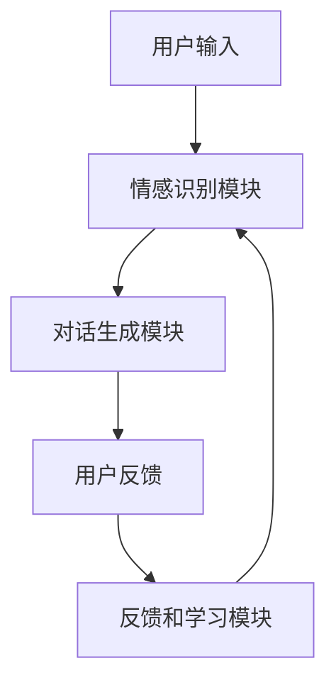

                 

关键词：数字化移情、AI增强、社交智能、培训师、教练

> 摘要：本文深入探讨了数字化移情能力的培养和AI技术在社交智能教练领域的应用。通过定义核心概念、算法原理、数学模型、项目实践及未来展望，文章旨在为读者提供一份全面而深刻的了解，以应对人工智能时代下的社交挑战。

## 1. 背景介绍

### 数字化时代下的社交挑战

随着互联网和移动通信技术的迅猛发展，人类进入了一个高度数字化的社会。在这个时代，人们的社交方式发生了翻天覆地的变化。传统的面对面交流逐渐被网络沟通所取代，例如电子邮件、即时通讯、社交媒体和在线会议等。然而，这种变化并非全是积极向上的。数字化社交带来了许多新的挑战，尤其是社交技能和移情能力的培养。

### 移情能力的重要性

移情能力，即情感认知和同理心，是人际交往中至关重要的一环。它不仅影响个人的心理健康，还影响团队合作、领导力和人际关系管理。然而，在数字化时代，由于面对面交流的减少，许多人的移情能力正在退化。

### AI与社交智能教练

人工智能（AI）技术的发展为解决上述问题提供了一条新的路径。通过AI技术，特别是机器学习和自然语言处理，我们可以开发出能够理解和增强人类社交智能的软件。这些软件可以充当社交智能教练，帮助人们提升他们的移情能力和社交技巧。

## 2. 核心概念与联系

### 定义数字化移情能力

数字化移情能力是指个体在数字环境中进行社交互动时，能够理解和表达他人情感的能力。这包括在线沟通中的语言和非语言线索的解读、情感表达和情感反应。

### AI增强的社交智能教练架构

为了实现数字化移情能力的培养，我们需要一个综合性的架构，其中包括以下核心组件：

1. **情感识别模块**：利用深度学习和图像识别技术，自动分析语音、文本和面部表情中的情感。
2. **对话生成模块**：利用自然语言处理技术，生成适当的回复和反馈，以增强用户的社交互动。
3. **反馈和学习模块**：收集用户的互动数据，不断优化社交智能教练的表现。

### Mermaid 流程图

### 情感识别模块

情感识别模块是整个系统的核心。它利用深度学习和图像识别技术，从用户的语音、文本和面部表情中提取情感信息。

1. **语音情感识别**：通过分析声音的频率、振幅和时长等参数，识别用户的情感状态。
2. **文本情感识别**：利用自然语言处理技术，从文本中提取情感关键词和情感倾向。
3. **面部表情识别**：通过分析面部图像，识别用户的情感表达。

### 对话生成模块

对话生成模块负责根据情感识别模块的结果，生成适当的回复和反馈。这包括：

1. **情感匹配**：根据用户的情感状态，选择相应的情感回应。
2. **情境适应**：根据用户的交流情境，生成合适的对话内容。
3. **个性化建议**：根据用户的历史互动数据，提供个性化的社交建议。

### 反馈和学习模块

反馈和学习模块是系统的自我优化机制。它通过收集用户的互动数据，不断优化情感识别和对话生成的效果。

1. **数据收集**：收集用户的互动数据，包括语音、文本和面部表情。
2. **模型训练**：利用收集到的数据，不断优化情感识别和对话生成模型。
3. **性能评估**：定期评估系统的性能，确保其能够满足用户需求。

## 3. 核心算法原理 & 具体操作步骤

### 3.1 算法原理概述

数字化移情能力的培养依赖于三个核心算法：

1. **情感识别算法**：通过分析语音、文本和面部表情，识别用户的情感状态。
2. **对话生成算法**：根据用户的情感状态和交流情境，生成适当的回复和反馈。
3. **反馈优化算法**：通过用户反馈，不断优化情感识别和对话生成的效果。

### 3.2 算法步骤详解

#### 3.2.1 情感识别算法

1. **数据预处理**：对语音、文本和面部表情数据进行清洗和预处理，包括去噪、归一化和特征提取。
2. **模型训练**：利用预处理的情感数据，训练情感识别模型。
3. **情感预测**：使用训练好的模型，对新的语音、文本和面部表情数据进行情感预测。

#### 3.2.2 对话生成算法

1. **情感匹配**：根据用户的情感状态，选择相应的情感回应。
2. **情境适应**：根据用户的交流情境，生成合适的对话内容。
3. **回复生成**：利用自然语言处理技术，生成自然流畅的回复。

#### 3.2.3 反馈优化算法

1. **数据收集**：收集用户的反馈数据，包括满意度和改进建议。
2. **模型调整**：根据用户反馈，调整情感识别和对话生成模型。
3. **性能评估**：评估调整后的模型性能，确保其满足用户需求。

### 3.3 算法优缺点

#### 优点

1. **高效性**：利用AI技术，情感识别和对话生成过程高效且准确。
2. **个性化**：根据用户反馈，模型能够不断优化，提供个性化的社交建议。
3. **广泛适用**：适用于各种数字社交场景，包括社交媒体、在线教育和远程工作。

#### 缺点

1. **隐私问题**：情感识别和对话生成涉及到用户隐私，需要严格保护用户数据。
2. **模型偏见**：训练数据可能存在偏见，导致模型产生偏见。
3. **技术依赖**：系统依赖于先进的AI技术，技术更新和维护成本较高。

### 3.4 算法应用领域

1. **在线教育**：帮助学生和教师更好地理解彼此的情感状态，提升教学效果。
2. **职场沟通**：帮助企业员工提高沟通技巧，提升团队合作效率。
3. **心理健康**：辅助心理咨询师进行在线咨询，提高治疗效果。

## 4. 数学模型和公式 & 详细讲解 & 举例说明

### 4.1 数学模型构建

数字化移情能力培养的数学模型主要包括情感识别模型和对话生成模型。

#### 4.1.1 情感识别模型

情感识别模型通常采用卷积神经网络（CNN）或循环神经网络（RNN）进行构建。以下是一个基于CNN的情感识别模型的公式表示：

$$
h_{\text{CNN}}(x) = \text{ReLU}(W_1 \cdot \text{flatten}(\text{conv}(\text{normalize}(x)))
$$

其中，$x$ 表示输入数据（语音、文本或面部表情），$W_1$ 表示权重矩阵，$\text{ReLU}$ 表示ReLU激活函数，$\text{flatten}$ 表示将卷积层输出展平为1维向量，$\text{conv}$ 表示卷积操作，$\text{normalize}$ 表示归一化操作。

#### 4.1.2 对话生成模型

对话生成模型通常采用循环神经网络（RNN）或长短期记忆网络（LSTM）进行构建。以下是一个基于LSTM的对

