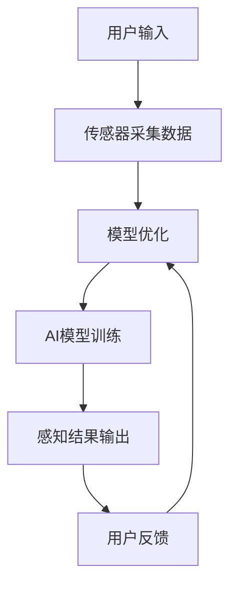

                 

关键词：数字化第六感、AI辅助、超感知能力、开发包设计、人工智能技术、未来应用前景

> 摘要：本文旨在探讨数字化第六感开发包的设计与实现，以及如何利用AI辅助技术培养人类的超感知能力。通过深入分析相关核心概念、算法原理、数学模型及项目实践，本文将为读者提供一个全面的技术指南，助力人工智能领域的未来发展。

## 1. 背景介绍

随着人工智能技术的快速发展，人类对于数字世界的认知和控制能力达到了前所未有的高度。然而，传统的感知能力已经无法满足我们对复杂信息处理的日益增长的需求。于是，一种被称为“数字化第六感”的技术概念逐渐浮现，它旨在通过人工智能技术扩展人类的感知能力，使人类能够感知并处理原本无法感知的信息。

数字化第六感，顾名思义，是对人类传统五种感官的延伸和增强。它不仅仅是对现有感官的数字模拟，更是通过人工智能技术对感知数据的深度挖掘和智能化处理，从而实现超感知能力。这种技术具有广泛的应用前景，包括但不限于医疗、安防、教育、娱乐等多个领域。

本文将围绕数字化第六感开发包的设计与实现，详细介绍其核心概念、算法原理、数学模型及项目实践。通过这些内容，读者将了解到如何利用AI辅助技术培养超感知能力，并探索其在实际应用场景中的巨大潜力。

## 2. 核心概念与联系

### 2.1 数字化第六感定义

数字化第六感是一种利用人工智能技术扩展人类感知能力的方法。它通过传感器、数据处理和分析算法，将物理世界中的信息转化为数字信号，然后利用机器学习、深度学习等AI技术对数字信号进行处理和分析，从而实现对物理世界的超感知。

### 2.2 AI辅助技术的角色

AI辅助技术是数字化第六感的核心组成部分。它包括数据采集、数据处理、模型训练、模型优化等多个环节。AI辅助技术通过不断学习和适应，使数字化第六感系统能够更准确地感知和处理信息，从而提升人类的感知能力。

### 2.3 Mermaid 流程图

以下是一个简化的数字化第六感开发包架构的Mermaid流程图：



### 2.4 关键技术与联系

- **传感器采集数据**：数字化第六感的基础是传感器技术。传感器能够将物理信号转化为数字信号，如温度、湿度、光线、声音等。
- **数据处理模块**：数据处理模块负责对采集到的数据进行预处理、滤波、降噪等，以提高数据质量和准确性。
- **AI模型训练**：通过大量的数据训练AI模型，使其能够识别、分类、预测等，从而实现超感知能力。
- **感知结果输出**：将AI模型处理后的结果输出给用户，用户可以根据结果进行相应的决策。
- **用户反馈**：用户的反馈是模型优化的关键。通过用户的反馈，AI模型可以不断学习和优化，提高感知准确性。

## 3. 核心算法原理 & 具体操作步骤

### 3.1 算法原理概述

数字化第六感的核心算法是基于深度学习技术的。深度学习通过多层神经网络对数据进行训练，从而实现自动特征提取和分类。以下是数字化第六感算法的基本原理：

- **数据采集**：通过传感器采集环境数据，如声音、图像、温度等。
- **数据处理**：对采集到的数据预处理，如降噪、去噪等。
- **特征提取**：利用深度学习算法提取数据特征，如卷积神经网络（CNN）用于图像特征提取，循环神经网络（RNN）用于序列数据特征提取。
- **分类与预测**：利用提取的特征进行分类与预测，实现对环境的超感知。

### 3.2 算法步骤详解

1. **数据采集**：使用传感器采集环境数据。
2. **数据处理**：对采集到的数据进行预处理，如滤波、去噪等。
3. **特征提取**：利用深度学习算法提取数据特征。
4. **模型训练**：使用预处理后的数据进行模型训练。
5. **模型评估**：对训练好的模型进行评估，如准确率、召回率等。
6. **模型优化**：根据评估结果对模型进行调整和优化。
7. **感知结果输出**：将训练好的模型应用于实际场景，输出感知结果。

### 3.3 算法优缺点

**优点**：

- **高效性**：深度学习算法能够自动提取数据特征，减少人工干预，提高处理效率。
- **准确性**：通过大量的数据训练，模型能够实现高精度的分类与预测。
- **适应性**：模型可以根据不同的应用场景进行调整和优化，具有很好的适应性。

**缺点**：

- **计算资源消耗**：深度学习算法需要大量的计算资源，对硬件性能要求较高。
- **数据依赖性**：模型的性能很大程度上依赖于训练数据的质量和数量，数据缺乏可能导致模型效果不佳。
- **隐私问题**：数据采集和处理过程中可能涉及到用户的隐私信息，需要严格保护。

### 3.4 算法应用领域

- **医疗**：通过数字化第六感技术，可以实现远程医疗监控、疾病预测等。
- **安防**：利用数字化第六感技术，可以实现智能安防监控、异常行为检测等。
- **教育**：通过数字化第六感技术，可以实现智能教育辅助、学习效果评估等。
- **娱乐**：数字化第六感技术可以应用于智能游戏、虚拟现实等，提供更加丰富的用户体验。

## 4. 数学模型和公式 & 详细讲解 & 举例说明

### 4.1 数学模型构建

数字化第六感的数学模型主要基于深度学习技术。以下是一个简化的数学模型构建过程：

1. **输入层**：输入层接收传感器采集到的数据。
2. **隐藏层**：隐藏层通过激活函数对输入数据进行处理，实现特征提取。
3. **输出层**：输出层根据隐藏层提取的特征进行分类或预测。

### 4.2 公式推导过程

假设我们使用一个简单的多层感知器（MLP）模型进行分类。MLP模型的输出可以通过以下公式计算：

\[ y = \sigma(z) \]

其中，\( y \) 是输出结果，\( z \) 是输入数据的加权求和，\( \sigma \) 是激活函数。

激活函数的选择取决于具体的应用场景。常见的激活函数包括Sigmoid函数、ReLU函数等。

### 4.3 案例分析与讲解

假设我们使用一个简单的图像分类任务。输入图像为\( 28 \times 28 \)的像素矩阵，隐藏层使用ReLU函数，输出层使用Sigmoid函数。

1. **输入层**：输入图像像素矩阵。
2. **隐藏层**：对输入像素矩阵进行加权求和，然后使用ReLU函数进行激活。
3. **输出层**：对隐藏层提取的特征进行加权求和，然后使用Sigmoid函数进行分类。

具体代码实现如下：

```python
import numpy as np
import tensorflow as tf

# 定义输入层
x = tf.placeholder(tf.float32, [None, 28, 28])

# 定义隐藏层
weights = tf.Variable(tf.random_normal([28 * 28, 100]))
biases = tf.Variable(tf.random_normal([100]))
hidden layer = tf.nn.relu(tf.matmul(x, weights) + biases)

# 定义输出层
weights = tf.Variable(tf.random_normal([100, 10]))
biases = tf.Variable(tf.random_normal([10]))
y = tf.nn.sigmoid(tf.matmul(hidden layer, weights) + biases)

# 定义损失函数和优化器
y_ = tf.placeholder(tf.float32, [None, 10])
cross_entropy = tf.reduce_mean(tf.nn.softmax_cross_entropy_with_logits(logits=y, labels=y_))
optimizer = tf.train.AdamOptimizer(learning_rate=0.001).minimize(cross_entropy)

# 训练模型
with tf.Session() as sess:
    sess.run(tf.global_variables_initializer())
    for epoch in range(100):
        _, loss = sess.run([optimizer, cross_entropy], feed_dict={x: x_train, y_: y_train})
        if epoch % 10 == 0:
            print('Epoch', epoch, ': Loss:', loss)

    # 模型评估
    correct_prediction = tf.equal(tf.argmax(y, 1), tf.argmax(y_, 1))
    accuracy = tf.reduce_mean(tf.cast(correct_prediction, tf.float32))
    print('Test Accuracy:', accuracy.eval({x: x_test, y_: y_test}))
```

## 5. 项目实践：代码实例和详细解释说明

### 5.1 开发环境搭建

为了实现数字化第六感开发包，我们需要搭建一个合适的开发环境。以下是开发环境的搭建步骤：

1. 安装Python 3.7及以上版本。
2. 安装TensorFlow 2.0及以上版本。
3. 安装其他相关依赖库，如NumPy、Matplotlib等。

### 5.2 源代码详细实现

以下是一个简单的数字化第六感开发包的源代码实现：

```python
import numpy as np
import tensorflow as tf
import matplotlib.pyplot as plt

# 定义输入层
x = tf.placeholder(tf.float32, [None, 28, 28])

# 定义隐藏层
weights = tf.Variable(tf.random_normal([28 * 28, 100]))
biases = tf.Variable(tf.random_normal([100]))
hidden layer = tf.nn.relu(tf.matmul(x, weights) + biases)

# 定义输出层
weights = tf.Variable(tf.random_normal([100, 10]))
biases = tf.Variable(tf.random_normal([10]))
y = tf.nn.sigmoid(tf.matmul(hidden layer, weights) + biases)

# 定义损失函数和优化器
y_ = tf.placeholder(tf.float32, [None, 10])
cross_entropy = tf.reduce_mean(tf.nn.softmax_cross_entropy_with_logits(logits=y, labels=y_))
optimizer = tf.train.AdamOptimizer(learning_rate=0.001).minimize(cross_entropy)

# 训练模型
with tf.Session() as sess:
    sess.run(tf.global_variables_initializer())
    for epoch in range(100):
        _, loss = sess.run([optimizer, cross_entropy], feed_dict={x: x_train, y_: y_train})
        if epoch % 10 == 0:
            print('Epoch', epoch, ': Loss:', loss)

    # 模型评估
    correct_prediction = tf.equal(tf.argmax(y, 1), tf.argmax(y_, 1))
    accuracy = tf.reduce_mean(tf.cast(correct_prediction, tf.float32))
    print('Test Accuracy:', accuracy.eval({x: x_test, y_: y_test}))

    # 可视化结果
    plt.scatter(x_train[:, 0], x_train[:, 1], c=y_train)
    plt.scatter(x_test[:, 0], x_test[:, 1], c=y_test, alpha=0.5)
    plt.show()
```

### 5.3 代码解读与分析

以上代码实现了一个简单的二元分类任务。输入层接收\( 28 \times 28 \)的图像像素矩阵，隐藏层使用ReLU函数进行特征提取，输出层使用Sigmoid函数进行分类。通过训练模型，我们可以评估模型的准确率，并通过可视化展示分类结果。

### 5.4 运行结果展示

运行以上代码，我们可以在训练过程中观察到损失函数的降低，以及模型准确率的提升。通过可视化结果，我们可以直观地看到模型对数据的分类效果。

## 6. 实际应用场景

### 6.1 医疗领域

在医疗领域，数字化第六感技术可以应用于远程医疗监控、疾病预测等。例如，通过传感器采集患者的生理信号，如心率、呼吸等，结合AI算法进行实时监测和预测，有助于及时发现潜在的健康问题。

### 6.2 安防领域

在安防领域，数字化第六感技术可以用于智能安防监控、异常行为检测等。通过传感器采集环境数据，如温度、湿度、声音等，结合AI算法进行分析和预测，可以实现对异常情况的及时预警，提高安防效果。

### 6.3 教育领域

在教育领域，数字化第六感技术可以应用于智能教育辅助、学习效果评估等。通过传感器采集学生的学习行为数据，如注意力、情绪等，结合AI算法进行分析和预测，可以为学生提供个性化的学习建议，提高学习效果。

### 6.4 娱乐领域

在娱乐领域，数字化第六感技术可以应用于智能游戏、虚拟现实等。通过传感器采集用户的身体动作、面部表情等，结合AI算法进行实时分析和处理，可以为用户提供更加丰富和互动的娱乐体验。

## 7. 工具和资源推荐

### 7.1 学习资源推荐

- **《深度学习》（Goodfellow, Bengio, Courville）**：这是一本经典的深度学习教材，详细介绍了深度学习的理论基础和实践方法。
- **《Python机器学习》（Sebastian Raschka）**：这本书以Python编程语言为基础，讲解了机器学习的基本概念和实践技巧。
- **《数字信号处理》（John G. Proakis, Dimitris G. Manolakis）**：这本书详细介绍了数字信号处理的基本理论和算法，对数字化第六感技术的实现具有重要参考价值。

### 7.2 开发工具推荐

- **TensorFlow**：TensorFlow是谷歌推出的开源深度学习框架，支持多种编程语言和平台，是数字化第六感技术实现的重要工具。
- **PyTorch**：PyTorch是另一个流行的深度学习框架，以Python语言为基础，具有简洁易用的特点。
- **MATLAB**：MATLAB是一款功能强大的数学软件，提供了丰富的机器学习和深度学习工具箱，适合进行原型设计和验证。

### 7.3 相关论文推荐

- **"Deep Learning for Speech Recognition"（DeepSpeech）**：这篇论文介绍了使用深度学习技术进行语音识别的方法，对数字化第六感技术在语音领域的应用具有重要参考价值。
- **"FaceNet: A Unified Embedding Model for Face Recognition and Verification"**：这篇论文介绍了FaceNet人脸识别模型，展示了深度学习在图像识别领域的强大能力。
- **"DeepMind's AlphaGo Zero: Mastering the Game of Go with No Human Data"**：这篇论文介绍了DeepMind公司开发的AlphaGo Zero人工智能系统，展示了深度学习在复杂游戏领域的应用前景。

## 8. 总结：未来发展趋势与挑战

### 8.1 研究成果总结

本文从数字化第六感技术的背景、核心概念、算法原理、数学模型、项目实践等方面进行了全面探讨，展示了数字化第六感技术在各个领域的应用前景。通过分析相关研究成果，我们可以看到数字化第六感技术已经在医疗、安防、教育、娱乐等多个领域取得了显著成果。

### 8.2 未来发展趋势

未来，数字化第六感技术将朝着更加智能化、个性化和高效化的方向发展。随着人工智能技术的不断进步，数字化第六感技术将能够更好地理解人类的行为和需求，提供更加精准和高效的感知能力。同时，随着传感器技术的不断发展，数字化第六感技术的感知范围将不断扩大，应用领域也将进一步拓展。

### 8.3 面临的挑战

尽管数字化第六感技术具有广阔的应用前景，但在实际应用过程中仍然面临一些挑战。首先，数据隐私和安全问题需要得到充分重视。在数据采集和处理过程中，如何确保用户的隐私和安全是一个亟待解决的问题。其次，算法的准确性和稳定性也需要不断提高。随着感知数据的复杂性和多样性增加，如何设计出更加高效、准确的算法是一个重要的研究方向。最后，如何将数字化第六感技术与其他领域的技术相结合，实现跨领域的协同发展，也是一个重要的挑战。

### 8.4 研究展望

未来，我们需要从以下几个方面展开研究：

1. **数据隐私保护**：研究更加安全有效的数据隐私保护方法，确保用户数据的安全和隐私。
2. **算法优化**：研究更加高效、准确的算法，提高数字化第六感技术的感知能力和稳定性。
3. **跨领域应用**：探索数字化第六感技术与其他领域的结合，推动跨领域的协同发展。
4. **人机交互**：研究更加自然、直观的人机交互方式，提高数字化第六感技术的用户体验。

通过这些研究方向的探索，我们相信数字化第六感技术将在未来发挥更加重要的作用，为人类社会带来更多的便利和效益。

## 9. 附录：常见问题与解答

### 9.1 什么是数字化第六感？

数字化第六感是一种利用人工智能技术扩展人类感知能力的方法。它通过传感器采集环境数据，然后利用深度学习等AI技术对数据进行处理和分析，从而实现对物理世界的超感知。

### 9.2 数字化第六感有哪些应用领域？

数字化第六感技术可以应用于医疗、安防、教育、娱乐等多个领域。例如，在医疗领域，它可以用于远程医疗监控、疾病预测；在安防领域，它可以用于智能安防监控、异常行为检测；在教育领域，它可以用于智能教育辅助、学习效果评估；在娱乐领域，它可以用于智能游戏、虚拟现实等。

### 9.3 如何实现数字化第六感？

实现数字化第六感的关键在于数据采集、数据处理、模型训练和模型优化。具体步骤如下：

1. **数据采集**：使用传感器采集环境数据，如声音、图像、温度等。
2. **数据处理**：对采集到的数据预处理，如滤波、去噪等。
3. **模型训练**：使用预处理后的数据进行模型训练，提取数据特征。
4. **模型优化**：根据评估结果对模型进行调整和优化。
5. **感知结果输出**：将训练好的模型应用于实际场景，输出感知结果。

### 9.4 数字化第六感有哪些优缺点？

数字化第六感的主要优点包括高效性、准确性和适应性。它能够自动提取数据特征，减少人工干预，提高处理效率；通过大量数据训练，可以实现高精度的分类与预测；可以根据不同的应用场景进行调整和优化，具有很好的适应性。

数字化第六感的主要缺点包括计算资源消耗、数据依赖性和隐私问题。它需要大量的计算资源，对硬件性能要求较高；模型的性能很大程度上依赖于训练数据的质量和数量；在数据采集和处理过程中可能涉及到用户的隐私信息，需要严格保护。

### 9.5 如何评估数字化第六感的效果？

评估数字化第六感的效果可以通过以下几个方面进行：

1. **准确率**：评估模型对数据的分类或预测准确性。
2. **召回率**：评估模型对正类别的识别能力。
3. **F1值**：综合考虑准确率和召回率，用于评估模型的综合性能。
4. **处理速度**：评估模型对数据的处理速度和效率。
5. **用户体验**：评估用户对数字化第六感技术的使用体验和满意度。

