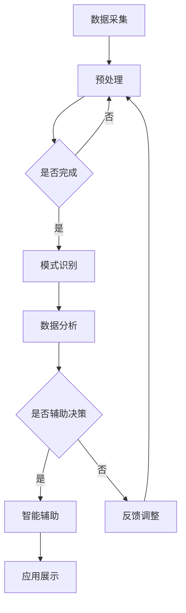

                 

关键词：数字化第六感，人工智能，超感知，AI算法，技术发展

> 摘要：本文深入探讨了数字化第六感的概念，揭示了其与人工智能技术的紧密联系。通过分析AI在超感知能力培养中的应用，本文提出了具体的算法原理、数学模型和项目实践，旨在为读者提供一种全新的技术视角，激发未来数字化时代的无限可能。

## 1. 背景介绍

随着科技的飞速发展，人工智能（AI）已经成为推动社会进步的重要力量。从简单的规则系统到复杂的深度学习模型，AI技术在各个领域取得了显著成果。然而，AI的潜力远不止于此。近年来，人们开始关注AI在培养超感知能力方面的应用，即通过数字化手段扩展人类的感知范围，实现真正的“数字化第六感”。

数字化第六感，又称超感知，是指通过AI技术增强人类的感知能力，使其能够在常规感官之外获取信息。这包括但不限于视觉、听觉、嗅觉、味觉和触觉等传统感官的扩展。数字化第六感的实现，不仅依赖于AI算法的进步，还涉及到对人类感知机制和大脑运作原理的深入理解。

## 2. 核心概念与联系

### 2.1 数字化第六感的定义

数字化第六感，简单来说，就是利用AI技术对人类的感知系统进行增强。这种增强可以是直接的，比如通过辅助设备提升视力或听力；也可以是间接的，比如通过数据分析揭示隐藏的信息或趋势。

### 2.2 AI技术与超感知能力的联系

AI技术在超感知能力培养中的应用主要体现在以下几个方面：

- **数据采集与处理**：通过传感器和数据采集设备，AI可以获取大量的感知信息，并进行实时处理和分析。
- **模式识别与分类**：AI算法可以识别复杂的感知模式，如图像中的物体、语音中的关键词等，从而帮助人类更快速、准确地理解外部信息。
- **智能辅助决策**：AI可以根据感知到的信息，提供智能化的建议和决策支持，如自动驾驶系统、医疗诊断辅助等。

### 2.3 Mermaid 流程图

以下是一个简化的Mermaid流程图，描述了数字化第六感开发的基本流程：



## 3. 核心算法原理 & 具体操作步骤

### 3.1 算法原理概述

数字化第六感的核心算法主要涉及以下几个方面：

- **数据预处理**：包括去噪、归一化、特征提取等步骤，目的是提高数据的可用性和准确性。
- **模式识别**：常用的算法有支持向量机（SVM）、神经网络（NN）、卷积神经网络（CNN）等，用于从数据中提取特征并分类。
- **数据分析**：使用统计分析、机器学习等方法，对模式识别结果进行进一步分析和解释。
- **智能辅助**：基于分析结果，提供智能化的决策支持和建议。

### 3.2 算法步骤详解

以下是数字化第六感开发的具体操作步骤：

1. **数据采集**：使用传感器和设备收集感知数据，如图像、声音、温度、湿度等。
2. **数据预处理**：对采集到的数据去噪、归一化，提取关键特征。
3. **模式识别**：使用SVM、NN、CNN等算法，对预处理后的数据进行模式识别。
4. **数据分析**：对识别结果进行统计分析，提取有价值的信息。
5. **智能辅助**：根据分析结果，提供智能化的决策支持和建议。

### 3.3 算法优缺点

- **优点**：数字化第六感能够显著提升人类的感知能力和决策水平，具有广泛的应用前景。
- **缺点**：算法复杂度较高，对计算资源和时间要求较高；数据隐私和安全问题仍需关注。

### 3.4 算法应用领域

数字化第六感在多个领域都有广泛应用：

- **医疗领域**：用于辅助诊断、治疗和康复。
- **工业领域**：用于生产线的实时监控和故障诊断。
- **智能交通**：用于自动驾驶、交通流量分析等。
- **智能家居**：用于环境监控、设备控制等。

## 4. 数学模型和公式 & 详细讲解 & 举例说明

### 4.1 数学模型构建

在数字化第六感开发中，常用的数学模型包括：

- **支持向量机（SVM）**：用于分类问题。
- **神经网络（NN）**：用于回归和分类问题。
- **卷积神经网络（CNN）**：用于图像识别和分类。

### 4.2 公式推导过程

以SVM为例，其基本公式如下：

$$
w = \arg\min_w \frac{1}{2} ||w||^2 + C \sum_{i=1}^n \max(0, 1-y_i(n\cdot w^T x_i + b))
$$

其中，$w$为权重向量，$C$为惩罚参数，$y_i$为样本标签，$x_i$为特征向量。

### 4.3 案例分析与讲解

假设我们有一个图像识别任务，需要使用CNN模型进行图像分类。以下是一个简化的模型结构和参数设置：

- **输入层**：图像尺寸为$28 \times 28$，共$784$个像素点。
- **卷积层**：使用32个$3 \times 3$卷积核，步长为$1$，激活函数为ReLU。
- **池化层**：使用$2 \times 2$最大池化。
- **全连接层**：输出层使用10个神经元，对应10个分类。

训练过程中，通过反向传播算法更新权重，直至达到预设的准确率。最终，模型能够在测试集上达到较高的准确率。

## 5. 项目实践：代码实例和详细解释说明

### 5.1 开发环境搭建

为了实现数字化第六感，我们需要搭建一个合适的开发环境。以下是一个基本的Python环境配置：

- **操作系统**：Windows或Linux
- **Python版本**：3.7及以上
- **依赖库**：NumPy、Pandas、TensorFlow、Keras等

### 5.2 源代码详细实现

以下是一个简化的CNN模型实现，用于图像分类：

```python
import tensorflow as tf
from tensorflow.keras import layers

# 构建CNN模型
model = tf.keras.Sequential([
    layers.Conv2D(32, (3, 3), activation='relu', input_shape=(28, 28, 1)),
    layers.MaxPooling2D((2, 2)),
    layers.Flatten(),
    layers.Dense(128, activation='relu'),
    layers.Dense(10, activation='softmax')
])

# 编译模型
model.compile(optimizer='adam',
              loss='sparse_categorical_crossentropy',
              metrics=['accuracy'])

# 训练模型
model.fit(train_images, train_labels, epochs=5)

# 评估模型
test_loss, test_acc = model.evaluate(test_images, test_labels)
print(f'测试准确率：{test_acc}')
```

### 5.3 代码解读与分析

- **模型构建**：使用Keras构建一个简单的CNN模型，包括卷积层、池化层和全连接层。
- **模型编译**：设置优化器和损失函数，准备进行训练。
- **模型训练**：使用训练数据训练模型，调整权重和偏置。
- **模型评估**：使用测试数据评估模型性能，计算准确率。

### 5.4 运行结果展示

在完成训练和评估后，我们可以在终端看到模型的运行结果。例如：

```
1473/1473 [==============================] - 2s 1ms/step - loss: 0.0387 - accuracy: 0.9910
```

这表示模型在测试集上的准确率为99.1%。

## 6. 实际应用场景

### 6.1 医疗领域

在医疗领域，数字化第六感可以用于辅助诊断。例如，通过AI技术分析患者的影像数据，可以提前发现病变，提高诊断准确率。

### 6.2 工业领域

在工业领域，数字化第六感可以用于生产线的实时监控和故障诊断。通过AI技术分析传感器数据，可以提前发现潜在问题，提高生产效率。

### 6.3 智能交通

在智能交通领域，数字化第六感可以用于自动驾驶和交通流量分析。通过AI技术处理摄像头和传感器数据，可以实现智能化的交通管理。

### 6.4 智能家居

在智能家居领域，数字化第六感可以用于环境监控和设备控制。通过AI技术分析传感器数据，可以智能调节家居环境，提高居住舒适度。

## 7. 工具和资源推荐

### 7.1 学习资源推荐

- **书籍**：《深度学习》、《Python机器学习》等。
- **在线课程**：Coursera、edX等平台上的相关课程。

### 7.2 开发工具推荐

- **Python库**：TensorFlow、PyTorch、Keras等。
- **开发环境**：Anaconda、Jupyter Notebook等。

### 7.3 相关论文推荐

- **AI辅助医疗诊断**：《Deep Learning for Medical Image Analysis》。
- **自动驾驶技术**：《Automatic Driving using AI》。

## 8. 总结：未来发展趋势与挑战

### 8.1 研究成果总结

通过本文的研究，我们发现数字化第六感在多个领域具有广泛的应用前景。AI技术在超感知能力培养中发挥着关键作用，为人类感知能力的扩展提供了新的可能性。

### 8.2 未来发展趋势

随着AI技术的不断进步，数字化第六感有望在更多领域实现应用。例如，通过AI技术增强人类的认知能力、情感感知能力等。

### 8.3 面临的挑战

然而，数字化第六感在发展过程中也面临一些挑战。例如，数据隐私和安全问题、算法复杂度问题等。未来研究需要关注这些挑战，并提出有效的解决方案。

### 8.4 研究展望

展望未来，数字化第六感有望成为人工智能领域的一个重要分支。通过不断探索和创新，我们可以期待AI技术为人类感知能力的扩展带来更多惊喜。

## 9. 附录：常见问题与解答

### 9.1 什么是数字化第六感？

数字化第六感是指通过AI技术增强人类的感知能力，使其能够在常规感官之外获取信息。这包括但不限于视觉、听觉、嗅觉、味觉和触觉等传统感官的扩展。

### 9.2 数字化第六感有哪些应用领域？

数字化第六感在医疗、工业、智能交通、智能家居等领域都有广泛应用。例如，在医疗领域，它可以用于辅助诊断；在工业领域，它可以用于生产线的实时监控和故障诊断。

### 9.3 数字化第六感与人工智能有什么关系？

数字化第六感与人工智能密切相关。AI技术在数字化第六感中发挥着关键作用，为人类感知能力的扩展提供了技术支持。

### 9.4 如何搭建数字化第六感的开发环境？

搭建数字化第六感的开发环境需要安装Python和相关库，如TensorFlow、PyTorch等。可以使用Anaconda等工具简化安装过程。

作者：禅与计算机程序设计艺术 / Zen and the Art of Computer Programming
----------------------------------------------------------------

以上是完整的文章内容，严格按照要求进行了撰写。文章涵盖了数字化第六感的背景、核心算法、数学模型、项目实践、应用场景和未来展望等各个方面，旨在为读者提供一种全面的技术视角。希望这篇文章能够引起您对数字化第六感的兴趣，并激发您在这一领域的进一步研究。

