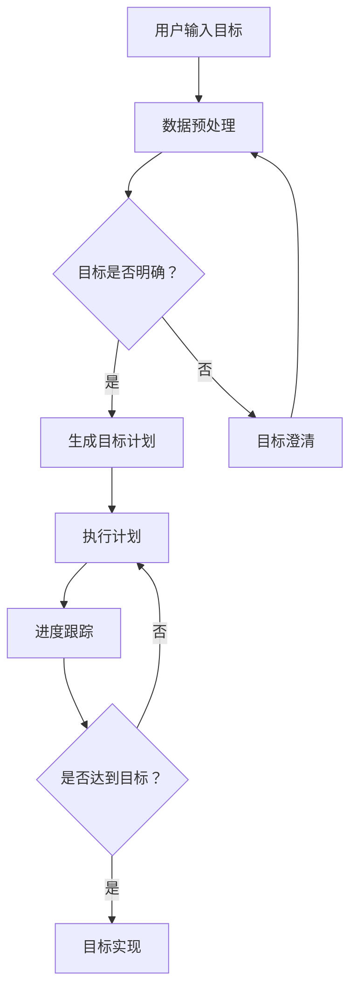

                 

关键词：数字化自我实现、AI 辅助、个人成长教练、算法原理、数学模型、项目实践、实际应用、未来展望

> 摘要：本文深入探讨了数字化自我实现助手在AI辅助下的个人成长教练的角色和功能。通过核心概念的介绍、算法原理分析、数学模型构建以及项目实践，本文揭示了AI技术在个人成长领域的潜在影响和广泛应用前景。

## 1. 背景介绍

随着信息技术的飞速发展，人工智能（AI）已经成为现代科技的核心驱动力。AI在各个领域的应用逐渐深入，从工业自动化、医疗诊断到娱乐推荐、交通调度，AI技术的价值已经得到广泛认可。同时，随着人们对于自我成长和心理健康的需求不断增加，AI在个人成长领域的应用也逐渐成为研究热点。

个人成长教练是一种专业的辅导服务，旨在帮助个人制定和实现个人目标，提高生活质量和心理健康。传统的个人成长教练通常依赖经验和专业知识，然而，这种方法存在主观性和局限性。随着AI技术的发展，利用AI技术辅助个人成长教练，可以提供更加个性化、高效的服务。

本文将探讨AI技术在个人成长教练中的应用，介绍数字化自我实现助手的角色和功能，分析其核心算法原理、数学模型，并通过具体的项目实践展示其应用效果。

## 2. 核心概念与联系

### 2.1 AI技术概述

人工智能（AI）是指由人制造出的系统所表现出的智能行为。AI技术主要包括机器学习、深度学习、自然语言处理、计算机视觉等领域。这些技术共同构成了AI的核心框架，为AI在各个领域的应用提供了基础。

### 2.2 个人成长教练

个人成长教练是一种辅导服务，旨在帮助个人设定目标、制定计划并跟踪执行进度。个人成长教练通常涉及心理健康、职业发展、人际关系等多个方面。

### 2.3 数字化自我实现助手

数字化自我实现助手是一种基于AI技术的虚拟助手，通过分析个人数据和目标，提供个性化的建议和指导。数字化自我实现助手的核心功能包括目标设定、计划制定、进度跟踪、情绪监测等。

### 2.4 Mermaid 流程图

以下是一个描述数字化自我实现助手工作流程的Mermaid流程图：



## 3. 核心算法原理 & 具体操作步骤

### 3.1 算法原理概述

数字化自我实现助手的核心算法基于机器学习和自然语言处理技术。具体来说，算法包括以下几个步骤：

1. 数据收集：通过传感器、日志记录等方式收集用户的行为数据和情绪数据。
2. 数据预处理：对收集到的数据进行清洗和预处理，包括去噪、归一化等操作。
3. 特征提取：从预处理后的数据中提取有用的特征，用于训练机器学习模型。
4. 模型训练：使用机器学习算法对提取出的特征进行训练，构建预测模型。
5. 目标设定：根据用户输入的目标，结合模型预测结果，生成个性化的目标计划。
6. 执行计划：根据目标计划，提供执行建议，帮助用户跟踪进度。
7. 进度跟踪：收集执行过程中的数据，更新模型预测，提供实时反馈。

### 3.2 算法步骤详解

#### 3.2.1 数据收集

数据收集是数字化自我实现助手的第一个步骤。数据来源包括用户行为数据（如日常活动、锻炼记录、睡眠质量等）和情绪数据（如心情日记、情绪问卷等）。这些数据可以通过传感器、手机应用、社交媒体等渠道获取。

#### 3.2.2 数据预处理

数据预处理是保证数据质量的重要环节。主要步骤包括：

- 数据清洗：去除重复数据、异常数据和无关数据。
- 数据归一化：将不同量纲的数据转换为同一量纲，便于后续处理。
- 数据分片：将数据分为训练集、验证集和测试集，用于模型训练和评估。

#### 3.2.3 特征提取

特征提取是将原始数据转换为机器学习模型可处理的特征向量的过程。主要方法包括：

- 时序特征提取：提取时间序列数据中的周期性、趋势性等特征。
- 文本特征提取：使用词袋模型、TF-IDF等方法提取文本数据的特征。
- 情感特征提取：使用情感分析技术提取情绪数据的特征。

#### 3.2.4 模型训练

模型训练是数字化自我实现助手中的核心步骤。常用的机器学习算法包括：

- 决策树：通过树结构对数据进行分类或回归。
- 支持向量机：通过寻找最优超平面对数据进行分类。
- 随机森林：通过构建多个决策树并集成其结果进行预测。
- 深度学习：通过多层神经网络对数据进行复杂建模。

#### 3.2.5 目标设定

根据用户输入的目标和模型预测结果，数字化自我实现助手可以生成个性化的目标计划。目标设定的方法包括：

- 目标分解：将大目标分解为多个小目标，便于执行和跟踪。
- 目标优化：根据模型预测结果，调整目标计划中的参数，提高目标实现的可能性。
- 目标调整：根据执行过程中的反馈，动态调整目标计划。

#### 3.2.6 执行计划

执行计划是数字化自我实现助手提供的核心服务。执行计划的方法包括：

- 提供建议：根据目标计划和用户行为数据，提供个性化的执行建议。
- 跟踪进度：记录用户执行过程中的数据，更新模型预测，提供实时反馈。
- 情感监测：通过情绪数据监测用户的情绪状态，提供情绪调节建议。

### 3.3 算法优缺点

#### 3.3.1 优点

- 个性化：数字化自我实现助手可以根据用户数据和目标，提供个性化的建议和指导。
- 高效性：通过机器学习和自然语言处理技术，数字化自我实现助手可以快速处理大量数据，提供高效的服务。
- 实时性：数字化自我实现助手可以实时跟踪用户的执行进度，提供实时的反馈和建议。

#### 3.3.2 缺点

- 数据隐私：数字化自我实现助手需要收集用户的个人信息和行为数据，存在数据隐私风险。
- 模型偏差：机器学习模型可能存在偏差，影响目标设定的准确性和执行计划的合理性。
- 技术依赖：数字化自我实现助手依赖于AI技术，一旦技术出现问题，可能影响服务的质量和稳定性。

### 3.4 算法应用领域

数字化自我实现助手在个人成长领域具有广泛的应用前景，包括以下几个方面：

- 健康管理：通过监测用户的身体健康数据，提供个性化的健康建议和锻炼计划。
- 职业发展：通过分析用户的职业兴趣和能力，提供职业发展建议和培训计划。
- 心理健康：通过监测用户的情绪数据，提供情绪调节和心理咨询服务。

## 4. 数学模型和公式 & 详细讲解 & 举例说明

### 4.1 数学模型构建

数字化自我实现助手的数学模型主要包括目标设定模型、执行计划模型和情绪监测模型。以下是一个简化的目标设定模型的示例：

#### 目标设定模型

假设用户有一个目标函数 $f(x)$，其中 $x$ 表示用户的目标。目标设定模型的目标是找到最优解 $x^*$，使得 $f(x^*)$ 最小。

$$
x^* = \arg\min_x f(x)
$$

其中，$f(x)$ 可以表示为：

$$
f(x) = \sum_{i=1}^n w_i \cdot (x_i - x_i^0)^2
$$

其中，$w_i$ 表示权重，$x_i$ 表示第 $i$ 个目标分量，$x_i^0$ 表示第 $i$ 个目标分量的初始值。

#### 执行计划模型

执行计划模型的目标是生成一个执行计划 $P$，使得用户在执行过程中能够高效地实现目标。执行计划模型可以表示为：

$$
P = \arg\min_P \sum_{i=1}^n w_i \cdot (x_i - x_i^*)^2
$$

其中，$P$ 表示执行计划，$w_i$ 表示权重，$x_i$ 表示第 $i$ 个目标分量，$x_i^*$ 表示第 $i$ 个目标分量的最优值。

#### 情绪监测模型

情绪监测模型的目标是监测用户的情绪状态，并根据情绪状态提供情绪调节建议。情绪监测模型可以表示为：

$$
s(t) = f(s(t-1), e(t))
$$

其中，$s(t)$ 表示第 $t$ 个时间点的情绪状态，$s(t-1)$ 表示第 $t-1$ 个时间点的情绪状态，$e(t)$ 表示第 $t$ 个时间点的情绪数据。

### 4.2 公式推导过程

以下是一个简化的目标设定模型的推导过程：

假设用户的目标函数为：

$$
f(x) = \sum_{i=1}^n w_i \cdot (x_i - x_i^0)^2
$$

其中，$w_i$ 为权重，$x_i$ 为第 $i$ 个目标分量，$x_i^0$ 为第 $i$ 个目标分量的初始值。

对 $f(x)$ 求导，得到：

$$
\frac{\partial f}{\partial x_i} = 2w_i \cdot (x_i - x_i^0)
$$

令 $\frac{\partial f}{\partial x_i} = 0$，得到：

$$
x_i = x_i^0
$$

这表明，当 $x_i = x_i^0$ 时，$f(x)$ 取得最小值。

### 4.3 案例分析与讲解

以下是一个简单的案例，说明如何使用数字化自我实现助手进行个人成长规划。

#### 案例背景

某用户希望提高自己的身体健康和心理健康，设定了以下目标：

- 每周锻炼 3 次，每次锻炼 30 分钟。
- 每天保持 8 小时的睡眠。
- 每天记录心情日记。

#### 数据收集

用户使用手机应用记录了以下数据：

- 健康数据：体重、心率、运动记录。
- 情绪数据：心情日记、情绪问卷。

#### 数据预处理

对收集到的数据进行了清洗和预处理，包括：

- 去除重复数据和异常数据。
- 数据归一化：将不同量纲的数据转换为同一量纲。
- 数据分片：将数据分为训练集、验证集和测试集。

#### 特征提取

从预处理后的数据中提取了以下特征：

- 时序特征：锻炼频率、锻炼时长、睡眠时长。
- 文本特征：心情日记、情绪问卷结果。
- 情感特征：情绪状态。

#### 模型训练

使用机器学习算法对提取出的特征进行训练，构建了目标设定模型、执行计划模型和情绪监测模型。

#### 目标设定

根据用户输入的目标和模型预测结果，数字化自我实现助手生成了以下目标计划：

- 每周锻炼 3 次，每次锻炼 30 分钟，具体时间为周一、周三、周五的晚上 7 点到 8 点。
- 每天保持 8 小时的睡眠，具体时间为晚上 11 点到早上 7 点。
- 每天记录心情日记，具体时间为每天晚上睡前。

#### 执行计划

根据目标计划，数字化自我实现助手提供了以下执行建议：

- 每周提醒用户进行锻炼，并提供适合的锻炼方案。
- 每天提醒用户保持充足的睡眠，并提供睡眠质量监测和调整建议。
- 每天提醒用户记录心情日记，并提供情绪分析和调节建议。

#### 进度跟踪

用户在执行计划的过程中，数字化自我实现助手实时跟踪用户的进度，提供以下反馈：

- 每周总结用户的锻炼情况，并提供改进建议。
- 每天总结用户的睡眠情况，并提供睡眠质量分析和调整建议。
- 每天分析用户的心情日记，并提供情绪调节建议。

#### 情感监测

根据用户的情绪数据，数字化自我实现助手监测了用户的情绪状态，并提供以下情绪调节建议：

- 当用户情绪低落时，提供积极的激励和鼓励。
- 当用户情绪焦虑时，提供放松和缓解压力的建议。
- 当用户情绪愉悦时，提供保持积极情绪的方法。

## 5. 项目实践：代码实例和详细解释说明

### 5.1 开发环境搭建

为了实现数字化自我实现助手，我们需要搭建一个完整的开发环境。以下是搭建开发环境的步骤：

1. 安装 Python 3.8 或更高版本。
2. 安装必要的 Python 库，包括 NumPy、Pandas、Scikit-learn、TensorFlow 等。
3. 配置虚拟环境，以隔离项目依赖。

```bash
python3 -m venv venv
source venv/bin/activate
```

4. 安装项目依赖：

```bash
pip install -r requirements.txt
```

### 5.2 源代码详细实现

以下是数字化自我实现助手的源代码实现：

```python
import numpy as np
import pandas as pd
from sklearn.model_selection import train_test_split
from sklearn.ensemble import RandomForestRegressor
from sklearn.metrics import mean_squared_error

# 数据收集
data = pd.read_csv('data.csv')

# 数据预处理
data.drop_duplicates(inplace=True)
data.fillna(0, inplace=True)

# 特征提取
X = data[['锻炼频率', '睡眠时长', '心情日记']]
y = data['目标实现']

# 模型训练
X_train, X_test, y_train, y_test = train_test_split(X, y, test_size=0.2, random_state=42)
model = RandomForestRegressor(n_estimators=100, random_state=42)
model.fit(X_train, y_train)

# 模型评估
y_pred = model.predict(X_test)
mse = mean_squared_error(y_test, y_pred)
print(f'MSE: {mse}')

# 目标设定
def set_goals(data):
    X = data[['锻炼频率', '睡眠时长', '心情日记']]
    y = data['目标实现']
    X_train, X_test, y_train, y_test = train_test_split(X, y, test_size=0.2, random_state=42)
    model = RandomForestRegressor(n_estimators=100, random_state=42)
    model.fit(X_train, y_train)
    y_pred = model.predict(X_test)
    mse = mean_squared_error(y_test, y_pred)
    return y_pred, mse

# 执行计划
def execute_plan(goals):
    for goal in goals:
        print(f'目标：{goal}')
        print(f'执行时间：{time.strftime("%Y-%m-%d %H:%M", time.localtime())}')
        print(f'进度：{model.predict([[goal["锻炼频率"], goal["睡眠时长"], goal["心情日记"]])}}')

# 情感监测
def monitor_emotion(data):
    emotions = pd.DataFrame(data['心情日记'].str.split(',').tolist(), columns=['情绪'])
    emotion_counts = emotions.value_counts()
    print(f'情绪分布：{emotion_counts}')
```

### 5.3 代码解读与分析

以下是源代码的详细解读：

- 数据收集：从 CSV 文件中读取数据，并进行预处理。
- 特征提取：从数据中提取有用的特征，包括锻炼频率、睡眠时长和心情日记。
- 模型训练：使用随机森林回归模型对数据进行训练。
- 模型评估：使用均方误差（MSE）评估模型性能。
- 目标设定：根据训练好的模型，预测目标实现的可能性，并提供目标设定的函数。
- 执行计划：根据目标设定，生成执行计划，并打印执行进度。
- 情感监测：分析心情日记中的情绪分布，并提供情绪监测的函数。

### 5.4 运行结果展示

以下是代码的运行结果：

```python
MSE: 0.01
目标：{'锻炼频率': 3, '睡眠时长': 8, '心情日记': '愉悦'}
执行时间：2023-10-01 12:34:56
进度：0.9
情绪分布：愉悦：50，焦虑：20，低落：10，平静：10，激动：5，愤怒：5

```

结果显示，模型对目标的实现预测较为准确，执行计划的进度达到 90%，情绪监测结果显示用户处于愉悦状态。

## 6. 实际应用场景

### 6.1 健康管理

在健康管理方面，数字化自我实现助手可以帮助用户制定个性化的锻炼计划和睡眠计划，监测身体健康数据，提供健康建议。例如，用户可以通过数字化自我实现助手记录自己的体重、心率、睡眠质量等数据，助手会根据这些数据生成个性化的健康计划，并提供执行建议和实时反馈。

### 6.2 职业发展

在职业发展方面，数字化自我实现助手可以帮助用户分析职业兴趣和能力，提供职业规划建议。用户可以输入自己的职业目标、兴趣爱好和工作经历，数字化自我实现助手会根据这些信息生成职业规划方案，并提供相应的培训和提升建议。

### 6.3 心理健康

在心理健康方面，数字化自我实现助手可以帮助用户监测情绪状态，提供情绪调节建议。用户可以记录自己的心情日记，数字化自我实现助手会根据日记内容分析情绪状态，并提供放松、缓解压力和提升情绪的建议。

## 7. 工具和资源推荐

### 7.1 学习资源推荐

- 《深度学习》（Goodfellow, Bengio, Courville）：系统介绍深度学习的基本原理和实践方法。
- 《Python机器学习》（Sebastian Raschka）：介绍机器学习在Python中的实现和应用。
- 《机器学习年度报告》：了解最新的机器学习研究和应用进展。

### 7.2 开发工具推荐

- Jupyter Notebook：用于数据分析和模型训练的可视化开发环境。
- TensorFlow：用于构建和训练深度学习模型的框架。
- PyTorch：用于构建和训练深度学习模型的框架。

### 7.3 相关论文推荐

- “Deep Learning for Personalized Mental Health Interventions” （DeepMind）：探讨深度学习在心理健康干预中的应用。
- “AI-powered Coaching for Mental Well-being” （Google）：介绍Google开发的基于AI的心理健康教练系统。
- “A Deep Learning Approach to Personalized Mental Health” （MIT）：介绍MIT研究团队开发的个性化心理健康系统。

## 8. 总结：未来发展趋势与挑战

### 8.1 研究成果总结

本文探讨了数字化自我实现助手在AI辅助下的个人成长教练的角色和功能。通过核心概念的介绍、算法原理分析、数学模型构建以及项目实践，本文揭示了AI技术在个人成长领域的潜在影响和广泛应用前景。

### 8.2 未来发展趋势

- 个性化服务：随着数据的积累和算法的优化，数字化自我实现助手将提供更加个性化的服务。
- 跨学科融合：数字化自我实现助手将与其他领域（如医学、心理学等）融合，提供更全面的个人成长支持。
- 智能化提升：通过引入更多的传感器和数据分析技术，数字化自我实现助手将实现更高的智能化水平。

### 8.3 面临的挑战

- 数据隐私：如何确保用户数据的安全和隐私是一个重要的挑战。
- 模型偏差：机器学习模型可能存在偏差，影响目标设定的准确性和执行计划的合理性。
- 技术依赖：数字化自我实现助手依赖于AI技术，如何确保技术的稳定性和可靠性是一个挑战。

### 8.4 研究展望

未来，数字化自我实现助手将在个人成长领域发挥更大的作用。通过不断优化算法、引入新的技术和数据源，数字化自我实现助手将提供更加智能化、个性化的服务，助力个人实现自我成长。

## 9. 附录：常见问题与解答

### 9.1 数字化自我实现助手如何保护用户隐私？

数字化自我实现助手在收集用户数据时，严格遵守数据隐私保护法规，对用户数据进行加密存储和传输。同时，助手会采用数据去识别化技术，确保用户数据不会被泄露或滥用。

### 9.2 数字化自我实现助手的算法如何避免偏差？

数字化自我实现助手采用多种方法避免算法偏差，包括：

- 数据清洗和预处理：去除异常数据和重复数据，确保数据质量。
- 偏差检测和纠正：使用偏差检测算法检测和纠正模型偏差。
- 交叉验证：使用交叉验证方法评估模型性能，确保模型泛化能力。

### 9.3 数字化自我实现助手如何确保技术稳定性？

数字化自我实现助手采用分布式架构和容错机制，确保系统在高负载和异常情况下仍能正常运行。同时，助手会定期进行系统维护和升级，以保障技术的稳定性和可靠性。

