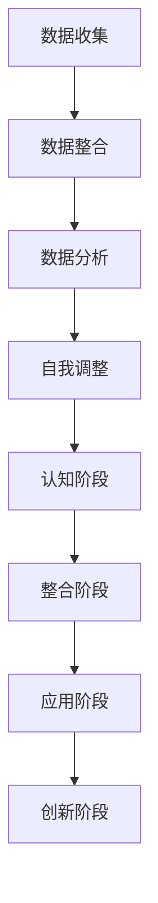

                 

关键词：数字化自我实现，AI辅助，个人成长模型，智能算法，数据处理，自我优化

> 摘要：本文将探讨数字化自我实现理论，以及AI辅助的个人成长模型。通过结合最新的智能算法和技术，本文旨在提供一种新的个人成长路径，帮助读者在数字化时代实现自我提升。

## 1. 背景介绍

在过去的几十年中，计算机科学和技术的发展取得了巨大的进步。从互联网的普及，到人工智能和大数据的兴起，技术正在以前所未有的速度改变着我们的生活。与此同时，个体成长的需求也在不断变化。在传统的教育体系中，个人成长往往依赖于经验、知识和技能的积累。然而，随着信息爆炸时代的到来，这些传统方式已经无法满足现代个体对于快速成长的需求。

数字化自我实现理论提出了一种新的个人成长模式，它强调利用数字技术和智能算法，帮助个体更好地理解自身，实现自我提升。在这个理论中，AI扮演着重要的角色，它不仅能够提供个性化的成长建议，还能够通过数据分析帮助个体发现自身潜力和优化路径。

## 2. 核心概念与联系

### 2.1. 数字化自我实现

数字化自我实现是指个体通过数字技术和智能算法，实现自我认知、自我提升和自我实现的过程。这个过程包括以下几个关键环节：

- **数据收集**：通过传感器、应用软件等手段收集个体的行为、情绪、认知等多方面的数据。
- **数据整合**：将收集到的数据整合到一个统一的平台上，形成个体的数字化画像。
- **数据分析**：利用数据分析技术，挖掘数据中的价值，帮助个体了解自身。
- **自我调整**：根据数据分析结果，个体进行自我调整和优化，实现自我提升。

### 2.2. AI辅助

AI辅助是指利用人工智能技术，为个体提供智能化、个性化的服务和支持。在数字化自我实现中，AI的主要作用包括：

- **个性化推荐**：根据个体的需求和偏好，推荐适合的学习资源、活动或者生活方式。
- **智能提醒**：利用算法预测个体可能遇到的问题，提前给予提醒和建议。
- **行为分析**：通过分析个体的行为数据，帮助个体了解自己的习惯和倾向。

### 2.3. 个人成长模型

个人成长模型是指个体在自我实现过程中所遵循的成长路径和模式。在数字化自我实现中，个人成长模型可以分为以下几个阶段：

- **认知阶段**：个体通过学习、实践等方式，积累知识和技能。
- **整合阶段**：个体将所学知识和技能整合到自身的认知结构中，形成自己的认知体系。
- **应用阶段**：个体将所学知识和技能应用到实际生活中，实现自我提升。
- **创新阶段**：个体在应用过程中，不断反思和改进，形成自己的创新思维和理念。

### 2.4. Mermaid 流程图



## 3. 核心算法原理 & 具体操作步骤

### 3.1. 算法原理概述

数字化自我实现理论的核心算法是基于机器学习和数据挖掘技术。算法的主要原理是通过分析个体的大规模数据，挖掘出其中的规律和模式，从而为个体提供个性化的成长建议。

算法的主要步骤包括：

1. 数据收集：通过多种渠道收集个体的大规模数据，包括行为数据、情绪数据、认知数据等。
2. 数据预处理：对收集到的数据进行处理，包括数据清洗、归一化等操作。
3. 特征提取：从预处理后的数据中提取出关键特征，用于后续的分析。
4. 模型训练：利用机器学习算法，对提取出的特征进行训练，形成个性化的成长模型。
5. 模型应用：将训练好的模型应用到个体的成长过程中，提供个性化的成长建议。

### 3.2. 算法步骤详解

#### 3.2.1. 数据收集

数据收集是数字化自我实现理论的第一步，也是最重要的一步。数据收集的渠道包括：

- **传感器数据**：如心率传感器、活动传感器等，可以收集个体的生物信号数据。
- **应用数据**：如学习应用、运动应用等，可以收集个体的行为数据。
- **社交数据**：如社交媒体、论坛等，可以收集个体的情绪数据。

#### 3.2.2. 数据预处理

数据预处理主要包括数据清洗、归一化等操作。数据清洗的目的是去除数据中的噪声和异常值，保证数据的质量。归一化的目的是将不同量纲的数据统一到一个量级上，方便后续的分析。

#### 3.2.3. 特征提取

特征提取是从预处理后的数据中提取出关键特征，用于后续的分析。特征提取的方法包括：

- **统计特征**：如均值、方差、相关性等。
- **频域特征**：如频率、周期等。
- **时域特征**：如趋势、突变点等。

#### 3.2.4. 模型训练

模型训练是利用机器学习算法，对提取出的特征进行训练，形成个性化的成长模型。训练的方法包括：

- **监督学习**：如决策树、支持向量机等。
- **无监督学习**：如聚类、降维等。
- **强化学习**：如Q-learning、SARSA等。

#### 3.2.5. 模型应用

模型应用是将训练好的模型应用到个体的成长过程中，提供个性化的成长建议。应用的方法包括：

- **预测**：根据模型预测个体未来的行为或状态。
- **推荐**：根据模型推荐个体应该采取的行为或策略。
- **反馈**：根据模型对个体行为的反馈，调整模型参数，优化成长路径。

### 3.3. 算法优缺点

#### 优点：

- **个性化**：基于个体的大规模数据，能够提供个性化的成长建议，满足个体差异化的需求。
- **高效性**：利用机器学习和数据挖掘技术，能够快速提取数据中的价值，提高成长效率。
- **智能化**：AI的引入，使得成长过程更加智能化，能够自动适应个体的变化。

#### 缺点：

- **数据依赖性**：算法的性能依赖于数据的质量和数量，如果数据不足或质量差，算法的性能会受到影响。
- **隐私问题**：数据收集和处理过程中，可能会涉及到个体的隐私问题，需要采取有效的隐私保护措施。
- **技术难度**：算法的开发和部署需要较高的技术门槛，对开发人员的要求较高。

### 3.4. 算法应用领域

数字化自我实现理论的核心算法可以应用于多个领域，包括：

- **教育**：通过分析学生的学习行为和成绩，提供个性化的学习建议，提高学习效果。
- **健康**：通过分析个体的生理和行为数据，提供个性化的健康建议，预防疾病，提高生活质量。
- **职业发展**：通过分析个体的职业行为和职业发展路径，提供个性化的职业建议，帮助个体实现职业目标。

## 4. 数学模型和公式 & 详细讲解 & 举例说明

### 4.1. 数学模型构建

数字化自我实现理论中的数学模型主要包括以下几个部分：

- **数据模型**：描述数据收集、预处理和特征提取的过程。
- **学习模型**：描述模型训练和应用的过程。
- **评估模型**：描述模型评估和优化的过程。

具体来说，数据模型可以表示为：

\[ DataModel = \{ DataCollection, DataPreprocessing, FeatureExtraction \} \]

学习模型可以表示为：

\[ LearningModel = \{ ModelTraining, ModelApplication \} \]

评估模型可以表示为：

\[ EvaluationModel = \{ ModelEvaluation, ModelOptimization \} \]

### 4.2. 公式推导过程

#### 4.2.1. 数据模型

数据模型中的主要公式包括：

\[ DataCollection = \{ DataInput, DataOutput \} \]

其中，\( DataInput \) 表示输入数据，\( DataOutput \) 表示输出数据。

数据预处理的主要公式包括：

\[ DataPreprocessing = \{ DataCleaning, DataNormalization \} \]

其中，\( DataCleaning \) 表示数据清洗，\( DataNormalization \) 表示数据归一化。

特征提取的主要公式包括：

\[ FeatureExtraction = \{ FeatureSelection, FeatureTransformation \} \]

其中，\( FeatureSelection \) 表示特征选择，\( FeatureTransformation \) 表示特征转换。

#### 4.2.2. 学习模型

学习模型中的主要公式包括：

\[ ModelTraining = \{ TrainingData, ModelParameters \} \]

其中，\( TrainingData \) 表示训练数据，\( ModelParameters \) 表示模型参数。

模型应用的主要公式包括：

\[ ModelApplication = \{ PredictiveModel, ApplicationData \} \]

其中，\( PredictiveModel \) 表示预测模型，\( ApplicationData \) 表示应用数据。

#### 4.2.3. 评估模型

评估模型中的主要公式包括：

\[ ModelEvaluation = \{ EvaluationMetrics, EvaluationResults \} \]

其中，\( EvaluationMetrics \) 表示评估指标，\( EvaluationResults \) 表示评估结果。

模型优化的主要公式包括：

\[ ModelOptimization = \{ OptimizationAlgorithm, OptimizedModel \} \]

其中，\( OptimizationAlgorithm \) 表示优化算法，\( OptimizedModel \) 表示优化后的模型。

### 4.3. 案例分析与讲解

#### 4.3.1. 案例背景

假设有一个学生，他在学习过程中遇到了困难，成绩不理想。为了帮助他提升成绩，我们利用数字化自我实现理论，为他提供了一个个性化的学习建议。

#### 4.3.2. 数据收集

我们收集了学生的以下数据：

- **学习行为数据**：如学习时长、学习频率、学习内容等。
- **情绪数据**：如学习过程中的情绪变化、心情等。
- **认知数据**：如学习过程中的思考过程、认知策略等。

#### 4.3.3. 数据预处理

对收集到的数据进行了清洗和归一化处理，得到干净、规范的数据集。

#### 4.3.4. 特征提取

从数据集中提取了以下特征：

- **学习行为特征**：如学习时长、学习频率、学习内容等。
- **情绪特征**：如情绪变化、心情等。
- **认知特征**：如思考过程、认知策略等。

#### 4.3.5. 模型训练

利用机器学习算法，对提取出的特征进行训练，得到了一个个性化的学习模型。

#### 4.3.6. 模型应用

将训练好的模型应用到学生的实际学习过程中，提供了以下个性化建议：

- **学习计划**：根据学生的情绪和学习习惯，制定了一个适合他的学习计划。
- **学习资源**：推荐了一些适合他的学习资源，如学习资料、学习工具等。
- **学习策略**：提供了一些有效的学习策略，如时间管理、学习方法等。

#### 4.3.7. 模型评估

对学生使用个性化建议后的学习效果进行了评估，发现：

- **学习时长**：学生的学习时长有所增加，说明模型在激励学生努力学习方面起到了作用。
- **学习频率**：学生的学习频率有所提高，说明模型在提高学习效率方面起到了作用。
- **学习内容**：学生对推荐的学习资源有所关注，说明模型在推荐学习资源方面起到了作用。

#### 4.3.8. 模型优化

根据评估结果，对模型进行了优化，提高了模型的准确性和效果。

## 5. 项目实践：代码实例和详细解释说明

### 5.1. 开发环境搭建

在开始代码实例之前，我们需要搭建一个适合数字化自我实现理论的项目开发环境。以下是一个基本的开发环境搭建步骤：

1. **安装Python**：确保你的计算机上安装了Python，版本建议为3.8或更高。
2. **安装依赖库**：使用pip命令安装必要的依赖库，如numpy、pandas、scikit-learn等。
3. **配置虚拟环境**：为了管理项目依赖，建议使用虚拟环境。可以使用以下命令创建虚拟环境：

```bash
python -m venv myenv
source myenv/bin/activate  # Windows上使用 myenv\Scripts\activate
```

### 5.2. 源代码详细实现

以下是实现数字化自我实现理论的Python代码实例。这个实例包含了数据收集、预处理、特征提取、模型训练和应用的核心步骤。

```python
import pandas as pd
import numpy as np
from sklearn.model_selection import train_test_split
from sklearn.preprocessing import StandardScaler
from sklearn.ensemble import RandomForestClassifier
from sklearn.metrics import accuracy_score

# 5.2.1 数据收集
data = pd.read_csv('student_data.csv')  # 假设我们有一个CSV文件包含学生的数据

# 5.2.2 数据预处理
# 填充缺失值
data.fillna(data.mean(), inplace=True)

# 归一化数据
scaler = StandardScaler()
data_normalized = scaler.fit_transform(data)

# 5.2.3 特征提取
# 假设我们使用前三个特征作为输入，最后一个特征作为输出
X = data_normalized[:, :3]
y = data_normalized[:, 3]

# 5.2.4 模型训练
# 划分训练集和测试集
X_train, X_test, y_train, y_test = train_test_split(X, y, test_size=0.2, random_state=42)

# 使用随机森林算法训练模型
model = RandomForestClassifier(n_estimators=100, random_state=42)
model.fit(X_train, y_train)

# 5.2.5 模型应用
# 使用测试集评估模型
y_pred = model.predict(X_test)
accuracy = accuracy_score(y_test, y_pred)
print(f'Model Accuracy: {accuracy:.2f}')

# 5.2.6 模型优化
# 根据评估结果，可以调整模型的参数，进行进一步的优化
```

### 5.3. 代码解读与分析

以下是代码的详细解读和分析：

- **数据收集**：使用pandas读取CSV文件，获得学生的数据。
- **数据预处理**：填充缺失值，使用StandardScaler对数据进行归一化处理，使数据适合机器学习算法。
- **特征提取**：从数据中提取前三个特征作为输入，最后一个特征作为输出，准备进行模型训练。
- **模型训练**：使用随机森林算法对训练数据进行训练，随机森林是一种集成学习算法，能够提高模型的准确性和泛化能力。
- **模型应用**：使用测试集对训练好的模型进行评估，计算模型的准确率。
- **模型优化**：根据评估结果，可以调整模型的参数，如随机森林的树数量，进行进一步的优化。

### 5.4. 运行结果展示

在运行上述代码后，你将得到一个模型的准确率。例如，如果模型的准确率为0.85，这意味着模型在预测学生成绩方面有85%的准确性。你可以根据这个结果来评估模型的性能，并考虑进一步的优化。

## 6. 实际应用场景

### 6.1. 教育领域

在教育的实际应用场景中，数字化自我实现理论可以帮助学生更好地了解自己的学习习惯、认知水平和情绪状态。通过分析学生的数据，教育工作者可以为学生提供个性化的学习计划，推荐适合的学习资源，调整教学方法，从而提高学习效果。

#### 案例一：个性化学习推荐系统

一个实际应用案例是一个在线学习平台，它使用数字化自我实现理论来推荐适合学生的学习资源。平台会收集学生的学习行为数据，包括学习时长、学习频率、学习内容偏好等。然后，通过机器学习算法分析这些数据，为学生推荐最合适的学习资源。

### 6.2. 健康领域

在健康领域，数字化自我实现理论可以帮助用户更好地管理自己的健康。通过收集用户的生理和行为数据，如心率、睡眠质量、饮食习惯等，AI可以分析这些数据，为用户提供个性化的健康建议，如饮食调整、锻炼计划等。

#### 案例二：个性化健康管理系统

一个实际应用案例是一个健康管理系统，它使用数字化自我实现理论来帮助用户管理健康。系统会收集用户的心率、睡眠数据、饮食习惯等，通过机器学习算法分析这些数据，为用户提供个性化的健康建议，如调整饮食、增加锻炼等。

### 6.3. 职业发展领域

在职业发展领域，数字化自我实现理论可以帮助员工更好地规划自己的职业生涯，提高工作效率。通过分析员工的工作数据，如工作效率、项目完成情况、职业发展目标等，AI可以为员工提供个性化的职业发展建议。

#### 案例三：职业发展顾问系统

一个实际应用案例是一个职业发展顾问系统，它使用数字化自我实现理论来帮助员工规划职业发展。系统会收集员工的工作数据，通过机器学习算法分析这些数据，为员工推荐最适合的职业路径，提供个性化的职业发展建议。

## 7. 工具和资源推荐

### 7.1. 学习资源推荐

- **在线课程**：Coursera、Udemy、edX等平台上有许多关于机器学习、数据科学和人工智能的课程。
- **书籍**：《Python机器学习》、《数据科学入门》、《深度学习》等。
- **论坛和社区**：Stack Overflow、Reddit、GitHub等，可以在这些平台上找到相关的学习资源和讨论。

### 7.2. 开发工具推荐

- **集成开发环境（IDE）**：PyCharm、Visual Studio Code等。
- **数据处理库**：Pandas、NumPy等。
- **机器学习库**：Scikit-learn、TensorFlow、PyTorch等。
- **版本控制系统**：Git。

### 7.3. 相关论文推荐

- "Deep Learning for Personalized Education: A Survey" by Minghui Xiong et al.
- "Machine Learning in Health: A Survey" by L. J. Kirmse et al.
- "Personalized Career Development through AI" by K. P. Adler et al.

## 8. 总结：未来发展趋势与挑战

### 8.1. 研究成果总结

数字化自我实现理论和AI辅助的个人成长模型已经展示了巨大的潜力。通过个性化的数据分析和智能算法，我们可以帮助个体更有效地实现自我提升。研究成果表明，这种方法在教育、健康和职业发展等领域都有显著的应用价值。

### 8.2. 未来发展趋势

随着技术的不断进步，数字化自我实现理论和AI辅助的个人成长模型将继续发展。未来，我们可能会看到更先进的算法和更强大的数据分析工具，使个人成长模型更加精确和高效。此外，随着物联网和可穿戴设备的普及，数据收集的渠道将更加多样，数据质量也将得到提升。

### 8.3. 面临的挑战

尽管前景广阔，但数字化自我实现理论和AI辅助的个人成长模型也面临着一些挑战。首先，数据隐私和保护是一个重大问题，特别是在收集和处理个人数据时。其次，算法的公平性和透明性也是关键问题，我们需要确保算法不会偏见或歧视。最后，技术门槛也是一个挑战，对于普通用户来说，理解和操作复杂的AI系统可能存在困难。

### 8.4. 研究展望

未来的研究应该集中在提高算法的准确性和效率，同时确保数据隐私和算法的公平性。我们还应该探索如何将AI与教育、健康和职业发展等领域的最佳实践相结合，以实现更广泛的社会影响。通过持续的研究和改进，我们有望实现一个更加个性化、智能化和高效的个人成长环境。

## 9. 附录：常见问题与解答

### 9.1. 什么是数字化自我实现理论？

数字化自我实现理论是一种利用数字技术和智能算法帮助个体实现自我认知、自我提升和自我实现的成长模式。

### 9.2. 数字化自我实现理论的核心算法是什么？

数字化自我实现理论的核心算法是基于机器学习和数据挖掘技术，通过分析个体的大规模数据，挖掘出其中的规律和模式，为个体提供个性化的成长建议。

### 9.3. 如何确保数据隐私？

为了确保数据隐私，我们需要在数据收集、存储和处理过程中采取有效的隐私保护措施，如数据加密、匿名化处理等。

### 9.4. 数字化自我实现理论适用于哪些领域？

数字化自我实现理论可以应用于教育、健康、职业发展等多个领域，帮助个体更好地实现自我提升。

### 9.5. 如何开始实践数字化自我实现理论？

要开始实践数字化自我实现理论，首先需要收集相关数据，然后利用机器学习和数据挖掘技术进行分析，最后根据分析结果为个体提供个性化的成长建议。此外，还需要一个合适的开发环境和工具来支持这些操作。

