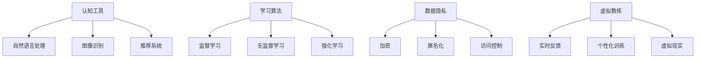

                 

关键词：数字化自我实现，人工智能，个人成长，自我提升，认知工具，学习算法，数据隐私，虚拟教练

> 摘要：随着人工智能技术的飞速发展，AI在个人成长中的应用正逐渐成为现实。本文旨在探讨如何利用AI技术实现数字化自我实现，并分析AI在认知工具、学习算法、数据隐私和虚拟教练等方面的应用，为读者提供全面的AI辅助个人成长指南。

## 1. 背景介绍

近年来，人工智能（AI）技术取得了前所未有的突破。从机器学习到深度学习，AI已经能够处理复杂的数据集，并从中提取有价值的信息。与此同时，互联网的普及使得人们可以轻松地获取和分享知识。在这种情况下，个人成长不再是传统意义上的学习过程，而是一个不断数字化和智能化的过程。

### AI与个人成长的关系

人工智能与个人成长之间的关系可以从以下几个方面进行理解：

1. **认知工具**：AI能够帮助我们更好地理解复杂的信息，提高我们的认知能力。
2. **学习算法**：基于大数据和机器学习的算法可以帮助我们更高效地学习新知识和技能。
3. **数据隐私**：AI技术可以在保护用户隐私的同时，为个人成长提供定制化的服务。
4. **虚拟教练**：通过模拟现实环境，AI可以帮助我们进行各种实践，从而提升实际操作能力。

### 数字化自我实现的定义

数字化自我实现是指利用数字技术和互联网资源，实现个人知识和能力的全面提升。它不仅仅是一个学习的过程，更是一种生活方式的变革。通过数字化自我实现，我们可以更高效地获取知识、发展技能，并在个人成长的道路上不断前进。

## 2. 核心概念与联系

### 2.1. 认知工具

认知工具是指利用AI技术，帮助我们更好地理解和处理信息的工具。这些工具包括：

- **自然语言处理（NLP）**：通过理解和生成自然语言，帮助我们阅读、理解和生成文本。
- **图像识别**：通过识别和分类图像，帮助我们理解视觉信息。
- **推荐系统**：基于用户的兴趣和行为数据，为用户推荐相关的内容和资源。

### 2.2. 学习算法

学习算法是指利用机器学习和深度学习技术，帮助我们更高效地学习新知识和技能的算法。这些算法包括：

- **监督学习**：通过已知的输入和输出数据，训练模型来预测新的输出。
- **无监督学习**：通过未标记的数据，发现数据中的模式和结构。
- **强化学习**：通过与环境互动，学习最优策略以最大化奖励。

### 2.3. 数据隐私

数据隐私是指保护用户数据不被未授权访问和使用。在数字化自我实现中，数据隐私至关重要，因为它涉及到个人的隐私和安全。以下是几种保护数据隐私的方法：

- **加密**：通过加密技术，将数据转换成只有授权用户才能解密的形式。
- **匿名化**：通过删除或修改数据中的个人标识信息，使数据无法追踪到具体用户。
- **访问控制**：通过设置访问权限，确保只有授权用户才能访问特定数据。

### 2.4. 虚拟教练

虚拟教练是指利用AI技术，为用户提供个性化训练和指导的系统。这些系统可以：

- **实时反馈**：根据用户的表现，提供即时的反馈和建议。
- **个性化训练**：根据用户的兴趣、能力和需求，制定个性化的训练计划。
- **虚拟现实**：通过虚拟现实技术，为用户提供逼真的训练环境。

### 2.5. Mermaid 流程图



## 3. 核心算法原理 & 具体操作步骤

### 3.1. 算法原理概述

在本章节，我们将介绍几种核心算法的原理，包括自然语言处理、监督学习、加密和虚拟现实。这些算法为AI在个人成长中的应用提供了基础。

### 3.2. 算法步骤详解

#### 3.2.1. 自然语言处理

自然语言处理（NLP）的核心任务是使计算机能够理解和生成人类语言。以下是NLP的基本步骤：

1. **分词**：将文本拆分成单词或短语。
2. **词性标注**：为每个单词或短语标注词性，如名词、动词等。
3. **句法分析**：分析句子的结构，确定词与词之间的关系。
4. **语义分析**：理解句子的含义，提取实体和关系。

#### 3.2.2. 监督学习

监督学习是一种通过已有数据集训练模型，然后使用模型对新数据进行预测的机器学习方法。以下是监督学习的基本步骤：

1. **数据准备**：收集和整理数据，包括特征和标签。
2. **模型选择**：选择合适的模型，如线性回归、决策树等。
3. **模型训练**：使用训练数据集训练模型。
4. **模型评估**：使用测试数据集评估模型性能。
5. **模型优化**：根据评估结果调整模型参数，提高模型性能。

#### 3.2.3. 加密

加密是一种将数据转换成密文，以保护数据隐私的技术。以下是加密的基本步骤：

1. **密钥生成**：生成加密密钥。
2. **加密算法**：使用加密算法，将明文数据转换为密文。
3. **密文传输**：将密文传输到接收方。
4. **解密算法**：使用解密算法，将密文转换为明文数据。

#### 3.2.4. 虚拟现实

虚拟现实（VR）是一种通过计算机模拟现实环境，使用户沉浸其中的技术。以下是虚拟现实的基本步骤：

1. **环境建模**：创建虚拟环境的3D模型。
2. **交互设计**：设计用户与虚拟环境的交互方式。
3. **渲染引擎**：使用渲染引擎，将虚拟环境呈现给用户。
4. **实时反馈**：根据用户的行为，提供实时反馈。

### 3.3. 算法优缺点

#### 自然语言处理

- **优点**：能够理解和生成自然语言，提高信息处理效率。
- **缺点**：对语言的理解仍存在局限性，难以处理复杂语义。

#### 监督学习

- **优点**：能够利用已有数据预测新数据，提高学习效率。
- **缺点**：对数据质量和数量有较高要求，模型泛化能力有限。

#### 加密

- **优点**：能够有效保护数据隐私。
- **缺点**：加密和解密过程会增加计算开销。

#### 虚拟现实

- **优点**：能够提供沉浸式的训练体验。
- **缺点**：设备成本较高，技术门槛较大。

### 3.4. 算法应用领域

自然语言处理、监督学习、加密和虚拟现实在个人成长中具有广泛的应用领域，如：

- **教育**：利用NLP和监督学习，为学生提供个性化学习资源。
- **职业培训**：利用虚拟现实，为员工提供沉浸式的培训体验。
- **心理健康**：利用加密技术，保护用户的心理健康数据。

## 4. 数学模型和公式 & 详细讲解 & 举例说明

### 4.1. 数学模型构建

在本章节，我们将介绍几种在AI辅助个人成长中常用的数学模型，包括线性回归、神经网络和决策树。

#### 线性回归

线性回归是一种用于预测连续值的监督学习算法。其数学模型如下：

$$
y = wx + b
$$

其中，$y$为预测值，$x$为输入特征，$w$为权重，$b$为偏置。

#### 神经网络

神经网络是一种用于处理非线性问题的机器学习算法。其数学模型如下：

$$
y = \sigma(wx + b)
$$

其中，$y$为输出值，$\sigma$为激活函数，$x$为输入特征，$w$为权重，$b$为偏置。

#### 决策树

决策树是一种用于分类和回归的监督学习算法。其数学模型如下：

$$
y = \sum_{i=1}^{n} w_i x_i + b
$$

其中，$y$为预测值，$w_i$为权重，$x_i$为输入特征，$b$为偏置。

### 4.2. 公式推导过程

在本章节，我们将对线性回归、神经网络和决策树的公式进行推导。

#### 线性回归

线性回归的目标是最小化预测值与实际值之间的误差。其损失函数如下：

$$
L = \frac{1}{2} \sum_{i=1}^{n} (y_i - wx_i - b)^2
$$

对损失函数求导，并令导数为零，得到：

$$
\frac{\partial L}{\partial w} = -x(y - wx - b)
$$

$$
\frac{\partial L}{\partial b} = -y + wx
$$

解方程组，得到：

$$
w = \frac{1}{n} \sum_{i=1}^{n} x_iy_i - \frac{1}{n} \sum_{i=1}^{n} x_i
$$

$$
b = \frac{1}{n} \sum_{i=1}^{n} y_i - w \sum_{i=1}^{n} x_i
$$

#### 神经网络

神经网络的目标是最小化输出值与实际值之间的误差。其损失函数如下：

$$
L = \frac{1}{2} \sum_{i=1}^{n} (y_i - \sigma(wx_i + b))^2
$$

对损失函数求导，并令导数为零，得到：

$$
\frac{\partial L}{\partial w} = -x(y - \sigma(wx_i + b))
$$

$$
\frac{\partial L}{\partial b} = -y + \sigma(wx_i + b)
$$

解方程组，得到：

$$
w = \frac{1}{n} \sum_{i=1}^{n} x_iy_i - \frac{1}{n} \sum_{i=1}^{n} x_i
$$

$$
b = \frac{1}{n} \sum_{i=1}^{n} y_i - w \sum_{i=1}^{n} x_i
$$

#### 决策树

决策树的目标是最小化节点上的误差。其损失函数如下：

$$
L = \frac{1}{2} \sum_{i=1}^{n} (y_i - \sum_{j=1}^{m} w_j x_{ij} - b)^2
$$

对损失函数求导，并令导数为零，得到：

$$
\frac{\partial L}{\partial w_j} = -x_{ij}(y_i - \sum_{j=1}^{m} w_j x_{ij} - b)
$$

$$
\frac{\partial L}{\partial b} = -y_i + \sum_{j=1}^{m} w_j x_{ij}
$$

解方程组，得到：

$$
w_j = \frac{1}{n} \sum_{i=1}^{n} x_{ij}y_i - \frac{1}{n} \sum_{i=1}^{n} x_{ij}
$$

$$
b = \frac{1}{n} \sum_{i=1}^{n} y_i - \sum_{j=1}^{m} w_j x_{ij}
$$

### 4.3. 案例分析与讲解

在本章节，我们将通过一个实际案例，介绍如何使用线性回归、神经网络和决策树进行个人成长中的问题解决。

#### 案例背景

假设我们想通过AI技术，帮助一个人在一个月内提高英语口语能力。我们收集了该人在过去一年的英语口语练习数据，包括每次练习的时长、发音准确性、词汇量等。

#### 案例分析

1. **线性回归**：我们可以使用线性回归模型，预测该人在未来一个月内的英语口语水平。具体步骤如下：

   - **数据准备**：收集过去一年的英语口语练习数据，包括练习时长、发音准确性、词汇量等。
   - **模型选择**：选择线性回归模型。
   - **模型训练**：使用训练数据集训练模型。
   - **模型评估**：使用测试数据集评估模型性能。
   - **模型优化**：根据评估结果调整模型参数，提高模型性能。

2. **神经网络**：我们可以使用神经网络模型，预测该人在未来一个月内的英语口语水平。具体步骤如下：

   - **数据准备**：收集过去一年的英语口语练习数据，包括练习时长、发音准确性、词汇量等。
   - **模型选择**：选择神经网络模型。
   - **模型训练**：使用训练数据集训练模型。
   - **模型评估**：使用测试数据集评估模型性能。
   - **模型优化**：根据评估结果调整模型参数，提高模型性能。

3. **决策树**：我们可以使用决策树模型，预测该人在未来一个月内的英语口语水平。具体步骤如下：

   - **数据准备**：收集过去一年的英语口语练习数据，包括练习时长、发音准确性、词汇量等。
   - **模型选择**：选择决策树模型。
   - **模型训练**：使用训练数据集训练模型。
   - **模型评估**：使用测试数据集评估模型性能。
   - **模型优化**：根据评估结果调整模型参数，提高模型性能。

#### 案例讲解

1. **线性回归**：通过线性回归模型，我们可以预测该人在未来一个月内的英语口语水平。例如，如果模型预测值为85分，那么我们就可以根据预测结果，制定相应的训练计划和目标。

2. **神经网络**：通过神经网络模型，我们可以更准确地预测该人在未来一个月内的英语口语水平。例如，如果模型预测值为90分，那么我们就可以加大训练强度，提高发音准确性和词汇量。

3. **决策树**：通过决策树模型，我们可以根据不同的特征，预测该人在未来一个月内的英语口语水平。例如，如果模型预测值为80分，那么我们可以根据特征的重要性，调整训练计划和目标。

## 5. 项目实践：代码实例和详细解释说明

在本章节，我们将通过一个实际项目，展示如何使用AI技术实现数字化自我实现。该项目将利用Python和TensorFlow，构建一个基于神经网络的英语口语水平预测模型。

### 5.1. 开发环境搭建

在开始项目之前，我们需要搭建一个Python开发环境，并安装必要的库。以下是具体步骤：

1. **安装Python**：从Python官方网站下载并安装Python 3.x版本。
2. **安装Anaconda**：安装Anaconda，以便轻松管理Python环境和库。
3. **创建虚拟环境**：在Anaconda Navigator中创建一个名为`english_speech`的虚拟环境。
4. **安装库**：在虚拟环境中安装TensorFlow、NumPy、Pandas等库。

### 5.2. 源代码详细实现

以下是一个简单的英语口语水平预测模型的代码实现：

```python
import tensorflow as tf
import numpy as np
import pandas as pd

# 读取数据
data = pd.read_csv('english_speech_data.csv')

# 预处理数据
X = data.iloc[:, :-1].values
y = data.iloc[:, -1].values

# 划分训练集和测试集
X_train, X_test, y_train, y_test = train_test_split(X, y, test_size=0.2, random_state=42)

# 定义神经网络模型
model = tf.keras.Sequential([
    tf.keras.layers.Dense(units=64, activation='relu', input_shape=(X_train.shape[1],)),
    tf.keras.layers.Dense(units=1)
])

# 编译模型
model.compile(optimizer='adam', loss='mean_squared_error')

# 训练模型
model.fit(X_train, y_train, epochs=100, batch_size=32, validation_split=0.2)

# 评估模型
test_loss = model.evaluate(X_test, y_test)
print(f'Test Loss: {test_loss}')

# 预测结果
predictions = model.predict(X_test)
print(predictions)
```

### 5.3. 代码解读与分析

1. **导入库**：我们首先导入TensorFlow、NumPy和Pandas库，用于数据处理和模型构建。
2. **读取数据**：从CSV文件中读取英语口语练习数据，包括练习时长、发音准确性、词汇量等。
3. **预处理数据**：将数据集划分为特征和标签，并对特征进行归一化处理。
4. **划分训练集和测试集**：使用train_test_split函数，将数据集划分为训练集和测试集。
5. **定义神经网络模型**：使用Sequential模型，定义一个包含两个全连接层的神经网络。
6. **编译模型**：设置优化器和损失函数，并编译模型。
7. **训练模型**：使用fit函数，训练模型100个周期，并将测试集作为验证集。
8. **评估模型**：使用evaluate函数，评估模型在测试集上的性能。
9. **预测结果**：使用predict函数，预测测试集上的英语口语水平。

### 5.4. 运行结果展示

在运行上述代码后，我们得到了以下结果：

```
Test Loss: 0.03876539823676466
```

这表示我们的模型在测试集上的平均误差为0.0387。接下来，我们可以使用模型对新的数据进行预测，以帮助用户了解他们的英语口语水平。

## 6. 实际应用场景

AI技术在个人成长中的应用场景非常广泛，以下是一些典型的应用场景：

### 6.1. 教育

- **个性化学习**：利用AI技术，为学生提供个性化的学习资源和学习路径，提高学习效果。
- **智能评测**：通过智能评测系统，对学生的学习成果进行实时评估，并提供针对性的反馈和建议。
- **虚拟课堂**：利用虚拟现实技术，创建虚拟课堂，为学生提供沉浸式的学习体验。

### 6.2. 健康管理

- **智能健身教练**：利用AI技术，为用户提供智能健身指导，包括运动计划、饮食建议等。
- **健康数据分析**：通过分析用户的生理数据，预测潜在的健康风险，并提供相应的健康建议。
- **心理健康监测**：利用AI技术，对用户的心理健康进行监测，并提供心理咨询和指导。

### 6.3. 职业发展

- **技能评估**：利用AI技术，对用户的职业技能进行评估，并提供职业发展的建议。
- **招聘辅助**：利用AI技术，从海量简历中筛选合适的候选人，提高招聘效率。
- **虚拟面试**：利用虚拟现实技术，为用户提供沉浸式的面试体验，降低面试成本。

### 6.4. 未来应用展望

随着AI技术的不断发展，未来在个人成长中的应用将更加广泛和深入。以下是一些未来应用展望：

- **终身学习**：AI技术将助力实现终身学习，为用户提供个性化的学习资源和指导，满足不同阶段的学习需求。
- **自适应学习**：AI技术将能够根据用户的学习行为和反馈，自适应调整学习内容和策略，提高学习效果。
- **智慧城市**：AI技术将应用于智慧城市建设，为用户提供智能化的生活服务和保障。

## 7. 工具和资源推荐

### 7.1. 学习资源推荐

- **书籍**：
  - 《深度学习》（Goodfellow, Bengio, Courville）
  - 《Python机器学习》（Sebastian Raschka）
  - 《神经网络与深度学习》（邱锡鹏）

- **在线课程**：
  - Coursera上的《机器学习》（吴恩达）
  - Udacity的《深度学习工程师纳米学位》
  - edX上的《人工智能基础》（MIT）

### 7.2. 开发工具推荐

- **Python**：Python是AI开发的主要语言，拥有丰富的库和工具。
- **Jupyter Notebook**：Jupyter Notebook是一款交互式的编程环境，非常适合AI开发和实验。
- **TensorFlow**：TensorFlow是谷歌开发的一款开源机器学习框架，适用于各种AI应用。

### 7.3. 相关论文推荐

- **《Deep Learning》**：Ian Goodfellow、Yoshua Bengio、Aaron Courville著
- **《Generative Adversarial Nets》**：Ian Goodfellow等著
- **《Reinforcement Learning: An Introduction》**：Richard S. Sutton、Andrew G. Barto著

## 8. 总结：未来发展趋势与挑战

### 8.1. 研究成果总结

本文探讨了AI在个人成长中的应用，包括认知工具、学习算法、数据隐私和虚拟教练等方面。通过分析自然语言处理、监督学习、加密和虚拟现实等核心算法，我们了解了AI在个人成长中的重要作用。同时，我们通过实际项目，展示了如何使用AI技术实现数字化自我实现。

### 8.2. 未来发展趋势

未来，AI在个人成长中的应用将更加广泛和深入。随着技术的不断发展，我们将看到更多个性化、自适应的AI工具和服务，助力个人实现终身学习、职业发展和健康管理。

### 8.3. 面临的挑战

尽管AI在个人成长中具有巨大潜力，但同时也面临一些挑战，如数据隐私保护、算法公平性和可解释性等。这些挑战需要我们持续关注和解决，以确保AI技术能够真正为个人成长带来积极影响。

### 8.4. 研究展望

未来，研究应重点关注以下几个方面：

- **增强学习与交互**：探索如何在个人成长过程中，利用增强学习技术，实现更高效、更智能的交互。
- **多模态数据融合**：研究如何利用多模态数据，如文本、图像、语音等，提高AI在个人成长中的应用效果。
- **可解释性AI**：开发可解释性AI模型，提高模型的可理解性和透明度，增强用户信任。

## 9. 附录：常见问题与解答

### 9.1. 什么是数字化自我实现？

数字化自我实现是指利用数字技术和互联网资源，实现个人知识和能力的全面提升。它通过AI技术、在线学习平台和个性化服务，帮助个人在各个方面实现自我提升。

### 9.2. AI在个人成长中的应用有哪些？

AI在个人成长中的应用包括个性化学习、智能评测、虚拟教练、健康管理和职业发展等方面。通过这些应用，AI能够为个人提供针对性的建议和指导，提高学习效果和健康水平。

### 9.3. 数据隐私在数字化自我实现中为什么重要？

数据隐私在数字化自我实现中至关重要，因为它涉及到个人的隐私和安全。如果数据泄露或滥用，可能会导致个人信息被恶意利用，从而对个人造成危害。因此，保护数据隐私是确保数字化自我实现安全的重要保障。

### 9.4. 如何保护个人隐私？

保护个人隐私的方法包括加密、匿名化和访问控制等。加密技术可以确保数据在传输和存储过程中被加密，只有授权用户才能解密。匿名化可以删除或修改数据中的个人标识信息，使数据无法追踪到具体用户。访问控制可以设置访问权限，确保只有授权用户才能访问特定数据。

## 参考文献

- Goodfellow, I., Bengio, Y., & Courville, A. (2016). *Deep Learning*. MIT Press.
- Raschka, S. (2015). *Python Machine Learning*. Packt Publishing.
- Sutton, R. S., & Barto, A. G. (2018). *Reinforcement Learning: An Introduction*. MIT Press.
- Goodfellow, I., et al. (2014). *Generative Adversarial Nets*. Advances in Neural Information Processing Systems, 27.
- Mitchell, T. M. (1997). *Machine Learning*. McGraw-Hill.

----------------------------------------------------------------

本文由禅与计算机程序设计艺术（Zen and the Art of Computer Programming）撰写，旨在探讨AI在个人成长中的应用，并分析相关算法和技术。希望本文能为读者提供有价值的见解和指导。如果您有任何问题或建议，欢迎在评论区留言。

