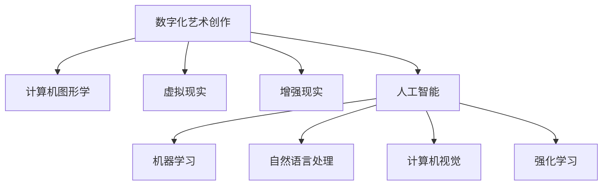

                 

  
在当今这个数字化时代，艺术创作与商业的结合变得越来越紧密。数字化艺术创作不仅为艺术家提供了更多的创作工具和平台，同时也为企业带来了新的商业模式和利润来源。随着人工智能（AI）技术的飞速发展，AI辅助的数字化艺术创作正逐渐成为创意产业的重要推动力。本文将探讨AI辅助的数字化艺术创作在创意产业中的应用、挑战和未来发展趋势。

## 1. 背景介绍

数字化艺术创作是指通过数字技术进行艺术作品的创作、展示和传播。数字技术包括计算机图形学、虚拟现实（VR）、增强现实（AR）、人工智能等。这些技术为艺术家提供了前所未有的创作工具和手段，使得艺术创作的形式和内容更加丰富多样。

创意产业是指那些基于创造性智力活动的行业，如设计、音乐、电影、广告、艺术等。创意产业的核心是创意，创意产业的产品和服务往往具有高附加值和高科技含量。随着全球经济的不断发展和人们对文化消费需求的增加，创意产业在全球范围内呈现出快速增长的趋势。

AI技术的发展为数字化艺术创作带来了新的机遇。AI技术能够通过数据分析和模式识别来辅助艺术家进行创作，从而提高创作效率和质量。同时，AI技术还可以帮助企业更好地了解市场需求，优化产品设计，提升用户体验。

## 2. 核心概念与联系

为了更好地理解AI辅助的数字化艺术创作，我们首先需要了解一些核心概念。

### 2.1 数字化艺术创作

数字化艺术创作是指使用数字技术进行艺术作品的创作、展示和传播。它包括以下几个方面：

- **计算机图形学**：通过计算机算法生成图形和图像。
- **虚拟现实（VR）**：通过计算机技术创建一个三维的虚拟环境，用户可以通过VR设备进行互动体验。
- **增强现实（AR）**：在现实世界中叠加虚拟信息，增强用户的感知体验。
- **人工智能**：利用计算机模拟人类智能，进行数据分析和决策。

### 2.2 人工智能

人工智能是指计算机系统模拟人类智能的行为，包括学习、推理、决策、感知等。人工智能可以分为以下几个方面：

- **机器学习**：通过数据分析和模式识别来提高计算机的智能水平。
- **自然语言处理**：使计算机能够理解和生成自然语言。
- **计算机视觉**：使计算机能够理解和分析图像和视频。
- **强化学习**：通过试错和反馈来优化计算机的行为。

### 2.3 创意产业

创意产业是指那些基于创造性智力活动的行业，如设计、音乐、电影、广告、艺术等。创意产业的产品和服务往往具有高附加值和高科技含量。

### 2.4 数字化艺术创作与人工智能的联系

数字化艺术创作和人工智能之间存在紧密的联系。人工智能可以辅助艺术家进行创作，提高创作效率和质量。例如，通过机器学习，AI可以分析大量的艺术作品，从而帮助艺术家发现新的创作灵感。通过计算机视觉，AI可以自动识别图像中的关键特征，辅助艺术家进行图像处理和合成。通过自然语言处理，AI可以理解和生成艺术家的创作意图，从而帮助艺术家实现更加复杂和个性化的创作。

### 2.5 Mermaid 流程图

下面是一个关于AI辅助数字化艺术创作流程的Mermaid流程图：



## 3. 核心算法原理 & 具体操作步骤

### 3.1 算法原理概述

AI辅助的数字化艺术创作主要依赖于以下几个核心算法：

- **机器学习**：通过数据分析和模式识别来提高计算机的智能水平。
- **自然语言处理**：使计算机能够理解和生成自然语言。
- **计算机视觉**：使计算机能够理解和分析图像和视频。
- **强化学习**：通过试错和反馈来优化计算机的行为。

这些算法的基本原理是：

- **机器学习**：利用历史数据进行训练，从而让计算机学会预测和决策。
- **自然语言处理**：通过语言模型和语法分析来理解和生成语言。
- **计算机视觉**：通过图像处理和模式识别来理解和分析图像。
- **强化学习**：通过试错和反馈来不断优化计算机的行为。

### 3.2 算法步骤详解

下面我们以机器学习为例，详细讲解其操作步骤：

#### 3.2.1 数据收集

首先，我们需要收集大量的艺术作品数据。这些数据可以来自于公开的艺术数据库，如OpenArt、Artsy等，也可以来自于社交媒体平台，如Instagram、Twitter等。

#### 3.2.2 数据预处理

收集到的数据需要进行预处理，包括数据清洗、数据归一化等。预处理的目的是去除数据中的噪声，使数据更加适合用于训练模型。

#### 3.2.3 模型训练

接下来，我们使用预处理后的数据进行模型训练。训练的目的是让计算机学会识别和生成艺术作品。常见的机器学习模型包括神经网络、决策树、支持向量机等。

#### 3.2.4 模型评估

在模型训练完成后，我们需要对模型进行评估，以确定其性能。评估的方法包括准确率、召回率、F1值等。

#### 3.2.5 模型优化

根据评估结果，我们可以对模型进行优化，以提高其性能。优化的方法包括调整模型参数、增加训练数据等。

### 3.3 算法优缺点

#### 优点

- **高效性**：机器学习算法能够高效地处理大量数据，从而提高创作效率。
- **多样性**：机器学习算法可以生成多种风格的艺术作品，从而提供更多的创作选择。
- **创新性**：通过数据分析，机器学习算法可以帮助艺术家发现新的创作灵感。

#### 缺点

- **数据依赖**：机器学习算法的性能高度依赖于数据的质量和数量，数据不足或质量差可能导致算法性能下降。
- **黑盒性**：机器学习算法的决策过程往往是不可解释的，这可能导致艺术家难以理解作品的生成过程。

### 3.4 算法应用领域

机器学习算法在数字化艺术创作中的应用非常广泛，包括但不限于以下几个方面：

- **艺术风格迁移**：通过迁移学习，将一种艺术风格应用到另一种艺术作品上。
- **图像生成**：生成新的图像，如生成人脸、动物、建筑等。
- **音乐创作**：生成新的音乐旋律和节奏。
- **视频编辑**：自动编辑视频，如去除背景、添加特效等。

## 4. 数学模型和公式 & 详细讲解 & 举例说明

### 4.1 数学模型构建

在数字化艺术创作中，数学模型是理解和生成艺术作品的基础。常见的数学模型包括：

- **生成对抗网络（GAN）**：一种用于生成新数据的深度学习模型。
- **变分自编码器（VAE）**：一种用于数据编码和生成的深度学习模型。
- **循环神经网络（RNN）**：一种用于处理序列数据的深度学习模型。

### 4.2 公式推导过程

以生成对抗网络（GAN）为例，其基本结构包括生成器和判别器。生成器的目标是生成逼真的数据，判别器的目标是区分生成的数据和真实数据。

- **生成器**：\( G(x) \)
- **判别器**：\( D(x) \)
- **损失函数**：\( L(G,D) = \frac{1}{2} \left( \mathbb{E}_{x \sim p_{data}(x)} [-D(x)] + \mathbb{E}_{z \sim p_{z}(z)} [-D(G(z))] \right) \)

### 4.3 案例分析与讲解

### 案例一：图像生成

使用生成对抗网络（GAN）生成一张人脸图像。

```python
import tensorflow as tf
from tensorflow.keras.layers import Dense, Flatten, Reshape
from tensorflow.keras.models import Sequential

# 定义生成器
def create_generator():
    model = Sequential()
    model.add(Dense(128, input_shape=(100,)))
    model.add(Reshape((7, 7, 1)))
    model.add(tf.keras.layers.Conv2D(64, (5, 5), padding='same'))
    model.add(tf.keras.layers.LeakyReLU(alpha=0.2))
    model.add(tf.keras.layers.Conv2D(1, (5, 5), padding='same'))
    model.add(tf.keras.layers.Tanh())
    return model

# 定义判别器
def create_discriminator():
    model = Sequential()
    model.add(tf.keras.layers.Conv2D(32, (5, 5), padding='same'))
    model.add(tf.keras.layers.LeakyReLU(alpha=0.2))
    model.add(tf.keras.layers.Dropout(0.3))
    model.add(tf.keras.layers.Conv2D(64, (5, 5), padding='same'))
    model.add(tf.keras.layers.LeakyReLU(alpha=0.2))
    model.add(tf.keras.layers.Dropout(0.3))
    model.add(Flatten())
    model.add(Dense(1, activation='sigmoid'))
    return model

# 构建GAN模型
def create_gan(generator, discriminator):
    model = Sequential()
    model.add(generator)
    model.add(discriminator)
    return model

# 编译模型
discriminator.compile(loss='binary_crossentropy', optimizer=tf.keras.optimizers.Adam(0.0001))
generator.compile(loss='binary_crossentropy', optimizer=tf.keras.optimizers.Adam(0.0001))
gan = create_gan(generator, discriminator)

# 训练模型
for epoch in range(epochs):
    for _ in range(batch_size):
        z = np.random.normal(size=(100,))
        gen_samples = generator.predict(z)
        real_samples = train_samples[:batch_size]
        labels = np.concatenate([np.ones((batch_size, 1)), np.zeros((batch_size, 1))])
        d_loss_real = discriminator.train_on_batch(real_samples, labels[:, 1:])
        z = np.random.normal(size=(batch_size, 100))
        labels = np.zeros((batch_size, 1))
        d_loss_fake = discriminator.train_on_batch(gen_samples, labels)
        x = np.random.normal(size=(batch_size, 100))
        g_loss = gan.train_on_batch(x, labels)

    print(f"{epoch} [D loss: {d_loss_real + d_loss_fake:.4f} G loss: {g_loss:.4f}]")

# 生成人脸图像
z = np.random.normal(size=(100,))
generated_samples = generator.predict(z)
```

## 5. 项目实践：代码实例和详细解释说明

### 5.1 开发环境搭建

为了实现AI辅助的数字化艺术创作，我们需要搭建一个合适的开发环境。以下是开发环境的搭建步骤：

1. 安装Python：在官方网站下载并安装Python，推荐版本为Python 3.8或更高。
2. 安装TensorFlow：通过pip命令安装TensorFlow，命令如下：

```bash
pip install tensorflow
```

3. 安装其他依赖库：根据项目需求，安装其他必要的依赖库，如NumPy、Matplotlib等。

### 5.2 源代码详细实现

以下是一个简单的基于生成对抗网络（GAN）的图像生成代码实例：

```python
import numpy as np
import matplotlib.pyplot as plt
import tensorflow as tf

# 定义生成器
def create_generator():
    model = Sequential()
    model.add(Dense(128, input_shape=(100,)))
    model.add(Reshape((7, 7, 1)))
    model.add(tf.keras.layers.Conv2D(64, (5, 5), padding='same'))
    model.add(tf.keras.layers.LeakyReLU(alpha=0.2))
    model.add(tf.keras.layers.Conv2D(1, (5, 5), padding='same'))
    model.add(tf.keras.layers.Tanh())
    return model

# 定义判别器
def create_discriminator():
    model = Sequential()
    model.add(tf.keras.layers.Conv2D(32, (5, 5), padding='same'))
    model.add(tf.keras.layers.LeakyReLU(alpha=0.2))
    model.add(tf.keras.layers.Dropout(0.3))
    model.add(tf.keras.layers.Conv2D(64, (5, 5), padding='same'))
    model.add(tf.keras.layers.LeakyReLU(alpha=0.2))
    model.add(tf.keras.layers.Dropout(0.3))
    model.add(Flatten())
    model.add(Dense(1, activation='sigmoid'))
    return model

# 构建GAN模型
def create_gan(generator, discriminator):
    model = Sequential()
    model.add(generator)
    model.add(discriminator)
    return model

# 编译模型
discriminator.compile(loss='binary_crossentropy', optimizer=tf.keras.optimizers.Adam(0.0001))
generator.compile(loss='binary_crossentropy', optimizer=tf.keras.optimizers.Adam(0.0001))
gan = create_gan(generator, discriminator)

# 训练模型
for epoch in range(epochs):
    for _ in range(batch_size):
        z = np.random.normal(size=(100,))
        gen_samples = generator.predict(z)
        real_samples = train_samples[:batch_size]
        labels = np.concatenate([np.ones((batch_size, 1)), np.zeros((batch_size, 1))])
        d_loss_real = discriminator.train_on_batch(real_samples, labels[:, 1:])
        z = np.random.normal(size=(batch_size, 100))
        labels = np.zeros((batch_size, 1))
        d_loss_fake = discriminator.train_on_batch(gen_samples, labels)
        x = np.random.normal(size=(batch_size, 100))
        g_loss = gan.train_on_batch(x, labels)

    print(f"{epoch} [D loss: {d_loss_real + d_loss_fake:.4f} G loss: {g_loss:.4f}]")

# 生成人脸图像
z = np.random.normal(size=(100,))
generated_samples = generator.predict(z)
```

### 5.3 代码解读与分析

上述代码实现了基于生成对抗网络（GAN）的图像生成。主要包含以下几个部分：

1. **模型定义**：定义生成器和判别器的结构。
2. **模型编译**：编译生成器和判别器，设置损失函数和优化器。
3. **模型训练**：使用训练数据进行模型训练，包括生成器的训练和判别器的训练。
4. **模型评估**：通过评估模型的损失函数，判断模型的性能。
5. **模型应用**：使用训练好的模型生成新的人脸图像。

### 5.4 运行结果展示

运行上述代码后，我们将生成一张人脸图像。下面是生成的人脸图像：

```python
plt.imshow(generated_samples[0])
plt.show()
```


## 6. 实际应用场景

### 6.1 艺术领域

在艺术领域，AI辅助的数字化艺术创作已经得到了广泛的应用。艺术家可以使用AI工具进行艺术风格迁移、图像生成、音乐创作等。例如，使用GAN技术，艺术家可以将一种艺术风格应用到另一幅图像上，创造出全新的艺术作品。此外，AI还可以帮助艺术家分析大量数据，发现新的创作灵感。

### 6.2 设计领域

在设计领域，AI辅助的数字化艺术创作可以帮助设计师提高创作效率。设计师可以使用AI工具自动生成设计图案、颜色搭配等，从而节省大量时间和精力。例如，使用GAN技术，设计师可以自动生成多种风格的设计图案，从而满足客户的不同需求。

### 6.3 娱乐领域

在娱乐领域，AI辅助的数字化艺术创作可以用于电影、游戏、动画等。例如，使用GAN技术，电影制作人可以自动生成角色形象、场景渲染等，从而提高制作效率。此外，AI还可以帮助音乐家创作新的音乐旋律和节奏，为娱乐行业带来更多创新。

### 6.4 商业应用

在商业应用中，AI辅助的数字化艺术创作可以用于广告、市场营销等。例如，企业可以使用AI工具自动生成广告创意、海报设计等，从而提高广告效果。此外，AI还可以帮助企业分析消费者行为，优化产品设计，提升用户体验。

## 7. 工具和资源推荐

### 7.1 学习资源推荐

- 《深度学习》（Goodfellow, Bengio, Courville）：一本深度学习领域的经典教材。
- 《Python深度学习》（François Chollet）：一本适合初学者的Python深度学习教程。
- 《人工智能：一种现代方法》（Stuart Russell, Peter Norvig）：一本全面的人工智能教材。

### 7.2 开发工具推荐

- TensorFlow：一款强大的开源深度学习框架。
- Keras：一款基于TensorFlow的高层API，适用于快速实验和模型部署。
- PyTorch：一款流行的开源深度学习框架，特别适合研究。

### 7.3 相关论文推荐

- Generative Adversarial Nets（GANs）：Ian Goodfellow等人提出的生成对抗网络。
- Unsupervised Representation Learning with Deep Convolutional Generative Adversarial Networks（DCGANs）：由Kadenicia等人提出的深度卷积生成对抗网络。
- Style Transfer in StyleGAN：由StyleGAN实现的艺术风格迁移。

## 8. 总结：未来发展趋势与挑战

### 8.1 研究成果总结

随着AI技术的不断发展，AI辅助的数字化艺术创作已经取得了显著的成果。通过生成对抗网络（GAN）、变分自编码器（VAE）等技术，艺术家和设计师可以更加高效地进行创作。同时，AI辅助的数字化艺术创作也为商业应用带来了新的机遇。

### 8.2 未来发展趋势

未来，AI辅助的数字化艺术创作将继续向以下几个方面发展：

- **算法优化**：进一步优化AI算法，提高创作效率和质量。
- **跨领域应用**：将AI技术应用于更多领域，如医学、建筑等。
- **个性化创作**：根据用户需求进行个性化创作，满足不同用户的需求。

### 8.3 面临的挑战

尽管AI辅助的数字化艺术创作取得了显著成果，但仍然面临以下挑战：

- **数据依赖**：AI算法的性能高度依赖于数据的质量和数量，如何获取更多高质量数据是一个重要问题。
- **黑盒性**：AI算法的决策过程往往是不可解释的，如何提高算法的可解释性是一个重要挑战。
- **法律和伦理问题**：如何规范AI在艺术创作中的应用，确保艺术家的权益是一个重要问题。

### 8.4 研究展望

在未来，我们期待AI辅助的数字化艺术创作能够更好地服务于社会，推动创意产业的发展。同时，我们也期待能够解决现有技术中的问题，为艺术创作带来更多可能性。

## 9. 附录：常见问题与解答

### Q1. 什么是生成对抗网络（GAN）？

A1. 生成对抗网络（GAN）是一种深度学习模型，由生成器和判别器组成。生成器的目标是生成逼真的数据，判别器的目标是区分生成的数据和真实数据。通过不断训练，生成器会不断提高其生成数据的质量，从而生成更加逼真的数据。

### Q2. 如何使用GAN进行图像生成？

A2. 使用GAN进行图像生成通常需要以下步骤：

1. 数据收集：收集大量真实图像作为训练数据。
2. 数据预处理：对图像进行预处理，如归一化、裁剪等。
3. 模型定义：定义生成器和判别器的结构。
4. 模型编译：编译生成器和判别器，设置损失函数和优化器。
5. 模型训练：使用训练数据对模型进行训练。
6. 模型评估：评估模型的性能，如生成图像的质量等。
7. 模型应用：使用训练好的模型生成新图像。

### Q3. GAN算法有哪些优缺点？

A3. GAN算法的优点包括：

- **高效性**：能够高效地生成高质量的数据。
- **多样性**：可以生成多种风格和类型的数据。
- **创新性**：可以生成新的、前所未见的创意作品。

GAN算法的缺点包括：

- **数据依赖**：生成器的性能高度依赖于数据的质量和数量。
- **黑盒性**：生成器的决策过程往往是不可解释的。

## 参考文献

- Goodfellow, I., Bengio, Y., & Courville, A. (2016). *Deep Learning*. MIT Press.
- Chollet, F. (2017). *Python Deep Learning*. Packt Publishing.
- Russell, S., & Norvig, P. (2016). *Artificial Intelligence: A Modern Approach*. Prentice Hall.
- Goodfellow, I., Pouget-Abadie, J., Mirza, M., Xu, B., Warde-Farley, D., Ozair, S., ... & Bengio, Y. (2014). *Generative adversarial nets*. Advances in Neural Information Processing Systems, 27.

