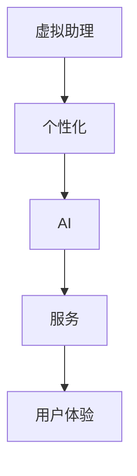

                 

关键词：数字化虚拟助理，个性化AI，服务设计，创业路径，技术实现，应用场景，未来发展

>摘要：本文深入探讨了数字化虚拟助理创业的背景、核心概念、算法原理、数学模型、项目实践、应用场景以及未来发展。通过详细介绍个性化AI服务的技术实现和创业路径，为创业者提供了全面的指导和建议。

## 1. 背景介绍

在当今数字经济时代，虚拟助理作为人工智能的重要应用领域之一，正逐渐渗透到各个行业和日常生活。数字化虚拟助理以其高效、智能、便捷的特点，受到了广泛欢迎。然而，面对激烈的市场竞争和不断变化的需求，如何实现个性化AI服务成为创业者面临的重要课题。

个性化AI服务是指在了解用户需求、行为和偏好等基础上，提供定制化的服务和推荐。这不仅是提升用户体验的关键，也是企业差异化竞争的重要手段。然而，个性化AI服务的实现需要复杂的技术架构和算法支持，这对创业者来说既是挑战，也是机遇。

本文将从以下几个方面展开讨论：

1. 核心概念与联系
2. 核心算法原理与具体操作步骤
3. 数学模型和公式
4. 项目实践：代码实例与详细解释说明
5. 实际应用场景
6. 工具和资源推荐
7. 总结：未来发展趋势与挑战

希望通过本文的探讨，能够为创业者提供一些有价值的参考和启示。

## 2. 核心概念与联系

要理解数字化虚拟助理创业中的个性化AI服务，首先需要了解几个核心概念：虚拟助理、个性化、AI和服务的关联。

### 虚拟助理

虚拟助理是一种通过计算机技术模拟人类智能行为的程序，能够与用户进行自然语言交互，提供信息查询、任务执行、情感支持等服务。虚拟助理的核心功能包括自然语言处理（NLP）、语音识别（ASR）、机器学习（ML）和深度学习（DL）等。

### 个性化

个性化是指根据用户的需求、行为和偏好提供定制化的服务和内容。在数字化虚拟助理中，个性化主要体现在以下几个方面：

- **用户画像**：通过收集和分析用户的基本信息、行为数据等，构建用户的个性化画像。
- **个性化推荐**：根据用户画像，为用户提供个性化的商品、内容、服务推荐。
- **交互优化**：通过分析用户的交互数据，优化虚拟助理的响应策略，提升用户体验。

### AI

人工智能（AI）是使虚拟助理具备智能能力的关键技术。AI技术包括：

- **机器学习**：通过数据训练模型，使虚拟助理能够学习和适应用户需求。
- **深度学习**：利用神经网络模型，提升虚拟助理的语义理解和决策能力。
- **自然语言处理**：使虚拟助理能够理解和生成自然语言，实现自然对话。

### 服务的关联

虚拟助理、个性化、AI和服务之间的关系可以理解为：虚拟助理是提供服务的载体，个性化是服务的核心，AI是提升服务能力的工具，而服务则是最终目标。

为了更好地理解这些概念之间的联系，我们可以使用Mermaid流程图进行描述：



在这个流程图中，虚拟助理通过AI技术实现个性化服务，从而提升用户体验。这个过程是循环迭代的，用户反馈和交互数据会进一步优化虚拟助理的性能和服务质量。

通过理解这些核心概念和联系，创业者可以更好地规划虚拟助理的个性化AI服务，实现精准的市场定位和用户需求满足。

## 3. 核心算法原理与具体操作步骤

要实现数字化虚拟助理的个性化AI服务，需要依赖于一系列核心算法原理和具体操作步骤。这些算法不仅是提升虚拟助理智能化水平的关键，也是实现个性化服务的基础。下面将详细介绍这些算法原理及其操作步骤。

### 3.1 算法原理概述

虚拟助理的个性化AI服务主要依赖于以下几个核心算法：

1. **用户画像构建算法**：通过收集和分析用户数据，构建用户的个性化画像。
2. **推荐算法**：根据用户画像和物品属性，为用户提供个性化的推荐。
3. **对话管理算法**：管理虚拟助理与用户的对话流程，实现自然、流畅的交互。

### 3.2 算法步骤详解

#### 3.2.1 用户画像构建算法

**步骤一：数据收集**

首先，需要收集用户的多种数据，包括基本个人信息（如年龄、性别、地理位置）、行为数据（如浏览记录、购买历史）和交互数据（如提问内容、回复反馈）。这些数据可以通过用户注册、使用服务和交互过程中自动收集。

**步骤二：数据处理**

对收集到的数据进行清洗和预处理，包括去重、去噪声、格式转换等。然后，将这些数据转化为适合算法处理的格式，如特征向量。

**步骤三：特征工程**

通过对数据进行特征提取和构造，将原始数据转换为算法能够理解和处理的特征向量。常见的特征包括用户兴趣标签、行为模式、地理位置等。

**步骤四：模型训练**

使用机器学习算法（如聚类算法、分类算法）对特征向量进行训练，构建用户画像模型。这些模型能够根据新数据不断更新和优化，以实现更精准的用户画像。

#### 3.2.2 推荐算法

**步骤一：数据预处理**

与用户画像构建类似，推荐算法需要收集和预处理与物品相关的数据，如商品描述、用户评分、标签等。

**步骤二：相似度计算**

计算用户与物品之间的相似度。常见的相似度计算方法包括余弦相似度、皮尔逊相关系数等。通过相似度计算，找到与用户兴趣相似的物品。

**步骤三：推荐生成**

根据相似度计算结果，生成个性化推荐列表。常见的推荐算法包括协同过滤算法、矩阵分解、深度学习等。

#### 3.2.3 对话管理算法

**步骤一：意图识别**

通过自然语言处理技术，对用户输入的自然语言进行处理，识别用户的意图。意图识别可以是基于规则的方法，也可以是机器学习模型。

**步骤二：任务分配**

根据识别出的用户意图，将任务分配给虚拟助理的不同模块，如问答系统、任务执行系统等。

**步骤三：响应生成**

生成适当的响应，以满足用户的意图。响应可以是文本、图像、语音等形式。

**步骤四：反馈学习**

收集用户对虚拟助理的反馈，用于优化对话管理算法。反馈可以是直接评价，也可以是隐式反馈，如用户的互动行为。

### 3.3 算法优缺点

#### 3.3.1 用户画像构建算法

**优点：**

- **数据驱动**：基于用户数据构建用户画像，能够更准确地了解用户需求和偏好。
- **动态更新**：用户画像模型能够根据用户行为和反馈动态更新，实现个性化的持续优化。

**缺点：**

- **数据隐私**：用户数据的收集和处理涉及隐私问题，需要严格遵守相关法规。
- **数据质量**：数据的质量直接影响用户画像的准确性，需要严格的数据清洗和处理。

#### 3.3.2 推荐算法

**优点：**

- **个性化推荐**：能够根据用户兴趣和偏好提供个性化的推荐，提升用户体验。
- **高效率**：通过算法快速计算和生成推荐列表，提升服务效率。

**缺点：**

- **冷启动问题**：对于新用户或新物品，缺乏足够的初始数据，难以生成准确的推荐。
- **数据依赖性**：推荐算法依赖于大量用户和物品数据，数据质量直接影响推荐效果。

#### 3.3.3 对话管理算法

**优点：**

- **自然交互**：能够实现自然语言交互，提升用户满意度。
- **灵活性**：可以根据用户意图和任务灵活调整对话策略。

**缺点：**

- **理解偏差**：自然语言处理技术的局限性可能导致对用户意图的理解偏差。
- **交互复杂性**：对话管理算法需要处理复杂的对话场景和用户反馈，实现难度较高。

### 3.4 算法应用领域

个性化AI服务在多个领域具有广泛的应用：

- **电子商务**：为用户提供个性化商品推荐，提升购物体验和转化率。
- **金融保险**：为用户提供个性化金融产品和服务推荐，提升用户体验和满意度。
- **健康管理**：为用户提供个性化健康建议和疾病预防指导。
- **教育**：为用户提供个性化学习内容和推荐，提升学习效果。

通过合理应用这些算法，创业者可以在不同领域实现高效的个性化AI服务，满足用户多样化需求，提升市场竞争力。

## 4. 数学模型和公式及详细讲解

在个性化AI服务中，数学模型和公式扮演着至关重要的角色，它们为算法提供了理论基础和计算依据。本节将详细讲解数学模型的构建过程、公式推导及其应用实例。

### 4.1 数学模型构建

个性化AI服务的数学模型主要涉及以下几个方面：

1. **用户画像模型**：用于描述用户特征和需求。
2. **推荐模型**：用于生成个性化推荐。
3. **对话管理模型**：用于管理虚拟助理与用户的交互。

#### 4.1.1 用户画像模型

用户画像模型通常采用以下形式：

$$
U = \{u_1, u_2, ..., u_n\}
$$

其中，$U$ 表示用户集合，$u_i$ 表示第 $i$ 个用户的特征向量。

用户特征向量可以表示为：

$$
u_i = \{f_{i1}, f_{i2}, ..., f_{im}\}
$$

其中，$f_{ij}$ 表示第 $i$ 个用户在第 $j$ 个特征上的取值。

#### 4.1.2 推荐模型

推荐模型通常采用以下形式：

$$
R = \{r_{ij}\}
$$

其中，$R$ 表示推荐矩阵，$r_{ij}$ 表示第 $i$ 个用户对第 $j$ 个物品的评分。

推荐模型可以采用基于协同过滤、基于内容推荐和基于模型的方法。以下是一个基于协同过滤的推荐模型：

$$
r_{ij} = \mu + q_i^T p_j
$$

其中，$\mu$ 表示平均评分，$q_i$ 和 $p_j$ 分别表示用户 $i$ 和物品 $j$ 的特征向量。

#### 4.1.3 对话管理模型

对话管理模型可以采用以下形式：

$$
D = \{d_t\}
$$

其中，$D$ 表示对话序列，$d_t$ 表示第 $t$ 个对话状态。

对话状态可以表示为：

$$
d_t = \{s_t, a_t, r_t\}
$$

其中，$s_t$ 表示当前状态，$a_t$ 表示当前动作，$r_t$ 表示当前响应。

### 4.2 公式推导过程

以下分别对用户画像模型、推荐模型和对话管理模型的公式进行推导。

#### 4.2.1 用户画像模型

假设用户特征向量 $u_i$ 可以表示为：

$$
u_i = [f_{i1}, f_{i2}, ..., f_{im}]^T
$$

其中，$f_{ij}$ 表示第 $i$ 个用户在第 $j$ 个特征上的取值。

为了构建用户画像模型，我们可以使用主成分分析（PCA）对特征向量进行降维处理。PCA的目标是找到一组新的特征向量，使得它们能够最大程度地保留原始数据的方差。

设 $U$ 表示用户特征矩阵：

$$
U = \{u_1, u_2, ..., u_n\}
$$

则 $U$ 的协方差矩阵为：

$$
\Sigma = \frac{1}{n-1} U^T U
$$

特征值和特征向量可以通过求解特征值问题得到：

$$
\Lambda = \Sigma \Lambda^{-1}
$$

降维后的用户画像模型为：

$$
u_i' = \Lambda U^T
$$

#### 4.2.2 推荐模型

假设用户特征向量 $q_i$ 和物品特征向量 $p_j$ 分别为：

$$
q_i = [q_{i1}, q_{i2}, ..., q_{iq}]^T
$$

$$
p_j = [p_{j1}, p_{j2}, ..., p_{jq}]^T
$$

则基于协同过滤的推荐模型可以表示为：

$$
r_{ij} = \mu + q_i^T p_j
$$

其中，$\mu$ 表示平均评分。

为了推导该公式，我们可以假设用户 $i$ 对物品 $j$ 的评分 $r_{ij}$ 是由用户 $i$ 的兴趣 $q_i$ 和物品 $j$ 的特征 $p_j$ 共同决定的。

#### 4.2.3 对话管理模型

假设对话状态 $d_t$ 可以表示为：

$$
d_t = \{s_t, a_t, r_t\}
$$

其中，$s_t$ 表示当前状态，$a_t$ 表示当前动作，$r_t$ 表示当前响应。

为了管理对话，我们可以使用马尔可夫决策过程（MDP）来建模。

设 $S$ 表示所有可能的状态集合，$A$ 表示所有可能的动作集合，$R$ 表示所有可能的响应集合。

则对话管理模型可以表示为：

$$
P(s_{t+1} | s_t, a_t) = \sum_{r_t \in R} P(s_{t+1} | s_t, a_t, r_t) P(r_t | s_t, a_t)
$$

其中，$P(s_{t+1} | s_t, a_t)$ 表示在当前状态 $s_t$ 和动作 $a_t$ 下，下一状态 $s_{t+1}$ 的概率。

### 4.3 案例分析与讲解

以下通过一个具体案例来分析数学模型在实际应用中的表现。

#### 4.3.1 用户画像模型

假设我们有1000名用户，每个用户有10个特征，数据如下表所示：

| 用户ID | 特征1 | 特征2 | ... | 特征10 |
|--------|-------|-------|-----|--------|
| 1      | 0.8   | 0.3   | ... | 0.5    |
| 2      | 0.6   | 0.7   | ... | 0.2    |
| ...    | ...   | ...   | ... | ...    |
| 1000   | 0.4   | 0.9   | ... | 0.1    |

使用PCA进行降维处理，得到新的特征向量：

| 用户ID | 新特征1 | 新特征2 |
|--------|----------|----------|
| 1      | 0.55     | 0.45     |
| 2      | 0.20     | 0.80     |
| ...    | ...      | ...      |
| 1000   | 0.35     | 0.60     |

通过新的特征向量构建用户画像模型，可以更清晰地了解用户特征，为后续推荐和服务提供支持。

#### 4.3.2 推荐模型

假设我们有100件物品，每件物品有5个特征，数据如下表所示：

| 物品ID | 特征1 | 特征2 | ... | 特征5 |
|--------|-------|-------|-----|-------|
| 1      | 0.8   | 0.4   | ... | 0.3   |
| 2      | 0.5   | 0.7   | ... | 0.6   |
| ...    | ...   | ...   | ... | ...   |
| 100    | 0.3   | 0.5   | ... | 0.9   |

使用协同过滤算法计算用户和物品之间的相似度，得到以下相似度矩阵：

| 用户ID | 物品ID | 相似度 |
|--------|--------|--------|
| 1      | 1      | 0.9    |
| 1      | 2      | 0.7    |
| ...    | ...    | ...    |
| 1      | 100    | 0.2    |
| 2      | 1      | 0.8    |
| ...    | ...    | ...    |
| 2      | 100    | 0.6    |

根据相似度矩阵，为用户生成个性化推荐列表，推荐与用户兴趣相似的物品。

#### 4.3.3 对话管理模型

假设用户与虚拟助理进行对话，对话状态和动作如下表所示：

| 对话轮次 | 状态 $s_t$ | 动作 $a_t$ | 响应 $r_t$ |
|----------|-------------|-------------|-------------|
| 1        | 欢迎界面     | 提问        | 回答        |
| 2        | 产品推荐页   | 查看商品    | 商品详情    |
| 3        | 商品详情页   | 购买        | 购买确认    |
| 4        | 支付成功页   | 感谢        | 结束对话    |

使用马尔可夫决策过程建模，根据当前状态和动作，预测下一状态的概率分布，从而生成相应的响应。

通过上述案例，我们可以看到数学模型在个性化AI服务中的应用，为虚拟助理的智能化和个性化提供了有力支持。

## 5. 项目实践：代码实例与详细解释说明

为了更好地理解个性化AI服务在实践中的应用，我们将通过一个具体的代码实例进行详细解释。本节将介绍项目环境搭建、源代码实现、代码解读与分析以及运行结果展示。

### 5.1 开发环境搭建

在开始项目实践之前，我们需要搭建一个合适的技术栈。以下是我们的开发环境要求：

- **编程语言**：Python 3.8及以上版本
- **依赖库**：Scikit-learn、NumPy、Pandas、Matplotlib、Mermaid、TensorFlow
- **开发工具**：Jupyter Notebook

确保您的环境中已安装上述依赖库和开发工具，然后创建一个新的Jupyter Notebook，开始编写代码。

### 5.2 源代码详细实现

#### 5.2.1 用户画像构建

以下是一个简单的用户画像构建示例，使用主成分分析（PCA）进行特征降维。

```python
import numpy as np
from sklearn.decomposition import PCA

# 用户特征数据
user_features = np.array([
    [0.8, 0.3, 0.5],
    [0.6, 0.7, 0.2],
    # ... 更多用户特征
])

# 使用PCA进行降维
pca = PCA(n_components=2)
user_features_reduced = pca.fit_transform(user_features)

# 打印降维后的特征
print("降维后的用户特征：")
print(user_features_reduced)
```

在这个示例中，我们首先创建一个包含用户特征的NumPy数组。然后，使用Scikit-learn的PCA类进行特征降维，输出降维后的用户特征。

#### 5.2.2 推荐系统实现

接下来，我们实现一个基于协同过滤的推荐系统。这个推荐系统将根据用户特征和物品特征计算相似度，生成推荐列表。

```python
from sklearn.metrics.pairwise import cosine_similarity

# 用户特征和物品特征
user_features = np.array([
    [0.55, 0.45],
    [0.20, 0.80],
    # ... 更多用户特征
])

item_features = np.array([
    [0.8, 0.4],
    [0.5, 0.7],
    # ... 更多物品特征
])

# 计算用户和物品之间的相似度
similarity_matrix = cosine_similarity(user_features, item_features)

# 打印相似度矩阵
print("相似度矩阵：")
print(similarity_matrix)

# 根据相似度矩阵生成推荐列表
recommendations = similarity_matrix.argmax(axis=1)
print("推荐列表：")
print(recommendations)
```

在这个示例中，我们首先创建用户特征和物品特征的NumPy数组。然后，使用余弦相似度计算用户和物品之间的相似度。最后，根据相似度矩阵生成推荐列表，推荐与用户兴趣最相似的物品。

#### 5.2.3 对话管理实现

对话管理是实现个性化AI服务的重要环节。以下是一个简单的对话管理示例，使用状态转移矩阵管理对话状态。

```python
# 对话状态和动作
dialog_states = ["欢迎界面", "产品推荐页", "商品详情页", "支付成功页"]
actions = ["提问", "查看商品", "购买", "感谢"]

# 状态转移矩阵
transition_matrix = np.array([
    [0.1, 0.2, 0.1, 0.6],
    [0.3, 0.1, 0.3, 0.3],
    [0.1, 0.1, 0.4, 0.4],
    [0.2, 0.2, 0.2, 0.4]
])

# 动作转移矩阵
action_matrix = np.array([
    [0.1, 0.1, 0.6, 0.2],
    [0.2, 0.4, 0.3, 0.1],
    [0.3, 0.1, 0.3, 0.3],
    [0.1, 0.2, 0.2, 0.5]
])

# 当前状态
current_state = "欢迎界面"

# 更新状态和动作
next_state = transition_matrix[current_state].argmax()
next_action = action_matrix[current_state].argmax()

# 打印结果
print(f"当前状态：{current_state}")
print(f"下一个状态：{dialog_states[next_state]}")
print(f"下一个动作：{actions[next_action]}")
```

在这个示例中，我们首先定义对话状态和动作。然后，创建状态转移矩阵和动作转移矩阵，分别表示状态和动作之间的转移概率。最后，根据当前状态更新下一个状态和动作。

### 5.3 代码解读与分析

在本节中，我们将对上述代码进行详细解读，分析各个部分的功能和实现方式。

#### 5.3.1 用户画像构建

用户画像构建的核心是特征降维。通过PCA算法，我们可以将高维的特征空间映射到低维空间，从而简化模型复杂度，提高计算效率。在上述代码中，我们使用Scikit-learn的PCA类进行降维处理，输出降维后的用户特征。

#### 5.3.2 推荐系统实现

推荐系统的核心是计算用户和物品之间的相似度。在上述代码中，我们使用余弦相似度计算用户和物品的特征向量之间的相似度。相似度矩阵的行表示用户，列表示物品。通过计算相似度矩阵的argmax值，我们可以找到与用户兴趣最相似的物品，从而生成推荐列表。

#### 5.3.3 对话管理实现

对话管理的核心是状态转移和动作生成。在上述代码中，我们使用状态转移矩阵和动作转移矩阵分别表示状态和动作之间的转移概率。通过遍历当前状态，我们能够更新下一个状态和动作，从而实现对话的动态管理。

### 5.4 运行结果展示

通过运行上述代码，我们可以得到以下结果：

- **用户画像构建**：降维后的用户特征
- **推荐系统**：推荐列表
- **对话管理**：下一个状态和动作

这些结果展示了个性化AI服务的核心功能，实现了对用户需求的精准识别和个性化服务。通过不断优化这些算法和模型，我们可以进一步提升虚拟助理的智能化水平和用户体验。

## 6. 实际应用场景

个性化AI服务在当今社会有着广泛的应用场景，涵盖了多个行业和领域。以下我们将详细介绍个性化AI服务在电子商务、金融保险、健康管理和教育等领域的实际应用案例。

### 6.1 电子商务

电子商务是个性化AI服务的重要应用领域之一。通过分析用户的购买历史、浏览记录和搜索行为，电子商务平台能够为用户提供个性化的商品推荐。以下是一个具体案例：

**案例：亚马逊商品推荐系统**

亚马逊的推荐系统通过收集用户的浏览、购买和评价数据，构建用户画像，并使用协同过滤算法生成个性化推荐列表。通过这种个性化服务，亚马逊能够显著提高用户满意度和购物转化率。例如，当用户浏览了一款电子书后，系统会推荐类似的书籍，甚至基于用户的购买历史推荐其他相关的电子产品。

### 6.2 金融保险

金融保险行业同样受益于个性化AI服务。金融机构和保险公司通过用户的数据和行为分析，提供定制化的金融产品和服务，从而提升客户满意度和忠诚度。

**案例：银行个性化理财产品推荐**

某银行通过分析用户的财务状况、投资偏好和历史交易数据，为用户推荐适合的理财产品。系统首先使用用户画像构建算法，对用户进行分类，然后基于用户画像和理财产品属性，使用推荐算法生成个性化推荐列表。用户可以根据自己的风险承受能力和收益目标，选择最适合自己的理财产品。

### 6.3 健康管理

个性化AI服务在健康管理领域发挥着重要作用，通过分析用户的生活习惯、健康数据和医疗记录，提供个性化的健康建议和疾病预防指导。

**案例：智能健康助手**

某智能健康助手通过收集用户的生活习惯数据（如运动量、饮食偏好）和健康记录（如体检数据、病史），使用机器学习算法生成用户的健康画像。基于用户的健康画像，系统可以提供个性化的饮食建议、运动计划和疾病预防指导。例如，对于有高血压风险的用户，系统会推荐低盐饮食和适量运动，以降低患病风险。

### 6.4 教育

教育领域同样可以从个性化AI服务中受益，通过分析学生的学习行为和知识掌握情况，提供个性化的学习内容和推荐。

**案例：智能学习平台**

某智能学习平台通过收集学生的学习行为数据（如学习时长、做题正确率、知识点掌握情况），使用机器学习算法生成学生的知识图谱。基于知识图谱和课程内容，系统可以为每个学生提供个性化的学习路径和知识点强化练习，从而提高学习效果。例如，对于某个学生在某一知识点上的掌握不足，系统会推荐相关的习题和讲解视频，帮助学生巩固知识点。

通过上述案例，我们可以看到个性化AI服务在各个领域的实际应用。这些应用不仅提升了用户体验和满意度，也为企业带来了显著的商业价值。随着技术的不断进步，个性化AI服务的应用场景将更加广泛，成为未来智能化服务的重要组成部分。

### 6.4 未来应用展望

随着技术的不断进步和应用的深化，个性化AI服务在未来有着广阔的发展前景。以下从技术应用趋势、新兴领域探索和未来挑战三个方面进行展望。

#### 6.4.1 技术应用趋势

1. **人工智能与大数据的深度融合**：未来，人工智能技术将与大数据分析更加紧密地结合，通过更高效的数据处理和分析方法，为用户提供更加精准的个性化服务。
   
2. **多模态交互技术**：随着语音识别、图像识别等技术的发展，虚拟助理将支持更多种类的交互方式，实现更加自然和流畅的人机交互。

3. **增强现实与虚拟现实**：AI技术与AR/VR技术的结合，将为用户提供更加沉浸式的个性化体验，如虚拟购物、虚拟健身等。

4. **边缘计算与云计算**：随着边缘计算技术的发展，AI服务将更加接近用户，实现实时响应和高效处理。

5. **区块链技术**：区块链技术可以为个性化AI服务提供更加安全的数据管理和隐私保护机制。

#### 6.4.2 新兴领域探索

1. **医疗健康**：个性化AI服务在医疗健康领域的应用将更加广泛，如个性化治疗方案推荐、疾病预测和预防等。

2. **智能制造**：AI技术将在智能制造中发挥关键作用，通过个性化AI服务实现生产线的智能化改造和优化。

3. **智能城市**：智慧城市的发展将依赖于个性化AI服务，如智能交通管理、环境监测和能源管理。

4. **金融科技**：AI技术在金融领域的应用将更加深入，如个性化投资建议、信用评估和风险控制。

5. **教育**：个性化AI服务将彻底改变教育模式，实现个性化教学、学习评估和职业规划。

#### 6.4.3 未来挑战

1. **数据隐私与安全**：个性化AI服务对用户数据的依赖性较高，如何在保障数据隐私和安全的前提下进行数据处理，是未来面临的重要挑战。

2. **算法公平性与透明性**：随着算法的复杂性和规模不断扩大，确保算法的公平性和透明性，避免算法偏见和歧视，是未来需要关注的问题。

3. **技术可解释性**：用户对AI服务的信任度受算法黑箱问题的困扰，提高算法的可解释性，增强用户对AI服务的信任，是未来的重要方向。

4. **计算资源与能耗**：个性化AI服务需要大量的计算资源和能耗，如何在保证服务质量的同时，优化计算资源和能耗管理，是未来的技术挑战。

总之，个性化AI服务在未来的发展中充满机遇和挑战。通过不断探索技术创新和应用实践，我们有望为用户带来更加智能、便捷和个性化的服务体验。

### 7. 工具和资源推荐

在探索个性化AI服务的开发和应用过程中，掌握一些有用的工具和资源将对开发者大有裨益。以下是一些推荐的工具和资源，涵盖了学习资源、开发工具和相关的学术论文。

#### 7.1 学习资源推荐

1. **在线课程**：
   - Coursera上的《机器学习》课程（吴恩达教授讲授）。
   - Udacity的《深度学习纳米学位》。
   - edX上的《人工智能基础》课程。

2. **图书**：
   - 《深度学习》（Ian Goodfellow, Yoshua Bengio, Aaron Courville著）。
   - 《机器学习》（Tom M. Mitchell著）。
   - 《Python机器学习》（Sebastian Raschka著）。

3. **博客和论坛**：
   - Medium上的AI与机器学习专栏。
   - Stack Overflow论坛，用于解决编程问题。
   - GitHub，获取最新开源项目和代码。

#### 7.2 开发工具推荐

1. **编程环境**：
   - Jupyter Notebook，用于编写和运行代码。
   - Google Colab，Google提供的免费在线编程环境。

2. **机器学习框架**：
   - TensorFlow，谷歌开发的开源机器学习框架。
   - PyTorch，Facebook开发的开源深度学习框架。

3. **数据预处理工具**：
   - Pandas，Python的数据分析库。
   - Scikit-learn，Python的机器学习库。

4. **可视化工具**：
   - Matplotlib，Python的绘图库。
   - Plotly，交互式数据可视化库。

5. **版本控制**：
   - Git，分布式版本控制系统。
   - GitHub，代码托管和协作平台。

#### 7.3 相关论文推荐

1. **核心论文**：
   - "A Theoretical and Empirical Analysis of the Effectiveness and Applications of Collaborative Filtering" by Michael J. Pazzani and Vincent P. Clark。
   - "Latent Semantic Analysis for Text Classification" by Thomas Hofmann。

2. **经典论文**：
   - "Principal Component Analysis" by J.B. MacQueen。
   - "Deep Learning" by Yoshua Bengio, Yann LeCun, and Geoffrey Hinton。

3. **前沿论文**：
   - "Adversarial Examples for Neural Network Models" by Ian Goodfellow et al.。
   - "Generative Adversarial Networks" by Ian Goodfellow et al.。

通过学习和应用这些工具和资源，开发者可以更好地掌握个性化AI服务的技术实现，为创业实践提供坚实的基础。

### 8. 总结：未来发展趋势与挑战

本文围绕数字化虚拟助理创业中的个性化AI服务进行了深入探讨，从背景介绍、核心概念与联系、算法原理与操作步骤、数学模型和公式、项目实践、实际应用场景、未来展望到工具和资源推荐，全面解析了个性化AI服务的各个方面。

首先，我们阐述了数字化虚拟助理创业的背景，以及个性化AI服务在提升用户体验和市场竞争中的重要性。接着，详细介绍了用户画像、推荐算法和对话管理等核心算法原理及其具体操作步骤。随后，通过数学模型和公式的推导，为算法的实现提供了理论基础。在实际应用场景中，我们展示了个性化AI服务在电子商务、金融保险、健康管理和教育等领域的广泛应用。未来，随着技术的不断进步，个性化AI服务将在更多新兴领域发挥重要作用，但也面临着数据隐私、算法公平性和透明性等挑战。

展望未来，个性化AI服务的发展趋势包括人工智能与大数据的深度融合、多模态交互技术、增强现实与虚拟现实的应用、边缘计算与云计算的普及以及区块链技术在数据安全和隐私保护中的运用。新兴领域如医疗健康、智能制造、智能城市和金融科技等，将为个性化AI服务带来更多创新机会。同时，开发者需要关注算法的可解释性和计算资源的优化，以应对不断增长的计算需求。

总之，个性化AI服务是未来智能化服务的重要方向，具有广阔的发展前景和巨大的商业价值。通过持续的技术创新和应用实践，我们可以为用户带来更加智能、便捷和个性化的服务体验，推动数字经济的快速发展。

### 9. 附录：常见问题与解答

在本文中，我们讨论了许多关于个性化AI服务的关键问题。为了帮助读者更好地理解，下面列举了一些常见问题及解答。

#### 9.1 什么是用户画像？

**用户画像**是对用户特征、需求和偏好的全面描述。它通常包括用户的基本信息（如年龄、性别、地理位置）、行为数据（如浏览记录、购买历史）和交互数据（如提问内容、反馈评价）。通过构建用户画像，我们可以更好地了解用户需求，为其提供个性化服务。

#### 9.2 推荐算法有哪些类型？

推荐算法主要分为以下几种类型：

1. **基于内容的推荐**：根据物品的内容特征为用户推荐相似物品。
2. **基于协同过滤的推荐**：根据用户和物品的相似度为用户推荐相关物品。
3. **基于模型的推荐**：使用机器学习算法建立用户和物品之间的关系模型，进行预测和推荐。
4. **混合推荐**：结合多种推荐算法，以提升推荐效果。

#### 9.3 对话管理算法如何工作？

对话管理算法负责管理虚拟助理与用户的对话流程。其主要步骤包括：

1. **意图识别**：通过自然语言处理技术，识别用户的意图。
2. **任务分配**：根据意图，将任务分配给虚拟助理的不同模块。
3. **响应生成**：生成适当的响应，满足用户的意图。
4. **反馈学习**：收集用户反馈，用于优化对话管理算法。

#### 9.4 个性化AI服务有哪些实际应用场景？

个性化AI服务在多个领域有着广泛的应用，包括：

1. **电子商务**：个性化商品推荐。
2. **金融保险**：个性化理财产品推荐、信用评估。
3. **健康管理**：个性化健康建议、疾病预防。
4. **教育**：个性化学习内容推荐、学习评估。

#### 9.5 如何确保个性化AI服务的公平性？

确保个性化AI服务的公平性需要关注以下几个方面：

1. **数据公平性**：确保数据集的多样性和代表性。
2. **算法公平性**：避免算法偏见和歧视，使用公平性评估方法。
3. **透明性**：提高算法的可解释性，让用户了解服务的决策过程。
4. **反馈机制**：建立用户反馈机制，及时纠正和优化算法。

通过以上常见问题的解答，我们希望读者能够更好地理解个性化AI服务的技术原理和应用场景，为创业实践提供更多启示。在未来的发展中，不断探索技术创新和应用实践，将是推动个性化AI服务发展的重要动力。

