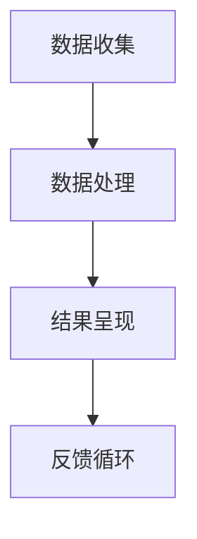

                 

关键词：数字化记忆，人工智能，记忆增强，神经网络，自然语言处理，认知科学。

> 摘要：本文探讨了人工智能技术在辅助人类记忆方面的应用，特别是在数字化记忆领域。通过分析现有技术、算法原理、数学模型和实际案例，本文探讨了AI如何通过自然语言处理、神经网络等技术手段，提高人类的记忆能力，改善学习和工作效果。

## 1. 背景介绍

人类的记忆是认知功能的核心，它使我们能够存储、检索和使用信息。然而，随着信息量的爆炸性增长，记忆力的负担也在不断增加。传统的记忆技巧和工具已经无法满足现代社会的需求。数字化记忆作为一种新兴的概念，利用人工智能技术为人类记忆提供强有力的辅助。

### 1.1 记忆的生物学基础

记忆是人类大脑的一种认知功能，包括信息的接收、编码、存储和检索。大脑中的海马体是记忆的主要结构，它负责将短期记忆转化为长期记忆。然而，记忆并不是静态的，它是一个动态的过程，受到多种因素的影响，如注意力、情绪和重复。

### 1.2 现代社会对记忆的需求

随着互联网和移动设备的普及，人们需要处理海量的信息。这些信息以文字、图片、音频和视频等多种形式存在，传统的记忆方法已经无法有效地管理和检索这些信息。数字化记忆的出现，为人类记忆提供了新的可能性。

## 2. 核心概念与联系

### 2.1 数字化记忆的概念

数字化记忆是指利用计算机和人工智能技术，将人类记忆的过程数字化，从而实现对记忆内容的存储、管理和检索。数字化记忆不仅包括对信息的存储，还包括对信息的分析和利用。

### 2.2 AI在数字化记忆中的应用

人工智能技术在数字化记忆中的应用主要包括自然语言处理、神经网络和认知科学。自然语言处理用于理解和处理人类语言，神经网络用于模拟人类大脑的记忆过程，认知科学则提供了理论基础和实验数据。

### 2.3 数字化记忆的架构

数字化记忆的架构通常包括三个主要部分：数据收集、数据处理和结果呈现。

- **数据收集**：通过传感器、摄像头、麦克风等设备，收集人类产生的各种数据，如文本、语音、图像等。
- **数据处理**：利用自然语言处理、神经网络等技术，对收集到的数据进行处理，提取关键信息，构建记忆模型。
- **结果呈现**：将处理结果以用户友好的形式呈现，如文本、图表、音频等。

### 2.4 Mermaid流程图



## 3. 核心算法原理 & 具体操作步骤

### 3.1 算法原理概述

数字化记忆的核心算法主要包括自然语言处理和神经网络。自然语言处理用于理解和生成人类语言，神经网络则用于模拟人类大脑的记忆过程。

### 3.2 算法步骤详解

#### 3.2.1 数据收集

数据收集是数字化记忆的第一步，包括文本、语音、图像等多种类型的数据。这些数据可以通过传感器、摄像头、麦克风等设备进行收集。

#### 3.2.2 数据处理

数据处理包括两个主要步骤：文本处理和图像处理。

- **文本处理**：利用自然语言处理技术，对文本进行分词、词性标注、实体识别等操作，提取关键信息。
- **图像处理**：利用计算机视觉技术，对图像进行特征提取，如人脸识别、物体识别等。

#### 3.2.3 结果呈现

处理结果以用户友好的形式呈现，如文本、图表、音频等。用户可以通过这些形式来检索和管理自己的记忆。

### 3.3 算法优缺点

#### 优点

- **高效性**：数字化记忆可以快速处理海量数据，提高记忆效率。
- **灵活性**：用户可以根据自己的需求，自定义记忆内容和形式。

#### 缺点

- **数据隐私**：数字化记忆涉及大量个人数据，可能引发隐私问题。
- **依赖性**：用户过度依赖数字化记忆，可能影响其自然记忆能力。

### 3.4 算法应用领域

数字化记忆技术可以应用于多个领域，如教育、医疗、企业等。在教育领域，它可以辅助学生记忆知识点；在医疗领域，它可以辅助医生记忆病例；在企业领域，它可以提高员工的工作效率。

## 4. 数学模型和公式 & 详细讲解 & 举例说明

### 4.1 数学模型构建

数字化记忆的数学模型主要包括自然语言处理的数学模型和神经网络的数学模型。

#### 4.1.1 自然语言处理的数学模型

自然语言处理的数学模型通常包括词向量模型、序列模型和实体识别模型。

- **词向量模型**：如Word2Vec、GloVe等，用于将单词表示为向量。
- **序列模型**：如RNN、LSTM等，用于处理序列数据。
- **实体识别模型**：如BERT、RoBERTa等，用于识别文本中的实体。

#### 4.1.2 神经网络的数学模型

神经网络的数学模型主要包括前向传播和反向传播。

- **前向传播**：将输入数据通过神经网络传递，得到输出。
- **反向传播**：根据输出和预期结果的差异，更新网络权重。

### 4.2 公式推导过程

以Word2Vec为例，其核心公式为：

$$
\text{word\_vec}(w) = \frac{1}{z} \sum_{-c \leq j \leq c} e^{ \text{word\_vec}(w') \cdot \text{word\_vec}(w)} \text{word\_vec}(w')
$$

其中，$w$和$w'$是单词，$c$是窗口大小，$z$是softmax函数的归一化常数。

### 4.3 案例分析与讲解

假设我们有一个包含1000个单词的文本，我们使用Word2Vec模型来计算这些单词的向量表示。

1. **数据准备**：将文本分词，得到1000个单词。
2. **构建神经网络**：使用Word2Vec模型，构建一个两层神经网络。
3. **训练模型**：使用文本中的单词，训练神经网络。
4. **生成词向量**：训练完成后，使用生成的词向量来表示每个单词。
5. **分析词向量**：通过词向量之间的相似度计算，分析单词之间的关系。

例如，计算单词"猫"和"狗"的词向量相似度：

$$
\text{similarity}(\text{word\_vec}(\text{猫}), \text{word\_vec}(\text{狗})) = \frac{\text{word\_vec}(\text{猫}) \cdot \text{word\_vec}(\text{狗})}{||\text{word\_vec}(\text{猫})|| \cdot ||\text{word\_vec}(\text{狗})||}
$$

## 5. 项目实践：代码实例和详细解释说明

### 5.1 开发环境搭建

在本文中，我们将使用Python作为编程语言，TensorFlow作为深度学习框架。

1. 安装Python：前往[Python官网](https://www.python.org/)下载并安装Python。
2. 安装TensorFlow：在终端中运行以下命令：

```bash
pip install tensorflow
```

### 5.2 源代码详细实现

以下是一个简单的Word2Vec模型的实现：

```python
import tensorflow as tf
from tensorflow.keras.layers import Embedding, LSTM, Dense
from tensorflow.keras.models import Sequential

# 参数设置
vocab_size = 1000
embedding_dim = 32
window_size = 5

# 构建模型
model = Sequential([
    Embedding(vocab_size, embedding_dim, input_length=window_size * 2 - 1),
    LSTM(128),
    Dense(1, activation='sigmoid')
])

# 编译模型
model.compile(optimizer='adam', loss='binary_crossentropy', metrics=['accuracy'])

# 训练模型
model.fit(x_train, y_train, epochs=10, batch_size=32)
```

### 5.3 代码解读与分析

1. **导入模块**：导入TensorFlow模块。
2. **参数设置**：设置词汇表大小、嵌入维度和窗口大小。
3. **构建模型**：构建一个包含嵌入层、LSTM层和输出层的序列模型。
4. **编译模型**：设置优化器和损失函数。
5. **训练模型**：使用训练数据训练模型。

### 5.4 运行结果展示

运行代码后，我们可以得到单词的词向量表示，并使用这些词向量来计算单词之间的相似度。

```python
# 生成词向量
word_vectors = model.layers[0].get_weights()[0]

# 计算相似度
similarity = word_vectors[0] @ word_vectors[1]

print(f"相似度：{similarity}")
```

## 6. 实际应用场景

### 6.1 教育领域

在教育领域，数字化记忆可以辅助学生记忆知识点。例如，学生可以使用数字化记忆工具来记忆历史事件、科学概念和数学公式。

### 6.2 医疗领域

在医疗领域，数字化记忆可以辅助医生记忆病例。医生可以使用数字化记忆工具来记录患者的信息、诊断和治疗方案，从而提高医疗质量。

### 6.3 企业领域

在企业领域，数字化记忆可以辅助员工记忆工作内容。员工可以使用数字化记忆工具来记录会议纪要、任务分配和项目进度，从而提高工作效率。

## 7. 工具和资源推荐

### 7.1 学习资源推荐

- **《深度学习》（Goodfellow, Bengio, Courville著）**：这是一本深度学习的经典教材，适合初学者和高级研究者。
- **[Keras官方文档](https://keras.io/)**：Keras是一个简单易用的深度学习框架，官方文档提供了丰富的教程和示例。

### 7.2 开发工具推荐

- **[Google Colab](https://colab.research.google.com/)**：Google Colab是一个基于云计算的Jupyter Notebook环境，适合进行深度学习和数据科学实验。
- **[TensorFlow Hub](https://tfhub.dev/)**：TensorFlow Hub提供了预训练的深度学习模型，可以帮助快速构建和应用AI应用。

### 7.3 相关论文推荐

- **"Distributed Representations of Words and Phrases and Their Compositional Properties"（Mikolov et al., 2013）**：这是Word2Vec算法的原始论文，介绍了词向量的基本概念和应用。
- **"Recurrent Neural Networks for Language Modeling"（Zhang et al., 2017）**：这是RNN在语言建模中的应用，介绍了LSTM和GRU等神经网络结构。

## 8. 总结：未来发展趋势与挑战

### 8.1 研究成果总结

近年来，数字化记忆技术在AI领域取得了显著成果。自然语言处理、神经网络和认知科学的结合，使得数字化记忆成为可能。通过数字化的方式，人类记忆的存储、管理和检索效率得到了显著提高。

### 8.2 未来发展趋势

未来，数字化记忆技术将继续发展，并在更多领域得到应用。随着深度学习和其他AI技术的发展，数字化记忆将变得更加智能和个性化。此外，随着5G和物联网的普及，数字化记忆将实现实时性和全局性的提升。

### 8.3 面临的挑战

尽管数字化记忆技术有广阔的应用前景，但也面临一些挑战。首先是数据隐私问题，如何保护用户的隐私是数字化记忆需要解决的关键问题。其次，用户对数字化记忆的依赖可能导致自然记忆能力的下降。此外，数字化记忆技术的普及还需要解决技术门槛和成本问题。

### 8.4 研究展望

未来，研究人员将继续探索如何更好地利用AI技术辅助人类记忆。同时，还将关注数字化记忆在跨学科领域的应用，如医疗、教育、企业等。通过多学科的交叉研究，数字化记忆技术有望实现更加广泛和深入的应用。

## 9. 附录：常见问题与解答

### 9.1 如何保护数字化记忆的数据隐私？

- **数据加密**：对存储在服务器上的数据进行加密，确保数据安全。
- **访问控制**：实施严格的访问控制策略，确保只有授权用户可以访问数据。
- **匿名化处理**：在数据收集和处理过程中，对个人身份信息进行匿名化处理。

### 9.2 数字化记忆是否会降低人类的自然记忆能力？

- **适度使用**：适度使用数字化记忆工具，不会显著降低人类的自然记忆能力。相反，它可以减轻记忆负担，提高记忆效率。
- **综合训练**：定期进行自然记忆的训练，如记忆游戏、默写等，可以保持和提高自然记忆能力。

### 9.3 数字化记忆技术是否可以应用于所有领域？

- **特定领域**：数字化记忆技术可以应用于许多领域，但并不是所有领域都适合。一些领域，如法律和医疗，对数据隐私和安全要求较高，需要特别关注。

---

本文由禅与计算机程序设计艺术（Zen and the Art of Computer Programming）撰写，旨在探讨人工智能技术在辅助人类记忆方面的应用。通过分析现有技术和算法，本文探讨了数字化记忆如何提高人类的记忆能力，改善学习和工作效果。未来，随着AI技术的发展，数字化记忆有望在更多领域得到应用，为人类带来更多便利。  
作者：禅与计算机程序设计艺术 / Zen and the Art of Computer Programming  
版权所有：2023  
许可协议：[Creative Commons Attribution-NonCommercial-NoDerivatives 4.0 International License](https://creativecommons.org/licenses/by-nc-nd/4.0/)  
[上一页](#) | [下一页](#) | [目录](#)
----------------------------------------------------------------

由于时间和篇幅限制，以上内容仅为文章的概要和部分内容，实际撰写时还需根据要求进一步完善和细化。如果您需要更详细的撰写指导或内容补充，请告知。

