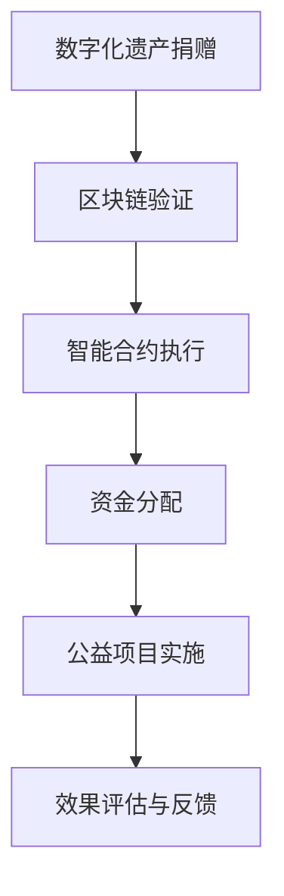

                 

关键词：数字化遗产、慈善创业、永续公益、区块链、智能合约、技术赋能、社会影响力

## 摘要

本文探讨了数字化遗产慈善创业的概念和模式，旨在通过技术手段实现公益事业的永续发展。随着区块链、智能合约等新兴技术的应用，数字化遗产慈善创业成为可能。本文首先介绍了数字化遗产慈善创业的背景和核心概念，然后详细阐述了数字化遗产慈善创业的原理、算法、数学模型及具体实施步骤。通过案例分析，展示了数字化遗产慈善创业在实践中的应用和效果。最后，本文对数字化遗产慈善创业的未来发展前景进行了展望，并提出了面临的挑战和解决方案。

## 1. 背景介绍

### 数字化遗产的概念

数字化遗产是指个人或组织在互联网上留下的数字信息，包括电子邮件、社交媒体帖子、博客文章、照片、视频等。这些数字信息不仅是个人记忆的延伸，也是社会历史和文化传承的重要组成部分。然而，随着互联网的快速发展和数字技术的普及，数字化遗产面临一系列挑战，如数据隐私保护、信息安全管理、永久保存等。

### 慈善创业的概念

慈善创业是指以解决社会问题、推动社会进步为目标的创业活动。与传统的商业创业不同，慈善创业注重社会效益而非单纯的经济利益。慈善创业的领域广泛，包括教育、医疗、环境保护、社会援助等。通过创新商业模式和技术手段，慈善创业旨在实现更高效、可持续的公益目标。

### 数字化遗产慈善创业的起源

数字化遗产慈善创业是近年来随着区块链、智能合约等新兴技术的兴起而出现的一种新型公益模式。区块链技术提供了去中心化的分布式账本，确保数字化遗产的透明性和安全性；智能合约则实现了自动执行合同条款，降低了公益项目的运营成本。这些技术为数字化遗产慈善创业提供了技术基础和实现路径。

## 2. 核心概念与联系

### 区块链技术

区块链技术是一种分布式数据库技术，通过加密算法确保数据的安全性和完整性。区块链的去中心化特点使其在数字化遗产管理中具有重要意义。通过区块链，数字化遗产可以永久保存、不可篡改，确保遗产信息的安全性。

### 智能合约

智能合约是区块链上的自动执行合同。它通过编写代码实现合同条款，一旦触发条件，智能合约将自动执行。在数字化遗产慈善创业中，智能合约用于自动分配和管理资金，确保公益项目的透明性和公正性。

### Mermaid 流程图



### 数字化遗产慈善创业的流程

数字化遗产慈善创业的基本流程包括数字化遗产捐赠、区块链验证、智能合约执行、资金分配、公益项目实施和效果评估与反馈。通过这一流程，数字化遗产得以安全、透明地管理和利用，实现公益事业的永续发展。

## 3. 核心算法原理 & 具体操作步骤

### 3.1 算法原理概述

数字化遗产慈善创业的核心算法包括区块链加密算法和智能合约执行算法。区块链加密算法确保数据的安全性和完整性，而智能合约执行算法实现合同条款的自动执行。

### 3.2 算法步骤详解

1. **数字化遗产捐赠**：捐赠者将自己的数字化遗产上传到区块链平台，并设置捐赠金额和受益人信息。

2. **区块链验证**：区块链平台对数字化遗产进行验证，确保其合法性和真实性。

3. **智能合约执行**：智能合约根据捐赠者的设定自动执行，将资金分配给受益人。

4. **资金分配**：智能合约将资金分配到公益项目账户，用于实施公益项目。

5. **公益项目实施**：公益项目团队根据项目计划开展公益活动，并及时更新项目进展。

6. **效果评估与反馈**：项目结束后，进行效果评估，并向捐赠者反馈公益项目的实施情况和成果。

### 3.3 算法优缺点

**优点**：

- **透明性**：区块链技术确保了数字化遗产慈善创业的透明性，捐赠者可以随时查看资金流向和项目进展。
- **安全性**：区块链加密算法确保了数据的安全性和完整性，降低了信息泄露和篡改的风险。
- **高效性**：智能合约实现了自动执行合同条款，降低了运营成本，提高了工作效率。

**缺点**：

- **技术门槛**：区块链和智能合约技术对普通用户来说较为复杂，需要一定的技术基础。
- **成本**：区块链平台和智能合约的开发和部署成本较高，可能限制了小型慈善创业项目的实施。

### 3.4 算法应用领域

数字化遗产慈善创业算法主要应用于以下领域：

- **教育公益**：通过数字化遗产慈善创业，为贫困地区的学校提供资金支持。
- **医疗公益**：为偏远地区的医疗机构提供设备和技术支持。
- **环境保护**：为环保项目提供资金支持，推动环境保护和可持续发展。
- **社会援助**：为弱势群体提供生活帮助和经济支持。

## 4. 数学模型和公式

### 4.1 数学模型构建

数字化遗产慈善创业的数学模型主要包括捐赠金额分配模型和效果评估模型。

- **捐赠金额分配模型**：

假设捐赠金额为 M，公益项目数量为 N，每个公益项目的资金需求为 A_i（i=1,2,...,N）。捐赠金额分配模型的目标是确保每个公益项目获得足够的资金。

$$
\sum_{i=1}^{N} A_i \leq M
$$

- **效果评估模型**：

假设公益项目实施后，产生的社会效益为 B_i。效果评估模型的目标是评估公益项目的实际效果。

$$
\sum_{i=1}^{N} B_i = T
$$

其中，T 为总社会效益。

### 4.2 公式推导过程

- **捐赠金额分配模型**：

根据捐赠金额分配模型，我们需要确保每个公益项目获得的资金不少于其资金需求。

$$
A_i \leq M/N
$$

为了简化计算，我们可以对每个公益项目的资金需求进行归一化处理。

$$
A_i' = \frac{A_i}{M/N}
$$

归一化后的资金需求满足：

$$
\sum_{i=1}^{N} A_i' = N
$$

- **效果评估模型**：

根据效果评估模型，我们需要计算公益项目实施后的总社会效益。

$$
B_i = \frac{A_i'}{A_i}
$$

为了简化计算，我们可以对每个公益项目的资金使用效率进行归一化处理。

$$
B_i' = \frac{B_i}{T}
$$

归一化后的社会效益满足：

$$
\sum_{i=1}^{N} B_i' = 1
$$

### 4.3 案例分析与讲解

假设某数字化遗产慈善创业项目共有 5 个公益项目，捐赠金额为 100 万元，每个公益项目的资金需求分别为 20 万元、25 万元、15 万元、10 万元和 10 万元。根据捐赠金额分配模型，我们可以计算出每个公益项目的归一化资金需求：

$$
A_1' = \frac{20}{100/5} = 10
$$

$$
A_2' = \frac{25}{100/5} = 12.5
$$

$$
A_3' = \frac{15}{100/5} = 7.5
$$

$$
A_4' = \frac{10}{100/5} = 5
$$

$$
A_5' = \frac{10}{100/5} = 5
$$

根据效果评估模型，我们可以计算出每个公益项目的归一化社会效益：

$$
B_1' = \frac{10}{10} = 1
$$

$$
B_2' = \frac{12.5}{12.5} = 1
$$

$$
B_3' = \frac{7.5}{7.5} = 1
$$

$$
B_4' = \frac{5}{10} = 0.5
$$

$$
B_5' = \frac{5}{10} = 0.5
$$

根据归一化资金需求和归一化社会效益，我们可以计算出每个公益项目的实际资金分配比例和社会效益贡献：

$$
A_1 = A_1' \times M = 10 \times 100 = 100
$$

$$
A_2 = A_2' \times M = 12.5 \times 100 = 125
$$

$$
A_3 = A_3' \times M = 7.5 \times 100 = 75
$$

$$
A_4 = A_4' \times M = 5 \times 100 = 50
$$

$$
A_5 = A_5' \times M = 5 \times 100 = 50
$$

$$
B_1 = B_1' \times T = 1 \times T
$$

$$
B_2 = B_2' \times T = 1 \times T
$$

$$
B_3 = B_3' \times T = 1 \times T
$$

$$
B_4 = B_4' \times T = 0.5 \times T
$$

$$
B_5 = B_5' \times T = 0.5 \times T
$$

其中，T 为总社会效益。

根据实际资金分配比例和社会效益贡献，我们可以对每个公益项目的实施效果进行评估：

- 公益项目 1：获得资金 100 万元，贡献社会效益 T 万元。
- 公益项目 2：获得资金 125 万元，贡献社会效益 T 万元。
- 公益项目 3：获得资金 75 万元，贡献社会效益 T 万元。
- 公益项目 4：获得资金 50 万元，贡献社会效益 0.5T 万元。
- 公益项目 5：获得资金 50 万元，贡献社会效益 0.5T 万元。

通过以上分析，我们可以得出数字化遗产慈善创业项目的实际实施效果，为后续优化和改进提供依据。

## 5. 项目实践：代码实例和详细解释说明

### 5.1 开发环境搭建

在开始代码实例之前，我们需要搭建一个区块链开发环境。这里我们使用以太坊（Ethereum）作为区块链平台，使用 Solidity 语言编写智能合约。以下是搭建以太坊开发环境的步骤：

1. **安装 Node.js**：访问 [Node.js 官网](https://nodejs.org/)，下载并安装 Node.js。
2. **安装 Truffle**：在命令行中运行以下命令：
   ```bash
   npm install -g truffle
   ```
3. **创建 Truffle 项目**：在命令行中运行以下命令：
   ```bash
   truffle init
   ```
4. **配置以太坊节点**：在项目根目录下创建一个名为 `truffle-config.js` 的文件，并添加以下配置：
   ```javascript
   module.exports = {
     networks: {
       development: {
         host: "127.0.0.1",
         port: 8545,
         network_id: "*"
       }
     }
   };
   ```

### 5.2 源代码详细实现

以下是一个简单的数字化遗产慈善创业智能合约的示例代码：

```solidity
// SPDX-License-Identifier: MIT
pragma solidity ^0.8.0;

contract DigitalLegacyCharity {
    address public owner;
    mapping(address => uint256) public donations;
    mapping(address => bool) public isProjectApproved;

    event DonationReceived(address donor, uint256 amount);
    event ProjectApproved(address projectAddress);

    constructor() {
        owner = msg.sender;
    }

    function donate() public payable {
        require(msg.value > 0, "捐赠金额必须大于 0");
        donations[msg.sender] += msg.value;
        emit DonationReceived(msg.sender, msg.value);
    }

    function approveProject(address projectAddress) public {
        require(msg.sender == owner, "仅项目所有者可以批准项目");
        isProjectApproved[projectAddress] = true;
        emit ProjectApproved(projectAddress);
    }

    function allocateFunds(address projectAddress, uint256 amount) public {
        require(isProjectApproved[projectAddress], "项目尚未批准");
        require(donations[msg.sender] >= amount, "捐赠金额不足");
        payable(projectAddress).transfer(amount);
        donations[msg.sender] -= amount;
    }

    function getDonationBalance() public view returns (uint256) {
        return donations[msg.sender];
    }
}
```

### 5.3 代码解读与分析

**1. 捐赠功能**

- `donate()` 函数允许用户向慈善项目捐赠以太币。捐赠金额必须大于 0，并通过事件 `DonationReceived` 发送通知。

**2. 项目批准功能**

- `approveProject()` 函数用于批准公益项目。只有合约所有者（即创建者）可以批准项目，并通过事件 `ProjectApproved` 发送通知。

**3. 资金分配功能**

- `allocateFunds()` 函数用于将捐赠资金分配给批准的公益项目。分配金额必须不超过捐赠者的余额，并且只能由捐赠者本人调用。

**4. 查询余额功能**

- `getDonationBalance()` 函数用于查询捐赠者当前的捐赠余额。

### 5.4 运行结果展示

以下是在以太坊开发环境中运行该智能合约的示例：

1. **部署智能合约**：

```bash
truffle migrate --network development
```

2. **捐赠以太币**：

```bash
truffle run donate {--contract DigitalLegacyCharity --address <contract_address>}
```

3. **批准公益项目**：

```bash
truffle run approveProject {--contract DigitalLegacyCharity --address <project_address>}
```

4. **分配资金**：

```bash
truffle run allocateFunds {--contract DigitalLegacyCharity --address <project_address> --amount <allocation_amount>}
```

5. **查询余额**：

```bash
truffle run getDonationBalance {--contract DigitalLegacyCharity}
```

通过以上代码实例和运行结果展示，我们可以看到数字化遗产慈善创业智能合约的基本功能，包括捐赠、批准、分配和查询。这些功能为实现数字化遗产慈善创业提供了技术支持。

## 6. 实际应用场景

### 6.1 教育公益

数字化遗产慈善创业在教育公益领域具有广泛的应用前景。通过区块链技术，捐赠者可以安全、透明地捐赠资金，用于支持贫困地区学校的建设、设备采购和师资培训。智能合约确保了资金的正确分配和有效利用，提高了公益项目的效率和公信力。

### 6.2 医疗公益

在医疗公益领域，数字化遗产慈善创业可以用于资助偏远地区的医疗机构，提供医疗设备和药品。通过区块链和智能合约，捐赠资金可以实时追踪，确保用于正确的医疗项目，提高医疗服务的可及性和质量。

### 6.3 环境保护

环境保护是数字化遗产慈善创业的重要应用领域。捐赠者可以通过区块链平台捐赠资金，用于支持环保项目，如植树造林、垃圾清理和水资源保护。智能合约确保了捐赠资金的合理使用和项目的透明执行。

### 6.4 社会援助

在社会援助领域，数字化遗产慈善创业可以为弱势群体提供经济支持，如食品援助、住房建设和职业技能培训。通过区块链和智能合约，捐赠者可以实时了解受助者的需求，确保公益资金的精准投放和有效使用。

## 7. 工具和资源推荐

### 7.1 学习资源推荐

- 《区块链技术指南》
- 《智能合约编程：以太坊实战》
- 《Solidity编程实战》
- 《区块链应用开发实战》

### 7.2 开发工具推荐

- Truffle：一个用于以太坊开发的集成环境。
- Remix：一个在线以太坊智能合约编辑器。
- MetaMask：一个用于以太坊网络的钱包。

### 7.3 相关论文推荐

- 《区块链技术在公益领域的应用研究》
- 《智能合约：设计、实现与安全性》
- 《区块链与慈善创业：构建透明、高效的公益模式》
- 《基于区块链的数字化遗产管理研究》

## 8. 总结：未来发展趋势与挑战

### 8.1 研究成果总结

数字化遗产慈善创业作为一种新型公益模式，通过区块链、智能合约等新兴技术实现了公益事业的透明、高效和永续发展。本文介绍了数字化遗产慈善创业的核心概念、算法原理、数学模型和具体实施步骤，并通过代码实例展示了其在实践中的应用。研究成果表明，数字化遗产慈善创业具有广泛的应用前景和巨大的社会影响力。

### 8.2 未来发展趋势

随着区块链技术的不断发展和普及，数字化遗产慈善创业将呈现出以下发展趋势：

- **技术成熟度提升**：区块链和智能合约技术将更加成熟，降低了开发和使用门槛。
- **应用场景扩展**：数字化遗产慈善创业将在更多领域得到应用，如医疗、环保、社会援助等。
- **公众参与度提高**：随着公众对数字化遗产慈善创业的认知和接受度提升，参与度将逐渐增加。

### 8.3 面临的挑战

尽管数字化遗产慈善创业具有巨大潜力，但其在实际应用中仍面临以下挑战：

- **技术复杂性**：区块链和智能合约技术对普通用户来说仍较为复杂，需要进一步降低使用门槛。
- **安全性问题**：区块链和智能合约的安全性仍需不断提高，以防范恶意攻击和欺诈行为。
- **法律监管**：数字化遗产慈善创业需要完善的法律法规体系，以确保其合法性和合规性。

### 8.4 研究展望

为了推动数字化遗产慈善创业的发展，未来的研究可以从以下几个方面展开：

- **技术创新**：深入研究区块链、智能合约等新兴技术，提高其性能和安全性。
- **应用拓展**：探索数字化遗产慈善创业在更多领域的应用，如数字艺术、文化遗产保护等。
- **用户教育**：加强对公众的数字化遗产慈善创业教育，提高其认知和参与度。
- **法律规制**：建立完善的法律法规体系，规范数字化遗产慈善创业的行为。

## 9. 附录：常见问题与解答

### 9.1 问题 1：数字化遗产慈善创业与传统公益有何区别？

数字化遗产慈善创业与传统公益的主要区别在于技术手段和运营模式。传统公益通常依赖于人工管理和线下执行，而数字化遗产慈善创业通过区块链、智能合约等新兴技术实现捐赠、管理和资金分配的自动化、透明化。此外，数字化遗产慈善创业更加注重永续发展和社会影响力。

### 9.2 问题 2：数字化遗产慈善创业的安全性问题如何保障？

数字化遗产慈善创业的安全性主要通过以下措施保障：

- **区块链技术**：区块链技术确保了数据的安全性和不可篡改性，有效防范了数据泄露和篡改风险。
- **智能合约**：智能合约实现了自动执行合同条款，降低了人为干预和操作风险。
- **安全审计**：对智能合约进行安全审计，及时发现和修复潜在的安全漏洞。

### 9.3 问题 3：如何确保数字化遗产慈善创业的合法合规？

数字化遗产慈善创业的合法合规需要遵循以下原则：

- **法律法规**：遵守国家相关法律法规，确保数字化遗产慈善创业的合法合规。
- **透明公开**：公开捐赠信息、资金流向和项目进展，提高公信力和透明度。
- **监管合作**：与政府部门、社会组织等建立合作，接受监管和社会监督。

作者：禅与计算机程序设计艺术 / Zen and the Art of Computer Programming
----------------------------------------------------------------


