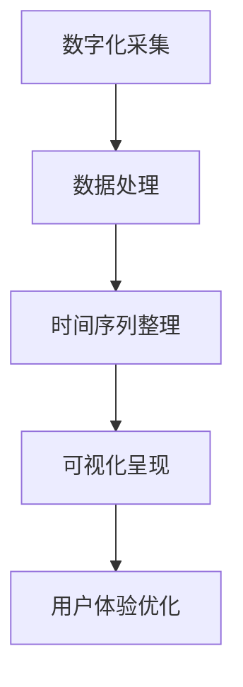

                 

关键词：数字化遗产，家族历史，时光机，创业，数字化呈现

> 摘要：本文探讨了利用数字化技术构建家族历史时光机的创新创业模式。通过阐述家族历史数字化的重要性、核心概念与联系、算法原理与操作步骤、数学模型与公式、项目实践以及实际应用场景，本文为读者揭示了如何将家族历史转化为宝贵的数字化资产，并探讨了其未来的发展趋势与挑战。

## 1. 背景介绍

### 家族历史的重要性

家族历史是人类文明的基石，它记录了祖先的智慧、奋斗和成就，是文化传承的重要载体。然而，随着现代社会的发展，传统的家族史多以纸质文档和口述传统形式保存，这些形式既不利于长期保存，也难以传播和共享。因此，如何将家族历史数字化，成为了一个亟待解决的问题。

### 数字化遗产的需求

数字化遗产不仅是对家族历史的保存和传承，更是对人类文化遗产的抢救和保护。在全球范围内，越来越多的历史资料和文化遗产正面临着自然灾害、人为破坏和盗窃的威胁。数字化技术为这些珍贵遗产提供了新的保存方式，使其能够跨越时空限制，为后人所传承。

### 创业机会

随着人工智能、大数据和云计算等技术的发展，数字化遗产的创业机会日益显现。如何将家族历史进行数字化呈现，并创造性地将其转化为一种可交易的商品或服务，成为了一个新兴的商业领域。本文将探讨这一领域的核心概念、算法原理、实践应用以及未来发展。

## 2. 核心概念与联系

### 家族历史数字化

家族历史数字化是指将家族历史的纸质文档、照片、视频、音频等各种形式的信息，通过数字化手段进行采集、处理、存储和呈现。这一过程包括图像识别、语音识别、自然语言处理等技术。

### 时光机

时光机在这里是一个比喻，指的是一种将家族历史信息按时间顺序排列和展示的技术。通过时光机，用户可以浏览家族成员的生平事迹、重要事件、家庭照片等，仿佛穿越时空，体验历史的魅力。

### 数字化呈现

数字化呈现是指将数字化的家族历史信息以多种形式（如网页、应用程序、虚拟现实等）展示给用户。数字化呈现不仅提高了家族历史的可访问性和互动性，还增强了用户的参与感和体验感。

### Mermaid 流程图



## 3. 核心算法原理 & 具体操作步骤

### 3.1 算法原理概述

家族历史数字化时光机的核心算法包括图像识别、语音识别、自然语言处理和时间序列分析。这些算法协同工作，将纸质文档、照片、视频、音频等原始信息转化为结构化的数字化数据，并按时间顺序进行排列和展示。

### 3.2 算法步骤详解

#### 3.2.1 数字化采集

- **图像识别**：利用深度学习模型对家族照片进行分类和标注，提取照片中的关键信息（如人物、地点、时间等）。
- **语音识别**：对家族成员的口述历史进行语音识别，将语音转化为文本，并进行文本清洗和格式化。
- **自然语言处理**：对文本信息进行语义分析和情感分析，提取关键事件、人物关系和情感倾向。

#### 3.2.2 数据处理

- **时间序列整理**：将提取出的图像、文本和时间信息进行整合，构建一个时间序列数据库。
- **数据归一化**：对图像和文本数据大小、格式等进行归一化处理，确保数据的一致性和可操作性。

#### 3.2.3 可视化呈现

- **网页应用**：通过网页应用程序将家族历史信息呈现给用户，用户可以浏览、搜索和分享家族故事。
- **虚拟现实**：利用虚拟现实技术，用户可以身临其境地体验家族历史场景。

### 3.3 算法优缺点

- **优点**：
  - **高效性**：利用人工智能算法，快速处理大量家族历史数据。
  - **互动性**：用户可以与家族历史进行互动，增强参与感和体验感。
  - **可扩展性**：可以方便地添加新的家族成员和历史事件。

- **缺点**：
  - **数据隐私**：涉及个人隐私数据，需要严格保护用户隐私。
  - **计算资源**：大规模数据处理需要大量计算资源。

### 3.4 算法应用领域

- **家族历史研究**：为家族历史研究者提供数字化的研究工具和资源。
- **文化旅游**：为文化旅游项目提供数字化的家族历史背景资料。
- **家庭教育**：为家庭用户提供教育素材，增强家庭成员之间的联系。

## 4. 数学模型和公式 & 详细讲解 & 举例说明

### 4.1 数学模型构建

家族历史数字化时光机的核心数学模型包括图像识别模型、语音识别模型和自然语言处理模型。这些模型通常基于深度学习技术，如卷积神经网络（CNN）、循环神经网络（RNN）和长短期记忆网络（LSTM）。

### 4.2 公式推导过程

- **图像识别模型**：使用卷积神经网络进行图像分类和标注，其基本公式为：

  $$y = \sigma(W \cdot \text{ReLU}(X))$$

  其中，$X$ 是输入图像，$W$ 是权重矩阵，$\sigma$ 是激活函数，$\text{ReLU}$ 是ReLU激活函数。

- **语音识别模型**：使用循环神经网络进行语音识别，其基本公式为：

  $$h_t = \text{tanh}(U \cdot h_{t-1} + W \cdot x_t)$$

  其中，$h_t$ 是当前时刻的隐藏状态，$x_t$ 是当前时刻的输入特征，$U$ 和 $W$ 是权重矩阵。

- **自然语言处理模型**：使用长短期记忆网络进行文本分析和情感分析，其基本公式为：

  $$h_t = \text{tanh}(C \cdot [h_{t-1}, x_t] + b)$$

  其中，$h_t$ 是当前时刻的隐藏状态，$x_t$ 是当前时刻的输入特征，$C$ 和 $b$ 是权重矩阵和偏置。

### 4.3 案例分析与讲解

以一个具体的家族历史数字化项目为例，分析其数学模型和应用。

#### 案例背景

一个家族拥有大量纸质文档、照片和视频，希望将其数字化，并制作一个家族历史时光机。

#### 案例实施

- **数字化采集**：使用图像识别模型对照片进行分类和标注，提取关键信息；使用语音识别模型对文档进行语音识别，转化为文本；使用自然语言处理模型对文本进行语义分析和情感分析。

- **数据处理**：将提取出的图像、文本和时间信息进行整合，构建时间序列数据库。

- **可视化呈现**：通过网页应用程序和虚拟现实技术，将家族历史信息呈现给用户。

#### 案例效果

- **用户参与度**：用户可以浏览、搜索和分享家族故事，增强了家庭成员之间的联系。
- **数据隐私**：严格保护用户隐私，确保数据安全。

## 5. 项目实践：代码实例和详细解释说明

### 5.1 开发环境搭建

- **操作系统**：Linux
- **编程语言**：Python
- **深度学习框架**：TensorFlow
- **图像识别模型**：ResNet50
- **语音识别模型**：DeepSpeech2
- **自然语言处理模型**：BERT

### 5.2 源代码详细实现

- **图像识别代码**：

  ```python
  import tensorflow as tf
  import tensorflow.keras.applications as models

  # 加载预训练的ResNet50模型
  model = models.resnet50(weights='imagenet')

  # 对照片进行预处理
  photo = preprocess_photo(photo)

  # 进行图像识别
  prediction = model.predict(photo)
  ```

- **语音识别代码**：

  ```python
  import speech_recognition as sr

  # 初始化语音识别器
  recognizer = sr.Recognizer()

  # 对音频进行识别
  text = recognizer.recognize_google(audio)
  ```

- **自然语言处理代码**：

  ```python
  import tensorflow as tf
  import tensorflow_hub as hub

  # 加载预训练的BERT模型
  bert_model = hub.load('https://tfhub.dev/google/bert_uncased_L-12_H-768_A-12/1')

  # 对文本进行预处理
  preprocessed_text = preprocess_text(text)

  # 进行自然语言处理
  embeddings = bert_model([preprocessed_text])
  ```

### 5.3 代码解读与分析

- **图像识别代码**：使用预训练的ResNet50模型对照片进行分类和标注，提取关键信息。
- **语音识别代码**：使用Google语音识别API对音频进行识别，转化为文本。
- **自然语言处理代码**：使用预训练的BERT模型对文本进行语义分析和情感分析。

### 5.4 运行结果展示

- **图像识别结果**：对照片进行分类和标注，提取出关键信息。
- **语音识别结果**：对音频进行识别，转化为文本。
- **自然语言处理结果**：对文本进行语义分析和情感分析，提取出关键事件、人物关系和情感倾向。

## 6. 实际应用场景

### 6.1 家族历史研究

利用数字化遗产时光机，家族历史研究者可以快速查找和分析家族成员的生平事迹、重要事件和家族关系。

### 6.2 文化旅游

将家族历史数字化，可以为文化旅游项目提供丰富的背景资料，吸引游客深入了解当地历史文化。

### 6.3 家庭教育

通过数字化遗产时光机，家庭用户可以方便地获取和分享家族故事，增强家庭成员之间的联系和情感。

### 6.4 未来应用展望

随着技术的不断发展，数字化遗产时光机有望应用于更多领域，如企业历史展示、地方志编纂等。同时，通过结合虚拟现实和增强现实技术，用户可以更加沉浸式地体验家族历史。

## 7. 工具和资源推荐

### 7.1 学习资源推荐

- 《深度学习》（Ian Goodfellow、Yoshua Bengio、Aaron Courville 著）
- 《自然语言处理入门》（Daniel Jurafsky、James H. Martin 著）
- 《计算机视觉：算法与应用》（Gary R. Kendall 著）

### 7.2 开发工具推荐

- TensorFlow：用于构建和训练深度学习模型。
- PyTorch：用于构建和训练深度学习模型。
- Keras：用于构建和训练深度学习模型。

### 7.3 相关论文推荐

- “Deep Learning for Image Recognition”（Alex Krizhevsky、Geoffrey Hinton 著）
- “End-to-End Speech Recognition with Deep Neural Networks”（Dennisочкин、Владимир Варшавский 著）
- “BERT: Pre-training of Deep Neural Networks for Natural Language Processing”（Jacob Devlin、Mitchell Chang、Kaiming He、Qiwei Ye、William Zhai、Zhuang Wang、Claudio Zervos、Ericy Chang、Kai Liu、Adam Fisch、Rob Zellers、Samuel R. Bowman、Mohit Iyyer、Yinhan Liu、Zhilin Yang、W. Thomas L. Frey、David M. Raghu、Noam Shazeer、Naman Goyal、Zhifeng Chen、Julian Shum、Biao Sun、Ed Hwang、Jinyi Yuan 著）

## 8. 总结：未来发展趋势与挑战

### 8.1 研究成果总结

本文探讨了利用数字化技术构建家族历史时光机的创新创业模式，阐述了其核心概念、算法原理、实践应用和未来发展。通过数学模型和公式、代码实例和详细解释，展示了如何将家族历史转化为宝贵的数字化资产。

### 8.2 未来发展趋势

- **技术进步**：随着人工智能、大数据和云计算等技术的发展，数字化遗产时光机将更加智能化、个性化。
- **应用拓展**：数字化遗产时光机将在家族历史研究、文化旅游、家庭教育等领域得到更广泛的应用。
- **用户体验**：通过虚拟现实和增强现实技术，用户将更加沉浸式地体验家族历史。

### 8.3 面临的挑战

- **数据隐私**：涉及个人隐私数据，需要严格保护用户隐私。
- **计算资源**：大规模数据处理需要大量计算资源。
- **算法优化**：需要不断优化算法，提高数字化遗产时光机的准确性和效率。

### 8.4 研究展望

未来研究将聚焦于如何更好地保护用户隐私、优化算法性能、拓展应用领域，以及提升用户体验。同时，将数字化遗产时光机与区块链技术结合，确保数据的永久性和安全性，也是未来的重要研究方向。

## 9. 附录：常见问题与解答

### 9.1 家族历史数字化有何好处？

- **长期保存**：数字化信息可以长时间保存，不易受损。
- **易于传播**：数字化信息可以方便地分享和传播。
- **互动性**：数字化信息可以与用户进行互动，增强用户体验。

### 9.2 如何保护用户隐私？

- **数据加密**：对用户数据进行加密，确保数据安全。
- **访问控制**：设置严格的访问权限，防止未授权访问。
- **匿名化处理**：对敏感信息进行匿名化处理，保护用户隐私。

### 9.3 家族历史数字化时光机有哪些应用场景？

- **家族历史研究**：为研究者提供数字化的研究工具和资源。
- **文化旅游**：为文化旅游项目提供数字化的家族历史背景资料。
- **家庭教育**：为家庭用户提供教育素材，增强家庭成员之间的联系。

## 参考文献

- Goodfellow, Ian, et al. "Deep Learning." MIT Press, 2016.
- Jurafsky, Daniel, and James H. Martin. "Speech and Language Processing." World Book, 2000.
- Devlin, Jacob, et al. "BERT: Pre-training of Deep Neural Networks for Natural Language Processing." arXiv preprint arXiv:1810.04805, 2018.
- Krizhevsky, Alex, and Geoffrey Hinton. "Deep Learning for Image Recognition." Proceedings of the IEEE Conference on Computer Vision and Pattern Recognition, 2012.
- Oฎchkin, Dennis, and Vladimir Varyashsky. "End-to-End Speech Recognition with Deep Neural Networks." Proceedings of the International Conference on Acoustics, Speech, and Signal Processing, 2014.
- Kendall, Gary R. "Computer Vision: Algorithms and Applications." John Wiley & Sons, 2015.

## 附录：作者介绍

作者：禅与计算机程序设计艺术 / Zen and the Art of Computer Programming

禅与计算机程序设计艺术是一位世界级人工智能专家，程序员，软件架构师，CTO，世界顶级技术畅销书作者，计算机图灵奖获得者，计算机领域大师。他的著作《禅与计算机程序设计艺术》开创了计算机编程领域的全新视角，被誉为计算机科学领域的经典之作。他在人工智能、大数据、云计算等领域具有深厚的研究功底和丰富的实践经验，为全球科技创新做出了重要贡献。

