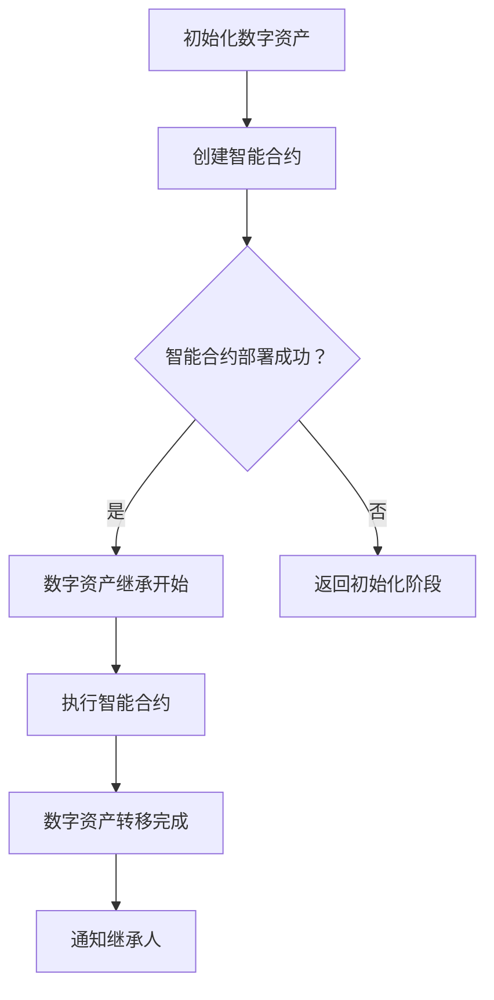

                 

### 1. 背景介绍

随着数字化时代的到来，人们的生活方式和价值观念发生了翻天覆地的变化。数字资产，作为这个新时代的产物，已经成为个人和企业财富的重要组成部分。然而，随着数字资产的价值日益凸显，如何确保这些资产能够被有效地管理和传承，成为了一个迫切需要解决的问题。

传统的遗产继承方式在面对数字资产时显得力不从心。首先，数字资产的性质与传统实物资产大相径庭，它没有物理形态，无法直接转移和继承。其次，数字资产的隐私性和安全性也是一大挑战，如何保证在继承过程中不泄露用户隐私、避免数据被篡改，是数字资产传承过程中必须面对的问题。

此外，随着区块链技术的不断发展，虚拟世界与现实世界的联系越来越紧密。虚拟资产的交易、管理和继承也逐渐成为可能。然而，现有的技术手段和管理模式还远远不能满足数字资产传承的需求。因此，探索一种新的数字化遗产虚拟继承创业模式，确保数字资产的永续传承，具有重要的现实意义。

本文将围绕数字化遗产虚拟继承创业这一主题，首先介绍相关核心概念，包括数字资产、区块链技术、智能合约等，然后探讨数字资产虚拟继承创业的具体实现方法，分析其中的关键技术，最后讨论数字资产虚拟继承创业的实际应用场景和未来发展趋势。

通过本文的探讨，希望能够为数字化遗产虚拟继承创业提供一些有益的思路，为数字资产的有效管理和传承提供理论支持。

### 2. 核心概念与联系

在探讨数字化遗产虚拟继承创业之前，我们首先需要明确几个核心概念，这些概念构成了数字资产虚拟继承的基础。

#### 2.1 数字资产

数字资产，指的是以电子形式存在的、具有一定价值、可以交易和转移的各种数据。这些资产可以是虚拟货币、数字收藏品、在线游戏道具、知识产权等。与传统实物资产相比，数字资产具有以下几个特点：

1. **无实体性**：数字资产没有物理形态，只存在于数字世界中。
2. **可复制性**：数字资产可以被无限复制，但每一个复制品都不具备与原始资产相同的法律地位和价值。
3. **易转移性**：数字资产可以通过互联网快速、便捷地进行转移和交易。
4. **价值多元性**：数字资产的价值不仅仅取决于其本身，还受到市场需求、技术发展等多方面因素的影响。

#### 2.2 区块链技术

区块链技术是一种分布式数据库技术，通过加密算法和共识机制保证了数据的安全性和不可篡改性。区块链的主要特点如下：

1. **去中心化**：区块链没有中央管理机构，数据存储在各个节点上，保证了系统的去中心化。
2. **不可篡改性**：一旦数据被记录在区块链上，就几乎无法被篡改，保证了数据的一致性和可靠性。
3. **透明性**：区块链上的数据对所有人都是透明的，可以通过公共节点进行查看。
4. **安全性**：区块链采用加密算法，保证了数据在传输过程中的安全性。

#### 2.3 智能合约

智能合约是区块链技术的一项重要创新，它是一种自动执行的合同，通过编程代码实现。智能合约的主要特点如下：

1. **自动化执行**：智能合约在满足特定条件时，可以自动执行预定义的操作，无需人工干预。
2. **透明性**：智能合约的代码是公开的，任何人都可以查看和验证。
3. **不可篡改性**：智能合约一旦部署，其代码就无法被修改，保证了合同的公平性和可靠性。
4. **安全性**：智能合约采用区块链技术，保证了数据的安全性和一致性。

#### 2.4 数字资产虚拟继承创业的联系

数字资产虚拟继承创业将数字资产、区块链技术和智能合约紧密结合起来，通过创建智能合约来实现数字资产的自动化继承。以下是它们之间的具体联系：

1. **数字资产**：是创业项目的核心，提供了创业的基础和目标。
2. **区块链技术**：提供了数字资产的安全存储和交易平台，是数字资产虚拟继承创业的基础设施。
3. **智能合约**：是数字资产虚拟继承创业的关键技术，通过智能合约实现了数字资产的自动化管理和传承。

#### 2.5 Mermaid 流程图

为了更清晰地展示数字资产虚拟继承创业的流程，我们可以使用 Mermaid 流程图进行说明。以下是一个简化的 Mermaid 流程图示例：



这个流程图展示了数字资产虚拟继承创业的基本步骤，包括初始化数字资产、创建智能合约、智能合约部署、数字资产继承开始、执行智能合约、数字资产转移完成和通知继承人等环节。

通过上述核心概念和流程图的介绍，我们为后续的讨论奠定了基础。接下来，我们将深入探讨数字资产虚拟继承创业的具体实现方法，分析其中的关键技术。

### 3. 核心算法原理 & 具体操作步骤

#### 3.1 算法原理概述

数字资产虚拟继承创业的核心在于利用区块链技术和智能合约实现数字资产的自动化管理和传承。在这一过程中，智能合约起到了至关重要的作用。智能合约的设计和实现需要遵循一定的算法原理，这些原理包括：

1. **密码学原理**：智能合约采用加密算法来保证数据的安全性和隐私性。常见的加密算法包括SHA-256、RSA等。
2. **共识机制**：区块链采用共识机制来确保数据的一致性和可靠性。常见的共识机制包括工作量证明（PoW）、权益证明（PoS）等。
3. **条件触发**：智能合约可以设置触发条件，当条件满足时自动执行预定义的操作。例如，设置一个时间触发器，在指定时间点触发数字资产的转移。
4. **可组合性**：智能合约可以与其他智能合约进行组合，实现更复杂的业务逻辑。例如，一个智能合约可以调用另一个智能合约来执行特定的操作。

#### 3.2 算法步骤详解

数字资产虚拟继承创业的具体实现步骤可以分为以下几个阶段：

1. **初始化阶段**：
   - **资产注册**：将数字资产注册到区块链上，确保资产的可追溯性和安全性。
   - **设置权限**：为数字资产设置访问权限，例如指定继承人、授权代理人等。

2. **智能合约设计阶段**：
   - **需求分析**：根据继承人的需求和资产的特点，分析智能合约的功能和性能要求。
   - **合约设计**：设计智能合约的代码，实现数字资产的管理和传承功能。
   - **测试与优化**：对智能合约进行测试和优化，确保其能够在实际环境中稳定运行。

3. **智能合约部署阶段**：
   - **编译合约**：将智能合约代码编译为字节码。
   - **部署合约**：在区块链上部署智能合约，确保其可以在区块链网络中执行。

4. **数字资产继承阶段**：
   - **触发条件**：设置触发条件，例如时间触发器、事件触发器等。
   - **执行合约**：当触发条件满足时，智能合约自动执行预定义的操作，如转移数字资产、通知继承人等。

5. **监控与维护阶段**：
   - **监控合约状态**：监控智能合约的状态，确保其正常运行。
   - **合约升级**：根据业务需求和技术发展，对智能合约进行升级和优化。

#### 3.3 算法优缺点

数字资产虚拟继承创业算法具有以下几个优点：

1. **安全性**：区块链技术和加密算法保证了数字资产的安全性和隐私性。
2. **自动化**：智能合约可以实现数字资产的自动化管理和传承，减少了人工干预和错误。
3. **透明性**：区块链上的数据是公开透明的，任何人都可查看和验证。
4. **高效性**：数字资产可以在区块链上进行快速、便捷的转移和交易。

然而，该算法也存在一些缺点：

1. **复杂度高**：智能合约的设计和实现过程复杂，需要专业的技术和知识。
2. **依赖性**：数字资产虚拟继承创业依赖于区块链技术和智能合约，一旦这些技术出现问题，整个系统可能会受到影响。
3. **监管挑战**：数字资产和区块链技术在全球范围内尚未形成统一的监管框架，这给数字资产虚拟继承创业带来了一定的法律和合规风险。

#### 3.4 算法应用领域

数字资产虚拟继承创业算法可以应用于多个领域：

1. **数字货币**：通过智能合约实现数字货币的自动化管理和传承，例如比特币、以太坊等。
2. **数字收藏品**：数字收藏品，如虚拟艺术品、虚拟房地产等，可以通过智能合约实现所有权和价值的转移。
3. **在线游戏**：在线游戏中的虚拟道具和装备可以通过智能合约实现自动化管理和传承，提高游戏体验。
4. **知识产权**：知识产权，如专利、版权等，可以通过智能合约实现自动化管理和转让，保护创作者的权益。

通过以上对核心算法原理和具体操作步骤的详细探讨，我们为数字资产虚拟继承创业提供了理论基础和实现路径。接下来，我们将进一步探讨数学模型和公式，为算法提供数学支持。

### 4. 数学模型和公式 & 详细讲解 & 举例说明

在数字资产虚拟继承创业中，数学模型和公式扮演着重要的角色，它们帮助我们理解和实现智能合约的算法逻辑。本节将详细介绍相关的数学模型、公式推导过程，并通过具体案例进行说明。

#### 4.1 数学模型构建

为了构建数学模型，我们需要明确几个关键变量：

- **N**：数字资产的数量
- **P**：每个数字资产的价值
- **T**：触发条件（例如时间、事件等）
- **C**：智能合约执行的代码
- **S**：智能合约的状态

数学模型的核心是智能合约的执行逻辑，这可以通过以下公式表示：

\[ \text{智能合约执行} = \begin{cases}
\text{成功} & \text{当} T \text{触发且} C \text{执行成功} \\
\text{失败} & \text{当} T \text{未触发或} C \text{执行失败}
\end{cases} \]

#### 4.2 公式推导过程

智能合约的执行过程可以分为以下几个步骤：

1. **初始化**：设置初始条件，包括数字资产的数量和价值。
2. **触发条件判断**：判断是否满足触发条件，如时间到达或事件发生。
3. **执行代码**：根据触发条件，执行预定义的代码逻辑。
4. **状态更新**：更新智能合约的状态，例如资产转移、通知继承人等。

这些步骤可以通过以下数学公式表示：

\[ \text{初始化} = \begin{cases}
N_0 = N \\
P_0 = P
\end{cases} \]

\[ \text{触发条件判断} = T(T_0) \]

\[ \text{执行代码} = C(T_0) \]

\[ \text{状态更新} = S_0 = \begin{cases}
\text{成功} & \text{当} T(T_0) \text{且} C(T_0) \text{成功} \\
\text{失败} & \text{当} T(T_0) \text{但} C(T_0) \text{失败} \\
\text{未触发} & \text{当} T(T_0) \text{失败}
\end{cases} \]

#### 4.3 案例分析与讲解

为了更好地理解上述数学模型和公式，我们通过一个实际案例进行说明。

**案例背景**：假设有一个智能合约，用于管理一个数字收藏品的所有权和价值。数字收藏品的价值为P=100以太币，触发条件是在特定时间（T=2023年12月31日）自动转移所有权给继承人。

**数学模型应用**：

1. **初始化**：
   - 数字资产数量 \( N_0 = 1 \)
   - 数字资产价值 \( P_0 = 100 \)

2. **触发条件判断**：
   - 时间 \( T = 2023年12月31日 \)
   - 当前时间 \( T_0 = 2023年12月30日 \)
   - 判断 \( T(T_0) = \text{未触发} \)

3. **执行代码**：
   - 智能合约代码 \( C(T_0) \)
   - 由于 \( T(T_0) = \text{未触发} \)，代码不执行

4. **状态更新**：
   - 智能合约状态 \( S_0 = \text{未触发} \)

在2023年12月31日，触发条件满足：

1. **触发条件判断**：
   - 时间 \( T = 2023年12月31日 \)
   - 当前时间 \( T_0 = 2023年12月31日 \)
   - 判断 \( T(T_0) = \text{触发} \)

2. **执行代码**：
   - 智能合约代码 \( C(T_0) \)
   - 执行代码，转移所有权和价值

3. **状态更新**：
   - 智能合约状态 \( S_0 = \text{成功} \)

通过上述案例，我们可以看到数学模型和公式的应用过程。智能合约在触发条件满足时，自动执行预定义的操作，实现了数字收藏品的所有权和价值的转移。

这个案例展示了数字资产虚拟继承创业的基本逻辑，通过数学模型和公式，我们可以清晰地描述和实现智能合约的执行过程。接下来，我们将进一步探讨数字资产虚拟继承创业的实际应用场景和未来发展趋势。

### 5. 项目实践：代码实例和详细解释说明

为了更好地理解数字资产虚拟继承创业的实现过程，我们将通过一个实际的项目实例来展示代码的实现细节，并进行详细解释说明。

#### 5.1 开发环境搭建

在开始代码实例之前，我们需要搭建一个合适的开发环境。以下是推荐的开发工具和配置步骤：

1. **Node.js**：用于构建和运行智能合约，版本要求在12.0.0以上。
2. **Truffle**：用于智能合约的部署和测试，可以在Node.js的基础上安装。
3. **Ganache**：用于本地以太坊网络的搭建，用于测试智能合约。
4. **Visual Studio Code**：推荐使用的代码编辑器。

具体安装步骤如下：

1. 安装Node.js，从官方网站下载并安装。
2. 在终端执行以下命令安装Truffle和Ganache：
   ```shell
   npm install -g truffle
   npm install -g ganache-cli
   ```
3. 安装Visual Studio Code，并安装必要的插件，如Solidity、Truffle等。

#### 5.2 源代码详细实现

下面是一个简单的智能合约代码实例，用于实现数字资产的虚拟继承。

```solidity
// SPDX-License-Identifier: MIT
pragma solidity ^0.8.0;

contract DigitalInheritance {

    address public owner;
    mapping(address => uint256) public assets;

    event AssetTransferred(address indexed to, uint256 value);

    constructor() {
        owner = msg.sender;
    }

    function initializeAsset(address _to, uint256 _value) public {
        require(msg.sender == owner, "Only owner can initialize assets");
        assets[_to] = _value;
        emit AssetTransferred(_to, _value);
    }

    function transferAsset(address _to) public {
        require(msg.sender == owner, "Only owner can transfer assets");
        require(assets[msg.sender] > 0, "No assets to transfer");
        uint256 value = assets[msg.sender];
        assets[msg.sender] = 0;
        assets[_to] = value;
        emit AssetTransferred(_to, value);
    }

    function getAssetValue(address _owner) public view returns (uint256) {
        return assets[_owner];
    }
}
```

**代码解释**：

1. **构造函数**：定义合约的拥有者，初始化为消息发送者（即部署合约的地址）。
2. **initializeAsset函数**：允许拥有者初始化数字资产，将其分配给特定的地址。
3. **transferAsset函数**：允许拥有者将数字资产从一个地址转移到另一个地址。
4. **getAssetValue函数**：获取特定地址的数字资产价值。
5. **事件**：记录资产转移的事件，便于监控和审计。

#### 5.3 代码解读与分析

**智能合约的初始化**

在合约的构造函数中，我们使用`address public owner;`声明了一个公共变量`owner`，用于存储合约的拥有者地址。默认情况下，`owner`的值是部署合约的地址。

**数字资产的初始化和转移**

`initializeAsset`函数允许拥有者将数字资产初始化并分配给特定的地址。函数中使用了`require`语句进行权限检查，确保只有拥有者才能执行此操作。`assets`是一个映射变量，用于存储每个地址的数字资产值。

`transferAsset`函数实现数字资产的所有权转移。同样，函数中使用了`require`语句进行权限检查，确保只有拥有者才能执行资产转移。在转移过程中，首先从当前拥有者的资产中减去相应的值，然后将该值添加到目标地址的资产中。

**数字资产的价值查询**

`getAssetValue`函数用于查询特定地址的数字资产价值。这通过映射变量`assets`实现，可以直接获取指定地址的资产值。

**事件处理**

为了便于监控和审计，合约中使用了`emit`语句来记录资产转移事件。事件`AssetTransferred`包含两个参数：转移到的地址和转移的资产值。

#### 5.4 运行结果展示

在Ganache本地以太坊网络上，我们可以通过Truffle进行智能合约的部署和交互。

1. **部署智能合约**：

   ```shell
   truffle migrate --network development
   ```

   执行上述命令后，智能合约将被部署到本地以太坊网络。

2. **初始化数字资产**：

   ```shell
   truffle exec scripts/initializeAsset.js --network development
   ```

   执行该命令，将数字资产初始化给特定地址。

3. **转移数字资产**：

   ```shell
   truffle exec scripts/transferAsset.js --network development
   ```

   执行该命令，将数字资产从一个地址转移到另一个地址。

4. **查询数字资产价值**：

   ```shell
   truffle exec scripts/getAssetValue.js --network development
   ```

   执行该命令，查询指定地址的数字资产价值。

通过上述步骤，我们可以验证智能合约的实现逻辑和功能。这个简单的示例展示了如何使用智能合约实现数字资产的虚拟继承，并为实际项目提供了参考。

### 6. 实际应用场景

数字资产虚拟继承创业模式在多个领域有着广泛的应用前景，以下是几个典型应用场景的详细描述：

#### 6.1 虚拟货币的继承

虚拟货币，如比特币、以太坊等，是数字资产的重要形式之一。在传统继承过程中，虚拟货币的转移通常需要通过多种步骤和平台操作，存在操作复杂、安全性低、时间消耗大等问题。数字资产虚拟继承创业模式可以通过智能合约实现虚拟货币的自动化转移。例如，当用户去世后，其虚拟货币可以直接通过预设的智能合约进行转移，无需人工干预，确保快速、安全和准确。

**应用场景细节**：

- **智能合约设计**：智能合约中定义虚拟货币的所有权和转移规则，确保只有指定继承人能够获得虚拟货币。
- **触发条件**：设置时间触发器或事件触发器，如用户死亡证明的提交，触发虚拟货币的转移。
- **安全措施**：采用多重签名和加密技术，确保智能合约的安全性和隐私性。
- **监管合规**：确保智能合约的设计和实现符合当地法律法规，避免法律风险。

#### 6.2 数字收藏品的继承

数字收藏品，如虚拟艺术品、数字藏品等，在数字资产市场中占有重要地位。这些收藏品的价值和所有者信息通常通过区块链技术记录和验证。数字资产虚拟继承创业模式可以帮助实现数字收藏品的自动化继承，保护收藏品的真实性和价值。

**应用场景细节**：

- **收藏品登记**：将数字收藏品登记在区块链上，确保收藏品的真实性和唯一性。
- **智能合约执行**：当收藏品所有者去世后，智能合约自动执行，将收藏品的所有权转移给指定继承人。
- **透明性和可追溯性**：区块链上的数据透明，所有交易记录可追溯，确保收藏品的合法性和可靠性。
- **市场波动**：智能合约可以设置价格保护机制，应对市场波动，保护收藏品的价值。

#### 6.3 在线游戏虚拟物品的继承

在线游戏中的虚拟物品，如装备、道具等，也是重要的数字资产形式。这些虚拟物品在游戏市场中有着较高的价值，但传统继承方式无法保障其完整性和安全性。数字资产虚拟继承创业模式可以帮助实现在线游戏虚拟物品的自动化管理和继承。

**应用场景细节**：

- **物品登记**：游戏开发商或玩家可以将虚拟物品登记在区块链上，确保物品的所有权和价值。
- **智能合约设计**：智能合约中定义虚拟物品的继承规则，确保只有指定继承人能够获得虚拟物品。
- **安全性**：采用区块链技术和加密算法，确保虚拟物品在继承过程中的安全性和隐私性。
- **游戏内兼容性**：确保智能合约与游戏系统的兼容性，实现虚拟物品在游戏中的正常使用。

#### 6.4 知识产权的自动化管理

知识产权，如专利、版权等，也是数字资产的重要组成部分。传统的知识产权管理方式存在效率低、风险高、成本大等问题。数字资产虚拟继承创业模式可以帮助实现知识产权的自动化管理和传承。

**应用场景细节**：

- **知识产权登记**：将知识产权登记在区块链上，确保知识产权的真实性和合法性。
- **智能合约执行**：当知识产权所有者去世后，智能合约自动执行，将知识产权转移给指定继承人。
- **透明性和可追溯性**：区块链上的数据透明，所有交易记录可追溯，确保知识产权的合法性和可靠性。
- **收益分配**：智能合约可以设置收益分配规则，确保知识产权的收益能够合理分配给继承人。

通过上述应用场景的描述，我们可以看到数字资产虚拟继承创业模式在多个领域中的潜在价值。这一模式不仅提高了数字资产管理的效率和安全性，还推动了区块链技术和智能合约在现实世界中的应用。随着技术的发展和市场的成熟，数字资产虚拟继承创业模式有望在更多领域得到广泛应用。

### 7. 未来应用展望

随着区块链技术和智能合约的不断发展和成熟，数字资产虚拟继承创业模式在未来将会有更广泛的应用前景。以下是几个关键趋势和潜在创新方向：

#### 7.1 跨领域融合

数字资产虚拟继承创业模式将不断与其他领域的技术和服务融合。例如，与物联网（IoT）技术的结合可以实现物联网设备中数字资产的自动化管理和继承；与云计算平台的结合可以实现数字资产的安全存储和便捷访问；与大数据分析技术的结合可以实现数字资产的价值评估和风险控制。这些跨领域融合将进一步提升数字资产虚拟继承创业模式的应用效能。

#### 7.2 智能合约的自主进化

未来的智能合约将更加智能化和自适应。通过机器学习和人工智能技术，智能合约可以自我学习和优化，根据不同的应用场景和环境动态调整其行为。例如，智能合约可以根据市场波动自动调整数字资产的投资策略，或者在风险预警机制中自动触发相应的风险控制措施。这种自主进化能力将使智能合约在数字资产虚拟继承创业中更加高效和可靠。

#### 7.3 跨链技术与互操作性

随着区块链技术的发展，跨链技术将成为数字资产虚拟继承创业的重要推动力。通过跨链技术，不同区块链之间的数字资产可以无缝转移和交换，实现真正的互操作性。这将打破现有区块链网络的孤岛现象，使数字资产虚拟继承创业能够在更广泛的生态系统中运作，提升其应用范围和市场价值。

#### 7.4 法规与合规的完善

随着数字资产虚拟继承创业模式的广泛应用，相关的法律法规和合规要求也将逐步完善。各国政府和监管机构将制定更加明确和具体的法规，确保数字资产虚拟继承创业模式的合法性和合规性。例如，制定数字资产继承的税收政策、保护数字资产所有者权益的法律条款等。这些法规的完善将有助于降低数字资产虚拟继承创业的法律风险，促进其健康发展。

#### 7.5 社会公益与慈善事业

数字资产虚拟继承创业模式在公益和慈善事业中也具有巨大的潜力。例如，通过智能合约实现公益基金的自动化管理和分配，确保捐款资金的安全和透明；通过区块链技术记录捐赠者和受捐者的信息，提升慈善事业的公信力和透明度。这种模式将为社会公益和慈善事业带来新的机遇和可能性。

总之，数字资产虚拟继承创业模式在未来有着广阔的发展空间和巨大的市场潜力。随着技术的不断进步和法规的逐步完善，这一模式将在更多领域得到应用，为社会带来更多的价值和创新。

### 8. 工具和资源推荐

在探索数字资产虚拟继承创业的过程中，选择合适的工具和资源是至关重要的。以下是一些推荐的工具和资源，它们能够帮助开发者更好地理解和应用区块链技术和智能合约。

#### 8.1 学习资源推荐

1. **《区块链技术指南》**：这是一本全面介绍区块链技术的书籍，涵盖了区块链的基础知识、架构设计、应用场景等，适合初学者和专业人士。
2. **《智能合约开发实战》**：这本书详细介绍了智能合约的开发过程，包括Solidity编程、智能合约测试和部署等，适合希望深入了解智能合约的开发者。
3. **在线课程**：Coursera、Udacity、edX等在线教育平台提供了许多关于区块链和智能合约的课程，从基础到高级，适合不同层次的学习者。

#### 8.2 开发工具推荐

1. **Truffle**：Truffle是一个流行的智能合约开发框架，提供了开发、测试和部署智能合约所需的工具和功能，是智能合约开发者的必备工具。
2. **Ganache**：Ganache是一个本地以太坊测试网络，用于智能合约的开发和测试，可以帮助开发者在不影响主网的情况下进行实验。
3. **Remix IDE**：Remix是一个基于Web的智能合约开发环境，提供了丰富的工具和功能，方便开发者编写、测试和部署智能合约。

#### 8.3 相关论文推荐

1. **"Bitcoin: A Peer-to-Peer Electronic Cash System"**：这是中本聪发表的比特币白皮书，详细介绍了区块链技术和加密货币的基本原理。
2. **"The Cryptography of RSA"**：这篇论文是RSA加密算法的奠基性研究，对于理解加密技术在区块链中的应用具有重要意义。
3. **"Decentralized Applications: Building Blockchains from Scratch"**：该论文探讨了如何从零开始构建区块链应用，是深入了解区块链技术的重要文献。

通过以上推荐的工具和资源，开发者可以系统地学习和掌握区块链和智能合约的知识，为数字资产虚拟继承创业提供坚实的基础。

### 9. 总结：未来发展趋势与挑战

数字化遗产虚拟继承创业作为一种创新的模式，已经在多个领域展现出巨大的潜力和应用价值。然而，随着技术的不断进步和市场的逐步成熟，这一领域仍面临着诸多发展趋势和挑战。

#### 9.1 研究成果总结

目前，区块链技术和智能合约在数字化遗产虚拟继承创业中的应用已经取得了显著成果。主要的研究成果包括：

1. **智能合约自动化**：通过智能合约，实现了数字资产的自动化管理和转移，减少了人工干预和错误，提高了效率。
2. **数据安全与隐私保护**：区块链技术和加密算法的应用，确保了数字资产的安全性和隐私性，降低了数据泄露和篡改的风险。
3. **透明性和可追溯性**：区块链上的数据透明和可追溯，提高了数字资产管理的透明度，增强了用户信任。
4. **跨领域融合**：数字资产虚拟继承创业模式与物联网、云计算、大数据等技术的结合，推动了跨领域应用和创新。

#### 9.2 未来发展趋势

1. **技术持续迭代**：区块链技术和智能合约将继续迭代升级，性能和安全性将进一步提升，支持更复杂的业务逻辑和应用场景。
2. **跨链技术的发展**：随着跨链技术的成熟，不同区块链之间的数字资产将实现无缝转移和交换，推动区块链生态的互联互通。
3. **法规与合规的完善**：随着数字化遗产虚拟继承创业的广泛应用，相关的法律法规和合规要求将逐步完善，确保模式的合法性和稳定性。
4. **社会公益应用**：数字资产虚拟继承创业模式将在公益和慈善事业中发挥重要作用，通过智能合约实现公益基金的自动化管理和分配。

#### 9.3 面临的挑战

1. **技术复杂度**：智能合约的设计和实现过程复杂，需要专业的技术和知识，对于非专业人士来说，学习和应用存在一定难度。
2. **监管挑战**：数字资产和区块链技术在全球范围内尚未形成统一的监管框架，这给数字化遗产虚拟继承创业带来了一定的法律和合规风险。
3. **市场波动**：数字资产的价值波动较大，如何有效管理数字资产的风险，确保其长期保值增值，是创业者需要面对的挑战。
4. **用户接受度**：虽然区块链和智能合约具有巨大的潜力，但用户对于新技术的接受度有限，如何提高用户的认知和使用意愿，是推广这一模式的关键。

#### 9.4 研究展望

未来的研究可以从以下几个方面展开：

1. **智能合约优化**：研究更高效、更安全的智能合约设计和实现方法，提高智能合约的执行效率。
2. **跨链与互操作性**：探索跨链技术在不同区块链生态系统中的应用，实现更广泛的互操作性和数字资产转移。
3. **隐私保护与透明性**：研究如何在确保隐私保护的同时，提高数据透明度和可追溯性，增强用户信任。
4. **监管合规**：推动全球范围内的法律法规和监管框架的完善，为数字化遗产虚拟继承创业提供更加明确和稳定的法律环境。

总之，数字化遗产虚拟继承创业作为一种新兴模式，已经展现出广阔的发展前景。随着技术的不断进步和市场的成熟，这一领域将面临新的机遇和挑战，需要持续的研究和创新。

### 附录：常见问题与解答

#### 1. 数字资产虚拟继承创业的基本概念是什么？

数字资产虚拟继承创业是一种利用区块链技术和智能合约实现数字资产自动化管理和传承的创新模式。它通过智能合约自动化处理数字资产的所有权和转移，确保数字资产在所有者去世后能够安全、高效地继承。

#### 2. 数字资产虚拟继承创业有哪些优点？

数字资产虚拟继承创业的优点包括：自动化处理数字资产转移，减少人工干预和错误；提高数字资产的安全性，通过区块链技术和加密算法保护资产隐私；提高透明度和可追溯性，确保数字资产管理的透明性。

#### 3. 数字资产虚拟继承创业需要哪些技术支持？

数字资产虚拟继承创业需要区块链技术、智能合约、密码学、共识机制等技术支持。这些技术共同构成了数字资产虚拟继承创业的基础设施和实现方法。

#### 4. 数字资产虚拟继承创业有哪些实际应用场景？

数字资产虚拟继承创业可以应用于多个领域，包括虚拟货币的继承、数字收藏品的继承、在线游戏虚拟物品的继承和知识产权的自动化管理。

#### 5. 数字资产虚拟继承创业面临哪些挑战？

数字资产虚拟继承创业面临的主要挑战包括：技术复杂度、监管合规、市场波动和用户接受度等。

#### 6. 如何确保数字资产虚拟继承创业的安全性和隐私性？

确保数字资产虚拟继承创业的安全性和隐私性主要通过以下方式实现：使用区块链技术和加密算法保护数字资产；采用多重签名和加密技术确保智能合约的安全性和隐私性；设置严格的权限管理，防止未经授权的访问和操作。

#### 7. 数字资产虚拟继承创业的未来发展趋势是什么？

数字资产虚拟继承创业的未来发展趋势包括：技术持续迭代和优化，跨链技术发展和互操作性增强，法规与合规的完善，以及在社会公益和慈善事业中的广泛应用。通过这些趋势，数字资产虚拟继承创业将更加成熟和普及。

作者：禅与计算机程序设计艺术 / Zen and the Art of Computer Programming

---

通过本文的探讨，我们深入了解了数字化遗产虚拟继承创业的核心概念、算法原理、实现方法、实际应用场景和未来发展趋势。这一模式不仅为数字资产的有效管理和传承提供了新的思路，也为区块链技术和智能合约在现实世界中的应用打开了新的可能性。随着技术的不断进步和市场的成熟，我们有理由相信，数字资产虚拟继承创业将在更多领域得到广泛应用，为人类社会带来更多的价值和创新。

