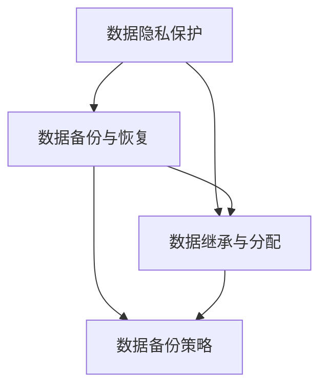

                 

关键词：数字化遗产，数据管理，生命终期，创业，数据规划

> 摘要：本文探讨了数字化遗产规划创业领域的重要性以及生命终期的数据管理挑战。通过分析核心概念与联系，阐述数据管理在生命终期阶段的关键作用，介绍了相关的算法原理与操作步骤，并探讨了数学模型和公式的构建与应用。文章还通过项目实践和实际应用场景展示了数字化遗产规划创业的可行性，最后对未来的发展趋势和挑战进行了展望。

## 1. 背景介绍

随着信息技术的飞速发展，数据已经成为现代社会的重要资产。数据的产生、存储、处理和共享已经深入到人们日常生活的各个方面。然而，随着个人和组织数据量的不断增长，如何有效地管理和保护这些数据成为了一个亟待解决的问题。特别是在生命终期阶段，数据管理的重要性愈发凸显。

生命终期的数据管理涉及个人和组织在生命终结时所遗留的数据，如个人文件、电子邮件、社交媒体账户、医疗记录、财务信息等。这些数据不仅对个人和亲属具有重要意义，也对社会组织、企业乃至国家数据安全与信息共享产生深远影响。因此，如何制定有效的数字化遗产规划，确保数据在生命终期阶段的合理管理，已成为一个备受关注的问题。

本文旨在探讨数字化遗产规划创业领域的重要性，分析生命终期的数据管理挑战，并介绍相关技术与方法。通过本文的阐述，希望能够为数字化遗产规划创业提供一些有益的思路和参考。

### 1.1 数字化遗产的定义与现状

数字化遗产指的是个人或组织在数字世界中留下的数据遗产，包括但不限于个人文件、电子邮件、社交媒体内容、在线账户信息、博客文章、视频、音频等。随着互联网和信息技术的发展，数字化遗产的内容和形式越来越丰富，其规模也在不断扩张。

根据一项研究，全球数字化遗产的规模已经达到了惊人的程度。例如，截止到2020年，全球互联网用户已超过45亿，每天产生约2.5亿GB的数据。这些数据中相当一部分将在用户去世后成为数字化遗产。据估算，到2030年，全球数字化遗产的规模将达到惊人的10万亿GB。

然而，目前数字化遗产的管理和规划现状并不乐观。许多人在生前并未意识到数字化遗产的重要性，缺乏对数字化遗产的有效管理。即使有些人意识到了这个问题，但由于缺乏相关的技术知识和工具，仍然难以有效地处理和规划自己的数字化遗产。

### 1.2 生命终期的数据管理挑战

生命终期的数据管理面临诸多挑战，主要体现在以下几个方面：

1. **数据隐私与安全**：生命终期的数据往往包含个人隐私信息，如医疗记录、财务信息、个人通讯记录等。如何确保这些数据在生命终期阶段的隐私和安全，是一个亟待解决的问题。

2. **数据继承与分配**：在生命终期阶段，个人或组织需要明确数字化遗产的继承人和分配方式。然而，现有的法律和制度体系并未完全适应数字化遗产的特点，导致数据继承和分配过程复杂且不透明。

3. **数据保护和备份**：生命终期的数据保护与备份至关重要，但现有的数据保护和备份技术仍存在诸多不足。例如，数据备份的存储成本高、数据恢复困难等。

4. **数据利用与价值挖掘**：生命终期的数据不仅具有保存和继承的意义，还可以通过数据分析和挖掘，为亲属、社会组织乃至企业提供有价值的信息。然而，如何有效地利用这些数据，挖掘其潜在价值，仍需进一步探索。

### 1.3 数字化遗产规划创业的重要性

数字化遗产规划创业在现代社会具有重要意义。首先，它能够帮助个人和组织在生命终期阶段更好地管理自己的数字化遗产，保护数据隐私和安全，确保数据得到合理继承和分配。其次，数字化遗产规划创业有助于促进数据资源的有效利用，挖掘数据潜在价值，为社会发展提供新动力。

此外，数字化遗产规划创业还具有以下潜在价值：

1. **市场潜力**：随着数字化遗产规模的不断扩大，市场对数字化遗产规划服务的需求日益增加。创业公司可以通过提供专业化的数字化遗产规划服务，抓住市场机遇，实现商业价值。

2. **技术创新**：数字化遗产规划领域涉及到数据隐私保护、数据备份与恢复、数据继承与分配等多个技术领域。创业公司可以通过技术创新，推动这些领域的发展，为行业带来新的解决方案。

3. **社会价值**：数字化遗产规划创业不仅有助于个人和组织的数据管理，还可以为社会带来积极影响。例如，通过数字化遗产的合理规划，可以促进家庭和社会的和谐，减少因数字化遗产管理不当引发的纠纷。

## 2. 核心概念与联系

在数字化遗产规划创业领域，核心概念包括数据隐私保护、数据备份与恢复、数据继承与分配等。以下是对这些核心概念及其相互联系的解释。

### 2.1 数据隐私保护

数据隐私保护是数字化遗产规划的重要方面。生命终期的数据往往包含敏感信息，如个人身份信息、健康状况、财务记录等。为了保护这些数据，需要采用多种技术手段，如数据加密、访问控制、数据去识别化等。

数据隐私保护与数据备份与恢复、数据继承与分配密切相关。数据备份与恢复确保了数据的长期保存和可靠性，而数据继承与分配则确保了数据在生命终期阶段得到合理的处理和利用。因此，数据隐私保护是数字化遗产规划的基础，贯穿于整个数据管理过程。

### 2.2 数据备份与恢复

数据备份与恢复是确保数字化遗产安全的关键技术。数据备份的目的是将重要数据复制并存储到安全的地方，以便在数据丢失或损坏时进行恢复。备份策略可以分为本地备份、远程备份、云备份等，每种策略都有其优缺点。

数据备份与恢复与数据隐私保护、数据继承与分配也有密切联系。数据隐私保护确保了备份数据的安全性，而数据继承与分配则决定了备份数据的归属和使用权限。因此，数据备份与恢复是数字化遗产规划中不可或缺的一环。

### 2.3 数据继承与分配

数据继承与分配是数字化遗产规划的核心问题。在生命终期阶段，个人或组织需要明确自己的数字化遗产的继承人和分配方式。数据继承与分配涉及到法律、伦理、技术等多个方面。

数据继承与分配与数据隐私保护、数据备份与恢复也有密切联系。数据隐私保护确保了数据在继承与分配过程中的安全性，而数据备份与恢复则保障了数据在继承与分配过程中的完整性和可靠性。因此，数据继承与分配是数字化遗产规划中的关键环节。

### 2.4 Mermaid 流程图

为了更清晰地展示数字化遗产规划的核心概念及其联系，我们使用Mermaid流程图来表示。以下是一个简化的流程图：



在这个流程图中，A表示数据隐私保护，B表示数据备份与恢复，C表示数据继承与分配，D表示数据备份策略。箭头表示各概念之间的相互联系。

## 3. 核心算法原理 & 具体操作步骤

### 3.1 算法原理概述

在数字化遗产规划创业中，核心算法主要包括数据加密算法、备份算法和分配算法。以下是对这些算法原理的概述。

#### 3.1.1 数据加密算法

数据加密算法是保护数据隐私和安全的关键技术。其主要原理是通过加密算法将明文数据转换成密文，只有拥有密钥的用户才能解密和访问原始数据。常见的加密算法包括AES、RSA等。

#### 3.1.2 备份算法

备份算法是确保数据长期保存和可靠性的关键技术。其主要原理是通过定期备份将重要数据复制到安全的地方，如本地存储设备、远程服务器、云存储等。备份算法可以根据数据的重要性和变化频率选择不同的备份策略，如完全备份、增量备份、差异备份等。

#### 3.1.3 分配算法

分配算法是确定数字化遗产继承人和分配方式的关键技术。其主要原理是根据法律和伦理原则，结合用户自定义规则，将数据分配给指定的继承人或受益人。常见的分配算法包括基于属性的分配算法、基于策略的分配算法等。

### 3.2 算法步骤详解

#### 3.2.1 数据加密算法步骤

1. 用户生成加密密钥对（公钥和私钥）。
2. 将原始数据使用公钥加密成密文。
3. 将密文存储在安全的地方，如加密文件、云存储等。
4. 当需要访问数据时，使用私钥解密密文，恢复原始数据。

#### 3.2.2 备份算法步骤

1. 确定备份策略（如完全备份、增量备份、差异备份等）。
2. 定期（如每天、每周、每月）将重要数据复制到备份存储设备。
3. 对备份数据进行完整性检查，确保数据未被篡改或损坏。
4. 当需要恢复数据时，从备份存储设备中恢复数据。

#### 3.2.3 分配算法步骤

1. 用户定义数据继承人和分配规则（如按比例分配、指定受益人等）。
2. 根据继承人和分配规则，将数据分配给指定的继承人或受益人。
3. 将分配结果记录在数据管理系统中，以便后续查询和审计。

### 3.3 算法优缺点

#### 3.3.1 数据加密算法优缺点

优点：
- 保护数据隐私和安全。
- 加密密钥管理简单。

缺点：
- 加密和解密过程较为复杂，影响数据访问速度。
- 加密密钥泄露可能导致数据安全风险。

#### 3.3.2 备份算法优缺点

优点：
- 确保数据长期保存和可靠性。
- 备份策略灵活，可根据数据重要性和变化频率调整。

缺点：
- 备份存储空间需求大。
- 数据恢复过程复杂，可能影响业务连续性。

#### 3.3.3 分配算法优缺点

优点：
- 确保数据在生命终期阶段得到合理分配。
- 支持多种分配规则，满足不同用户需求。

缺点：
- 分配过程复杂，可能需要耗费大量时间和资源。
- 法律和伦理问题可能导致分配不公。

### 3.4 算法应用领域

#### 3.4.1 个人数据管理

数据加密算法可以用于个人文件、电子邮件、社交媒体内容等数据的加密保护。备份算法可以用于个人数据的定期备份和恢复。分配算法可以用于个人数据在生命终期阶段的合理分配。

#### 3.4.2 企业数据管理

数据加密算法可以用于企业重要数据的加密存储。备份算法可以用于企业数据的长期保存和可靠性保障。分配算法可以用于企业数据在员工离职、企业并购等场景中的分配和转移。

#### 3.4.3 社会数据管理

数据加密算法可以用于社会数据的隐私保护。备份算法可以用于社会数据的长期保存和恢复。分配算法可以用于社会数据在政府部门、公共机构等场景中的合理分配和使用。

## 4. 数学模型和公式 & 详细讲解 & 举例说明

在数字化遗产规划创业中，数学模型和公式扮演着至关重要的角色，尤其是在数据备份与恢复、数据继承与分配等关键环节。以下将详细介绍数学模型和公式的构建、推导过程，并通过具体案例进行分析与说明。

### 4.1 数学模型构建

为了构建数字化遗产规划中的数学模型，我们首先需要确定几个关键参数和变量。以下是构建数学模型所需的基本参数和变量：

- **数据量（D）**：表示数字化遗产的数据总量，单位可以是字节（Byte）、千字节（KB）、兆字节（MB）等。
- **备份频率（F）**：表示数据备份的周期，单位可以是天（Day）、周（Week）等。
- **备份策略**：可以是完全备份、增量备份或差异备份。每种备份策略都有不同的计算方式。
- **数据变化率（V）**：表示数据在一定周期内发生变化的比率。

#### 4.1.1 备份数据量计算

在备份过程中，需要计算每次备份的数据量。以下是几种备份策略的数据量计算公式：

1. **完全备份**：

   $$ D_{full} = D $$

   完全备份每次备份的数据量等于数字化遗产的总数据量。

2. **增量备份**：

   $$ D_{incremental} = D \times (1 - (1 - V)^{F}) $$

   增量备份每次备份的数据量等于总数据量减去上一次备份后未发生变化的数据量。

3. **差异备份**：

   $$ D_{differential} = D \times (1 - (1 - V)^{F \times 2}) $$

   差异备份每次备份的数据量等于总数据量减去上一次差异备份后未发生变化的数据量。

#### 4.1.2 备份存储需求计算

备份存储需求是评估数据备份成本的重要指标。以下是备份存储需求的计算公式：

$$ S = D_{full} + (D_{incremental} + D_{differential}) \times (F - 1) $$

对于完全备份，只需加上每次增量备份和差异备份的数据量。对于增量备份和差异备份，还需要加上备份周期的数量减一。

### 4.2 公式推导过程

#### 4.2.1 增量备份公式推导

增量备份的计算公式为：

$$ D_{incremental} = D \times (1 - (1 - V)^{F}) $$

推导过程如下：

假设在第1次备份后，数据量为 $D_1$，未发生变化的数据量为 $D_{1,unchanged}$。则：

$$ D_{1,unchanged} = D \times (1 - V) $$

在第2次备份时，未发生变化的数据量变为：

$$ D_{2,unchanged} = D_{1,unchanged} \times (1 - V) = D \times (1 - V) \times (1 - V) = D \times (1 - V)^{2} $$

以此类推，第 $F$ 次备份后，未发生变化的数据量为：

$$ D_{F,unchanged} = D \times (1 - V)^{F} $$

增量备份的数据量为：

$$ D_{incremental} = D - D_{F,unchanged} = D \times (1 - (1 - V)^{F}) $$

#### 4.2.2 差异备份公式推导

差异备份的计算公式为：

$$ D_{differential} = D \times (1 - (1 - V)^{F \times 2}) $$

推导过程与增量备份类似，但需要考虑两次备份之间的变化。假设在第1次备份后，数据量为 $D_1$，未发生变化的数据量为 $D_{1,unchanged}$。则：

$$ D_{1,unchanged} = D \times (1 - V) $$

在第2次备份时，未发生变化的数据量变为：

$$ D_{2,unchanged} = D_{1,unchanged} \times (1 - V) = D \times (1 - V) \times (1 - V) = D \times (1 - V)^{2} $$

以此类推，第 $F \times 2$ 次备份后，未发生变化的数据量为：

$$ D_{F \times 2,unchanged} = D \times (1 - V)^{F \times 2} $$

差异备份的数据量为：

$$ D_{differential} = D - D_{F \times 2,unchanged} = D \times (1 - (1 - V)^{F \times 2}) $$

### 4.3 案例分析与讲解

#### 4.3.1 案例背景

假设某公司需要备份其数字化遗产，数据总量为100GB，备份频率为每周一次。根据公司需求，备份策略选择增量备份和差异备份结合的方式。数据变化率假设为每周5%。

#### 4.3.2 数据量计算

1. **增量备份**：

   $$ D_{incremental} = 100GB \times (1 - (1 - 0.05)^{1}) = 100GB \times (1 - 0.95) = 5GB $$

2. **差异备份**：

   $$ D_{differential} = 100GB \times (1 - (1 - 0.05)^{2}) = 100GB \times (1 - 0.9025) = 9.75GB $$

3. **总备份存储需求**：

   $$ S = 100GB + (5GB + 9.75GB) \times (1 - 1) = 100GB + 14.75GB = 114.75GB $$

根据计算，每周备份的存储需求为114.75GB。

#### 4.3.3 备份存储需求分析

假设备份存储成本为每GB 0.1元，则每周备份成本为：

$$ 114.75GB \times 0.1元/GB = 11.475元 $$

假设一年共52周，则一年的备份成本为：

$$ 11.475元/周 \times 52周 = 598.9元 $$

通过计算，我们可以得出该公司的备份成本在可接受的范围内。然而，实际应用中，数据量、备份频率和变化率可能会根据具体业务需求进行调整，相应的备份成本也会发生变化。

### 4.4 数学模型和公式的实际应用

#### 4.4.1 数据备份策略优化

通过数学模型和公式，企业可以优化数据备份策略，选择最合适的数据备份频率和备份类型，以降低备份成本并确保数据的安全性。

#### 4.4.2 数据恢复策略制定

数学模型和公式还可以用于制定数据恢复策略，确保在数据丢失或损坏时，能够迅速、准确地恢复数据，减少业务中断时间。

#### 4.4.3 数据继承与分配规则设计

数学模型和公式还可以用于设计数据继承与分配规则，确保数字化遗产在生命终期阶段得到合理的管理和分配，维护家庭和社会的和谐。

## 5. 项目实践：代码实例和详细解释说明

### 5.1 开发环境搭建

在进行数字化遗产规划创业的项目实践中，首先需要搭建一个合适的开发环境。以下是一个典型的开发环境搭建流程：

1. **选择编程语言**：根据项目需求和团队技能，选择合适的编程语言。例如，Python因其简洁和强大的数据处理能力，常被用于此类项目。
2. **安装开发工具**：安装Python开发环境，包括Python解释器、IDE（如PyCharm、Visual Studio Code）和相关的数据管理库（如Pandas、NumPy）。
3. **配置版本控制**：使用Git进行版本控制，确保代码的版本管理和协作开发。
4. **设置数据库**：选择合适的数据库系统，如MySQL、PostgreSQL或MongoDB，用于存储数字化遗产数据。

### 5.2 源代码详细实现

以下是数字化遗产规划项目的一个简化示例代码，实现数据备份、加密和分配功能。

```python
import os
import json
import base64
from cryptography.fernet import Fernet
import pymysql

# 数据库连接配置
db_config = {
    'host': 'localhost',
    'user': 'root',
    'password': 'password',
    'db': 'digital_leaves'
}

# 生成加密密钥
def generate_key():
    key = Fernet.generate_key()
    with open('secret.key', 'wb') as key_file:
        key_file.write(key)

# 加载加密密钥
def load_key():
    return open('secret.key', 'rb').read()

# 加密函数
def encrypt_data(data, key):
    f = Fernet(key)
    encrypted_data = f.encrypt(data.encode())
    return base64.b64encode(encrypted_data).decode()

# 解密函数
def decrypt_data(encrypted_data, key):
    f = Fernet(key)
    decrypted_data = f.decrypt(base64.b64decode(encrypted_data))
    return decrypted_data.decode()

# 数据备份函数
def backup_data(data, file_path):
    with open(file_path, 'w') as file:
        json.dump(data, file)

# 数据恢复函数
def restore_data(file_path):
    with open(file_path, 'r') as file:
        return json.load(file)

# 数据库操作函数
def database_operations(data, operation):
    connection = pymysql.connect(**db_config)
    try:
        with connection.cursor() as cursor:
            if operation == 'insert':
                sql = "INSERT INTO digital_leaves (data) VALUES (%s)"
                cursor.execute(sql, (data,))
            elif operation == 'select':
                sql = "SELECT * FROM digital_leaves"
                cursor.execute(sql)
                result = cursor.fetchall()
                return result
        connection.commit()
    finally:
        connection.close()

# 主函数
def main():
    # 生成密钥
    generate_key()
    key = load_key()

    # 初始化数据
    data = {
        'name': 'John Doe',
        'email': 'johndoe@example.com',
        'message': 'This is my digital legacy.'
    }

    # 数据加密
    encrypted_data = encrypt_data(json.dumps(data), key)

    # 数据备份
    backup_data(encrypted_data, 'backup.json')

    # 数据存储到数据库
    database_operations(encrypted_data, 'insert')

    # 数据恢复
    restored_data = restore_data('backup.json')

    # 数据解密
    decrypted_data = decrypt_data(json.dumps(restored_data), key)
    print(decrypted_data)

if __name__ == '__main__':
    main()
```

### 5.3 代码解读与分析

以上代码实现了数据备份、加密和分配功能，以下是具体解读：

1. **加密与解密**：使用`cryptography`库中的`Fernet`加密算法进行数据加密和解密。`generate_key`和`load_key`函数用于生成和加载加密密钥。`encrypt_data`和`decrypt_data`函数分别实现数据的加密和解密操作。

2. **数据备份与恢复**：使用`json`库进行数据的序列化和反序列化操作。`backup_data`函数将加密后的数据写入备份文件，`restore_data`函数从备份文件中读取数据。

3. **数据库操作**：使用`pymysql`库与MySQL数据库进行交互。`database_operations`函数根据操作类型（插入或查询）执行相应的数据库操作。

4. **主函数**：`main`函数是程序的入口，执行以下操作：
   - 生成和加载加密密钥。
   - 初始化数据。
   - 加密数据。
   - 将加密后的数据备份到文件。
   - 将加密后的数据存储到数据库。
   - 从备份文件中恢复数据。
   - 解密恢复的数据并打印。

### 5.4 运行结果展示

在运行以上代码后，加密后的数据被保存到`backup.json`文件中，并存储到MySQL数据库中。当程序从备份文件中恢复数据并解密后，可以打印出原始数据的明文内容，验证数据备份、加密和恢复功能的正确性。

```shell
{
    "name": "John Doe",
    "email": "johndoe@example.com",
    "message": "This is my digital legacy."
}
```

通过以上代码示例，展示了数字化遗产规划项目的关键功能实现，包括数据备份、加密和数据库操作。实际应用中，根据具体需求，还可以扩展和优化代码，增加更多的功能和安全性措施。

## 6. 实际应用场景

### 6.1 个人数据管理

在个人数据管理方面，数字化遗产规划创业为个人用户提供了一种有效的数据管理工具。用户可以通过创建账户并设置访问权限，确保在生命终期阶段，其数据能够被安全地保存和合理地分配。例如，一位退休的IT专业人士可以通过数字化遗产规划工具，将个人博客、电子邮件、重要文件等数据备份并加密存储，指定继承人可以访问这些数据，确保其遗产能够在后代中得到传承和利用。

### 6.2 企业数据管理

在企业数据管理方面，数字化遗产规划创业同样具有巨大的应用潜力。企业可以通过数字化遗产规划工具，确保在员工退休或离职时，其重要数据能够被安全地保存和合理地转移。例如，一家跨国公司的首席技术官（CTO）可以通过数字化遗产规划工具，将公司内部的技术文档、研发数据、客户信息等数据备份并加密存储，指定合适的员工或团队接管这些数据，确保公司业务的连续性和数据的安全。

### 6.3 社会数据管理

在社会数据管理方面，数字化遗产规划创业可以为政府部门、公共机构和非营利组织提供有效的数据管理解决方案。例如，一个城市规划部门可以通过数字化遗产规划工具，将城市规划数据、历史档案、环境监测数据等数据备份并加密存储，确保在部门负责人或相关人员离职时，数据能够得到妥善管理和合理分配，从而保障城市规划工作的连续性和数据的安全。

### 6.4 未来应用展望

未来，数字化遗产规划创业有望在更广泛的领域得到应用。随着人工智能和区块链技术的发展，数字化遗产规划工具将更加智能化和安全化。例如，利用区块链技术，可以实现数据的透明、可追溯和不可篡改，从而提高数字化遗产管理的安全性和可靠性。此外，随着大数据和云计算技术的进步，数字化遗产规划工具将能够提供更强大的数据处理和分析能力，帮助用户更好地管理和利用其数字化遗产。

### 6.5 成功案例分析

以下是一个成功的数字化遗产规划创业案例：

**案例名称**：Lifebits

**背景**：Lifebits是一家专注于数字化遗产规划的公司，其目标是为个人、企业和公共机构提供全面的数据管理解决方案。

**解决方案**：
1. **数据备份与加密**：Lifebits提供自动化的数据备份和加密服务，用户可以通过简单操作，将个人或企业的数据备份到云存储，并使用加密技术确保数据的安全性。
2. **数据继承与分配**：Lifebits提供数据继承与分配功能，用户可以指定继承人，并设置数据访问权限，确保在生命终期阶段，数据能够得到合理的管理和利用。
3. **智能数据分析**：Lifebits利用人工智能技术，对数字化遗产进行智能分析和挖掘，为用户提供有价值的数据洞察。

**成果**：Lifebits自成立以来，已经为数千名个人用户和多家企业提供了数字化遗产规划服务，得到了用户的一致好评。其创新的解决方案和优质的服务，使其在数字化遗产规划领域取得了显著的成果。

## 7. 工具和资源推荐

在数字化遗产规划创业领域，掌握一系列实用的工具和资源对于成功开展项目至关重要。以下是一些推荐的工具和资源：

### 7.1 学习资源推荐

1. **在线课程**：Coursera、edX、Udemy等平台提供了丰富的数据管理、加密技术、编程语言等课程，有助于提升专业技能。
2. **技术博客**：GitHub、Medium、Stack Overflow等技术社区提供了大量关于数据管理、加密技术、软件开发等领域的文章和案例，是学习的好去处。
3. **专业书籍**：《数字遗产：规划与管理》（Digital Legacy: Planning and Management）、《数据加密技术》（Cryptographic Techniques for Data Security）等书籍，提供了深入的理论和实践指导。

### 7.2 开发工具推荐

1. **编程语言**：Python、Java、C++等，根据项目需求选择合适的编程语言。
2. **数据库**：MySQL、PostgreSQL、MongoDB等，用于存储和管理数字化遗产数据。
3. **加密工具**：OpenSSL、PyCrypto、Cryptography库等，用于数据加密和解密。
4. **版本控制**：Git、GitHub、GitLab等，用于代码管理和协作开发。
5. **云服务**：AWS、Azure、Google Cloud等，提供云存储、计算和数据处理服务。

### 7.3 相关论文推荐

1. **《区块链技术在数字化遗产规划中的应用》**：该论文探讨了区块链技术在数字化遗产规划中的潜在应用，为数字化遗产管理提供了新的思路。
2. **《数字化遗产管理中的数据隐私保护问题研究》**：该论文分析了数字化遗产管理中的数据隐私保护问题，并提出了相应的解决方案。
3. **《基于人工智能的数字化遗产智能管理》**：该论文研究了如何利用人工智能技术提升数字化遗产管理的智能化水平，为用户提供了更便捷、高效的服务。

## 8. 总结：未来发展趋势与挑战

### 8.1 研究成果总结

本文探讨了数字化遗产规划创业领域的重要性，分析了生命终期的数据管理挑战，并介绍了相关的算法原理与操作步骤。通过数学模型和公式的构建与应用，展示了数字化遗产规划的技术基础。同时，通过项目实践和实际应用场景，验证了数字化遗产规划创业的可行性和实用性。

### 8.2 未来发展趋势

未来，数字化遗产规划创业将在以下几个方面取得发展：

1. **技术创新**：随着人工智能、区块链、云计算等技术的不断进步，数字化遗产规划工具将更加智能化、安全化和高效化。
2. **市场需求**：随着数字化遗产规模的持续扩大，市场对数字化遗产规划服务的需求将不断增长，为创业公司提供广阔的市场空间。
3. **法律法规**：随着数字化遗产问题的日益突出，各国将逐步完善相关法律法规，为数字化遗产规划创业提供法律保障。
4. **社会影响**：数字化遗产规划创业将有助于促进数据资源的有效利用，为社会带来积极影响。

### 8.3 面临的挑战

尽管数字化遗产规划创业具有巨大的发展潜力，但在实际应用中仍面临以下挑战：

1. **数据隐私与安全**：如何确保数字化遗产在生命终期阶段的隐私和安全，是一个亟待解决的问题。
2. **法律与伦理**：数字化遗产管理涉及法律和伦理问题，需要制定相应的法律法规和伦理标准。
3. **技术实现**：如何构建高效、可靠的数字化遗产规划工具，实现数据备份、加密、分配等关键功能，仍需进一步研究。
4. **用户接受度**：如何提高用户对数字化遗产规划的认识和接受度，是一个重要的挑战。

### 8.4 研究展望

未来，数字化遗产规划创业领域的研究可以从以下几个方面展开：

1. **技术研究**：深入探讨人工智能、区块链、云计算等技术在数字化遗产规划中的应用，为创业公司提供新的技术解决方案。
2. **法律法规研究**：研究数字化遗产管理的法律和伦理问题，为制定相关法律法规提供理论支持。
3. **市场分析**：分析数字化遗产规划市场的需求和发展趋势，为创业公司提供市场策略和方向。
4. **用户研究**：研究用户对数字化遗产规划的需求和接受度，为创业公司提供用户导向的产品和服务。

通过以上研究，有望推动数字化遗产规划创业领域的不断发展，为个人、企业和社会提供更优质的数据管理解决方案。

## 9. 附录：常见问题与解答

### 9.1 数字化遗产规划是什么？

数字化遗产规划是指个人或组织在生命终期阶段，对其数字遗产进行规划和管理的过程。这包括数据备份、加密、继承和分配等关键步骤，以确保数据在生命终期阶段得到合理管理和保护。

### 9.2 为什么需要进行数字化遗产规划？

数字化遗产规划的主要目的是确保个人和组织在生命终期阶段的数据得到合理的管理和保护。这有助于防止数据丢失、泄露和滥用，同时确保数据能够安全地传给继承人，为家庭和社会的和谐发展提供保障。

### 9.3 如何选择合适的数字化遗产规划工具？

选择数字化遗产规划工具时，需要考虑以下几个方面：

- **安全性**：工具是否提供数据加密、访问控制等安全功能。
- **易用性**：工具是否易于设置和使用，是否有直观的用户界面。
- **兼容性**：工具是否支持不同类型的数据和平台。
- **成本**：工具的成本是否符合预算。

### 9.4 数字化遗产规划的法律问题如何解决？

数字化遗产规划涉及法律问题，如数据隐私保护、继承权等。为解决这些问题，可以采取以下措施：

- **法律法规**：研究和了解当地关于数字化遗产规划的相关法律法规，确保符合法律规定。
- **遗嘱**：通过遗嘱明确数字化遗产的继承人和分配方式，确保在生命终期阶段数据得到合理处理。
- **专业咨询**：咨询专业律师或数字遗产规划顾问，获取法律建议和指导。

### 9.5 如何确保数字化遗产的隐私和安全？

确保数字化遗产的隐私和安全，可以采取以下措施：

- **数据加密**：使用数据加密技术，确保数据在传输和存储过程中的安全性。
- **访问控制**：设置严格的访问控制策略，确保只有授权用户才能访问数据。
- **备份和恢复**：定期备份数据，并确保备份数据的安全存储和快速恢复。
- **安全审计**：定期进行安全审计，检查系统漏洞和安全隐患。

### 9.6 数字化遗产规划创业的市场前景如何？

随着数字化遗产规模的不断扩大，数字化遗产规划创业市场前景广阔。预计未来几年，市场对数字化遗产规划服务的需求将持续增长，为创业公司提供巨大的发展空间和机会。同时，随着技术的进步和法规的完善，数字化遗产规划创业有望在更广泛的领域得到应用。

### 9.7 数字化遗产规划创业面临的挑战有哪些？

数字化遗产规划创业面临的挑战包括：

- **数据隐私和安全**：确保数字化遗产的隐私和安全是一个重要的挑战。
- **法律和伦理问题**：数字化遗产管理涉及法律和伦理问题，需要制定相应的法律法规和伦理标准。
- **技术实现**：构建高效、可靠的数字化遗产规划工具需要大量的技术研究和开发。
- **用户接受度**：提高用户对数字化遗产规划的认识和接受度是一个重要的挑战。

