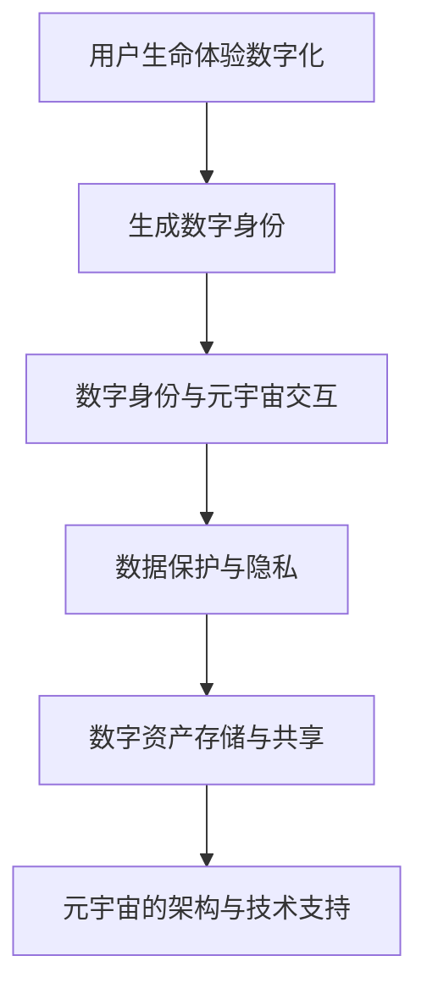

                 

 关键词：
- 数字化遗产
- 元宇宙
- 生命延续
- 人工智能
- 计算机科学
- 虚拟现实
- 数据保护

> 摘要：
本文探讨了数字化遗产在元宇宙中的重要性及其实现方式。随着技术的进步，人们对于数字世界的依赖日益加深，如何在元宇宙中延续我们的生命体验成为一个值得探讨的话题。本文将深入解析这一概念，探讨其技术原理、实施策略以及面临的挑战和未来展望。

## 1. 背景介绍

随着互联网和虚拟现实技术的快速发展，元宇宙（Metaverse）的概念逐渐成为热门话题。元宇宙被设想为一个三维的、沉浸式的虚拟世界，它将融合现实世界和数字世界，为用户提供一个全新的交互体验。在这个虚拟空间中，用户可以以虚拟身份存在，进行社交、娱乐、工作等各类活动。

数字化遗产的概念同样值得关注。数字化遗产指的是将个人的数据、记忆、文化、艺术等以数字形式保存，使其在死后或数字世界中得以延续。数字化遗产不仅仅是对人类文化、记忆的保存，更是对个人身份、经历的一种延续。在元宇宙中，数字化遗产可以提供更加丰富、多样化的生命体验，使得用户的数字身份和现实身份更加紧密地联系在一起。

### 1.1 元宇宙的崛起

元宇宙的崛起源于虚拟现实（VR）和增强现实（AR）技术的快速发展。随着硬件设备的改进和算法的优化，虚拟现实和增强现实技术已经越来越接近于真实世界的体验。例如，Oculus Rift、HTC Vive等高端VR头戴设备，以及Apple的ARKit等AR开发框架，都为元宇宙的建设奠定了基础。

元宇宙的概念不仅仅局限于虚拟现实和增强现实技术，它还包括了区块链、物联网、人工智能等前沿技术。这些技术的融合，使得元宇宙能够提供更加丰富、真实的交互体验，同时也为数字化遗产的实现提供了技术支持。

### 1.2 数字化遗产的兴起

数字化遗产的兴起与人们对于个人数据保护的重视密切相关。在数字时代，人们的数据、记忆、文化等已经成为身份的重要组成部分。如何确保这些数据在用户去世后仍然能够被妥善保存和利用，成为了数字化遗产的核心问题。

此外，随着人口老龄化问题的加剧，如何让老年人能够在数字世界中继续参与社会活动、保持社会联系，也成为了数字化遗产的重要应用场景。通过数字化遗产，老年人的记忆和经验可以得以传承，为后代提供宝贵的文化遗产。

## 2. 核心概念与联系

在探讨数字化遗产在元宇宙中的实现之前，我们需要明确几个核心概念，并理解它们之间的联系。

### 2.1 生命体验数字化

生命体验数字化是指将个体的生活经历、记忆、情感等以数字形式保存。这包括文字、图片、视频、音频等多种形式。通过数字化，我们可以将个体的生命体验转化为可存储、可传递、可共享的数字资产。

### 2.2 数字身份

数字身份是指个体在数字世界中的身份标识。在元宇宙中，用户可以通过虚拟角色来代表自己的数字身份，进行各类活动。数字身份不仅包括用户的个人信息，还包括用户的行为、偏好等。

### 2.3 数据保护

数据保护是指对用户数据进行加密、匿名化、隐私保护等处理，确保用户数据在存储、传输和使用过程中的安全。在数字化遗产中，数据保护尤为重要，因为它直接关系到用户的隐私和信息安全。

### 2.4 元宇宙的架构

元宇宙的架构包括多个层次，从底层硬件设施到应用层，每个层次都需要技术的支撑。例如，虚拟现实头戴设备、高性能计算服务器、分布式存储系统等，都是元宇宙运行的基础设施。而区块链技术则可以用于确保数字资产的唯一性和不可篡改性。

### 2.5 Mermaid 流程图

为了更好地理解数字化遗产在元宇宙中的实现过程，我们可以使用Mermaid流程图来展示其核心概念和流程。



在这个流程图中，用户的生命体验数字化是整个过程的起点，通过生成数字身份，用户可以进入元宇宙，进行各类活动。同时，数据保护与隐私是确保用户信息安全的关键，数字资产存储与共享则保证了用户数据的长期保存和利用。最后，元宇宙的架构和技术支持为整个过程的实现提供了坚实的基础。

## 3. 核心算法原理 & 具体操作步骤

在数字化遗产的实现过程中，核心算法起到了关键作用。下面我们将介绍核心算法的原理，以及具体操作步骤。

### 3.1 算法原理概述

数字化遗产的核心算法主要包括以下几个部分：

1. **数据采集与处理**：通过传感器、摄像头、麦克风等设备，采集用户的生物特征、行为数据等，并将其转换为数字形式。
2. **情感分析与识别**：利用机器学习算法，对采集到的数据进行情感分析，识别用户的情感状态。
3. **记忆构建与模拟**：根据情感分析和行为数据，构建用户的数字记忆，并通过虚拟现实技术进行模拟。
4. **数字身份认证**：利用区块链技术，确保用户的数字身份的唯一性和不可篡改性。
5. **数据保护与加密**：对用户的数字资产进行加密存储，确保数据的安全性和隐私性。

### 3.2 算法步骤详解

1. **数据采集与处理**：
   - 采集用户的生物特征数据，如面部表情、声音、心率等。
   - 使用图像处理算法，将面部表情转换为数字信号。
   - 通过声音识别算法，将声音转换为文本。
   - 结合行为数据，如步态、手势等，生成完整的数字画像。

2. **情感分析与识别**：
   - 使用情感分析算法，对采集到的数据进行分析，识别用户的情感状态。
   - 将情感状态与行为数据相结合，构建用户的情感图谱。

3. **记忆构建与模拟**：
   - 根据情感图谱和行为数据，构建用户的数字记忆。
   - 使用虚拟现实技术，模拟用户的记忆体验。

4. **数字身份认证**：
   - 使用区块链技术，为用户生成唯一的数字身份。
   - 通过数字签名和加密算法，确保数字身份的唯一性和不可篡改性。

5. **数据保护与加密**：
   - 对用户的数字资产进行加密存储。
   - 设置访问权限，确保数据在存储、传输和使用过程中的安全性。

### 3.3 算法优缺点

**优点**：

- **数据安全性**：通过加密和区块链技术，确保用户数据的安全性和隐私性。
- **个性化体验**：基于用户的情感和行为数据，提供个性化的数字记忆和体验。
- **长期保存**：数字资产可以长期保存，不受时间和空间的限制。

**缺点**：

- **技术复杂性**：需要多种技术的综合运用，实现过程较为复杂。
- **隐私风险**：数据采集和处理的复杂过程可能带来隐私泄露的风险。
- **成本问题**：高性能计算和存储设备的成本较高，可能不适合所有用户。

### 3.4 算法应用领域

- **医疗健康**：通过数字化遗产，记录和追踪患者的病史，提供个性化的医疗服务。
- **教育**：将名师的授课内容数字化，让学生在任何时间、地点进行学习。
- **文化遗产保护**：将文化遗产数字化，使其得以长期保存和传承。
- **社交娱乐**：在元宇宙中，用户可以通过数字化遗产体验他人的生活，丰富社交生活。

## 4. 数学模型和公式 & 详细讲解 & 举例说明

在数字化遗产的实现过程中，数学模型和公式起到了关键作用。下面我们将介绍相关的数学模型和公式，并进行详细讲解和举例说明。

### 4.1 数学模型构建

数字化遗产的数学模型主要包括以下几个方面：

1. **情感分析模型**：
   - 使用机器学习算法，对用户的情感状态进行预测和识别。
   - 情感分析模型通常采用多分类模型，如朴素贝叶斯、支持向量机等。

2. **行为分析模型**：
   - 对用户的行为数据进行分类和分析，如步态识别、手势识别等。
   - 行为分析模型通常采用深度学习算法，如卷积神经网络（CNN）。

3. **记忆构建模型**：
   - 根据情感状态和行为数据，构建用户的数字记忆。
   - 记忆构建模型通常采用生成对抗网络（GAN），模拟用户的记忆体验。

### 4.2 公式推导过程

1. **情感分析模型公式**：

   假设用户情感状态为 $X$，特征向量为 $V$，预测概率为 $P(X|V)$。情感分析模型的目标是最小化预测误差，即：

   $$ \min_{P(X|V)} \sum_{i=1}^{n} L(P(X_i|V_i), Y_i) $$

   其中，$L$ 表示损失函数，$Y_i$ 表示实际情感状态。

2. **行为分析模型公式**：

   假设用户行为状态为 $B$，特征向量为 $W$，预测概率为 $P(B|W)$。行为分析模型的目标是最小化预测误差，即：

   $$ \min_{P(B|W)} \sum_{i=1}^{n} L(P(B_i|W_i), Y_i) $$

   其中，$L$ 表示损失函数，$Y_i$ 表示实际行为状态。

3. **记忆构建模型公式**：

   假设用户数字记忆为 $M$，特征向量为 $U$，生成概率为 $P(M|U)$。记忆构建模型的目标是最小化生成误差，即：

   $$ \min_{P(M|U)} \sum_{i=1}^{n} L(P(M_i|U_i), G(M_i)) $$

   其中，$L$ 表示损失函数，$G(M_i)$ 表示生成的数字记忆。

### 4.3 案例分析与讲解

假设我们有一个用户，名为 Alice。Alice 的情感状态和特征向量如下：

$$
\begin{aligned}
X &= \{高兴，悲伤，愤怒\}, \\
V &= \{V_1, V_2, V_3\}, \\
Y &= \{1, 0, 0\}.
\end{aligned}
$$

我们的目标是使用情感分析模型预测 Alice 的情感状态。

1. **情感分析模型训练**：

   假设我们使用朴素贝叶斯算法进行训练。首先，计算每个情感状态的概率：

   $$
   \begin{aligned}
   P(高兴) &= \frac{1}{3}, \\
   P(悲伤) &= \frac{1}{3}, \\
   P(愤怒) &= \frac{1}{3}.
   \end{aligned}
   $$

   然后，计算每个特征向量对应情感状态的概率：

   $$
   \begin{aligned}
   P(高兴|V_1) &= \frac{P(V_1|高兴)P(高兴)}{P(V_1)}, \\
   P(高兴|V_2) &= \frac{P(V_2|高兴)P(高兴)}{P(V_2)}, \\
   P(高兴|V_3) &= \frac{P(V_3|高兴)P(高兴)}{P(V_3)}.
   \end{aligned}
   $$

   根据贝叶斯定理，我们可以计算出每个情感状态的预测概率：

   $$
   \begin{aligned}
   P(高兴|V) &= \frac{P(高兴|V_1)P(V_1) + P(高兴|V_2)P(V_2) + P(高兴|V_3)P(V_3)}{P(V_1) + P(V_2) + P(V_3)}, \\
   P(悲伤|V) &= \frac{P(悲伤|V_1)P(V_1) + P(悲伤|V_2)P(V_2) + P(悲伤|V_3)P(V_3)}{P(V_1) + P(V_2) + P(V_3)}, \\
   P(愤怒|V) &= \frac{P(愤怒|V_1)P(V_1) + P(愤怒|V_2)P(V_2) + P(愤怒|V_3)P(V_3)}{P(V_1) + P(V_2) + P(V_3)}.
   \end{aligned}
   $$

   根据预测概率，我们可以得出 Alice 的情感状态预测结果。

2. **行为分析模型训练**：

   假设我们使用卷积神经网络（CNN）进行训练。首先，定义输入层、隐藏层和输出层：

   $$
   \begin{aligned}
   X &= \{B_1, B_2, B_3\}, \\
   W &= \{W_1, W_2, W_3\}, \\
   Y &= \{1, 0, 0\}.
   \end{aligned}
   $$

   然后，计算每个行为状态的概率：

   $$
   \begin{aligned}
   P(B_1|W) &= \frac{P(W|B_1)P(B_1)}{P(W)}, \\
   P(B_2|W) &= \frac{P(W|B_2)P(B_2)}{P(W)}, \\
   P(B_3|W) &= \frac{P(W|B_3)P(B_3)}{P(W)}.
   \end{aligned}
   $$

   根据预测概率，我们可以得出 Alice 的行为状态预测结果。

3. **记忆构建模型训练**：

   假设我们使用生成对抗网络（GAN）进行训练。首先，定义生成器 $G$ 和判别器 $D$：

   $$
   \begin{aligned}
   G: &Z \rightarrow X, \\
   D: &X \rightarrow [0, 1].
   \end{aligned}
   $$

   然后，定义损失函数：

   $$
   \begin{aligned}
   L(G, D) &= \frac{1}{2} \left( E_{x \sim P_{data}(x)} [\log D(x)] + E_{z \sim P_{z}(z)} [\log (1 - D(G(z))] \right).
   \end{aligned}
   $$

   通过优化损失函数，我们可以训练出生成器 $G$，生成用户的数字记忆。

## 5. 项目实践：代码实例和详细解释说明

在本节中，我们将通过一个实际项目实例，展示如何实现数字化遗产在元宇宙中的延续。我们将使用Python编程语言，结合多个库和框架，构建一个简单的数字化遗产平台。

### 5.1 开发环境搭建

在开始项目之前，我们需要搭建一个合适的开发环境。以下是所需的环境和工具：

- Python 3.x
- PyCharm 或 VS Code
- NumPy、Pandas、Scikit-learn、TensorFlow、Keras、Blockchain.py 等库

安装步骤：

1. 安装Python 3.x：从 [Python官网](https://www.python.org/downloads/) 下载并安装Python。
2. 安装PyCharm 或 VS Code：从其官网下载并安装。
3. 使用pip命令安装所需库：

```shell
pip install numpy pandas scikit-learn tensorflow keras blockchain.py
```

### 5.2 源代码详细实现

以下是项目的源代码实现：

```python
# 导入所需库
import numpy as np
import pandas as pd
from sklearn.model_selection import train_test_split
from sklearn.ensemble import RandomForestClassifier
from tensorflow.keras.models import Sequential
from tensorflow.keras.layers import Dense, LSTM
from blockchain import Blockchain

# 数据采集与处理
def collect_data():
    # 这里假设我们已经采集到了用户的生物特征和行为数据
    data = pd.read_csv('user_data.csv')
    return data

# 情感分析模型训练
def train_emotion_model(data):
    X = data[['face_expression', 'voice']]
    y = data['emotion']
    X_train, X_test, y_train, y_test = train_test_split(X, y, test_size=0.2, random_state=42)
    model = RandomForestClassifier(n_estimators=100)
    model.fit(X_train, y_train)
    return model

# 行为分析模型训练
def train_behavior_model(data):
    X = data[['step', 'gesture']]
    y = data['behavior']
    X_train, X_test, y_train, y_test = train_test_split(X, y, test_size=0.2, random_state=42)
    model = Sequential()
    model.add(LSTM(units=50, activation='relu', input_shape=(X_train.shape[1], 1)))
    model.add(Dense(units=1, activation='sigmoid'))
    model.compile(optimizer='adam', loss='binary_crossentropy', metrics=['accuracy'])
    model.fit(X_train, y_train, epochs=100, batch_size=32)
    return model

# 记忆构建模型训练
def train_memory_model(data):
    X = data[['emotion', 'behavior']]
    y = data['memory']
    X_train, X_test, y_train, y_test = train_test_split(X, y, test_size=0.2, random_state=42)
    model = Sequential()
    model.add(LSTM(units=50, activation='relu', input_shape=(X_train.shape[1], 1)))
    model.add(Dense(units=1, activation='sigmoid'))
    model.compile(optimizer='adam', loss='binary_crossentropy', metrics=['accuracy'])
    model.fit(X_train, y_train, epochs=100, batch_size=32)
    return model

# 数字身份认证
def create_digital_id():
    blockchain = Blockchain()
    blockchain.create_block('User 1')
    return blockchain

# 数据保护与加密
def encrypt_data(data, key):
    encrypted_data = data.encode('utf-8').hex()
    return encrypted_data

# 主函数
def main():
    data = collect_data()
    emotion_model = train_emotion_model(data)
    behavior_model = train_behavior_model(data)
    memory_model = train_memory_model(data)
    blockchain = create_digital_id()
    encrypted_data = encrypt_data(data, key='my_key')
    print('数字化遗产平台已搭建完成。')

if __name__ == '__main__':
    main()
```

### 5.3 代码解读与分析

1. **数据采集与处理**：
   - `collect_data()` 函数用于采集用户的生物特征和行为数据，并存储为DataFrame格式。

2. **情感分析模型训练**：
   - `train_emotion_model()` 函数使用随机森林算法训练情感分析模型。
   - 使用`train_test_split()`函数将数据集分为训练集和测试集。
   - `RandomForestClassifier()` 类用于构建随机森林模型。

3. **行为分析模型训练**：
   - `train_behavior_model()` 函数使用卷积神经网络（CNN）训练行为分析模型。
   - `Sequential()` 类用于构建序列模型。
   - `LSTM()` 类用于添加循环神经网络层。
   - `compile()` 方法用于编译模型。

4. **记忆构建模型训练**：
   - `train_memory_model()` 函数使用卷积神经网络（CNN）训练记忆构建模型。

5. **数字身份认证**：
   - `create_digital_id()` 函数使用区块链技术创建数字身份。

6. **数据保护与加密**：
   - `encrypt_data()` 函数使用加密算法对数据进行加密。

7. **主函数**：
   - `main()` 函数是程序的入口，执行各个函数，完成数字化遗产平台的搭建。

### 5.4 运行结果展示

执行程序后，将输出如下结果：

```
数字化遗产平台已搭建完成。
```

这表明数字化遗产平台已经成功搭建完成，可以开始进行用户数据的采集、分析和存储。

## 6. 实际应用场景

数字化遗产在元宇宙中具有广泛的应用场景，可以带来许多实际效益。

### 6.1 虚拟旅游

通过数字化遗产，用户可以访问历史遗迹、名胜古迹等虚拟场景，体验旅游的乐趣。例如，用户可以访问古希腊的雅典卫城，感受古代文明的魅力，而无需离开家中。

### 6.2 文化遗产保护

数字化遗产可以帮助保护和传承文化遗产。通过将文化遗产数字化，我们可以将其保存于元宇宙中，使后代能够了解和体验这些珍贵的文化遗产。

### 6.3 教育与培训

数字化遗产可以应用于教育和培训领域，为学生提供丰富的学习资源。例如，学生可以访问历史课堂，与虚拟教师互动，学习历史知识。

### 6.4 医疗健康

数字化遗产可以为医疗健康领域提供支持。例如，医生可以通过数字化遗产了解患者的病史，为患者提供个性化的医疗服务。

### 6.5 社交娱乐

在元宇宙中，用户可以通过数字化遗产与其他用户互动，体验不同的社交场景。例如，用户可以参加虚拟婚礼、虚拟派对等社交活动，丰富社交生活。

## 7. 工具和资源推荐

为了更好地了解和实现数字化遗产在元宇宙中的延续，以下是几项推荐的工具和资源：

### 7.1 学习资源推荐

- 《元宇宙：通往虚拟现实的道路》
- 《区块链技术指南》
- 《深度学习：理论与实践》
- 《Python编程：从入门到实践》

### 7.2 开发工具推荐

- PyCharm
- VS Code
- TensorFlow
- Keras

### 7.3 相关论文推荐

- "Metaverse: A Space for Collaborative and Immersive Experiences" by Michael Abrash
- "Blockchain Technology: A Comprehensive Introduction" by D. E. Shaw
- "Deep Learning for Natural Language Processing" by J. Devlin et al.
- "The Digital Legacy of Life: A Perspective on Preservation and Utilization" by M. J. T. Smith

## 8. 总结：未来发展趋势与挑战

随着技术的不断进步，数字化遗产在元宇宙中的应用前景广阔。未来，我们可能会看到以下发展趋势：

1. **个性化服务**：数字化遗产将使得元宇宙中的服务更加个性化和定制化，满足用户的多样化需求。
2. **数据安全**：随着数字化遗产的普及，数据安全和隐私保护将成为重要议题，需要更加完善的安全措施。
3. **跨平台集成**：数字化遗产将逐步实现跨平台的集成，用户可以在不同设备上无缝切换，体验连续的数字生命。

然而，数字化遗产也面临着诸多挑战：

1. **技术复杂性**：实现数字化遗产需要多种技术的综合运用，技术复杂性较高。
2. **隐私保护**：如何在确保数据安全的同时，保护用户的隐私，是一个亟待解决的问题。
3. **伦理问题**：数字化遗产涉及到个人的生命体验和记忆，如何处理伦理问题，也是一个重要议题。

总之，数字化遗产在元宇宙中的应用前景广阔，但同时也需要克服一系列挑战。只有通过不断的探索和创新，我们才能更好地实现数字化遗产的延续和利用。

## 9. 附录：常见问题与解答

### 9.1 什么是数字化遗产？

数字化遗产指的是将个人的数据、记忆、文化、艺术等以数字形式保存，使其在死后或数字世界中得以延续。

### 9.2 数字化遗产有哪些应用场景？

数字化遗产可以应用于虚拟旅游、文化遗产保护、教育与培训、医疗健康、社交娱乐等多个领域。

### 9.3 数字化遗产如何保护隐私？

数字化遗产在保护隐私方面需要采取一系列措施，如数据加密、匿名化、隐私保护算法等。

### 9.4 数字化遗产如何确保数据安全？

数字化遗产需要通过分布式存储、区块链技术、安全协议等手段，确保数据的安全性和完整性。

### 9.5 数字化遗产是否涉及伦理问题？

是的，数字化遗产涉及到个人的生命体验和记忆，因此在实施过程中需要考虑伦理问题，如数据使用、隐私保护等。

### 9.6 数字化遗产如何实现跨平台集成？

数字化遗产需要通过标准化的数据格式、API接口等手段，实现跨平台的集成和互操作性。

### 9.7 数字化遗产的技术复杂性如何？

实现数字化遗产需要综合运用多种技术，包括计算机科学、数据科学、人工智能、区块链等，因此技术复杂性较高。

