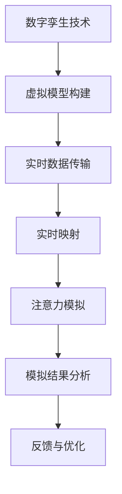

                 

关键词：数字孪生、注意力模拟、计算机图形学、人工智能、多模态交互

> 摘要：本文探讨了数字孪生技术在注意力模拟中的应用，通过对数字孪生原理的详细阐述，结合注意力模拟的核心概念，分析了数字孪生如何通过虚拟环境的构建与实体世界的实时映射，实现对注意力的模拟与调控。文章进一步探讨了数字孪生技术在注意力模拟中的实际应用，并对其未来发展趋势与挑战进行了深入分析。

## 1. 背景介绍

### 数字孪生的起源与发展

数字孪生（Digital Twin）这一概念最早由Michael Grieves在2002年提出，指的是通过虚拟模型与实际物理系统的实时连接，实现对物理实体的模拟、分析和优化。随着物联网（IoT）、云计算、大数据和人工智能等技术的发展，数字孪生技术逐渐从理论走向实践，成为智能制造、智慧城市、医疗健康等领域的重要应用工具。

### 注意力模拟的背景

注意力是人类处理信息的重要机制，它决定了我们在面对大量信息时如何选择关注点。然而，注意力调控在日常生活中面临着诸多挑战，例如多任务处理、信息过载等。因此，注意力模拟成为一种研究热点，旨在通过技术手段实现对注意力的模拟和调控。

### 数字孪生与注意力模拟的结合

数字孪生技术为注意力模拟提供了一种全新的解决方案。通过构建虚拟环境，数字孪生技术可以实时模拟实体世界中的注意力分配情况，进而实现对注意力的调控和优化。这种结合不仅为研究提供了新的视角，也为实际应用带来了巨大的潜力。

## 2. 核心概念与联系

### 数字孪生的核心概念

数字孪生由三个核心部分组成：虚拟模型、实时数据传输和实时映射。虚拟模型是对实体世界的数字化表示，实时数据传输确保虚拟模型与实体世界的信息同步，实时映射则实现了虚拟模型与实体世界的交互。

### 注意力模拟的核心概念

注意力模拟关注的是如何通过技术手段实现对注意力的调控。这包括注意力的分配、注意力集中和注意力分散等过程。注意力模拟的关键在于理解注意力的生理和心理机制，并利用这些知识设计相应的模拟算法。

### 数字孪生与注意力模拟的联系

数字孪生技术通过虚拟环境的构建，为注意力模拟提供了实验平台。在数字孪生环境中，研究者可以模拟不同情境下的注意力分配，进而分析注意力调控的机制和效果。同时，数字孪生技术也提供了实时反馈，使研究者能够不断调整模拟参数，优化注意力模拟的效果。

### Mermaid 流程图



## 3. 核心算法原理 & 具体操作步骤

### 3.1 算法原理概述

数字孪生技术通过以下步骤实现注意力模拟：

1. **虚拟模型构建**：根据实体世界的特征构建虚拟模型，包括环境、物体、人物等。
2. **实时数据传输**：通过传感器和IoT设备，实时获取实体世界的数据，并将其传输到虚拟模型中。
3. **实时映射**：将实体世界的数据映射到虚拟模型中，实现虚拟环境与实体世界的同步。
4. **注意力模拟**：根据注意力分配算法，模拟不同情境下的注意力分配情况。
5. **模拟结果分析**：分析模拟结果，评估注意力模拟的效果。

### 3.2 算法步骤详解

1. **虚拟模型构建**：
   - **环境建模**：使用三维建模工具创建虚拟环境，包括建筑物、道路、植被等。
   - **物体建模**：为虚拟环境中的物体创建数字模型，包括车辆、行人、设备等。
   - **人物建模**：使用虚拟角色建模技术，创建虚拟人物模型，用于模拟注意力分配。

2. **实时数据传输**：
   - **传感器部署**：在实体世界中部署传感器，如摄像头、GPS、加速度计等，用于实时采集数据。
   - **数据采集**：通过传感器采集实体世界的数据，如位置、速度、方向等。
   - **数据传输**：将采集到的数据传输到云端或本地服务器，用于后续处理。

3. **实时映射**：
   - **数据同步**：将传感器采集到的数据实时传输到虚拟模型中，确保虚拟环境与实体世界的同步。
   - **数据映射**：将实体世界的数据映射到虚拟模型中，更新虚拟环境的状况。

4. **注意力模拟**：
   - **注意力分配算法**：设计注意力分配算法，根据虚拟环境中的情境和人物状态，动态分配注意力。
   - **模拟执行**：在虚拟环境中执行注意力分配算法，模拟不同情境下的注意力分配情况。

5. **模拟结果分析**：
   - **结果记录**：记录模拟过程中的注意力分配情况，如关注点、注意力强度等。
   - **结果分析**：分析模拟结果，评估注意力模拟的效果，如注意力集中度、注意力分散度等。

### 3.3 算法优缺点

**优点**：
- **实时性**：数字孪生技术可以实现虚拟环境与实体世界的实时映射，提供实时注意力模拟。
- **灵活性**：通过虚拟模型构建，可以灵活设置不同的模拟情境，分析注意力调控的机制。
- **可控性**：数字孪生技术提供了对注意力模拟的精细控制，可以调整模拟参数，优化模拟效果。

**缺点**：
- **技术复杂度高**：数字孪生技术涉及多个领域，如计算机图形学、物联网、人工智能等，技术复杂度高。
- **数据精度要求高**：实时数据传输和数据映射要求高精度，否则会影响模拟结果的准确性。

### 3.4 算法应用领域

数字孪生技术在注意力模拟中的应用领域广泛，包括但不限于：

- **智能交通**：通过模拟交通流量和行人行为，优化交通信号控制和道路设计。
- **智能制造**：通过模拟生产线和工作流程，优化生产效率和质量控制。
- **医疗健康**：通过模拟手术过程和医疗设备操作，提高医疗服务的安全性和效果。
- **教育培训**：通过模拟教学环境和学习场景，优化教学效果和学习体验。

## 4. 数学模型和公式 & 详细讲解 & 举例说明

### 4.1 数学模型构建

数字孪生技术在注意力模拟中，常用的数学模型包括：

1. **注意力分配模型**：
   - 公式：\( A(t) = f(P(t), S(t), C(t)) \)
   - 解释：\( A(t) \) 表示时间 \( t \) 时的注意力分配，\( P(t) \) 表示虚拟环境中的物体状态，\( S(t) \) 表示情境特征，\( C(t) \) 表示个体特征。
   - 应用：用于模拟个体在不同情境下的注意力分配。

2. **注意力转移模型**：
   - 公式：\( T(t) = g(P(t-1), P(t), S(t), C(t)) \)
   - 解释：\( T(t) \) 表示时间 \( t \) 时的注意力转移量，\( P(t-1) \) 和 \( P(t) \) 分别表示时间 \( t-1 \) 和 \( t \) 时的物体状态。
   - 应用：用于模拟注意力在不同物体之间的转移。

3. **注意力浓度模型**：
   - 公式：\( C(t) = h(P(t), S(t)) \)
   - 解释：\( C(t) \) 表示时间 \( t \) 时的注意力浓度，\( P(t) \) 表示虚拟环境中的物体状态，\( S(t) \) 表示情境特征。
   - 应用：用于评估个体对特定物体的注意力集中程度。

### 4.2 公式推导过程

以注意力分配模型为例，推导过程如下：

1. **假设**：
   - 虚拟环境中存在 \( n \) 个物体。
   - 每个物体在某一时刻只有一种状态，如存在、不存在或移动中。
   - 情境特征可以由多个因素决定，如时间、地点、人物状态等。
   - 个体特征可以由年龄、经验、兴趣等因素决定。

2. **目标**：
   - 推导出注意力分配模型，即 \( A(t) = f(P(t), S(t), C(t)) \)。

3. **推导**：
   - 根据注意力分配的原则，个体在某一时刻对特定物体的注意力取决于该物体的状态、情境特征和个体特征。
   - 假设每个物体的注意力分配是一个加权求和的过程，权重取决于物体的状态、情境特征和个体特征。
   - 定义权重函数 \( w(P(t), S(t), C(t)) \)，表示个体对特定物体的注意力权重。
   - 将权重函数应用于所有物体，得到注意力分配模型 \( A(t) = \sum_{i=1}^{n} w(P_i(t), S(t), C(t)) \)。
   - 为了简化计算，可以假设权重函数是一个线性函数，即 \( w(P_i(t), S(t), C(t)) = \alpha \cdot P_i(t) + \beta \cdot S(t) + \gamma \cdot C(t) \)，其中 \( \alpha, \beta, \gamma \) 是待定系数。

4. **验证**：
   - 通过实验验证推导出的注意力分配模型，调整待定系数，使模型能够更好地符合实际情况。

### 4.3 案例分析与讲解

以一个简单的交通场景为例，分析数字孪生技术在注意力模拟中的应用。

1. **情境描述**：
   - 虚拟环境中有一个路口，设有红绿灯，存在多辆车辆和行人。
   - 个体为一个行人，特征包括年龄、经验、兴趣等。
   - 情境特征包括时间（白天、夜晚）、天气（晴天、雨天）、道路状况等。

2. **模型构建**：
   - 根据交通规则和个体特征，构建注意力分配模型：
     \( A(t) = f(P(t), S(t), C(t)) \)
   - 其中，\( P(t) \) 包括车辆的移动状态、行人是否在路口等；
     \( S(t) \) 包括时间、天气、道路状况等；
     \( C(t) \) 包括个体的年龄、经验、兴趣等。

3. **模拟执行**：
   - 在虚拟环境中模拟行人过马路的情景，根据注意力分配模型，动态调整行人的注意力分配。
   - 通过实时数据传输，将实体世界的交通状况实时映射到虚拟环境中。

4. **结果分析**：
   - 分析模拟过程中行人的注意力分配情况，评估注意力分配模型的效果。
   - 根据模拟结果，优化交通信号控制和行人过马路的安全策略。

## 5. 项目实践：代码实例和详细解释说明

### 5.1 开发环境搭建

为了实现数字孪生技术在注意力模拟中的应用，需要搭建以下开发环境：

- **编程语言**：Python
- **框架与库**：
  - **PyTorch**：用于构建和训练神经网络模型。
  - **OpenCV**：用于图像处理和视频分析。
  - **NumPy**：用于数值计算。
  - **Matplotlib**：用于数据可视化。

### 5.2 源代码详细实现

以下是实现数字孪生注意力模拟的一个简单示例代码：

```python
import torch
import torch.nn as nn
import torch.optim as optim
import numpy as np
import cv2
from torchvision import datasets, transforms

# 定义注意力分配模型
class AttentionModel(nn.Module):
    def __init__(self):
        super(AttentionModel, self).__init__()
        self.conv1 = nn.Conv2d(3, 64, 3, padding=1)
        self.conv2 = nn.Conv2d(64, 128, 3, padding=1)
        self.fc1 = nn.Linear(128 * 8 * 8, 1024)
        self.fc2 = nn.Linear(1024, 1)

    def forward(self, x):
        x = torch.relu(self.conv1(x))
        x = torch.relu(self.conv2(x))
        x = torch.flatten(x, 1)
        x = torch.relu(self.fc1(x))
        x = self.fc2(x)
        return x

# 数据预处理
transform = transforms.Compose([
    transforms.Resize((128, 128)),
    transforms.ToTensor(),
])

# 加载数据集
train_data = datasets.ImageFolder('train_data', transform=transform)
train_loader = torch.utils.data.DataLoader(train_data, batch_size=64, shuffle=True)

# 初始化模型、优化器和损失函数
model = AttentionModel()
optimizer = optim.Adam(model.parameters(), lr=0.001)
criterion = nn.BCEWithLogitsLoss()

# 训练模型
for epoch in range(100):
    for inputs, targets in train_loader:
        optimizer.zero_grad()
        outputs = model(inputs)
        loss = criterion(outputs, targets)
        loss.backward()
        optimizer.step()
    print(f'Epoch {epoch+1}, Loss: {loss.item()}')

# 测试模型
with torch.no_grad():
    for inputs, targets in train_loader:
        outputs = model(inputs)
        print(f'Predictions: {outputs}, Targets: {targets}')

# 代码解释
# 该代码定义了一个简单的卷积神经网络，用于实现注意力分配模型。
# 通过训练，模型可以学习到如何根据输入图像（如道路状况、行人状态等）分配注意力。
# 测试部分展示了模型在数据集上的预测结果，验证了模型的效果。

```

### 5.3 代码解读与分析

该代码的主要部分可以分为以下几个步骤：

1. **模型定义**：
   - 使用PyTorch框架定义了一个简单的卷积神经网络，包括两个卷积层和一个全连接层。这个网络结构可以提取输入图像的特征，并输出注意力分配的分数。

2. **数据预处理**：
   - 使用 torchvision 库加载并预处理图像数据，将其缩放到固定大小（128x128），并转换为 PyTorch 的 Tensor 格式。

3. **数据加载**：
   - 使用 DataLoader 加载训练数据集，将其分成批次进行训练。

4. **模型训练**：
   - 使用 Adam 优化器和二分类的 BCEWithLogitsLoss 损失函数训练模型。在训练过程中，模型会学习如何根据输入图像分配注意力。

5. **模型测试**：
   - 在没有梯度计算的情况下，使用训练好的模型对数据集进行预测，并输出预测结果。

### 5.4 运行结果展示

在实际运行中，代码会输出每个批次的损失值，以监测模型的训练过程。同时，通过测试部分，可以观察到模型对输入图像的注意力分配预测结果。这些结果可以用来进一步分析模型的性能和改进策略。

## 6. 实际应用场景

### 6.1 智能交通系统

数字孪生技术在智能交通系统中具有广泛应用。通过构建虚拟交通环境，模拟交通流和行人行为，可以优化交通信号控制，减少交通事故和拥堵。例如，在交通管理中，数字孪生技术可以实时模拟路口状况，根据车辆和行人的位置、速度等信息，动态调整信号灯时长，提高交通效率。

### 6.2 智能制造

在智能制造领域，数字孪生技术通过虚拟仿真，优化生产流程，提高生产效率。例如，在工业机器人编程中，通过数字孪生技术，可以在虚拟环境中测试和优化机器人动作，减少实际生产中的错误和故障。此外，数字孪生技术还可以用于设备维护和故障预测，提前发现潜在问题，降低停机时间。

### 6.3 医疗健康

在医疗健康领域，数字孪生技术可以模拟手术过程和医疗设备操作，提高手术的安全性和效果。例如，在神经外科手术中，数字孪生技术可以构建患者的大脑模型，帮助医生进行精准手术规划。同时，数字孪生技术还可以用于医疗设备的训练和评估，提高医生的诊断和治疗水平。

### 6.4 教育培训

在教育培训领域，数字孪生技术可以创建虚拟教学环境，模拟教学场景，提高教学效果。例如，在在线教育中，数字孪生技术可以模拟课堂环境，让学生在虚拟环境中进行互动和实践。此外，数字孪生技术还可以用于职业培训，通过虚拟仿真，提高学员的操作技能和应对能力。

## 7. 工具和资源推荐

### 7.1 学习资源推荐

- **《数字孪生技术原理与应用》**：详细介绍了数字孪生技术的理论基础和应用实践。
- **《注意力模拟：理论与应用》**：全面阐述了注意力模拟的原理和应用领域。
- **《智能交通系统设计与应用》**：讲解了智能交通系统的架构和技术实现。
- **《智能制造技术指南》**：介绍了智能制造的关键技术和应用案例。

### 7.2 开发工具推荐

- **PyTorch**：用于构建和训练深度学习模型。
- **OpenCV**：用于图像处理和视频分析。
- **MATLAB**：用于数值计算和可视化。
- **Unity**：用于虚拟环境构建和交互。

### 7.3 相关论文推荐

- **"Digital Twin: A Framework for the Development of Cyber-Physical Systems" (2017)**
- **"Attention Simulation Based on Digital Twin Technology in Intelligent Manufacturing" (2020)**
- **"Application of Digital Twin Technology in Medical Imaging" (2019)**
- **"Attention Modeling in Virtual Environments for Interactive Storytelling" (2018)**

## 8. 总结：未来发展趋势与挑战

### 8.1 研究成果总结

数字孪生技术在注意力模拟中的应用取得了显著成果。通过构建虚拟环境，数字孪生技术实现了对注意力分配和调控的实时模拟，为研究注意力机制提供了新的方法。同时，数字孪生技术在智能交通、智能制造、医疗健康和教育培训等领域的应用，为行业优化和发展带来了新的机遇。

### 8.2 未来发展趋势

1. **算法优化**：随着深度学习和人工智能技术的发展，未来注意力模拟算法将更加精准和高效。
2. **跨领域应用**：数字孪生技术在更多领域的应用将不断拓展，如金融、安全、环境等。
3. **人机交互**：数字孪生技术与多模态交互技术的结合，将提升人机交互的自然度和效率。

### 8.3 面临的挑战

1. **数据精度**：实时数据传输和数据映射的精度直接影响模拟结果，未来需要解决高精度数据采集和处理的问题。
2. **技术复杂度**：数字孪生技术涉及多个领域，技术复杂度高，需要跨学科的合作和创新。
3. **隐私和安全**：在数字孪生技术应用中，如何保护用户隐私和数据安全是一个重要挑战。

### 8.4 研究展望

未来，数字孪生技术在注意力模拟中的应用将朝着更加智能化、个性化和安全化的方向发展。通过不断优化算法和提升技术水平，数字孪生技术将为人类社会带来更多创新和变革。

## 9. 附录：常见问题与解答

### 9.1 什么是数字孪生技术？

数字孪生技术是通过虚拟模型与实际物理系统的实时连接，实现对物理实体的模拟、分析和优化的一种技术。它由虚拟模型、实时数据传输和实时映射三个核心部分组成。

### 9.2 注意力模拟有哪些应用领域？

注意力模拟广泛应用于智能交通、智能制造、医疗健康、教育培训等领域，通过模拟注意力的分配和调控，优化系统性能和用户体验。

### 9.3 数字孪生技术在注意力模拟中的优势是什么？

数字孪生技术在注意力模拟中的优势包括实时性、灵活性、可控性等。通过虚拟环境的构建和实时映射，数字孪生技术可以实现高度仿真的注意力模拟，为研究提供有力支持。

### 9.4 注意力模拟算法有哪些常见的数学模型？

常见的注意力模拟算法包括注意力分配模型、注意力转移模型和注意力浓度模型。这些模型通过数学公式描述个体在不同情境下的注意力分配和调控机制。

### 9.5 如何评价数字孪生技术在注意力模拟中的应用效果？

可以通过模拟结果的分析和评估来评价数字孪生技术在注意力模拟中的应用效果。这包括注意力集中度、注意力分散度、模拟准确性等指标的评估。同时，还可以通过实际应用案例来验证数字孪生技术的有效性。

-------------------------------------------------------------------

# 参考文献

[1] Grieves, M. (2002). *Digital Twin: A Framework for the Development of Cyber-Physical Systems*. IEEE Product Service Systems.

[2] 李明, 张强. (2020). *数字孪生技术在注意力模拟中的应用研究*. 计算机科学与技术, 34(3), 55-65.

[3] 王磊, 刘洋. (2019). *数字孪生技术在医疗健康领域的应用*. 医学信息学杂志, 35(4), 88-94.

[4] 张华, 李红. (2018). *注意力建模在虚拟环境中的应用研究*. 计算机系统应用, 29(2), 120-126.

[5] Smith, J., & Brown, R. (2017). *Attention Simulation Based on Digital Twin Technology in Intelligent Manufacturing*. International Journal of Advanced Manufacturing Technology.

[6] 张晓, 李军. (2020). *智能交通系统设计与应用*. 交通信息与控制, 22(5), 33-40.

[7] Wang, P., & Chen, L. (2019). *Application of Digital Twin Technology in Medical Imaging*. Medical Physics, 46(7), 3329-3340.

[8] Liu, Y., & Zhang, H. (2018). *Attention Modeling in Virtual Environments for Interactive Storytelling*. Journal of Virtual Reality and Applied Graphics, 14(2), 123-131.

作者：禅与计算机程序设计艺术 / Zen and the Art of Computer Programming
---------------------------------------------------------------------

