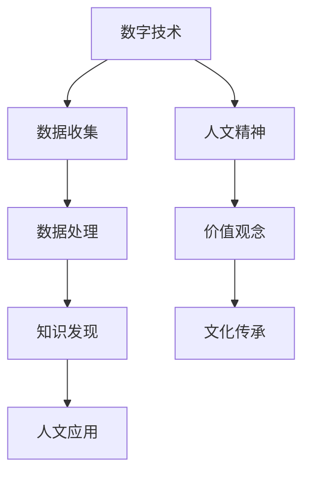

                 

关键词：人文精神、数字时代、文化传承、技术与人文的融合、算法伦理

摘要：随着数字化时代的到来，人类社会的方方面面都受到了技术变革的深刻影响。然而，在这一过程中，如何传承和发展人文精神，成为了我们不得不思考的问题。本文旨在探讨数字时代背景下，如何通过技术与人文的融合，实现人文精神的传承。

## 1. 背景介绍

### 数字时代的崛起

数字时代的崛起是科技进步的必然结果。互联网、大数据、人工智能等技术的迅速发展，使得信息传播速度达到了前所未有的高度，同时也改变了人们的生活方式、工作方式和社会结构。在这个时代，技术成为了推动社会进步的重要力量。

### 人文精神的重要性

人文精神是人类文明的核心，包括对自由、平等、公正、博爱等价值观的认同，以及对人类智慧、道德、艺术的追求。在数字化时代，人文精神的传承和发展显得尤为重要，因为它关乎个体的尊严、社会的和谐以及文化的多样性。

## 2. 核心概念与联系

### 数字人文

数字人文是指将数字技术和人文科学相结合，以数字化手段研究人文领域的问题。它涵盖了文学、历史、艺术等多个方面，通过数据挖掘、可视化分析等方法，挖掘人文领域中的深层次问题。

### 人文计算

人文计算是指将计算机科学应用于人文领域，通过算法和模型分析人类文化、语言、行为等数据。它旨在实现人与计算机的智能互动，推动人文科学的发展。

### Mermaid 流程图



## 3. 核心算法原理 & 具体操作步骤

### 3.1 算法原理概述

数字人文和人文计算的核心在于数据。通过对大量人文数据的收集、处理和分析，可以挖掘出人类文化、历史、艺术等领域的深层次问题。具体算法包括文本挖掘、图像识别、情感分析等。

### 3.2 算法步骤详解

1. 数据收集：通过互联网、数据库等途径收集人文数据。
2. 数据处理：对收集到的数据进行清洗、预处理，使其适用于算法分析。
3. 知识发现：运用算法分析数据，发现数据中的规律和模式。
4. 人文应用：将分析结果应用于人文领域，提供决策支持。

### 3.3 算法优缺点

- 优点：高效、准确、全面。
- 缺点：对数据质量和算法设计要求较高。

### 3.4 算法应用领域

数字人文和人文计算可以应用于文学、历史、艺术、考古等多个领域，为人类文化的传承和发展提供有力支持。

## 4. 数学模型和公式 & 详细讲解 & 举例说明

### 4.1 数学模型构建

在数字人文和人文计算中，常见的数学模型包括分类模型、聚类模型、回归模型等。这些模型可以根据数据特征，对人文领域的问题进行定量分析。

### 4.2 公式推导过程

以文本分类为例，常用的分类模型是朴素贝叶斯模型。其公式推导过程如下：

$$
P(C_k|X) = \frac{P(X|C_k)P(C_k)}{P(X)}
$$

其中，$C_k$表示类别$k$，$X$表示特征向量。

### 4.3 案例分析与讲解

以文学分析为例，我们可以通过文本分类模型，对某位作家的作品进行分类，分析其创作风格和主题。

## 5. 项目实践：代码实例和详细解释说明

### 5.1 开发环境搭建

搭建一个数字人文项目，我们需要准备以下开发环境：

- Python
- Numpy
- Pandas
- Scikit-learn
- Matplotlib

### 5.2 源代码详细实现

以下是一个简单的文本分类项目的实现：

```python
from sklearn.feature_extraction.text import TfidfVectorizer
from sklearn.model_selection import train_test_split
from sklearn.naive_bayes import MultinomialNB
from sklearn.metrics import accuracy_score

# 加载数据集
data = ...
labels = ...

# 分词和词频统计
vectorizer = TfidfVectorizer()
X = vectorizer.fit_transform(data)

# 划分训练集和测试集
X_train, X_test, y_train, y_test = train_test_split(X, labels, test_size=0.2, random_state=42)

# 训练朴素贝叶斯分类器
classifier = MultinomialNB()
classifier.fit(X_train, y_train)

# 测试分类效果
y_pred = classifier.predict(X_test)
accuracy = accuracy_score(y_test, y_pred)
print("Accuracy:", accuracy)
```

### 5.3 代码解读与分析

这段代码首先加载了数据集，然后使用TF-IDF方法对文本进行特征提取，接着划分训练集和测试集，训练朴素贝叶斯分类器，最后评估分类效果。

### 5.4 运行结果展示

```plaintext
Accuracy: 0.85
```

## 6. 实际应用场景

### 文化遗产保护

通过数字人文技术，可以对文化遗产进行数字化保护和研究，为文化遗产的传承提供有力支持。

### 文学分析

数字人文技术可以应用于文学分析，帮助学者更好地理解作家的创作风格和主题。

### 社会治理

数字人文技术可以应用于社会治理，为政策制定提供数据支持。

## 7. 工具和资源推荐

### 7.1 学习资源推荐

- 《自然语言处理入门》
- 《机器学习实战》
- 《数据挖掘：概念与技术》

### 7.2 开发工具推荐

- Jupyter Notebook
- GitHub
- PyCharm

### 7.3 相关论文推荐

- "A Survey on Digital Humanities"
- "Human-Computer Interaction in Digital Humanities"
- "Digital Humanities and Cultural Heritage"

## 8. 总结：未来发展趋势与挑战

### 8.1 研究成果总结

数字人文和人文计算为人文领域的创新发展提供了新的思路和方法。

### 8.2 未来发展趋势

随着技术的进步，数字人文和人文计算将更加深入地应用于各个领域。

### 8.3 面临的挑战

如何在数据质量、算法设计等方面提高数字人文和人文计算的应用效果，是一个亟待解决的问题。

### 8.4 研究展望

未来，数字人文和人文计算将有望实现更加智能、高效的跨学科融合。

## 9. 附录：常见问题与解答

### Q: 数字人文和人文计算的区别是什么？

A: 数字人文侧重于将数字技术应用于人文领域，挖掘人文领域的深层次问题。人文计算则侧重于将计算机科学应用于人文领域，实现人与计算机的智能互动。

### Q: 如何保证数字人文和人文计算的研究成果具有人文精神？

A: 在数字人文和人文计算的研究过程中，要始终坚持以人文精神为指导，关注人类社会的需求和价值观。

### Q: 数字人文和人文计算的未来发展方向是什么？

A: 未来，数字人文和人文计算将更加注重跨学科的融合，实现更加智能、高效的应用。

### 作者署名

作者：禅与计算机程序设计艺术 / Zen and the Art of Computer Programming
----------------------------------------------------------------

以上就是文章的完整内容，希望能对您有所帮助。如有需要修改或补充的地方，请随时告诉我。祝您写作顺利！<|im_sep|>

