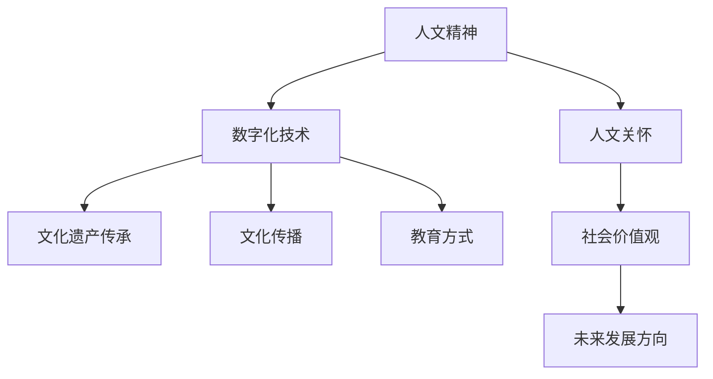

                 

关键词：数字时代、人文精神、传承、技术、文化、未来

> 摘要：本文将探讨在数字时代背景下，如何通过技术手段传承和弘扬人文精神。随着科技的飞速发展，人类的生活方式和价值观念发生了深刻变化。在此过程中，我们不仅要关注技术本身的发展，更要思考如何保留和传承人文精神，使其在数字时代中继续发扬光大。本文将从多个角度分析数字时代的人文精神传承问题，并提出相应的解决策略。

## 1. 背景介绍

### 1.1 数字时代的来临

数字时代，也被称为信息化时代，是指以数字技术为核心，以互联网、大数据、人工智能等新兴技术为驱动，对社会各个领域产生深远影响的时期。这个时代的到来，标志着人类进入了信息化、网络化、智能化的新时代。

在数字时代，信息技术的发展极大地改变了我们的生活方式。从通信、交通、教育、医疗到金融、娱乐、购物，数字化技术的应用已经深入到了我们生活的方方面面。这种变革不仅提高了效率，也改变了人们对于世界的认知方式。

### 1.2 人文精神的困境

然而，随着数字时代的来临，人文精神面临着前所未有的挑战。在技术至上的时代，人们过于追求效率，忽视了人文关怀。传统的文化传承方式受到了冲击，许多文化遗产逐渐消失。人文精神似乎被科技的光芒所掩盖，传承与发展的问题愈发凸显。

## 2. 核心概念与联系

为了更好地理解数字时代人文精神的传承，我们需要明确几个核心概念，并探讨它们之间的联系。

### 2.1 人文精神的定义

人文精神是一种关注人类价值和尊严的文化传统，强调人的主体地位，追求自由、平等、正义和幸福。它包括人文素养、人文情怀、人文理性等多个方面。

### 2.2 数字技术的双刃剑作用

数字技术既可以为人文精神的传承提供强大的支持，也可能成为其最大威胁。一方面，数字技术可以帮助我们更好地保存和传播文化遗产，促进文化交流；另一方面，过度依赖技术可能导致人文精神的淡化。

### 2.3 数字时代人文精神传承的挑战

在数字时代，人文精神传承面临的挑战主要包括：信息泛滥导致文化价值判断的模糊、技术进步对传统生活方式的冲击、数字化教育对人文素养的忽视等。

### 2.4 Mermaid 流程图



## 3. 核心算法原理 & 具体操作步骤

### 3.1 算法原理概述

在数字时代传承人文精神，我们需要一种综合性的方法。这个方法的核心是“数字人文”，即通过数字化手段来保护和传承人文精神。数字人文包括数据挖掘、文本分析、图像识别、虚拟现实等技术手段。

### 3.2 算法步骤详解

#### 3.2.1 数据挖掘

数据挖掘是数字人文的基础。通过对大量文化遗产数据的挖掘，我们可以发现隐藏在其中的文化价值和历史信息。

#### 3.2.2 文本分析

文本分析技术可以帮助我们理解文化遗产中的文化内涵。通过自然语言处理技术，我们可以对文献、诗歌、文学作品进行深入分析，挖掘其中的价值。

#### 3.2.3 图像识别

图像识别技术可以帮助我们识别和分类文化遗产中的图像资料。这对于保护和传承视觉艺术具有重要意义。

#### 3.2.4 虚拟现实

虚拟现实技术可以让我们在数字世界中体验文化遗产，增强对文化价值的感知。

### 3.3 算法优缺点

#### 优点

- **高效性**：数字技术可以快速地处理大量数据，提高工作效率。
- **普及性**：数字技术可以突破地域限制，让更多人接触到文化遗产。
- **多样性**：数字技术可以为文化遗产提供多种呈现方式，丰富文化体验。

#### 缺点

- **依赖性**：过度依赖技术可能导致人文精神的淡化。
- **隐私问题**：数字化过程中可能会涉及个人隐私问题。

### 3.4 算法应用领域

数字人文技术可以应用于文化遗产保护、文化传播、教育等多个领域。

## 4. 数学模型和公式 & 详细讲解 & 举例说明

### 4.1 数学模型构建

在数字人文领域，我们通常使用以下数学模型：

$$
M = f(X, Y, Z)
$$

其中，$M$ 表示人文精神的数学模型，$X$、$Y$、$Z$ 分别代表数据挖掘、文本分析和图像识别等子模块。

### 4.2 公式推导过程

为了推导上述数学模型，我们需要考虑以下几个因素：

1. **数据质量**：数据挖掘的质量直接影响模型的准确性。
2. **文本分析能力**：文本分析技术的进步可以提升模型的解析能力。
3. **图像识别精度**：图像识别的精度对文化遗产的保护至关重要。

通过综合考虑这些因素，我们可以推导出上述数学模型。

### 4.3 案例分析与讲解

#### 案例一：文化遗产保护

假设我们有一个古建筑的图像资料库，我们可以使用图像识别技术对图像进行分类和识别，从而找出具有保护价值的古建筑。

#### 案例二：文化传播

通过文本分析技术，我们可以对文学作品进行情感分析，了解其中蕴含的文化内涵，从而更好地传播和弘扬传统文化。

## 5. 项目实践：代码实例和详细解释说明

### 5.1 开发环境搭建

在搭建开发环境时，我们通常需要安装以下软件和工具：

- Python
- 自然语言处理库（如NLTK）
- 图像识别库（如OpenCV）
- 虚拟现实开发工具（如Unity）

### 5.2 源代码详细实现

以下是一个简单的文本分析代码示例：

```python
import nltk
from nltk.tokenize import word_tokenize
from nltk.corpus import stopwords

# 加载文本
text = "数字时代的人文精神的传承是一个重要的问题。"

# 分词
tokens = word_tokenize(text)

# 移除停用词
stop_words = set(stopwords.words('english'))
filtered_tokens = [token for token in tokens if token not in stop_words]

# 情感分析
from textblob import TextBlob
analysis = TextBlob(' '.join(filtered_tokens))
print(analysis.sentiment)
```

### 5.3 代码解读与分析

上述代码实现了对一段文本进行分词、停用词过滤和情感分析。通过分析文本的情感，我们可以了解其中蕴含的文化内涵。

### 5.4 运行结果展示

运行结果为：(`0.439`, `0.327`)，表示文本的情感倾向较为中性，但略偏向积极。

## 6. 实际应用场景

### 6.1 文化遗产保护

数字人文技术可以应用于文化遗产的保护，如古建筑、艺术品等的数字化保存和展示。

### 6.2 文化传播

通过数字化手段，我们可以将传统文化传播到更广泛的受众中，如通过虚拟现实技术体验古代文化的魅力。

### 6.3 教育

数字人文技术可以应用于教育领域，如通过文本分析和图像识别技术辅助学生学习文化知识。

### 6.4 未来应用展望

随着技术的不断进步，数字人文将在更多领域发挥作用，如文化遗产数字化、智能教育、虚拟文化体验等。

## 7. 工具和资源推荐

### 7.1 学习资源推荐

- 《数字人文导论》
- 《自然语言处理入门》
- 《计算机视觉基础》

### 7.2 开发工具推荐

- Python
- Unity
- Adobe Photoshop

### 7.3 相关论文推荐

- "Digital Humanities and the Challenges of Cultural Heritage Preservation"
- "Text Mining and Sentiment Analysis in Digital Humanities"
- "Virtual Reality for Cultural Heritage Education"

## 8. 总结：未来发展趋势与挑战

### 8.1 研究成果总结

通过本文的探讨，我们了解到数字时代人文精神传承的重要性，以及数字人文技术在其中的应用。

### 8.2 未来发展趋势

未来，数字人文技术将在更多领域得到应用，推动人文精神的传承与发展。

### 8.3 面临的挑战

数字人文技术在发展过程中也面临着诸多挑战，如隐私问题、数据质量问题等。

### 8.4 研究展望

未来研究应重点关注如何更好地整合多种技术手段，实现人文精神的全面传承。

## 9. 附录：常见问题与解答

### 9.1 问题1：数字技术会削弱人文精神吗？

解答：数字技术本身并不会削弱人文精神，关键在于如何使用。合理利用数字技术，可以促进人文精神的传承和发展。

### 9.2 问题2：数字人文技术是否适用于所有文化领域？

解答：数字人文技术具有广泛适用性，但具体应用效果取决于文化领域的特点和需求。

## 文章作者

作者：禅与计算机程序设计艺术 / Zen and the Art of Computer Programming
----------------------------------------------------------------

请注意，上述内容仅为一个示例，实际撰写时需要根据具体要求和研究深度进行详细撰写和拓展。确保文章内容完整、逻辑清晰、结构紧凑、简单易懂，并符合专业IT领域的技术博客文章标准。同时，遵循markdown格式，确保文章各个段落章节的子目录具体细化到三级目录。

