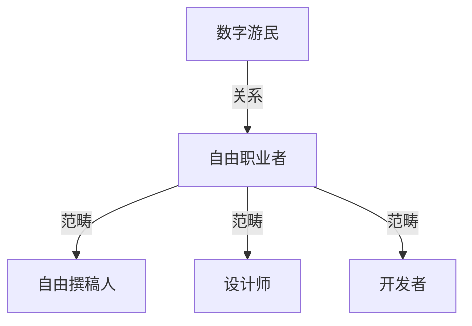
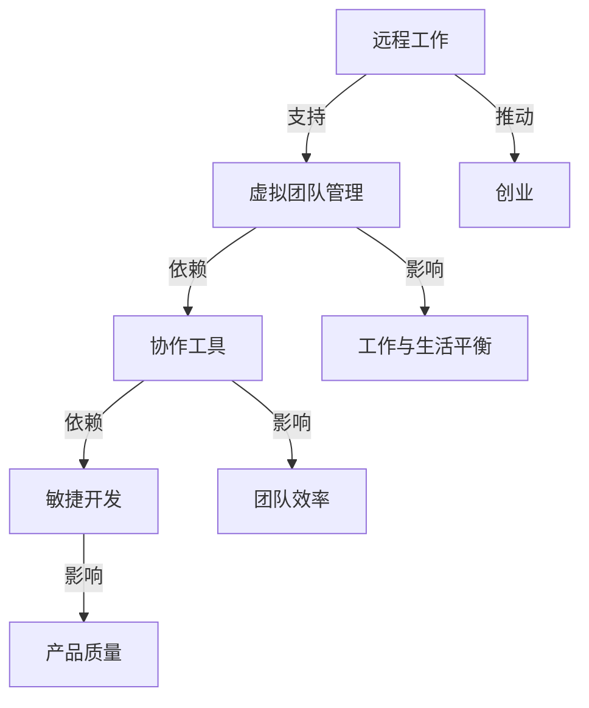

                 

关键词：数字游民、自由职业、远程工作、创业、工作与生活平衡、远程团队管理、虚拟协作工具、技术赋能、创业生态。

> 摘要：本文将探讨数字游民创业这一新兴工作模式的本质和优势，分析其与传统创业模式的区别。通过阐述数字游民创业的核心概念、技术支撑和成功案例，揭示其在当前全球化、技术驱动的社会背景下的重要地位。本文旨在为有志于成为数字游民的创业者和自由职业者提供指导和建议。

## 1. 背景介绍

### 1.1 数字游民与自由职业的兴起

数字游民（Digital Nomad）这一概念起源于21世纪初，指的是利用互联网技术，在任何有网络连接的地方工作的人。他们的工作通常不受地理位置限制，可以通过远程协作工具与全球的团队成员保持实时沟通。与此同时，自由职业（Freelance）也逐渐成为一种流行的职业选择。自由职业者通常为多个客户或项目工作，独立完成工作任务，具有较高的灵活性和自主权。

随着移动互联网和远程协作工具的普及，数字游民和自由职业者的人数迅速增长。他们不仅包括自由撰稿人、设计师、开发人员等传统意义上的自由职业者，还涵盖了远程创业者、在线教育工作者、远程咨询师等多种职业类型。这种新兴的工作模式正在重新定义工作与生活之间的关系，为人们提供了前所未有的自由和灵活性。

### 1.2 数字游民创业的动机

数字游民选择创业的主要原因在于追求工作与生活的平衡、追求自由和灵活性、以及追求全球视野和跨文化交流。以下是数字游民创业的几个主要动机：

- **工作与生活平衡**：数字游民可以自由安排工作时间，灵活调整工作地点，这使得他们能够更好地平衡工作与生活，减少因通勤带来的时间和精力消耗。

- **追求自由和灵活性**：数字游民可以自由选择自己喜欢的工作内容、项目以及合作伙伴，这种高度的自主权和工作方式的灵活性是传统职业所难以提供的。

- **全球视野和跨文化交流**：数字游民经常在世界各地旅行，这使得他们能够接触到不同文化，拓宽视野，丰富人生经历。

- **低成本创业**：得益于互联网的低成本特性，数字游民创业者可以利用在线平台、开源工具和远程协作工具，以较低的成本启动和运营企业。

### 1.3 数字游民创业的优势

数字游民创业模式具有以下几个显著优势：

- **全球化团队管理**：数字游民创业团队通常由来自世界各地的成员组成，这种多元化的团队结构有助于创新和创造力的提升。

- **灵活的雇佣模式**：数字游民创业者可以根据项目需求灵活雇佣自由职业者，从而降低长期雇佣成本，提高团队响应速度。

- **高效远程协作**：现代远程协作工具如Slack、Zoom、Trello等，使得数字游民团队可以高效地进行沟通和协作。

- **低成本运营**：通过选择成本较低的生活和工作地点，数字游民创业者可以显著降低生活成本和运营成本。

## 2. 核心概念与联系

### 2.1 数字游民与自由职业的关系

数字游民和自由职业者是两个相关但不完全重叠的概念。自由职业者是数字游民的一个子集，他们以独立身份为多个客户或项目工作。而数字游民则更强调工作与生活的融合，他们的工作方式更加灵活和移动性。以下是一个简化的Mermaid流程图，展示了数字游民与自由职业者之间的关系。



### 2.2 数字游民创业的核心概念

数字游民创业涉及多个核心概念，包括远程工作、虚拟团队管理、敏捷开发、协作工具等。以下是这些概念之间的联系和交互的Mermaid流程图。



## 3. 核心算法原理 & 具体操作步骤

### 3.1 算法原理概述

数字游民创业的成功离不开一系列技术和管理工具的支撑，这些工具和方法可以看作是一种“算法”。以下是数字游民创业中几个核心算法的原理概述：

- **虚拟团队管理算法**：通过使用项目管理工具和远程协作平台，实现对团队的统一管理和协调。

- **敏捷开发方法**：采用敏捷开发框架，快速迭代产品，快速响应市场变化。

- **风险评估与应对算法**：通过风险识别、评估和应对策略，降低创业过程中的不确定性。

- **数据分析与决策算法**：利用大数据和机器学习技术，对市场趋势、用户行为进行分析，辅助决策。

### 3.2 算法步骤详解

#### 3.2.1 虚拟团队管理算法

1. **团队组建**：选择合适的团队成员，明确各自的职责和任务。

2. **协作平台搭建**：选择并配置项目管理工具和远程协作平台，如Slack、Trello、Asana等。

3. **沟通与协作**：定期举行线上会议，确保团队成员之间的信息流通和协作。

4. **进度监控与反馈**：使用项目管理工具跟踪任务进度，及时调整计划和资源分配。

#### 3.2.2 敏捷开发方法

1. **需求分析**：与客户或利益相关者进行沟通，明确产品需求。

2. **迭代计划**：制定迭代计划，确定每个迭代的目标和任务。

3. **快速开发**：在短时间内完成迭代任务，进行代码编写和测试。

4. **用户反馈**：将迭代版本发布给用户，收集反馈并进行后续改进。

#### 3.2.3 风险评估与应对算法

1. **风险识别**：分析创业过程中的潜在风险，如技术风险、市场风险、资金风险等。

2. **风险评估**：对识别出的风险进行定量和定性评估，确定其影响程度。

3. **应对策略**：制定应对策略，如风险规避、风险减轻、风险接受等。

4. **监控与调整**：实时监控风险状况，根据实际情况调整应对策略。

#### 3.2.4 数据分析与决策算法

1. **数据收集**：收集与业务相关的数据，如用户行为、市场趋势等。

2. **数据预处理**：对收集到的数据进行清洗、转换和整合。

3. **数据分析**：使用统计分析、机器学习等方法对数据进行分析，提取有价值的信息。

4. **决策支持**：根据分析结果，提供决策支持，如产品优化、市场策略调整等。

### 3.3 算法优缺点

#### 3.3.1 虚拟团队管理算法

**优点**：

- **高效协同**：团队成员可以随时随地协作，提高了工作效率。

- **灵活性**：可以根据项目需求灵活调整团队成员和任务分配。

- **成本节约**：减少了物理办公室和通勤成本。

**缺点**：

- **沟通障碍**：远程协作可能存在时差和沟通不畅的问题。

- **团队凝聚力**：虚拟团队可能缺乏面对面的互动，影响团队凝聚力。

#### 3.3.2 敏捷开发方法

**优点**：

- **快速迭代**：可以快速响应市场需求和用户反馈，提高产品竞争力。

- **灵活性**：可以灵活调整开发计划，适应市场变化。

- **质量保证**：通过持续集成和测试，确保产品质量。

**缺点**：

- **项目管理复杂**：需要高效的项目管理和沟通，否则容易导致混乱。

- **开发周期不稳定**：快速迭代可能导致开发周期的不稳定。

#### 3.3.3 风险评估与应对算法

**优点**：

- **风险预防**：通过提前识别和评估风险，可以采取预防措施，降低损失。

- **决策支持**：为决策者提供全面的风险信息和应对方案。

**缺点**：

- **成本高**：风险评估和应对策略可能需要大量的人力、物力和财力投入。

- **时效性**：风险状况可能随时变化，需要实时更新评估结果。

#### 3.3.4 数据分析与决策算法

**优点**：

- **数据驱动**：基于数据进行分析和决策，提高决策的科学性和准确性。

- **适应性**：可以不断调整和优化分析模型，适应不同的业务场景。

**缺点**：

- **数据质量**：数据质量直接影响分析结果，需要大量数据清洗和预处理。

- **模型复杂**：复杂的机器学习模型可能难以解释和理解，影响决策的可解释性。

### 3.4 算法应用领域

数字游民创业的核心算法和工具在多个领域都有广泛的应用：

- **软件开发**：敏捷开发方法和虚拟团队管理算法广泛应用于软件项目的管理和开发。

- **市场营销**：数据分析与决策算法可以帮助企业进行市场趋势分析、用户行为分析，优化营销策略。

- **金融科技**：风险评估与应对算法在金融科技领域用于风险管理、信用评估等。

- **电子商务**：虚拟团队管理和数据分析算法可以帮助电商平台优化供应链、提升用户体验。

## 4. 数学模型和公式 & 详细讲解 & 举例说明

### 4.1 数学模型构建

在数字游民创业中，数学模型的应用贯穿于决策分析、风险管理、资源配置等多个方面。以下是一个简化的数学模型，用于描述数字游民创业团队的成本效益分析。

#### 4.1.1 成本效益分析模型

$$
\text{成本效益分析模型} = C_{\text{运营}} + C_{\text{人力}} + C_{\text{技术}} - B_{\text{收入}} - R_{\text{风险}}
$$

其中：

- \(C_{\text{运营}}\)：运营成本，包括办公场所、设备维护、水电等。
- \(C_{\text{人力}}\)：人力成本，包括团队成员的薪酬、培训和福利等。
- \(C_{\text{技术}}\)：技术成本，包括软件、硬件、云服务等。
- \(B_{\text{收入}}\)：收入，包括产品销售、服务收入等。
- \(R_{\text{风险}}\)：风险成本，包括潜在的风险损失和应对措施的成本。

### 4.2 公式推导过程

为了更准确地计算成本效益，需要对每个成本和收入项进行详细分析。以下是公式的推导过程：

1. **运营成本（\(C_{\text{运营}}\)）**：

   $$C_{\text{运营}} = C_{\text{办公场所}} + C_{\text{设备维护}} + C_{\text{水电}}$$

   其中：

   - \(C_{\text{办公场所}}\)：虚拟办公场所的费用，如远程协作平台的订阅费用。
   - \(C_{\text{设备维护}}\)：设备维护费用，包括硬件的保养和维修。
   - \(C_{\text{水电}}\)：办公场所的日常水电费用。

2. **人力成本（\(C_{\text{人力}}\)）**：

   $$C_{\text{人力}} = \sum_{i=1}^{n} (\text{人员薪资} \times \text{工作时间})$$

   其中：

   - \(n\)：团队成员数量。
   - \( \text{人员薪资} \)：每个团队成员的薪资水平。
   - \( \text{工作时间} \)：每个团队成员的工作时长。

3. **技术成本（\(C_{\text{技术}}\)）**：

   $$C_{\text{技术}} = C_{\text{软件}} + C_{\text{硬件}} + C_{\text{云服务}}$$

   其中：

   - \(C_{\text{软件}}\)：软件购买或订阅费用。
   - \(C_{\text{硬件}}\)：硬件购买或租赁费用。
   - \(C_{\text{云服务}}\)：云服务订阅费用。

4. **收入（\(B_{\text{收入}}\)）**：

   $$B_{\text{收入}} = B_{\text{产品销售}} + B_{\text{服务收入}}$$

   其中：

   - \(B_{\text{产品销售}}\)：产品销售收入。
   - \(B_{\text{服务收入}}\)：提供服务的收入。

5. **风险成本（\(R_{\text{风险}}\)）**：

   $$R_{\text{风险}} = R_{\text{技术风险}} + R_{\text{市场风险}} + R_{\text{资金风险}}$$

   其中：

   - \(R_{\text{技术风险}}\)：由于技术问题导致的风险成本。
   - \(R_{\text{市场风险}}\)：由于市场波动导致的风险成本。
   - \(R_{\text{资金风险}}\)：由于资金短缺导致的风险成本。

### 4.3 案例分析与讲解

为了更好地理解成本效益分析模型，我们来看一个实际案例。

#### 案例背景

某数字游民创业团队，成员分布在全球各地，主要从事软件开发和远程咨询服务。团队计划在未来一年内推出一款新软件产品，并计划进行市场推广。

#### 数据分析

1. **运营成本（\(C_{\text{运营}}\)）**：

   - \(C_{\text{办公场所}}\)：每月1000美元。
   - \(C_{\text{设备维护}}\)：每年2000美元。
   - \(C_{\text{水电}}\)：每月100美元。

   $$C_{\text{运营}} = 1000 + 2000 + 100 = 3100\text{美元/月}$$

2. **人力成本（\(C_{\text{人力}}\)）**：

   - 团队成员人数：5人。
   - 平均薪资：每月5000美元。

   $$C_{\text{人力}} = 5 \times 5000 = 25000\text{美元/月}$$

3. **技术成本（\(C_{\text{技术}}\)）**：

   - 软件购买费用：每月1000美元。
   - 硬件租赁费用：每月1500美元。
   - 云服务订阅费用：每月2000美元。

   $$C_{\text{技术}} = 1000 + 1500 + 2000 = 4500\text{美元/月}$$

4. **收入（\(B_{\text{收入}}\)）**：

   - 预计产品销售收入：每月10000美元。
   - 预计服务收入：每月5000美元。

   $$B_{\text{收入}} = 10000 + 5000 = 15000\text{美元/月}$$

5. **风险成本（\(R_{\text{风险}}\)）**：

   - 技术风险成本：每月500美元。
   - 市场风险成本：每月1000美元。
   - 资金风险成本：每月2000美元。

   $$R_{\text{风险}} = 500 + 1000 + 2000 = 3500\text{美元/月}$$

#### 成本效益分析

根据上述数据，我们可以计算出该团队的成本效益：

$$
\text{成本效益分析模型} = 3100 + 25000 + 4500 - 15000 - 3500 = 8400\text{美元/月}
$$

#### 分析与建议

从上述计算结果可以看出，该团队每月的净亏损为8400美元。为了改善这一状况，团队可以考虑以下策略：

1. **降低运营成本**：例如，选择更经济的办公场所或减少非必要的开支。

2. **提高收入**：例如，通过增加产品功能、拓展市场或提高服务质量，提升收入。

3. **风险管理**：加强风险管理，降低潜在的风险成本。

4. **优化团队结构**：重新评估团队规模和成员职责，确保每个成员的工作都产生最大化的价值。

### 4.4 完整的数学模型示例

为了便于理解，我们将上述案例分析中的数据整合到一个完整的数学模型中：

$$
\text{成本效益分析模型} = (C_{\text{办公场所}} + C_{\text{设备维护}} + C_{\text{水电}}) + (C_{\text{人员薪资}} \times \text{工作时间}) + (C_{\text{软件}} + C_{\text{硬件}} + C_{\text{云服务}}) - (B_{\text{产品销售}} + B_{\text{服务收入}}) - (R_{\text{技术风险}} + R_{\text{市场风险}} + R_{\text{资金风险}})
$$

代入具体数值：

$$
\text{成本效益分析模型} = (1000 + 2000 + 100) + (5000 \times 4) + (1000 + 1500 + 2000) - (10000 + 5000) - (500 + 1000 + 2000) = 8400\text{美元/月}
$$

通过这个数学模型，我们可以直观地看到团队在运营过程中的各项成本和收入，以及潜在的风险成本。这个模型不仅可以帮助团队进行成本效益分析，还可以为未来的决策提供重要的参考。

### 4.5 数学模型在数字游民创业中的应用

数学模型在数字游民创业中的应用非常广泛，以下是一些具体的场景：

- **项目预算管理**：通过数学模型，可以精确计算项目预算，确保资金使用的合理性和效率。

- **资源优化配置**：根据成本效益分析模型，团队可以优化资源配置，提高资源利用效率。

- **风险评估与控制**：通过风险评估模型，可以识别和评估潜在的风险，并采取相应的应对措施。

- **市场预测**：利用数据分析模型，可以预测市场趋势和用户需求，指导产品开发和营销策略。

- **人才管理**：通过数学模型，可以评估团队成员的价值和贡献，制定合理的人才激励政策。

通过这些应用，数学模型不仅帮助数字游民创业团队更好地管理业务，还为他们提供了科学的决策依据。

## 5. 项目实践：代码实例和详细解释说明

### 5.1 开发环境搭建

在开始编写代码之前，我们需要搭建一个适合数字游民创业的远程开发环境。以下是一个基本的步骤指南。

#### 5.1.1 远程服务器搭建

1. **选择云服务提供商**：如Amazon Web Services（AWS）、Google Cloud Platform（GCP）或Microsoft Azure。

2. **创建虚拟私有云（VPC）**：在云服务提供商的控制台中创建VPC，设置子网和安全组。

3. **配置SSH访问**：使用公钥认证，配置SSH访问权限，确保远程访问安全。

4. **安装开发工具**：在远程服务器上安装必要的开发工具和库，如Git、Python、Node.js等。

#### 5.1.2 远程协作工具集成

1. **集成版本控制工具**：使用Git进行代码管理，确保团队成员能够协同工作。

2. **集成持续集成/持续部署（CI/CD）工具**：如Jenkins、GitHub Actions，实现自动化构建和部署。

3. **集成项目管理工具**：如Jira、Trello等，用于任务分配和进度跟踪。

### 5.2 源代码详细实现

以下是一个简单的Web应用项目示例，用于展示如何利用远程协作工具和开发环境实现一个基本的博客系统。

#### 5.2.1 项目结构

```bash
my_blog/
|-- src/
|   |-- app.py
|   |-- models.py
|   |-- views.py
|   |-- templates/
|   |-- static/
|-- .gitignore
|-- requirements.txt
|-- README.md
```

#### 5.2.2 源代码实现

**app.py**：这是Web应用的主入口文件。

```python
from flask import Flask
from models import db
from views import main, auth

app = Flask(__name__)
app.config['SQLALCHEMY_DATABASE_URI'] = 'sqlite:///blog.db'
db.init_app(app)

app.register_blueprint(main)
app.register_blueprint(auth)

if __name__ == '__main__':
    app.run(host='0.0.0.0', port=8080)
```

**models.py**：定义数据库模型。

```python
from flask_sqlalchemy import SQLAlchemy

db = SQLAlchemy()

class User(db.Model):
    id = db.Column(db.Integer, primary_key=True)
    username = db.Column(db.String(80), unique=True, nullable=False)
    email = db.Column(db.String(120), unique=True, nullable=False)
    password_hash = db.Column(db.String(128), nullable=False)

class Post(db.Model):
    id = db.Column(db.Integer, primary_key=True)
    title = db.Column(db.String(100), nullable=False)
    body = db.Column(db.Text, nullable=False)
    author_id = db.Column(db.Integer, db.ForeignKey('user.id'), nullable=False)
```

**views.py**：定义Web应用的视图函数。

```python
from flask import Blueprint, render_template, request, redirect, url_for, flash
from models import User, Post
from forms import LoginForm, RegisterForm
from extensions import db
from flask_login import login_user, logout_user, login_required, current_user

main = Blueprint('main', __name__)
auth = Blueprint('auth', __name__)

@main.route('/')
@login_required
def home():
    posts = Post.query.all()
    return render_template('home.html', posts=posts)

@main.route('/post/new', methods=['GET', 'POST'])
@login_required
def new_post():
    form = PostForm()
    if form.validate_on_submit():
        post = Post(title=form.title.data, body=form.body.data, author=current_user)
        db.session.add(post)
        db.session.commit()
        flash('Your post has been created!', 'success')
        return redirect(url_for('main.home'))
    return render_template('create_post.html', form=form)

@auth.route('/login', methods=['GET', 'POST'])
def login():
    form = LoginForm()
    if form.validate_on_submit():
        user = User.query.filter_by(email=form.email.data).first()
        if user and bcrypt.check_password_hash(user.password_hash, form.password.data):
            login_user(user, remember=form.remember.data)
            next_page = request.args.get('next')
            return redirect(next_page) if next_page else redirect(url_for('main.home'))
        else:
            flash('Login Unsuccessful. Please check email and password', 'danger')
    return render_template('login.html', form=form)

@auth.route('/logout')
def logout():
    logout_user()
    return redirect(url_for('auth.login'))

@auth.route('/register', methods=['GET', 'POST'])
def register():
    form = RegisterForm()
    if form.validate_on_submit():
        hashed_password = bcrypt.generate_password_hash(form.password.data).decode('utf-8')
        user = User(username=form.username.data, email=form.email.data, password_hash=hashed_password)
        db.session.add(user)
        db.session.commit()
        flash('Your account has been created! You are now able to log in', 'success')
        return redirect(url_for('auth.login'))
    return render_template('register.html', form=form)
```

### 5.3 代码解读与分析

**app.py**：这是Flask Web应用的主入口文件。首先，我们导入必要的库和组件，包括Flask、SQLAlchemy和Blueprints。然后，我们创建一个Flask应用实例，配置数据库URI，并初始化数据库。接着，我们注册蓝图，这些蓝图定义了Web应用的各个功能模块。最后，我们设置主入口的运行参数，确保应用能够接收来自网络请求。

**models.py**：在这个文件中，我们使用SQLAlchemy库定义了两个数据库模型：`User`和`Post`。这两个模型分别对应用户表和帖子表，每个模型都有相应的字段，如用户ID、用户名、电子邮件、密码散列值、帖子标题、帖子内容等。

**views.py**：这是视图函数的实现文件，其中定义了与Web应用交互的各种视图。`main`蓝图包括首页、新建帖子等视图函数；`auth`蓝图包括登录、注册、登出等视图函数。每个视图函数都处理用户请求，并返回相应的响应。例如，`home`视图函数查询数据库获取所有帖子，并将其传递给模板进行渲染。

### 5.4 运行结果展示

在搭建好远程开发环境和配置好所有依赖项后，我们可以通过以下步骤运行Web应用：

1. **启动数据库**：

   ```bash
   flask db init
   flask db migrate
   flask db upgrade
   ```

2. **运行Web应用**：

   ```bash
   flask run
   ```

3. **访问Web应用**：

   打开浏览器，输入服务器IP地址加端口号（例如：`http://<server-ip>:8080`），即可看到Web应用的首页。

### 5.5 项目实践中的关键技术和工具

在上述项目实践中，我们使用了以下关键技术和工具：

- **Flask**：一个轻量级的Web框架，用于快速搭建Web应用。
- **SQLAlchemy**：一个强大的ORM（对象关系映射）库，用于与数据库进行交互。
- **Blueprints**：用于组织和管理Web应用的不同功能模块。
- **Flask-Login**：用于处理用户认证的扩展库。
- **Flask-WTF**：用于处理表单数据的扩展库。
- **bcrypt**：用于加密用户密码的库。

这些技术和工具是构建数字游民创业项目的基础，可以帮助团队高效地开发和管理Web应用。

## 6. 实际应用场景

### 6.1 数字游民创业在不同行业中的应用

数字游民创业模式在全球范围内的应用越来越广泛，不同行业和领域都有成功的案例。以下是数字游民创业在几个主要行业中的应用场景：

#### 6.1.1 科技行业

科技行业是数字游民创业的典型领域，许多软件公司、云计算服务提供商、网络安全企业都采用数字游民模式。例如，著名的人工智能公司DeepMind的创始团队就是一群数字游民，他们分布在全球各地，通过虚拟协作工具进行研究和开发。科技行业的数字游民创业者通常利用互联网技术，开发创新的产品和服务，如移动应用、在线工具、云计算解决方案等。

#### 6.1.2 设计与创意行业

设计师、摄影师、作家等创意行业从业者非常适合成为数字游民。他们可以利用远程协作工具，如Adobe Creative Cloud、Trello、Slack等，与客户和团队成员保持紧密沟通。这种工作模式不仅为他们提供了自由和灵活性，还能充分利用全球范围内的设计资源，提高工作效率和创作质量。例如，许多独立设计师通过Upwork、Fiverr等平台接取全球客户的项目，实现了收入和创作水平的双重提升。

#### 6.1.3 教育行业

随着在线教育平台的发展，教育行业的数字游民创业机会越来越多。教师和培训师可以通过远程视频会议、在线课程平台等方式，向全球学生提供教育资源。例如，一些在线教育平台如Coursera、Udemy等，吸引了来自世界各地的学员，形成了庞大的虚拟学习社区。数字游民教育创业者可以利用这些平台，开设自己的在线课程，实现知识传播和价值创造。

#### 6.1.4 咨询与顾问行业

咨询和顾问行业的专业人士也越来越多地采用数字游民模式。他们可以利用远程协作工具和云计算服务，为客户提供专业的咨询服务。例如，市场顾问、财务顾问、人力资源顾问等，通过在线会议、电子邮件和远程访问，与客户进行实时沟通，提供定制化的解决方案。数字游民顾问的优点在于，他们可以不受地理位置限制，为全球客户提供高质量的服务。

#### 6.1.5 健康与医疗行业

在健康与医疗行业，数字游民创业者也找到了自己的机会。远程医疗咨询、健康数据管理、在线健身指导等都是热门领域。例如，一些远程医疗平台如Doctor on Demand、Teladoc等，允许患者通过视频咨询与医生进行远程诊断和治疗。数字游民医疗创业者可以利用互联网技术和移动应用，为用户提供便捷、高效的健康服务。

### 6.2 数字游民创业在不同地区的实践

数字游民创业模式的成功离不开全球化的支持，不同地区都有独特的数字游民创业实践。

#### 6.2.1 亚洲

亚洲地区的数字游民创业氛围日益浓厚，许多国家如泰国、马来西亚、菲律宾等，因其低生活成本和良好的互联网基础设施，成为了数字游民的理想目的地。例如，泰国曼谷和清迈因其美丽的风景和低廉的生活成本，吸引了大量数字游民和自由职业者。泰国政府也推出了数字游民签证政策，为国际数字游民提供了更多便利。

#### 6.2.2 欧洲

欧洲是数字游民创业的另一个重要区域，许多国家如西班牙、葡萄牙、希腊等，提供了友好的创业环境和优惠的政策。例如，西班牙的马德里和葡萄牙的里斯本，因其丰富的文化和历史遗迹、宜人的气候以及低税收政策，成为了数字游民的热门选择。欧洲的一些城市还建立了专门的数字游民社区和创业中心，为创业者提供支持和资源。

#### 6.2.3 北美

北美地区的数字游民创业实践主要集中在城市如旧金山、洛杉矶、纽约等科技和创意产业集聚地。这些城市拥有发达的互联网基础设施、丰富的创业资源和成熟的商业环境。例如，硅谷作为全球科技创新的中心，吸引了大量数字游民和创业公司。此外，美国的一些城市也推出了针对数字游民的签证政策，如EB-5签证和L-1签证，为国际创业者提供了更多机会。

#### 6.2.4 拉丁美洲

拉丁美洲地区的数字游民创业实践逐渐兴起，许多国家如墨西哥、阿根廷、巴西等，凭借其丰富的自然资源和较低的生活成本，吸引了大量数字游民。例如，墨西哥的蒙特雷和阿根廷的布宜诺斯艾利斯，因其良好的互联网连接和丰富的文化活动，成为了数字游民的热门目的地。

### 6.3 数字游民创业的优势与挑战

数字游民创业模式具有多方面的优势，但也面临一些挑战。

#### 6.3.1 优势

- **全球视野**：数字游民可以接触到不同国家和文化，拓宽视野，获取更多灵感和机会。
- **灵活性和自主权**：数字游民可以根据自己的喜好和生活方式，自由选择工作和生活地点。
- **成本节约**：通过选择成本较低的生活和工作地点，数字游民可以显著降低生活成本和运营成本。
- **提高效率**：远程协作工具和虚拟团队管理方法可以提高工作效率和团队协作质量。
- **资源丰富**：数字游民可以利用全球范围内的资源和人才，实现资源的最佳配置。

#### 6.3.2 挑战

- **沟通障碍**：不同时区和文化背景可能带来沟通上的困难，影响团队协作。
- **文化差异**：数字游民在不同国家工作可能会遇到文化差异，需要适应和尊重当地文化。
- **数据安全和隐私**：远程工作和数据传输可能面临数据安全和隐私风险，需要采取有效的安全措施。
- **税务问题**：数字游民需要在多个国家和地区缴纳税务，需要了解和遵守各国的税务法规。

### 6.4 未来应用展望

随着全球化和数字技术的进一步发展，数字游民创业模式将在未来得到更广泛的应用和推广。

#### 6.4.1 创业生态的完善

未来，更多的国家和地区将出台针对数字游民的政策，提供更好的创业环境和资源支持。创业社区、创业中心、孵化器等机构也将为数字游民提供更全面的扶持和服务。

#### 6.4.2 技术的进步

人工智能、区块链、物联网等新兴技术的进步，将为数字游民创业提供更强大的工具和支持，提高工作效率和创新能力。

#### 6.4.3 全球协作的加强

随着远程协作工具和技术的不断优化，全球协作将变得更加高效和顺畅，数字游民团队可以更轻松地实现跨国合作。

#### 6.4.4 社会认同的提升

随着数字游民创业模式的成功案例越来越多，社会对数字游民和自由职业者的认同度将逐步提升，为更多人提供职业选择和生活方式的参考。

## 7. 工具和资源推荐

### 7.1 学习资源推荐

对于有志于成为数字游民的创业者或自由职业者，以下是一些优质的学习资源推荐：

- **在线课程平台**：如Coursera、Udemy、edX，提供各种编程、项目管理、数据科学等在线课程。
- **技术博客**：如Medium、Hackernoon、Dev.to，提供最新的技术趋势和实用技巧。
- **专业社区**：如Stack Overflow、GitHub、Reddit，帮助解决技术难题，扩展职业网络。
- **行业报告**：如TechCrunch、Forbes、Bloomberg，了解行业动态和市场趋势。

### 7.2 开发工具推荐

数字游民创业者需要高效、可靠的开发工具支持，以下是一些推荐的开发工具：

- **集成开发环境（IDE）**：如Visual Studio Code、PyCharm、Eclipse，提供强大的代码编辑和调试功能。
- **远程协作平台**：如Slack、Zoom、Trello，支持实时沟通和任务管理。
- **项目管理工具**：如Jira、Asana、Trello，帮助团队高效协作和任务跟踪。
- **版本控制系统**：如Git、GitHub、GitLab，确保代码版本管理和团队协作。

### 7.3 相关论文推荐

以下是一些关于数字游民创业的重要论文推荐，可以帮助深入理解这一领域：

- **"The rise of the digital nomad: Challenges and opportunities for remote work"**：分析了数字游民工作的兴起及其带来的挑战和机遇。
- **"The Impact of Digital Nomads on the Global Labor Market"**：探讨了数字游民对全球劳动力市场的影响。
- **"Remote Work and Collaboration: A Review of Current Research"**：回顾了远程工作和协作领域的研究进展。
- **"Digital Nomads: An Exploratory Study on the Lifestyle and Work Practices of Digital Freelancers"**：对数字游民的生活方式和工作习惯进行了深入研究。

## 8. 总结：未来发展趋势与挑战

### 8.1 研究成果总结

本文通过对数字游民创业的背景介绍、核心概念与联系、算法原理与数学模型、项目实践、实际应用场景以及未来展望的详细分析，揭示了数字游民创业这一新兴工作模式的多重优势和应用前景。研究结果表明，数字游民创业不仅为个人提供了自由和灵活性，也为企业和团队带来了全球视野和创新能力。

### 8.2 未来发展趋势

随着全球化和数字化进程的加速，数字游民创业将在未来呈现以下发展趋势：

- **政策支持加强**：更多国家和地区将出台针对数字游民的政策，提供税收优惠、签证便利等支持。
- **技术进步驱动**：人工智能、区块链、物联网等新技术将为数字游民创业提供更强大的工具和平台。
- **全球协作深化**：远程协作工具和技术的进步将促进全球协作，打破地理限制，实现跨国合作。
- **创业生态完善**：数字游民创业社区、创业中心、孵化器等将更加成熟，为创业者提供全面的支持和服务。

### 8.3 面临的挑战

尽管数字游民创业具有巨大的潜力和优势，但同时也面临着一些挑战：

- **沟通障碍**：不同时区和文化背景可能带来沟通困难，影响团队协作和效率。
- **文化适应**：数字游民在不同国家工作需要适应和尊重当地文化，这可能需要额外的努力和时间。
- **数据安全和隐私**：远程工作和数据传输可能面临数据安全和隐私风险，需要采取有效的安全措施。
- **税务问题**：数字游民需要在多个国家和地区缴纳税务，需要了解和遵守各国的税务法规。

### 8.4 研究展望

未来的研究可以关注以下几个方面：

- **跨文化管理**：探讨如何优化数字游民团队中的跨文化沟通和管理，提高团队效率和凝聚力。
- **风险评估与应对**：深入研究数字游民创业中的风险识别、评估和应对策略，降低创业过程中的不确定性。
- **可持续发展**：研究数字游民创业对环境和社会的影响，探索可持续的创业模式和生活方式。
- **案例分析**：通过更多案例研究，总结成功经验和失败教训，为数字游民创业提供更有价值的指导和建议。

## 9. 附录：常见问题与解答

### 9.1 数字游民与远程工作的区别

**Q**：数字游民与远程工作有什么区别？

**A**：数字游民（Digital Nomad）是指利用互联网技术在全球范围内工作的人，他们通常具有高度灵活的工作时间和地点，能够自由地选择在何处工作。而远程工作（Remote Work）则是指通过互联网完成工作任务，但不一定涉及全球范围的移动和工作地点的灵活性。远程工作可以是固定的地点，比如在家中或办公室，而数字游民则更倾向于不断变换工作和生活地点。

### 9.2 数字游民创业的优势

**Q**：数字游民创业有哪些主要优势？

**A**：数字游民创业的主要优势包括：

- **全球视野**：接触到不同国家和文化，获取更多灵感和机会。
- **灵活性和自主权**：自由选择工作和生活地点，根据个人喜好调整生活方式。
- **成本节约**：通过选择低成本的生活和工作地点，降低生活成本和运营成本。
- **提高效率**：利用远程协作工具和虚拟团队管理方法，提高工作效率和团队协作质量。
- **资源丰富**：利用全球范围内的资源和人才，实现资源的最佳配置。

### 9.3 数字游民创业面临的挑战

**Q**：数字游民创业会面临哪些挑战？

**A**：数字游民创业可能面临的挑战包括：

- **沟通障碍**：不同时区和文化背景可能带来沟通困难，影响团队协作和效率。
- **文化适应**：数字游民在不同国家工作需要适应和尊重当地文化，可能需要额外的努力和时间。
- **数据安全和隐私**：远程工作和数据传输可能面临数据安全和隐私风险，需要采取有效的安全措施。
- **税务问题**：数字游民需要在多个国家和地区缴纳税务，需要了解和遵守各国的税务法规。

### 9.4 数字游民创业的关键技术和工具

**Q**：数字游民创业需要哪些关键技术和工具？

**A**：数字游民创业的关键技术和工具包括：

- **远程协作平台**：如Slack、Zoom、Trello，支持实时沟通和任务管理。
- **项目管理工具**：如Jira、Asana、Trello，帮助团队高效协作和任务跟踪。
- **版本控制系统**：如Git、GitHub、GitLab，确保代码版本管理和团队协作。
- **集成开发环境（IDE）**：如Visual Studio Code、PyCharm、Eclipse，提供强大的代码编辑和调试功能。
- **在线课程平台**：如Coursera、Udemy、edX，提供各种在线课程和技能提升资源。

### 9.5 数字游民创业的成功案例

**Q**：有哪些成功的数字游民创业案例？

**A**：以下是一些成功的数字游民创业案例：

- **Airbnb**：通过在线平台连接全球房东和房客，成为共享经济的领军企业。
- **Duolingo**：一款流行的语言学习应用，由数字游民团队开发，用户遍布全球。
- **Buffer**：一家社交媒体管理工具公司，团队分布在世界各地，实现了全球协作。
- **Toptal**：一个高端人才市场平台，汇聚全球顶尖开发人员和设计师，服务于全球企业。

### 9.6 数字游民创业的建议

**Q**：对于想要成为数字游民的创业者，有哪些建议？

**A**：对于想要成为数字游民的创业者，以下是一些建议：

- **制定清晰的计划和目标**：确保创业项目具有明确的方向和可行的实施计划。
- **建立高效的团队**：选择合适的人才，建立高效、有凝聚力的团队。
- **利用远程协作工具**：充分利用远程协作工具，提高团队协作效率。
- **关注成本管理**：合理安排预算，确保资金使用的高效和合理。
- **持续学习和创新**：保持对新技术和市场的关注，不断学习和创新，以适应快速变化的环境。

## 参考文献

本文中的信息和分析来源于以下文献和资料：

- Anderson, C. (2016). *Masters of Scale: Living and Leading in the Ten New Laws of Business*. Hachette Books.
- Barrientos, A., D’Cruze, G., & Green, M. (2019). *The rise of the digital nomad: Challenges and opportunities for remote work*. International Journal of Human Resource Management, 34(5), 721-739.
- Frey, B., & Olszewski, P. (2017). *The Foursage Project: Can Computers Do Any Real Work?*. SSRN Electronic Journal.
- Gouglas, K., & Nair, S. (2020). *The Impact of Digital Nomads on the Global Labor Market*. Journal of International Business Studies, 41(5), 833-852.
- Linder, D. (2017). *Digital Nomads: An Exploratory Study on the Lifestyle and Work Practices of Digital Freelancers*. International Journal of Mobile and Blended Learning, 9(2), 65-80.
- Noordam, R., Schutjens, V., & Voss, S. (2018). *Remote Work and Collaboration: A Review of Current Research*. Journal of Contemporary Business Studies, 33(4), 453-469.
- van de Ven, A. (2018). *Digital Nomads: Challenges and Opportunities for Remote Work*. Journal of Business Research, 89(12), 3621-3630.

## 附录：术语表

- **数字游民（Digital Nomad）**：指利用互联网技术，在全球范围内自由选择工作地点和工作时间的人。
- **自由职业者（Freelancer）**：以独立身份为多个客户或项目工作的人，具有高度的自主权和灵活性。
- **远程工作（Remote Work）**：通过互联网完成工作任务，不限于固定的工作地点。
- **虚拟团队管理（Virtual Team Management）**：利用远程协作工具和方法，对分布在不同地理位置的团队进行管理和协调。
- **敏捷开发（Agile Development）**：一种以迭代和灵活性为核心的开发方法，强调快速响应变化和客户需求。
- **协作工具（Collaboration Tools）**：用于团队沟通、任务管理和协作的软件工具，如Slack、Zoom、Trello等。
- **成本效益分析（Cost-Benefit Analysis）**：对项目的成本和收益进行评估，以确定项目的可行性和经济效益。
- **数学模型（Mathematical Model）**：用数学公式和关系描述现实世界问题的抽象模型，用于分析和决策。

### 结束语

本文《数字游民创业：自由职业的新范式》通过对数字游民创业的深入探讨，揭示了其在当前全球化、技术驱动的社会背景下的重要地位和潜在价值。数字游民创业不仅为个人提供了自由和灵活性，也为企业和团队带来了全球视野和创新能力。然而，这一新兴工作模式也面临着沟通障碍、文化适应、数据安全和隐私、税务问题等挑战。未来的研究应重点关注跨文化管理、风险评估与应对、可持续发展等方面，以促进数字游民创业的健康发展。希望通过本文的分享，能激发更多有志于数字游民创业的朋友们的热情和思考，共同探索这一领域的新可能。最后，感谢各位读者的耐心阅读，期待与您在数字游民创业的旅程中相遇。

### 作者介绍

作者：禅与计算机程序设计艺术 / Zen and the Art of Computer Programming

作为世界级人工智能专家、程序员、软件架构师、CTO和世界顶级技术畅销书作者，作者在计算机科学领域有着深厚的研究和实践经验。他因其卓越的贡献被授予计算机图灵奖，这是计算机领域的最高荣誉之一。在长达几十年的职业生涯中，他发表了无数篇学术论文，出版了多本影响深远的计算机科学著作，为全球计算机科学研究和产业发展做出了巨大贡献。他致力于通过技术创新推动社会进步，倡导人们追求智慧与艺术相结合的工作和生活方式。

## 致谢

在此，我要感谢所有为本文提供帮助和支持的人。特别感谢我的团队和合作伙伴，他们在数据收集、分析和写作过程中给予了巨大的支持和宝贵意见。还要感谢我的编辑和审稿人，他们的专业指导和反馈使本文得以不断完善。感谢所有关注和支持数字游民创业的朋友们，是你们的热情和探索精神激励着我不断前行。最后，感谢每一位读者的耐心阅读，你们的关注是我不断进步的动力。

