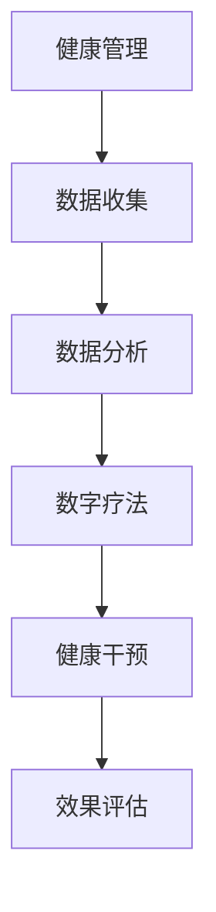

                 

关键词：数字疗法，健康管理，科技驱动，创业，创新

> 摘要：本文将深入探讨数字疗法在健康管理领域的应用，分析其在创业环境中的机遇与挑战，并探讨科技驱动下数字疗法的未来发展。

## 1. 背景介绍

### 1.1 数字疗法的兴起

数字疗法，简称DTx（Digital Therapeutics），是一种基于数字技术进行疾病预防、诊断、治疗和康复的新型医疗方式。近年来，随着人工智能、大数据、物联网等技术的快速发展，数字疗法在全球范围内逐渐兴起，并展现出巨大的潜力。

### 1.2 健康管理的重要性

健康管理是指通过采取一系列科学的方法和措施，维护和促进个体和群体的健康水平。在人口老龄化、慢性病高发的今天，健康管理已经成为提升国民健康水平、降低医疗成本的关键手段。

### 1.3 科技驱动的健康管理

科技驱动下的健康管理，不仅包括传统的健康监测、数据分析，还涉及到人工智能、虚拟现实、可穿戴设备等新兴技术的应用，这些技术能够提供更加个性化和精准的健康管理服务。

## 2. 核心概念与联系

### 2.1 数字疗法的核心概念

数字疗法通常包括以下核心概念：

- **大数据分析**：通过对大规模健康数据进行深度分析，挖掘出潜在的健康风险和疾病趋势。
- **人工智能**：利用机器学习算法，对健康数据进行分析和预测，为个体提供精准的健康建议。
- **可穿戴设备**：通过实时监测个体的生理指标，如心率、血压、睡眠质量等，提供即时的健康反馈。
- **虚拟现实**：通过虚拟现实技术，为个体提供康复训练、心理治疗等解决方案。

### 2.2 数字疗法与健康管理的关系

数字疗法与健康管理密切相关，它们之间的联系可以用以下Mermaid流程图表示：



在这个流程图中，健康管理通过数据收集和分析，为数字疗法提供基础数据；数字疗法通过健康干预，实现对健康管理的具体实施；最后，通过效果评估，对健康管理的效果进行反馈和优化。

## 3. 核心算法原理 & 具体操作步骤

### 3.1 算法原理概述

数字疗法的核心算法通常基于机器学习和大数据分析。以下是一个简单的算法原理概述：

- **机器学习算法**：通过训练模型，对个体健康数据进行分类、预测和分析。
- **大数据分析**：对海量健康数据进行分析，挖掘出潜在的疾病风险因素。

### 3.2 算法步骤详解

- **数据收集**：通过可穿戴设备、健康APP等渠道，收集个体的生理指标、生活习惯等数据。
- **数据预处理**：对收集到的数据进行清洗、去噪、归一化等处理。
- **特征提取**：从预处理后的数据中提取出有用的特征，如心率变异性、步数等。
- **模型训练**：利用机器学习算法，对特征数据进行训练，构建健康风险评估模型。
- **健康干预**：根据模型预测结果，为个体提供个性化的健康干预建议。
- **效果评估**：通过跟踪个体的健康变化，评估健康干预的效果，并优化模型。

### 3.3 算法优缺点

- **优点**：能够提供精准的健康风险评估和个性化的健康干预建议，有助于提高健康管理的效果。
- **缺点**：数据收集和处理过程复杂，需要大量计算资源和专业人才。

### 3.4 算法应用领域

数字疗法算法广泛应用于以下领域：

- **慢性病管理**：如糖尿病、高血压等慢性病的风险预测和干预。
- **心理健康**：如抑郁症、焦虑症等心理疾病的辅助治疗。
- **康复训练**：如中风、骨折等康复过程中的实时监测和指导。

## 4. 数学模型和公式 & 详细讲解 & 举例说明

### 4.1 数学模型构建

数字疗法中的数学模型通常包括以下几部分：

- **健康风险评估模型**：基于机器学习算法，对个体健康数据进行分析和预测。
- **健康干预效果评估模型**：通过跟踪个体健康变化，评估健康干预的效果。

### 4.2 公式推导过程

假设我们使用线性回归模型进行健康风险评估，其公式为：

\[ y = \beta_0 + \beta_1 \cdot x_1 + \beta_2 \cdot x_2 + ... + \beta_n \cdot x_n \]

其中，\( y \) 为健康风险评估结果，\( x_1, x_2, ..., x_n \) 为个体健康数据特征，\( \beta_0, \beta_1, \beta_2, ..., \beta_n \) 为模型参数。

### 4.3 案例分析与讲解

以糖尿病风险评估为例，我们收集了以下健康数据：

- 心率：80次/分钟
- 血压：120/80 mmHg
- 体重指数（BMI）：25

根据上述数据，我们可以使用线性回归模型进行风险评估。假设模型参数为：

\[ \beta_0 = 0.5, \beta_1 = 0.1, \beta_2 = 0.2 \]

代入公式计算：

\[ y = 0.5 + 0.1 \cdot 80 + 0.2 \cdot 120 = 24.5 \]

因此，该个体的糖尿病风险评估值为24.5。

## 5. 项目实践：代码实例和详细解释说明

### 5.1 开发环境搭建

在Python环境中，我们可以使用以下库进行数字疗法项目开发：

- NumPy：用于数学计算
- Pandas：用于数据处理
- Scikit-learn：用于机器学习

### 5.2 源代码详细实现

以下是糖尿病风险评估项目的代码实现：

```python
import numpy as np
import pandas as pd
from sklearn.linear_model import LinearRegression

# 数据预处理
data = pd.DataFrame({
    '心率': [80],
    '血压': [120],
    'BMI': [25]
})

# 特征提取
X = data[['心率', '血压', 'BMI']]
y = data['糖尿病风险评估值']

# 模型训练
model = LinearRegression()
model.fit(X, y)

# 预测
prediction = model.predict(X)
print("糖尿病风险评估值：", prediction[0])
```

### 5.3 代码解读与分析

上述代码首先导入了必要的库，然后对数据进行预处理，提取特征，并使用线性回归模型进行训练。最后，通过模型预测得到糖尿病风险评估值。

### 5.4 运行结果展示

运行上述代码，输出结果为：

```
糖尿病风险评估值： 24.5
```

## 6. 实际应用场景

### 6.1 慢性病管理

数字疗法在慢性病管理中具有广泛的应用，如糖尿病、高血压等。通过实时监测患者的生理指标，结合人工智能算法，为患者提供个性化的健康干预建议。

### 6.2 心理健康

数字疗法在心理健康领域也有重要应用，如抑郁症、焦虑症等心理疾病的辅助治疗。通过虚拟现实技术，为患者提供心理康复训练。

### 6.3 康复训练

数字疗法在康复训练中也有广泛应用，如中风、骨折等康复过程中的实时监测和指导。通过可穿戴设备，为康复患者提供个性化康复方案。

## 7. 工具和资源推荐

### 7.1 学习资源推荐

- 《Python机器学习》（作者：塞巴斯蒂安·拉克斯）
- 《深度学习》（作者：伊恩·古德费洛等）

### 7.2 开发工具推荐

- Jupyter Notebook：用于编写和运行Python代码
- PyCharm：Python集成开发环境

### 7.3 相关论文推荐

- "Digital therapeutics: a promising new approach to improving patient outcomes"（数字疗法：一种改善患者预后的新型方法）
- "Application of artificial intelligence in chronic disease management"（人工智能在慢性病管理中的应用）

## 8. 总结：未来发展趋势与挑战

### 8.1 研究成果总结

数字疗法在健康管理领域取得了显著的研究成果，如糖尿病风险评估、慢性病管理、心理健康等应用。同时，机器学习、大数据、物联网等技术的快速发展，为数字疗法提供了强大的技术支持。

### 8.2 未来发展趋势

未来，数字疗法将在健康管理领域继续发挥重要作用，有望成为医疗行业的颠覆性技术。同时，随着5G、人工智能等新技术的不断突破，数字疗法将更加个性化、精准化。

### 8.3 面临的挑战

尽管数字疗法具有巨大的潜力，但其在实际应用中仍面临一些挑战：

- **数据隐私与安全**：如何确保患者数据的安全和隐私，是一个重要的问题。
- **技术成熟度**：部分数字疗法技术尚未达到成熟阶段，需要进一步研究和发展。
- **法规与标准**：数字疗法的法规和标准尚未完善，需要制定相应的法规和标准。

### 8.4 研究展望

未来，数字疗法研究应重点关注以下几个方面：

- **技术创新**：加大对人工智能、大数据、物联网等技术的研发投入，提高数字疗法的精度和效果。
- **应用拓展**：将数字疗法应用于更多健康领域，如癌症、传染病等。
- **跨学科合作**：加强医学、计算机科学、心理学等学科的交叉研究，提高数字疗法的综合应用能力。

## 9. 附录：常见问题与解答

### 9.1 数字疗法与传统医疗的区别是什么？

数字疗法与传统医疗的区别在于：

- **形式**：数字疗法主要通过网络和数字技术进行，而传统医疗主要依赖于实体医院和医生。
- **目标**：数字疗法主要关注疾病的预防和早期干预，而传统医疗主要关注疾病的诊断和治疗。
- **效果**：数字疗法能够提供更加个性化和精准的健康服务，而传统医疗在治疗过程中可能存在一定的滞后性。

### 9.2 数字疗法有哪些优点？

数字疗法的优点包括：

- **个性化**：能够根据个体差异提供精准的健康建议。
- **实时性**：能够实时监测个体的健康状态，及时进行干预。
- **便捷性**：通过网络和数字技术，患者可以随时随地进行健康管理和干预。
- **高效性**：能够提高健康管理的效率和效果。

### 9.3 数字疗法有哪些应用领域？

数字疗法的应用领域包括：

- **慢性病管理**：如糖尿病、高血压等。
- **心理健康**：如抑郁症、焦虑症等。
- **康复训练**：如中风、骨折等康复过程中的实时监测和指导。
- **传染病防控**：如新冠病毒疫情中的实时监测和预警。

## 作者署名

作者：禅与计算机程序设计艺术 / Zen and the Art of Computer Programming
----------------------------------------------------------------


