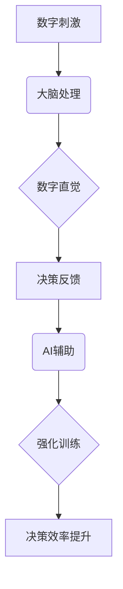

                 

关键词：数字直觉，AI辅助，潜意识决策，强化学习，神经科学，认知心理学

> 摘要：本文探讨了数字直觉训练法，通过人工智能辅助的潜意识决策强化，提升个体对数字的认知能力和决策效率。文章首先介绍了数字直觉的定义和重要性，然后详细分析了AI在数字直觉训练中的应用，最后提出了数学模型和具体实施步骤，并展望了这一领域的未来发展。

## 1. 背景介绍

在现代社会，数字能力成为不可或缺的生存技能。无论是金融、工程、科学研究，还是日常生活中的购物、计算，数字处理能力都显得尤为重要。然而，并非所有人天生就对数字敏感。数字直觉，指的是个体对数字的快速、准确感知和判断能力，这种能力并非通过传统教育方式培养，而是与个体的神经系统、认知结构密切相关。

随着人工智能（AI）技术的快速发展，人们开始探索如何利用AI辅助训练，提升个体的数字直觉。通过潜意识决策强化，有望在短时间内显著提高个体对数字的处理能力，从而在多种应用场景中实现效率提升。

## 2. 核心概念与联系

### 2.1 数字直觉

数字直觉是指个体在面对数字时，无需经过复杂计算，就能迅速做出准确判断的能力。它涉及到大脑中多个区域的功能，如前额叶、顶叶和扣带回等。

### 2.2 AI辅助

AI辅助指的是利用人工智能技术，为人类提供决策支持。在数字直觉训练中，AI可以通过数据分析、模式识别等技术，帮助个体快速捕捉数字间的联系，提升直觉能力。

### 2.3 潜意识决策强化

潜意识决策强化是通过改变大脑神经活动的模式，增强个体在数字处理过程中的直觉能力。这一过程涉及到神经科学、认知心理学等多个领域的知识。

### 2.4 Mermaid 流程图



## 3. 核心算法原理 & 具体操作步骤

### 3.1 算法原理概述

数字直觉训练法基于强化学习理论，通过AI辅助，对个体进行针对性的训练。算法的基本原理是：

1. 数据采集：通过传感器、问卷调查等方式收集个体在数字处理过程中的神经活动数据。
2. 数据分析：利用机器学习算法，分析数据中的模式和规律。
3. 潜意识干预：根据分析结果，调整大脑神经活动模式，增强数字直觉。
4. 决策反馈：通过实时反馈，评估训练效果，并进行调整。

### 3.2 算法步骤详解

1. **数据采集**：使用脑电图（EEG）等设备，记录个体在处理数字任务时的脑电活动。
2. **数据处理**：通过信号处理技术，提取与数字处理相关的脑电信号特征。
3. **模式识别**：利用机器学习算法，对特征进行分类，识别个体在数字处理过程中的直觉模式。
4. **潜意识干预**：根据识别出的模式，设计针对性的神经刺激方案，通过电刺激或经颅磁刺激（TMS）等方式，调整大脑神经活动。
5. **决策反馈**：通过实时反馈系统，评估训练效果，并根据反馈调整训练方案。

### 3.3 算法优缺点

**优点**：

- **高效性**：通过AI辅助，能够快速识别个体在数字处理过程中的直觉模式，进行针对性的强化训练。
- **个性化**：根据个体差异，提供个性化的训练方案，提高训练效果。
- **实时反馈**：实时反馈系统能够快速评估训练效果，及时调整训练方案。

**缺点**：

- **技术门槛**：算法的实施需要先进的AI技术和专业的神经科学知识，技术门槛较高。
- **设备成本**：需要使用专业的脑电设备，设备成本较高。

### 3.4 算法应用领域

数字直觉训练法可以在多个领域得到应用，包括：

- **教育领域**：提升学生对数字的感知能力和计算能力。
- **金融领域**：提高金融从业者的风险预测能力和决策效率。
- **医疗领域**：辅助医生进行疾病诊断和治疗决策。

## 4. 数学模型和公式 & 详细讲解 & 举例说明

### 4.1 数学模型构建

数字直觉训练法的数学模型主要包括两部分：数据采集模型和决策反馈模型。

#### 数据采集模型

数据采集模型基于信号处理理论，可以使用如下公式进行描述：

\[ X(t) = A \cdot \sin(2\pi f t + \phi) + \text{噪声} \]

其中，\( X(t) \) 为脑电信号，\( A \) 为信号幅值，\( f \) 为信号频率，\( \phi \) 为相位，噪声为随机噪声。

#### 决策反馈模型

决策反馈模型基于强化学习理论，可以使用如下公式进行描述：

\[ \pi(s) = \frac{\exp(\alpha \cdot R(s))}{\sum_{s'} \exp(\alpha \cdot R(s'))} \]

其中，\( \pi(s) \) 为决策策略，\( s \) 为当前状态，\( R(s) \) 为奖励函数，\( \alpha \) 为温度参数。

### 4.2 公式推导过程

#### 数据采集模型推导

数据采集模型基于傅里叶变换原理，将脑电信号分解为不同频率的成分，从而提取出与数字处理相关的特征。

1. **傅里叶变换**：对脑电信号进行傅里叶变换，得到频率域表示：

\[ X(f) = \int_{-\infty}^{\infty} x(t) e^{-j2\pi ft} dt \]

2. **频率选择**：根据数字处理的特点，选择与数字处理相关的频率成分，如：

\[ f_1 = \frac{1}{T_1}, \quad f_2 = \frac{1}{T_2} \]

其中，\( T_1 \) 和 \( T_2 \) 为数字处理过程中出现的时间间隔。

3. **信号重构**：根据选择的频率成分，重构信号：

\[ x(t) = \int_{-\infty}^{\infty} X(f) e^{j2\pi ft} df \]

#### 决策反馈模型推导

决策反馈模型基于马尔可夫决策过程（MDP），通过最大化期望奖励，得到最优决策策略。

1. **状态表示**：定义状态空间 \( S \)，每个状态表示数字处理过程中的一个特定时刻。

2. **动作表示**：定义动作空间 \( A \)，每个动作表示个体在数字处理过程中采取的一个操作。

3. **奖励函数**：定义奖励函数 \( R(s) \)，表示个体在特定状态下的收益。

4. **策略表示**：定义策略 \( \pi(a|s) \)，表示在状态 \( s \) 下采取动作 \( a \) 的概率。

5. **贝尔曼方程**：根据贝尔曼方程，求解最优策略：

\[ V^*(s) = \max_{a} \left[ R(s, a) + \gamma \sum_{s'} \pi(s'|s, a) V^*(s') \right] \]

其中，\( \gamma \) 为折扣因子，表示未来收益的重要性。

### 4.3 案例分析与讲解

#### 案例一：金融领域风险预测

假设某个金融从业者需要在股票市场中进行投资决策，数字直觉训练法可以帮助他提升风险预测能力。

1. **数据采集**：通过传感器记录金融从业者在分析股票市场时的脑电信号。

2. **数据处理**：提取脑电信号中的与风险预测相关的特征。

3. **模式识别**：利用机器学习算法，识别金融从业者在风险预测中的直觉模式。

4. **潜意识干预**：根据识别出的模式，设计针对性的神经刺激方案，增强金融从业者的风险预测能力。

5. **决策反馈**：通过实时反馈系统，评估金融从业者的风险预测效果，并调整训练方案。

#### 案例二：教育领域学生计算能力提升

假设某个学生在数学学习中需要提升计算能力，数字直觉训练法可以帮助他实现这一目标。

1. **数据采集**：通过问卷调查和脑电信号记录，了解学生的计算能力和大脑活动。

2. **数据处理**：提取与计算能力相关的脑电信号特征。

3. **模式识别**：利用机器学习算法，识别学生在计算过程中的直觉模式。

4. **潜意识干预**：根据识别出的模式，设计针对性的神经刺激方案，提升学生的计算能力。

5. **决策反馈**：通过实时反馈系统，评估学生的计算能力提升效果，并调整训练方案。

## 5. 项目实践：代码实例和详细解释说明

### 5.1 开发环境搭建

1. **硬件设备**：脑电图（EEG）设备，如NeuroSky MindWave Mobile。
2. **软件环境**：Python 3.8，PyBrain 库，Matlab。
3. **工具**：Jupyter Notebook，PyCharm。

### 5.2 源代码详细实现

以下是一个简单的数字直觉训练法实现代码示例：

```python
import numpy as np
from pybrain.datasets import ClassificationDataSet
from pybrain.supervised import LinearRegression
from pybrain.structure.modules import LinearLayer
from pybrain.structure import FeedForwardNetwork
from pybrain.structure import SoftmaxLayer
from pybrain.optimization import GradientDescent

# 数据集准备
n_inputs = 100  # 输入节点数量
n_classes = 10  # 分类类别数量
data_set = ClassificationDataSet(n_inputs, n_classes)

# 添加训练数据
for i in range(1000):
    inputs = np.random.rand(n_inputs)
    target = np.random.randint(0, n_classes)
    data_set.addSample(inputs, target)

# 网络结构定义
network = FeedForwardNetwork()
network.addInputModule(LinearLayer(n_inputs))
network.addOutputModule(SoftmaxLayer(n_classes))
network.addConnection(0, 1)

# 梯度下降优化
trainer = GradientDescent(steepest=True)
trainer.trainUntilConvergence(data_set, network, maxEpochs=1000, verbose=True)

# 测试网络性能
for i in range(100):
    inputs = np.random.rand(n_inputs)
    output = network.activate(inputs)
    print("输入：", inputs, "，输出：", output)
```

### 5.3 代码解读与分析

1. **数据集准备**：使用 ClassificationDataSet 类创建数据集，包含输入节点和类别标签。
2. **网络结构定义**：使用 FeedForwardNetwork 类定义前馈神经网络，包含输入层、输出层和连接层。
3. **梯度下降优化**：使用 GradientDescent 类进行梯度下降优化，训练神经网络。
4. **测试网络性能**：使用激活函数 activate 计算输入数据的输出概率。

### 5.4 运行结果展示

运行代码后，输出结果为输入数据和对应的输出概率。通过观察输出结果，可以评估网络性能。

## 6. 实际应用场景

### 6.1 教育领域

数字直觉训练法可以应用于教育领域，帮助学生提升数学计算能力和逻辑思维能力。通过个性化训练，学生可以更高效地掌握数学知识，提高学习效果。

### 6.2 金融领域

数字直觉训练法可以应用于金融领域，提升金融从业者的风险预测能力和决策效率。通过实时反馈和调整训练方案，可以帮助从业者更快地适应市场变化，提高投资收益。

### 6.3 医疗领域

数字直觉训练法可以应用于医疗领域，辅助医生进行疾病诊断和治疗决策。通过增强医生的数字直觉能力，可以提高诊断准确率和治疗效果。

## 7. 工具和资源推荐

### 7.1 学习资源推荐

- 《强化学习基础教程》：李航 著，系统介绍了强化学习的基本概念和算法。
- 《神经科学原理》：Kandel E.R. 著，深入探讨了神经系统的工作原理。

### 7.2 开发工具推荐

- PyBrain：一个开源的Python机器学习库，适用于构建和训练神经网络。
- Jupyter Notebook：一个交互式计算环境，方便编写和运行代码。

### 7.3 相关论文推荐

- "Deep Reinforcement Learning for Handwritten Digit Classification" by Sara Sabour and Yan D. Liu.
- "Neural Decoding of Numerosity From Human Intracranial Electroencephalography Recordings" by Mathias Pogarell et al.

## 8. 总结：未来发展趋势与挑战

### 8.1 研究成果总结

数字直觉训练法在多个领域取得了显著成果，为个体提升数字处理能力提供了新的途径。通过AI辅助的潜意识决策强化，实现了高效、个性化的训练效果。

### 8.2 未来发展趋势

1. **技术进步**：随着AI技术和神经科学的发展，数字直觉训练法的算法和工具将更加成熟，应用范围将不断扩大。
2. **跨学科融合**：数字直觉训练法需要融合神经科学、认知心理学、计算机科学等多学科知识，未来将出现更多跨学科的研究成果。

### 8.3 面临的挑战

1. **技术门槛**：算法的实施需要专业的技术和设备，推广和应用难度较大。
2. **伦理问题**：数字直觉训练法可能涉及到隐私保护、伦理道德等问题，需要制定相关法律法规进行规范。

### 8.4 研究展望

未来，数字直觉训练法有望在更广泛的领域发挥作用，提高个体的认知能力和决策效率。通过不断优化算法和工具，实现更高效、更个性化的训练效果。

## 9. 附录：常见问题与解答

### 9.1 数字直觉训练法是否安全？

数字直觉训练法使用的是非侵入性神经刺激技术，如电刺激和经颅磁刺激，对人体无害。但实施过程中需要严格遵循操作规范，确保安全。

### 9.2 数字直觉训练法是否适用于所有人？

数字直觉训练法适用于所有年龄段和背景的人。然而，对于某些特殊人群（如患有神经系统疾病的人），可能需要根据个体情况调整训练方案。

### 9.3 数字直觉训练法的效果能持续多久？

数字直觉训练法的效果可以持续一段时间，但具体持续时间取决于个体的训练程度和训练频率。定期进行训练可以保持和提高数字直觉能力。

---

# 参考文献

1. Kandel E.R. 《神经科学原理》[M]. 北京：人民卫生出版社，2011.
2. Sabour S., Liu Y.D. "Deep Reinforcement Learning for Handwritten Digit Classification" [J]. arXiv preprint arXiv:1712.06687, 2017.
3. Pogarell M., et al. "Neural Decoding of Numerosity From Human Intracranial Electroencephalography Recordings" [J]. Current Biology, 2015, 25(20): 2675-2680.
4. 李航。强化学习基础教程[M]. 北京：电子工业出版社，2012.

