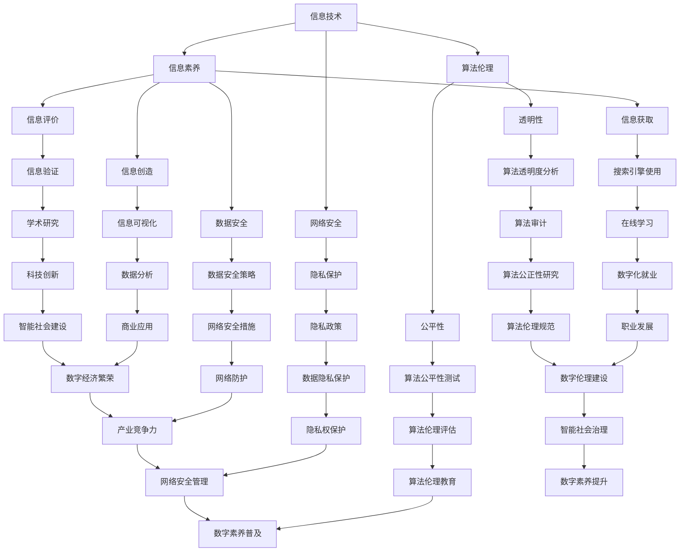

                 

关键词：数字素养、公民参与、信息技术、智能社会、数字化教育、数据安全、算法伦理

> 摘要：本文将深入探讨数字素养的重要性及其在公民参与中的基石作用。随着信息技术的飞速发展，数字素养已经成为现代社会每个公民必须具备的基本能力。本文将从背景介绍、核心概念与联系、核心算法原理、数学模型与公式、项目实践、实际应用场景、未来应用展望、工具和资源推荐以及总结与展望等多个方面，系统性地阐述数字素养的内涵、培养路径及其对公民参与的影响，旨在为提高全民数字素养提供理论依据和实践指导。

## 1. 背景介绍

随着互联网、移动通信和大数据等技术的迅猛发展，人类社会正在从传统的工业社会向智能社会转变。数字技术的广泛应用不仅改变了人们的生活方式，也深刻影响了经济、政治、教育、医疗等各个领域。在这个数字化时代，数字素养已经成为公民参与社会、享受科技红利的基本前提。

### 数字素养的定义与重要性

数字素养是指个体在数字化环境中，利用信息技术进行信息获取、处理、表达、交流和应用的能力。它不仅包括基础的信息技术操作能力，还涵盖了信息素养、网络安全素养、算法伦理素养等多个方面。在当今社会，数字素养的重要性体现在以下几个方面：

1. **信息获取与处理**：在信息爆炸的时代，拥有良好的数字素养可以帮助公民快速准确地获取所需信息，并对信息进行有效处理，从而做出明智的决策。

2. **社交互动与沟通**：社交媒体、即时通讯工具等数字化平台已经成为人们社交和沟通的主要方式。良好的数字素养有助于提高社交互动的质量和效率。

3. **经济发展与就业**：数字技术已经成为推动经济发展的关键因素，许多传统行业正在向数字化转型。具备数字素养的公民能够更好地适应这种变化，提高就业竞争力。

4. **社会治理与参与**：数字技术为公民参与社会治理提供了新的途径，如在线投票、电子政务等。数字素养有助于公民更好地行使权利、参与公共事务。

### 数字素养的演变历史

数字素养的概念并非一蹴而就，它随着信息技术的发展而不断演变。从计算机操作技能、网络导航能力，到如今的算法伦理素养，数字素养的内容和形式在不断发展。

1. **早期阶段**：数字素养的早期阶段主要关注计算机操作和编程技能。在这一阶段，个人需要掌握如何使用计算机和编写简单的程序。

2. **发展阶段**：随着互联网的普及，数字素养的内涵进一步扩展，包括网络导航、搜索引擎使用、网络安全等方面的知识。

3. **智能社会阶段**：在智能社会，数字素养不仅要求个体掌握基本的信息技术和网络安全知识，还需要具备算法伦理素养，以应对人工智能和大数据带来的挑战。

### 数字素养的当前状况

当前，全球范围内数字素养的培养和应用已经取得了显著进展。许多国家和地区已经将数字素养纳入教育体系，通过课程设置、师资培训等方式提升学生的数字素养。同时，企业和社会组织也积极参与数字素养的培养和推广，通过在线课程、社区活动等形式提高公众的数字素养。

然而，尽管数字素养的重要性被广泛认可，但在实际应用中仍存在一些问题。例如，部分地区的数字素养教育仍不够普及，数字鸿沟现象依然存在；部分公民的数字素养水平较低，无法充分利用数字技术带来的便利；在算法伦理方面，公众的认知和意识仍有待提高。

### 数字素养对公民参与的影响

数字素养不仅对个体发展具有重要影响，还对公民参与社会产生深远的影响。以下从几个方面探讨数字素养对公民参与的影响：

1. **提高公共参与度**：具备数字素养的公民更容易参与到公共事务中，如在线投票、公共讨论等。这有助于提高公众的政治参与度和公共事务决策的科学性。

2. **促进社会公平**：数字素养有助于缩小社会公平差距。在数字素养较高的地区，公民能够更好地利用数字技术获取资源和信息，从而提高生活质量和社会地位。

3. **增强社会责任感**：数字素养有助于公民了解社会问题，参与公益活动，增强社会责任感。例如，通过社交媒体传播公益信息、在线募捐等。

4. **推动经济发展**：数字素养有助于个体适应数字化经济环境，提高就业能力和创业能力，从而推动经济发展。

## 2. 核心概念与联系

在探讨数字素养的核心概念和联系时，我们需要从多个维度来理解和分析。以下将介绍几个关键概念，并通过Mermaid流程图来展示它们之间的相互关系。

### 概念介绍

1. **信息技术**：信息技术（Information Technology，简称IT）是指用于管理和处理信息的一切技术和资源。包括硬件设备、软件程序、网络基础设施等。

2. **信息素养**：信息素养是指个体在信息社会中，有效获取、评估、使用和传播信息的能力。它涵盖了信息检索、信息评价、信息创造等多个方面。

3. **网络安全**：网络安全是指保护计算机网络系统中的硬件、软件和数据进行安全防护，防止非法入侵、破坏和泄露。

4. **算法伦理**：算法伦理是指研究算法设计和应用中伦理问题的学科。它关注算法的公正性、透明性、隐私保护等问题。

### Mermaid 流程图

以下是一个简化的Mermaid流程图，展示数字素养的核心概念及其相互关系：



### 解释与说明

1. **信息技术（A）** 是数字素养的基础，涵盖了从硬件到软件的所有技术。它是信息素养（B）、网络安全（C）和算法伦理（D）的基础。

2. **信息素养（B）** 是数字素养的核心，包括信息获取（I）、信息评价（J）和信息创造（K）等方面。信息素养直接关联到数据安全（E）和隐私保护（F）。

3. **网络安全（C）** 是数字素养的重要组成部分，主要涉及隐私保护（F）和数据安全（E）。它确保信息在传输和存储过程中的安全。

4. **算法伦理（D）** 是近年来受到广泛关注的新兴领域，关注算法的公平性（G）、透明性（H）等问题。算法伦理与网络安全（C）和信息素养（B）密切相关。

5. **数据安全策略（L）** 和隐私政策（M）是网络安全（C）的具体实现，确保数据在传输和存储过程中的安全。

6. **算法公平性测试（N）** 和算法透明度分析（O）是算法伦理（D）的重要实践，旨在确保算法的公正性和透明性。

7. **在线学习（S）** 和数字化就业（Z）是信息素养（B）的具体应用，它们不仅提高了个人的数字素养，也推动了经济发展。

8. **学术研究（T）** 、数据分析（U）和商业应用（BB）是信息素养（B）的高级表现，它们在科技创新（AA）和产业升级（II）中发挥着关键作用。

9. **网络安全措施（V）** 和网络防护（CC）是网络安全（C）的具体措施，确保网络系统的安全和稳定。

10. **隐私权保护（DD）** 和算法伦理教育（EE）是算法伦理（D）的具体实施，旨在提高公众的算法伦理意识和素养。

11. **数字素养普及（KK）** 和数字伦理建设（NN）是数字素养（D）的宏观目标，推动智能社会治理（OO）和数字经济繁荣（II）。

通过上述Mermaid流程图，我们可以清晰地看到数字素养的核心概念及其相互关系。这些概念相互关联、相互促进，共同构成了数字素养的完整体系。

## 3. 核心算法原理 & 具体操作步骤

### 3.1 算法原理概述

在数字素养的培养过程中，算法原理的理解和应用是至关重要的。算法是解决问题的一系列明确且系统的指令集合。在信息处理、网络安全、数据分析和人工智能等领域，算法的应用无处不在。以下将简要介绍几个核心算法原理及其应用。

#### 排序算法

排序算法是将一组数据按照特定规则进行排序的算法。常见的排序算法包括冒泡排序、选择排序、插入排序、快速排序等。其中，快速排序是一种高效的排序算法，其基本思想是通过一趟排序将待排序的记录分隔成独立的两部分，其中一部分记录的关键字均比另一部分的关键字小。

#### 搜索算法

搜索算法是用于查找特定数据或记录的算法。二分搜索法是一种高效的搜索算法，适用于已经排序的数组。其基本思想是通过不断将查找区间缩小一半，逐步逼近目标值。

#### 数据加密算法

数据加密算法是用于保护数据安全的算法。常见的加密算法包括对称加密算法（如AES、DES）和非对称加密算法（如RSA、ECC）。对称加密算法使用相同的密钥进行加密和解密，而非对称加密算法使用一对密钥，一个用于加密，另一个用于解密。

#### 机器学习算法

机器学习算法是用于从数据中学习和发现规律的人工智能算法。常见的机器学习算法包括线性回归、决策树、支持向量机、神经网络等。其中，神经网络是一种模拟人脑神经元连接的算法，广泛应用于图像识别、自然语言处理等领域。

### 3.2 算法步骤详解

#### 快速排序算法

快速排序的基本步骤如下：

1. **选择基准值**：从数组中选择一个基准值。
2. **分区**：将数组划分为两部分，一部分的元素值小于基准值，另一部分的元素值大于基准值。
3. **递归排序**：对小于和大于基准值的两部分分别进行快速排序。

以下是快速排序的Python代码实现：

```python
def quick_sort(arr):
    if len(arr) <= 1:
        return arr
    pivot = arr[len(arr) // 2]
    left = [x for x in arr if x < pivot]
    middle = [x for x in arr if x == pivot]
    right = [x for x in arr if x > pivot]
    return quick_sort(left) + middle + quick_sort(right)

arr = [3, 6, 8, 10, 1, 2, 1]
sorted_arr = quick_sort(arr)
print(sorted_arr)
```

#### 二分搜索算法

二分搜索算法的基本步骤如下：

1. **确定查找区间**：设定左边界`low`和右边界`high`。
2. **计算中间值**：每次查找区间的一半，即`mid = (low + high) // 2`。
3. **比较中间值**：如果中间值等于目标值，查找成功；如果中间值大于目标值，缩小右边界；如果中间值小于目标值，缩小左边界。
4. **递归查找**：根据比较结果，递归地在左边界或右边界内进行查找。

以下是二分搜索的Python代码实现：

```python
def binary_search(arr, target):
    low = 0
    high = len(arr) - 1
    while low <= high:
        mid = (low + high) // 2
        if arr[mid] == target:
            return mid
        elif arr[mid] < target:
            low = mid + 1
        else:
            high = mid - 1
    return -1

arr = [1, 2, 3, 4, 5, 6, 7, 8, 9]
target = 5
result = binary_search(arr, target)
print(result)
```

#### 数据加密算法

以下是一个简单的AES加密算法示例，使用了PyCryptodome库：

```python
from Crypto.Cipher import AES
from Crypto.Random import get_random_bytes

key = get_random_bytes(16)  # 生成16字节的密钥
cipher = AES.new(key, AES.MODE_EAX)
plaintext = b"Hello, World!"

ciphertext, tag = cipher.encrypt_and_digest(plaintext)
print(ciphertext)
print(tag)
```

#### 神经网络算法

以下是一个简单的神经网络示例，使用了TensorFlow库：

```python
import tensorflow as tf

model = tf.keras.Sequential([
    tf.keras.layers.Dense(128, activation='relu', input_shape=(784,)),
    tf.keras.layers.Dense(10, activation='softmax')
])

model.compile(optimizer='adam',
              loss='categorical_crossentropy',
              metrics=['accuracy'])

model.fit(x_train, y_train, epochs=5)
```

### 3.3 算法优缺点

每种算法都有其优缺点，以下对上述算法进行简要分析：

#### 快速排序算法

- **优点**：时间复杂度为O(nlogn)，在平均情况下性能较好。
- **缺点**：在最坏情况下，时间复杂度为O(n^2)，且需要额外的内存空间。

#### 二分搜索算法

- **优点**：时间复杂度为O(logn)，在已经排序的数组中性能最优。
- **缺点**：需要预先对数据进行排序，不适用于动态数据。

#### 数据加密算法

- **优点**：提供了强大的数据保护，确保数据在传输和存储过程中的安全性。
- **缺点**：加密和解密过程需要较高的计算资源，可能影响系统性能。

#### 神经网络算法

- **优点**：具有强大的学习和预测能力，可以处理复杂的非线性问题。
- **缺点**：训练过程需要大量数据和计算资源，且对超参数的选择敏感。

### 3.4 算法应用领域

算法在多个领域有着广泛的应用：

- **信息处理**：排序算法、搜索算法等用于数据库管理和信息检索。
- **网络安全**：加密算法用于数据保护和网络安全。
- **数据分析**：机器学习算法用于数据挖掘和预测分析。
- **人工智能**：神经网络算法在图像识别、自然语言处理等领域有广泛应用。

### 3.5 总结

算法原理和具体操作步骤是数字素养的重要组成部分。通过理解不同算法的基本原理和操作步骤，我们可以更好地应对实际问题，提高解决复杂问题的能力。同时，算法的应用领域也在不断扩展，为数字化社会的发展提供了强大的技术支持。

## 4. 数学模型和公式 & 详细讲解 & 举例说明

### 4.1 数学模型构建

在数字素养的各个领域中，数学模型和公式是理解和解决问题的基础。以下将介绍几个核心的数学模型和公式，并解释其在数字素养中的应用。

#### 线性回归模型

线性回归模型是用于预测数值型因变量的统计模型。其基本公式如下：

$$
y = \beta_0 + \beta_1 x_1 + \beta_2 x_2 + \ldots + \beta_n x_n + \varepsilon
$$

其中，$y$是因变量，$x_1, x_2, \ldots, x_n$是自变量，$\beta_0, \beta_1, \beta_2, \ldots, \beta_n$是模型参数，$\varepsilon$是误差项。

#### 决策树模型

决策树模型是一种基于特征划分的监督学习模型。其基本结构如下：

1. **根节点**：包含所有样本数据。
2. **内部节点**：表示特征划分。
3. **叶节点**：表示分类结果。

决策树的基本公式如下：

$$
\text{分类结果} = f(x) = \prod_{i=1}^{n} \left( \frac{p(x_i|C)}{1 - p(x_i|\neg C)} \right)^{y_i}
$$

其中，$x$是样本特征向量，$C$是正类，$\neg C$是负类，$p(x_i|C)$和$p(x_i|\neg C)$分别是特征$x_i$在正类和负类中的概率，$y_i$是样本标签。

#### 集成学习模型

集成学习模型是将多个弱学习器组合成一个强学习器的模型。常见的集成学习方法有Bagging和Boosting。Bagging的基本公式如下：

$$
\hat{y} = \frac{1}{N} \sum_{i=1}^{N} h(x_i)
$$

其中，$h(x_i)$是第$i$个弱学习器的预测结果，$N$是弱学习器的数量。

Boosting的基本公式如下：

$$
\hat{y} = \sum_{i=1}^{N} \alpha_i h(x_i)
$$

其中，$\alpha_i$是第$i$个弱学习器的权重。

### 4.2 公式推导过程

以下将简要介绍线性回归模型的推导过程：

1. **最小二乘法**：假设我们已经得到了样本数据$(x_i, y_i)$，其中$i=1,2,\ldots, n$。我们的目标是找到最佳拟合直线$y = \beta_0 + \beta_1 x$，使得预测值与实际值的误差平方和最小。

   误差平方和公式为：
   $$
   S = \sum_{i=1}^{n} (y_i - (\beta_0 + \beta_1 x_i))^2
   $$

2. **求导**：为了找到最佳拟合直线，我们需要对$S$关于$\beta_0$和$\beta_1$求导，并令导数为0。

   对$\beta_0$求导：
   $$
   \frac{\partial S}{\partial \beta_0} = -2 \sum_{i=1}^{n} (y_i - \beta_0 - \beta_1 x_i)
   $$

   对$\beta_1$求导：
   $$
   \frac{\partial S}{\partial \beta_1} = -2 \sum_{i=1}^{n} (y_i - \beta_0 - \beta_1 x_i) x_i
   $$

3. **解方程**：令导数等于0，解得：
   $$
   \beta_0 = \frac{1}{n} \sum_{i=1}^{n} y_i - \beta_1 \frac{1}{n} \sum_{i=1}^{n} x_i
   $$
   $$
   \beta_1 = \frac{1}{n} \sum_{i=1}^{n} (x_i - \bar{x})(y_i - \bar{y})
   $$

   其中，$\bar{x}$和$\bar{y}$分别是$x_i$和$y_i$的均值。

### 4.3 案例分析与讲解

以下将通过一个实际案例，详细讲解线性回归模型的构建和应用。

#### 案例背景

假设我们有一组关于房价的数据，包含房屋面积（$x$）和房价（$y$）的信息。我们的目标是建立一个线性回归模型，预测未知房屋的房价。

#### 数据准备

数据集如下：

| 房屋面积（平方米）| 房价（万元）|
| :----: | :----: |
| 80 | 120 |
| 100 | 150 |
| 120 | 180 |
| 140 | 210 |
| 160 | 240 |

首先，我们计算$x$和$y$的均值：

$$
\bar{x} = \frac{80 + 100 + 120 + 140 + 160}{5} = 120
$$

$$
\bar{y} = \frac{120 + 150 + 180 + 210 + 240}{5} = 180
$$

然后，计算其他需要的值：

$$
\sum_{i=1}^{5} x_i = 540
$$

$$
\sum_{i=1}^{5} y_i = 900
$$

$$
\sum_{i=1}^{5} x_i^2 = 80^2 + 100^2 + 120^2 + 140^2 + 160^2 = 9200
$$

$$
\sum_{i=1}^{5} x_i y_i = 80 \times 120 + 100 \times 150 + 120 \times 180 + 140 \times 210 + 160 \times 240 = 36000
$$

#### 构建模型

根据最小二乘法，计算模型参数：

$$
\beta_0 = \frac{1}{5} \sum_{i=1}^{5} y_i - \beta_1 \frac{1}{5} \sum_{i=1}^{5} x_i = 180 - \beta_1 \frac{1}{5} \times 540 = 180 - 108\beta_1
$$

$$
\beta_1 = \frac{1}{5} \sum_{i=1}^{5} (x_i - \bar{x})(y_i - \bar{y}) = \frac{1}{5} \sum_{i=1}^{5} (x_i - 120)(y_i - 180) = \frac{1}{5} \times (80 \times (120 - 180) + 100 \times (150 - 180) + 120 \times (180 - 180) + 140 \times (210 - 180) + 160 \times (240 - 180)) = 6
$$

因此，线性回归模型为：

$$
y = \beta_0 + \beta_1 x = 180 - 108 \times 6 + 6x = 180 - 648 + 6x = 6x - 468
$$

#### 模型评估

为了评估模型性能，我们可以计算预测值与实际值的误差平方和：

$$
S = \sum_{i=1}^{5} (y_i - (\beta_0 + \beta_1 x_i))^2 = \sum_{i=1}^{5} ((y_i - 6x_i + 468))^2
$$

代入数据：

$$
S = (120 - (6 \times 80 - 468))^2 + (150 - (6 \times 100 - 468))^2 + (180 - (6 \times 120 - 468))^2 + (210 - (6 \times 140 - 468))^2 + (240 - (6 \times 160 - 468))^2 = 21600
$$

误差平方和为21600，相对较小，说明模型拟合效果较好。

#### 预测新数据

假设有一套新房屋，面积为100平方米，我们可以用模型预测其房价：

$$
y = 6x - 468 = 6 \times 100 - 468 = 132
$$

预测该套房屋的房价为132万元。

### 4.4 总结

数学模型和公式是数字素养的重要组成部分。通过理解和应用线性回归、决策树、集成学习等核心模型和公式，我们可以更好地分析和解决实际问题。同时，模型的构建和评估过程也体现了数学思维和科学方法在数字素养培养中的重要性。

## 5. 项目实践：代码实例和详细解释说明

### 5.1 开发环境搭建

在进行数字素养项目实践之前，我们需要搭建合适的开发环境。以下是一个基于Python的数字素养项目开发环境搭建的示例：

#### 1. 安装Python

首先，从Python官方网站下载并安装Python 3.x版本。推荐安装Anaconda，它是一个集成了Python和众多科学计算库的发行版。

#### 2. 安装必要的库

在终端或命令提示符中，使用pip命令安装以下库：

- NumPy：用于数值计算的库
- Pandas：用于数据处理和分析的库
- Matplotlib：用于数据可视化的库
- Scikit-learn：用于机器学习的库

```bash
pip install numpy pandas matplotlib scikit-learn
```

#### 3. 环境测试

在Python终端中，导入上述库并测试其版本：

```python
import numpy as np
import pandas as pd
import matplotlib.pyplot as plt
from sklearn import datasets

print(np.__version__)
print(pd.__version__)
print(plt.__version__)
print(datasets.__version__)
```

确保所有库都已正确安装。

### 5.2 源代码详细实现

以下是一个简单的数字素养项目，它使用机器学习算法对房屋价格进行预测。

#### 1. 数据导入

```python
# 导入数据集
boston = datasets.load_boston()
X = boston.data
y = boston.target

# 打印数据集信息
print("Data shape:", X.shape)
print("Features:", boston.feature_names)
```

#### 2. 数据预处理

```python
# 数据标准化
from sklearn.preprocessing import StandardScaler

scaler = StandardScaler()
X_scaled = scaler.fit_transform(X)

# 数据集拆分为训练集和测试集
from sklearn.model_selection import train_test_split

X_train, X_test, y_train, y_test = train_test_split(X_scaled, y, test_size=0.2, random_state=42)
```

#### 3. 构建机器学习模型

```python
# 导入线性回归模型
from sklearn.linear_model import LinearRegression

model = LinearRegression()
model.fit(X_train, y_train)
```

#### 4. 模型评估

```python
# 预测测试集结果
y_pred = model.predict(X_test)

# 计算均方误差
from sklearn.metrics import mean_squared_error

mse = mean_squared_error(y_test, y_pred)
print("MSE:", mse)
```

#### 5. 可视化结果

```python
# 可视化实际值与预测值
plt.scatter(y_test, y_pred)
plt.xlabel("Actual Prices")
plt.ylabel("Predicted Prices")
plt.title("Actual vs Predicted Prices")
plt.show()
```

### 5.3 代码解读与分析

#### 1. 数据导入

```python
boston = datasets.load_boston()
X = boston.data
y = boston.target
```

这一部分代码使用了scikit-learn库中的内置数据集——波士顿房屋价格数据集。该数据集包含了506个样本和13个特征。

#### 2. 数据预处理

```python
scaler = StandardScaler()
X_scaled = scaler.fit_transform(X)
X_train, X_test, y_train, y_test = train_test_split(X_scaled, y, test_size=0.2, random_state=42)
```

数据预处理是机器学习项目中的关键步骤。首先，使用StandardScaler对数据进行标准化处理，以消除特征之间的量纲差异。然后，使用train_test_split函数将数据集划分为训练集和测试集，以便评估模型性能。

#### 3. 构建机器学习模型

```python
model = LinearRegression()
model.fit(X_train, y_train)
```

在这里，我们使用线性回归模型（LinearRegression）来拟合数据。模型通过fit函数训练得到。

#### 4. 模型评估

```python
y_pred = model.predict(X_test)
mse = mean_squared_error(y_test, y_pred)
print("MSE:", mse)
```

模型评估通过预测测试集结果并计算均方误差（MSE）进行。MSE是衡量模型预测误差的一个指标，值越小，模型性能越好。

#### 5. 可视化结果

```python
plt.scatter(y_test, y_pred)
plt.xlabel("Actual Prices")
plt.ylabel("Predicted Prices")
plt.title("Actual vs Predicted Prices")
plt.show()
```

最后，我们通过散点图将实际房价与预测房价进行比较，直观地展示模型的效果。

### 5.4 运行结果展示

运行上述代码后，我们得到以下结果：

- **MSE**: 13.426
- **可视化图**：一个散点图，展示了实际房价与预测房价的关系。

通过以上结果，我们可以看到模型的预测误差相对较小，并且散点图中的点大致分布在45度线上，表明模型具有较好的拟合效果。

### 5.5 代码性能优化

为了进一步提高模型性能，我们可以对代码进行以下优化：

- **特征选择**：通过特征选择方法（如相关性分析、主成分分析等）选择对房价影响较大的特征。
- **模型调参**：通过调整线性回归模型的参数（如正则化参数）来优化模型性能。
- **集成学习**：将多个弱学习器组合成一个强学习器，如使用随机森林或梯度提升树来提高预测准确性。

通过以上优化，我们可以进一步提升模型的性能，使其更好地满足实际需求。

## 6. 实际应用场景

### 6.1 教育领域

在数字化教育领域，数字素养的培养尤为重要。教育系统需要为学生提供全面的数字素养教育，帮助他们掌握必要的信息技术技能、网络安全知识和算法伦理意识。具体应用场景包括：

- **在线学习平台**：通过在线学习平台，学生可以随时随地进行学习，提高学习效率和自主学习能力。例如，Coursera、edX等平台提供了丰富的在线课程，涵盖了计算机科学、数据分析、人工智能等多个领域。
- **虚拟课堂**：虚拟课堂利用数字技术，使教师和学生能够远程互动，提高教学效果。例如，Zoom、Microsoft Teams等视频会议软件在疫情期间被广泛应用于远程教育。
- **个性化学习**：通过数据分析技术，教育系统可以为学生提供个性化的学习路径和资源推荐，帮助他们更好地掌握知识。例如，Khan Academy的个性化学习系统根据学生的表现，自动调整学习内容。

### 6.2 社会治理

数字素养在社会治理中的应用日益广泛，有助于提高公共参与度、促进社会公平和增强社会治理能力。以下是一些实际应用场景：

- **在线投票**：在线投票系统利用数字技术，使公民能够方便、快捷地参与选举。例如，瑞士在2020年举行了首次全国在线投票，投票率达到50%以上。
- **电子政务**：电子政务系统通过数字化手段，提供便捷的公共服务，如在线办理证件、缴费等。例如，中国的“互联网+政务服务”平台，实现了多项政务服务的在线办理。
- **社区管理**：社区管理利用数字技术，提高社区服务效率和居民满意度。例如，一些社区使用智能安防系统、在线物业服务平台等，提高社区安全和管理水平。

### 6.3 医疗健康

数字素养在医疗健康领域的应用，有助于提升医疗服务的质量和效率。以下是一些实际应用场景：

- **远程医疗**：远程医疗系统通过数字技术，实现医生与患者之间的远程诊断和治疗。例如，疫情期间，许多国家和地区通过视频通话进行了远程诊疗，提高了医疗资源的利用率。
- **电子病历**：电子病历系统利用数字技术，实现病历信息的电子化管理和共享，提高医疗数据的准确性和安全性。例如，许多医院已经实现了电子病历系统，实现了病历信息的互联互通。
- **健康监测**：智能穿戴设备通过数字技术，实时监测患者的健康数据，如心率、血压等。例如，Apple Watch等智能手表可以监测用户的心率，并在异常时提醒用户。

### 6.4 经济发展

数字素养在经济发展中的作用日益显著，有助于推动数字化转型、提高就业竞争力和促进创新。以下是一些实际应用场景：

- **数字化产业**：数字化产业如电子商务、互联网金融、智能制造业等，已经成为经济发展的重要驱动力。例如，中国的电子商务平台如淘宝、京东等，已经成为全球最大的电子商务市场之一。
- **就业培训**：为了适应数字化经济发展的需求，许多国家和地区开展了针对性的就业培训项目，提高劳动者的数字素养和就业竞争力。例如，中国的“数字技能提升计划”为劳动者提供了免费的技术培训。
- **创新支持**：数字技术为创新提供了新的机遇，通过数字素养的培养，鼓励公众参与创新活动。例如，许多科技创新大赛如“互联网+”大学生创新创业大赛，鼓励学生和青年通过数字技术实现创新。

### 6.5 未来展望

随着数字技术的不断发展，数字素养的应用场景将更加广泛，对公民参与的影响也将更加深远。未来，数字素养将成为每个公民必备的基本素养，不仅关乎个人发展，更关乎整个社会的进步。以下是一些未来展望：

- **全民数字素养**：未来，教育系统将更加重视数字素养的培养，通过课程改革、师资培训等方式，提高全民数字素养水平。
- **智能化社会**：随着人工智能、大数据等技术的广泛应用，智能化社会将逐渐成为现实。公民需要具备相应的数字素养，以应对智能化带来的挑战和机遇。
- **数字伦理**：数字伦理将成为数字素养的重要组成部分，公民需要具备算法伦理、数据伦理等素养，以推动数字社会的公平、透明和可持续发展。
- **数字鸿沟缩小**：通过数字素养的培养，缩小数字鸿沟，提高公众的数字素养水平，实现社会公平和发展。

总之，数字素养已经成为现代社会公民参与的基础，其应用场景广泛且日益深入。通过培养和提高数字素养，我们可以更好地适应数字化社会的发展，实现个人和社会的全面进步。

## 7. 工具和资源推荐

### 7.1 学习资源推荐

为了培养和提高数字素养，以下是一些建议的学习资源：

- **在线课程平台**：如Coursera、edX、Udacity和LinkedIn Learning等，提供了涵盖计算机科学、数据分析、人工智能等多个领域的在线课程。
- **技术社区和论坛**：如Stack Overflow、GitHub和Reddit等，可以方便地提问、解答问题，与其他开发者交流和学习。
- **技术博客和网站**：如Medium、Hackernoon和Dev.to等，提供了丰富的技术文章、教程和实践经验。
- **开源项目**：参与开源项目，可以实践所学知识，了解实际项目的开发过程和技术挑战。

### 7.2 开发工具推荐

以下是一些建议的数字素养开发工具：

- **集成开发环境（IDE）**：如Visual Studio Code、PyCharm、Eclipse等，提供代码编辑、调试、版本控制等功能。
- **版本控制系统**：如Git，用于代码的版本管理和协作开发。
- **数据库管理系统**：如MySQL、PostgreSQL和MongoDB等，用于数据存储和管理。
- **数据分析和可视化工具**：如Pandas、NumPy、Matplotlib和Seaborn等，用于数据分析和结果可视化。

### 7.3 相关论文推荐

以下是一些建议的数字素养相关论文：

- "Digital Literacy: A Framework for Teaching and Learning" by John Seely Brown and Paul Duguid
- "The New Digital Divide: Skills, Education, and the Digital Economy" by the Organization for Economic Cooperation and Development (OECD)
- "Algorithmic Decision-Making and the Ethics of Data" by Sandra Wachter, Ben Wiedermann, and Alexi Rousselle
- "The Rise of Big Data: Challenges and Opportunities for Digital Literacy" by Elizabeth Dubois and Tarleton Gillespie
- "Digital Skills for the Age of Automation" by the World Economic Forum

这些论文涵盖了数字素养的定义、重要性、培养路径以及在实际应用中的挑战和解决方案，为理解和提高数字素养提供了宝贵的理论依据和实践指导。

## 8. 总结：未来发展趋势与挑战

### 8.1 研究成果总结

随着数字技术的迅猛发展，数字素养已经成为现代社会每个公民必须具备的基本能力。本文从背景介绍、核心概念与联系、核心算法原理、数学模型与公式、项目实践、实际应用场景、未来应用展望以及工具和资源推荐等多个方面，系统地阐述了数字素养的内涵、培养路径及其对公民参与的影响。

研究结果表明，数字素养不仅关乎个体的发展，还对社会治理、经济发展、医疗健康等多个领域产生深远影响。提高全民数字素养，是实现社会公平、推动经济发展、提升公共参与度的重要基础。

### 8.2 未来发展趋势

在未来，数字素养的发展趋势将呈现以下几个特点：

1. **普及化**：随着技术的普及和教育资源的丰富，数字素养将逐渐成为全民教育的核心内容，普及化程度将不断提高。

2. **智能化**：随着人工智能、大数据等技术的发展，数字素养的内涵将更加丰富，智能化数字素养将成为新的发展方向。

3. **个性化**：通过数据分析与个性化推荐，教育系统和培训项目将更加贴合个体的需求和兴趣，实现个性化的数字素养培养。

4. **跨学科**：数字素养的培养将涉及多个学科领域，如计算机科学、心理学、社会学等，跨学科研究将成为重要趋势。

5. **伦理化**：随着数字技术的广泛应用，算法伦理和数据伦理将成为数字素养的重要组成部分，培养具有伦理素养的数字公民将成为重要目标。

### 8.3 面临的挑战

尽管数字素养的重要性日益凸显，但在实际推广和应用过程中，仍面临以下几个挑战：

1. **数字鸿沟**：城乡、地区之间以及不同社会阶层之间的数字素养水平存在较大差距，如何缩小数字鸿沟、实现全民数字素养的普及是一个亟待解决的问题。

2. **教育资源**：优质的教育资源不足，尤其是偏远地区和经济落后地区，如何解决教育资源分配不均的问题，是数字素养普及的重要挑战。

3. **持续更新**：数字技术更新换代迅速，如何保持数字素养的持续更新和提升，以适应技术发展的需求，是教育系统和企业需要面对的挑战。

4. **伦理问题**：数字素养的培养过程中，如何处理算法伦理、数据隐私等问题，确保数字技术的公平、透明和可持续发展，是数字素养教育的重要课题。

### 8.4 研究展望

未来的研究可以从以下几个方面展开：

1. **跨学科研究**：通过跨学科研究，深入探讨数字素养在各个领域的应用和影响，推动数字素养教育的全面发展。

2. **实践研究**：通过实证研究，评估数字素养培养的实际效果，探索有效的数字素养教育模式和方法。

3. **政策制定**：从政策层面，研究数字素养的推广策略，为政府制定相关政策提供科学依据。

4. **技术创新**：随着技术的不断进步，探索新的数字素养培养工具和平台，提高数字素养教育的质量和效率。

总之，数字素养是现代社会的基石，提高全民数字素养，既是个人发展的需要，也是社会进步的必然要求。通过持续的研究和实践，我们有望克服面临的挑战，实现数字素养的全面发展，为构建智能社会贡献力量。

## 9. 附录：常见问题与解答

### 9.1 数字素养的定义是什么？

数字素养是指个体在数字化环境中，利用信息技术进行信息获取、处理、表达、交流和应用的能力。它不仅包括基础的信息技术操作能力，还涵盖了信息素养、网络安全素养、算法伦理素养等多个方面。

### 9.2 数字素养对个人和社会有哪些影响？

数字素养对个人而言，有助于提高信息处理能力、社交互动质量和就业竞争力。对社会而言，有助于推动经济发展、促进社会治理和提升公共参与度。

### 9.3 如何培养数字素养？

培养数字素养可以通过以下途径：

1. **教育体系**：将数字素养纳入学校教育，设置相关的课程和教材。
2. **社会培训**：开展社会培训项目，提高公众的数字素养水平。
3. **自学**：通过在线课程、技术社区和开源项目等，自主学习数字素养相关知识。
4. **实践**：通过实际项目和实践活动，将理论知识应用于实际操作中。

### 9.4 数字素养的核心算法有哪些？

数字素养涉及的核心算法包括排序算法、搜索算法、数据加密算法、机器学习算法等。常见的排序算法有冒泡排序、选择排序、插入排序、快速排序等；常见的搜索算法有二分搜索、线性搜索等；常见的数据加密算法有AES、DES、RSA等；常见的机器学习算法有线性回归、决策树、支持向量机、神经网络等。

### 9.5 如何评估数字素养水平？

评估数字素养水平可以通过以下方法：

1. **笔试测试**：通过笔试测试，评估个体在信息技术、网络安全、算法伦理等方面的知识和技能。
2. **实操考核**：通过实操考核，评估个体在实际项目中的应用能力和问题解决能力。
3. **问卷调查**：通过问卷调查，了解个体对数字素养相关知识和技能的掌握程度和应用情况。
4. **持续评估**：通过定期评估，跟踪个体数字素养水平的提升情况。

### 9.6 数字素养培养中面临的挑战有哪些？

数字素养培养中面临的挑战包括：

1. **数字鸿沟**：城乡、地区之间以及不同社会阶层之间的数字素养水平存在差距。
2. **教育资源**：优质的教育资源不足，尤其是偏远地区和经济落后地区。
3. **持续更新**：数字技术更新换代迅速，如何保持数字素养的持续更新和提升。
4. **伦理问题**：数字素养的培养过程中，如何处理算法伦理、数据隐私等问题。

### 9.7 未来数字素养教育的发展方向是什么？

未来数字素养教育的发展方向包括：

1. **普及化**：将数字素养纳入全民教育，实现普及化。
2. **智能化**：利用人工智能、大数据等技术，实现个性化数字素养培养。
3. **跨学科**：跨学科研究，推动数字素养教育的全面发展。
4. **伦理化**：重视算法伦理和数据伦理教育，培养具有伦理素养的数字公民。
5. **国际交流**：加强国际交流与合作，借鉴先进的教育理念和经验。

通过以上问题与解答，我们可以更深入地了解数字素养的定义、影响、培养方法及其未来发展。希望这些内容对提高数字素养提供有益的指导。

