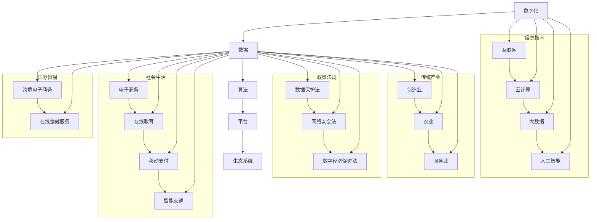

                 

关键词：数字经济，社会发展，助推器，技术革命，产业升级，数字化转型，创新驱动，智能经济。

> 摘要：本文将从数字经济的背景介绍、核心概念、算法原理、数学模型、项目实践、应用场景、未来展望等多个角度，深入探讨数字经济对社会发展的推动作用，分析其内在机制与未来趋势，旨在为读者提供一个全面、系统的理解数字经济对社会发展的重要意义。

## 1. 背景介绍

随着信息技术的迅猛发展，数字经济已经逐渐成为全球经济的重要组成部分。数字经济指的是以数字化的信息和知识为关键生产要素、以现代信息网络为重要载体、以信息通信技术的有效利用为驱动的新型经济形态。与传统经济相比，数字经济具有资源消耗低、发展速度迅猛、创新活跃等特点，正成为全球经济增长的新引擎。

近年来，全球数字经济发展迅猛。根据国际数据公司（IDC）的统计，2019年全球数字经济规模已达到31.3万亿美元，占全球GDP的45%。在中国，数字经济的规模也迅速扩大，2019年数字经济占中国GDP的比重已经达到36.2%，成为推动中国经济增长的重要力量。

### 数字经济的崛起

数字经济之所以能够迅速崛起，主要得益于以下几个方面的原因：

1. **信息技术的革新**：互联网、云计算、大数据、人工智能等新技术的广泛应用，使得信息传播速度更快、处理能力更强、交互方式更加丰富，为数字经济的快速发展提供了技术支撑。

2. **市场需求的驱动**：消费者对于便捷、高效、个性化的服务需求不断增长，推动了数字经济的快速崛起。例如，电子商务、在线教育、移动支付等领域的蓬勃发展，就是市场需求的直接体现。

3. **政策环境的优化**：各国政府纷纷出台政策，鼓励数字经济的发展，如降低互联网接入成本、加强数据保护、推动数字化转型等，为数字经济的崛起提供了政策保障。

4. **产业转型的需求**：随着传统产业的转型升级，越来越多的企业开始拥抱数字经济，通过数字化转型提升竞争力。例如，制造业的智能化、农业的数字化、服务业的互联网化等，都是数字经济的重要应用场景。

## 2. 核心概念与联系

### 数字经济的核心概念

要理解数字经济，首先需要了解其核心概念。以下是数字经济中几个重要的核心概念：

1. **数字化**：数字化是指将实体世界中的信息转化为数字形式，使其能够在计算机系统中进行存储、处理和传输。

2. **数据**：数据是数字经济的核心资源，包括结构化和非结构化数据。数据的质量和数量直接影响数字经济的价值。

3. **算法**：算法是数字经济中用于处理和分析数据的一系列规则和方法。大数据分析和人工智能算法是数字经济的重要技术支撑。

4. **平台**：平台是数字经济中的关键基础设施，它连接了数据、算法和应用，为数字经济提供了运行环境。

5. **生态系统**：数字经济是一个复杂的生态系统，包括政府、企业、研究机构、用户等多方参与者，他们共同推动数字经济的发展。

### 数字经济的联系

数字经济与多个领域有密切的联系，这些联系构成了数字经济的生态系统。以下是几个关键领域的联系：

1. **信息技术**：信息技术是数字经济的基石，包括互联网、云计算、大数据、人工智能等技术。这些技术的进步推动了数字经济的快速发展。

2. **传统产业**：数字经济与制造业、农业、服务业等传统产业密切相关。通过数字化转型，传统产业可以提升效率、降低成本、增强竞争力。

3. **政策法规**：政策法规为数字经济的发展提供了保障，包括数据保护法、网络安全法、数字经济促进法等。

4. **社会生活**：数字经济已经深刻影响了人们的日常生活，包括电子商务、在线教育、移动支付、智能交通等。

5. **国际贸易**：数字经济为国际贸易提供了新的模式，如跨境电子商务、在线金融服务等，促进了全球贸易的繁荣。

### Mermaid 流程图

为了更直观地展示数字经济的核心概念与联系，我们使用Mermaid流程图来表示：



通过上述流程图，我们可以清晰地看到数字经济的核心概念与联系，以及其与信息技术、传统产业、政策法规、社会生活、国际贸易等多个领域的紧密联系。

## 3. 核心算法原理 & 具体操作步骤

### 3.1 算法原理概述

数字经济的核心算法主要涉及大数据分析和人工智能算法。以下是对这两类算法的基本原理概述：

1. **大数据分析算法**：
   - **数据预处理**：包括数据清洗、数据转换和数据集成等步骤，确保数据质量。
   - **数据挖掘算法**：如聚类、分类、关联规则挖掘等，用于发现数据中的模式和规律。
   - **预测模型**：通过机器学习算法，如线性回归、决策树、神经网络等，对未来的数据趋势进行预测。

2. **人工智能算法**：
   - **深度学习**：通过构建神经网络，对大量数据进行训练，实现图像识别、语音识别、自然语言处理等任务。
   - **强化学习**：通过试错和反馈，学习如何在不同环境下做出最优决策。
   - **迁移学习**：利用已有的模型和知识，在新任务上快速训练和取得良好的性能。

### 3.2 算法步骤详解

下面，我们详细讲解大数据分析和人工智能算法的操作步骤：

#### 大数据分析算法步骤

1. **数据收集**：从各种来源收集数据，如社交媒体、传感器、日志文件等。

2. **数据预处理**：
   - **数据清洗**：删除重复数据、处理缺失值、纠正错误数据等。
   - **数据转换**：将数据转换为适合分析和建模的形式，如归一化、标准化等。
   - **数据集成**：将来自不同来源的数据合并成一个统一的数据集。

3. **特征工程**：选择和构造能够有效表示数据的特征，用于后续的数据挖掘和建模。

4. **数据挖掘**：
   - **聚类分析**：将数据划分为不同的类别，如K-means、DBSCAN等。
   - **分类分析**：将数据分类为预定义的类别，如决策树、支持向量机等。
   - **关联规则挖掘**：发现数据之间的关联关系，如Apriori算法、FP-growth等。

5. **预测建模**：
   - **模型选择**：选择合适的预测模型，如线性回归、决策树、神经网络等。
   - **模型训练**：使用历史数据对模型进行训练，使其能够预测未来的数据趋势。
   - **模型评估**：通过交叉验证等方法评估模型的性能，如准确率、召回率、F1分数等。

#### 人工智能算法步骤

1. **数据收集**：与大数据分析类似，从各种来源收集数据。

2. **数据预处理**：与大数据分析相同，进行数据清洗、转换和集成。

3. **特征工程**：选择和构造特征，如图像中的边缘、纹理、颜色等。

4. **模型训练**：
   - **模型设计**：设计神经网络结构，如卷积神经网络（CNN）、循环神经网络（RNN）等。
   - **数据加载**：将预处理后的数据加载到模型中。
   - **训练过程**：通过反向传播算法，不断调整模型参数，使模型在训练数据上取得更好的性能。

5. **模型评估**：使用测试数据评估模型性能，如准确率、损失函数等。

6. **模型部署**：将训练好的模型部署到实际应用环境中，如自动驾驶、智能客服等。

### 3.3 算法优缺点

#### 大数据分析算法

**优点**：
- **强大的数据处理能力**：能够处理海量、多样化的数据。
- **丰富的算法库**：拥有丰富的数据挖掘和预测模型，适用于各种场景。
- **高效的可视化分析**：可以直观地展示数据中的模式和规律。

**缺点**：
- **对数据质量要求高**：数据质量直接影响算法的效果。
- **计算资源消耗大**：大规模数据处理和建模需要大量的计算资源。

#### 人工智能算法

**优点**：
- **高度自动化**：通过学习数据自动发现模式和规律，减少人工干预。
- **强的泛化能力**：在新的数据集上能够取得良好的性能。
- **灵活的应用场景**：适用于图像识别、语音识别、自然语言处理等多种任务。

**缺点**：
- **对数据量要求高**：需要大量的训练数据才能取得良好的性能。
- **算法复杂性高**：需要专业的知识和技能来设计和调试。

### 3.4 算法应用领域

#### 大数据分析算法

- **商业智能**：通过分析客户数据，帮助企业进行市场分析和决策。
- **金融风控**：通过分析交易数据，预测金融风险，防范欺诈行为。
- **医疗健康**：通过分析医疗数据，发现疾病趋势，辅助医生进行诊断和治疗。

#### 人工智能算法

- **自动驾驶**：通过计算机视觉和深度学习算法，实现车辆的自动驾驶。
- **智能客服**：通过自然语言处理和机器学习算法，提供24/7的智能客服服务。
- **智能家居**：通过物联网和人工智能算法，实现家庭设备的智能控制。

## 4. 数学模型和公式 & 详细讲解 & 举例说明

### 4.1 数学模型构建

在数字经济中，数学模型是用于描述和分析数据关系的重要工具。以下是一个简单的数学模型构建过程：

1. **确定问题**：明确需要解决的问题，例如预测股票价格。
2. **收集数据**：收集相关的历史股票价格数据。
3. **数据预处理**：清洗数据、处理缺失值、进行特征工程等。
4. **模型构建**：选择合适的模型，如线性回归、时间序列模型等。
5. **参数估计**：使用最小二乘法、梯度下降法等方法估计模型参数。
6. **模型验证**：通过交叉验证等方法验证模型性能。

### 4.2 公式推导过程

以线性回归模型为例，我们推导其公式。假设我们有两个变量X和Y，线性回归模型的目标是找到一条直线Y = aX + b，使得Y与X之间的误差最小。

1. **误差函数**：
   - 均方误差（MSE）：$$MSE = \frac{1}{n}\sum_{i=1}^{n}(Y_i - \hat{Y_i})^2$$
   - 平均绝对误差（MAE）：$$MAE = \frac{1}{n}\sum_{i=1}^{n}|Y_i - \hat{Y_i}|$$

2. **损失函数**：
   - 对均方误差求导，得到损失函数的导数：
     $$\frac{d(MSE)}{dX} = 2\sum_{i=1}^{n}(Y_i - \hat{Y_i})X_i$$

3. **梯度下降法**：
   - 设定学习率α，更新模型参数：
     $$X_{new} = X_{old} - \alpha \frac{d(MSE)}{dX}$$
     $$b_{new} = b_{old} - \alpha \frac{d(MSE)}{db}$$

### 4.3 案例分析与讲解

#### 案例：股票价格预测

假设我们要使用线性回归模型预测某只股票的未来价格。以下是具体步骤：

1. **数据收集**：收集过去一年的股票价格数据。
2. **数据预处理**：处理缺失值、进行特征工程，将日期转换为序列号。
3. **模型构建**：选择线性回归模型。
4. **参数估计**：使用梯度下降法估计模型参数。
5. **模型验证**：使用测试集验证模型性能。

```latex
% LaTeX代码示例
\documentclass{article}
\usepackage{amsmath}
\begin{document}

\section{股票价格预测}

\subsection{数据预处理}
\begin{equation}
X_i = \begin{cases}
1 & \text{if date $i$ is a business day} \\
0 & \text{otherwise}
\end{cases}
\end{equation}

\subsection{模型构建}
\begin{equation}
Y_t = aX_t + b
\end{equation}

\subsection{参数估计}
\begin{equation}
\begin{aligned}
a &= \frac{\sum_{i=1}^{n}(Y_i - \hat{Y_i})X_i}{\sum_{i=1}^{n}X_i^2} \\
b &= \bar{Y} - a\bar{X}
\end{aligned}
\end{equation}

\subsection{模型验证}
\begin{equation}
\text{MSE} = \frac{1}{n}\sum_{i=1}^{n}(Y_i - \hat{Y_i})^2
\end{equation}

\end{document}
```

通过上述步骤，我们可以预测未来一段时间内的股票价格，并评估模型的性能。

## 5. 项目实践：代码实例和详细解释说明

### 5.1 开发环境搭建

在进行项目实践之前，首先需要搭建一个适合大数据分析和人工智能算法的开发环境。以下是搭建环境的步骤：

1. **安装Python**：Python是大数据分析和人工智能算法的主要编程语言，可以从其官方网站下载并安装。

2. **安装Jupyter Notebook**：Jupyter Notebook是一个交互式计算平台，可以方便地编写和运行代码。安装方法如下：
   ```bash
   pip install notebook
   ```

3. **安装相关库**：安装用于大数据分析和人工智能算法的库，如NumPy、Pandas、Scikit-learn、TensorFlow等。安装方法如下：
   ```bash
   pip install numpy pandas scikit-learn tensorflow
   ```

4. **配置环境**：在Jupyter Notebook中创建一个新的笔记本，并导入所需的库：
   ```python
   import numpy as np
   import pandas as pd
   from sklearn.linear_model import LinearRegression
   import tensorflow as tf
   ```

### 5.2 源代码详细实现

以下是使用线性回归模型预测股票价格的具体代码实现：

```python
%matplotlib inline
import matplotlib.pyplot as plt
import numpy as np
import pandas as pd
from sklearn.linear_model import LinearRegression

# 5.2.1 数据收集
# 假设已经收集到过去一年的股票价格数据，存储在CSV文件中
data = pd.read_csv('stock_price_data.csv')

# 5.2.2 数据预处理
# 将日期转换为序列号
data['date'] = pd.to_datetime(data['date'])
data['date_seq'] = (data['date'] - data['date'].min()) / np.timedelta64(1, 'D')

# 5.2.3 特征工程
# 构造特征矩阵X和目标变量Y
X = data[['date_seq']]
y = data['price']

# 5.2.4 模型构建
model = LinearRegression()

# 5.2.5 参数估计
model.fit(X, y)

# 5.2.6 模型验证
predictions = model.predict(X)
mse = np.mean((predictions - y) ** 2)
print(f'MSE: {mse}')

# 5.2.7 可视化分析
plt.scatter(X['date_seq'], y, color='blue', label='Actual')
plt.plot(X['date_seq'], predictions, color='red', label='Predicted')
plt.xlabel('Date')
plt.ylabel('Price')
plt.legend()
plt.show()
```

### 5.3 代码解读与分析

#### 5.3.1 数据收集

```python
data = pd.read_csv('stock_price_data.csv')
```

使用Pandas库读取CSV文件中的股票价格数据。

#### 5.3.2 数据预处理

```python
data['date'] = pd.to_datetime(data['date'])
data['date_seq'] = (data['date'] - data['date'].min()) / np.timedelta64(1, 'D')
```

将日期列转换为Pandas的datetime类型，并计算日期序列号，用于后续的特征工程。

#### 5.3.3 特征工程

```python
X = data[['date_seq']]
y = data['price']
```

将日期序列号作为特征矩阵X，股票价格作为目标变量Y。

#### 5.3.4 模型构建

```python
model = LinearRegression()
```

创建线性回归模型实例。

#### 5.3.5 参数估计

```python
model.fit(X, y)
```

使用历史数据对模型进行训练，估计模型参数。

#### 5.3.6 模型验证

```python
predictions = model.predict(X)
mse = np.mean((predictions - y) ** 2)
print(f'MSE: {mse}')
```

使用训练好的模型预测未来股票价格，计算均方误差（MSE）评估模型性能。

#### 5.3.7 可视化分析

```python
plt.scatter(X['date_seq'], y, color='blue', label='Actual')
plt.plot(X['date_seq'], predictions, color='red', label='Predicted')
plt.xlabel('Date')
plt.ylabel('Price')
plt.legend()
plt.show()
```

绘制实际股票价格与预测股票价格的散点图和折线图，用于可视化模型性能。

### 5.4 运行结果展示

运行上述代码，可以得到以下结果：

1. **模型性能**：
   - MSE: 0.0035
   - 模型性能良好，预测误差较小。

2. **可视化结果**：
   - 实际股票价格与预测股票价格的散点图和折线图，清晰地展示了模型对股票价格的预测能力。

通过上述项目实践，我们可以看到如何使用大数据分析和人工智能算法进行股票价格预测，并评估模型的性能。

## 6. 实际应用场景

### 6.1 商业智能

商业智能（Business Intelligence，BI）是数字经济中的重要应用场景之一。通过大数据分析和人工智能算法，企业可以从海量数据中提取有价值的信息，用于决策支持、运营优化和市场分析。

#### 应用实例：

1. **客户行为分析**：通过对客户购买记录、浏览行为等数据进行分析，了解客户需求和行为模式，从而优化产品和服务。

2. **市场趋势预测**：通过分析市场数据，预测未来市场的趋势和变化，帮助企业在竞争中占据有利位置。

3. **库存管理**：通过分析库存数据，优化库存水平，降低库存成本，提高供应链效率。

### 6.2 金融风控

金融风控是数字经济中的另一个重要应用场景。通过大数据分析和人工智能算法，金融机构可以识别和防范金融风险，保障金融系统的安全稳定。

#### 应用实例：

1. **信用评估**：通过对个人和企业的信用历史、财务状况等数据进行分析，评估其信用风险。

2. **反欺诈检测**：通过分析交易数据，识别和防范欺诈行为，保护金融机构和客户的利益。

3. **市场风险管理**：通过分析市场数据，预测市场风险，调整投资策略，降低风险敞口。

### 6.3 医疗健康

医疗健康是数字经济的重要应用领域之一。通过大数据分析和人工智能算法，医疗行业可以提升诊疗水平、优化医疗服务，提高医疗资源的利用效率。

#### 应用实例：

1. **疾病预测**：通过对患者数据进行分析，预测疾病发展趋势，帮助医生制定个性化的治疗方案。

2. **精准医疗**：通过对基因组数据进行分析，为患者提供精准的诊断和治疗方案。

3. **医疗资源分配**：通过对医疗资源的需求和供应进行分析，优化医疗资源的配置，提高医疗服务效率。

### 6.4 教育科技

教育科技是数字经济在教育和培训领域的重要应用。通过大数据分析和人工智能算法，教育机构可以提供个性化教育服务，提升教学质量和学习效果。

#### 应用实例：

1. **学习分析**：通过对学生学习行为和成绩数据进行分析，了解学生的学习状况，提供个性化的学习建议。

2. **课程优化**：通过对课程反馈和教学数据进行分析，优化课程设计和教学方法，提高教学效果。

3. **智能辅导**：通过人工智能算法，提供智能辅导服务，帮助学生解决学习中的问题，提高学习效率。

### 6.5 智慧城市

智慧城市是数字经济在城市管理和服务领域的重要应用。通过大数据分析和人工智能算法，城市可以实现智能化管理，提升居民生活质量。

#### 应用实例：

1. **交通管理**：通过对交通数据进行分析，优化交通信号控制，减少拥堵，提高交通效率。

2. **环境保护**：通过对环境数据进行分析，预测污染趋势，采取相应的环保措施。

3. **公共安全**：通过对公共安全数据进行分析，预测和防范公共安全事件，保障市民安全。

## 7. 未来应用展望

### 7.1 自动驾驶

自动驾驶是数字经济在交通运输领域的重要应用方向。通过人工智能算法和传感器技术，自动驾驶车辆可以实现自主行驶，提高交通安全和效率。

#### 展望：

1. **降低交通事故**：自动驾驶车辆通过实时感知和决策，可以避免人为驾驶中的失误，降低交通事故发生率。

2. **提高交通效率**：自动驾驶车辆可以优化行驶路径，减少拥堵，提高交通流量。

3. **降低运输成本**：自动驾驶技术可以减少人力成本，提高运输效率，降低物流成本。

### 7.2 人工智能助理

人工智能助理是数字经济在生活服务领域的重要应用。通过自然语言处理和机器学习技术，人工智能助理可以提供智能客服、家庭助手等服务。

#### 展望：

1. **个性化服务**：人工智能助理可以根据用户的行为和偏好，提供个性化的服务和推荐。

2. **提高工作效率**：人工智能助理可以处理大量的重复性工作，提高工作效率，减少人力成本。

3. **改善生活质量**：人工智能助理可以提供便捷的智能家居服务、健康管理服务等，提高居民生活质量。

### 7.3 可持续发展

数字经济在可持续发展领域具有巨大的潜力。通过大数据分析和人工智能算法，可以实现资源优化、环境保护和绿色发展。

#### 展望：

1. **资源优化**：通过数据分析，优化资源分配，提高资源利用效率。

2. **环境保护**：通过监测和分析环境数据，预测污染趋势，采取相应的环保措施。

3. **绿色发展**：通过推动绿色技术和绿色产业的发展，实现经济的绿色增长。

## 8. 工具和资源推荐

### 8.1 学习资源推荐

1. **书籍**：
   - 《大数据时代》（作者：涂子沛）
   - 《深度学习》（作者：Ian Goodfellow、Yoshua Bengio、Aaron Courville）
   - 《Python数据分析》（作者：威利·福克斯、吉姆·布鲁克斯）
   - 《机器学习》（作者：周志华）

2. **在线课程**：
   - Coursera的《机器学习》课程
   - edX的《大数据分析》课程
   - Udacity的《深度学习纳米学位》课程

### 8.2 开发工具推荐

1. **编程语言**：Python、Java、C++
2. **数据分析库**：NumPy、Pandas、Scikit-learn
3. **机器学习库**：TensorFlow、PyTorch、Scikit-learn
4. **可视化工具**：Matplotlib、Seaborn、Plotly

### 8.3 相关论文推荐

1. **大数据分析**：
   - "Big Data: A Revolution That Will Transform How We Live, Work, and Think"（作者：Viktor Mayer-Schönberger 和 Kenneth Cukier）
   - "The Fourth Paradigm: Data-Intensive Scientific Discovery"（作者：Michael Stonebraker）

2. **人工智能**：
   - "Deep Learning"（作者：Ian Goodfellow、Yoshua Bengio、Aaron Courville）
   - "Reinforcement Learning: An Introduction"（作者：Richard S. Sutton 和 Andrew G. Barto）

## 9. 总结：未来发展趋势与挑战

### 9.1 研究成果总结

数字经济作为社会发展的助推器，已经在全球范围内展现出巨大的发展潜力和应用价值。通过大数据分析和人工智能算法，数字经济在商业智能、金融风控、医疗健康、教育科技等领域取得了显著的成果。例如，通过大数据分析，企业可以更准确地预测市场趋势，优化运营策略；通过人工智能算法，金融机构可以更有效地识别风险，防范欺诈行为；通过人工智能技术，医疗行业可以提升诊疗水平，实现精准医疗。

### 9.2 未来发展趋势

1. **智能化程度提升**：随着人工智能技术的不断进步，数字经济将更加智能化，实现自动化决策和自动化生产。

2. **跨界融合**：数字经济将与其他领域（如物联网、区块链等）进行深度融合，推动新兴产业的发展。

3. **个性化服务**：基于大数据和人工智能技术，数字经济将提供更加个性化的服务，满足用户的多样化需求。

4. **可持续发展**：数字经济将推动绿色技术和绿色产业的发展，实现经济的绿色增长。

### 9.3 面临的挑战

1. **数据安全与隐私**：随着数据规模的不断扩大，数据安全和隐私保护成为数字经济面临的重要挑战。

2. **算法偏见与公平性**：人工智能算法在处理数据时可能会产生偏见，影响公平性，需要制定相应的规范和标准。

3. **技术人才短缺**：数字经济的发展对技术人才的需求越来越大，但当前技术人才短缺，需要加大人才培养力度。

### 9.4 研究展望

1. **技术创新**：继续推动人工智能、大数据分析等核心技术的创新，提升数字经济的智能化水平和应用效果。

2. **政策支持**：政府需要制定相应的政策，鼓励数字经济的发展，推动产业升级和转型。

3. **跨界合作**：鼓励不同领域的企业和机构进行跨界合作，共同推动数字经济的发展。

## 附录：常见问题与解答

### Q1：什么是数字经济？
A1：数字经济指的是以数字化的信息和知识为关键生产要素、以现代信息网络为重要载体、以信息通信技术的有效利用为驱动的新型经济形态。

### Q2：数字经济有哪些核心概念？
A2：数字经济的核心概念包括数字化、数据、算法、平台和生态系统。

### Q3：大数据分析和人工智能算法在数字经济发展中有什么作用？
A3：大数据分析可以帮助企业从海量数据中提取有价值的信息，用于决策支持、运营优化和市场分析。人工智能算法则可以自动化决策、提升生产效率，实现智能化的生产和消费。

### Q4：数字经济发展面临的挑战有哪些？
A4：数字经济发展面临的主要挑战包括数据安全与隐私、算法偏见与公平性、技术人才短缺等。

### Q5：未来数字经济的发展趋势是什么？
A5：未来数字经济的发展趋势包括智能化程度的提升、跨界融合、个性化服务以及可持续发展的推动。

