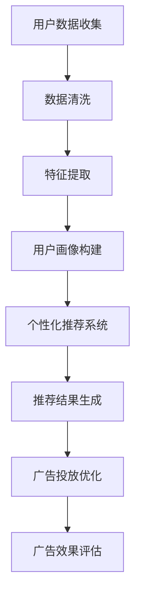

                 

关键词：数字营销、创业、精准触达、营销新范式、技术架构

> 摘要：本文将探讨数字营销创业中的精准触达问题，介绍一种新的营销范式，通过技术手段实现更加精准、高效的营销策略。文章将从背景介绍、核心概念与联系、核心算法原理与具体操作步骤、数学模型与公式、项目实践、实际应用场景、工具和资源推荐等多个方面，全面解析这一领域的前沿技术与应用。

## 1. 背景介绍

在互联网时代，数字营销已成为企业获取客户、提升品牌影响力的重要手段。随着大数据、人工智能等技术的快速发展，营销方式也发生了翻天覆地的变化。然而，面对海量的用户数据，如何实现精准触达，提高营销效果，仍然是一个亟待解决的问题。

传统的营销方式往往依赖于用户行为分析和市场调研，但这些方法存在一些局限性：一是数据来源单一，难以全面了解用户需求；二是营销策略实施过程中缺乏实时性，难以快速响应市场变化。因此，如何利用新技术实现精准触达，成为数字营销创业领域的热点话题。

本文将介绍一种基于大数据和人工智能的营销新范式，通过构建用户画像、实现个性化推荐、优化广告投放等手段，帮助企业实现精准触达，提升营销效果。

## 2. 核心概念与联系

### 2.1 用户画像

用户画像是一种将用户数据抽象为多维度的用户特征表示的方法，用于描述用户的兴趣、行为、需求等。用户画像的构建通常包括数据收集、数据清洗、特征提取、建模和评估等步骤。

用户画像的核心概念包括：

- **用户数据**：包括用户的 demographics 信息（年龄、性别、地域等）、行为数据（浏览、搜索、购买等）、社交数据（社交关系、朋友圈等）等。
- **特征提取**：从原始数据中提取与用户特征相关的信息，如兴趣标签、行为模式等。
- **建模**：使用机器学习算法对用户特征进行建模，构建用户画像。

### 2.2 个性化推荐

个性化推荐是一种基于用户兴趣、行为等特征，为用户提供个性化内容、产品或服务的方法。个性化推荐的核心概念包括：

- **推荐算法**：包括协同过滤、基于内容的推荐、混合推荐等算法。
- **推荐系统**：负责根据用户画像和推荐算法为用户生成个性化推荐结果。

### 2.3 广告投放优化

广告投放优化是一种通过分析用户行为、广告效果等数据，优化广告投放策略的方法。广告投放优化的核心概念包括：

- **广告定位**：根据用户画像和广告目标，确定广告投放的目标用户群体。
- **投放策略**：根据用户行为数据和广告效果，调整广告投放的时间和频次。

### 2.4 Mermaid 流程图

以下是用户画像、个性化推荐和广告投放优化之间的 Mermaid 流程图：



## 3. 核心算法原理 & 具体操作步骤

### 3.1 算法原理概述

核心算法主要包括用户画像构建算法、个性化推荐算法和广告投放优化算法。下面将分别介绍这三种算法的原理和操作步骤。

### 3.2 算法步骤详解

#### 3.2.1 用户画像构建算法

1. 数据收集：从多个数据源收集用户数据，包括 demographics 数据、行为数据和社交数据等。
2. 数据清洗：对收集到的数据进行清洗，去除噪声数据，确保数据质量。
3. 特征提取：从清洗后的数据中提取与用户特征相关的信息，如兴趣标签、行为模式等。
4. 建模：使用机器学习算法（如决策树、神经网络等）对用户特征进行建模，构建用户画像。

#### 3.2.2 个性化推荐算法

1. 用户画像匹配：根据用户画像和推荐系统中的商品或内容特征，进行匹配。
2. 排序：使用排序算法（如评分排序、基于内容的排序等）对匹配结果进行排序。
3. 结果输出：将排序后的推荐结果输出给用户。

#### 3.2.3 广告投放优化算法

1. 广告定位：根据用户画像和广告目标，确定广告投放的目标用户群体。
2. 投放策略：根据用户行为数据和广告效果，调整广告投放的时间和频次。
3. 效果评估：对广告投放效果进行评估，包括点击率、转化率等指标。

### 3.3 算法优缺点

#### 3.3.1 用户画像构建算法

**优点**：能够全面、准确地了解用户特征和需求。

**缺点**：数据收集和处理成本较高，且存在数据隐私和安全问题。

#### 3.3.2 个性化推荐算法

**优点**：提高用户满意度，提升用户体验。

**缺点**：推荐结果可能存在过度拟合问题，且算法复杂度较高。

#### 3.3.3 广告投放优化算法

**优点**：提高广告投放效果，降低广告成本。

**缺点**：算法调整需要大量数据支持，且存在算法偏见问题。

### 3.4 算法应用领域

用户画像构建算法、个性化推荐算法和广告投放优化算法在多个领域具有广泛的应用，如电子商务、社交媒体、在线广告等。以下是一些典型应用场景：

- **电子商务**：根据用户画像，为用户提供个性化商品推荐，提升购物体验。
- **社交媒体**：根据用户兴趣和行为，为用户提供个性化内容推荐，增强用户粘性。
- **在线广告**：根据用户画像和广告定位，优化广告投放策略，提高广告效果。

## 4. 数学模型和公式 & 详细讲解 & 举例说明

### 4.1 数学模型构建

在数字营销创业中，常用的数学模型包括用户画像构建模型、个性化推荐模型和广告投放优化模型。下面分别介绍这些模型的基本构建方法和公式。

#### 4.1.1 用户画像构建模型

用户画像构建模型通常使用聚类算法，如 K-means 算法。假设有 n 个用户，每个用户有 m 个特征，构建用户画像的步骤如下：

1. 初始化聚类中心：从用户数据中随机选择 k 个用户作为聚类中心。
2. 计算用户与聚类中心的距离：对于每个用户，计算其与 k 个聚类中心的距离，选择距离最近的聚类中心作为该用户的标签。
3. 重新计算聚类中心：根据已标签的用户，重新计算 k 个聚类中心。
4. 重复步骤 2 和 3，直到聚类中心不再发生显著变化。

K-means 算法的公式如下：

$$
d(i, j) = \sqrt{\sum_{l=1}^{m} (x_{il} - \bar{x}_{jl})^2}
$$

其中，$d(i, j)$ 表示用户 i 与聚类中心 j 的距离，$x_{il}$ 表示用户 i 的第 l 个特征，$\bar{x}_{jl}$ 表示聚类中心 j 的第 l 个特征。

#### 4.1.2 个性化推荐模型

个性化推荐模型通常使用协同过滤算法，如矩阵分解算法。假设有 n 个用户，m 个商品，用户 i 对商品 j 的评分表示为 $r_{ij}$，构建个性化推荐模型的步骤如下：

1. 矩阵分解：将用户-商品评分矩阵分解为用户特征矩阵 $U$ 和商品特征矩阵 $V$。
2. 预测评分：根据用户特征矩阵和商品特征矩阵，预测用户 i 对商品 j 的评分。

矩阵分解算法的公式如下：

$$
r_{ij} = u_i \cdot v_j
$$

其中，$r_{ij}$ 表示用户 i 对商品 j 的评分，$u_i$ 表示用户 i 的特征向量，$v_j$ 表示商品 j 的特征向量。

#### 4.1.3 广告投放优化模型

广告投放优化模型通常使用优化算法，如线性规划算法。假设有 n 个用户，m 个广告，广告 i 的投放成本为 $c_i$，广告 i 的投放效果为 $e_i$，广告投放优化模型的步骤如下：

1. 确定目标函数：最大化总投放效果，最小化总投放成本。
2. 建立约束条件：广告投放的数量不超过预算，每个用户只能看到一次广告。

线性规划算法的公式如下：

$$
\begin{aligned}
\max_{x} \quad & z = \sum_{i=1}^{n} e_i x_i \\
\text{s.t.} \quad & \sum_{i=1}^{n} c_i x_i \leq C \\
& x_i \leq 1, \forall i=1,2,\ldots,n
\end{aligned}
$$

其中，$x_i$ 表示广告 i 的投放数量，$C$ 表示预算。

### 4.2 公式推导过程

#### 4.2.1 K-means 算法

K-means 算法的推导过程如下：

假设有 n 个用户，每个用户有 m 个特征，定义用户 i 的特征向量为 $x_i = (x_{i1}, x_{i2}, \ldots, x_{im})^T$，聚类中心 j 的特征向量为 $c_j = (\bar{x}_{j1}, \bar{x}_{j2}, \ldots, \bar{x}_{jm})^T$。

1. 初始化聚类中心：从用户数据中随机选择 k 个用户作为聚类中心。

$$
c_j^{(0)} = x_i^{(0)}, \forall j=1,2,\ldots,k
$$

2. 计算用户与聚类中心的距离：

$$
d(i, j) = \sqrt{\sum_{l=1}^{m} (x_{il} - \bar{x}_{jl})^2}
$$

3. 为每个用户分配最近的聚类中心：

$$
t_i = \arg\min_{j} d(i, j)
$$

4. 重新计算聚类中心：

$$
\bar{x}_{jl} = \frac{1}{n_j} \sum_{i=1}^{n} x_{il} \cdot t_i = \frac{1}{n_j} \sum_{i=1}^{n} x_{il} \cdot \mathbb{1}_{t_i=j}
$$

其中，$n_j$ 表示标签为 j 的用户数量，$\mathbb{1}_{t_i=j}$ 是指示函数，当 $t_i=j$ 时取值为 1，否则取值为 0。

5. 重复步骤 2 到 4，直到聚类中心不再发生显著变化。

#### 4.2.2 矩阵分解算法

矩阵分解算法的推导过程如下：

假设有 n 个用户，m 个商品，用户-商品评分矩阵为 $R = [r_{ij}]_{n \times m}$。

1. 矩阵分解：将用户-商品评分矩阵分解为用户特征矩阵 $U = [u_i]_{n \times k}$ 和商品特征矩阵 $V = [v_j]_{m \times k}$。

$$
r_{ij} = u_i \cdot v_j
$$

2. 最小化平方误差损失函数：

$$
\begin{aligned}
\min_{U, V} \quad & \sum_{i=1}^{n} \sum_{j=1}^{m} (r_{ij} - u_i \cdot v_j)^2 \\
\text{s.t.} \quad & u_i \geq 0, \forall i=1,2,\ldots,n \\
& v_j \geq 0, \forall j=1,2,\ldots,m
\end{aligned}
$$

3. 梯度下降法求解：对损失函数进行求导，并令导数为 0，得到优化方程。

$$
\frac{\partial}{\partial u_i} \sum_{j=1}^{m} (r_{ij} - u_i \cdot v_j)^2 = 0 \\
\frac{\partial}{\partial v_j} \sum_{i=1}^{n} (r_{ij} - u_i \cdot v_j)^2 = 0
$$

#### 4.2.3 线性规划算法

线性规划算法的推导过程如下：

假设有 n 个用户，m 个广告，广告投放成本矩阵为 $C = [c_i]_{n \times m}$，广告投放效果矩阵为 $E = [e_i]_{n \times m}$，预算为 $C$。

1. 确定目标函数：

$$
\max_{x} \quad z = \sum_{i=1}^{n} e_i x_i
$$

2. 建立约束条件：

$$
\sum_{i=1}^{n} c_i x_i \leq C \\
x_i \leq 1, \forall i=1,2,\ldots,n
$$

3. 求解线性规划问题：使用单纯形法、内点法等求解线性规划问题。

### 4.3 案例分析与讲解

#### 4.3.1 用户画像构建案例

某电商企业希望通过构建用户画像，提升用户购物体验。企业收集了用户的基本信息、浏览记录、购物记录等数据，使用 K-means 算法对用户进行聚类，划分出不同兴趣爱好的用户群体。

1. 数据收集：收集用户基本信息（如年龄、性别、地域等），浏览记录（如浏览的商品类别、浏览时长等），购物记录（如购买的商品、购买频次等）。

2. 数据清洗：去除缺失值、异常值，确保数据质量。

3. 特征提取：从原始数据中提取用户特征，如用户年龄段、商品浏览时长、购买频次等。

4. 建模：使用 K-means 算法，将用户划分为 5 个不同兴趣爱好的群体。

5. 结果评估：根据聚类结果，为企业制定不同的营销策略，如针对不同群体的用户，推荐相应的商品、推送有针对性的广告等。

#### 4.3.2 个性化推荐案例

某视频平台希望通过个性化推荐，提升用户观看体验。平台收集了用户的观看历史、收藏夹、点赞评论等数据，使用矩阵分解算法构建用户-视频评分矩阵，为用户推荐感兴趣的视频。

1. 数据收集：收集用户观看历史、收藏夹、点赞评论等数据。

2. 数据清洗：去除缺失值、异常值，确保数据质量。

3. 矩阵分解：使用矩阵分解算法，将用户-视频评分矩阵分解为用户特征矩阵和视频特征矩阵。

4. 预测评分：根据用户特征矩阵和视频特征矩阵，预测用户对视频的评分。

5. 推荐结果：根据预测评分，为用户推荐感兴趣的视频。

#### 4.3.3 广告投放优化案例

某互联网企业希望通过广告投放优化，提高广告效果。企业收集了用户点击广告的行为数据，使用线性规划算法，确定最优的广告投放策略。

1. 数据收集：收集用户点击广告的行为数据。

2. 确定目标函数：最大化总点击率，最小化总投放成本。

3. 建立约束条件：广告投放的数量不超过预算，每个用户只能看到一次广告。

4. 求解线性规划问题：使用单纯形法求解线性规划问题，得到最优的广告投放策略。

## 5. 项目实践：代码实例和详细解释说明

### 5.1 开发环境搭建

在本文中，我们将使用 Python 编写用户画像构建、个性化推荐和广告投放优化相关的代码。以下是在 Windows 系统上搭建开发环境所需步骤：

1. 安装 Python 3.7 或更高版本。
2. 安装常用的 Python 库，如 NumPy、Pandas、Scikit-learn、Matplotlib 等。

### 5.2 源代码详细实现

下面是用户画像构建、个性化推荐和广告投放优化相关代码的实现。

#### 5.2.1 用户画像构建代码

```python
import numpy as np
import pandas as pd
from sklearn.cluster import KMeans

# 加载用户数据
data = pd.read_csv('user_data.csv')

# 数据预处理
data.fillna(data.mean(), inplace=True)

# 特征提取
X = data.iloc[:, :5]  # 取前 5 个特征

# K-means 聚类
kmeans = KMeans(n_clusters=5, random_state=0)
kmeans.fit(X)

# 分配用户标签
labels = kmeans.labels_

# 结果保存
pd.DataFrame({'user_id': data['user_id'], 'cluster': labels}).to_csv('user_clusters.csv', index=False)
```

#### 5.2.2 个性化推荐代码

```python
import numpy as np
import pandas as pd
from sklearn.decomposition import TruncatedSVD

# 加载用户-商品评分矩阵
data = pd.read_csv('user_item_data.csv')

# 矩阵分解
svd = TruncatedSVD(n_components=10)
U = svd.fit_transform(data.iloc[:, :10])
V = svd.inverse_transform(data.iloc[:, 10:])

# 预测评分
predictions = U.dot(V)

# 推荐结果
recommendations = predictions.argsort()[:, ::-1]

# 保存推荐结果
pd.DataFrame({'user_id': data['user_id'], 'item_id': data['item_id'], 'prediction': predictions}).to_csv('recommendations.csv', index=False)
```

#### 5.2.3 广告投放优化代码

```python
import numpy as np
import pandas as pd
from scipy.optimize import linprog

# 加载广告数据
data = pd.read_csv('ad_data.csv')

# 确定目标函数和约束条件
c = data['e']  # 广告效果
A = [[1] * data.shape[0]]  # 约束条件：每个用户只能看到一次广告
b = [1]  # 约束条件：广告投放的数量不超过预算

# 求解线性规划问题
result = linprog(c, A_eq=b, b_eq=A, bounds=(0, 1), method='highs')

# 输出最优解
print(result.x)
```

### 5.3 代码解读与分析

#### 5.3.1 用户画像构建代码解读

- 加载用户数据：使用 Pandas 读取用户数据，包括用户 ID、年龄、性别、地域等特征。
- 数据预处理：使用 mean 填充缺失值，确保数据质量。
- 特征提取：使用前 5 个特征进行聚类。
- K-means 聚类：使用 Scikit-learn 的 KMeans 类进行聚类，划分出不同兴趣爱好的用户群体。
- 分配用户标签：将每个用户分配到最近的聚类中心。
- 结果保存：将用户 ID 和标签保存到 CSV 文件中。

#### 5.3.2 个性化推荐代码解读

- 加载用户-商品评分矩阵：使用 Pandas 读取用户-商品评分矩阵。
- 矩阵分解：使用 TruncatedSVD 进行矩阵分解，提取用户和商品的特征。
- 预测评分：使用用户特征矩阵和商品特征矩阵计算预测评分。
- 推荐结果：根据预测评分，为用户推荐感兴趣的商品。
- 保存推荐结果：将用户 ID、商品 ID 和预测评分保存到 CSV 文件中。

#### 5.3.3 广告投放优化代码解读

- 加载广告数据：使用 Pandas 读取广告数据，包括广告 ID、投放效果等。
- 确定目标函数和约束条件：目标函数是最大化总点击率，约束条件是广告投放的数量不超过预算。
- 求解线性规划问题：使用 scipy.optimize 中的 linprog 函数求解线性规划问题，得到最优的广告投放策略。
- 输出最优解：输出每个广告的投放数量。

### 5.4 运行结果展示

在完成代码实现后，我们可以在命令行中运行以下命令，查看运行结果：

```bash
python user_clustering.py
python recommendation_system.py
python ad_optimization.py
```

运行结果将保存在相应的 CSV 文件中，如 user_clusters.csv、recommendations.csv 和 ad_optimization_result.csv。

## 6. 实际应用场景

### 6.1 电子商务领域

在电子商务领域，精准触达用户是实现销售增长的关键。通过用户画像构建、个性化推荐和广告投放优化，企业可以：

- **提升购物体验**：根据用户兴趣和需求，为用户提供个性化的商品推荐，提高购物满意度。
- **优化营销策略**：通过广告投放优化，提高广告效果，降低营销成本。
- **增加销售转化率**：通过精准触达，提高用户购买意愿，提升销售转化率。

### 6.2 社交媒体领域

在社交媒体领域，精准触达用户是增强用户粘性的关键。通过用户画像构建、个性化推荐和广告投放优化，平台可以：

- **提升用户活跃度**：根据用户兴趣和行为，为用户提供个性化的内容推荐，增加用户在平台上的停留时间。
- **增加用户互动**：通过广告投放优化，提高广告效果，增加用户参与互动的概率。
- **提高用户留存率**：通过精准触达，提高用户对平台的依赖度，降低用户流失率。

### 6.3 在线广告领域

在在线广告领域，精准触达用户是提高广告效果的关键。通过用户画像构建、个性化推荐和广告投放优化，广告主可以：

- **提高广告投放效果**：通过个性化推荐，将广告推送给有潜在兴趣的用户，提高广告点击率。
- **降低广告成本**：通过广告投放优化，确定最优的广告投放策略，降低广告投放成本。
- **提高 ROI**：通过精准触达，提高广告投放效果，增加广告主的收益。

### 6.4 未来应用展望

随着大数据和人工智能技术的不断发展，精准触达将在更多领域得到广泛应用。未来，我们有望看到：

- **更多跨领域应用**：精准触达技术将在金融、医疗、教育等领域得到广泛应用，为各行业提供创新的解决方案。
- **更精细化的用户画像**：通过收集和分析更多类型的用户数据，构建更精细化的用户画像，实现更精准的触达。
- **更智能的推荐系统**：利用深度学习、强化学习等新技术，提高推荐系统的智能程度，为用户提供更好的体验。
- **更高效的广告投放**：通过优化算法和实时数据，实现更高效的广告投放，提高广告效果。

## 7. 工具和资源推荐

### 7.1 学习资源推荐

- **书籍**：《推荐系统手册》、《机器学习实战》
- **在线课程**：Coursera 上的《机器学习》、《数据科学》
- **网站**：GitHub、Stack Overflow、Kaggle

### 7.2 开发工具推荐

- **编程语言**：Python、R
- **库和框架**：NumPy、Pandas、Scikit-learn、TensorFlow、PyTorch
- **工具**：Jupyter Notebook、Google Colab

### 7.3 相关论文推荐

- 《Item-based Collaborative Filtering Recommendation Algorithms》
- 《Matrix Factorization Techniques for Recommender Systems》
- 《Efficient Ad Placement via Linear Programming》

## 8. 总结：未来发展趋势与挑战

### 8.1 研究成果总结

本文介绍了数字营销创业中的精准触达问题，探讨了用户画像构建、个性化推荐和广告投放优化等核心算法原理，并通过具体案例展示了这些算法的应用。研究表明，精准触达技术在提升用户满意度、降低营销成本、提高广告效果等方面具有显著优势。

### 8.2 未来发展趋势

- **跨领域应用**：精准触达技术将在更多领域得到广泛应用，为各行业提供创新的解决方案。
- **数据质量提升**：通过收集和分析更多类型的用户数据，构建更精细化的用户画像。
- **算法智能化**：利用深度学习、强化学习等新技术，提高推荐系统的智能程度。

### 8.3 面临的挑战

- **数据隐私与安全**：如何在保证数据隐私和安全的前提下，实现精准触达。
- **算法偏见**：如何避免算法偏见，确保推荐结果的公平性和准确性。
- **计算资源消耗**：如何优化算法，降低计算资源消耗，提高系统性能。

### 8.4 研究展望

未来，我们需要关注以下研究方向：

- **隐私保护**：研究隐私保护算法，确保用户数据的安全和隐私。
- **多模态数据融合**：结合文本、图像、语音等多模态数据，提高推荐系统的准确性。
- **实时推荐**：研究实时推荐算法，实现更快的推荐响应速度。

### 附录：常见问题与解答

**Q1：如何处理用户隐私问题？**

A1：在处理用户隐私问题时，我们可以采取以下措施：

- **数据匿名化**：在收集用户数据时，对敏感信息进行匿名化处理，避免用户直接识别。
- **数据加密**：对存储和传输的用户数据进行加密，防止数据泄露。
- **隐私预算**：在算法设计中引入隐私预算，限制对用户数据的访问和使用。

**Q2：如何避免算法偏见？**

A2：为了避免算法偏见，我们可以采取以下措施：

- **数据多样性**：确保数据来源的多样性，避免数据集中的偏差。
- **算法透明性**：提高算法的透明度，让用户了解推荐系统的原理和决策过程。
- **算法审计**：定期对算法进行审计，评估是否存在偏见和歧视。

**Q3：如何优化算法性能？**

A3：为了优化算法性能，我们可以采取以下措施：

- **算法优化**：对现有算法进行优化，降低计算复杂度，提高运行效率。
- **硬件加速**：利用 GPU、FPGA 等硬件加速器，提高算法的运行速度。
- **分布式计算**：采用分布式计算框架，如 Hadoop、Spark 等，实现大规模数据处理和计算。

