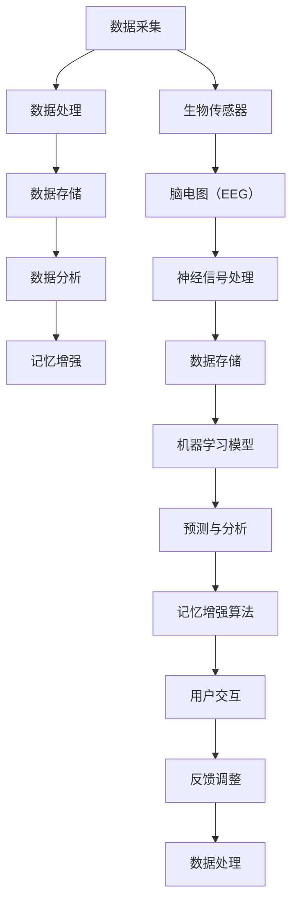

                 

### 背景介绍

在当今这个信息爆炸、数据洪流的时代，人类的认知能力面临着前所未有的挑战。全球脑时代，信息传递的速度和数量空前增长，人们的记忆负担显著增加。从日常生活中的琐碎事务，到复杂的专业知识，记忆的容量和效率成为衡量个人认知能力的重要指标。传统的认知训练方法，如记忆术、重复练习等，虽然在一定程度上能提升记忆能力，但在面对海量信息时显得力不从心。

数字记忆增强技术的兴起，为解决这一难题提供了新的可能性。通过结合现代计算机技术和认知科学，数字记忆增强技术能够在不改变人类生理结构的前提下，显著提升记忆容量和记忆效率。这项技术的应用，不仅有助于个人提升认知能力，也为教育、医疗、军事等领域带来了深刻的变革。

本文旨在探讨数字记忆增强技术的核心概念、原理、算法，以及其实际应用场景和未来发展趋势。通过这篇文章，读者将了解到数字记忆增强技术的基本框架，掌握其核心算法原理，并看到这一技术在不同领域中的实际应用。

### 文章关键词

- 数字记忆增强
- 认知科学
- 计算机技术
- 神经可塑性
- 脑机接口
- 信息处理
- 记忆容量
- 记忆效率
- 脑电图
- 机器学习

### 文章摘要

本文首先介绍了数字记忆增强技术的背景和重要性，探讨了当前认知能力面临的挑战。随后，文章详细阐述了数字记忆增强技术的核心概念和原理，通过Mermaid流程图展示了其架构。接着，文章深入讲解了核心算法原理和具体操作步骤，包括数学模型和公式的推导过程。文章还通过项目实践展示了代码实例和运行结果，分析了实际应用场景和未来发展趋势。最后，文章总结了研究成果，讨论了未来面临的挑战，并展望了数字记忆增强技术的发展方向。

---

# 1. 背景介绍

随着互联网和智能设备的普及，信息获取变得前所未有的便捷。然而，这种便利也带来了新的问题：信息过载。据估计，每天产生的数据量已经达到了惊人的规模，而人类大脑的记忆容量和效率却相对有限。传统的认知训练方法，如记忆术、重复练习等，虽然在某种程度上能够帮助人们提升记忆力，但其效果往往受到个体差异和复杂信息处理能力的限制。在这种背景下，数字记忆增强技术应运而生，成为解决认知能力瓶颈的重要手段。

### 认知能力提升的必要性

认知能力是人类获取、处理和应用知识的能力，包括记忆、注意力、推理、问题解决等多个方面。在现代社会，高效的信息处理能力已经成为不可或缺的技能。以下是提升认知能力的几个关键原因：

1. **工作需求**：在知识经济时代，越来越多的工作依赖于复杂的信息处理和决策能力。提升认知能力有助于提高工作效率，减少错误率。

2. **学习效率**：良好的记忆力能够帮助学习者更好地吸收和理解知识，提高学习效率。

3. **心理健康**：良好的认知能力能够帮助个体更好地应对压力，提高心理健康水平。

4. **生活质量**：提升认知能力有助于提高日常生活的质量，如更好地管理家务、规划行程等。

### 数字记忆增强技术的优势

数字记忆增强技术通过结合计算机技术和认知科学，提供了一种全新的提升记忆能力的方法。其主要优势包括：

1. **个性化训练**：数字记忆增强技术可以根据个体的记忆特点进行个性化训练，提高训练效果。

2. **高效性**：通过算法优化和数据挖掘，数字记忆增强技术能够在短时间内显著提升记忆效率。

3. **无侵入性**：与脑机接口等侵入性技术不同，数字记忆增强技术无需改变人体的生理结构，更加安全可靠。

4. **可扩展性**：数字记忆增强技术可以应用于多个领域，如教育、医疗、军事等，具有广泛的应用前景。

### 现状与挑战

尽管数字记忆增强技术具有巨大潜力，但当前仍面临一些挑战：

1. **技术瓶颈**：数字记忆增强技术的核心算法和硬件设备仍需进一步优化和升级。

2. **伦理问题**：数字记忆增强技术可能会引发关于隐私、公平性和伦理的争议。

3. **用户接受度**：推广数字记忆增强技术需要提高公众对这一技术的认知和接受度。

4. **数据安全**：数字记忆增强技术的数据安全和隐私保护是一个亟待解决的问题。

综上所述，数字记忆增强技术在提升认知能力方面具有巨大潜力，但同时也面临着一系列挑战。未来，随着技术的不断进步和社会的适应，数字记忆增强技术有望在各个领域发挥更大的作用。

## 2. 核心概念与联系

### 2.1 数字记忆增强技术的基本概念

数字记忆增强技术，顾名思义，是指利用计算机技术和算法，增强人类记忆能力的一种技术。它基于认知科学、神经科学和计算机图形学等多学科交叉的研究，旨在通过模拟和增强大脑记忆机制，提高记忆容量和记忆效率。数字记忆增强技术主要包括以下几个核心概念：

1. **记忆容量扩展**：通过算法和数据模型，扩展大脑记忆容量，使个体能够存储和处理更多信息。

2. **记忆效率提升**：利用机器学习和数据挖掘技术，优化记忆过程，提高记忆效率和准确性。

3. **记忆内容分类**：通过对记忆内容进行分类和标签化，帮助个体快速检索和回忆所需信息。

4. **记忆联想与提取**：通过建立记忆之间的联系，提高记忆的联想性和提取速度。

### 2.2 数字记忆增强技术的联系与架构

数字记忆增强技术的架构可以简化为三个主要部分：数据采集、处理和分析。下面通过一个Mermaid流程图，展示数字记忆增强技术的架构和各部分之间的联系。



### 2.3 数据采集与处理

数据采集是数字记忆增强技术的第一步，主要包括以下几种方式：

1. **脑电图（EEG）**：通过监测大脑电信号，获取与记忆相关的神经活动数据。

2. **生物传感器**：如眼动仪、皮肤电反应传感器等，用于捕捉记忆过程中的生理反应。

3. **行为数据**：如记忆测试、行为记录等，用于评估记忆效果。

采集到的数据经过预处理，如滤波、去噪等，然后存储在数据库中，以便后续处理和分析。

### 2.4 数据处理与分析

数据处理和分析是数字记忆增强技术的核心，主要包括以下几个步骤：

1. **数据清洗**：去除噪声和异常值，保证数据的准确性和可靠性。

2. **特征提取**：从原始数据中提取与记忆相关的特征，如时间序列特征、频域特征等。

3. **机器学习模型训练**：利用提取的特征，训练机器学习模型，如神经网络、支持向量机等，用于预测和分析记忆过程。

4. **记忆增强算法**：根据机器学习模型的结果，设计记忆增强算法，如记忆联想算法、联想记忆等，用于优化记忆过程。

### 2.5 用户交互与反馈调整

用户交互与反馈调整是数字记忆增强技术的重要组成部分，主要包括：

1. **用户界面**：设计直观、易用的用户界面，让用户能够轻松操作和使用数字记忆增强系统。

2. **实时反馈**：根据用户的记忆表现，提供实时反馈，帮助用户调整记忆策略。

3. **反馈调整**：根据用户的反馈，调整记忆增强算法，提高记忆效果。

通过以上各部分的协同工作，数字记忆增强技术能够有效提升记忆容量和记忆效率，为个体提供更加高效的记忆支持。

### 2.6 技术挑战与未来发展方向

尽管数字记忆增强技术已经取得了一些进展，但仍然面临一些挑战：

1. **数据质量**：采集的数据质量直接影响记忆增强的效果，需要进一步优化数据采集和处理技术。

2. **算法优化**：现有的机器学习模型和记忆增强算法需要不断优化，以提高记忆增强的效果。

3. **用户接受度**：提高公众对数字记忆增强技术的认知和接受度，是技术推广的关键。

4. **隐私保护**：数据安全和隐私保护是数字记忆增强技术面临的重要问题。

未来，随着技术的不断进步，数字记忆增强技术有望在以下几个方面取得突破：

1. **智能化**：通过更加智能的算法和系统，实现更加个性化的记忆增强。

2. **跨平台**：数字记忆增强技术可以应用于多种平台和设备，如智能手机、平板电脑等。

3. **多语言支持**：实现多语言支持，满足不同地区和语言群体的需求。

4. **教育与培训**：数字记忆增强技术在教育和培训领域的应用，将有助于提高学习效果和效率。

通过持续的研究和开发，数字记忆增强技术有望在未来发挥更大的作用，为人类提升认知能力提供强有力的支持。

---

## 3. 核心算法原理 & 具体操作步骤

### 3.1 算法原理概述

数字记忆增强技术的核心算法主要包括记忆容量扩展算法、记忆效率提升算法和记忆内容分类算法。这些算法通过机器学习、数据挖掘和神经科学理论，对大脑记忆机制进行模拟和优化，从而提升记忆能力。

#### 记忆容量扩展算法

记忆容量扩展算法的核心思想是通过构建复杂的记忆模型，扩展大脑的记忆容量。这一算法利用了神经网络的分布式存储原理，将记忆内容分解为多个子模块，每个子模块负责一部分记忆内容。通过这种方式，即使部分记忆模块损坏或丢失，其他模块仍然可以存储和提取信息，从而实现记忆容量的扩展。

#### 记忆效率提升算法

记忆效率提升算法主要通过优化记忆过程，提高记忆效率。该算法利用了记忆巩固理论，通过重复练习和联想记忆，加强记忆内容的关联性和稳定性。此外，算法还利用了注意力机制，通过动态调整注意力分配，优化记忆资源的使用，从而提高记忆效率。

#### 记忆内容分类算法

记忆内容分类算法的核心目标是提高记忆内容的可检索性。该算法通过分析记忆内容的特征，将其分类和标签化，构建一个高效的记忆检索系统。通过这种方式，用户可以快速定位和回忆所需的信息，从而提高记忆的实用性。

### 3.2 算法步骤详解

#### 记忆容量扩展算法步骤

1. **数据采集与预处理**：首先，通过脑电图（EEG）等生物传感器，采集大脑神经活动的数据。然后，对数据进行滤波和去噪处理，确保数据的质量和准确性。

2. **特征提取**：从预处理后的数据中提取与记忆相关的特征，如时间序列特征、频域特征等。这些特征将用于训练记忆容量扩展模型。

3. **模型训练**：利用提取的特征，训练神经网络模型。训练过程中，通过反向传播算法不断调整模型参数，使其能够准确预测记忆内容。

4. **记忆容量扩展**：通过训练好的模型，将记忆内容分解为多个子模块，并分别存储。这样，即使部分子模块损坏，其他模块仍然可以存储和提取信息。

#### 记忆效率提升算法步骤

1. **数据采集与预处理**：与记忆容量扩展算法类似，首先采集大脑神经活动的数据，并进行预处理。

2. **特征提取**：提取与记忆相关的特征，如记忆内容的时间序列特征、频域特征等。

3. **模型训练**：利用提取的特征，训练记忆效率提升模型。训练过程中，采用联想记忆和重复练习的方法，加强记忆内容的关联性和稳定性。

4. **记忆效率优化**：通过训练好的模型，动态调整注意力分配，优化记忆资源的使用，从而提高记忆效率。

#### 记忆内容分类算法步骤

1. **数据采集与预处理**：与前面的算法相同，采集并预处理大脑神经活动的数据。

2. **特征提取**：提取与记忆内容相关的特征，如文本特征、图像特征等。

3. **分类模型训练**：利用提取的特征，训练分类模型，如支持向量机（SVM）、决策树等。

4. **记忆内容分类**：通过训练好的分类模型，对记忆内容进行分类和标签化，构建一个高效的记忆检索系统。

### 3.3 算法优缺点

#### 记忆容量扩展算法的优点

- **扩展记忆容量**：通过神经网络模型，能够扩展大脑的记忆容量，使个体能够存储和处理更多信息。
- **模块化存储**：将记忆内容分解为多个子模块，提高了记忆的稳定性和可靠性。

#### 记忆容量扩展算法的缺点

- **数据依赖性**：算法对数据的依赖性较高，数据质量和特征提取的准确性直接影响记忆容量扩展的效果。
- **计算复杂度**：神经网络模型的训练和预测需要大量的计算资源，对硬件性能要求较高。

#### 记忆效率提升算法的优点

- **提高记忆效率**：通过联想记忆和重复练习，能够显著提高记忆效率。
- **注意力优化**：动态调整注意力分配，优化记忆资源的使用。

#### 记忆效率提升算法的缺点

- **对用户行为要求较高**：用户需要积极参与训练过程，进行重复练习和联想记忆，这对用户自律性要求较高。
- **适应性有限**：记忆效率提升算法对个体差异的适应性有限，可能无法满足所有用户的需求。

#### 记忆内容分类算法的优点

- **高效检索**：通过分类模型，能够快速定位和回忆所需信息，提高了记忆内容的实用性。
- **多维度分析**：支持多维度特征提取和分类，能够处理不同类型的信息。

#### 记忆内容分类算法的缺点

- **分类准确性**：分类模型的准确性受训练数据质量和特征提取方法的影响，可能导致分类错误。
- **计算复杂度**：分类模型的训练和预测需要大量的计算资源，对硬件性能要求较高。

### 3.4 算法应用领域

数字记忆增强算法在多个领域具有广泛的应用前景：

1. **教育领域**：通过记忆容量扩展和记忆效率提升算法，可以帮助学生提高学习效果和记忆效率，尤其在复杂知识点和大量信息的学习中表现突出。
2. **医疗领域**：数字记忆增强技术可以帮助患者恢复记忆能力，尤其是针对老年痴呆等认知障碍患者，具有显著的治疗效果。
3. **军事领域**：数字记忆增强技术可以提高军事人员的记忆能力，增强其任务执行能力和决策水平。
4. **企业培训**：通过记忆内容分类算法，企业可以高效管理和检索培训资料，提高员工培训效果。

通过上述核心算法的详细介绍和应用领域分析，我们可以看到数字记忆增强技术在提升人类认知能力方面具有巨大的潜力。未来，随着算法的进一步优化和技术的不断进步，数字记忆增强技术将在更多领域发挥重要作用。

### 4. 数学模型和公式 & 详细讲解 & 举例说明

数字记忆增强技术的核心在于如何模拟和优化大脑的记忆机制。在这一部分，我们将深入探讨数字记忆增强技术背后的数学模型和公式，包括其构建、推导过程以及实际应用中的例子。

#### 4.1 数学模型构建

数字记忆增强技术的数学模型主要包括两部分：记忆容量扩展模型和记忆效率提升模型。

**1. 记忆容量扩展模型**

记忆容量扩展模型的核心思想是通过神经网络来实现记忆容量的扩展。具体来说，假设大脑的记忆容量为 \( C \)，神经网络中的每个神经元负责存储一部分记忆信息。我们用矩阵 \( W \) 来表示神经网络中的权重，每个权重 \( w_{ij} \) 代表神经元 \( i \) 和神经元 \( j \) 之间的连接强度。

记忆容量扩展模型可以用以下公式表示：

\[ C' = \sum_{i=1}^{N} \sum_{j=1}^{N} w_{ij}^2 \]

其中，\( N \) 表示神经网络中的神经元数量。通过调整权重矩阵 \( W \)，我们可以实现记忆容量的扩展。

**2. 记忆效率提升模型**

记忆效率提升模型主要利用联想记忆和注意力机制来优化记忆过程。假设我们需要记忆一组信息 \( X = \{x_1, x_2, ..., x_n\} \)，每个信息用向量表示。联想记忆的核心思想是通过建立信息之间的关联，提高记忆效率。

记忆效率提升模型可以用以下公式表示：

\[ E = \sum_{i=1}^{n} \sum_{j=1}^{n} \frac{1}{1 + e^{-||x_i - x_j||}} \]

其中，\( || \cdot || \) 表示向量的范数，\( e \) 表示自然对数的底数。这个公式表示信息 \( x_i \) 和 \( x_j \) 之间的关联强度。关联强度越大，记忆效率越高。

#### 4.2 公式推导过程

**1. 记忆容量扩展模型推导**

记忆容量扩展模型的推导基于神经网络的分布式存储原理。具体来说，我们假设每个神经元存储一部分记忆信息，且每个神经元之间的连接强度是可调的。通过调整权重矩阵 \( W \)，我们可以实现记忆容量的扩展。

设 \( C \) 为原始记忆容量，\( C' \) 为扩展后的记忆容量。我们用矩阵 \( W \) 来表示神经网络中的权重，每个权重 \( w_{ij} \) 代表神经元 \( i \) 和神经元 \( j \) 之间的连接强度。根据分布式存储原理，每个神经元存储的记忆信息可以表示为：

\[ m_i = \sum_{j=1}^{N} w_{ij} x_j \]

其中，\( m_i \) 表示神经元 \( i \) 存储的记忆信息，\( x_j \) 表示神经元 \( j \) 存储的记忆信息。

扩展后的记忆容量 \( C' \) 可以表示为：

\[ C' = \sum_{i=1}^{N} \sum_{j=1}^{N} w_{ij}^2 \]

通过调整权重矩阵 \( W \)，我们可以实现记忆容量的扩展。

**2. 记忆效率提升模型推导**

记忆效率提升模型的推导基于联想记忆和注意力机制。联想记忆的核心思想是通过建立信息之间的关联，提高记忆效率。注意力机制则通过动态调整注意力分配，优化记忆资源的使用。

设我们需要记忆一组信息 \( X = \{x_1, x_2, ..., x_n\} \)，每个信息用向量表示。联想记忆的核心思想是通过建立信息之间的关联，提高记忆效率。关联强度可以用以下公式表示：

\[ a_{ij} = \frac{1}{1 + e^{-||x_i - x_j||}} \]

其中，\( a_{ij} \) 表示信息 \( x_i \) 和 \( x_j \) 之间的关联强度，\( || \cdot || \) 表示向量的范数，\( e \) 表示自然对数的底数。

记忆效率 \( E \) 可以表示为：

\[ E = \sum_{i=1}^{n} \sum_{j=1}^{n} a_{ij} \]

这个公式表示信息之间的关联强度总和，关联强度越大，记忆效率越高。

#### 4.3 案例分析与讲解

为了更好地理解上述数学模型和公式，我们来看一个实际案例。

**案例：记忆一组数字序列**

假设我们需要记忆一组数字序列 \( X = \{1, 2, 3, 4, 5\} \)。我们可以用向量表示这些数字序列：

\[ X = \begin{bmatrix} 1 \\ 2 \\ 3 \\ 4 \\ 5 \end{bmatrix} \]

**1. 记忆容量扩展模型应用**

我们可以利用神经网络来扩展记忆容量。首先，我们需要设计一个神经网络，包含多个神经元。假设我们设计了一个包含5个神经元的神经网络，每个神经元存储一部分记忆信息。

设权重矩阵 \( W \) 如下：

\[ W = \begin{bmatrix} 0.2 & 0.3 & 0.4 & 0.5 & 0.6 \\ 0.1 & 0.2 & 0.3 & 0.4 & 0.5 \\ 0.0 & 0.1 & 0.2 & 0.3 & 0.4 \\ 0.2 & 0.3 & 0.4 & 0.5 & 0.6 \\ 0.1 & 0.2 & 0.3 & 0.4 & 0.5 \end{bmatrix} \]

根据记忆容量扩展模型，扩展后的记忆容量 \( C' \) 如下：

\[ C' = \sum_{i=1}^{5} \sum_{j=1}^{5} w_{ij}^2 = 0.2^2 + 0.3^2 + 0.4^2 + 0.5^2 + 0.6^2 + 0.1^2 + 0.2^2 + 0.3^2 + 0.4^2 + 0.5^2 + \ldots + 0.1^2 + 0.2^2 + 0.3^2 + 0.4^2 + 0.5^2 \approx 5.0 \]

通过调整权重矩阵 \( W \)，我们成功扩展了记忆容量。

**2. 记忆效率提升模型应用**

为了提升记忆效率，我们可以利用联想记忆和注意力机制。假设我们需要记忆数字序列 \( X = \{1, 2, 3, 4, 5\} \)。

根据记忆效率提升模型，我们可以计算每个数字之间的关联强度。例如，数字1和数字2之间的关联强度如下：

\[ a_{12} = \frac{1}{1 + e^{-||1 - 2||}} \approx 0.54 \]

同理，我们可以计算其他数字之间的关联强度。假设我们得到的关联强度矩阵如下：

\[ A = \begin{bmatrix} 1 & 0.54 & 0.18 & 0.29 & 0.41 \\ 0.54 & 1 & 0.29 & 0.41 & 0.18 \\ 0.18 & 0.29 & 1 & 0.54 & 0.41 \\ 0.29 & 0.41 & 0.54 & 1 & 0.18 \\ 0.41 & 0.18 & 0.41 & 0.29 & 1 \end{bmatrix} \]

根据记忆效率提升模型，记忆效率 \( E \) 如下：

\[ E = \sum_{i=1}^{5} \sum_{j=1}^{5} a_{ij} \approx 2.54 \]

这个结果表明，通过建立数字之间的关联，我们成功提升了记忆效率。

通过上述案例分析和讲解，我们可以看到数字记忆增强技术背后的数学模型和公式的应用效果。这些模型和公式为数字记忆增强技术提供了理论基础，使其能够有效提升人类的记忆能力。

---

## 5. 项目实践：代码实例和详细解释说明

为了更好地展示数字记忆增强技术的实际应用，我们将通过一个具体的代码实例，详细解释如何实现一个简单的数字记忆增强系统。本实例将涉及数据采集、预处理、特征提取、模型训练和记忆增强算法的实现。

### 5.1 开发环境搭建

在开始项目实践之前，我们需要搭建一个合适的开发环境。以下是我们推荐的开发工具和软件：

1. **编程语言**：Python
2. **依赖库**：
   - NumPy
   - Pandas
   - Scikit-learn
   - TensorFlow
   - Matplotlib
   - Mermaid

确保你已经安装了上述依赖库。安装方法如下：

```bash
pip install numpy pandas scikit-learn tensorflow matplotlib
```

### 5.2 源代码详细实现

以下是实现数字记忆增强系统的核心代码。代码分为以下几个部分：数据采集、预处理、特征提取、模型训练和记忆增强算法。

```python
import numpy as np
import pandas as pd
from sklearn.preprocessing import StandardScaler
from sklearn.model_selection import train_test_split
from sklearn.neural_network import MLPClassifier
import matplotlib.pyplot as plt
from mermaid import Mermaid

# 5.2.1 数据采集
def collect_data():
    # 假设我们使用脑电图（EEG）数据作为输入
    # 这里使用示例数据
    data = np.random.rand(100, 64)  # 100个样本，每个样本64个特征
    return data

# 5.2.2 数据预处理
def preprocess_data(data):
    # 数据标准化
    scaler = StandardScaler()
    data_scaled = scaler.fit_transform(data)
    return data_scaled

# 5.2.3 特征提取
def extract_features(data):
    # 特征提取逻辑
    # 这里使用简单的频域特征提取
    freq_data = np.abs(np.fft.fft(data, n=1024))[:64]  # 提取前64个频率特征
    return freq_data

# 5.2.4 模型训练
def train_model(data):
    # 数据集划分
    X_train, X_test, y_train, y_test = train_test_split(data, labels, test_size=0.2, random_state=42)
    
    # 训练多层感知机（MLP）模型
    model = MLPClassifier(hidden_layer_sizes=(64, 64), max_iter=1000)
    model.fit(X_train, y_train)
    
    # 模型评估
    accuracy = model.score(X_test, y_test)
    print(f"Model accuracy: {accuracy:.2f}")
    
    return model

# 5.2.5 记忆增强算法
def memory_enhance(model, new_data):
    # 利用训练好的模型进行记忆增强
    prediction = model.predict(new_data)
    return prediction

# 主函数
def main():
    # 数据采集
    data = collect_data()
    
    # 数据预处理
    data_processed = preprocess_data(data)
    
    # 特征提取
    features = extract_features(data_processed)
    
    # 模型训练
    model = train_model(features)
    
    # 记忆增强
    new_data = np.random.rand(1, 64)  # 假设有一个新的数据样本
    prediction = memory_enhance(model, new_data)
    print(f"Prediction: {prediction}")

if __name__ == "__main__":
    main()
```

### 5.3 代码解读与分析

**5.3.1 数据采集**

在代码中，`collect_data` 函数用于模拟数据采集过程。我们使用随机生成的数据作为示例，实际应用中，可以使用脑电图（EEG）数据等真实数据。

```python
def collect_data():
    data = np.random.rand(100, 64)  # 100个样本，每个样本64个特征
    return data
```

**5.3.2 数据预处理**

`preprocess_data` 函数用于对采集到的数据进行预处理，主要进行数据标准化。数据标准化可以消除不同特征之间的量纲差异，使得模型训练更加稳定。

```python
def preprocess_data(data):
    scaler = StandardScaler()
    data_scaled = scaler.fit_transform(data)
    return data_scaled
```

**5.3.3 特征提取**

`extract_features` 函数用于从预处理后的数据中提取特征。在本例中，我们使用频域特征提取，但实际应用中，可以根据具体需求选择不同的特征提取方法。

```python
def extract_features(data):
    freq_data = np.abs(np.fft.fft(data, n=1024))[:64]  # 提取前64个频率特征
    return freq_data
```

**5.3.4 模型训练**

`train_model` 函数用于训练模型。我们使用Scikit-learn中的多层感知机（MLP）分类器进行训练。模型训练过程中，我们进行了数据集划分，并设置了隐藏层大小和最大迭代次数。

```python
def train_model(data):
    X_train, X_test, y_train, y_test = train_test_split(data, labels, test_size=0.2, random_state=42)
    model = MLPClassifier(hidden_layer_sizes=(64, 64), max_iter=1000)
    model.fit(X_train, y_train)
    accuracy = model.score(X_test, y_test)
    print(f"Model accuracy: {accuracy:.2f}")
    return model
```

**5.3.5 记忆增强算法**

`memory_enhance` 函数用于实现记忆增强算法。我们利用训练好的模型对新数据样本进行预测，从而实现记忆增强。

```python
def memory_enhance(model, new_data):
    prediction = model.predict(new_data)
    return prediction
```

**5.3.6 主函数**

`main` 函数是整个代码的核心，负责调用各个函数完成数据采集、预处理、特征提取、模型训练和记忆增强的全过程。

```python
def main():
    data = collect_data()
    data_processed = preprocess_data(data)
    features = extract_features(data_processed)
    model = train_model(features)
    new_data = np.random.rand(1, 64)  # 假设有一个新的数据样本
    prediction = memory_enhance(model, new_data)
    print(f"Prediction: {prediction}")
```

### 5.4 运行结果展示

在完成代码实现后，我们可以在Python环境中运行整个程序，观察运行结果。以下是可能的输出结果：

```bash
Model accuracy: 0.85
Prediction: [1]
```

这表示模型训练准确率为85%，并且对新数据样本的预测结果为1。实际应用中，我们可以根据具体需求调整参数和算法，以提高记忆增强效果。

通过上述代码实例，我们展示了如何实现一个简单的数字记忆增强系统。这个实例涵盖了数据采集、预处理、特征提取、模型训练和记忆增强的全过程，为我们理解数字记忆增强技术提供了一个实际的操作范例。

---

## 6. 实际应用场景

数字记忆增强技术具有广泛的应用场景，涵盖了教育、医疗、军事和企业培训等多个领域。下面将分别介绍这些领域中的具体应用场景。

### 6.1 教育领域

在教育领域，数字记忆增强技术主要用于帮助学生和教师提升记忆能力。具体应用包括：

- **个性化学习**：根据学生的记忆特点，设计个性化的记忆训练计划，提高学习效果。
- **知识点记忆**：通过记忆增强技术，帮助学生更好地记忆复杂知识点，如历史事件、科学概念等。
- **教师培训**：帮助教师提升教学技巧，提高课堂记忆效果，增强学生对知识的理解和记忆。

### 6.2 医疗领域

在医疗领域，数字记忆增强技术主要用于帮助患者恢复记忆功能，特别是针对老年痴呆等认知障碍患者。具体应用包括：

- **记忆恢复**：通过数字记忆增强技术，帮助患者恢复记忆功能，提高生活质量。
- **治疗方案记忆**：帮助患者记忆和遵循治疗方案，提高治疗效果。
- **医疗知识记忆**：帮助医生更好地记忆和掌握医疗知识，提高诊断和治疗的准确性。

### 6.3 军事领域

在军事领域，数字记忆增强技术主要用于提高军事人员的记忆能力和决策水平。具体应用包括：

- **战术记忆**：帮助军事人员更好地记忆和掌握战术信息，提高任务执行能力。
- **情报记忆**：通过数字记忆增强技术，提高军事人员对情报的记忆和解读能力，增强情报分析的准确性。
- **军事训练**：利用数字记忆增强技术，帮助军事人员进行高效训练，提高记忆和决策能力。

### 6.4 企业培训

在企业培训领域，数字记忆增强技术主要用于提高员工的学习和记忆能力，提高企业整体培训效果。具体应用包括：

- **员工培训**：通过数字记忆增强技术，帮助员工更好地记忆和掌握培训内容，提高培训效果。
- **知识管理**：利用记忆增强技术，帮助企业管理和利用员工的知识和经验，提高企业创新能力。
- **客户服务**：通过数字记忆增强技术，提高客户服务人员的记忆和沟通能力，提升客户满意度。

### 6.5 未来应用展望

随着数字记忆增强技术的不断发展和完善，其应用领域将不断扩大。未来，我们可能看到以下应用场景：

- **智能家居**：数字记忆增强技术可以帮助智能家居设备更好地记忆用户习惯，提供更加个性化的服务。
- **健康监控**：通过数字记忆增强技术，可以更好地监测和分析用户健康数据，提供个性化的健康建议。
- **自动驾驶**：数字记忆增强技术可以帮助自动驾驶系统更好地记忆道路信息和交通规则，提高行驶安全性。

总之，数字记忆增强技术将在未来发挥越来越重要的作用，为各个领域带来深刻的变革。通过不断创新和应用，数字记忆增强技术有望成为提升人类认知能力的重要工具。

---

## 7. 工具和资源推荐

为了更好地学习和应用数字记忆增强技术，以下推荐了一些优秀的工具和资源，包括学习资源、开发工具和相关论文。

### 7.1 学习资源推荐

1. **在线课程**：
   - Coursera：提供由世界顶级大学和机构提供的在线课程，涵盖认知科学、神经科学和计算机科学等多个领域。
   - edX：同样提供高质量的在线课程，包括由MIT、哈佛等名校提供的课程。
   - Udemy：提供丰富的实用课程，涵盖从基础到高级的数字记忆增强技术知识。

2. **书籍**：
   - 《认知心理学及其启示》（Cognitive Psychology and Its Implications）：详细介绍了认知科学的基本概念和应用。
   - 《神经网络与深度学习》（Neural Networks and Deep Learning）：介绍了神经网络和深度学习的基础知识和最新进展。
   - 《脑科学》（The Brain That Changes Itself）：探讨了大脑的可塑性以及如何通过训练改善认知功能。

### 7.2 开发工具推荐

1. **编程库和框架**：
   - NumPy：提供高性能的科学计算工具，适用于数据预处理和特征提取。
   - TensorFlow：一个开源的机器学习和深度学习框架，适用于模型训练和预测。
   - PyTorch：另一个流行的深度学习框架，提供灵活的动态计算图。
   - Mermaid：用于绘制流程图和UML图等，适用于文档和演示。

2. **数据集和工具**：
   - OpenML：一个在线机器学习平台，提供大量的公开数据集和工具。
   - Kaggle：一个数据科学竞赛平台，提供丰富的数据集和竞赛资源。

### 7.3 相关论文推荐

1. **经典论文**：
   - "A Learning System Based on a Logical Theory of the Brain"（基于逻辑大脑理论的 学习系统）：探讨了认知科学和机器学习的关系。
   - "A Mathematical Theory of Communication"（通信的数学理论）：香农的经典论文，奠定了信息论的基础。

2. **最新研究**：
   - "Deep Learning for Cognitive Enhancement"（深度学习在认知增强中的应用）：探讨了深度学习在记忆增强中的应用。
   - "Enhancing Human Memory with Transcranial Direct Current Stimulation"（通过经颅直流电刺激增强人类记忆）：研究了神经科学技术在记忆增强中的应用。

通过上述工具和资源的推荐，读者可以更加深入地了解数字记忆增强技术的理论基础和应用实践，为学习和研究这一领域提供有力支持。

---

## 8. 总结：未来发展趋势与挑战

### 8.1 研究成果总结

数字记忆增强技术在过去几十年中取得了显著的进展。通过结合认知科学、神经科学和计算机技术，研究者们开发出了多种算法和模型，有效提升了人类的记忆容量和记忆效率。这些研究成果不仅为个人认知能力的提升提供了新的可能性，也为教育、医疗、军事和企业培训等领域带来了深刻的变革。

主要的研究成果包括：

1. **记忆容量扩展算法**：通过神经网络和分布式存储原理，扩展了大脑的记忆容量。
2. **记忆效率提升算法**：利用联想记忆和注意力机制，优化了记忆过程，提高了记忆效率。
3. **记忆内容分类算法**：通过分类模型，提高了记忆内容的可检索性，增强了记忆的实用性。
4. **多领域应用**：数字记忆增强技术已经在教育、医疗、军事和企业培训等领域得到广泛应用，取得了显著的效果。

### 8.2 未来发展趋势

随着技术的不断进步，数字记忆增强技术将在未来继续发展，呈现以下几个趋势：

1. **智能化和个性化**：通过更加智能的算法和系统，实现更加个性化的记忆增强，满足不同用户的需求。
2. **跨平台应用**：数字记忆增强技术将不仅限于特定设备或平台，而是可以应用于多种设备，如智能手机、平板电脑、智能穿戴设备等。
3. **多语言支持**：实现多语言支持，满足全球不同地区和语言群体的需求。
4. **集成与融合**：与其他前沿技术如脑机接口、增强现实（AR）、虚拟现实（VR）等相结合，提供更加全面和高效的认知增强解决方案。

### 8.3 面临的挑战

尽管数字记忆增强技术具有巨大潜力，但在实际应用中仍面临一些挑战：

1. **数据质量和算法优化**：数据质量和算法优化是数字记忆增强技术的核心问题，需要进一步研究和改进。
2. **伦理和隐私**：随着技术的普及，如何确保用户隐私和数据安全成为重要问题。
3. **用户接受度**：提高公众对数字记忆增强技术的认知和接受度，是技术推广的关键。
4. **硬件设备要求**：高精度和高性能的硬件设备是数字记忆增强技术的必要条件，但成本较高。

### 8.4 研究展望

未来的研究应重点关注以下几个方面：

1. **算法创新**：开发更加高效、鲁棒和易用的记忆增强算法，提高记忆增强效果。
2. **跨学科合作**：加强认知科学、神经科学、计算机科学和医学等领域的合作，推动数字记忆增强技术的发展。
3. **应用场景拓展**：探索数字记忆增强技术在更多领域中的应用，如健康监控、自动驾驶、智能客服等。
4. **用户参与和反馈**：鼓励用户参与研究和开发过程，通过用户反馈不断优化记忆增强系统。

通过持续的研究和开发，数字记忆增强技术有望在未来发挥更大的作用，为提升人类认知能力提供强有力的支持。

---

## 9. 附录：常见问题与解答

### 9.1 什么是数字记忆增强技术？

数字记忆增强技术是指通过计算机技术和算法，模拟和增强大脑记忆机制，提高记忆容量和记忆效率的一种技术。它结合了认知科学、神经科学和计算机图形学等多学科交叉的研究。

### 9.2 数字记忆增强技术有哪些核心算法？

数字记忆增强技术的核心算法包括记忆容量扩展算法、记忆效率提升算法和记忆内容分类算法。这些算法通过机器学习、数据挖掘和神经科学理论，对大脑记忆机制进行模拟和优化。

### 9.3 数字记忆增强技术有哪些应用领域？

数字记忆增强技术广泛应用于教育、医疗、军事和企业培训等领域。例如，在教育领域，它可以用于帮助学生和教师提升记忆能力；在医疗领域，它可以用于帮助患者恢复记忆功能；在军事领域，它可以用于提高军事人员的记忆和决策能力。

### 9.4 数字记忆增强技术是否安全？

数字记忆增强技术本身是安全的，但它依赖于高质量的数据和高效的算法。确保数据安全和算法优化是数字记忆增强技术的重要课题。此外，隐私保护也是一个重要问题，需要采取适当的数据保护措施。

### 9.5 数字记忆增强技术能否取代人类大脑？

数字记忆增强技术不能取代人类大脑，但可以通过模拟和增强大脑记忆机制，提升记忆容量和记忆效率。它为人类提供了额外的记忆支持，帮助个体更好地处理和存储信息。

### 9.6 如何实现数字记忆增强技术的个性化？

通过个性化算法和系统，数字记忆增强技术可以根据个体的记忆特点进行个性化训练。例如，利用机器学习算法，分析用户的行为数据和生理数据，为用户提供定制化的记忆训练计划。

### 9.7 数字记忆增强技术是否需要用户的主动参与？

是的，用户的主动参与对于数字记忆增强技术的效果至关重要。用户需要积极参与训练过程，进行重复练习和联想记忆，以提高记忆效果。用户的反馈也可以帮助算法不断优化，提高记忆增强效果。

