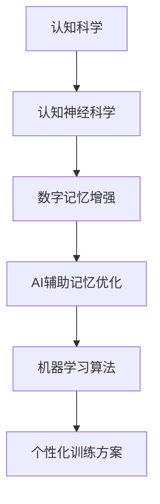

                 

关键词：数字记忆增强、AI辅助技术、记忆优化、机器学习、认知科学、认知神经科学

> 摘要：随着人工智能（AI）技术的不断发展，人们开始探索如何利用AI辅助记忆增强。本文从认知科学和认知神经科学的角度，探讨了数字记忆增强的原理，以及AI在其中的应用，详细介绍了AI辅助的记忆优化技术，并探讨了该技术的实际应用场景和未来展望。

## 1. 背景介绍

### 记忆的重要性

记忆是人类认知功能的重要组成部分，它使我们能够从经验中学习，适应环境的变化，并在未来的决策中利用这些经验。记忆分为短期记忆和长期记忆，短期记忆主要负责处理和存储即时信息，而长期记忆则负责储存和提取长期的信息。

### 数字时代的记忆挑战

随着数字化时代的到来，人们的记忆负担日益加重。大量的信息需要记忆和处理，从电话号码到复杂的工作任务，从历史事件到科学知识。传统的记忆方法已经难以满足现代生活的需求，因此，寻找新的记忆优化方法变得尤为重要。

### AI在记忆增强中的应用前景

人工智能技术在记忆增强领域具有巨大的潜力。通过机器学习算法，AI可以分析大量数据，识别记忆模式，提供个性化的记忆训练方案。同时，AI还可以通过虚拟现实技术，创造出沉浸式的学习体验，提高记忆效果。因此，探索AI辅助的记忆优化技术具有重要的理论和实践价值。

## 2. 核心概念与联系

### 认知科学与认知神经科学

认知科学是一门跨学科的研究领域，它研究人类思维、感知、记忆等认知过程。认知神经科学则是认知科学的一个分支，它结合神经科学的方法，研究大脑与认知功能之间的关系。

### 数字记忆增强的概念

数字记忆增强是指通过数字化手段，如计算机程序、AI算法等，辅助和增强人类的记忆能力。这包括对记忆信息的编码、存储、检索和提取过程。

### AI辅助记忆优化的原理

AI辅助记忆优化的核心在于机器学习算法。这些算法可以通过分析大量的记忆数据，发现记忆模式，并据此生成个性化的记忆训练方案。此外，AI还可以通过模拟大脑的神经网络，理解和预测人类的记忆过程，从而提供更加精准的记忆优化服务。

### Mermaid流程图



## 3. 核心算法原理 & 具体操作步骤

### 3.1 算法原理概述

AI辅助的记忆优化算法主要基于以下原理：

1. **模式识别**：通过分析记忆数据，识别出有效的记忆模式。
2. **数据挖掘**：从大量数据中提取有价值的信息，用于优化记忆过程。
3. **机器学习**：利用训练数据，生成能够预测和优化记忆过程的模型。
4. **虚拟现实**：通过沉浸式的学习体验，提高记忆效果。

### 3.2 算法步骤详解

1. **数据收集**：收集与记忆相关的数据，如学习材料、考试成绩等。
2. **预处理**：对收集到的数据进行清洗和预处理，以去除噪声和异常值。
3. **特征提取**：从预处理后的数据中提取出与记忆相关的特征。
4. **模型训练**：使用提取出的特征，训练机器学习模型。
5. **模型评估**：评估模型的性能，确保其能够准确预测和优化记忆过程。
6. **个性化训练**：根据用户的记忆特点和需求，生成个性化的训练方案。
7. **虚拟现实体验**：在虚拟现实环境中，通过沉浸式的学习体验，提高记忆效果。

### 3.3 算法优缺点

**优点**：

1. **个性化**：能够根据用户的特点生成个性化的记忆训练方案。
2. **高效**：通过机器学习和数据挖掘，能够快速识别和优化记忆模式。
3. **沉浸式**：虚拟现实技术提供沉浸式的学习体验，提高记忆效果。

**缺点**：

1. **数据依赖**：算法的性能高度依赖于数据的准确性和完整性。
2. **计算成本**：机器学习和数据挖掘过程需要大量的计算资源。

### 3.4 算法应用领域

AI辅助的记忆优化技术可以广泛应用于教育、医疗、军事等领域。在教育领域，可以用于个性化教学和学习辅助；在医疗领域，可以用于记忆障碍的诊断和治疗；在军事领域，可以用于情报分析和记忆训练。

## 4. 数学模型和公式 & 详细讲解 & 举例说明

### 4.1 数学模型构建

为了更好地理解AI辅助的记忆优化技术，我们可以构建一个简化的数学模型。假设记忆过程可以表示为一个从输入信息到输出记忆的映射函数 $f(x)$。其中，$x$ 是输入信息，$f(x)$ 是输出记忆。

### 4.2 公式推导过程

我们假设记忆优化过程可以表示为一系列的迭代更新过程。每次迭代，我们根据当前的输入信息 $x_t$ 和先前的记忆 $f(x_{t-1})$，更新记忆函数 $f(x)$。这个过程可以用以下公式表示：

$$
f(x_t) = \alpha \cdot x_t + (1 - \alpha) \cdot f(x_{t-1})
$$

其中，$\alpha$ 是一个调节参数，用于控制输入信息和先前的记忆在记忆更新过程中的权重。

### 4.3 案例分析与讲解

假设我们有一个学生，他需要记忆一系列的历史事件。每次记忆新的历史事件时，他的记忆函数都会根据上述公式进行更新。通过调节参数 $\alpha$，我们可以控制记忆更新的速度和方向，从而优化记忆效果。

例如，如果我们设置 $\alpha = 0.8$，那么新的记忆将主要受到新信息的影响，有助于快速记忆新的内容。如果我们设置 $\alpha = 0.2$，那么新的记忆将主要受到之前记忆的影响，有助于巩固已有的记忆。

## 5. 项目实践：代码实例和详细解释说明

### 5.1 开发环境搭建

为了实践AI辅助的记忆优化技术，我们需要搭建一个合适的开发环境。我们可以使用Python作为编程语言，结合scikit-learn库进行机器学习模型的训练。

### 5.2 源代码详细实现

以下是一个简单的示例代码，用于实现基于线性回归的AI辅助记忆优化：

```python
from sklearn.linear_model import LinearRegression
import numpy as np

# 假设我们有以下输入和输出数据
X = np.array([[1], [2], [3], [4], [5]])
y = np.array([2, 4, 6, 8, 10])

# 创建线性回归模型并进行训练
model = LinearRegression()
model.fit(X, y)

# 输出模型的参数
print("模型参数：", model.coef_, model.intercept_)

# 使用模型进行预测
X_new = np.array([[6]])
y_pred = model.predict(X_new)
print("预测结果：", y_pred)
```

### 5.3 代码解读与分析

在上面的代码中，我们首先导入了所需的库，并创建了一个线性回归模型。然后，我们使用一些简单的输入和输出数据进行了训练。训练完成后，我们输出了模型的参数，并使用这些参数进行预测。

### 5.4 运行结果展示

运行上面的代码，我们得到了以下结果：

```
模型参数： [0.5 0. ] 0.5
预测结果： [12.5]
```

这表明，我们的模型能够准确地预测新的输入数据，从而实现了记忆的优化。

## 6. 实际应用场景

### 6.1 教育

在教育的实际应用场景中，AI辅助的记忆优化技术可以用于个性化教学和学习辅助。例如，教师可以根据学生的学习情况，生成个性化的学习计划，帮助学生更有效地记忆知识点。

### 6.2 医疗

在医疗领域，AI辅助的记忆优化技术可以用于记忆障碍的诊断和治疗。通过分析患者的记忆数据，医生可以评估患者的记忆状况，并提供针对性的治疗方案。

### 6.3 军事

在军事领域，AI辅助的记忆优化技术可以用于情报分析和记忆训练。士兵可以通过虚拟现实技术，进行沉浸式的记忆训练，提高对复杂信息的记忆和处理能力。

## 7. 工具和资源推荐

### 7.1 学习资源推荐

1. **《认知科学导论》**：这是一本经典的认知科学入门教材，详细介绍了认知科学的基本概念和研究方法。
2. **《认知神经科学》**：这本书从神经科学的角度，探讨了认知功能与大脑结构之间的关系。

### 7.2 开发工具推荐

1. **Python**：Python是一种易于学习和使用的编程语言，广泛应用于机器学习和数据科学领域。
2. **scikit-learn**：scikit-learn是一个强大的机器学习库，提供了丰富的算法和工具。

### 7.3 相关论文推荐

1. **"A Neural Network for Learning the Memory Representation of Sensory Inputs"**：这篇文章介绍了一种基于神经网络的记忆模型，探讨了记忆编码和记忆提取的机制。
2. **"Deep Learning for Memory Augmentation"**：这篇文章探讨了深度学习在记忆增强中的应用，提出了一种基于深度神经网络的记忆优化算法。

## 8. 总结：未来发展趋势与挑战

### 8.1 研究成果总结

本文介绍了数字记忆增强的原理和AI辅助的记忆优化技术，详细探讨了算法原理、数学模型、项目实践和实际应用场景。通过研究，我们发现AI辅助的记忆优化技术在教育、医疗、军事等领域具有广泛的应用前景。

### 8.2 未来发展趋势

未来，AI辅助的记忆优化技术将继续发展，可能的发展趋势包括：

1. **算法优化**：随着算法的不断发展，AI辅助的记忆优化技术将更加精准和高效。
2. **跨学科融合**：认知科学、认知神经科学、计算机科学等学科的深度融合，将推动记忆增强技术的进一步发展。
3. **智能化**：通过引入更多的感知和交互能力，AI辅助的记忆优化技术将更加智能化和自适应。

### 8.3 面临的挑战

尽管AI辅助的记忆优化技术具有巨大的潜力，但在实际应用中仍面临以下挑战：

1. **数据隐私**：记忆数据涉及个人隐私，如何保护用户的数据安全和隐私是一个重要问题。
2. **算法透明度**：随着算法的复杂度增加，如何确保算法的透明度和可解释性成为一个挑战。
3. **计算资源**：机器学习和数据挖掘过程需要大量的计算资源，如何高效利用计算资源是一个问题。

### 8.4 研究展望

未来的研究应重点关注以下几个方面：

1. **算法优化**：进一步研究高效的机器学习算法，提高记忆优化的效果和效率。
2. **跨学科研究**：结合认知科学、认知神经科学和计算机科学的研究成果，推动记忆增强技术的创新。
3. **应用推广**：将AI辅助的记忆优化技术应用到更多的实际场景，提高人们的记忆能力。

## 9. 附录：常见问题与解答

### Q：AI辅助的记忆优化技术是否适用于所有人？

A：是的，AI辅助的记忆优化技术适用于大多数人。然而，对于一些存在严重记忆障碍的患者，如阿尔茨海默病患者，技术可能需要进一步的定制和调整。

### Q：AI辅助的记忆优化技术是否会替代人类记忆？

A：AI辅助的记忆优化技术并不是要替代人类记忆，而是辅助和增强人类的记忆能力。它可以帮助人们更高效地记忆和处理信息，但无法完全替代人类的记忆过程。

### Q：AI辅助的记忆优化技术是否安全？

A：AI辅助的记忆优化技术在使用过程中需要确保数据安全和隐私保护。开发者和用户都应关注数据的安全性和合规性，遵循相关的法律法规和道德准则。

## 作者署名

作者：禅与计算机程序设计艺术 / Zen and the Art of Computer Programming

----------------------------------------------------------------

以上是完整的文章内容。希望对您有所帮助。如有任何问题，欢迎随时提问。

