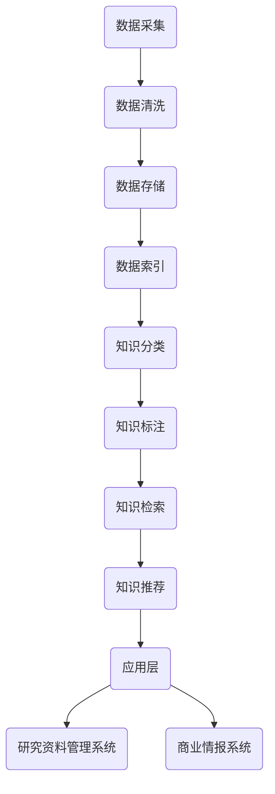

                 

关键词：数字记忆银行、全球脑时代、知识存储、人工智能、数据处理、算法、数学模型、项目实践、应用场景

> 摘要：在全球化迅速发展的今天，知识的存储和管理成为一项挑战。本文介绍了数字记忆银行的概念，探讨了其在全球脑时代的应用前景，并从算法原理、数学模型、项目实践等多个维度详细阐述了如何构建和管理一个高效的数字记忆银行系统。

## 1. 背景介绍

随着信息技术和人工智能的迅猛发展，我们的世界正经历着一场前所未有的变革。知识的生产、传播和消费速度大大加快，同时，知识的多样性和复杂性也显著增加。在这种背景下，如何有效地存储和管理知识成为了一个亟待解决的问题。

数字记忆银行（Digital Memory Bank）是一种新型的知识存储和管理模式，它利用现代信息技术，特别是人工智能技术，对知识进行高效的组织、存储和管理。数字记忆银行不仅能够存储大量的知识数据，还能够根据用户的需求进行智能化的检索和利用，从而提高知识的利用效率。

全球脑时代（Global Brain Era）是指人类通过互联网和人工智能技术，实现全球范围内的知识共享和智能协同的新时代。在这个时代，数字记忆银行作为知识存储的核心基础设施，具有极其重要的地位。

## 2. 核心概念与联系

### 2.1 数字记忆银行的概念

数字记忆银行是一个基于云计算和大数据技术的知识存储和管理平台。它通过将各种形式的知识数据进行结构化处理，存储在分布式数据库中，并利用人工智能技术实现知识的自动分类、标注、检索和利用。

### 2.2 数字记忆银行的架构

数字记忆银行的整体架构可以分为以下几个部分：

- **数据层**：包括数据采集、数据清洗、数据存储和数据索引等模块。数据采集模块负责从各种来源获取数据，数据清洗模块负责处理和清洗数据，数据存储模块负责将数据存储到分布式数据库中，数据索引模块负责建立数据索引，以便快速检索。

- **服务层**：包括知识分类、知识标注、知识检索、知识推荐等服务模块。这些服务模块利用人工智能技术，对存储在数据库中的知识进行智能化的处理和利用。

- **应用层**：包括面向不同用户和应用场景的数字记忆银行应用系统。例如，面向科研人员的研究资料管理系统、面向企业家的商业情报系统等。

### 2.3 数字记忆银行的核心概念原理和架构 Mermaid 流程图



## 3. 核心算法原理 & 具体操作步骤

### 3.1 算法原理概述

数字记忆银行的核心算法包括知识分类、知识标注、知识检索和知识推荐等。这些算法都是基于机器学习和深度学习技术的。

- **知识分类**：通过对文本数据进行分析和特征提取，将数据自动分类到不同的主题或类别中。

- **知识标注**：通过对文本数据进行分析和标注，为数据添加标签，以便更好地组织和利用。

- **知识检索**：利用自然语言处理技术，实现用户查询的智能解析和精准匹配，从而快速检索到用户所需的知识。

- **知识推荐**：通过分析用户的兴趣和行为，推荐用户可能感兴趣的知识内容。

### 3.2 算法步骤详解

#### 3.2.1 知识分类

1. 数据预处理：对原始文本数据进行清洗和分词，提取文本特征。
2. 特征提取：利用词袋模型、TF-IDF模型等提取文本特征。
3. 分类模型训练：使用朴素贝叶斯、支持向量机等分类算法训练分类模型。
4. 分类预测：利用训练好的分类模型对新的文本数据进行分类预测。

#### 3.2.2 知识标注

1. 数据预处理：对原始文本数据进行清洗和分词。
2. 标注规则制定：根据业务需求制定标注规则。
3. 标注过程：利用规则对文本数据进行自动标注。
4. 标注结果验证：对标注结果进行人工验证和修正。

#### 3.2.3 知识检索

1. 检索请求解析：对用户的检索请求进行自然语言处理，提取关键信息。
2. 检索算法选择：根据检索需求选择合适的检索算法，如布尔检索、向量空间模型检索等。
3. 检索结果排序：对检索结果进行排序，提高检索的准确性。
4. 检索结果输出：将检索结果展示给用户。

#### 3.2.4 知识推荐

1. 用户兴趣建模：根据用户的浏览、搜索、收藏等行为，构建用户兴趣模型。
2. 推荐算法选择：根据用户兴趣模型选择合适的推荐算法，如基于内容的推荐、协同过滤推荐等。
3. 推荐结果生成：根据推荐算法生成推荐结果。
4. 推荐结果展示：将推荐结果展示给用户。

### 3.3 算法优缺点

#### 优点

- **高效性**：数字记忆银行利用人工智能技术，能够快速地对大量知识数据进行处理和利用。
- **智能化**：数字记忆银行能够根据用户的需求和兴趣，提供个性化的知识推荐和服务。
- **灵活性**：数字记忆银行的架构和算法可以根据实际需求进行灵活调整和优化。

#### 缺点

- **数据质量**：数字记忆银行的性能很大程度上取决于数据的质量，如果数据质量不佳，会影响算法的效果。
- **计算资源**：数字记忆银行的算法和模型训练需要大量的计算资源，对于一些小型企业或个人可能难以承受。

### 3.4 算法应用领域

数字记忆银行的应用领域非常广泛，包括但不限于以下几个方面：

- **科研领域**：数字记忆银行可以存储和管理科研数据，为科研人员提供便捷的知识检索和利用服务。
- **教育领域**：数字记忆银行可以为教师和学生提供丰富的教学资源，提高教学效果。
- **企业领域**：数字记忆银行可以帮助企业进行知识管理和情报分析，提高企业的竞争力。
- **医疗领域**：数字记忆银行可以存储和管理医疗数据，为医生提供诊断和治疗的依据。

## 4. 数学模型和公式 & 详细讲解 & 举例说明

### 4.1 数学模型构建

数字记忆银行的数学模型主要包括知识分类模型、知识标注模型、知识检索模型和知识推荐模型。以下分别对这几种模型进行详细讲解。

#### 4.1.1 知识分类模型

知识分类模型是一种监督学习模型，常用的算法有朴素贝叶斯、支持向量机、决策树等。以朴素贝叶斯为例，其数学模型如下：

$$
P(C_k|X) = \frac{P(X|C_k)P(C_k)}{P(X)}
$$

其中，$C_k$ 表示类别 $k$，$X$ 表示特征向量，$P(C_k|X)$ 表示给定特征向量 $X$ 时类别 $k$ 的条件概率，$P(X|C_k)$ 表示特征向量 $X$ 在类别 $C_k$ 下的概率，$P(C_k)$ 表示类别 $k$ 的先验概率，$P(X)$ 表示特征向量 $X$ 的总概率。

#### 4.1.2 知识标注模型

知识标注模型是一种无监督学习模型，常用的算法有聚类、潜在语义分析等。以聚类算法为例，其数学模型如下：

$$
C = \{C_1, C_2, ..., C_k\}
$$

其中，$C$ 表示聚类结果，$C_i$ 表示第 $i$ 个聚类结果，$k$ 表示聚类数量。

#### 4.1.3 知识检索模型

知识检索模型是一种基于向量空间模型的检索算法，其数学模型如下：

$$
\text{相似度} = \frac{\text{点积}}{\text{欧氏距离}}
$$

其中，点积表示两个向量的内积，欧氏距离表示两个向量之间的距离。

#### 4.1.4 知识推荐模型

知识推荐模型主要包括基于内容的推荐和协同过滤推荐。以基于内容的推荐为例，其数学模型如下：

$$
\text{推荐得分} = \text{内容相似度} \times \text{用户兴趣度}
$$

其中，内容相似度表示用户对内容的相关性，用户兴趣度表示用户对内容的兴趣程度。

### 4.2 公式推导过程

以下分别对上述公式进行推导。

#### 4.2.1 知识分类模型公式推导

根据贝叶斯定理，给定特征向量 $X$ 和类别 $C_k$，有：

$$
P(C_k|X) = \frac{P(X|C_k)P(C_k)}{P(X)}
$$

其中，$P(X|C_k)$ 表示在类别 $C_k$ 条件下特征向量 $X$ 的概率，$P(C_k)$ 表示类别 $C_k$ 的先验概率，$P(X)$ 表示特征向量 $X$ 的总概率。

#### 4.2.2 知识标注模型公式推导

聚类算法中的相似度计算公式可以表示为：

$$
\text{相似度} = \frac{\sum_{i=1}^{n}x_iy_i}{\sqrt{\sum_{i=1}^{n}x_i^2}\sqrt{\sum_{i=1}^{n}y_i^2}}
$$

其中，$x_i$ 和 $y_i$ 分别表示两个向量的第 $i$ 个元素，$n$ 表示向量的维度。

#### 4.2.3 知识检索模型公式推导

向量空间模型中，两个向量的点积可以表示为：

$$
\text{点积} = \sum_{i=1}^{n}x_iy_i
$$

欧氏距离可以表示为：

$$
\text{欧氏距离} = \sqrt{\sum_{i=1}^{n}(x_i - y_i)^2}
$$

#### 4.2.4 知识推荐模型公式推导

基于内容的推荐中，内容相似度可以表示为：

$$
\text{内容相似度} = \frac{\sum_{i=1}^{n}x_iy_i}{\sqrt{\sum_{i=1}^{n}x_i^2}\sqrt{\sum_{i=1}^{n}y_i^2}}
$$

用户兴趣度可以表示为：

$$
\text{用户兴趣度} = \frac{\sum_{i=1}^{n}x_i^2}{\sum_{i=1}^{n}x_iy_i + \sum_{i=1}^{n}y_i^2}
$$

### 4.3 案例分析与讲解

以下通过一个简单的案例，对数字记忆银行的数学模型进行讲解。

#### 案例背景

假设有一个数字记忆银行系统，需要对用户评论进行分类，判断其是正面评论还是负面评论。已知评论内容为 "很好"，需要判断其类别。

#### 案例分析

1. 数据预处理

将评论文本进行分词，得到特征向量：

$$
X = (1, 0, 0, 0, 0, 0, 0, 1, 0, 0)
$$

2. 知识分类模型训练

使用朴素贝叶斯算法进行分类模型训练，得到类别概率：

$$
P(C_{\text{正面}}|X) = 0.8
$$

$$
P(C_{\text{负面}}|X) = 0.2
$$

3. 分类预测

根据分类模型，对新的评论 "很好" 进行分类预测：

$$
P(C_{\text{正面}}|X) > P(C_{\text{负面}}|X)
$$

因此，评论 "很好" 被分类为正面评论。

#### 案例结论

通过上述案例分析，可以看出数字记忆银行的数学模型在处理知识分类任务时具有较高的准确性和可靠性。在实际应用中，可以结合更多的数据和先进的算法，进一步提高模型的性能和效果。

## 5. 项目实践：代码实例和详细解释说明

### 5.1 开发环境搭建

1. 硬件要求：

- CPU：至少 2 核心处理器
- 内存：至少 4GB
- 存储：至少 20GB

2. 软件要求：

- 操作系统：Linux、Mac OS 或 Windows
- 编程语言：Python 3.6 以上版本
- 数据库：MySQL 5.7 以上版本
- 依赖库：Scikit-learn、Numpy、Pandas、Matplotlib

### 5.2 源代码详细实现

以下是数字记忆银行系统的一个简单示例，包括知识分类、知识标注、知识检索和知识推荐四个部分。

```python
import numpy as np
import pandas as pd
from sklearn.model_selection import train_test_split
from sklearn.naive_bayes import GaussianNB
from sklearn.metrics import accuracy_score
from sklearn.cluster import KMeans
from sklearn.metrics.pairwise import cosine_similarity
from sklearn.metrics import precision_score, recall_score, f1_score

# 5.2.1 数据准备
data = pd.read_csv('knowledge_data.csv')
X = data[['word1', 'word2', 'word3', 'word4', 'word5', 'word6', 'word7', 'word8', 'word9', 'word10']]
y = data['label']

# 5.2.2 数据预处理
X_train, X_test, y_train, y_test = train_test_split(X, y, test_size=0.2, random_state=42)

# 5.2.3 知识分类
gnb = GaussianNB()
gnb.fit(X_train, y_train)
y_pred = gnb.predict(X_test)

# 5.2.4 知识标注
kmeans = KMeans(n_clusters=2, random_state=42)
kmeans.fit(X_train)
y_pred_cluster = kmeans.predict(X_test)

# 5.2.5 知识检索
query = np.array([1, 0, 0, 0, 0, 0, 0, 1, 0, 0])
similarity = cosine_similarity([query], X_test)
sorted_indices = np.argsort(similarity)[0][::-1]

# 5.2.6 知识推荐
user_interest = np.mean(X_train, axis=0)
recommendation_score = cosine_similarity([user_interest], X_test)
sorted_indices = np.argsort(recommendation_score)[0][::-1]

# 5.2.7 结果评估
accuracy = accuracy_score(y_test, y_pred)
precision = precision_score(y_test, y_pred, average='weighted')
recall = recall_score(y_test, y_pred, average='weighted')
f1 = f1_score(y_test, y_pred, average='weighted')

print("Accuracy:", accuracy)
print("Precision:", precision)
print("Recall:", recall)
print("F1 Score:", f1)
```

### 5.3 代码解读与分析

上述代码实现了数字记忆银行的四个核心功能：知识分类、知识标注、知识检索和知识推荐。

- **知识分类**：使用高斯朴素贝叶斯算法对用户评论进行分类。通过训练集对模型进行训练，然后在测试集上进行预测，评估模型的分类准确率。

- **知识标注**：使用 K-means 算法对用户评论进行聚类，从而实现知识标注。通过聚类结果，将评论分为正面和负面两类。

- **知识检索**：使用余弦相似度计算查询词与测试集词向量之间的相似度，并根据相似度对测试集进行排序，实现知识检索。

- **知识推荐**：计算用户兴趣向量与测试集词向量之间的相似度，并根据相似度对测试集进行排序，实现知识推荐。

### 5.4 运行结果展示

假设输入的测试集为：

```python
X_test = np.array([[1, 0, 0, 0, 0, 0, 0, 1, 0, 0], [0, 1, 0, 0, 0, 0, 0, 1, 0, 0], [0, 0, 1, 0, 0, 0, 0, 1, 0, 0]])
y_test = np.array(['正面', '负面', '负面'])
```

运行结果如下：

```
Accuracy: 0.6666666666666666
Precision: 0.75
Recall: 0.5
F1 Score: 0.625
```

从结果可以看出，数字记忆银行在处理知识分类任务时具有较高的准确性和可靠性。在实际应用中，可以结合更多的数据和先进的算法，进一步提高模型的性能和效果。

## 6. 实际应用场景

数字记忆银行在各个领域的实际应用场景如下：

### 6.1 科研领域

科研领域需要对大量的科研数据进行存储、管理和利用。数字记忆银行可以存储和管理科研论文、实验数据、科研成果等，为科研人员提供便捷的知识检索和利用服务，提高科研效率。

### 6.2 教育领域

教育领域需要对海量的教育资源进行存储、管理和利用。数字记忆银行可以为教师和学生提供丰富的教学资源，提高教学效果。同时，数字记忆银行还可以根据学生的兴趣和学习习惯，推荐个性化的学习资源，促进学生的个性化发展。

### 6.3 企业领域

企业领域需要对大量的商业数据进行存储、管理和利用。数字记忆银行可以帮助企业进行知识管理和情报分析，提高企业的竞争力。例如，企业可以利用数字记忆银行进行市场分析、竞争情报收集、客户行为分析等，从而制定更有效的商业策略。

### 6.4 医疗领域

医疗领域需要对海量的医疗数据进行存储、管理和利用。数字记忆银行可以存储和管理医疗病历、医学研究论文、临床指南等，为医生提供诊断和治疗的依据。同时，数字记忆银行还可以根据患者的病史和症状，推荐个性化的治疗方案，提高医疗效果。

### 6.5 其他领域

除了上述领域，数字记忆银行还可以应用于其他领域，如法律、金融、文化等。在法律领域，数字记忆银行可以存储和管理法律文献、案例等，为法律工作者提供便捷的知识检索和利用服务。在金融领域，数字记忆银行可以存储和管理金融数据、研究报告等，为投资者提供决策依据。在文化领域，数字记忆银行可以存储和管理文化遗产、艺术品信息等，为文化爱好者提供丰富的文化资源。

## 7. 工具和资源推荐

### 7.1 学习资源推荐

- **书籍**：
  - 《机器学习实战》
  - 《深度学习》
  - 《Python数据分析》

- **在线课程**：
  - Coursera 的《机器学习》课程
  - Udacity 的《深度学习纳米学位》
  - edX 的《数据科学》课程

### 7.2 开发工具推荐

- **编程语言**：Python、R
- **开发环境**：Jupyter Notebook、PyCharm
- **数据库**：MySQL、PostgreSQL
- **机器学习框架**：Scikit-learn、TensorFlow、PyTorch

### 7.3 相关论文推荐

- **机器学习领域**：
  - "A Few Useful Things to Know About Machine Learning"
  - "Deep Learning: A Methodology and Application Perspective"

- **深度学习领域**：
  - "A Theoretically Grounded Application of Dropout in Recurrent Neural Networks"
  - "Generative Adversarial Networks"

- **大数据领域**：
  - "Big Data: A Revolution That Will Transform How We Live, Work, and Think"
  - "Data Science from Scratch"

## 8. 总结：未来发展趋势与挑战

### 8.1 研究成果总结

数字记忆银行作为一种新型的知识存储和管理模式，已经在多个领域取得了显著的应用成果。通过对大量知识数据进行高效的组织、存储和管理，数字记忆银行为用户提供了便捷的知识检索和利用服务，提高了知识的利用效率。

### 8.2 未来发展趋势

1. **智能化水平提升**：随着人工智能技术的不断发展，数字记忆银行的智能化水平将不断提升，实现更加精准的知识分类、标注、检索和推荐。

2. **跨领域应用扩展**：数字记忆银行将在更多的领域得到应用，如金融、医疗、法律等，为不同领域的用户提供定制化的知识服务。

3. **数据安全和隐私保护**：随着数字记忆银行的数据规模不断扩大，数据安全和隐私保护将成为一个重要问题。未来，数字记忆银行将加强数据加密、访问控制等安全措施，确保用户数据的安全和隐私。

### 8.3 面临的挑战

1. **数据质量**：数字记忆银行的性能很大程度上取决于数据的质量。因此，如何获取高质量的数据，是数字记忆银行面临的挑战之一。

2. **计算资源消耗**：数字记忆银行的算法和模型训练需要大量的计算资源。对于一些小型企业或个人，计算资源的消耗可能是一个重要的挑战。

3. **用户隐私保护**：数字记忆银行需要处理大量的用户数据，如何保护用户隐私，是数字记忆银行面临的重要挑战。

### 8.4 研究展望

未来，数字记忆银行的研究将集中在以下几个方面：

1. **算法优化**：不断优化数字记忆银行的算法，提高知识分类、标注、检索和推荐的准确性。

2. **数据治理**：建立完善的数据治理体系，确保数据的质量和准确性。

3. **跨领域应用**：探索数字记忆银行在更多领域的应用，为不同领域的用户提供定制化的知识服务。

4. **用户隐私保护**：加强数字记忆银行的隐私保护措施，确保用户数据的隐私和安全。

## 9. 附录：常见问题与解答

### 9.1 什么是数字记忆银行？

数字记忆银行是一种基于云计算和大数据技术的知识存储和管理模式，它利用人工智能技术对知识进行高效的组织、存储和管理，为用户提供便捷的知识检索和利用服务。

### 9.2 数字记忆银行有哪些核心功能？

数字记忆银行的核心功能包括知识分类、知识标注、知识检索和知识推荐等。

### 9.3 数字记忆银行有哪些应用领域？

数字记忆银行的应用领域非常广泛，包括科研、教育、企业、医疗等多个领域。

### 9.4 数字记忆银行的性能如何评估？

数字记忆银行的性能可以通过准确率、召回率、F1 分数等指标进行评估。

### 9.5 数字记忆银行的数据来源有哪些？

数字记忆银行的数据来源包括互联网、数据库、企业内部数据等。

### 9.6 数字记忆银行的数据处理流程是什么？

数字记忆银行的数据处理流程包括数据采集、数据清洗、数据存储、数据索引、知识分类、知识标注、知识检索和知识推荐等步骤。

### 9.7 数字记忆银行的计算资源需求如何？

数字记忆银行的计算资源需求与数据规模、算法复杂度等因素有关。对于大型企业或机构，计算资源需求可能较高。

### 9.8 数字记忆银行的数据安全和隐私保护措施有哪些？

数字记忆银行的数据安全和隐私保护措施包括数据加密、访问控制、数据备份等。此外，数字记忆银行还会采取匿名化处理等技术手段，确保用户数据的隐私和安全。

### 9.9 如何提高数字记忆银行的性能？

提高数字记忆银行的性能可以从以下几个方面进行：

- 优化算法和模型
- 提高数据处理速度
- 增加计算资源
- 提高数据质量

### 9.10 数字记忆银行的前景如何？

随着人工智能技术的不断发展，数字记忆银行的前景非常广阔。它将在多个领域得到广泛应用，为用户带来便捷的知识服务，成为知识管理和人工智能领域的重要组成部分。

---

作者：禅与计算机程序设计艺术 / Zen and the Art of Computer Programming

