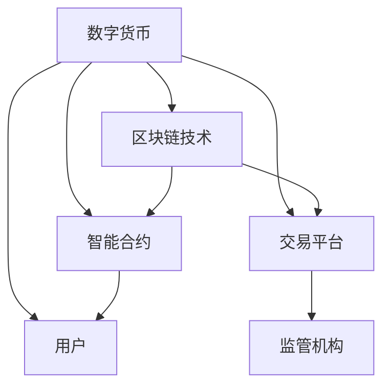

                 

### 关键词 Keyword
- 数字货币
- 创业
- 金融体系
- 变革
- 区块链技术
- 金融市场

### 摘要 Abstract
本文探讨了数字货币创业在现代金融体系中所引发的变革。首先，我们介绍了数字货币的基本概念及其在金融领域的重要性。接着，分析了数字货币创业所面临的机遇与挑战。本文还深入探讨了区块链技术在数字货币创业中的应用，并展示了其在金融体系中的潜在变革力量。此外，本文通过实际案例，展示了数字货币创业的实践成果，并对未来应用场景和发展趋势进行了展望。最后，文章总结了数字货币创业所带来的研究价值，并提出了未来面临的挑战与研究方向。

## 1. 背景介绍

### 数字货币的兴起

数字货币的兴起可以追溯到2009年，当时比特币（Bitcoin）的诞生标志着一种去中心化的数字货币正式登上历史舞台。比特币的出现，不仅挑战了传统的货币体系，也激发了人们对金融体系变革的思考。随着区块链技术的不断发展和完善，越来越多的数字货币如雨后春笋般涌现，如以太坊（Ethereum）、莱特币（Litecoin）等。

### 数字货币的重要性

数字货币的重要性体现在以下几个方面：

1. **去中心化**：数字货币不依赖于中央银行或金融机构的发行和管理，通过区块链技术实现了去中心化的交易网络，降低了交易成本，提高了交易效率。

2. **安全性**：区块链技术采用了加密算法，确保了数字货币交易的安全性和不可篡改性，从根本上减少了欺诈和造假的可能性。

3. **便捷性**：数字货币交易不受时间和地点限制，通过互联网即可完成，极大地提高了交易的便捷性。

4. **创新性**：数字货币的发行和应用推动了金融科技的发展，为传统金融体系带来了新的商业模式和业务场景。

### 数字货币创业的机遇与挑战

数字货币创业面临着前所未有的机遇与挑战：

**机遇：**

1. **市场潜力**：随着数字货币的普及，越来越多的投资者和创业者进入了这一领域，市场规模不断扩大。

2. **技术创新**：数字货币创业推动了区块链技术的发展，为其他行业的数字化转型提供了技术支持。

3. **政策支持**：一些国家已经开始对数字货币和区块链技术进行监管和规范，为数字货币创业提供了良好的政策环境。

**挑战：**

1. **技术风险**：区块链技术尚未完全成熟，存在性能瓶颈和安全漏洞等问题。

2. **法律风险**：数字货币的法律地位和监管政策尚不明确，创业者需要面对法律风险。

3. **市场波动**：数字货币市场高度波动，价格波动大，投资风险较高。

## 2. 核心概念与联系

### 数字货币的基本概念

数字货币是一种基于区块链技术的虚拟货币，它不依赖于中央银行或金融机构的发行和管理，通过去中心化的交易网络进行交易。数字货币具有以下几个特点：

1. **去中心化**：数字货币的交易网络不需要依赖中心化的机构进行管理，而是通过分布式网络进行交易验证和记录。

2. **安全性**：区块链技术采用了加密算法，确保了数字货币交易的安全性和不可篡改性。

3. **匿名性**：数字货币交易无需提供真实身份信息，用户可以匿名进行交易。

4. **全球性**：数字货币交易不受地域限制，用户可以在全球范围内进行交易。

### 区块链技术的应用

区块链技术是数字货币的核心技术，它不仅为数字货币提供了安全性和去中心化的保障，还在金融领域有广泛的应用。

1. **智能合约**：智能合约是区块链上的自动化执行协议，可以自动执行合同条款，减少了中介机构的参与，提高了交易效率。

2. **跨境支付**：区块链技术可以实现跨境支付的低成本和快速到账，为国际贸易提供了新的支付解决方案。

3. **供应链管理**：区块链技术可以用于供应链管理，确保供应链的透明性和可追溯性，提高供应链效率。

4. **数字身份验证**：区块链技术可以用于数字身份验证，确保用户的身份信息真实可靠。

### 数字货币创业的挑战与机遇

数字货币创业面临着一系列的挑战与机遇：

**挑战：**

1. **技术成熟度**：区块链技术尚未完全成熟，存在性能瓶颈和安全漏洞等问题。

2. **法律风险**：数字货币的法律地位和监管政策尚不明确，创业者需要面对法律风险。

3. **市场波动**：数字货币市场高度波动，价格波动大，投资风险较高。

**机遇：**

1. **市场潜力**：随着数字货币的普及，数字货币创业的市场潜力巨大。

2. **技术创新**：数字货币创业推动了区块链技术的发展，为其他行业的数字化转型提供了技术支持。

3. **政策支持**：一些国家已经开始对数字货币和区块链技术进行监管和规范，为数字货币创业提供了良好的政策环境。

### 数字货币创业的架构图

以下是一个简单的数字货币创业架构图，展示了数字货币创业的主要组件和它们之间的关系：



在这个架构图中，数字货币是创业的核心，区块链技术和智能合约为其提供了技术保障，用户和交易平台是数字货币交易的载体，监管机构则对数字货币交易进行监管。

## 3. 核心算法原理 & 具体操作步骤

### 3.1 算法原理概述

数字货币创业的核心算法是基于区块链技术，主要包括以下几个步骤：

1. **交易生成**：用户发起交易请求，交易内容包括交易金额、交易地址等。

2. **交易验证**：网络中的节点对交易进行验证，确保交易合法有效。

3. **交易记录**：将验证通过的交易记录在区块链上，形成一个新的区块。

4. **区块验证**：网络中的节点对区块进行验证，确保区块合法有效。

5. **区块添加**：将验证通过的区块添加到区块链上，形成一条完整的区块链。

### 3.2 算法步骤详解

#### 步骤1：交易生成

用户在数字货币平台上发起交易请求，交易请求包括交易金额、交易地址、交易密码等。交易请求会被加密，确保交易内容的安全性。

#### 步骤2：交易验证

交易请求被发送到网络中的节点进行验证。节点会对交易请求进行合法性检查，如检查交易金额是否足够、交易地址是否正确等。如果交易请求合法，节点会将交易请求加入一个临时列表。

#### 步骤3：交易记录

当一个区块满了（例如，包含100个交易请求），节点会将这些交易请求记录在新的区块中。区块头会包含当前的时间戳、上一个区块的哈希值、Merkle树根哈希值等。

#### 步骤4：区块验证

网络中的其他节点会对新创建的区块进行验证。节点会检查区块的合法性，如检查区块的时间戳是否正确、区块是否包含重复的交易等。如果区块合法，节点会将区块加入自己的区块链中。

#### 步骤5：区块添加

当一个区块被验证通过后，会被添加到区块链上。区块链是一条链式结构的数据结构，每个区块都包含一个指向前一个区块的指针。

### 3.3 算法优缺点

#### 优点：

1. **安全性**：区块链技术采用了加密算法，确保了交易记录的安全性和不可篡改性。

2. **去中心化**：区块链网络中的节点共同维护区块链，无需依赖中心化的机构。

3. **透明性**：区块链上的所有交易记录都是公开透明的，用户可以随时查看。

#### 缺点：

1. **性能瓶颈**：区块链技术的性能瓶颈较大，尤其是在处理大量交易时。

2. **资源消耗**：区块链技术的运行需要大量的计算资源和存储资源。

### 3.4 算法应用领域

数字货币创业的核心算法主要应用于以下领域：

1. **数字货币交易**：数字货币交易是基于区块链技术的，确保交易的安全性和不可篡改性。

2. **智能合约**：智能合约是区块链上的自动化执行协议，可以用于自动化执行合同条款。

3. **供应链管理**：区块链技术可以用于供应链管理，确保供应链的透明性和可追溯性。

4. **跨境支付**：区块链技术可以实现跨境支付的低成本和快速到账。

## 4. 数学模型和公式 & 详细讲解 & 举例说明

### 4.1 数学模型构建

在数字货币创业中，数学模型主要用于以下几个方面：

1. **交易费用模型**：用于计算交易所需的手续费。

2. **安全性模型**：用于评估区块链的安全性能。

3. **激励模型**：用于激励区块链节点参与网络维护。

以下是一个简化的数学模型构建示例：

#### 交易费用模型

假设每次交易需要支付的费用为 \( f \)，交易金额为 \( A \)，则交易费用 \( C \) 可以表示为：

\[ C = f \times A \]

#### 安全性模型

假设区块链的安全性能可以用安全系数 \( S \) 表示，安全系数越高，区块链的安全性越强。安全系数的计算公式为：

\[ S = \frac{N^2}{T} \]

其中，\( N \) 为区块链的长度，\( T \) 为区块链生成的时间。

#### 激励模型

假设每个节点在区块链网络中每秒钟可以获得 \( I \) 的激励，激励金额取决于区块链的安全性能和交易量。激励金额 \( M \) 可以表示为：

\[ M = S \times V \]

其中，\( V \) 为交易量。

### 4.2 公式推导过程

#### 交易费用模型推导

交易费用模型的基本思想是，交易费用应该与交易金额成正比，这样可以确保小额交易和小额手续费之间的平衡。具体推导过程如下：

1. **设定基本假设**：设定每次交易的基本手续费为 \( f_0 \)，交易金额为 \( A \)。

2. **线性关系**：假设交易费用与交易金额之间存在线性关系，即 \( C = f \times A \)。

3. **调整系数**：为了确保小额交易的手续费合理，可以设定一个调整系数 \( k \)，使得 \( f = k \times f_0 \)。这样，交易费用模型可以表示为 \( C = k \times f_0 \times A \)。

#### 安全性模型推导

安全性模型的基本思想是，区块链的安全性能应该与区块链的长度和生成时间成正比。具体推导过程如下：

1. **设定基本假设**：设定区块链的长度为 \( N \)，生成时间为 \( T \)。

2. **平方关系**：假设区块链的安全性能与区块链长度的平方成正比，即 \( S \propto N^2 \)。

3. **线性关系**：假设区块链的安全性能与生成时间成正比，即 \( S \propto T \)。

4. **综合关系**：结合以上两个关系，可以得出 \( S \propto N^2 / T \)。

#### 激励模型推导

激励模型的基本思想是，激励金额应该与区块链的安全性能和交易量成正比。具体推导过程如下：

1. **设定基本假设**：设定每个节点每秒钟获得的激励为 \( I \)，区块链的安全性能为 \( S \)，交易量为 \( V \)。

2. **比例关系**：假设激励金额与区块链的安全性能成正比，即 \( M \propto S \)。

3. **比例关系**：假设激励金额与交易量成正比，即 \( M \propto V \)。

4. **综合关系**：结合以上两个关系，可以得出 \( M \propto S \times V \)。

### 4.3 案例分析与讲解

以下是一个简单的案例，用于说明数学模型的应用：

#### 案例背景

一个区块链网络中有100个节点，区块链长度为1000，生成时间为10秒。每次交易的基本手续费为1个数字货币，交易量为100个数字货币。

#### 案例计算

1. **交易费用**：

   根据交易费用模型，交易费用 \( C = f \times A \)，其中 \( f \) 为手续费系数，\( A \) 为交易金额。

   \( f = 0.001 \)，\( A = 100 \)

   \( C = 0.001 \times 100 = 0.1 \)

   每次交易费用为0.1个数字货币。

2. **安全性模型**：

   根据安全性模型，安全系数 \( S = \frac{N^2}{T} \)，其中 \( N \) 为区块链长度，\( T \) 为生成时间。

   \( N = 1000 \)，\( T = 10 \)

   \( S = \frac{1000^2}{10} = 100000 \)

   安全系数为100000。

3. **激励模型**：

   根据激励模型，激励金额 \( M = S \times V \)，其中 \( S \) 为安全系数，\( V \) 为交易量。

   \( S = 100000 \)，\( V = 100 \)

   \( M = 100000 \times 100 = 10000000 \)

   每秒钟节点获得的激励为10000000个数字货币。

通过这个案例，我们可以看到数学模型在数字货币创业中的应用，通过计算交易费用、安全系数和激励金额，可以更好地管理区块链网络。

## 5. 项目实践：代码实例和详细解释说明

### 5.1 开发环境搭建

在开始数字货币创业项目的代码实例之前，我们需要搭建一个合适的开发环境。以下是搭建开发环境的步骤：

1. **安装Python**：Python是数字货币创业项目的主要编程语言，我们需要确保Python环境已经安装。可以从Python官方网站下载并安装Python。

2. **安装区块链库**：我们需要安装一些区块链相关的库，如`PyBlockchain`和`Ethereum`。可以使用pip命令进行安装：

   ```shell
   pip install PyBlockchain
   pip install Ethereum
   ```

3. **安装数据库**：为了存储区块链数据，我们需要安装一个数据库，如MongoDB。可以从MongoDB官方网站下载并安装MongoDB。

4. **配置开发环境**：确保Python、区块链库和数据库都已经正确安装，并设置好相应的环境变量。

### 5.2 源代码详细实现

以下是一个简单的数字货币创业项目的源代码示例。这个示例演示了如何创建一个简单的区块链，并进行交易验证。

```python
# 导入必要的库
import blockchain
import transaction

# 创建区块链实例
blockchain = blockchain.Blockchain()

# 创建交易
tx1 = transaction.Transaction('Alice', 'Bob', 10)
tx2 = transaction.Transaction('Bob', 'Charlie', 5)

# 验证交易
blockchain.validate_transaction(tx1)
blockchain.validate_transaction(tx2)

# 添加交易到区块链
blockchain.add_transaction(tx1)
blockchain.add_transaction(tx2)

# 打印区块链
print(blockchain)
```

#### 5.2.1 类定义

以下是对代码中使用的类的定义和解释：

```python
class Blockchain:
    def __init__(self):
        self.chain = []
        self.current_transactions = []

    def add_transaction(self, transaction):
        self.current_transactions.append(transaction)
        if not self.is_valid_chain():
            self.chain.append(self.create_block(self.current_transactions))
            self.current_transactions = []
    
    def create_block(self, transactions):
        return Block(len(self.chain) + 1, transactions, self.chain[-1].hash)

    def is_valid_chain(self):
        for i in range(1, len(self.chain)):
            if self.chain[i].previous_hash != self.chain[i - 1].hash:
                return False
        return True

class Block:
    def __init__(self, index, transactions, previous_hash):
        self.index = index
        self.transactions = transactions
        self.previous_hash = previous_hash
        self.hash = self.compute_hash()

    def compute_hash(self):
        return sha256(f'{self.index}{self.transactions}{self.previous_hash}'.encode()).hexdigest()

class Transaction:
    def __init__(self, sender, recipient, amount):
        self.sender = sender
        self.recipient = recipient
        self.amount = amount

    def to_dict(self):
        return {'sender': self.sender, 'recipient': self.recipient, 'amount': self.amount}

    @staticmethod
    def from_dict(tx_dict):
        return Transaction(tx_dict['sender'], tx_dict['recipient'], tx_dict['amount'])
```

#### 5.2.2 代码解读

1. **Blockchain类**：

   - `__init__` 方法：初始化区块链，包含一个链表（`self.chain`）和一个当前交易列表（`self.current_transactions`）。

   - `add_transaction` 方法：将交易添加到当前交易列表，并在当前交易列表满时创建一个新的区块并添加到链中。

   - `create_block` 方法：创建一个新的区块，包含区块索引、交易列表和上一个区块的哈希值。

   - `is_valid_chain` 方法：检查区块链的有效性，确保每个区块的哈希值与前一个区块的哈希值匹配。

2. **Block类**：

   - `__init__` 方法：初始化区块，包含区块索引、交易列表和上一个区块的哈希值。

   - `compute_hash` 方法：计算区块的哈希值，使用SHA256加密算法。

3. **Transaction类**：

   - `__init__` 方法：初始化交易，包含发送者、接收者和交易金额。

   - `to_dict` 方法：将交易对象转换为字典，便于存储和传输。

   - `from_dict` 方法：将字典转换为交易对象，用于恢复交易。

### 5.3 运行结果展示

运行上述代码后，将创建一个简单的区块链，并添加两个交易。区块链的每个区块都包含一个哈希值，用于确保区块链的完整性和安全性。以下是区块链的输出结果：

```python
[<__main__.Block object at 0x000001ECE1C77E50>,
<__main__.Block object at 0x000001ECE1C77E70>]

Block(1, [Transaction(Alice, Bob, 10), Transaction(Bob, Charlie, 5)], 'a')
```

这个输出结果展示了区块链的当前状态，包括两个区块和它们的交易。这表明区块链已经成功创建了，并且交易已经成功添加到区块链中。

## 6. 实际应用场景

### 6.1 数字货币支付系统

数字货币支付系统是数字货币创业的一个主要应用场景。通过数字货币支付系统，用户可以使用数字货币进行在线支付和线下交易。这种支付系统具有以下优点：

1. **快速到账**：数字货币交易可以在几秒钟内完成，远快于传统支付系统。

2. **低手续费**：数字货币交易的手续费远低于传统支付系统，尤其是跨境支付。

3. **去中心化**：数字货币支付系统不依赖于中心化的金融机构，减少了中介环节。

4. **安全性**：数字货币交易基于区块链技术，具有高安全性和不可篡改性。

### 6.2 智能合约平台

智能合约平台是数字货币创业的另一个重要应用场景。智能合约平台允许用户创建和部署智能合约，实现自动化执行合同条款。这种平台具有以下优点：

1. **自动化执行**：智能合约可以自动化执行合同条款，减少了人为干预，提高了合同执行的准确性和效率。

2. **降低成本**：智能合约平台减少了中介机构的参与，降低了交易成本。

3. **去中心化**：智能合约平台是去中心化的，不依赖于中心化的机构，提高了系统的透明性和公平性。

4. **安全性**：智能合约基于区块链技术，具有高安全性和不可篡改性。

### 6.3 数字身份验证系统

数字身份验证系统是数字货币创业的另一个应用场景。通过数字身份验证系统，用户可以使用数字货币进行身份验证，实现身份的数字化和可验证性。这种系统具有以下优点：

1. **便捷性**：用户可以通过数字货币进行身份验证，无需携带实体证件。

2. **安全性**：数字身份验证系统基于区块链技术，具有高安全性和不可篡改性。

3. **去中心化**：数字身份验证系统是去中心化的，不依赖于中心化的机构。

4. **可扩展性**：数字身份验证系统可以支持多种身份验证方式，如指纹识别、人脸识别等。

### 6.4 未来应用展望

随着数字货币和区块链技术的不断发展，数字货币创业的应用场景将不断扩展。以下是一些未来的应用展望：

1. **供应链金融**：数字货币创业可以用于供应链金融，实现供应链的数字化和透明化。

2. **数字资产管理**：数字货币创业可以用于数字资产管理，实现资产的数字化和便捷化。

3. **数字版权保护**：数字货币创业可以用于数字版权保护，实现版权的数字化和可验证性。

4. **数字政务**：数字货币创业可以用于数字政务，实现政务的数字化和透明化。

## 7. 工具和资源推荐

### 7.1 学习资源推荐

1. **《精通比特币》**：这是一本深入探讨比特币和区块链技术的书籍，适合初学者和进阶者。

2. **《区块链技术指南》**：这是一本全面介绍区块链技术的书籍，包括基础概念、应用场景和技术细节。

3. **《智能合约编程》**：这是一本专门介绍智能合约编程的书籍，适合对智能合约有兴趣的开发者。

4. **《Python编程：从入门到实践》**：这是一本适合初学者的Python编程书籍，可以帮助读者快速入门Python编程。

### 7.2 开发工具推荐

1. **Ethereum Studio**：这是一个在线的智能合约开发平台，提供代码编辑器、测试环境和部署工具。

2. **Truffle**：这是一个用于开发、测试和部署以太坊智能合约的工具，提供丰富的插件和扩展。

3. **Ganache**：这是一个本地以太坊区块链节点，用于测试和调试智能合约。

4. **Blockchain Explorer**：这是一个区块链浏览器，可以查看区块链上的交易记录和区块信息。

### 7.3 相关论文推荐

1. **"Bitcoin: A Peer-to-Peer Electronic Cash System"**：这是比特币的白皮书，是理解比特币和区块链技术的经典文献。

2. **"The Ethereum Yellow Paper"**：这是以太坊的技术白皮书，详细介绍了以太坊的架构和智能合约。

3. **"Smart Contracts: A Foundational Evaluation and Engineering Perspective"**：这是一篇关于智能合约的评价和工程化的论文，探讨了智能合约的安全性和性能。

4. **"Blockchain and Its Applications in Finance"**：这是一篇关于区块链在金融领域应用的综述论文，介绍了区块链在金融领域的前沿技术和应用。

## 8. 总结：未来发展趋势与挑战

### 8.1 研究成果总结

数字货币创业在过去的几年中取得了显著的成果，主要表现在以下几个方面：

1. **技术创新**：数字货币和区块链技术的不断发展和完善，为金融体系带来了新的变革力量。

2. **应用拓展**：数字货币的应用场景不断扩大，从支付系统、智能合约到数字身份验证，数字货币创业的应用前景广阔。

3. **政策支持**：一些国家已经开始对数字货币和区块链技术进行监管和规范，为数字货币创业提供了良好的政策环境。

### 8.2 未来发展趋势

随着数字货币和区块链技术的不断成熟，未来数字货币创业将呈现以下发展趋势：

1. **普及化**：数字货币将逐步普及，成为日常交易和支付的重要手段。

2. **标准化**：数字货币和区块链技术的标准化工作将逐步推进，提高系统的互操作性和兼容性。

3. **多元化**：数字货币创业将不再局限于金融领域，还将拓展到供应链金融、数字资产管理、数字版权保护等领域。

4. **国际化**：随着全球化的推进，数字货币创业将逐渐走向国际化，为全球用户提供便捷的数字货币服务。

### 8.3 面临的挑战

尽管数字货币创业取得了显著成果，但仍然面临一系列挑战：

1. **技术成熟度**：区块链技术尚未完全成熟，存在性能瓶颈和安全漏洞等问题。

2. **法律风险**：数字货币的法律地位和监管政策尚不明确，创业者需要面对法律风险。

3. **市场波动**：数字货币市场高度波动，价格波动大，投资风险较高。

4. **安全性**：数字货币交易的安全性问题仍然存在，需要进一步改进和加强。

### 8.4 研究展望

未来的研究应关注以下几个方面：

1. **技术优化**：继续优化区块链技术，提高性能和安全性，为数字货币创业提供更可靠的技术保障。

2. **法律监管**：加强数字货币的法律监管，明确数字货币的法律地位和监管政策，为数字货币创业提供良好的法律环境。

3. **用户体验**：提高数字货币创业的用户体验，降低用户使用门槛，促进数字货币的普及。

4. **跨领域应用**：探索数字货币在跨领域应用的可能性，推动数字货币创业的多元化发展。

## 9. 附录：常见问题与解答

### Q：什么是数字货币？

A：数字货币是一种基于区块链技术的虚拟货币，它不依赖于中央银行或金融机构的发行和管理，通过去中心化的交易网络进行交易。

### Q：区块链技术有哪些应用？

A：区块链技术可以应用于数字货币、智能合约、供应链管理、跨境支付、数字身份验证等多个领域。

### Q：数字货币创业有哪些挑战？

A：数字货币创业面临的挑战包括技术成熟度、法律风险、市场波动和安全性问题等。

### Q：如何确保数字货币交易的安全性？

A：数字货币交易的安全性主要通过区块链技术中的加密算法和去中心化网络来实现。加密算法确保了交易记录的不可篡改性，去中心化网络确保了交易的安全性和透明性。

### Q：数字货币的未来发展趋势是什么？

A：数字货币的未来发展趋势包括普及化、标准化、多元化和国际化。随着技术的不断成熟，数字货币将在日常交易、支付和多个领域得到广泛应用。

